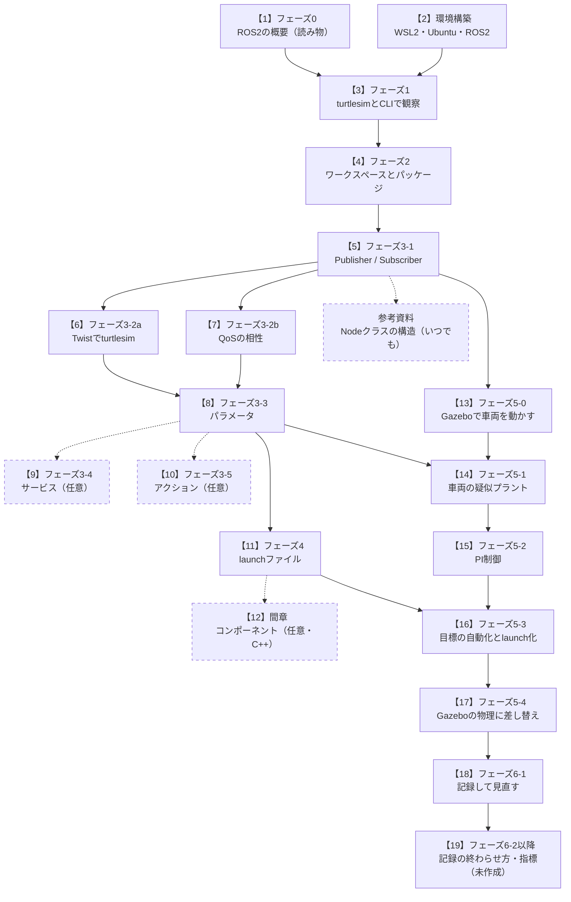

# ros2MinimalPhysicalAi

フィジカルAI（センサで周りを知り、判断し、モータなどを動かすAI）の開発に必要な技術スタックを、ROS2の最低限の構成で一通り身に着けるための学習教材です。Windowsの上のWSL2に入れたUbuntu 24.04とROS2 Jazzyを使います。最終的なゴールは、「慣性のある車両を、目標の速度に追従させるシミュレーション」をROS2のノードで組み立てることです。

各手順書では、コマンドや実行手順の直後に「期待する結果」（表示の例と、その読み方）を書いています。そのため、ROS2の環境を用意せずに読み物として読むこともできます。

## GitHubで読む

この教材は、**GitHubのページを開いて読むことを前提**にしています。リポジトリをcloneしたり、ファイルをダウンロードしたりする必要はありません。

- **手順書の間の移動**: 手順書の中の他の文書への参照は、リンクになっています。クリックすれば、その文書が開きます。
- **コマンドとサンプルコード**: コードのブロックにマウスを重ねると、右上にコピーのボタンが出ます。コマンドは1行ずつ空行で区切っているので、1行だけを選んでコピーすることもできます。サンプルコードは、手順書の指示に従って、自分のPCのファイルに貼り付けて使います。
- **練習用のファイル**: 練習で使うワークスペース（`ws/`）とその中のコードは、フェーズ2から各自のPCで一から作ります。このリポジトリから取ってくるものはありません。
- **図**: 図はSVGの画像で表示されます。同じ内容のmermaid版の図も、図の下の「同じ図（mermaid版）」を開くと表示されます。

## この教材を作った理由

筆者は、ROS2の本を1冊読んだり、講座を1つ受けたりしただけでは、ROS2を使えるようになりませんでした。振り返ってみると、つまずいた原因は次の4つにあったと考えています。

**ROS2はミドルウェアなので、学んだ成果が目に見えにくい。** ROS2は、プログラム同士をつなぐための仕組みです。それ自体が何かを動かすアプリではありません。「トピックでメッセージが届いた」「ノードが一覧に出た」という練習を重ねても、自分が何を作れるようになったのかを実感しにくいのです。

**基礎から積み上げると、実際に使う場面までの道のりが長い。** 通信の種類、ビルドの仕組み、launch、パラメータと順に学んでいくと、どれも大事なことではあります。しかし、それらを組み合わせて何かを動かす場面にたどり着くまでに長い時間がかかり、途中で手が止まってしまいます。

**目標を決めずに進むと、豊富なエコシステムを追いかけるうちに挫折する。** ROS2の周りには、シミュレータ、可視化ツール、自律移動やロボットアームのためのパッケージなど、たくさんの道具があります。目指すものが決まっていないと、どれも学ぶべきものに見えてきます。それらを理解しようとしているうちに、息切れしてしまいます。

**入門書は、入口を広くするほど、ゴールがぼやけやすい。** 入門書は多くの読者の入口になるように、幅広い話題を少しずつ扱います。それ自体は入門書の役目ですが、1冊を読み終えたときに「何ができるようになったか」がはっきりしにくくなります。

そこでこの教材では、最初にゴールを1つに決めました。「慣性のある車両を、目標の速度に追従させるシミュレーション」をROS2のノードで組み立てることです。各フェーズは、このゴールに必要な部品を1つずつ手に入れる順番に並べています。必須の範囲はゴールに必要なものに絞りました。サービスやアクションのように、ゴールに直接使わない内容は任意にしています。周辺の道具も、ゴールに使うもの（Gazeboなど）だけを実際に動かし、ほかはフェーズ0で役割を紹介するだけにとどめています。

この教材は、ROS2のすべてを網羅するものではありません。1つのゴールを作りきって「ROS2で何かを動かせた」という足場を作り、そこから必要に応じて、公式ドキュメントや他の入門書で範囲を広げていくことを想定しています。

## 対象読者

ROS2に初めて触れる人を対象にしています。ロボット工学の予備知識は要りません。次の2つを前提にしています。

**1. C++かPythonのどちらかで、プログラムを書いた経験があること**

クラスを定義して使う、関数を書く、といった基本的な書き方が分かれば十分です。両方の言語の経験は要りません。手順書のサンプルは、同じ仕様のノードをPython版とC++版で並べて載せています。そのため、片方の経験があれば、もう片方もサンプルと解説を読みながら追えるように書いています。ただし、C++はフェーズ2・3-1・4と間章で使い、ゴールの車両シミュレーション（フェーズ5）はPythonで書きます。

**2. Linuxの基本的なコマンドを、十数個ほど使ったことがあること**

手順書では、次のようなコマンドを説明なしで使います。

| コマンド | 使う場面の例 |
|---|---|
| `cd` | 作業するフォルダへ移動する |
| `ls` | フォルダの中身を確かめる |
| `pwd` | 今いるフォルダを確かめる |
| `mkdir -p` | フォルダを作る |
| `cat` | ファイルの中身を表示する |
| `mv` | ファイルを移動する・名前を変える |
| `touch` | 空のファイルを作る |
| `rm` / `rm -rf` | ファイルを消す・フォルダを中身ごと消す（学習環境が手順書の内容とずれたときに、作ったものを消して作り直す） |
| `nano` または `vim` | ターミナルの中でファイルを書き換える（どちらか一方を使えればよい） |
| `grep` | 出力やファイルから、特定の文字を含む行を探す |
| `source` | 設定用のスクリプトを読み込む（ROS2では頻繁に使う） |
| `export` / `echo` | 環境変数を設定する・中身を確かめる |
| `sudo apt install` | パッケージを導入する |

`rm -rf` は、確認なしに中身ごと消し、元に戻せません。手順書の内容と自分の環境がずれて、作り直したいときに使います（たとえば、ワークスペースの生成物の `build/`・`install/`・`log/` を消してビルドし直す、作ったパッケージを消して作り直す）。実行する前に `pwd` と `ls` で、今いる場所と消す対象を確かめます。`sudo` は付けません。

ほかに、ターミナルを複数開いて並べて使うこと、動き続けるコマンドを `Ctrl+C` で止めること、VS Codeなどのテキストエディタでファイルを書くことにも慣れているとスムーズです。Linuxに触れたことがない場合は、先にこれらのコマンドを一通り試してから始めてください。

手順書のサンプルコードは、GitHubのページからコピーして、自分のPCの練習環境のファイルに貼り付けて使います。`touch` と `nano` を使う方法と、VS Codeを使う方法を、[サンプルコードを練習環境に置く方法](docs/howto_place_code.md)にまとめています。

### 用意するもの

- Windows 11のPC（WSL2が使えるWindows 10でもよい）
- 学習の時間。所要時間は、1コマ＝1〜2時間の学習セッションを単位に書いています

### 確認した環境

この教材の作成時に、手順を試したPCの環境です。**必須の条件ではありません**。自分のPCと比べて、ビルドの時間やGUIの動きの目安にしてください。

| 項目 | 内容 |
|---|---|
| OS | Windows 11 Home（25H2、64ビット） |
| CPU | Intel Core i7-1165G7（第11世代） |
| メモリ | 8GB |
| グラフィックス | Intel Iris Xe Graphics（CPUに内蔵。専用のGPUは無い） |
| Linux環境 | WSL2 + Ubuntu 24.04 + ROS 2 Jazzy |

必要なディスクの空きの目安と、WSL2のメモリは既定の設定のままでよいことは、[環境構築の手順書](docs/setup_wsl2_ros2.md)に書いています。

## 読む順番

全体の流れは次の図のとおりです。実線の枠と矢印が必須の道筋、点線が任意の文書です。枠の先頭の【】の番号は、下の表の「順」と対応しています。



上から順に進めてください。**前提**の列は、先に済ませておく文書です。**区分**が「必須」のものは、ゴールの車両シミュレーション（フェーズ5）までに必要です。「任意」のものは、飛ばしても先へ進めます。

| 順 | 文書 | 内容 | 区分 | 前提 | 所要 |
|---|---|---|---|---|---|
| 1 | [フェーズ0: ROS2の概要と全体像](docs/phase0_overview.md) | 通信の仕組みの概要（層を積み重ねた構造）、ROS2でできること、業界ごとの活用、用語、学習の地図。コマンドは使わない | 必須（読み物） | なし | 1コマ |
| 2 | [環境構築: WSL2 + Ubuntu 24.04 + ROS2 Jazzy](docs/setup_wsl2_ros2.md) | WSL2・Ubuntu・ROS2の導入と、作業ディレクトリの用意 | 必須（2b節・7節は任意） | なし | 2時間程度 |
| 3 | [フェーズ1: turtlesimとCLIで通信を観察する](docs/phase1_cli_turtlesim.md) | 既製のノードを動かし、`ros2` コマンドとrqtで観察する。コードは書かない | 必須 | 2 | 1〜2コマ |
| 4 | [フェーズ2: ワークスペースとパッケージ](docs/phase2_packages.md) | Python・C++のパッケージを作り、`colcon build` から `ros2 run` までを通す | 必須 | 3 | 1コマ |
| 5 | [フェーズ3-1: Publisher / Subscriber](docs/phase3_1_pubsub.md) | トピックで送受信するノードを、PythonとC++の両方で書く | 必須（両言語） | 4 | 1〜2コマ |
| 6 | [フェーズ3-2a: Twistでturtlesimを動かす](docs/phase3_2a_turtlesim.md) | 速度指令 `Twist` を送って亀を動かす | 必須（C++版は任意） | 5 | 半コマ |
| 7 | [フェーズ3-2b: QoSの相性を体験する](docs/phase3_2b_qos.md) | QoSが合わないと黙ってつながらないことを確かめる | 必須（2通りを試せば十分） | 5 | 半コマ |
| 8 | [フェーズ3-3: パラメータ](docs/phase3_3_parameters.md) | 設定値の宣言、実行中の変更、YAMLでの指定 | 必須（C++版は任意） | 6・7 | 1コマ |
| 9 | [フェーズ3-4: サービス](docs/phase3_4_services.md) | 1回の要求に1回の応答を返す通信 | 任意（概要を掴めば十分） | 8 | 1コマ |
| 10 | [フェーズ3-5: アクション](docs/phase3_5_actions.md) | 途中経過つきで、中断できる長い処理の通信 | 任意（概要を掴めば十分） | 8 | 0.5〜2コマ |
| 11 | [フェーズ4: launchファイル](docs/phase4_launch.md) | 複数のノードを1つのlaunchで起動し、Python版とC++版を引数で切り替える | 必須 | 8（9・10は不要） | 1〜2コマ |
| 12 | [間章: コンポーネント](docs/interlude_components.md) | C++のノードを、配置を後から決められる部品として作り直す | 任意（C++のみ。フェーズ5はこの章に依存しない） | 5のC++版・11 | 1〜2コマ |
| 13 | [フェーズ5-0: Gazeboで用意されたロボットを動かす](docs/phase5_0_gazebo.md) | 3D物理シミュレータのGazeboを導入し、2輪の車両をトピックで走らせる | 必須 | 3・5 | 1〜2コマ |
| 14 | [フェーズ5-1: 車両の疑似プラント](docs/phase5_1_plant.md) | 車両に働く力とアクセル・ブレーキの遅れを式にしてノードで計算し、速度をGazeboの車両で見せる | 必須 | 8・13 | 2コマ |
| 15 | [フェーズ5-2: PI制御](docs/phase5_2_pi.md) | PI制御の式とゲインの目安を求め、ノードでループを閉じて目標速度に追従させる | 必須 | 14 | 2コマ |
| 16 | [フェーズ5-3: 目標の自動化とlaunch化](docs/phase5_3_launch.md) | 目標速度を階段状に送るノードを作り、一式をlaunchで起動して、追従をグラフで読む | 必須 | 11・15 | 1〜2コマ |
| 17 | [フェーズ5-4: プラントをGazeboの物理に差し替える](docs/phase5_4_gazebo_plant.md) | 車両を力で動かすワールドを用意し、PI制御ノードを変えずに、Gazeboの車両とループを閉じて比べる | 必須 | 16 | 2〜3コマ |
| 18 | [フェーズ6-1: 記録して見直す](docs/phase6_1_record.md) | 5-3・5-4の一式を `ros2 bag` で記録し、決めた時間で自動的に終わらせ、再生して `rqt_plot` に重ねて比べる | 必須 | 17 | 1〜2コマ |
| 19 | フェーズ6-2以降: 記録の終わらせ方・指標 | 条件をきっかけに記録を終わらせ、解析ノードで追従の指標を計算して条件ごとに比べる | 必須 | 18 | 2〜3コマ（未作成） |

### 順番についての補足

- **1と2は、どちらを先にしてもかまいません。** フェーズ0はROS2を導入する前でも読めます。ただ、用語の一部は環境構築を済ませた後のほうが実感しやすくなります。
- **6と7は、互いに独立したテーマです。** どちらを先にしてもかまいません。8（パラメータ）の前に両方を済ませます。
- **13（フェーズ5-0）は、3と5が済めば先に進められます。** Gazeboの車両を早く動かしてみたい場合は、6〜12より前に読んでもかまいません。launchファイルは起動するだけなので、書き方（フェーズ4）を知らなくても進められます。
- **14・15（フェーズ5-1・5-2）は、launchを使わないので、11（フェーズ4）より先に進めてもかまいません。** launchでまとめる16（フェーズ5-3）までに、11を済ませます。
- **最短で車両シミュレーションまで進むなら**、任意の9・10・12を飛ばし、1→2→3→4→5→6→7→8→11→13→14→15→16→17→18→19の順に進めます。

### 必要になったときに読む資料

| 文書 | 内容 | 読める時期 |
|---|---|---|
| [参考資料: Nodeクラスの構造](docs/reference_node_class.md) | `rclpy` と `rclcpp` の `Node` クラスの中身を、クラス図で読み解く | フェーズ3-1（上の表の5）の後、いつでも |
| [サンプルコードを練習環境に置く方法](docs/howto_place_code.md) | GitHubのページからコピーしたコードを、`touch` と `nano`、またはVS Codeで練習環境のファイルに置く | フェーズ3-1で最初にサンプルコードを置く前 |
| [Tips集](docs/tips.md) | 本文に入れなかった小さな補足（シミュレーション時刻、`CMakeLists.txt` の読み方、ビルド中の `SetuptoolsDeprecationWarning`、トピック通信の裏側、パラメータを利用者に知らせる方法、ROS2の通信の層の詳細、ROS1との違い、名前空間が効く範囲） | 関係する手順書を読んでいるとき（項目ごとに独立） |

## 計画と記録の文書

教材そのものではありませんが、この教材がなぜこの構成になっているかを知りたいときに読む文書です。

| 文書 | 内容 |
|---|---|
| [docs/idea_origin.md](docs/idea_origin.md) | 企画の出発点。ロードマップ（ステップ0〜7）と技術選定の理由 |
| [docs/learning_plan.md](docs/learning_plan.md) | ロードマップを、学習の5テーマとPython/C++の2言語の視点で実行順に並べ直した計画。フェーズごとの完了条件と、手順書の確認状況の一覧もここにある |
| [docs/qa_log.md](docs/qa_log.md) | 構成や方針を決めたときの判断の記録 |

## フォルダの構成

```text
ros2MinimalPhysicalAi/
├── README.md
├── docs/          手順書・参考資料・計画の文書
│   └── img/       手順書の図（SVG。本文のmermaid図と同じ内容）
└── ws/            練習用のワークスペース（フェーズ2で各自が作る。この教材のリポジトリでは .gitignore で除外している）
```

これは、このリポジトリのフォルダの構成です。GitHubで読む場合は、この構成を意識する必要はありません。手順書のコマンドは、各自のPCに作る `~/work/ros2MinimalPhysicalAi` というフォルダを作業の起点として書いています（環境構築の6節）。練習コード（`ws/`）もGitで管理したい場合の方法は、フェーズ2の2-8節にあります。

## 確認の状況

手順書のサンプルコードは、使い捨てのワークスペースで `colcon build` が通ること、Pythonのモジュールが `import` できること、launchファイルが `ros2 launch --print` で読み込めることまで確かめています。フェーズ3-1以降の多くは、ノードを実際に起動した後の表示を、コードとROS2の仕様から想定して書いています。実機の表示と違う場合は、実機の表示を優先してください。各手順書の確認の状況は、冒頭の注記と [docs/learning_plan.md](docs/learning_plan.md) の「手順書一覧」に書いています。

## 出典について

文章は自分の言葉で書いたもので、ROS2の公式ドキュメントの転載ではありません。環境構築の手順書の一部には、公式ドキュメント（CC BY 4.0）のコマンドを抜粋しています。公式ドキュメントに基づいてコマンドやAPIの使い方を書いた手順書には、末尾に出典とライセンスを書いています。

この教材の文章とサンプルコードは、AIのコーディング支援ツール（Claude Code）を使って作成しました。

## ライセンス

商用を含めて自由に使い、改変し、再配布できます。条件は、作者（SanghunIm1991）とライセンスを表示することです。

- サンプルコードとコマンド: [Apache License 2.0](LICENSE-APACHE-2.0)（ROS2本体や、手順書で作るパッケージと同じライセンスです）
- 文章と図: [CC BY 4.0](https://creativecommons.org/licenses/by/4.0/)（ROS 2の公式ドキュメントと同じライセンスです）

公式ドキュメントから抜粋したコマンドなど、第三者の著作物は元のライセンスに従います。対象の範囲と第三者の著作物の一覧、表示の例は [LICENSE](LICENSE) に書いています。
