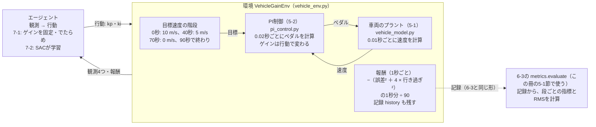

# フェーズ7-1 手順書: 車両の環境を作る（PI制御のゲインを選ぶ環境）（没案・旧版）

> **没案（2026-10-03）**: この冊は、フェーズ7の最初の版である。目標速度の階段が1通りに決まっていたため、既定のゲインがほぼ最良になり、強化学習でゲインを調整する意味が収益に表れにくかった。そこで、目標速度をランダムに変えるシナリオで、フェーズ7-1から作り直すことにした（経緯は [`docs/qa_log.md`](../qa_log.md) の2026-10-03の行）。記録として残しているもので、読む順番には含まない。リンク先の他の冊は、この冊を作った時点から変わっていることがある。

[`docs/learning_plan.md`](../learning_plan.md) フェーズ7の7-1（[`docs/idea_origin.md`](../idea_origin.md) ステップ6）に対応する。フェーズ5-1の車両のプラントと、フェーズ5-2のPI制御を、Gymnasiumの環境として包む。エージェントは、決めた間隔ごとにPI制御のゲイン（`kp`・`ki`）を選び、環境は追従の良し悪しを報酬として返す。この冊では、環境を作ってSB3の `check_env` で点検し、ゲインを固定した方策やでたらめな方策で動かして、報酬の性質を確かめるところまでを扱う。強化学習でゲインを学ばせるのは、次の7-2である。

- 想定環境: WSL2 + Ubuntu 24.04 + ROS2 Jazzy（学習はROS2を使わず、ワークスペースのコードだけを借りる）
- 前提: フェーズ7-0（[`docs/phase7_0_rl_intro.md`](../phase7_0_rl_intro.md)）。フェーズ6-3（[`docs/phase6_3_metrics.md`](../phase6_3_metrics.md)）までを終え、`~/ros2_ws` の `learn_py` に、5-1の `vehicle_model.py`・5-2の `pi_control.py`・6-3の `metrics.py` があり、ビルドしてあること
- 所要目安: 2コマ
- 言語: Python（ROS2のノードは書かない）

> **この手順書の位置づけ（暫定）**: フェーズ7は作成中で、構成を大きく改める可能性がある。この冊の環境の設計（観測・行動・報酬）も、7-2で学習させる中で見直すことがある。

> **進め方**: 1節で全体像を見て、2節で環境の設計（何を観測し、何を選ばせ、何を報酬にするか）を決める。3節で、ワークスペースのコードを仮想環境から読み込めるようにする。4節で環境のクラスを書き、5節で点検して動かす。サンプルは学習の手がかりとして最小限に書いたもので、公式の文書の転載ではない。Gymnasiumの環境の決まりごとは、公式の文書（Create a Custom Environment）を自分の言葉でまとめた。

> **実行環境が無くても読めるように**: 実行する手順の直後には「期待する結果」として、表示される内容の例とその読み方を載せている。**期待する結果は、筆者の環境（2026-10-02。SB3 2.9.0・Gymnasium 1.3.0。導入は [`docs/setup_rl_sb3.md`](../setup_rl_sb3.md)）で、各スクリプトを実際に実行した表示**である。作成時は、ワークスペースをビルドする代わりに、5-1・5-2・6-3の手順書のコードと同じ3つのファイルを置いたフォルダを、環境変数 `PYTHONPATH` に加えて読み込んだ（3節の `source` が行うのと同じ仕組み）。報酬と指標の値は、同じ版なら何度実行しても同じになる。この冊の5-3節の学習の途中経過の表は、PCとライブラリの版によって変わることがあり、同じPCと同じ版なら `rollout/`・`train/` の値は同じになるが、`time/` の行（かかった時間）は実行ごとに変わる。

## 0. 学習目標と完了条件

1. Gymnasiumの環境のクラスが持つべきもの（観測と行動の空間、`reset`、`step`）を説明し、自分で書ける。
2. 車両の環境の観測・行動・報酬・エピソードを、フェーズ5・6の部品に当てはめて説明できる。
3. 行動を−1〜1にそろえる理由と、報酬の合計（収益）とフェーズ6-3のRMSの関係を説明できる。
4. SB3の `check_env` で環境を点検し、ゲインを固定した方策とでたらめな方策の収益を比べられる。

完了条件: 5節で、`check_env` が通り、既定のゲイン（`kp` 0.5・`ki` 0.1）での段ごとの指標とRMSが、フェーズ6-3の比較表の「5-3 既定」の値とほぼ一致することを確かめる。そのうえで、ゲインと収益の表から、最もよいゲインの位置がプラントの時定数で変わることと、この報酬の上では既定のゲインがどちらのプラントでも最もよい組に近いことを説明できる。

## 1. 全体像

フェーズ5-2では、PI制御のゲインを、式から目安を立て、シミュレーションで確かめながら手で決めた。フェーズ5-2の6-5節では、ブレーキの時定数を変えると、同じゲインでも減速で行き過ぎることを見た。時定数が変わるたびに人がゲインを調整し直すのは手間がかかる。この調整を、強化学習のエージェントに任せられないか。これが、フェーズ7の前半（7-1〜7-3）の題材である。

エージェントに試行錯誤させるには、まず「試す場所」が要る。フェーズ7-0の振り子では、Gymnasiumが環境を用意してくれていた。車両では、自分で環境を作る。と言っても、中身を一から書くわけではない。プラントの計算（5-1の `VehicleModel`）も、PI制御の計算（5-2の `PIController`）も、ROS2を使わないクラスとしてすでにある。この冊では、それらを「エージェントが行動を選び、環境が観測と報酬を返す」という強化学習の形に包む。


<details>
<summary>同じ図（mermaid版）</summary>



</details>

- エージェントが選ぶのは、ペダルではなく**ゲイン**である。ペダルは、これまでどおりPI制御が0.02秒ごとに計算する。エージェントは1秒ごとに、そのPI制御のゲインを選び直す。
- 環境の中の計算は、フェーズ5-2の4-2節の `closed_loop_sim.py` と同じ（プラントを0.01秒、制御を0.02秒ごとに進める）。違うのは、1秒ごとに外からゲインを受け取ることと、報酬を計算して返すことである。
- 環境は、計算した速度の並びを、フェーズ6-3の4節の `metrics.py` と同じ形（時刻・目標・速度・ペダル）で残す。こうしておくと、6-3の指標の関数をそのまま当てはめて、6-3で記録を解析した結果と答え合わせができる（この冊の5-1節）。

## 2. 環境の設計

### 2-1. Gymnasiumの環境の決まりごと

Gymnasiumの環境は、クラス `gymnasium.Env` を受け継いだクラスとして書く。フェーズ7-0の3節で、用意された環境を `reset` と `step` で動かした。自分で環境を書くときは、その2つと、観測・行動の範囲を、自分で用意する。公式の文書（Create a Custom Environment）が示す決まりごとを、この冊に要る範囲でまとめる。

| 用意するもの | 役割 |
|---|---|
| `self.observation_space` | 観測の形と範囲。連続値なら `spaces.Box(low, high, shape, dtype)` |
| `self.action_space` | 行動の形と範囲。同じく `spaces.Box` |
| `reset(seed=None, options=None)` | 新しいエピソードを始め、`(最初の観測, info)` を返す。最初に `super().reset(seed=seed)` を呼ぶ（環境の乱数 `self.np_random` の種が決まる） |
| `step(action)` | 行動を1回受け取って環境を進め、`(観測, 報酬, terminated, truncated, info)` の5つを返す（7-0の3-1節と同じ） |

`info` は、学習には使わない付加的な情報を入れる辞書である。この冊では、選んだゲインや、報酬の内訳を入れる。

環境を書いたら、SB3の **`check_env`** で点検する。`check_env` は、空間の定義、`reset`・`step` の戻り値の形、観測が空間の範囲に収まっているかを確かめ、決まりごとから外れていればエラーで、SB3で学習しにくい作りなら警告で知らせる（SB3の公式の文書「Using Custom Environments」）。

### 2-2. 観測・行動・報酬・エピソード

フェーズ7-0の2-2節の用語の表に、この冊の環境を当てはめる。

| 用語 | この冊の環境 |
|---|---|
| エージェント | ゲインを選ぶもの（この冊では、ゲインを固定した方策とでたらめな方策。7-2でSACに学習させる） |
| 環境 | 目標速度の階段・PI制御・車両のプラントを、まとめて計算するもの |
| 行動 | PI制御のゲイン `kp`（0〜2）と `ki`（0〜0.5）。環境には−1〜1の2つの数で渡す（2-3節） |
| 観測 | 目標速度・現在速度・偏差（どれも10 m/sで割る）と、PI制御の積分の項の4つ |
| 報酬 | 1秒ごとに、誤差の二乗と行き過ぎの二乗から計算する負の数（2-4節） |
| ステップ | 1秒（ゲインを選ぶ間隔。引数 `decision_interval` で変えられる） |
| エピソード | 目標速度の階段を1回最後まで走る、90秒（90ステップ）。走り切ると `terminated`（課題の終わり）で終わる（2-5節） |
| 方策 | 観測からゲインを選ぶ規則（この冊では、いつも同じゲインを返す規則と、でたらめに選ぶ規則。7-2ではSACのNN） |
| 収益 | 1エピソード（90ステップ）の報酬の合計（2-4節で、RMSとの関係を示す） |

**なぜペダルではなくゲインを選ばせるのか**: エージェントにペダルを直接選ばせれば、PI制御そのものをNNに置き換えることになる。これはフェーズ7-4で扱う予定である。ゲインを選ばせる形なら、制御の仕組み（PI制御）は人が理解できるまま残り、エージェントはその調整だけを受け持つ。フェーズ5-2で人が行った調整を、エージェントに置き換える形である。

**なぜ一定の間隔ごとに選び直すのか**: 間隔を1秒にすると、エージェントは、走っている途中の状況（目標が変わった直後か、落ち着いた後か）を見てゲインを変えられる。間隔をエピソード全体（90秒）にすれば、エピソードの始めに1組だけ選ぶ形になる（この冊の5-2節で使う）。1つの環境で、両方の形を試せる（ただし、1秒ごとに選ぶ形には、観測に時刻が無いことによる注意がある。2-5節の末尾）。7-2では、エピソードの始めに1組を選ぶ形で、固定のゲインの調整を学習させる。1秒ごとに選び直す形は、状況に応じてゲインを変える7-3で使う予定である。

**観測に積分の項を入れる理由**: PI制御は、積分の項という「記憶」を持っている（フェーズ5-2の2-1節）。同じ目標と速度でも、積分の項が違えば、PI制御が出すペダルは違う。エージェントがゲインを選ぶときに、その記憶の状態を見られるように、観測に入れた。

**観測を10 m/sで割る理由**: SB3の公式の文書（Reinforcement Learning Tips and Tricks）は、範囲が分かっているなら観測を正規化（およそ−1〜1の大きさにそろえること）するよう勧めている。NNは、入力の大きさがそろっているほうが学びやすいためである。目標と速度は0〜20 m/s程度なので10で割り、積分の項は、もともとペダルと同じ−1〜1程度の大きさなので、そのまま使う。観測の空間は、余裕をみて−5〜5とした。

### 2-3. 行動を−1〜1にそろえる

ゲインの範囲は `kp` が0〜2、`ki` が0〜0.5だが、環境が受け取る行動は、どちらも−1〜1の数にする。環境の中で、次の式でゲインに引き延ばす。

$$
K_p = \frac{a_0 + 1}{2} \times 2.0, \qquad K_i = \frac{a_1 + 1}{2} \times 0.5
$$

$a_0$・ $a_1$ が行動の2つの数である。−1が下限（0）、1が上限、0がちょうど真ん中にあたる。既定のゲイン（`kp` 0.5・`ki` 0.1）は、行動では $a_0 = -0.5$ 、 $a_1 = -0.6$ になる。

SB3の公式の文書（Tips and Tricks）は、連続値の行動の範囲を、−1〜1の対称な範囲にそろえるよう勧めている。範囲がそろっていないと、学習の初めの探索がかたよったり、範囲の端に張り付いたりして、学習がうまく進まないことがあり、原因にも気づきにくいからである。範囲をそろえても、環境の中で引き延ばせば、選べるゲインは制限されない。`check_env` も、行動の範囲が−1〜1でなければ警告を出す（この冊の5-1節の末尾の課題1で確かめる）。

選べる範囲を `kp` 0〜2、`ki` 0〜0.5にしたのは、既定のゲイン（0.5・0.1）を含み、フェーズ5-2の4-2節で振動した `kp` 5.0・`ki` 2.0は含まない範囲にするためである。範囲を広げすぎると、エージェントは意味の無い領域の試行に時間を使う。

### 2-4. 報酬

報酬は、フェーズ6-3の9節で考えた2つの案を合わせた形にした。全体の1つの数（RMSの二乗にあたる、誤差の二乗の平均）に、行き過ぎの減点を重み付きで足す。1秒（1ステップ）ごとに、その1秒の間の誤差 $e = r - v$（目標 − 速度）と、行き過ぎ $o$ を、0.01秒ごとに積み上げる。

$$
\text{報酬} = -\frac{1}{90} \sum_{\text{その1秒の間}} \left( e^2 + 4\, o^2 \right) \Delta t
$$

- $\Delta t$ はプラントの刻み幅（0.01秒）、90はエピソードの長さ（秒）である。
- **行き過ぎ** $o$ は、目標が変わった向きに、速度が目標を超えた量である（超えていなければ0）。目標を上げた段では「速度 − 目標」、下げた段では「目標 − 速度」の正の部分になる。フェーズ6-3の2-2節の行き過ぎ量と同じ向きの考え方で、こちらは割合ではなく速度の差（m/s）のまま使う。
- 目標を超えた側の誤差は、 $e^2 + 4 o^2 = 5 e^2$ となり、5倍重く数えることになる。目標に届かない側の誤差は、 $o = 0$ なので $e^2$ のままである。

**収益とRMSの関係**: 1エピソードの報酬を全部足すと、90秒全体で $e^2 + 4 o^2$ を積み上げて90で割った量のマイナスになる。つまり、誤差の二乗の平均（RMSの二乗）に、行き過ぎの二乗の平均の4倍を足したもののマイナスである。

$$
\text{収益} = -\left( \text{RMS}^2 + 4 \times \text{行き過ぎの二乗の平均} \right)
$$

行き過ぎが無ければ、収益はちょうど $-\text{RMS}^2$ であり、収益から $\text{RMS} = \sqrt{-\text{収益}}$ が求まる。収益が大きい（0に近い）ほど、追従がよい。報酬を90で割ったのは、収益を、エピソードの長さによらない「平均」の大きさにそろえるためである。

> **補足: 報酬の重みの決め方**
>
> - **一般的な考え方**: 報酬に複数の項を足し合わせるとき、それぞれの重みは「何をどれだけ嫌うか」という設計者の判断である。強化学習のエージェントは、報酬を大きくすることだけを目指すので、報酬に入れなかった性質（例: 乗り心地）は気にしないし、重みの比のとおりに性質を取引する。
> - **この環境で重みを4にした理由**: フェーズ6-3の7-2節の比較表のとおり、RMSだけでは「行き過ぎるが速い」と「行き過ぎないが遅い」の区別がつかない。車両では、目標を超える（前の車に近づきすぎる）ほうが、届かないより困ることが多い。そこで、超えた側を5倍重く数えるように、筆者が目安として4を選んだ。この冊の5-2節で、重みの有無による違いを確かめる。
> - **実務の目安**: 重みは、学習させた結果の振る舞い（行き過ぎ量・整定時間などの指標）を見て調整する。報酬の値だけを見ていると、重みを変えたことによる見かけの改善と、本当の改善を取り違えやすい。そのため、報酬とは別に、6-3の指標のような「人が読める数」で結果を確かめる。

### 2-5. エピソードの長さと目標速度の階段

目標速度の階段は、フェーズ6-1の4-3節の記録用のYAML（`target_generator` の階段の既定の10秒で10 m/s、50秒で5 m/s、80秒で0 m/sに、`end_time` の100秒で終わりを加えたもの）から、最初の10秒（目標0で止まっている間）を除いたものにした。0秒で10 m/s、40秒で5 m/s、70秒で0 m/sに変わり、90秒で終わる。最初の10秒は、どのゲインでも誤差が0で、学習の材料にならないからである。こうしておくと、既定のゲインでの結果を、フェーズ6-3で記録を解析した結果と比べられる（この冊の5-1節）。

この環境には、失敗して終わる条件（フェーズ7-0の3-1節のCartPoleで、棒が倒れる、のようなもの）が無い。エピソードは常に、目標速度の階段を最後まで走り切った90秒で終わる。このとき、`step` は `terminated`（課題の終わり）を `True` にして返す。

フェーズ7-0の2-3節で見たとおり、Gymnasiumは終わり方を2つに分け、学習のアルゴリズムはこの2つを違うものとして扱う。振り子は、本来はいつまでも続けられる課題を、200ステップで区切っているだけなので、`truncated`（時間切れ）だった。アルゴリズムは「この先も報酬が続いていたはず」とみなし、終わりの観測からの見込み（その先の収益の見積もり）を収益に足し込んで学ぶ。一方、この環境の90秒は、走るコース（目標速度の階段）そのものの終わりで、その先に続きは無い。そのため `terminated` にする。ここを `truncated` にすると、アルゴリズムは、存在しない「90秒より後」の収益まで見積もろうとして、学習が乱れる（フェーズ7-2の5節の末尾の課題3で確かめる）。

この扱いは、7-2で使う、エピソードの始めに1組を選ぶ形（1回の `step` で90秒を走り切る）では、そのまま成り立つ。1秒ごとに選ぶ形では、注意が要る。観測（2-2節）には時刻が入っていないので、エージェントは、次に目標がいつ変わるか、エピソードがあと何秒で終わるかを、観測から知ることができない。例えば、20秒と35秒の状態（どちらも目標10 m/sに落ち着いた車両）は同じに見えるが、次の段の変わり目（40秒）までの長さが違い、その先に受け取る報酬も違う。Gymnasiumの公式の文書（Handling Time Limits）は、長さの決まった課題を `terminated` で終えるなら、残りの時間を観測に入れる必要があると述べている。1秒ごとに選ぶ形で学習させる7-3で、観測に時刻（残りの時間）を足すかどうかを見直す予定である。この冊では、1秒ごとに選ぶ形は、この冊の5-1節・5-3節で環境が動くことを確かめるのに使うだけである。

## 3. ワークスペースのコードを読み込めるようにする

環境は、5-1の `vehicle_model.py`、5-2の `pi_control.py`、6-3の `metrics.py` を、`learn_py` パッケージから読み込む。この3つは `rclpy` を使わないので、ROS2のノードを起動しなくても、Pythonの普通のモジュールとして読み込める。ROS2の一式（5-3・5-4）と同じファイルを使うので、7-2以降で学んだゲインをROS2の一式で確かめるときに、計算の食い違いが起きない。

`learn_py` を読み込めるようにするのは、ワークスペースの `install/setup.bash` である。`source` すると、環境変数 `PYTHONPATH`（Pythonがモジュールを探す場所の一覧）に、ワークスペースのPythonのパッケージの場所が加わる。仮想環境を有効にしても `PYTHONPATH` は残るので、仮想環境のPythonからも `learn_py` が見える（[強化学習の環境構築の5節](../setup_rl_sb3.md)）。

ビルドは、これまでどおり、仮想環境を有効に**していない**ターミナルで行う（環境構築の5節）。5-1・5-2・6-3のファイルをビルド済みなら、ビルドし直す必要はない。強化学習のスクリプトを動かすターミナルでは、次のように準備する。

```bash
source ~/ros2_ws/install/setup.bash

source ~/rl_venv/bin/activate

cd ~/rl_practice

python -c "from learn_py.vehicle_model import VehicleModel; from learn_py.pi_control import PIController; from learn_py.metrics import evaluate; print('learn_py: OK')"
```

**期待する結果**:

```text
learn_py: OK
```

プロンプトの先頭に `(rl_venv)` が付き、`learn_py: OK` と表示されれば、仮想環境のPythonから、ワークスペースの3つのモジュールを読み込めている。この冊のスクリプトは、7-0と同じ練習用のフォルダ `~/rl_practice` に置く。新しいターミナルを開いたら、最初の2つの `source` からやり直す。

## 4. 環境のクラス（`vehicle_env.py`）

ファイル: `~/rl_practice/vehicle_env.py`（ファイルの置き方は [サンプルコードを練習環境に置く方法](../howto_place_code.md)）

```python
# 5-1の車両のプラントと5-2のPI制御を、Gymnasiumの環境として包む（ROS2を使わない）。
# エージェントは、決めた間隔ごとにPI制御のゲイン（kp・ki）を選び直す。
import gymnasium as gym
import numpy as np
from gymnasium import spaces

from learn_py.pi_control import PIController
from learn_py.vehicle_model import VehicleModel, VehicleParams

PLANT_DT = 0.01        # プラントの計算の刻み幅 [s]（5-2の closed_loop_sim と同じ）
CONTROL_PERIOD = 0.02  # 制御の周期 [s]（5-2の closed_loop_sim と同じ）
KP_MAX = 2.0           # 選べる kp の上限（下限は0）
KI_MAX = 0.5           # 選べる ki の上限（下限は0）
# 目標速度の階段（時刻 [s], 目標 [m/s]）とエピソードの長さ。6-1の記録の階段から、最初の10秒を除いたもの
TARGET_STEPS = [(0.0, 10.0), (40.0, 5.0), (70.0, 0.0)]
EPISODE_LENGTH = 90.0


# 行動（-1〜1の2つの数）を、ゲイン（kp・ki）に引き延ばす。
def action_to_gains(action):
    a = np.clip(action, -1.0, 1.0)
    return (a[0] + 1.0) / 2.0 * KP_MAX, (a[1] + 1.0) / 2.0 * KI_MAX


# ゲイン（kp・ki）を、行動（-1〜1の2つの数）に直す。action_to_gains の逆。
def gains_to_action(kp, ki):
    return np.array([kp / KP_MAX * 2.0 - 1.0, ki / KI_MAX * 2.0 - 1.0], dtype=np.float32)


# 時刻 t の目標速度と、その直前の目標速度（最初の段では0）を、TARGET_STEPS から求める。
def targets_at(t):
    values = [0.0] + [value for start, value in TARGET_STEPS if t >= start]
    return values[-1], values[-2]


# 車両のPI制御のゲインを選ぶ環境。観測は目標・速度・偏差・積分の項の4つ、行動はゲイン2つ。
class VehicleGainEnv(gym.Env):
    # decision_interval 秒ごとにゲインを選ぶ。overshoot_weight は、目標を超えた側の誤差の重みの上乗せ。
    def __init__(self, decision_interval=1.0, overshoot_weight=4.0, params=None):
        self.decision_interval = decision_interval
        self.overshoot_weight = overshoot_weight
        self.params = params if params is not None else VehicleParams()
        self.observation_space = spaces.Box(low=-5.0, high=5.0, shape=(4,), dtype=np.float32)
        self.action_space = spaces.Box(low=-1.0, high=1.0, shape=(2,), dtype=np.float32)

    # 止まった車両と、積分の項が0のPI制御器から、新しいエピソードを始める。
    def reset(self, seed=None, options=None):
        super().reset(seed=seed)
        self.plant = VehicleModel(self.params)
        self.controller = PIController(kp=0.0, ki=0.0)
        self.step_count = 0  # プラントを進めた回数（時刻は step_count × PLANT_DT）
        self.pedal = 0.0
        self.history = []    # (時刻, 目標, 速度, ペダル) の並び。6-3の metrics.evaluate に渡せる
        return self._observation(), {}

    # ゲインを行動のとおりに変え、decision_interval 秒分を計算して、報酬を返す。
    def step(self, action):
        kp, ki = action_to_gains(action)
        self.controller.kp = kp
        self.controller.ki = ki
        steps_per_control = round(CONTROL_PERIOD / PLANT_DT)
        squared_error = 0.0
        squared_overshoot = 0.0
        for _ in range(round(self.decision_interval / PLANT_DT)):
            t = self.step_count * PLANT_DT
            target, previous = targets_at(t)
            if self.step_count % steps_per_control == 0:
                self.pedal = self.controller.update(target - self.plant.velocity, CONTROL_PERIOD)
            self.history.append((round(t, 2), target, self.plant.velocity, self.pedal))
            error = target - self.plant.velocity
            # 目標が変わった向きに、速度が目標を超えた量（超えていなければ0）
            direction = 1.0 if target > previous else -1.0
            overshoot = max(0.0, -error * direction)
            squared_error += error ** 2 * PLANT_DT
            squared_overshoot += overshoot ** 2 * PLANT_DT
            self.plant.step(self.pedal, PLANT_DT)
            self.step_count += 1
        # 報酬: 誤差の二乗と、目標を超えた分の二乗（重み付き）の、エピソードの長さあたりの量のマイナス
        reward = -(squared_error + self.overshoot_weight * squared_overshoot) / EPISODE_LENGTH
        terminated = self.step_count * PLANT_DT >= EPISODE_LENGTH - 1e-9
        info = {'kp': kp, 'ki': ki,
                'squared_error': squared_error / EPISODE_LENGTH,
                'squared_overshoot': squared_overshoot / EPISODE_LENGTH}
        return self._observation(), float(reward), terminated, False, info

    # 観測: 目標・速度・偏差（どれも10 m/sで割る）と、PI制御の積分の項。
    def _observation(self):
        target, _ = targets_at(self.step_count * PLANT_DT)
        v = self.plant.velocity
        obs = np.array([target / 10.0, v / 10.0, (target - v) / 10.0,
                        self.controller.integral], dtype=np.float32)
        return np.clip(obs, -5.0, 5.0)
```

**`vehicle_env.py` の解説**

- **定数**: `PLANT_DT`・`CONTROL_PERIOD` は、フェーズ5-2の4-2節の `closed_loop_sim.py` と同じ値。`TARGET_STEPS` と `EPISODE_LENGTH` が、2-5節の目標速度の階段とエピソードの長さである。
- **`action_to_gains`・`gains_to_action`**: 2-3節の式と、その逆。`gains_to_action` は、「このゲインを選ぶ行動」を作るときに使う（5節で、ゲインを固定した方策を作るのに使う）。`action_to_gains` の `np.clip` は、範囲の外の行動が来ても、ゲインを範囲の端に収める。
- **`targets_at`**: 時刻 `t` の目標と、その直前の目標を返す。`TARGET_STEPS` のうち、始まりの時刻を過ぎたものの値を順に並べ、その先頭に0を足すと、最後が今の目標、最後から2番目が直前の目標になる。例えば `t` が50秒なら、並びは `[0.0, 10.0, 5.0]` で、今の目標は5、直前は10。
- **`__init__`**: 2-1節の表の2つの空間を作る。観測は4つの数で範囲は−5〜5、行動は2つの数で範囲は−1〜1。`params` で、プラントのパラメータ（5-1の `VehicleParams`。時定数など）を変えられる（この冊の5-2節で、ブレーキの遅いプラントを作るのに使う）。
- **`reset`**: 最初に `super().reset(seed=seed)` を呼ぶ（2-1節）。この環境は、計算に乱数を使わないので、種によって結果は変わらない。プラントとPI制御器を作り直し、時刻と記録を0から始める。PI制御器のゲインは、最初の `step` で行動から決まるので、ここでは0にしておく。
- **`step`**: 2-4節の報酬を計算する部分が、`closed_loop_sim.py` の `simulate` に加わったものである。
  - 最初に、行動からゲインを求め、PI制御器の `kp`・`ki` を書き換える。フェーズ5-2の4-1節の `PIController` は、積分の項に $K_i$ を掛けた値を持っているので、ここで `ki` を変えても、それまでに育った積分の項は変わらず、ペダルが急に跳ねない（5-2の4-1節の解説の最後の項目）。
  - `decision_interval` 秒分（既定では100回）、プラントを0.01秒ずつ進める。2回に1回（0.02秒ごと）だけ、PI制御器がペダルを計算し直す。
  - 0.01秒ごとに、誤差の二乗と行き過ぎの二乗を、刻み幅を掛けて積み上げる（2-4節の式の $\sum (\cdots) \Delta t$）。行き過ぎ `overshoot` は、`-error * direction`（目標を上げた段では「速度 − 目標」、下げた段では「目標 − 速度」）の正の部分。
  - `terminated` は、時刻が90秒に達したら `True` にする（2-5節）。`1e-9` は、小数の計算の誤差で、わずかに90に届かない場合に備えたものである。`truncated` は、常に `False`。
  - `info` には、選んだゲインと、報酬の内訳（誤差の二乗の分と、行き過ぎの二乗の分。どちらも90で割った値）を入れる。
- **`_observation`**: 観測の4つの数を作る（2-2節）。`np.float32` で作り、`np.clip` で観測の空間（−5〜5）に収める。観測が空間の外に出ると、`check_env` が誤りとして知らせる。

## 5. 点検して動かす

### 5-1. `check_env` で点検し、既定のゲインで1エピソード動かす

ファイル: `~/rl_practice/check_vehicle_env.py`

```python
# 車両の環境を check_env で点検し、ゲインを固定した方策とでたらめな方策で動かして比べる。
import numpy as np
from stable_baselines3.common.env_checker import check_env

from learn_py.metrics import evaluate, format_report
from vehicle_env import VehicleGainEnv, gains_to_action


# 方策 policy で1エピソード動かし、収益とステップ数を返す。
def run_episode(env, policy):
    obs, info = env.reset()
    total, steps = 0.0, 0
    while True:
        obs, reward, terminated, truncated, info = env.step(policy(obs))
        total += reward
        steps += 1
        if terminated or truncated:
            return total, steps


# 環境が残した (時刻, 目標, 速度, ペダル) の並びから、記録全体のRMSを計算する。
def rms_of(history):
    errors = [target - v for _, target, v, _ in history]
    return float(np.sqrt(np.mean(np.square(errors))))


# 点検 → 既定のゲインで1エピソード → ゲインの組とでたらめな方策の比較、の順に行う。
def main():
    env = VehicleGainEnv()
    check_env(env)
    print('check_env: OK')
    print('observation_space:', env.observation_space)
    print('action_space     :', env.action_space)
    obs, info = env.reset()
    print('first observation:', obs)

    default = gains_to_action(0.5, 0.1)
    print('default action   :', default)
    total, steps = run_episode(env, lambda obs: default)
    print(f'\nkp=0.5, ki=0.1: return {total:.3f}  steps {steps}')
    # 0秒から目標10で始まるので、その前に目標0のサンプルを1つ足して、0→10の段を作る（6-3の4節と同じ）
    rows = [(-0.01, 0.0, 0.0, 0.0)] + env.history
    times, targets, velocities, pedals = (list(c) for c in zip(*rows))
    for line in format_report(*evaluate(times, targets, velocities, pedals)):
        print('  ' + line)

    env.action_space.seed(0)
    policies = {
        'kp=0.5, ki=0.1': lambda obs: default,
        'kp=0.2, ki=0.05': lambda obs: gains_to_action(0.2, 0.05),
        'kp=2.0, ki=0.5': lambda obs: gains_to_action(2.0, 0.5),
        'random': lambda obs: env.action_space.sample(),
    }
    print('\npolicy           return  RMS[m/s]')
    for name, policy in policies.items():
        total, steps = run_episode(env, policy)
        print(f'{name:15s} {total:7.3f}  {rms_of(env.history):7.3f}')


if __name__ == '__main__':
    main()
```

- `run_episode` は、フェーズ7-0の3-2節の同じ名前の関数に、ステップ数の数え上げを足したものである（7-0の版は `seed` を受け取るが、この環境は乱数を使わないので省いた）。
- `rms_of` は、環境が残した記録から、90秒全体のRMSを計算する。
- `main` の前半で、`check_env` で点検し、既定のゲインで1エピソード動かして、フェーズ6-3の `evaluate`・`format_report` で段ごとの指標を表示する。記録の先頭に目標0のサンプルを1つ足すのは、フェーズ6-3の4節の `main` と同じ理由（0 → 10の段を作るため）である。
- 後半で、3通りのゲインの組と、でたらめな方策（`env.action_space.sample()`。1秒ごとに、でたらめなゲインを選ぶ）の収益とRMSを比べる。`env.action_space.seed(0)` は、7-0の3-2節と同じく、でたらめな行動の並びを毎回同じにするためのものである。

```bash
python check_vehicle_env.py
```

**期待する結果**:

```text
check_env: OK
observation_space: Box(-5.0, 5.0, (4,), float32)
action_space     : Box(-1.0, 1.0, (2,), float32)
first observation: [1. 0. 1. 0.]
default action   : [-0.5 -0.6]

kp=0.5, ki=0.1: return -3.151  steps 90
  step          over[%]  rise[s]  settle[s]  error  sat[s]
   0.0 -> 10.0     0.00    6.19    13.75   +0.00    6.08
  10.0 ->  5.0     0.00    0.95     6.69   -0.00    0.48
   5.0 ->  0.0     0.00    0.83     7.80   -0.01    0.58
  RMS error: 1.775 m/s

policy           return  RMS[m/s]
kp=0.5, ki=0.1   -3.151    1.775
kp=0.2, ki=0.05  -3.364    1.825
kp=2.0, ki=0.5   -3.139    1.769
random           -3.377    1.836
```

- **1〜3行目**: `check_env` が、警告も誤りも出さずに通った。観測と行動の空間は、4節の `__init__` で決めたとおりである。
- **`first observation`**: 最初の観測は、目標1.0（10 m/s ÷ 10）、速度0、偏差1.0、積分の項0。**`default action`** は、既定のゲインを2-3節の式で行動に直した値（−0.5・−0.6）である。
- **段ごとの指標**: フェーズ6-3の7-2節の比較表の「5-3 既定」の列と比べる。0 → 10の段（立ち上がり6.19秒・整定13.75秒・張り付き6.08秒）と、10 → 5の段の立ち上がり・張り付きは、表の値と一致する。10 → 5の段の整定時間（6.69秒と6.66秒）、5 → 0の段の整定時間（7.80秒と7.78秒）、RMS（1.775と1.776 m/s）は、わずかに違う。6-3の表は、ノードをつないだ一式の記録を解析した値で、ノードの間でメッセージが届く時刻のずれが含まれるためと考えられる。実際、ROS2を使わずに計算したフェーズ6-3の4節の `python3 -m learn_py.metrics` の表示では、10 → 5の段の整定時間が6.69秒で、この環境の値と一致する。同じプラントとPI制御を、環境の中で正しく再現できている。
- **`return -3.151`**: 既定のゲインでは行き過ぎが無いので、収益は $-\text{RMS}^2 = -1.775^2 \approx -3.151$ に等しい（2-4節）。`steps 90` は、1秒ごとに90回ゲインを選んだことを表す。
- **最後の表**: 収益が大きい（0に近い）ほど、よい追従である。`kp` 2.0・`ki` 0.5は、既定よりわずかによく、`kp` 0.2・`ki` 0.05は、目標への近づき方が遅く、悪くなる。でたらめな方策は、4つの中で最も悪いが、既定との差は約0.23しかない。次の5-2節で、その理由を見る。

> 課題1: `main` の `env = VehicleGainEnv()` の次の行に、`env.action_space = gym.spaces.Box(low=0.0, high=2.0, shape=(2,), dtype=np.float32)` を足し（ファイルの先頭に `import gymnasium as gym` も足す）、行動の範囲を−1〜1でなくした環境を `check_env` で点検する。`UserWarning: We recommend you to use a symmetric and normalized Box action space (range=[-1, 1])` という警告が出る（2-3節）。確かめたら、足した2行を消して元に戻す。

### 5-2. ゲインと収益の表を作る

この冊の5-1節で、ゲインを変えても収益の差が小さいことが分かった。ゲインの組を格子状に変えて、収益がどう変わるかを表にする。ここでは、`decision_interval` をエピソードの長さ（90秒）にして、エピソードの始めにゲインを1組だけ選ぶ形にする（2-2節）。プラントは、既定のものと、ブレーキの時定数を1.0秒に遅くしたもの（フェーズ5-2の6-5節、フェーズ6-3の比較表の `tau_brake` 1.0）の2つで比べる。

ファイル: `~/rl_practice/gain_landscape.py`

```python
# エピソード全体で1組のゲインを使う形にして、ゲインの組ごとの収益を表にする（プラントの2つの条件で）。
from learn_py.vehicle_model import VehicleParams
from vehicle_env import EPISODE_LENGTH, VehicleGainEnv, gains_to_action

KP_LIST = [0.1, 0.25, 0.5, 1.0, 2.0]
KI_LIST = [0.0, 0.05, 0.1, 0.2, 0.5]


# ゲイン kp・ki のまま1エピソード動かし、収益を返す（ゲインを選ぶのは1回だけ）。
def episode_return(env, kp, ki):
    env.reset()
    obs, reward, terminated, truncated, info = env.step(gains_to_action(kp, ki))
    return reward


# 既定のプラントと、ブレーキの遅いプラントで、ゲインの組ごとの収益を表にする。
def main():
    for name, params in [('default', VehicleParams()),
                         ('tau_brake=1.0', VehicleParams(tau_brake=1.0))]:
        env = VehicleGainEnv(decision_interval=EPISODE_LENGTH, params=params)
        print(name)
        print('  kp \\ ki' + ''.join(f'{ki:8.2f}' for ki in KI_LIST))
        for kp in KP_LIST:
            print(f'  {kp:6.2f} ' + ''.join(f'{episode_return(env, kp, ki):8.3f}' for ki in KI_LIST))


if __name__ == '__main__':
    main()
```

- `episode_return` は、`step` を1回だけ呼ぶ。`decision_interval` が90秒なので、1回の `step` で90秒分を計算し、エピソードが終わる（`terminated` が `True` になる）。1ステップしか無いので、その報酬がそのまま収益になる。
- `'  kp \\ ki'` の `\\` は、文字の `\` を1つ表示するための書き方である（表の左上に「行が `kp`、列が `ki`」と示す）。

```bash
python gain_landscape.py
```

**期待する結果**:

```text
default
  kp \ ki    0.00    0.05    0.10    0.20    0.50
    0.10  -14.704  -4.552  -4.562  -5.287  -6.126
    0.25   -5.873  -3.264  -3.254  -3.368  -3.742
    0.50   -3.911  -3.189  -3.151  -3.133  -3.150
    1.00   -3.332  -3.160  -3.146  -3.136  -3.131
    2.00   -3.188  -3.151  -3.147  -3.143  -3.139
tau_brake=1.0
  kp \ ki    0.00    0.05    0.10    0.20    0.50
    0.10  -14.837  -4.820  -5.976  -8.775  -9.711
    0.25   -6.258  -3.455  -3.703  -4.539  -5.829
    0.50   -4.327  -3.430  -3.403  -3.425  -3.601
    1.00   -3.826  -3.555  -3.521  -3.512  -3.524
    2.00   -3.772  -3.691  -3.667  -3.649  -3.645
```

行が `kp`、列が `ki` で、各欄がそのゲインでの収益である。

- **左の列（`ki` 0）**: P制御だけでは、目標に届かない偏差が残る（フェーズ5-2の2-2節）。`kp` 0.1では偏差が大きく、収益は−14.7と、ほかより大幅に悪い。
- **既定のプラント（上の表）**: `ki` が0.05以上で、`kp` が0.5以上なら、収益は−3.13〜−3.19の間にほぼそろう。どのゲインでも、およそ−3.1より上には行けない。目標が変わった直後は、ペダルを踏み切っても（アクセル全開に約6秒張り付く。この冊の5-1節の `sat[s]`）速度が追いつかず、その間の誤差はゲインでは減らせないからである。この冊の5-1節で、でたらめな方策と既定のゲインの差が小さかったのも、このためである。
- **ブレーキの遅いプラント（下の表）**: 最もよいのは `kp` 0.5・`ki` 0.1の付近（−3.403）で、`kp` を上げるほど悪くなる（`kp` 2.0では−3.6〜−3.8）。ブレーキの効きが遅れる間に、減速の段で目標を下回り（行き過ぎ）、2-4節の重み付きの減点を受けるためである。既定のプラントでは、`kp` を上げてもほとんど悪くならなかったのと対照的である。
- **読み取れること**: 最もよいゲインの位置は、プラントの時定数によって変わる。既定のプラントでは `kp` を上げても悪くならないが、ブレーキの遅いプラントでは `kp` を上げるほど悪くなる。
- **ただし、差は小さい**: この報酬の上では、既定のゲイン（0.5・0.1）は、どちらのプラントでも最もよい組に近い。既定のプラントでは表の最もよい組（−3.131）との差が0.02ほどで、ブレーキの遅いプラントでは表の中で最もよい。フェーズ5-2の6-5節やフェーズ6-3の比較表で目立った、10 → 5の段の行き過ぎ（22%）は、収益ではわずかな減点にしかならないからである。6-3の比較表の `tau_brake` 1.0のRMS（1.825 m/s）で概算すると、収益−3.403のうち、RMSの二乗の分が約3.33で、行き過ぎの減点は約0.07（2%ほど）しかない（2-4節の収益とRMSの関係）。6-3の値は、この冊の5-1節で見たとおり、この環境の値とわずかに違うが、概算の結論（行き過ぎの減点は収益の数%）は変わらない。行き過ぎが続くのは数秒で、90秒全体の平均の中では小さいためである。
- **7-2・7-3へ**: 時定数が変わったときに、ゲインを選び直す価値がどれだけあるかは、報酬に何を込めるかで変わる。7-2では、この報酬のまま、学習したゲインを収益と6-3の指標の両方で比べ、収益では見えない違いを確かめる。7-3（時定数を学習中にランダムに変え、状況に応じてゲインを変える）では、報酬の形も合わせて見直す予定である。

> 課題2: `main` の `VehicleGainEnv(decision_interval=EPISODE_LENGTH, params=params)` に `overshoot_weight=0.0` を足し、行き過ぎの減点を外して実行する。ブレーキの遅いプラントの表で、`kp` 2.0・`ki` 0.5の収益が−3.645から−3.364に上がり、最もよいゲイン（−3.327。`kp` 0.5・`ki` 0.2）との差が小さくなる。重みの4が、「行き過ぎを嫌う」という設計の判断を、収益の差として表していることが分かる（2-4節の補足）。確かめたら、足した引数を消して元に戻す。
>
> 課題3: `check_vehicle_env.py` の `VehicleGainEnv()` を `VehicleGainEnv(decision_interval=0.5)` に変えると、既定のゲインのエピソードのステップ数と収益はどうなるか。予想してから確かめる（ステップ数は180に増えるが、ゲインを固定した方策では、計算そのものは変わらないので、収益は−3.151のまま）。確かめたら、`VehicleGainEnv()` に戻す。

### 5-3. SB3の学習につなぐ

最後に、この環境で、SB3のSACの学習がそのまま動くことを確かめる。学習の成果を見るのは7-2なので、ここでは10エピソード分だけ動かす。

ファイル: `~/rl_practice/smoke_sac.py`

```python
# 車両の環境で、SB3のSACを少しだけ動かし、学習の流れにつながることを確かめる（学習の成果は見ない）。
from stable_baselines3 import SAC

from vehicle_env import VehicleGainEnv


# 10エピソード分（900ステップ）だけ学習させ、途中経過の表を出す。
def main():
    model = SAC('MlpPolicy', VehicleGainEnv(), verbose=1, seed=0)
    model.learn(total_timesteps=900, log_interval=5)


if __name__ == '__main__':
    main()
```

フェーズ7-0の4-2節の `train_sac_pendulum.py` と同じ形で、環境を `gym.make('Pendulum-v1')` から `VehicleGainEnv()` に差し替え、ステップ数を900に減らし、モデルの保存と評価を省いたものである。自分で作った環境も、Gymnasiumの決まりごとに従っていれば、用意された環境と同じようにSB3に渡せる。

```bash
python smoke_sac.py
```

**期待する結果**（最初の3行と、最後の途中経過の表の抜粋。数は、PCとライブラリの版によって変わる。`time/` の行は実行ごとに変わる）:

```text
Using cpu device
Wrapping the env with a `Monitor` wrapper
Wrapping the env in a DummyVecEnv.
...
---------------------------------
| rollout/           |          |
|    ep_len_mean     | 90       |
|    ep_rew_mean     | -3.23    |
| time/              |          |
|    episodes        | 10       |
|    fps             | 85       |
|    time_elapsed    | 10       |
|    total_timesteps | 900      |
| train/             |          |
|    actor_loss      | -5.7     |
|    critic_loss     | 0.0428   |
|    ent_coef        | 0.787    |
|    ent_coef_loss   | -0.803   |
|    learning_rate   | 0.0003   |
|    n_updates       | 799      |
---------------------------------
```

- 途中経過の表は、5エピソードごとに出る（`log_interval=5`）。表の読み方は、フェーズ7-0の4-2節と同じである。
- **`ep_len_mean` 90**: 1エピソードが90ステップ（1秒ごとに90回ゲインを選ぶ）で終わっている。
- **`ep_rew_mean` −3.23**: 10エピソードの収益の平均である。学習の初めは、SACがほぼでたらめに行動を選ぶので、この冊の5-1節のでたらめな方策（−3.377）や既定のゲイン（−3.151）と同じくらいの値になる。10エピソードでは、まだ学習の成果は見えない。
- この表が出て、誤りなく終われば、環境はSB3の学習の流れにつながっている。学習させてゲインを調整するのは、7-2で行う。

## 6. 本フェーズのまとめ

- Gymnasiumの環境は、観測と行動の空間、`reset`、`step` を用意したクラスとして書く。書いたら、SB3の `check_env` で点検する。
- 車両の環境では、エージェントが1秒ごとにPI制御のゲインを選び、環境の中では、5-2と同じPI制御とプラントの計算が進む。観測は、目標・速度・偏差と、PI制御の積分の項である。
- 行動は−1〜1にそろえ、環境の中でゲインに引き延ばす。観測も、大きさがおよそ−1〜1になるように割る。
- 報酬は、誤差の二乗と、重みを付けた行き過ぎの二乗のマイナスで、エピソードの収益は「RMSの二乗 ＋ 4 × 行き過ぎの二乗の平均」のマイナスになる。
- 既定のゲインでの結果は、フェーズ6-3で記録を解析した値とほぼ一致した。ゲインと収益の表から、収益にはゲインで減らせない部分があること、最もよいゲインの位置がプラントの時定数で変わることが分かった。ただし、この報酬の上では、既定のゲインはどちらのプラントでも最もよい組に近く、行き過ぎの減点は収益のわずかな部分にしかならない。

## 7. つまずきやすい点

| 症状 | 確認すること |
|---|---|
| `ModuleNotFoundError: No module named 'learn_py'` | このターミナルで `source ~/ros2_ws/install/setup.bash` をしたか（3節）。5-1・5-2・6-3のファイルを置いて、`colcon build` をしたか |
| `ModuleNotFoundError: No module named 'gymnasium'`（または `stable_baselines3`） | 仮想環境を有効にしたか（プロンプトに `(rl_venv)` があるか） |
| `No module named 'vehicle_env'` | `~/rl_practice` で実行しているか（`pwd`）。`vehicle_env.py` が同じフォルダにあるか |
| `check_env` が、観測が空間に含まれないという誤りを出す | `_observation` で `dtype=np.float32` にしているか、`np.clip` で−5〜5に収めているか |
| 収益がこの冊の5-1節の期待する結果と違う | `TARGET_STEPS`・`EPISODE_LENGTH`・`overshoot_weight` の値を変えていないか。5-1・5-2の `vehicle_model.py`・`pi_control.py` を、手順書から変えていないか（課題で変えたままになっていないか） |
| ROS2のノードが、ビルドし直した後に動かなくなった | 仮想環境を有効にしたまま `colcon build` しなかったか（[強化学習の環境構築の5節](../setup_rl_sb3.md)） |

## 8. 次へ

次の7-2（[`docs/archive/phase7_2_gain_tuning_v1.md`](phase7_2_gain_tuning_v1.md)）では、この環境でSACにゲインを選ばせて学習させる。エピソードの始めに1組を選ぶ形（`decision_interval=90.0`）で学習させ、強化学習を使わない格子の探索（この冊の5-2節の表を細かくしたもの）の結果や、手で決めた既定のゲインと、収益とフェーズ6-3の指標で比べる。

## 9. 公式ドキュメント・参考資料

確認状況（2026-10-02）: 下のページは、実在を確認した（HTTP 200）。2-2節・2-3節のSB3の勧め（観測の正規化、行動を−1〜1にそろえる）は、Tips and Tricksのページの本文で、`check_env` の警告は、導入したSB3 2.9.0のソース（`stable_baselines3/common/env_checker.py`）と実行した表示で確かめた。Handling Time Limitsのページ（2-5節の末尾の、残りの時間を観測に入れること）は、2026-10-03に本文を確かめた。

- [Gymnasium — Create a Custom Environment](https://gymnasium.farama.org/introduction/create_custom_env/)（2-1節の環境の決まりごと）
- [Gymnasium — Env](https://gymnasium.farama.org/api/env/)（`reset`・`step` の引数と戻り値の詳しい説明）
- [Gymnasium — Handling Time Limits](https://gymnasium.farama.org/tutorials/gymnasium_basics/handling_time_limits/)（2-5節の、長さの決まった課題の終わり方と、残りの時間を観測に入れること）
- [Stable-Baselines3 — Using Custom Environments](https://stable-baselines3.readthedocs.io/en/master/guide/custom_env.html)（自作の環境をSB3で使う方法と `check_env`）
- [Stable-Baselines3 — Env Checker](https://stable-baselines3.readthedocs.io/en/master/common/env_checker.html)（`check_env` の引数）
- [Stable-Baselines3 — Reinforcement Learning Tips and Tricks](https://stable-baselines3.readthedocs.io/en/master/guide/rl_tips.html)（自作の環境の注意。観測と行動の正規化、報酬の設計）

> 出典: 2-1節のGymnasiumの環境の決まりごとと、2-5節の末尾のGymnasiumの時間の扱い、2-2節・2-3節のSB3の勧めは、それぞれの公式の文書を自分の言葉で要約・再構成したもので、逐語の転載ではない。この冊の5-1節の課題1の警告の文面は、SB3（Copyright (c) 2019 Antonin Raffin, MIT License）の `check_env` の表示である（MIT Licenseの全文は [`LICENSE-MIT-THIRD-PARTY`](../../LICENSE-MIT-THIRD-PARTY)）。この冊のサンプルコード（`vehicle_env.py`・`check_vehicle_env.py`・`gain_landscape.py`・`smoke_sac.py`）は独自に書いたもので、フェーズ5-1・5-2・6-3のサンプルを読み込んで使う。
