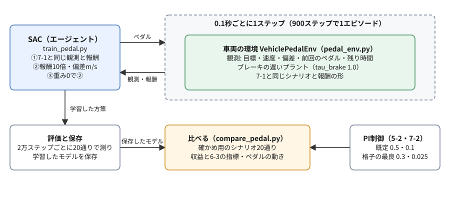
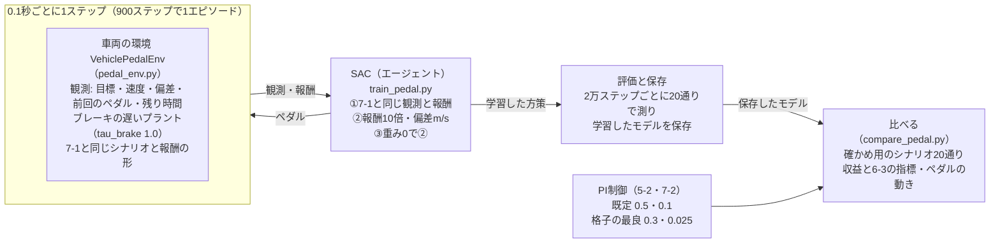

# フェーズ7-3 手順書: PI制御をNNの方策に置き換える（没案・旧版）

> **没案（2026-10-05）**: このページは、フェーズ7-3の最初の版である。学習にはROS2を使わないPythonの車両の式を使っていた。NNのパートからは、フェーズ5-4で作ったGazeboの物理で学習させる形に作り直すことにしたため（経緯は [`docs/qa_log.md`](../qa_log.md) の2026-10-05の行）、作り直す前の版を記録として残している。読む順番には含まない。リンク先の他のページは、このページを作った時点から変わっていることがある。

[`docs/learning_plan.md`](../learning_plan.md) フェーズ7の7-3（[`docs/idea_origin.md`](../idea_origin.md) ステップ6）に対応する。フェーズ7-2では、PI制御の式はそのままにして、ゲインだけを強化学習に選ばせた。このページでは、PI制御の式そのものをやめ、観測からペダルを直接選ぶ方策（ニューラルネットワーク、NN）を、SB3のSACに学習させる。学習したNNは、目標の速度を追いかけるところまでは身につける。しかし、このページの設定と学習の長さでは、手で決めたPI制御には届かない。その結果を、フェーズ6-3の指標で正直に確かめ、なぜ届かないのか、NNを改良するには何を試せるのかを考える。

- 想定環境: WSL2 + Ubuntu 24.04 + ROS2 Jazzy（学習はROS2を使わず、ワークスペースのコードだけを借りる）
- 前提: フェーズ7-2（[`docs/phase7_2_gain_tuning.md`](../phase7_2_gain_tuning.md)。`~/rl_practice` に7-1の `vehicle_env.py` と7-2の `grid_search.py` があり、7-1の3節の準備で `learn_py` を読み込める）
- 所要目安: 2〜3コマ（計算を待つ時間が、課題を除いて1時間強ある）
- 言語: Python（ROS2のノードは書かない。学習したNNをROS2のノードで動かすのは、このページの後編（作成予定）で扱う）

> **この手順書の位置づけ（暫定）**: フェーズ7は作成中で、構成を大きく改める可能性がある。

> **進め方**: 1節で全体像を見て、2節でペダルを選ぶ環境を作り、点検する。3節で学習のスクリプトを書き、①7-1と同じ観測と報酬、②報酬を10倍にして偏差をそのまま渡す、の順に学習させる。4節で、学習の乱数の種を変えると結果がどれだけ変わるかを見る。5節で、③行き過ぎの重みを0にして学習させ、PI制御と、フェーズ6-3の指標で比べる。6節でNNがPI制御に届かない理由を考え、7節でNNを改良するときに試せることを整理する。サンプルは学習の手がかりとして最小限に書いたもので、公式の文書の転載ではない。

> **実行環境が無くても読めるように**: 実行する手順の直後には「期待する結果」として、表示される内容の例とその読み方を載せている。**期待する結果は、筆者の環境（2026-10-04。SB3 2.9.0・Gymnasium 1.3.0）で、各スクリプトを実際に実行した表示**である。フェーズ7-1・7-2と同じく、`learn_py` はワークスペースをビルドする代わりに、同じファイルを置いたフォルダを `PYTHONPATH` に加えて読み込んだ。環境を点検するスクリプトと比べるスクリプトの値は、学習したモデルが同じなら、何度実行しても同じになる。学習は乱数の種を固定しているので、同じPC・同じ版・同じ設定なら、途中経過の値は何度実行しても同じになる。ただし、このページの学習は、PCや版、計算に使うスレッドの数が違うと、途中経過も学習したNNも大きく変わる（4節の、学習の乱数の種によるばらつき）。`time[s]` の列（学習を始めてからの秒数）は、実行ごとに変わる。4節の表の「スレッドの数2」の列と、課題1の期待する結果と、7節の表は、作成時に別の条件（4つの学習を並べて動かし、計算に使うスレッドの数を2にした）で測った値で、本文のコマンドで同じ値になるとは限らない。

## 0. 学習目標と完了条件

1. PI制御の代わりに、観測からペダルを直接選ぶ環境を作り、PI制御の積分のような記憶が無い方策に、何を観測として渡すかを説明できる。
2. ペダルを選ぶ方策を、SACに学習させられる。
3. 学習の乱数の種を変えると結果が大きく変わることを確かめ、設定の良し悪しを1回の学習で決めてはいけない理由を説明できる。
4. 行き過ぎの重みを変えると、NNの方策でも、追従の速さと行き過ぎのバランスが変わることを、フェーズ6-3の指標で説明できる。
5. 学習したNNと手で決めたPI制御を比べ、NNが届かない理由と、改良のために試せることを説明できる。

完了条件: 5節の比較表から、NNの方策がPI制御に届かないことと、重みによる行き過ぎ量の違いを読み取れる。そのうえで、4節の表を根拠に、3節の①と②の1回ずつの比較が、なぜ逆の結論を示したのかを説明できる。

## 1. 全体像

フェーズ7-2の結論は、「ゲインのように選ぶ数が2つだけなら、格子の探索で十分」であった。強化学習が力を発揮するのは、選ぶものが多い場合や、状況に応じて選び直す場合である。その最も進んだ形が、PI制御の式をやめて、観測からペダルを直接選ぶ方策（NN）を学ばせることである。NNなら、目標との差や、目標が次に変わるまでの時間など、そのときの状況に応じて、毎回違うペダルを出せる。PI制御の式（偏差の比例と積分の和）に縛られないので、うまく学べば、PI制御よりよい追従ができるかもしれない。

このページでは、それを実際に試す。題材は、フェーズ7-2と同じブレーキの遅いプラントと、目標速度がランダムに変わるシナリオ、行き過ぎの重み20の報酬である。比べる相手は、7-2で使ったPI制御の2組のゲイン（手で決めた既定の `kp` 0.5・`ki` 0.1と、格子の探索で見つけた最良の `kp` 0.3・`ki` 0.025）である。

結果を先に書くと、このページの設定（1本の学習が20分程度、10万ステップ）では、NNはPI制御に届かない。届かない結果をそのまま見て、何が足りないのかを考えることが、このページの主題である。



<details>
<summary>同じ図（mermaid版）</summary>



</details>

## 2. ペダルを選ぶ環境

### 2-1. ゲインを選ぶ環境との違い

フェーズ7-1の環境（`VehicleGainEnv`）では、エージェントはゲインを選び、ペダルはPI制御の式が0.02秒ごとに計算した。このページの環境（`VehiclePedalEnv`）では、エージェントがペダルの指令（−1〜1。正がアクセル、負がブレーキ。フェーズ5-1）を直接選ぶ。変わる点は次の3つである。

- **行動**: ゲイン2つから、ペダル1つになる。範囲は−1〜1で、7-1の2-3節の勧め（行動を−1〜1にそろえる）にそのまま合う。
- **選ぶ間隔**: 0.1秒ごとにする。1エピソード（90秒）は900ステップになる。PI制御の0.02秒ごとより粗いが、ブレーキの遅いプラントのPI制御を0.1秒ごとに計算しても、収益は−1.2525（0.02秒ごと。7-2の2-2節）が−1.4398（0.1秒ごと。2-3節の期待する結果）に変わる程度である。0.02秒ごとにすると、1エピソードが4500ステップになり、学習にかかる時間が延びる。
- **観測**: 7-1の観測の5つのうち、PI制御の積分の項を、**前回のペダル**に置き換える（理由はこの節の末尾、コードは2-2節の `_observation`）。

シナリオ（目標速度の変え方）、落ち着いた状態から始めること、報酬の形（誤差の二乗と、重みを掛けた行き過ぎの二乗の、エピソードの長さあたりの量のマイナス）は、7-1と同じである。そのため、`vehicle_env.py` の定数と `make_targets` を、そのまま読み込んで使う。

PI制御には、偏差の積分という**記憶**がある。積分の項が、これまでの偏差の積み重ねを覚えていて、その分だけペダルを足し引きするので、定常偏差（段の最後に残る目標との差。6-3）が0に近づく。NNの方策（SB3の既定の `MlpPolicy`）は、その時点の観測だけからペダルを決め、記憶を持たない。そこで、記憶の代わりになる手がかりとして、前回のペダルを観測に入れる。車両の駆動力と制動力は、ペダルに少し遅れて追いつく（フェーズ5-1の時定数）ので、今の速度だけでは、車両がこれから加速するのか減速するのかが分からない。前回のペダルは、その手がかりになる。偏差の積分そのものを観測に入れる方法もある（7節の、改良で試せること）。

### 2-2. 環境のクラス（`pedal_env.py`）

ファイル: `~/rl_practice/pedal_env.py`（ファイルの置き方は [サンプルコードを練習環境に置く方法](../howto_place_code.md)）

```python
# PI制御の代わりに、方策がペダルの指令（-1〜1）を直接選ぶ環境（ROS2を使わない）。
# シナリオ（目標速度の変え方）と報酬の形は、7-1の vehicle_env.py と同じ。
import gymnasium as gym
import numpy as np
from gymnasium import spaces

from learn_py.vehicle_model import GRAVITY, VehicleModel, VehicleParams
from vehicle_env import CHANGE_INTERVAL, EPISODE_LENGTH, PLANT_DT, make_targets

CONTROL_INTERVAL = 0.1  # ペダルを選ぶ間隔 [s]（90秒で900回）


# 車両のペダルを選ぶ環境。観測は目標・速度・偏差・前回のペダル・次の変わり目までの時間の5つ、行動はペダル1つ。
class VehiclePedalEnv(gym.Env):
    # overshoot_weight は行き過ぎの重み、reward_scale は報酬に掛ける数、error_scale は偏差を割る数 [m/s]。
    def __init__(self, overshoot_weight=20.0, reward_scale=1.0, error_scale=10.0,
                 step_range=(1.0, 4.0), params=None):
        self.overshoot_weight = overshoot_weight
        self.reward_scale = reward_scale
        self.error_scale = error_scale
        self.step_range = step_range
        self.params = params if params is not None else VehicleParams()
        self.observation_space = spaces.Box(low=-5.0, high=5.0, shape=(5,), dtype=np.float32)
        self.action_space = spaces.Box(low=-1.0, high=1.0, shape=(1,), dtype=np.float32)

    # 目標速度の並びを乱数で作り、最初の目標の速度で落ち着いた車両から、新しいエピソードを始める。
    def reset(self, seed=None, options=None):
        super().reset(seed=seed)
        self.targets = make_targets(self.np_random, self.step_range)
        p = self.params
        self.plant = VehicleModel(p)
        self.plant.velocity = self.targets[0]
        self.plant.drive_force = p.rolling_coeff * p.mass * GRAVITY + p.drag_coeff * self.targets[0]
        self.pedal = self.plant.drive_force / p.drive_force_max  # 釣り合いのペダル
        self.step_count = 0  # プラントを進めた回数（時刻は step_count × PLANT_DT）
        self.history = []    # (時刻, 目標, 速度, ペダル) の並び。6-3の metrics.evaluate に渡せる
        return self._observation(), {}

    # 時刻 t の段の番号（最初の段が0、10秒からが1、…、80秒からが8）。
    def _segment(self, t):
        return min(int((t + 1e-9) // CHANGE_INTERVAL), len(self.targets) - 1)

    # ペダルを行動のとおりにして、CONTROL_INTERVAL 秒分を計算し、報酬を返す。
    def step(self, action):
        self.pedal = float(np.clip(action[0], -1.0, 1.0))
        squared_error = 0.0
        squared_overshoot = 0.0
        for _ in range(round(CONTROL_INTERVAL / PLANT_DT)):
            t = self.step_count * PLANT_DT
            k = self._segment(t)
            target = self.targets[k]
            self.history.append((round(t, 2), target, self.plant.velocity, self.pedal))
            error = target - self.plant.velocity
            direction = 0.0 if k == 0 else np.sign(target - self.targets[k - 1])
            overshoot = max(0.0, -error * direction)
            squared_error += error ** 2 * PLANT_DT
            squared_overshoot += overshoot ** 2 * PLANT_DT
            self.plant.step(self.pedal, PLANT_DT)
            self.step_count += 1
        # 7-1と同じ報酬（エピソードの長さあたり）に、reward_scale を掛ける
        reward = -(squared_error + self.overshoot_weight * squared_overshoot) / EPISODE_LENGTH
        terminated = self.step_count * PLANT_DT >= EPISODE_LENGTH - 1e-9
        info = {'squared_error': squared_error / EPISODE_LENGTH,
                'squared_overshoot': squared_overshoot / EPISODE_LENGTH}
        return self._observation(), float(reward * self.reward_scale), terminated, False, info

    # 観測: 目標・速度（10 m/sで割る）、偏差（error_scale で割る）、前回のペダル、次の変わり目までの時間（10秒で割る）。
    def _observation(self):
        t = self.step_count * PLANT_DT
        target = self.targets[self._segment(t)]
        v = self.plant.velocity
        remaining = (min(EPISODE_LENGTH, (self._segment(t) + 1) * CHANGE_INTERVAL) - t) / CHANGE_INTERVAL
        obs = np.array([target / 10.0, v / 10.0, (target - v) / self.error_scale,
                        self.pedal, remaining], dtype=np.float32)
        return np.clip(obs, -5.0, 5.0)
```

**`pedal_env.py` の解説**

- **読み込むもの**: 7-1の `vehicle_env.py` から、プラントの刻み幅 `PLANT_DT`・エピソードの長さ `EPISODE_LENGTH`・目標を変える間隔 `CHANGE_INTERVAL` と、目標の並びを作る `make_targets` を読み込む。シナリオが7-1・7-2と同じになるので、同じ種なら、同じ目標の並びで比べられる。
- **引数**: `overshoot_weight` は行き過ぎの重み（既定20）である。`reward_scale` と `error_scale` は、3-3節の②で変える。`reward_scale` は報酬に掛ける数（既定1で、7-1と同じ大きさ）、`error_scale` は観測の偏差を割る数（既定10 m/sで、7-1と同じ）である。
- **`reset`**: 7-1の `reset` と同じく、最初の目標の速度で落ち着いた車両から始める。PI制御が無いので、積分の項の代わりに、釣り合いのペダル（駆動力を出すのに要るペダル）を `self.pedal` に入れる。これが、最初の観測の「前回のペダル」になる。
- **`step`**: 行動のペダルを−1〜1に収め、0.1秒分（`PLANT_DT` の0.01秒を10回）プラントを進める。誤差と行き過ぎの数え方は、7-1の `step` と同じである。ペダルは0.1秒の間変えないので、7-1のように制御の周期でPI制御を計算する部分は無い。報酬は、7-1と同じ式の値に `reward_scale` を掛けて返す。`info` の内訳（`squared_error`・`squared_overshoot`）は、`reward_scale` を掛ける前の値なので、`reward_scale` を変えた学習どうしでも同じ物差しで比べられる。
- **`_observation`**: 観測は5つで、7-1の観測の「PI制御の積分の項」を「前回のペダル」に置き換えたものである。偏差だけは `error_scale` で割る（3-3節の②では、割らずにm/sのまま渡す）。

### 2-3. 環境を点検し、収益の目安をつかむ

学習させる前に、`check_env` で点検し、決まった方策で収益の目安をつかむ。7-1の5-1節と同じ流れである。

ファイル: `~/rl_practice/check_pedal_env.py`

```python
# ペダルを選ぶ環境を check_env で点検し、決まったペダル・でたらめ・PI制御の計算で、20通りのシナリオの収益を比べる。
import numpy as np
from stable_baselines3.common.env_checker import check_env

from grid_search import PLANTS, SEEDS
from learn_py.pi_control import PIController
from pedal_env import CONTROL_INTERVAL, VehiclePedalEnv


# 方策 policy（観測と環境 → ペダル）で、20通りのシナリオを1エピソードずつ走らせ、収益の平均と標準偏差を返す。
def run(env, policy):
    returns = []
    for seed in SEEDS:
        obs, info = env.reset(seed=seed)
        total = 0.0
        terminated = False
        while not terminated:
            obs, reward, terminated, truncated, info = env.step(np.array([policy(obs, env)], dtype=np.float32))
            total += reward
        returns.append(total)
    return float(np.mean(returns)), float(np.std(returns))


# 点検の結果と、3つの方策の収益を表示する。
def main():
    env = VehiclePedalEnv(params=PLANTS['slow_brake'])
    check_env(env)
    print('check_env: OK')
    obs, info = env.reset(seed=0)
    print('observation:', np.round(obs, 3))

    hold = run(env, lambda obs, e: e.pedal)  # 前回のペダル（最初は釣り合いのペダル）のまま
    rng = np.random.default_rng(0)
    rand = run(env, lambda obs, e: rng.uniform(-1.0, 1.0))

    pi = {}
    def pi_policy(obs, e):  # 5-2のPI制御（既定のゲイン）を、0.1秒ごとに計算する
        if e.step_count == 0:
            pi['c'] = PIController(kp=0.5, ki=0.1)
            pi['c'].integral = e.pedal  # 釣り合いのペダルから始める
        return pi['c'].update(obs[2] * e.error_scale, CONTROL_INTERVAL)
    pi_result = run(env, pi_policy)
    for name, (mean, std) in [('hold pedal', hold), ('random', rand), ('PI (0.5, 0.1)', pi_result)]:
        print(f'{name:14s} mean return {mean:9.4f}  std {std:8.4f}')


if __name__ == '__main__':
    main()
```

- `run` は、方策 `policy` を、7-2の `grid_search.py` の `SEEDS`（種0〜19）の20通りのシナリオで走らせ、収益の平均と標準偏差を返す。方策は、観測と環境を受け取ってペダルを返す関数にした。
- 比べる方策は3つである。`hold pedal` は、前回のペダルをそのまま返すので、最初の釣り合いのペダルをずっと踏み続ける。`random` は、毎回でたらめなペダルを選ぶ。`pi_policy` は、フェーズ5-2の `PIController` を、0.1秒ごとに計算する。偏差は観測の3つ目に `error_scale` を掛けて戻す。最初のステップで、積分の項を釣り合いのペダルにそろえる（7-1の `reset` と同じ）。`pi` は、PI制御器を関数の外に持っておくための辞書である。
- `lambda obs, e: ...` は、名前を付けずに書く短い関数である（7-2の4-2節の `compare_gains.py` でも使った）。

7-1の3節の準備（2つの `source`）をしたターミナルで、`~/rl_practice` から実行する。

```bash
python check_pedal_env.py
```

**期待する結果**:

```text
check_env: OK
observation: [0.946 0.946 0.    0.515 1.   ]
hold pedal     mean return  -37.9152  std  36.2078
random         mean return -644.7800  std 275.4969
PI (0.5, 0.1)  mean return   -1.4398  std   0.4614
```

- `check_env: OK` は、`check_env` が警告を出さずに終わったことを示す。行動の範囲が−1〜1なので、7-1の5-1節の課題1のような警告は出ない。
- 最初の観測（種0のシナリオ）は、目標・速度がともに0.946（9.46 m/s）、偏差0、前回のペダル0.515（釣り合いのペダル）、次の変わり目まで10秒（1.0）である。7-1の5-1節の最初の観測と、4つ目（積分の項の代わりの前回のペダル）以外は同じである。
- ペダルを踏み続けると、収益は−37.9になる。最初の目標の速度は保てるが、10秒で目標が変わると、まったく追いかけない。でたらめなペダルは−644.8で、さらに桁違いに悪い。
- PI制御（既定のゲイン）を0.1秒ごとに計算すると、−1.4398になる。0.02秒ごとに計算する7-2の2-2節の値（−1.2525）より少し悪いが、同じ程度である。0.1秒ごとに選んでも、よい追従はできるということである。学習の目標は、この−1.44と、格子の最良（0.02秒ごとで−0.7312）である。

## 3. SACでペダルを学習させる

### 3-1. 学習のスクリプト（`train_pedal.py`）

7-2の `train_gain.py` と同じ形で、途中経過を表示しながら学習させる。違いは、1エピソードが900ステップになったので、評価の間隔を2万ステップにしたことと、評価のたびに900ステップ分を走らせることである。

ファイル: `~/rl_practice/train_pedal.py`

```python
# ペダルを直接選ぶ環境で、SACを学習させ、途中経過を表示して保存する（ブレーキの遅いプラント）。
import argparse
import time

import numpy as np
from stable_baselines3 import SAC

from grid_search import PLANTS, SEEDS
from pedal_env import VehiclePedalEnv


# 方策 model を、評価用の環境の20通りのシナリオで1エピソードずつ動かし、収益（reward_scale を掛ける前）と内訳の平均を返す。
def evaluate(model, env, weight):
    errors, overshoots = [], []
    for seed in SEEDS:
        obs, info = env.reset(seed=seed)
        error = overshoot = 0.0
        terminated = False
        while not terminated:
            action, _ = model.predict(obs, deterministic=True)
            obs, reward, terminated, truncated, info = env.step(action)
            error += info['squared_error']
            overshoot += info['squared_overshoot']
        errors.append(error)
        overshoots.append(overshoot)
    error, overshoot = float(np.mean(errors)), float(np.mean(overshoots))
    return -(error + weight * overshoot), error, overshoot


# 引数で選んだ条件で学習させ、20000ステップごとに、収益・内訳・エントロピーの係数を表示する。
def main():
    parser = argparse.ArgumentParser()
    parser.add_argument('--weight', type=float, default=20.0)
    parser.add_argument('--reward-scale', type=float, default=1.0)
    parser.add_argument('--error-scale', type=float, default=10.0)
    parser.add_argument('--steps', type=int, default=100000)
    parser.add_argument('--seed', type=int, default=0)
    args = parser.parse_args()

    def make_env():
        return VehiclePedalEnv(overshoot_weight=args.weight, reward_scale=args.reward_scale,
                               error_scale=args.error_scale, params=PLANTS['slow_brake'])
    env, eval_env = make_env(), make_env()
    model = SAC('MlpPolicy', env, verbose=0, seed=args.seed)

    start = time.time()
    print(' steps    return   error  overshoot  ent_coef  time[s]')
    for k in range(args.steps // 20000):
        model.learn(total_timesteps=20000, reset_num_timesteps=False)
        mean_return, error, overshoot = evaluate(model, eval_env, args.weight)
        print(f'{(k + 1) * 20000:6d}  {mean_return:8.4f}  {error:6.4f}  {overshoot:9.4f}'
              f'  {model.log_ent_coef.detach().exp().item():8.4f}  {time.time() - start:7.0f}')
    model.save(f'pedal_sac_w{args.weight:g}_r{args.reward_scale:g}_e{args.error_scale:g}_s{args.seed}')


if __name__ == '__main__':
    main()
```

**`train_pedal.py` の解説**

- **引数**: `--weight` は行き過ぎの重み（既定20）、`--reward-scale` は報酬に掛ける数（既定1）、`--error-scale` は観測の偏差を割る数（既定10）、`--steps` は学習のステップ数（既定10万。2万の倍数で指定する）、`--seed` は学習の乱数の種（既定0。4節の課題1で使う）である。
- **`evaluate`**: 7-2の `evaluate` と同じく、評価用の環境（学習用とは別。7-2の3-1節）で、20通りのシナリオを1エピソードずつ走らせる。違いは、1エピソードが900ステップになったので、`terminated` になるまで繰り返すことである。収益は、`info` の内訳から、重み `weight` で計算し直す。`reward_scale` を掛ける前の値なので、②の学習でも、①や2-3節のPI制御と同じ物差しで比べられる。
- **`SAC('MlpPolicy', env, verbose=0, seed=args.seed)`**: SB3のSACを、既定の設定（NNの更新は1ステップに1回）で使う。7-2で効いた `gradient_steps`（NNの更新の回数）は、ここでは増やさない。7-2の環境は1ステップが1エピソード（90秒分）で、1ステップの計算が重かった。このページの環境は1ステップが0.1秒分で軽く、ステップの数が多いので、1ステップに1回の更新でも、NNは約10万回更新される（最初の100ステップは、経験をためるだけで更新しない。7-2の3-2節の `learning_starts`）。
- **`model.save`**: 学習したモデルを、重み・報酬の倍率・偏差を割る数・種の入った名前で保存する。①は `pedal_sac_w20_r1_e10_s0.zip` になる。

### 3-2. ① 7-1と同じ観測と報酬で学習させる

まず、引数を何も付けずに、7-1と同じ観測（偏差を10 m/sで割る）と報酬（倍率1）で学習させる。20分程度かかる。

```bash
python train_pedal.py
```

**期待する結果**:

```text
 steps    return   error  overshoot  ent_coef  time[s]
 20000  -19.2148  6.5015     0.6357    0.0257      260
 40000  -13.0289  2.5988     0.5215    0.0166      509
 60000  -202.4380  26.6719     8.7883    0.0108      755
 80000   -8.8818  2.7229     0.3079    0.0091     1011
100000   -4.0192  1.3412     0.1339    0.0117     1271
```

各行は、2万ステップ（約22エピソード）ごとの評価である。`return` は重み20の収益、`error` と `overshoot` はその内訳（誤差の二乗の分と、重みを掛ける前の行き過ぎの二乗の分）、`ent_coef` はエントロピーの係数（7-2の3-1節）、`time[s]` は学習を始めてからの秒数である。

- 収益は、2万ステップの−19.2から、10万ステップの−4.02まで、おおむね改善する。2-3節のペダルを踏み続ける方策（−37.9）よりはずっとよく、目標を追いかけることは学んでいる。
- ただし、6万ステップでは−202.4と、でたらめに近いところまで一度崩れている。学習の途中で方策が大きく変わり、評価のシナリオのいくつかで、目標から大きく外れたと考えられる。強化学習では、学習が一直線には進まず、このように行きつ戻りつすることがよくある。
- 10万ステップの−4.02は、PI制御（0.1秒ごとで−1.44）にも、まだ届かない。

### 3-3. ② 報酬を10倍にして、偏差をそのまま渡す

①の設定には、気になる点が2つある。

1つ目は、**報酬の大きさ**である。報酬は、7-1と同じく、エピソードの長さあたりの量なので、0.1秒ごとの1ステップの報酬はとても小さい。例えば、目標と1 m/sずれていても、1ステップの報酬は $-(1^2 \times 0.1)/90 \approx -0.0011$ にしかならない。SACは、報酬に、探索のばらつき（エントロピー）への小さなおまけを足した量を大きくしようとする（7-0の2-4節）。報酬が小さすぎると、追従のよしあしの差が、NNの計算の中で埋もれやすくなるのではないか、と考えられる。

2つ目は、**偏差の大きさ**である。観測の偏差は10 m/sで割っているので、0.1 m/sのずれは、NNには0.01にしか見えない。目標の近くで細かく合わせるには、小さなずれを見分けられたほうがよさそうである。SB3の公式の文書（Tips and Tricks）は、観測の範囲が分かっているなら、観測をそろえる（正規化する）よう勧めている。偏差はふつう±5 m/s程度に収まるので、割らずにm/sのまま渡しても、観測の上限（±5）にほぼ収まる。

そこで、報酬を10倍にし、偏差をm/sのまま渡して学習させる。20分程度かかる。

```bash
python train_pedal.py --reward-scale 10 --error-scale 1
```

**期待する結果**:

```text
 steps    return   error  overshoot  ent_coef  time[s]
 20000  -70.2595  13.7382     2.8261    0.2092      241
 40000  -14.6102  7.2781     0.3666    0.1579      484
 60000  -14.4363  5.3035     0.4566    0.1326      732
 80000   -7.1708  3.5010     0.1835    0.1357      983
100000   -8.9300  4.4966     0.2217    0.1104     1235
```

- `return` は、`reward_scale` を掛ける前の値で計算しているので、①と同じ物差しである。
- 10万ステップの収益は−8.93で、①（−4.02）より悪い。設定を見直したのに、かえって悪くなったように見える。
- `ent_coef`（エントロピーの係数）は、①の0.01前後に対して、②は0.1前後と、約10倍になっている。SB3のSACは、エントロピーの係数を自動で調整し、方策のばらつきを目標の値に保とうとする（7-2の3-1節）。報酬を10倍にすると、それに釣り合うように、係数も約10倍に調整されたのである。つまり、報酬の大きさを変えた効果の一部は、この自動の調整で打ち消される。

では、②の見直しは間違いだったのか。それを判断する前に、もう1つ確かめておくことがある。それが次の節である。

## 4. 学習の乱数の種によるばらつき

3節の①と②は、どちらも学習の乱数の種を0にして、1回ずつ学習させた。学習の乱数は、NNの重みの初期値や、探索のばらつきの選び方を決める。種を変えると、同じ設定でも、別の学習の道筋をたどる。SB3の公式の文書（Tips and Tricks）も、強化学習の結果は乱数の種を変えるだけで実行ごとに変わることがあるので、数で比べるには何回か学習させるよう勧めている。

作成時に、①と②を、種1と種2でも学習させた（`--seed 1`・`--seed 2`）。このときは、4つの学習を並べて動かし、計算に使うスレッドの数を2にした。同じ条件で、種0の①と②も予備の試行として学習させていた。10万ステップでの収益は、次のようになった。

| 設定 | 通常の設定・種0（3節） | スレッドの数2・種0 | スレッドの数2・種1 | スレッドの数2・種2 |
|---|---|---|---|---|
| ① 7-1と同じ観測と報酬 | −4.02 | −30.52 | −8.85 | −4.63 |
| ② 報酬10倍・偏差をm/sのまま | −8.93 | −3.25 | −1.67 | −4.00 |

（1列目は3節の期待する結果。2〜4列目は作成時の値で、同じコマンドでも、PCやスレッドの数が違うと同じ値になるとは限らない。）

- **同じ設定・同じ種でも、計算に使うスレッドの数が違うだけで、結果が大きく変わる**。①の種0は、通常の設定で−4.02、スレッドの数2で−30.52と、7倍以上違う。②の種0も、−8.93と−3.25で、約3倍違う。スレッドの数が変わると、計算の順序がわずかに変わり、小数の丸めの違いが学習の中で積み重なって、別の学習の道筋をたどるためと考えられる。
- **種を変えても、結果は大きく変わる**。スレッドの数2の3つの種で、①は−30.52〜−4.63、②は−4.00〜−1.67の幅がある。
- **それでも、条件をそろえて比べると、②のほうがよい傾向がある**。スレッドの数2の3つの種では、どの種でも②が①を上回った。①は、3節の途中経過（6万ステップで−202.4）のように、学習の途中で大きく崩れることが多かった。②の種1（−1.67）は、PI制御の既定のゲイン（0.1秒ごとで−1.44）に近い。
- **3節の比較は、たまたま逆の結果になった1組だった**。通常の設定の種0では、①が−4.02、②が−8.93で、②のほうが悪く見えた。この1組だけを見ると、「②の見直しは逆効果」という、逆の結論を出してしまう。

設定を変えて学習させ、結果がよくなった（または悪くなった）ように見えても、それが設定の違いによるものか、種やスレッドの数による偶然かは、1回の学習では分からない。設定の良し悪しを確かめるには、条件をそろえたうえで、種を変えて何回か学習させ、ばらつきの大きさと比べる。このページの学習は1本20分程度かかるので、それだけでも時間がかかる。強化学習で設定を見直すことに時間がかかる理由の1つである。

5節では、②の設定を使う。理由は、上の表で、条件をそろえた比較で②がよい傾向があったことと、観測をそろえることが公式の文書の勧めに沿っていることである。ただし、3回ずつの比較なので、②がいつも①よりよいとまでは言えない。

> 課題1: ②を、種1で学習させる（`python train_pedal.py --reward-scale 10 --error-scale 1 --seed 1`。20分程度かかる）。学習したモデルは `pedal_sac_w20_r10_e1_s1.zip` に保存され、5節で使う種0のファイルは上書きされない。
>
> **期待する結果**（作成時に、スレッドの数を2にして並べて測った表示。通常の設定で実行すると、値は大きく変わる可能性が高い）:
>
> ```text
>  steps    return   error  overshoot  ent_coef  time[s]
>  20000   -8.2697  3.0608     0.2604    0.1923      402
>  40000   -2.0241  1.1607     0.0432    0.1181      814
>  60000   -1.9354  1.3503     0.0293    0.1063     1235
>  80000   -2.4864  1.5847     0.0451    0.0848     1708
> 100000   -1.6697  0.9754     0.0347    0.0673     2169
> ```
>
> 作成時は、4万ステップで−2.02になり、10万ステップで−1.67まで改善した。3節の②（種0、−8.93）と同じ設定なのに、途中経過がまったく違う。どの値になっても、3節の②と比べて、種を変えるだけで結果がどれだけ変わるかを確かめる。

## 5. 重みを変えて、PI制御と比べる

### 5-1. ③ 行き過ぎの重みを0にして学習させる

7-2の4節では、行き過ぎの重みを0にすると、最もよいゲインが変わり、行き過ぎが増える代わりに、目標へ近づくのが速くなることを見た（追従の速さと行き過ぎのトレードオフ）。NNの方策でも同じことが起きるかを確かめるため、②の設定で、重みを0にして学習させる。20分程度かかる。

```bash
python train_pedal.py --reward-scale 10 --error-scale 1 --weight 0
```

**期待する結果**:

```text
 steps    return   error  overshoot  ent_coef  time[s]
 20000   -2.3217  2.3217     0.4647    0.0383      241
 40000   -2.0168  2.0168     0.5538    0.0266      486
 60000   -1.1895  1.1895     0.2708    0.0148      734
 80000   -0.9291  0.9291     0.2823    0.0111      990
100000   -0.9804  0.9804     0.2160    0.0086     1245
```

- 重み0なので、`return` は誤差の二乗の分（`error`）のマイナスと同じになる。`overshoot` の列は、重みを掛ける前の行き過ぎの二乗の分で、報酬には入らないが、比べるために表示している。
- 収益は、①②に比べて、なめらかに改善している。行き過ぎを減点しないので、「行き過ぎないように手前で止める」ことを学ぶ必要が無く、学ぶことが少ないためと考えられる。
- 10万ステップの−0.98は、PI制御の既定のゲインの重み0の収益（0.02秒ごとで−0.6265。7-2の2-2節）には届かない。

学習したモデルは `pedal_sac_w0_r10_e1_s0.zip` に保存される。

### 5-2. PI制御と、指標で比べる

7-2の4-2節と同じく、学習にも評価にも使っていない確かめ用のシナリオ（種20〜39）で、PI制御の2組のゲインと、②（重み20）・③（重み0）のNNを比べる。

ファイル: `~/rl_practice/compare_pedal.py`

```python
# ブレーキの遅いプラントで、PI制御（既定・格子の最良のゲイン）と、学習したNNの方策を、確かめ用のシナリオで比べる。
import numpy as np
from stable_baselines3 import SAC

from grid_search import PLANTS
from learn_py.metrics import evaluate
from pedal_env import VehiclePedalEnv
from vehicle_env import EPISODE_LENGTH, VehicleGainEnv, gains_to_action

TEST_SEEDS = range(20, 40)  # 7-2の4-2節と同じ、確かめ用のシナリオ


# 1エピソードを走らせた後の環境 env の記録から、2つの重みでの収益・RMS・行き過ぎ量・定常偏差の大きさ・ペダルの動きを求める。
def row(env, error, overshoot):
    steps, rms = evaluate(*(list(c) for c in zip(*env.history)))
    pedal = np.array([h[3] for h in env.history])
    return [-error, -(error + 20.0 * overshoot), rms,
            np.mean([s.overshoot for s in steps]),
            np.mean([abs(s.steady_error) for s in steps]),
            np.abs(np.diff(pedal)).sum()]


# PI制御のゲイン kp・ki で、確かめ用のシナリオを走らせた平均を返す（7-1の環境を、90秒に1回選ぶ形で使う）。
def summarize_pi(kp, ki):
    env = VehicleGainEnv(decision_interval=EPISODE_LENGTH, params=PLANTS['slow_brake'])
    rows = []
    for seed in TEST_SEEDS:
        env.reset(seed=seed)
        obs, reward, terminated, truncated, info = env.step(gains_to_action(kp, ki))
        rows.append(row(env, info['squared_error'], info['squared_overshoot']))
    return np.mean(rows, axis=0)


# 保存したNNの方策 name で、確かめ用のシナリオを走らせた平均を返す。
def summarize_nn(name, error_scale):
    model = SAC.load(name)
    env = VehiclePedalEnv(error_scale=error_scale, params=PLANTS['slow_brake'])
    rows = []
    for seed in TEST_SEEDS:
        obs, info = env.reset(seed=seed)
        error = overshoot = 0.0
        terminated = False
        while not terminated:
            action, _ = model.predict(obs, deterministic=True)
            obs, reward, terminated, truncated, info = env.step(action)
            error += info['squared_error']
            overshoot += info['squared_overshoot']
        rows.append(row(env, error, overshoot))
    return np.mean(rows, axis=0)


# 比べる表を表示する。
def main():
    results = {
        'PI default': summarize_pi(0.5, 0.1),
        'PI grid best': summarize_pi(0.3, 0.025),
        'NN w20': summarize_nn('pedal_sac_w20_r10_e1_s0', 1.0),
        'NN w0': summarize_nn('pedal_sac_w0_r10_e1_s0', 1.0),
    }
    print('policy        ret(w0)  ret(w20)    RMS  overshoot  steady  pedal_travel')
    for name, r in results.items():
        print(f'{name:12s}  {r[0]:7.4f}  {r[1]:8.4f}  {r[2]:5.3f}  {r[3]:8.2f}%  {r[4]:6.3f}  {r[5]:12.1f}')


if __name__ == '__main__':
    main()
```

- `row` は、1エピソードの記録から、比べる値を6つ求める。重み0と重み20の収益、フェーズ6-3の `evaluate` によるRMS・行き過ぎ量（段ごとの平均）・定常偏差の大きさ（段ごとの平均）、ペダルの動いた量である。ペダルの動いた量は、0.01秒ごとのペダルの変化の大きさ（`np.diff` で隣どうしの差を取り、`np.abs` で大きさにする）を、90秒分足したものである。ペダルを細かく動かすほど、この値が大きくなる。
- `summarize_pi` は、7-2の `compare_gains.py` と同じく、7-1の環境を90秒に1回ゲインを選ぶ形で使い、PI制御を0.02秒ごとに計算する。PI制御は、本来の0.02秒ごとの値で比べる。
- `summarize_nn` は、保存したNNを読み込み、900ステップずつ走らせる。偏差を割る数 `error_scale` は、学習のときと同じにする（②③は1）。違う値にすると、NNは学習のときと違う大きさの偏差を見ることになる。

```bash
python compare_pedal.py
```

**期待する結果**:

```text
policy        ret(w0)  ret(w20)    RMS  overshoot  steady  pedal_travel
PI default    -0.6744   -1.3296  0.863     13.59%   0.047          16.2
PI grid best  -0.7535   -0.7820  0.913      1.86%   0.105           9.9
NN w20        -4.3926   -8.0276  2.100     23.41%   1.410         110.6
NN w0         -1.0209   -5.2084  1.044     44.80%   0.952          36.6
```

各列は、重み0の収益（`ret(w0)`）、重み20の収益（`ret(w20)`）、RMS [m/s]、行き過ぎ量 [%]、定常偏差の大きさ [m/s]、ペダルの動いた量で、どれも20通りの確かめ用のシナリオの平均である。上の2行の `ret(w20)` は、7-2の4-2節の比較表の最後の列（`test(w=20)`。確かめ用のシナリオでの重み20の収益）と同じ値である。ほかの列は、7-2の表（比べる20通りのシナリオ、種0〜19の平均）と違い、確かめ用のシナリオの平均なので、値が少し違う。

- **NNはPI制御に届かない**: 重み20で学習したNN（`NN w20`）の重み20の収益は−8.03で、PI制御の既定のゲイン（−1.33）の約6倍悪い。重み0で学習したNN（`NN w0`）も、重み0の収益は−1.02で、PI制御の既定のゲイン（−0.67）に届かない。
- **定常偏差が残る**: NNの定常偏差の大きさは1.41 m/s・0.95 m/sで、PI制御（0.047 m/s・0.105 m/s）の約9〜30倍である。段の最後になっても、目標に合っていない。PI制御は積分の項で定常偏差を0に近づけるが、NNにはその仕組みが無い（2-1節）。
- **ペダルを細かく動かし続ける**: ペダルの動いた量は、PI制御の10〜16に対して、NNは37〜111である。NNは、目標の近くでペダルを細かく行き来させていて、なめらかに落ち着かない。
- **重みのトレードオフは、NNでも見える**: 行き過ぎ量は、重み20のNNが23.4%、重み0のNNが44.8%で、重みを上げると行き過ぎが減る。その代わり、重み20のNNは、RMS（2.10と1.04）も定常偏差も悪くなっている。7-2の4-2節で格子の最良どうしを比べたときと、同じ向きである。ただし、NNどうしの比べ方は、4節のとおり、1回ずつの学習の比較なので、差の大きさまでは信用できない。

> 課題2: 重み20のNNが、どんな追従をしているかを、段ごとの指標で見る。次のスクリプトを `~/rl_practice/show_steps.py` に書いて、`python show_steps.py` で実行する。確かめ用のシナリオの1つ（種20）で、②のNNと、PI制御の既定のゲインの、フェーズ6-3の段ごとの指標を表示する。
>
> ```python
> # 確かめ用のシナリオの1つ（種20）で、学習したNN（重み20）とPI制御（既定のゲイン）の段ごとの指標を表示する。
> from stable_baselines3 import SAC
>
> from grid_search import PLANTS
> from learn_py.metrics import evaluate, format_report
> from pedal_env import VehiclePedalEnv
> from vehicle_env import EPISODE_LENGTH, VehicleGainEnv, gains_to_action
>
>
> # 環境 env の記録から、6-3の段ごとの指標とRMSを表示する。
> def show(title, env):
>     print(title)
>     for line in format_report(*evaluate(*(list(c) for c in zip(*env.history)))):
>         print(line)
>
>
> # NNとPI制御で、種20のシナリオを1エピソードずつ走らせて表示する。
> def main():
>     model = SAC.load('pedal_sac_w20_r10_e1_s0')
>     env = VehiclePedalEnv(error_scale=1.0, params=PLANTS['slow_brake'])
>     obs, info = env.reset(seed=20)
>     terminated = False
>     while not terminated:
>         action, _ = model.predict(obs, deterministic=True)
>         obs, reward, terminated, truncated, info = env.step(action)
>     show('NN w20', env)
>     pi_env = VehicleGainEnv(decision_interval=EPISODE_LENGTH, params=PLANTS['slow_brake'])
>     pi_env.reset(seed=20)
>     pi_env.step(gains_to_action(0.5, 0.1))
>     show('PI default', pi_env)
>
>
> if __name__ == '__main__':
>     main()
> ```
>
> **期待する結果**:
>
> ```text
> NN w20
> step          over[%]  rise[s]  settle[s]  error  sat[s]
>  7.0 ->  9.3     0.00       -        -   +1.45    0.00
>  9.3 ->  6.8    37.16    0.67        -   +0.80    0.00
>  6.8 ->  4.5    11.70    0.74        -   -0.63    0.00
>  4.5 ->  3.3    21.60    0.53        -   -0.44    0.00
>  3.3 ->  7.2     0.00       -        -   +1.03    0.00
>  7.2 ->  9.6     0.00       -        -   +1.44    0.00
>  9.6 ->  6.6    28.30    0.66        -   +0.71    0.00
>  6.6 ->  4.7    10.16    0.72        -   -0.44    0.00
> RMS error: 1.235 m/s
> PI default
> step          over[%]  rise[s]  settle[s]  error  sat[s]
>  7.0 ->  9.3     0.35    2.17     3.33   +0.02    1.52
>  9.3 ->  6.8    31.08    0.89     9.30   -0.05    0.00
>  6.8 ->  4.5    32.07    0.84        -   -0.06    0.00
>  4.5 ->  3.3    26.17    0.89     9.84   -0.03    0.00
>  3.3 ->  7.2     0.00    2.70     7.54   +0.05    2.20
>  7.2 ->  9.6     0.00    2.21     7.60   +0.03    1.52
>  9.6 ->  6.6    33.35    0.86        -   -0.07    0.00
>  6.6 ->  4.7    28.67    0.86        -   -0.05    0.00
> RMS error: 0.804 m/s
> ```
>
> 表の読み方は、フェーズ6-3の2-2節の指標の表と同じである（`rise[s]` は立ち上がり時間で、変化の90%に届かなければ `-`。`settle[s]` は整定時間で、段の終わりまでに帯に収まらなければ `-`。`error` は定常偏差、`sat[s]` はペダルが端に張り付いた時間）。NNは、加速の段（7.0→9.3、3.3→7.2、7.2→9.6）で、立ち上がり時間が `-` で、段の最後の偏差が+1.0〜+1.45 m/sある。目標の手前で止まり、最後まで目標に届いていない。行き過ぎを重く減点される（重み20）ので、目標に近づきすぎないことを学んだが、目標まで行ききることは学べていない、と読める。減速の段では、PI制御と同じ程度に行き過ぎ、その後も段の最後まで0.4〜0.8 m/sずれたままである。PI制御は、どの段でも段の最後の偏差が0.07 m/s以内に収まっている。

## 6. なぜNNはPI制御に届かないのか

このページの結果は、「NNで置き換えれば、PI制御よりよくなる」という期待とは逆になった。その理由として、次のことが考えられる。

- **PI制御は、よい構造を最初から持っている**: PI制御の式は、「偏差に比例して踏み、偏差の積み重ねに応じて踏み足す」という、追従のための構造である。特に積分の項は、プラントの細かい性質を知らなくても、定常偏差を0に近づける。人が長年の経験から選んだ構造で、ゲインを2つ決めるだけで、よい追従ができる。NNは、この構造を何も知らない状態から、試行錯誤だけで、観測からペダルへの対応を一から学ばなければならない。
- **学習の量が少ない**: 10万ステップは、約110エピソード（90秒の走行を110回）である。その中で、加速・減速の段や、いろいろな目標の速度を経験する。PI制御のように、どの速度でも、どの段でも同じように働く方策を学ぶには、足りないと考えられる。このページの7-1節の表（予備の試行で試したこと）のとおり、作成時の試行では、30万ステップまで延ばしても、PI制御には届かなかった。
- **記憶が無い**: NNは、前回のペダルを手がかりにしているが、偏差の積み重ねを覚えていない。定常偏差が残るのは、この影響が大きいと考えられる。

では、NNの方策は役に立たないのか。そうではない。実務では、次のような使い方がされている。

- **PI制御とNNを組み合わせる**: PI制御はそのまま残し、その出力にNNが補正を足す（残差の方策、residual policy と呼ばれる）。PI制御のよい構造を土台にして、NNは、PI制御が苦手な部分（目標が変わる前の準備など）だけを学べばよい。
- **NNの初期値を、よい制御器から作る**: PI制御の動きを記録し、まねるように学ばせて（模倣学習）から、強化学習で改良する。何も知らない状態から始めるより、ずっと早く学べる。
- **計算資源をかける**: シミュレーションを多数並べて、何百万ステップも学習させる。二足歩行のように、人が式で制御器を書きにくい問題では、この方法が使われる（7-4の二足歩行への橋渡しで触れる予定）。

フェーズ7-2では、「選ぶ数が2つだけなら、格子の探索で十分」という結論になった。このページの結論も、それと同じ向きである。人がよい構造（PI制御の式）を知っている問題では、その構造を使うほうが、少ない手間でよい結果が出る。強化学習やNNは、よい構造が分からない問題や、構造だけでは足りない部分を補うときに、本当の力を発揮する。

## 7. NNを改良するときに試せること

このページの結果を出発点に、NNの方策を改良したい場合に試せることを、作成時の予備の試行で**試したこと**と、**試していないこと**に分けて整理する。

### 7-1. 予備の試行で試したこと

作成時に、このページの環境とほぼ同じ形（観測の並びや、評価の間隔が少し違う）で試した結果である。どれも、計算に使うスレッドの数を2にして、4つずつ並べて学習させた。学習の種はすべて0で、4節のとおり、1回ずつの比較なので、差が小さいものは偶然の可能性がある。比べる基準は、同じ条件の「報酬10倍・偏差を10 m/sで割る」で、10万ステップの収益は−4.20だった。

| 試したこと | ねらい | 10万ステップの収益 | 読み取れたこと |
|---|---|---|---|
| 行動をペダルの変化量にする（0.1秒あたり±0.1まで） | PI制御の積分のように、少しずつ足していく形にして、ペダルの細かい行き来を抑える | −7.33 | 基準より悪い。立ち上がりも遅かった |
| 同じく、変化量を±0.05までにする | さらになめらかにする | −33.7 | ペダルの変化が遅すぎて、目標の変化に追いつかない |
| ペダルの変化に小さな減点を足す | ペダルの細かい行き来を抑える | −7.24 | 基準より悪い。減点の大きさを変えれば違う可能性はある |
| 偏差の積分を観測に足す | PI制御の積分の代わりに、記憶を観測で渡す | −2.91（倍率1の報酬で、基準は−30.5）、−4.02（偏差をm/sのままの報酬10倍で、基準は−3.25） | 条件によって、よくなったり悪くなったりした。種やスレッドの数による違いを超える効果かは分からない |
| 割引率 `gamma` を0.99から0.995にする | より先の報酬まで見通させる（0.1秒ごとなら、0.99は約10秒先、0.995は約20秒先までが目安） | −3.63（基準は−3.25） | はっきりした違いは無い |
| 学習を30万ステップに延ばす | 学習の量を増やす | 15万で−5.51、20万で−2.61、25万で−3.21、30万で−4.72 | 一直線にはよくならない。20万でも、PI制御（0.1秒ごとで−1.44）に届かない |

この表から言えるのは、「どれも、このページの設定を大きく変えるほどの効果は無かった」ことまでである。どれが効いて、どれが効かないかを確かめるには、4節のとおり、種を変えて何回か学習させる必要がある。

### 7-2. 試していないこと

次のことは、作成時には試していない。効果があるかどうかは分からないが、改良を考えるときの手がかりになる。

- **種を変えて何回か学習させ、よいものを選ぶ**: 4節の表のとおり、種によって結果が大きく違う。何回か学習させて、評価のよいものを残すだけでも、結果は変わる。ただし、選んだ結果は、確かめ用のシナリオで確かめ直す（7-2の4-2節と同じ考え方）。
- **NNの大きさや、学習の設定を変える**: SB3のSACの `MlpPolicy` の既定のNNは、256個の数を持つ層が2つある（7-0の5節）。`policy_kwargs=dict(net_arch=[64, 64])` のように大きさを変えたり、学習率（`learning_rate`）や、1回の更新に使うデータの数（`batch_size`）を変えたりできる。
- **観測をそろえる仕組みを使う**: SB3には、観測と報酬の大きさを、学習の途中に自動でそろえる `VecNormalize` がある。このページの②では、手で大きさを変えたが、自動でそろえると結果が変わるかもしれない。
- **記憶を持つ方策を使う**: sb3-contribには、方策の中に記憶（LSTM）を持つ `RecurrentPPO` がある。前回のペダルや偏差の積分を観測に入れる代わりに、方策自身が、過去の観測を覚えて使う。
- **PI制御とNNを組み合わせる**: 6節の残差の方策である。環境の `step` の中でPI制御を計算し、その出力に、NNが選んだ補正（例えば±0.2まで）を足してペダルにする。NNが補正を0にすれば、PI制御とまったく同じになるので、少なくともPI制御より大きく悪くなりにくい。
- **PI制御をまねることから始める**: 6節の模倣学習である。PI制御で走らせた記録（観測とペダルの組）から、NNにPI制御のまねを学ばせ、そのNNから強化学習を始める。
- **別のアルゴリズムを使う**: SB3には、SACのほかに、TD3やPPOもある（7-0の2-4節）。

改良を試すときは、7-2・7-3と同じ手順を守ると、結果を正しく読める。まず、比べる基準（PI制御）を決めておく。次に、学習の途中経過を見て、学習が進んでいるかを確かめる。種を変えて何回か学習させ、ばらつきの大きさを知る。最後に、学習に使っていない確かめ用のシナリオで、収益と、報酬とは別の指標（6-3）で比べる。

## 8. 本フェーズのまとめ

- PI制御の代わりに、0.1秒ごとにペダルを直接選ぶ環境を作った。NNの方策には記憶が無いので、PI制御の積分の項の代わりに、前回のペダルを観測に入れた。
- SACにペダルを学習させると、10万ステップで、目標を追いかけることは学ぶ。しかし、このページの設定では、手で決めたPI制御には届かない。NNは、段の最後まで定常偏差を残し、ペダルを細かく動かし続ける。
- 同じ設定でも、学習の乱数の種や、計算に使うスレッドの数が変わるだけで、収益が数倍違った。1組だけの比較では、設定の良し悪しが逆に見えることもある。条件をそろえ、種を変えて何回か学習させ、ばらつきの大きさと比べる。
- 行き過ぎの重みを上げると、NNの方策でも、行き過ぎが減る代わりに、目標へ近づくのが遅くなる（追従の速さと行き過ぎのトレードオフ）。
- 人がよい構造（PI制御の式）を知っている問題では、その構造を使うほうが、少ない手間でよい結果が出る。NNは、PI制御と組み合わせる、よい制御器から学び始める、計算資源をかける、といった使い方で力を発揮する。

## 9. つまずきやすい点

| 症状 | 確認すること |
|---|---|
| `ModuleNotFoundError: No module named 'learn_py'` や `'vehicle_env'` | フェーズ7-1の3節の準備（2つの `source`）をしたか。`~/rl_practice` で実行しているか |
| `No module named 'grid_search'` | 7-2の2-2節の `grid_search.py` を、同じフォルダに置いたか（このページのスクリプトは、`PLANTS`・`SEEDS` を読み込む） |
| `No module named 'pedal_env'` | 2-2節の `pedal_env.py` を、`~/rl_practice` に置いたか |
| `compare_pedal.py` で `pedal_sac_w20_r10_e1_s0.zip`（または `_w0_`）が見つからない | 3-3節の②（または5-1節の③）を、`--seed` を付けずに最後まで実行したか |
| 学習の途中経過の値が、期待する結果と大きく違う | このページの学習は、PCや版、計算に使うスレッドの数が違うと、大きく変わる（4節）。値が違っても、収益がおおむね改善していれば、学習は進んでいる。`pedal_env.py`・`vehicle_env.py` の定数や引数の既定値を変えていないかも確かめる |
| 比べる表のNNの行が、期待する結果と違う | 学習したNNが違えば、比べる表の値も変わる。上の行と同じく、学習の結果が変わったためである。PI制御の2行が違う場合は、`vehicle_env.py`（7-1）の写し間違いを疑う |
| 学習に時間がかかりすぎる | 1本の学習（10万ステップ）に20分程度かかる。途中で止める場合は `Ctrl+C`（モデルは保存されない）。`--steps 40000` のように短くしてもよい |

## 10. 次へ

次の7-3の後編（作成予定）では、このページで学習したNNを、ROS2のノードで動かす。NNの重みを読み込んでペダルを計算するノードを作り、PI制御のノードの代わりに、フェーズ5-3の疑似プラントにつなぐ。記録をフェーズ6-3の指標で、PI制御と比べる予定である。

## 11. 公式ドキュメント・参考資料

確認状況（2026-10-04）: 下のページは、実在を確認した（HTTP 200）。3-3節の観測をそろえる勧めと、4節の、乱数の種で結果が変わるので何回か学習させる勧めは、Tips and Tricksのページの本文で確かめた。

- [Stable-Baselines3 — Reinforcement Learning Tips and Tricks](https://stable-baselines3.readthedocs.io/en/master/guide/rl_tips.html)（観測の正規化、結果のばらつきと評価の仕方）
- [Stable-Baselines3 — SAC](https://stable-baselines3.readthedocs.io/en/master/modules/sac.html)（SACの引数）

> 出典: 3-3節・4節のSB3の説明は、公式の文書を自分の言葉で要約・再構成したもので、逐語の転載ではない。このページのサンプルコード（`pedal_env.py`・`check_pedal_env.py`・`train_pedal.py`・`compare_pedal.py`・`show_steps.py`）は独自に書いたもので、フェーズ7-1の `vehicle_env.py`・7-2の `grid_search.py` と、フェーズ5-1・5-2・6-3のサンプルを読み込んで使う。
