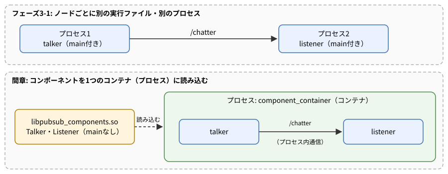
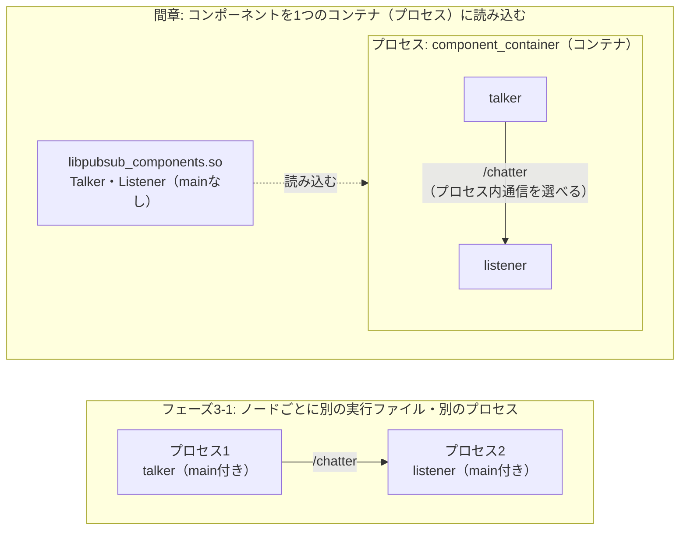

# 間章 手順書: コンポーネント指向でノードを組み立て直す（フェーズ4とフェーズ5の間）

フェーズ3-1で作ったC++版の `talker` / `listener` を題材に、ROS2のコンポーネント（Composition）の仕組みで**同じ振る舞いのノードを部品として作り直す**。フェーズ3〜4では「1ファイルに、ノードのクラスが1つと `main` 関数が1つ」という形で書いてきた。この章では、その形から `main` を取り除き、ノードを「どのプロセスで動かすかを後から決められる部品」にする。

- 想定環境: WSL2 + Ubuntu 24.04 + ROS2 Jazzy
- 前提: フェーズ3-1のC++版（`learn_cpp` の `talker`・`listener`）と、フェーズ4（`learn_bringup` とlaunch）が完了していること
- 所要目安: 1〜2コマ
- 言語: **C++のみ**（理由は下の「位置づけ」を参照）

> **この章の位置づけ**: ROS2のコンポーネントの仕組み（`rclcpp_components`）はC++専用で、Python（`rclpy`）には同等の仕組みが無い（Jazzyの環境で `rclpy_components` のようなパッケージが存在しないことを確認した）。そのため、この章はC++だけで進める。フェーズ5の車両シミュレーションはPythonで書くので、フェーズ5はこの章の成果物に依存しない。この章のねらいは、ノードを「部品」として作り、配置（どのプロセスに入れるか）を後から決めるという考え方に触れておくことにある。規模の大きなROS2のOSS（ナビゲーションのNav2など）は、この形で作られている。

> **進め方**: 2節の仕様は「何を作るか」の定義で、APIの使い方までは書いていない。4節・5節冒頭の「主なAPI」表で必要なAPIを把握し、サンプルと解説を読んで、フェーズ3-1のコードとどこが違うかを確かめながら理解する。サンプルは学習の手がかりとして最小限に書いたもので、公式チュートリアルの転載ではない（使っているAPIの呼び方は公式の例と同等。公式ドキュメントはCC BY 4.0で、出典は末尾に記載する）。コードはこの手順書の作成時に、使い捨ての環境でビルドと登録（`ros2 component types`）、launchファイルの読み込み（`--print`）まで確認済み。ノードを実際に起動した結果は未確認（出力が違う場合は、実機の表示を優先する）。

> **実行環境が無くても読めるように**: 実行する手順の直後には「期待する結果」として、表示される内容の例とその読み方を載せている。パッケージの作成・ビルド・`ros2 component types`・`--print` の表示は手順書の作成時に実際に確かめたもの、ノードを起動した後の表示はコードとROS2の仕様（ログの文言はローカルの `rclcpp_components`・`ros2component` から確認）から筆者が想定したもので、時刻・pid・パスなどの細部は実行ごとに変わる。

## 0. 学習目標と完了条件

1. コンポーネントが、ふつうのノードとどこが違うか（`main` が無い、`NodeOptions` を受け取るコンストラクタ、登録用のマクロ、共有ライブラリとしてビルドする）を説明できる。
2. フェーズ3-1の `talker` / `listener` をコンポーネントとして書き直してビルドし、`ros2 component types` で登録を確認できる。
3. 同じコンポーネントを、3通りの方法（コンテナへ手で読み込む・単独の実行ファイル・launch）で動かせる。
4. 「ノードの中身」と「どのプロセスに配置するか」を分けて考えることの利点と、マイクロサービスの考え方との対応を、自分の言葉で説明できる。

## 1. 概要: なぜ「部品」にするのか

フェーズ3〜4では、ノードを1つ書くたびに `main` 関数も書いてきた。`main` は `rclcpp::init` を呼び、ノードを1つ作り、`spin` で回し続ける。つまり、**ノードの中身と、それを動かすプロセスが、1つのファイルの中で固く結び付いていた**。`talker` を動かせば `talker` 専用のプロセスが1つでき、`listener` を動かせばもう1つできる。2つのノードの間の通信は、同じPCの中であっても、プロセスの境界を越えてDDSを通る。

この形は分かりやすく、1つのノードが落ちても他を巻き込まないという長所もある。一方で、ノードの数が数十に増えると、プロセスの数だけメモリを使い、プロセス間の通信のたびにメッセージのコピーが生じる。カメラ画像のような大きなデータを、同じPCの中の複数のノードで順に加工する場面では、この負担が無視できなくなる。

コンポーネントは、この結び付きをほどく仕組みである。ノードのクラスから `main` を取り除いて共有ライブラリ（`.so`）に入れておき、**どのプロセスに、どのノードを、いくつ入れるかは、起動するとき（launchやコマンド）に決める**。同じ `talker` を、あるときは単独のプロセスで、あるときは `listener` と同じプロセス（コンテナ）に入れて動かせる。同じプロセスに入れたノード同士は、指定すれば、DDSを通らずにメモリ上で直接メッセージを受け渡せる（プロセス内通信。指定の方法は7-3節で扱う。7-1節のように指定せずに読み込んだ場合は、同じプロセスの中でもDDSを通る）。



<details>
<summary>同じ図（mermaid版）</summary>



</details>

この「中身」と「配置」を分ける考え方は、Webシステムで主流になったマイクロサービスの考え方と重なる部分が多い。対応は9節で整理する。

## 2. 仕様

| 項目 | 内容 |
|---|---|
| パッケージ | `learn_components`（`ament_cmake`、新規）。フェーズ3-1の `learn_cpp` は変更せず、そのまま残す |
| コンポーネント | `learn_components::Talker`、`learn_components::Listener`。振る舞いはフェーズ3-1の `talker` / `listener` と同じ（トピック `chatter`、型 [`std_msgs/msg/String`](https://github.com/ros2/common_interfaces/blob/jazzy/std_msgs/msg/String.msg)、1秒ごとに `hello N`、受信したら `received: ...`） |
| ライブラリ | 2つのコンポーネントを、共有ライブラリ `libpubsub_components.so` にまとめる |
| 単独の実行ファイル | `talker_node`、`listener_node`（ビルド時に自動で作らせる。`main` は自分では書かない） |
| launch | `learn_bringup` に `components.launch.py` を足す。コンテナを1つ起動し、2つのコンポーネントを読み込む |

## 3. パッケージを作る

```bash
cd ~/work/ros2MinimalPhysicalAi/ws/src

ros2 pkg create --build-type ament_cmake \
  --dependencies rclcpp rclcpp_components std_msgs \
  --license Apache-2.0 \
  --maintainer-name learner --maintainer-email noreply@example.com \
  learn_components
```

- `rclcpp_components` は、コンポーネントを登録するためのマクロとCMakeの関数を持つパッケージ。
- **`--dependencies` は、パッケージ名の直前に置かない**。このオプションは値をいくつでも取るので、`--dependencies rclcpp rclcpp_components std_msgs learn_components` と書くと、パッケージ名まで依存の一部として読まれ、「パッケージ名が無い」というエラーになる（手順書の作成時に実際に起きた）。上のように、後ろに別のオプションを続ければよい。

**期待する結果**（抜粋）:

```text
going to create a new package
package name: learn_components
...
build type: ament_cmake
dependencies: ['rclcpp', 'rclcpp_components', 'std_msgs']
creating folder ./learn_components
creating ./learn_components/package.xml
creating source and include folder
creating folder ./learn_components/src
creating folder ./learn_components/include/learn_components
creating ./learn_components/CMakeLists.txt
```

`--node-name` を付けていないので、`src/` は空のフォルダのまま作られる。`package.xml` には `<depend>rclcpp</depend>`・`<depend>rclcpp_components</depend>`・`<depend>std_msgs</depend>` が、`CMakeLists.txt` には3つの `find_package(... REQUIRED)` が、あらかじめ書き込まれる。

## 4. コンポーネントを書く

主なAPI:

| やりたいこと | API |
|---|---|
| 読み込む側から設定を受け取る | コンストラクタの引数 `const rclcpp::NodeOptions & options` を、`Node("名前", options)` へ渡す |
| コンポーネントとして登録する | `RCLCPP_COMPONENTS_REGISTER_NODE(名前空間::クラス名)`（ヘッダ `rclcpp_components/register_node_macro.hpp`） |
| クラス名の衝突を避ける | `namespace learn_components { ... }` でクラスを囲む |

フェーズ3-1との違いは、次の4点だけである。**ノードの中身（Publisher・タイマー・購読・ログ）は1行も変えない**。

| 観点 | フェーズ3-1（`learn_cpp/src/talker.cpp`） | この章（`learn_components/src/talker_component.cpp`） |
|---|---|---|
| コンストラクタ | `Talker() : Node("talker")`（引数なし） | `explicit Talker(const rclcpp::NodeOptions & options) : Node("talker", options)` |
| `main` 関数 | あり（`init` → `spin` → `shutdown`） | **なし**（読み込む側が用意する） |
| 登録 | なし | ファイル末尾に `RCLCPP_COMPONENTS_REGISTER_NODE(learn_components::Talker)` |
| 名前空間 | なし | `namespace learn_components` で囲む |

ファイル: `ws/src/learn_components/src/talker_component.cpp`

<!-- file: ws/src/learn_components/src/talker_component.cpp -->
```cpp
#include <chrono>
#include <memory>
#include <string>

#include "rclcpp/rclcpp.hpp"
#include "rclcpp_components/register_node_macro.hpp"
#include "std_msgs/msg/string.hpp"

using namespace std::chrono_literals;

namespace learn_components
{

// 1秒ごとに "hello N" を chatter トピックへ送るコンポーネント（フェーズ3-1の talker と同じ仕様）。
// main 関数を持たず、どのプロセスで動かすかは読み込む側（コンテナ）が決める。
class Talker : public rclcpp::Node
{
public:
  // コンストラクタ: 読み込む側から渡される NodeOptions を受け取り、Node へそのまま渡す。
  explicit Talker(const rclcpp::NodeOptions & options)
  : Node("talker", options)
  {
    pub_ = create_publisher<std_msgs::msg::String>("chatter", 10);
    timer_ = create_wall_timer(1s, [this]() { on_timer(); });
  }

private:
  // タイマーから1秒ごとに呼ばれ、1通送ってログに出す。
  void on_timer()
  {
    std_msgs::msg::String msg;
    msg.data = "hello " + std::to_string(count_++);
    pub_->publish(msg);
    RCLCPP_INFO(get_logger(), "publish: %s", msg.data.c_str());
  }

  rclcpp::Publisher<std_msgs::msg::String>::SharedPtr pub_;
  rclcpp::TimerBase::SharedPtr timer_;
  int count_ = 0;
};

}  // namespace learn_components

// このクラスをコンポーネントとして登録する（コンテナがクラス名で探して読み込めるようにする）。
RCLCPP_COMPONENTS_REGISTER_NODE(learn_components::Talker)
```

解説（talker_component.cpp）:

- **`NodeOptions` を受け取るコンストラクタ**: コンテナは、ノードを作るときに「ノード名の上書き」「remap」「パラメータ」「プロセス内通信を使うか」などの設定を `NodeOptions` にまとめて渡してくる。これを `Node("talker", options)` へそのまま渡すことで、launchやコマンドで指定した設定がノードに届く。引数なしのコンストラクタのままだと、コンテナはこのクラスを作れない（登録のマクロが、この形のコンストラクタを前提にしている）。
- **`explicit`**: 引数1つのコンストラクタで、意図しない暗黙の型変換を防ぐためのC++の習慣。付けなくても動くが、付けておくのが一般的。
- **`main` が無い**: ここがこの章の核心。`rclcpp::init` も `spin` も書かない。初期化とスピンは、このクラスを読み込む側（コンテナや、自動で作られる単独の実行ファイル）が行う。そのため、**コンストラクタの中で長い処理や待ち（`sleep` など）を書いてはいけない**。コンストラクタが終わらないと、同じコンテナに入る他のノードの読み込みも止まる。周期的な処理はフェーズ3-1と同じくタイマーで行う。
- **`namespace learn_components`**: コンテナは、クラスを「`learn_components::Talker`」という完全な名前で探す。多くのパッケージのクラスが同じコンテナに入りうるので、名前空間で衝突を避ける。
- **`RCLCPP_COMPONENTS_REGISTER_NODE(...)`**: このクラスを「名前で探して作れる部品」として登録するマクロ。中では、クラス名とクラスを作る関数の対応表（class_loaderというプラグインの仕組み）に登録している。名前空間の**外**、ファイルの末尾に書く。

ファイル: `ws/src/learn_components/src/listener_component.cpp`

<!-- file: ws/src/learn_components/src/listener_component.cpp -->
```cpp
#include <memory>

#include "rclcpp/rclcpp.hpp"
#include "rclcpp_components/register_node_macro.hpp"
#include "std_msgs/msg/string.hpp"

namespace learn_components
{

// chatter トピックを購読し、届いた文字列をログに出すコンポーネント（フェーズ3-1の listener と同じ仕様）。
class Listener : public rclcpp::Node
{
public:
  // コンストラクタ: NodeOptions を Node へ渡し、購読を作る。届いたときの処理はラムダで書く。
  explicit Listener(const rclcpp::NodeOptions & options)
  : Node("listener", options)
  {
    sub_ = create_subscription<std_msgs::msg::String>(
      "chatter", 10,
      [this](const std_msgs::msg::String & msg) {
        RCLCPP_INFO(get_logger(), "received: %s", msg.data.c_str());
      });
  }

private:
  rclcpp::Subscription<std_msgs::msg::String>::SharedPtr sub_;
};

}  // namespace learn_components

// このクラスをコンポーネントとして登録する。
RCLCPP_COMPONENTS_REGISTER_NODE(learn_components::Listener)
```

解説（listener_component.cpp）: 変更点は `talker_component.cpp` と同じ4点（`NodeOptions` のコンストラクタ、`main` の削除、名前空間、登録マクロ）で、購読とログの部分はフェーズ3-1の `listener.cpp` のまま。

## 5. `CMakeLists.txt` でライブラリとして登録する

主なAPI（CMake）:

| やりたいこと | 書き方 |
|---|---|
| 共有ライブラリを作る | `add_library(ライブラリ名 SHARED ソース...)` |
| コンポーネントとして登録し、単独の実行ファイルも作る | `rclcpp_components_register_node(ライブラリ名 PLUGIN "クラス名" EXECUTABLE 実行ファイル名)` |
| ライブラリをインストールする | `install(TARGETS ライブラリ名 ARCHIVE DESTINATION lib LIBRARY DESTINATION lib RUNTIME DESTINATION bin)` |

`ws/src/learn_components/CMakeLists.txt` の、`find_package(...)` の並びの後、`if(BUILD_TESTING)` の前に足す。

<!-- snippet: cmake_components -->
```cmake
add_library(pubsub_components SHARED
  src/talker_component.cpp
  src/listener_component.cpp)
ament_target_dependencies(pubsub_components rclcpp rclcpp_components std_msgs)

rclcpp_components_register_node(pubsub_components
  PLUGIN "learn_components::Talker"
  EXECUTABLE talker_node)
rclcpp_components_register_node(pubsub_components
  PLUGIN "learn_components::Listener"
  EXECUTABLE listener_node)

install(TARGETS pubsub_components
  ARCHIVE DESTINATION lib
  LIBRARY DESTINATION lib
  RUNTIME DESTINATION bin)
```

- **`add_library(... SHARED ...)`**: フェーズ3-1の `add_executable`（実行ファイルを作る）の代わりに、**共有ライブラリ**（`libpubsub_components.so`）を作る。共有ライブラリは、それだけでは実行できず、実行中のプログラムが後から読み込んで使う部品である。2つのコンポーネントを1つのライブラリにまとめてよい。
- **`rclcpp_components_register_node(...)`**: 2つのことをする。1つ目は、`PLUGIN` に書いたクラスを「このパッケージのコンポーネント」として、ROS2の索引（ament index）に登録すること。これで `ros2 component types` に出て、コンテナが名前で探せるようになる。2つ目は、`EXECUTABLE` に書いた名前で、**そのコンポーネントを1つだけ動かす単独の実行ファイル**を自動で作り、インストールまですること。`main` を自分で書かなくても、`ros2 run learn_components talker_node` で従来どおり単独のプロセスとして動かせる。
- **`install(TARGETS ...)`**: ライブラリを `install/learn_components/lib/` へ置く。フェーズ3-1の実行ファイル（`lib/${PROJECT_NAME}`）とは置き場所が違う点に注意する。自動で作られた `talker_node` などは、登録の関数が自分でインストールするので、ここに書かなくてよい。
- `ament_package()` は、これまでどおりファイルの**最後**に置く。

## 6. ビルドして登録を確かめる

```bash
cd ~/work/ros2MinimalPhysicalAi/ws

colcon build --symlink-install --packages-select learn_components

source install/setup.bash

ros2 component types

ros2 pkg executables learn_components
```

**期待する結果**（`ros2 component types` は抜粋。ROS2本体のパッケージのコンポーネントも多数並ぶ）:

```text
Starting >>> learn_components
Finished <<< learn_components [15.5s]

Summary: 1 package finished [15.7s]

$ ros2 component types
...
learn_components
  learn_components::Talker
  learn_components::Listener
...

$ ros2 pkg executables learn_components
learn_components listener_node
learn_components talker_node
```

- `ros2 component types` は、索引に登録されたコンポーネントを「パッケージ名」とその下の「クラス名」で並べる。ここに2行が出れば、コンテナから読み込める状態になっている。ノードは何も起動していない（索引のファイルを読むだけ）。
- `ros2 pkg executables` には、`main` を書いていないのに `talker_node`・`listener_node` が出る。5節の `EXECUTABLE` の指定で自動的に作られたもの。
- `ls -l install/learn_components/lib/` を実行すると、`libpubsub_components.so`（ライブラリ）が見える。

## 7. 動かす

同じコンポーネントを3通りの方法で動かし、最後にフェーズ3-1のPython版と組み合わせる。

### 7-1. コンテナに手で読み込む（`ros2 component`）

T1で、中身が空のコンテナ（ノードを読み込むためのプロセス）を起動する。T2で、そこへコンポーネントを1つずつ読み込む。

```bash
# T1: 空のコンテナを起動する（Ctrl+C を押すまで動き続ける）
ros2 run rclcpp_components component_container

# T2: コンテナへ読み込む・一覧を見る・取り外す
ros2 component list

ros2 component load /ComponentManager learn_components learn_components::Talker

ros2 component load /ComponentManager learn_components learn_components::Listener

ros2 component list

ros2 component unload /ComponentManager 1
```

**期待する結果**:

```text
# T2
$ ros2 component list
/ComponentManager

$ ros2 component load /ComponentManager learn_components learn_components::Talker
Loaded component 1 into '/ComponentManager' container node as '/talker'

$ ros2 component load /ComponentManager learn_components learn_components::Listener
Loaded component 2 into '/ComponentManager' container node as '/listener'

$ ros2 component list
/ComponentManager
  1  /talker
  2  /listener

$ ros2 component unload /ComponentManager 1
Unloaded component 1 from '/ComponentManager' container node

# T1（コンテナ。Talker を読み込んだところから）
[INFO] [1790292000.100000000] [ComponentManager]: Load Library: /home/<ユーザー名>/work/ros2MinimalPhysicalAi/ws/install/learn_components/lib/libpubsub_components.so
[INFO] [1790292000.110000000] [ComponentManager]: Found class: rclcpp_components::NodeFactoryTemplate<learn_components::Talker>
[INFO] [1790292000.110000000] [ComponentManager]: Instantiate class: rclcpp_components::NodeFactoryTemplate<learn_components::Talker>
[INFO] [1790292001.110000000] [talker]: publish: hello 0
[INFO] [1790292002.110000000] [talker]: publish: hello 1
（Listener を読み込むと、同じ3行の後に）
[INFO] [1790292003.110000000] [talker]: publish: hello 2
[INFO] [1790292003.110500000] [listener]: received: hello 2
```

- コンテナは、起動しただけでは何も表示しない。ノード名は既定で `/ComponentManager` になる（`ros2 component list` の1行目）。
- `load` のたびに、コンテナのターミナルへ「ライブラリを読み込んだ（`Load Library`）」「クラスを見つけた（`Found class`）」「作った（`Instantiate class`）」の3行が出て、その直後からノードが動き始める。**プロセスを新しく起動していないのに、ノードが増えていく**点がこの節の要点。
- `load` の応答の `1`・`2` は、コンテナの中での通し番号（ID）。`unload` にはこの番号を渡す。`unload ... 1` の後は、`talker` のログが止まり、`listener` は残ったまま（送り手がいないので何も受信しない）になる。
- `talker` と `listener` のログが、**同じ1つのターミナル（T1）に混ざって出る**。同じプロセスの中で動いている証拠である。別のターミナルで `ps -e -o pid,comm | grep -E 'component|talker|listener'` を実行すると、`component_conta`（コマンド名は15文字で切れる）の1行だけが出る。フェーズ3-1のように2つを別々に `ros2 run` した場合は、`talker` と `listener` の2行が出る。

### 7-2. 単独の実行ファイルとして動かす

```bash
# T1
ros2 run learn_components talker_node

# T2
ros2 run learn_components listener_node
```

**期待する結果**: 表示はフェーズ3-1の3-3節（C++版はフェーズ3-1の4-3節）と同じで、T1に `[talker]: publish: hello N`、T2に `[listener]: received: hello N` が出る。

```text
# T1（talker_node）
[INFO] [1790292100.100000000] [talker]: publish: hello 0
[INFO] [1790292101.100000000] [talker]: publish: hello 1

# T2（listener_node）
[INFO] [1790292101.101000000] [listener]: received: hello 1
```

`main` を1行も書いていない同じコードが、今度は2つの別々のプロセスとして動いている。7-1と7-2で変わったのは起動の仕方だけで、コードもビルドも同じ。これが「配置を後から決める」ということである。

### 7-3. launchで1つのコンテナにまとめて起動する

フェーズ4の `learn_bringup` に、launchファイルを1つ足す。launchからコンテナを起動する専用のアクション（`ComposableNodeContainer`）を使う。

主なAPI:

| やりたいこと | API |
|---|---|
| コンテナを起動し、中にコンポーネントを入れる | `ComposableNodeContainer(name=..., namespace=..., package='rclcpp_components', executable='component_container', composable_node_descriptions=[...])`（`launch_ros.actions`） |
| 入れるコンポーネントを1つ書く | `ComposableNode(package=..., plugin='名前空間::クラス名', name=..., extra_arguments=[...])`（`launch_ros.descriptions`） |
| プロセス内通信を使う | `extra_arguments=[{'use_intra_process_comms': True}]` |

まず `ws/src/learn_bringup/package.xml` の `<exec_depend>` の並びに2行足す。

```xml
<exec_depend>learn_components</exec_depend>
<exec_depend>rclcpp_components</exec_depend>
```

ファイル: `ws/src/learn_bringup/launch/components.launch.py`

<!-- file: ws/src/learn_bringup/launch/components.launch.py -->
```python
from launch import LaunchDescription
from launch_ros.actions import ComposableNodeContainer
from launch_ros.descriptions import ComposableNode


# ros2 launch が呼ぶ関数。コンテナ（中身が空のプロセス）を1つ起動し、
# その中に talker と listener のコンポーネントを読み込む。
def generate_launch_description():
    container = ComposableNodeContainer(
        name='pubsub_container',
        namespace='',
        package='rclcpp_components',
        executable='component_container',
        composable_node_descriptions=[
            ComposableNode(
                package='learn_components',
                plugin='learn_components::Talker',
                name='talker',
                extra_arguments=[{'use_intra_process_comms': True}]),
            ComposableNode(
                package='learn_components',
                plugin='learn_components::Listener',
                name='listener',
                extra_arguments=[{'use_intra_process_comms': True}]),
        ],
        output='screen',
    )
    return LaunchDescription([container])
```

解説（components.launch.py）:

| 部分 | 何をしているか |
|---|---|
| `ComposableNodeContainer(...)` | 7-1で手で起動した `component_container` を、launchから起動する。`name` はコンテナ自身のノード名（ここでは `pubsub_container`。既定の `ComponentManager` を上書きしている）。`namespace=''` は名前空間なし。 |
| `composable_node_descriptions=[...]` | コンテナが起動した直後に読み込むコンポーネントの一覧。7-1の `ros2 component load` を、launchが代わりに行う。 |
| `ComposableNode(package=..., plugin=...)` | `ros2 component load` の2つの引数（パッケージ名・クラス名）に相当する。`name` はノード名の指定。 |
| `extra_arguments=[{'use_intra_process_comms': True}]` | このノードに、同じプロセスの中の相手とはDDSを通さずメモリ上で受け渡す**プロセス内通信**を使わせる指定。コンストラクタで受け取る `NodeOptions` に入って届く。 |
| `output='screen'` | コンテナのログを端末に出す。コンテナの中の全ノードのログがまとめて出る。 |

フェーズ4の `pubsub.launch.py` と比べると、`Node(...)` が2つ並んでいた（＝プロセスが2つ）ところが、`ComposableNodeContainer` が1つ（＝プロセスが1つ）になり、ノードはその中身として書かれている。

launchファイルを**追加した**ので、`learn_bringup` を再ビルドしてから起動する。

```bash
cd ~/work/ros2MinimalPhysicalAi/ws

colcon build --symlink-install --packages-select learn_bringup

source install/setup.bash

ros2 launch learn_bringup components.launch.py --print

ros2 launch learn_bringup components.launch.py
```

**期待する結果**（`--print`。`0x...` のアドレスは毎回変わる）:

```text
<launch.launch_description.LaunchDescription object at 0x74117d743680>
└── ExecuteProcess(cmd=[ExecInPkg(pkg='rclcpp_components', exec='component_container'), '--ros-args', '-r', LocalVar('node name')], cwd=None, env=None, shell=False)
```

起動されるプロセスは `component_container` の1つだけで、`talker` や `listener` は木に出てこない。コンポーネントは、プロセスが起動した後にコンテナへ読み込まれる「中身」だからである。

**期待する結果**（起動。抜粋）:

```text
[INFO] [component_container-1]: process started with pid [13000]
[component_container-1] [INFO] [1790292200.100000000] [pubsub_container]: Load Library: /home/<ユーザー名>/work/ros2MinimalPhysicalAi/ws/install/learn_components/lib/libpubsub_components.so
[component_container-1] [INFO] [1790292200.110000000] [pubsub_container]: Found class: rclcpp_components::NodeFactoryTemplate<learn_components::Talker>
[component_container-1] [INFO] [1790292200.110000000] [pubsub_container]: Instantiate class: rclcpp_components::NodeFactoryTemplate<learn_components::Talker>
[INFO] [launch_ros.actions.load_composable_nodes]: Loaded node '/talker' in container '/pubsub_container'
（Listener についても同じ4行）
[component_container-1] [INFO] [1790292201.110000000] [talker]: publish: hello 0
[component_container-1] [INFO] [1790292201.110100000] [listener]: received: hello 0
```

- 行頭の `[component_container-1]` が、`talker` の行にも `listener` の行にも付く。フェーズ4の4-1節では `[talker-1]`・`[listener-2]` と別々だった。1つのプロセスの中で2つのノードが動いていることが、ログの印からも分かる。
- 別のターミナルでの確認:

```text
$ ros2 node list
/listener
/pubsub_container
/talker

$ ros2 component list
/pubsub_container
  1  /talker
  2  /listener
```

`ros2 node list` から見ると、`/talker` と `/listener` はフェーズ3-1と同じ「ノード」で、コンテナのノード（`/pubsub_container`）が1つ増えているだけである。ノードを使う側（トピックの相手、`ros2 topic` などのツール）からは、そのノードが単独のプロセスなのかコンテナの中なのかは区別されない。

### 7-4. フェーズ3-1のPython版と組み合わせる

7-3のlaunchを動かしたまま、別のターミナルでフェーズ3-1のPython版 `listener` を起動する。

```bash
ros2 run learn_py listener
```

**期待する結果**: Python版の `listener` も、コンテナの中の `talker` からのメッセージを受け取る。

```text
[INFO] [1790292300.110500000] [listener]: received: hello 99
```

コンテナの中の `talker` は、同じプロセスの `listener` にはプロセス内通信で、外のPythonの `listener` にはDDSで、同じメッセージを届けている。受け取る側は、相手がコンポーネントかどうかも、C++かPythonかも気にしない。つながりを決めているのは、**トピック名と型（インターフェース）だけ**である。なお、ノード名 `listener` が2つになるので、`ros2 node list` では重複の警告が出ることがある（フェーズ3-1の6節の課題2と同じ現象）。気になる場合は `ros2 run learn_py listener --ros-args -r __node:=py_listener` のように名前を変える。

> 課題1: 7-1の手順で、`--node-name`（`-n`）を付けて `Talker` を2つ読み込む（例: `ros2 component load /ComponentManager learn_components learn_components::Talker -n talker2`）。1つのプロセスの中に、同じクラスのノードが2つ動くことを確認する。
>
> 課題2: 7-1の手順で、`-r chatter:=chatter2` を付けて `Listener` を読み込み、`talker` のメッセージが届かなくなることを確認する。フェーズ4の4-6節で見たremapが、コンテナへの読み込みでも同じように使えることを確認する。
>
> 課題3（発展）: `component_container` の代わりに `component_container_mt`（複数スレッドで回すコンテナ）がある。`ros2 pkg executables rclcpp_components` で種類を確認し、どんなときに使い分けるか調べる。手がかり: ふつうの `spin`（単一スレッド）は、コールバックを1つずつ順に処理するので、長い処理のコールバックが1つあると、その間は同じプロセスの他のコールバックが待たされる。複数スレッドなら、別のノード（部品）のコールバックどうしを並行して動かせる（同じノードの中のコールバックまで並行させるには、コールバックグループの指定も要る。任意の[フェーズ3-5](phase3_5_actions.md)を読んだ場合は、4節のPython版のアクションサーバで `MultiThreadedExecutor` と `ReentrantCallbackGroup` を使った理由がこれにあたる）。
>
> 課題4（発展）: プロセス内通信では、`publish` に `std::unique_ptr` でメッセージを渡すと、コピーせずに所有権ごと相手へ渡せる（ゼロコピー）。公式ドキュメントの intra-process の説明を調べ、`talker_component.cpp` をその形に書き換えてみる。

## 8. フェーズ3-1との違いのまとめ

| 観点 | フェーズ3-1（ふつうのノード） | この章（コンポーネント） |
|---|---|---|
| 1ファイルの中身 | ノードのクラス＋`main` | ノードのクラス＋登録マクロ（`main` なし） |
| ビルドの成果物 | 実行ファイル（`add_executable`） | 共有ライブラリ（`add_library(... SHARED)`）。単独の実行ファイルも自動で作れる |
| プロセスとノードの関係 | 1プロセス＝1ノードに固定 | 起動時に決める（1プロセスに複数、1プロセスに1つ、のどちらでも） |
| ノード間の通信 | 常にDDS（プロセス間） | 同じコンテナ内ならプロセス内通信を選べる。外の相手とはDDS |
| 実行中の組み替え | できない（プロセスの起動・停止だけ） | `ros2 component load/unload` で、プロセスを止めずにノードを足し引きできる |
| 1つのノードの異常の影響 | そのプロセスだけが落ちる | 同じコンテナの全ノードが巻き込まれる |
| 対応言語 | Python・C++ | C++のみ（Jazzy時点） |

コンポーネントは「常に良い」わけではない。同じコンテナに入れると、効率は上がるが、1つのノードの不具合（例外で落ちる、コンストラクタで止まる）が他を巻き込む。開発中やデバッグ中は7-2のように別々のプロセスで動かし、完成したら7-3のように1つのコンテナにまとめる、という使い分けができるのが、コンポーネントの最大の利点である。

## 9. マイクロサービスの考え方との対応

マイクロサービスは、1つの大きなアプリケーションを、小さく独立したサービスの集まりとして作る考え方である。各サービスは決められたインターフェース（Web APIなど）だけでやり取りし、それぞれを別々に作り、別々に配置・更新できる。ROS2のノードとコンポーネントは、これとよく似た構造を持っている。

| マイクロサービスの考え方 | ROS2での対応 |
|---|---|
| 小さく独立したサービス | 1つの役割だけを持つノード（`talker`、`listener`、フェーズ5のプラント・PI制御など） |
| 決められたインターフェースでだけやり取りする | トピック名とメッセージの型（7-4節で、相手の言語や配置を問わずつながった） |
| 配置（どのサーバ・コンテナで動かすか）を実装と切り離す | コンポーネントの配置を起動時に決める（7-1〜7-3節） |
| 障害の影響範囲を小さく保つ | ノードを別プロセスに分ける（8節の最後の段落のトレードオフ） |
| 同じサービスを複数動かす | 同じクラスのノードを名前を変えて複数読み込む（7節の課題1） |

一方で、違いもある。一般的なマイクロサービスはネットワーク越しのHTTPなどで通信し、サービスごとにデータの保存先を分けることが多いが、ROS2のノードはDDSの出版・購読（トピック）が中心で、同じPCの中での高速なやり取りを重視する。また、ここでの「コンテナ」はROS2のコンポーネントを入れるプロセスのことで、DockerのようなOSレベルのコンテナとは別物である（ROS2のシステムをDockerで配置することもよくあるが、それはまた別の層の話になる）。

フェーズ5はPythonで書くのでコンポーネントは使わないが、この考え方はそのまま生かせる。プラント・PI制御・目標速度の各ノードを、それぞれ1つの役割だけを持つ部品として作り、つながりはトピック名と型だけで決める。ノードのクラスには起動の手順（`main`）に関する処理を混ぜず、設定はパラメータで外から与える。そうしておけば、後でノードを差し替えたり（例: Python版のプラントをC++版に）、配置を変えたりしても、他のノードは変更せずに済む。

## 10. つまずきやすい点

| 症状 | 確認すること |
|---|---|
| `ros2 pkg create` で `the following arguments are required: package_name` | `--dependencies` の直後にパッケージ名を書いていないか（3節）。後ろに別のオプションを続ける |
| `ros2 component types` に `learn_components` が出ない | `rclcpp_components_register_node` を書いたか。ビルド後に `source install/setup.bash` をしたか |
| `load` で `Failed to load component` | パッケージ名とクラス名（`learn_components::Talker`、名前空間を含む）の綴り。`ros2 component types` の表示と一致させる |
| ビルドで、登録マクロのあたりにコンストラクタの引数の型が合わないというエラー | コンストラクタが `const rclcpp::NodeOptions &` を受け取る形になっているか（引数なしのままになっていないか） |
| launchやコマンドで付けたremap・パラメータが効かない | コンストラクタで受け取った `options` を `Node("名前", options)` へ渡しているか |
| コンテナにノードを入れた後、他のノードが読み込まれない | コンストラクタの中に、長い処理や待ち（`sleep`、ループ）を書いていないか |
| `ros2 launch` で `file 'components.launch.py' was not found` | launchファイルを追加した後に `learn_bringup` を再ビルドしたか |

## 11. 次へ

フェーズ5（車両シミュレーション本体）へ進む。最初はフェーズ5-0（[`docs/phase5_0_gazebo.md`](phase5_0_gazebo.md)）で、Gazeboを導入して動かす。9節の最後の段落のとおり、ノードを「1つの役割を持つ部品」として作り、つながりをトピック名と型で決める考え方を、Pythonのノードの設計に生かす。

## 12. 公式ドキュメント・参考資料

確認状況（2026-09-24）: 以下のURLは、Web検索の結果で実在を確認した。docs.ros.orgは本文の取得がボット対策で拒否されるため、内容の照合はできていない。APIの使い方は、ローカルの `/opt/ros/jazzy`（`rclcpp_components` のCMake関数の説明、`ros2 component load -h`、`ros2component` のソース）で確認した。

### 公式（ROS 2 Jazzy）

- [Composing multiple nodes in a single process — Jazzy](https://docs.ros.org/en/jazzy/Tutorials/Intermediate/Composition.html)（コンポーネントの作り方と、`ros2 component` での読み込み）
- [Using ROS 2 launch to launch composable nodes — Jazzy](https://docs.ros.org/en/jazzy/How-To-Guides/Launching-composable-nodes.html)（launchからコンテナとコンポーネントを起動する方法）
- [Intermediate Concepts — Jazzy](https://docs.ros.org/en/jazzy/Concepts/Intermediate.html)（コンポーネントの考え方（About Composition）は、この目次から辿る）
- [composition パッケージ — Jazzy](https://docs.ros.org/en/jazzy/p/composition/)（公式のデモパッケージ。コードを読む場合は、丸ごと写さずに要点だけを参考にする）
