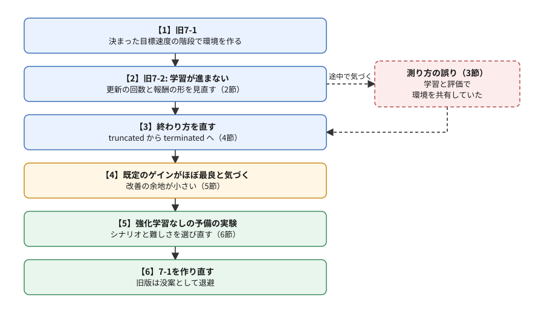
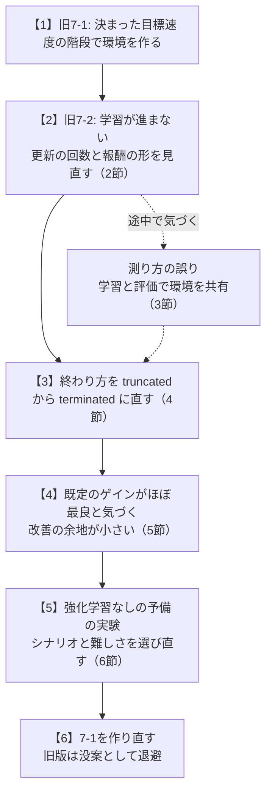

# 間章: 試行錯誤の記録（予備の実験と方針の修正）

この章は、フェーズ7-1（[`docs/phase7_1_vehicle_env.md`](phase7_1_vehicle_env.md)）を読み終えた人向けの、任意の読み物である。手順書は、うまくいった道筋だけを、先頭から順に読めるように並べている。しかし、その道筋は最初から見えていたわけではない。フェーズ7の手順書を作る途中で、筆者は、学習が進まない原因を探し、測り方の誤りに気づき、最後には問題の設定そのものを作り直した。この章では、その中から、学ぶところの多い場面を選んで振り返る。

- 想定する読者: フェーズ7-1までを読み終え、強化学習やシミュレーションを自分の課題に使ってみたい人。手順書どおりに進めるだけなら、この章は読まなくてよい
- 所要目安: 0.5コマ（読むだけ）
- 言語: なし（コードは書かない。考え方を追う）

> **この章の位置づけ**: 手順書の想定する初学者には、ここで扱う判断の多くはまだ難しい。一方で、自分で課題を立てて取り組む中級者を目指すなら、いずれ必ず通る経験である。分からないところは読み飛ばし、フェーズ7を進めた後に読み返してもよい。やったことを網羅するのではなく、読みやすさを優先して場面を選んだ。

> **数値の出どころ**: この章の数値は、筆者の環境（2026-10-02〜03。SB3 2.9.0・Gymnasium 1.3.0）で、手順書を作る途中に行った実験の値である。実験のスクリプトは、この章の目的（考え方を追うこと）から外れるので載せていない。この章には実行する手順が無いので、「期待する結果」も無い。作り直す前の手順書（没案）は、[`docs/archive/phase7_1_vehicle_env_v1.md`](archive/phase7_1_vehicle_env_v1.md) と [`docs/archive/phase7_2_gain_tuning_v1.md`](archive/phase7_2_gain_tuning_v1.md) に残してある。判断の経緯は、[`docs/qa_log.md`](qa_log.md) の2026-10-02〜03の行にある。

## 0. この章で得てほしいこと

1. 学習や比較の結果が出たとき、「そもそも、この問題で差が出るのか」を疑う視点。
2. 強化学習のような時間のかかる手段を使う前に、安い予備の実験で、改善の余地を確かめる習慣。
3. 測り方そのものが結果をゆがめることがある、という警戒心。
4. 方針を変えるときに、変える前の成果を捨てずに退避し、理由を記録しておくこと。

## 1. 全体像

フェーズ7-1と7-2は、一度書き上げた後に、作り直している。その流れを図にする。

同じ図（mermaid版）

この流れの中で、作業の大部分は【2】と【3】に使った。振り返ると、本当に効いたのは【4】の気づきと【5】の予備の実験だった。もし最初に【5】をしていれば、【2】と【3】の多くは要らなかったかもしれない。

## 2. 学習が進まないとき、設定と報酬の形を見直す

旧版の7-1の環境は、フェーズ6で記録したのと同じ1通りの目標速度の階段（0 → 10 → 5 → 0 m/s）を走るものだった。旧版の7-2では、この環境で、エピソードの始めにゲインを1組選ぶ形のSACを学習させた。題材は、ブレーキの遅いプラントである。

最初は、SB3のSACの既定の設定で学習させた。1000ステップ学習させても、選ぶゲインは行動の範囲の真ん中付近からほとんど動かず、収益は−3.55前後にとどまった。格子の探索で見つけた最もよいゲインの収益は−3.4007で、そこに届かない。

原因として、2つを考えて、順に確かめた。

- **NNの更新が少ない**: 既定では、環境を1ステップ進めるごとにNNを1回更新する。この形では1ステップが90秒のシミュレーションで、時間がかかる。そこで1ステップごとに20回更新する（`gradient_steps=20`）と、1000ステップで収益が−3.4037まで上がった。
- **探索のばらつきの重みが、報酬の差より大きい**: 収益はどのゲインでも−3.4前後に集まり、ゲインによる差は0.3ほどしかない。SACが探索のばらつきに与える価値（エントロピーの係数。初めは1.0）のほうが大きく効いて、方策が真ん中から動きにくい。そこで報酬を「既定のゲインの収益との差 × 100」に置き換えると、250ステップで−3.4052、500ステップで−3.4004に届いた。

ここまでは、手順書の旧版の7-2に、つまずきと対策の順に書いた。同じアルゴリズムでも、設定ひとつで学習が進んだり進まなかったりすることを体験する題材としては、悪くなかった。ただし、この時点では、5節で述べる、もっと大きな問題に気づいていなかった。

## 3. 測り方の誤りで、結論が逆になりかけた

2節の試行の最初の版では、学習の途中で方策を評価するのに、学習に使っているのと同じ環境のオブジェクトを使っていた。評価のために環境を `reset` して1ステップ動かすと、環境の時刻は90秒まで進む。ところが、学習の側（SB3）はそのことを知らないので、次の学習のステップで、存在しないはずの「90秒より後」（目標0・停止）を計算してしまう。報酬を100倍した形では、その1ステップに大きな報酬が紛れ込んだ。

この誤りに気づく前の試行では、「報酬を100倍しただけでは、かえって悪くなる」「終わり方を `truncated` にしても `terminated` にしても、差は小さい」という結論になっていた。評価用の環境を学習用と分けて測り直すと、どちらの結論も確かなものではなかった。特に後者は、4節のとおり、実際には大きな差があった。

ここから学べることは2つある。

- **学習用と評価用の環境は分ける**: 学習用の環境は、ライブラリが中で使っている。外から触ると、ライブラリが知らないうちに状態が進む。旧版の7-2では、この理由を本文に書いて、評価用の環境を別に作った。
- **結論は、測り方を疑ってから出す**: 意外な結果（報酬を大きくしただけで悪くなる）が出たときは、まず測り方を疑う。測り方を直したら、それまでの結論は全部測り直す。直す前の数値を、確かめないまま手順書に残さない。

## 4. エピソードの終わり方で、学習の速さが大きく変わった

旧版の7-1は、最初、90秒でエピソードが終わるときに `truncated`（時間切れ）を返していた。フェーズ7-0の振り子と同じ扱いである。レビューで、「SB3は `truncated` の後も報酬が続くとみなし、終わりの観測からの見込みを収益に足し込む。この環境の90秒は課題そのものの終わりなので、`terminated` ではないか」と指摘された。

実際に `terminated` に直して測ると、差は大きかった。

| 終わり方 | ②更新の回数を増やす（1000ステップ） | ③報酬を差にする |
|---|---|---|
| `truncated` | −3.4612 | 2000ステップで−3.4070 |
| `terminated` | −3.4037 | 250ステップで−3.4052 |

`terminated` にすると、③は8分の1のステップ数で、同じ水準に届いた。1ステップで終わるエピソードでは、`truncated` にすると、学習のアルゴリズムは、決して訪れない「終わりの後の状態」の価値まで見積もろうとし、その見積もりの誤りが学習を乱す。

`terminated` と `truncated` の違いは、7-0の2-3節で読んだときには、細かな決まりごとに見えたかもしれない。しかし、どちらを返すかは、「この課題に続きがあるか」という問題の設定そのものであり、学習の結果を大きく左右する。新しい7-1では、残りの時間を観測に入れたうえで、`terminated` を返している（7-1の2-2節と2-6節）。

## 5. 「既定のゲインがほぼ最良」: 問題の設定そのものを疑う

旧版の7-2を書き上げて、教科書としてのレビューを受けたとき、次のことが問題になった。

- 格子の探索で見つけた最もよいゲイン（収益−3.4007）と、フェーズ5-2で手で決めた既定のゲイン（−3.4030）の差は、0.07%しかなかった。強化学習が「手で決めたゲインと同じ答えにたどり着いた」と言っても、そもそも改善の余地がほとんど無い問題だった。
- 収益の大部分は、0 → 10 m/sのような大きな段で、アクセルを踏み切っている間の誤差だった。その間はゲインを変えてもペダルは変わらないので、ゲインでは減らせない。
- 行き過ぎの減点（重み4）は、収益のおよそ2%にすぎなかった。フェーズ6-3の指標では目立った22%の行き過ぎが、収益の上ではほとんど見えない。

つまり、問題が「強化学習で解く意味のある問題」になっていなかった。2節〜4節の工夫は、それぞれ正しかったが、解いている問題の側に、差の出る余地が無かったのである。

一度は、手順書の書き方を改めて（「この報酬では既定のゲインがほぼ最良」と正直に書いて）先へ進む案も考えた。しかし、7-3では「時定数が変わったら、ゲインを選び直す」ことを扱う予定だった。選び直しても収益が変わらないなら、7-3はまた同じ問題に突き当たる。そこで、報酬の重みだけでなく、走らせるシナリオの側で難しさを調整できないかを、次の6節の予備の実験で確かめることにした。

ここから学べることは、**学習させる前に、「何もしない場合」と「最もよい場合」の差を測っておく**ことである。この冊の例なら、既定のゲイン（何もしない場合）と、格子の探索の最良（最もよい場合の目安）である。この差が小さければ、どんなに学習がうまくいっても、得られるものは小さい。

## 6. 予備の実験で、シナリオと難しさを選び直す

予備の実験では、強化学習を使わなかった。ゲインを格子状に変えて全部試すだけで、改善の余地があるかは分かるからである。1回の実験は、数分で終わる。

試したシナリオは、新しい7-1と同じ形である。目標の速度で落ち着いた状態から始め、10秒ごとに8回、目標をランダムな幅で上下させ、20通りのシナリオの収益の平均で比べた。段の幅（小: 1〜2 m/s、中: 1〜4 m/s、大: 3〜8 m/s）と、行き過ぎの重み（4・20・100。分かったこと4では、格子を細かくして0〜100の8段階）を振った。

**分かったこと1: 段の幅で、ゲインの差の見え方が変わる**（ブレーキの遅いプラント、重み20）

| 段の幅 | 既定のゲインの収益 | 格子の最良の収益 | 改善 |
|---|---|---|---|
| 小（1〜2 m/s） | −0.345 | −0.199 | 42% |
| 中（1〜4 m/s） | −1.253 | −0.731 | 42% |
| 大（3〜8 m/s） | −5.761 | −4.432 | 23% |

段が大きいと、旧版と同じく、アクセルを踏み切っている間の誤差が収益の大部分を占める（既定のプラントでは、改善が2%ほどまで小さくなった）。段が小〜中なら、ペダルが張り付く時間が短く、ゲインの良し悪しがそのまま収益に表れる。新しい7-1では、張り付く段と張り付かない段が両方混ざる「中」を選んだ。

**分かったこと2: 最もよいゲインは、プラントで大きく違う**（段の幅が小、重み20）

| 使ったゲイン | 既定のプラント | ブレーキの遅いプラント |
|---|---|---|
| 既定のプラントで最もよい組（0.7・0.05） | −0.130 | −0.327 |
| ブレーキの遅いプラントで最もよい組（0.3・0.025） | −0.216 | −0.219 |

一方のプラントで最もよいゲインを、もう一方に使うと、収益は約1.5〜1.7倍悪くなった。「時定数が変わったら、ゲインを選び直す」ことに、はっきりした意味がある。7-3の動機が、数値で裏づけられた。

**分かったこと3: 「加速と減速でゲインを切り替える」価値は小さい**

状況に応じた選び直しの例として、目標を上げる段と下げる段で別々のゲインを使う方法も試した。固定のゲインの最良より、1〜5%よくなるだけだった。選び直す価値は、段の向きよりも、プラントの違い（時定数）のほうにある。この結果から、7-3の題材を「時定数の違いに合わせる」ことに絞る見通しが立った。

**分かったこと4: 重みで、追従の速さと行き過ぎのバランスが変わる**（ブレーキの遅いプラント、段の幅が小）

| 行き過ぎの重み | 最もよい組（`kp`・`ki`） | RMS [m/s] | 行き過ぎ量の平均 |
|---|---|---|---|
| 0 | 0.8・0.05 | 0.384 | 17.7% |
| 4 | 0.5・0.025 | 0.405 | 5.2% |
| 20 | 0.4・0.025 | 0.427 | 1.7% |

重みを上げるほど、選ばれるゲインは小さくなり、行き過ぎは大きく減る代わりに、追従は少し遅くなる（RMSが増える）。報酬の重みは、どちらを重く見るかという設計の判断そのものである。このトレードオフは、作り直した7-2と、NNへの置き換え（7-4）で扱う。

予備の実験にも、限界はあった。分かったこと3の切り替えの評価は、段ごとに分けて集計した近似で、段が大きいと、近似の前提（各段が10秒以内に落ち着く）が崩れた。予備の実験の結果は「見通し」であり、手順書に載せる値は、作り直した環境で改めて測った。

## 7. 手順書には出てこない、小さな事例

フェーズ7のほかにも、手順書の本文には残らなかったが、覚えておくと役に立つ場面があった。3つだけ挙げる。

- **時計が飛ぶと、止まっていないものが止まって見える**（フェーズ5-1）: Gazeboへの表示のノードで、速度のメッセージが一定時間届かなければ「途絶えた」と判断する見張りを、PCの現在時刻で測っていた。ところが、WSLの中では、時刻合わせで現在時刻が数十秒ごとに数秒進むことがあり、メッセージは届いているのに「途絶えた」と誤判定した。経過時間を測るときは、進むだけで戻ったり飛んだりしない時計（rclpyの `ClockType.STEADY_TIME` など）を使う。ログの時刻が数秒飛んでいても、ノードが止まったと決めつけず、時計の側を疑う。
- **同じ仕様のノードでも、言語で表示が違う**（フェーズ3-3）: パラメータの一覧（`ros2 param list`）に、C++のノードでは出る4行（`qos_overrides./parameter_events.publisher.*`）が、Pythonのノードでは出ない。手順書の期待する結果に、C++版の表示が紛れ込んでいたのを、実際に動かした表示との食い違いで見つけた。期待する結果は、言語ごとに実際に確かめる。
- **課題で、境界の条件の不具合が見つかる**（新しい7-1）: 目標速度のシナリオを作る関数は、「範囲から出るなら、向きを逆にする」だけだった。段の幅が1〜4 m/sなら、これで必ず範囲に収まる。ところが、課題のために幅を3〜8 m/sにすると、逆にしても範囲から出て、目標が1.13 m/sになった。引数で変えられるようにしたものは、既定の値だけでなく、端の値でも動かしてみる。

## 8. まとめ

- 手順書の道筋は、試行錯誤の後で整えたものである。自分で課題に取り組むときは、うまくいかない時間のほうが長い。
- 結果が出たら、測り方と、問題の設定の両方を疑う。特に、「何もしない場合」と「最もよい場合」の差（改善の余地）を、学習させる前に測る。
- 強化学習を使う前に、格子の探索のような安い方法で、問題の形と難しさを確かめる。予備の実験の結果は見通しとして使い、手順書や報告に載せる値は、本番の形で測り直す。
- 方針を変えるときは、変える前の成果を消さずに退避し（この教材では `docs/archive/`）、なぜ変えたかを記録する（この教材では [`docs/qa_log.md`](qa_log.md)）。後から同じ道で迷わずに済み、判断の誤りに気づいたときにも戻れる。

## 9. 次へ

次の7-2（作り直し中）では、新しい7-1の環境で、SACにゲインを学習させる。この章の5節の反省を踏まえ、学習の前に、既定のゲインと格子の探索の最良の差を確かめるところから始める予定である。

> 出典: この章は、筆者がフェーズ7の手順書を作る途中で行った実験と判断を、自分の言葉でまとめたものである。SB3・Gymnasiumの挙動（`gradient_steps`・エントロピーの係数・`terminated` と `truncated` の扱い）は、フェーズ7-0・7-1と没案の7-2の出典に挙げた公式の文書とソースで確かめた。
