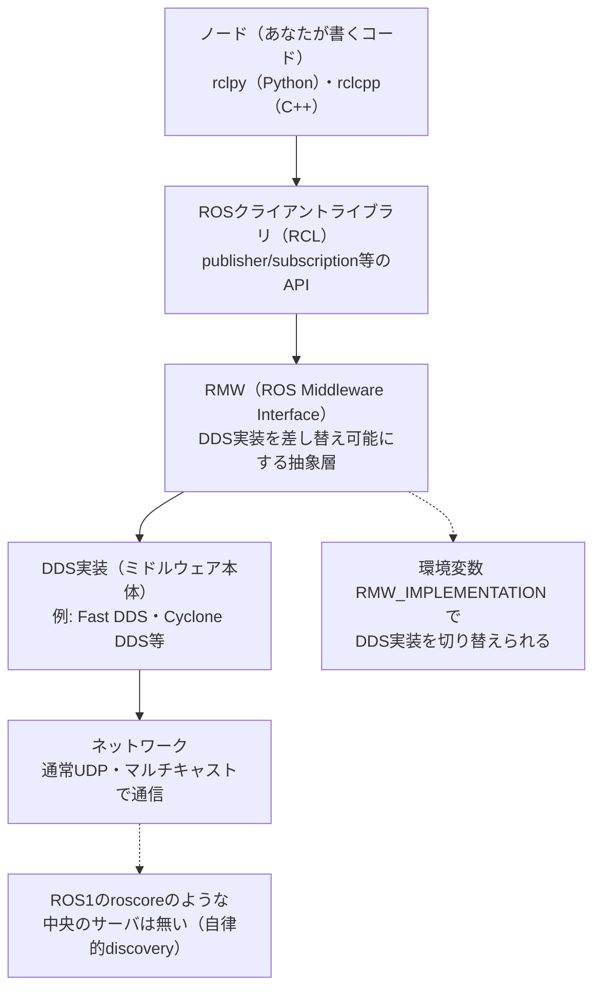

# フェーズ0 手順書: ROS2の概要と全体像

`docs/learning_plan.md` のフェーズ1（turtlesimでの実機観察）に入る前の読み物。コマンドは実行せず、ROS2という技術の全体像（通信プロトコルの基礎・できること・用語・学習マップ・周辺ツール）を先につかんでおく。

- 想定環境: 環境非依存（ROS2導入前でも読める）。用語の一部は `docs/setup_wsl2_ros2.md` 完了後の方が実感しやすい。
- 所要目安: 1コマ（読み物。手を動かす作業なし）
- 言語: 言語非依存

> **この手順書の位置づけと注意**
> - 本フェーズは知識の地図を作ることが目的で、完了条件は「コマンドが動く」ではなく「自分の言葉で説明できる」。
> - 文章は自分の言葉で書いたが、ROS2・DDS・周辺OSSの事実関係（バージョン、対応OS、ライセンス等）は公式ページの記載に基づく。docs.ros.orgはボット対策（Anubis）で本文の自動取得ができないため、URLはWeb検索結果で実在を確認したものだけを掲載している（詳細は末尾の公式ドキュメント）。細部が最新の公式の情報と食い違う場合は、公式を優先する。

## 0. 学習目標

このフェーズを終えたら、次を自分の言葉で説明できる状態を目指す。

1. ROS2が何のためのソフトウェアか（OSでもフレームワーク1つでもなく、通信規約＋ツール群の集合であること）。
2. ROS2の通信がDDSというミドルウェアの上に成り立っていること、ROS1との違いの要点。
3. ROS2で実現できることの範囲（分散システム・マルチロボット・組み込み・セキュリティ等）。
4. ノード・トピック・サービス・アクション・パラメータなど基本用語を迷わず使える。
5. 本プロジェクトの学習ロードマップ（フェーズ1〜7）が、ROS2のどの概念領域に対応しているか見通せる。
6. よく使われる周辺開発ツール（colcon、rqt、RViz2、Gazebo、Nav2等）の役割を一言で言える。

## 1. ROS2とは何か

ROS2（Robot Operating System 2）は、名前に反してOS（オペレーティングシステム）ではない。ロボット向けソフトウェアを作るための**通信の仕組み・ビルドツール・標準ライブラリ・開発ツール群の集合**である。「複数のプログラム（ノード）が、センサ値や制御指令などのデータをやり取りしながら協調して動く」ロボットソフトウェアに共通する土台を、車輪の再発明をせずに使えるようにする。

**ROS1からの変化（要点）**: ROS1は `roscore`（マスター）という中央のプロセスが名前解決を担い、通信も独自プロトコル（TCPROS/XMLRPC）で行っていた。マスターが落ちると通信も止まり、マルチロボット構成やセキュリティ、リアルタイム制御には別立ての工夫が必要だった。ROS2はこの反省から、通信層に業界標準のDDS（2節「プロトコルの基礎」で説明する）を採用して**中央管理者のいない分散アーキテクチャ**に再設計され、リアルタイム制御・組み込み機器対応・マルチロボット・セキュリティを最初から考慮した設計になっている。ROS1は2025年5月に最終ディストリビューション（Noetic）のサポートが終了しており、現在の新規開発はROS2が前提になっている。

## 2. プロトコルの基礎（通信の仕組み）

ROS2のノード間通信は、以下のレイヤー構造で成り立っている。

同じ図（mermaid版）

- **DDS（Data Distribution Service）**: OMG（Object Management Group）が策定した分散publish/subscribe通信の国際標準規格。ROS2はこのDDS（正確にはDDS/RTPS）を標準ミドルウェアとして採用している。
- **RMW（ROS Middleware Interface）**: ROS2のAPIと、実際のDDS実装をつなぐ抽象層。この層のおかげでROS2自体のコードを変えずにDDS実装を差し替えられる。ROS2バイナリ配布にはFast DDS（既定）・Cyclone DDS・RTI Connext・GurumDDS等への対応が組み込まれており、`RMW_IMPLEMENTATION` 環境変数で切り替える。
- **Discovery（自動発見）**: 各ノードは起動時にマルチキャストで自律的にお互いを見つけ合う。ROS1の `roscore` のような中央サーバは無い。同一ネットワーク上の別システムと混線しないよう、`ROS_DOMAIN_ID`（ドメインID）で通信範囲を分離する。
- **QoS（Quality of Service）**: 信頼性（reliability: ベストエフォート／確実に届ける）、持続性（durability: 後から参加した購読者に過去のデータを渡すか）、履歴（history: 直近何件保持するか）等をトピックごとに設定できる。publisherとsubscriberのQoSが噛み合わないと接続できない（互換性は「要求 vs 提供」のモデルで決まる）。実際に体験するのはフェーズ3-2。

## 3. ROS2で実現できること

箇条書きの機能一覧ではなく、「これができると何が嬉しいか」を、自分のロボットを育てていく場面を想像しながら読んでほしい。

**プロセスやPCをまたいで、ノードを増やしていける。** 今はこのノートPC1台・1つのワークスペースの中で学んでいるが、ROS2のノードは「同じネットワークに置くだけ」でつながる。中央の管理者にノードの存在を届け出る必要はない（2節のdiscovery）。だから、将来センサ用の基板や別のPCを足したくなったとき、今書いているプラントノードや制御ノードを分散させる、という選択肢がすでに手の中にある。倉庫の中を何十台もの搬送ロボットが同時に動く現場や、複数のロボットが同じ場所を共有する研究（マルチロボット）も、同じ仕組み（ドメインID・namespaceによる住み分け）の延長線上にある。

**プログラムが実機の「安全」を左右する場面にも耐えられるよう設計されている。** QoSで通信の信頼性を作り込めること、そしてリアルタイムOS上でも動く設計を志向していることは、「多少データが欠けても良いセンサ値」と「絶対に届かないと困る制御指令」を、同じフレームワークの中で区別して扱えるということでもある（本プロジェクトではフェーズ3-2でQoSの一端に触れる程度に留めるが、産業用ロボットや自動運転がROS2を採用する理由の1つはここにある）。

**PCの中で完結しない世界にも、同じ書き方のまま出ていける。** micro-ROSを使うと、Arduinoのような非力なマイコンでさえ、あなたが今書いているのと同じノード・トピック・パラメータの語彙でROS2に参加できる。「シミュレーションのプラントノードを、いつか本物のモータとセンサに置き換える」という本プロジェクトの発展方向（`docs/idea_origin.md`の実機連携）は、まさにこの延長線上にある。

**1台の完成形にたどり着くまでの「壊れながら育てる」過程も面倒を見てくれる。** ライフサイクルノード（managed node）という仕組みでは、ノードを「準備はできたが、まだ動いてはいけない」状態から明示的に起動させられる。何十個ものノードが絡み合う大きなシステムほど、この「順番に、確実に立ち上げる」機能のありがたみが増す。

**実機を壊す前に、机の上で何度でも試せる。** Gazeboのような物理シミュレータと組み合わせれば、モータを焼いたり部品を壊したりする心配なく、思いついた制御則を何度でも試せる。フェーズ5の車両シミュレーションは、まさにこの「実機の前にまず仮想で」という発想の最小版であり、フェーズ7で発展させる二足歩行の構想（`docs/idea_origin.md`）でも同じ考え方を使う。

**自律移動やアーム操作のような「1人では作りきれない機能」を、借りて使える。** Nav2（自律移動・経路計画）、MoveIt2（アームのモーションプランニング）、ros2_control（アクチュエータ制御の抽象化）は、いずれも何年もかけて磨かれてきた大規模OSS。「センサから経路を計画してモータを動かす」を一から書く必要はなく、まずは動かして中身を覗くところから始められる。

**離れた場所や他人とも安全に共有できる。** SROS2によるDDS Securityの認証・暗号化は、「このロボットを外部のネットワークにつないでも、誰かに乗っ取られない」という安心を持ち込む仕組み。1人で学んでいる今は意識しなくてよいが、将来ロボットをチームで開発したり、外部と通信させたりする日が来たときの選択肢として覚えておくとよい。

## 4. 基本用語集

| 用語 | 意味 |
|---|---|
| ノード（Node） | 処理の実行単位。基本は1プロセス＝1ノードだが、Composition（この表の下の方の「コンポーネント」の行）で1プロセスに複数ノードをまとめることもできる |
| トピック（Topic） | 名前付きの一方向・継続的な通信チャネル（publish/subscribe） |
| メッセージ（Message） | トピックでやり取りするデータの型。`.msg` ファイルで定義する |
| パブリッシャ／サブスクライバ | トピックにデータを送る側／受け取る側 |
| サービス（Service） | 1回の要求→応答（同期的なRPCに近い）。`.srv` ファイルで型を定義する |
| クライアント／サーバ | サービスを要求する側／処理して結果を返す側 |
| アクション（Action） | 時間のかかる処理向けの非同期通信。goal（目標）・feedback（途中経過）・result（結果）があり、キャンセルもできる。`.action` ファイルで型を定義する |
| パラメータ（Parameter） | ノードの実行時設定値。YAMLファイルや `ros2 param` コマンドで変更できる |
| インターフェース（Interface） | msg／srv／actionの総称。専用パッケージとしてビルドされ、複数言語から共通の型として使える |
| パッケージ（Package） | ROS2の配布・ビルドの単位（`ament_python`／`ament_cmake` 等のビルドタイプがある） |
| ワークスペース（Workspace） | 複数パッケージをまとめてビルドする作業ディレクトリ（`src/`・`build/`・`install/`・`log/`） |
| launchファイル | 複数ノードをまとめて起動する設定（Python／XML／YAMLのいずれかで書ける） |
| QoSプロファイル | 通信の信頼性・持続性・履歴保持等をまとめた設定の組 |
| DDS | ROS2の標準通信ミドルウェア規格（本文2節参照） |
| RMW | ROS2のAPIとDDS実装をつなぐ抽象層（本文2節参照） |
| Executor | ノードのコールバック（受信時に呼ばれる関数）をいつ・どのスレッドで実行するかを管理する仕組み |
| コールバックグループ | 複数のコールバックを、同時実行してよいか排他にすべきかで束ねる仕組み。Executorと組み合わせて使う |
| ライフサイクルノード（Managed Node） | unconfigured→inactive→active等の状態遷移を持つ、起動・終了の手順が管理されたノード |
| コンポーネント（Composition） | 複数ノードを1プロセスにまとめて実行する仕組み（プロセス間通信のオーバーヘッドを避けられる）。フェーズ4とフェーズ5の間の間章（`docs/interlude_components.md`）で扱う |
| colcon | ROS2の標準ビルドツール。ワークスペース単位で複数パッケージをビルドする |
| ament | ROS2のビルドシステム・Lint等のツール群の総称（`ament_cmake`／`ament_python` はこの一部） |
| rosdep | パッケージが必要とする依存関係を解決・導入するツール |
| ROS_DOMAIN_ID | 同一ネットワーク上で複数のROS2システムを分離するための番号 |

## 5. 学習しなければならない概念（本プロジェクトの地図）

いきなり全部を学ぶのではなく、段階的に積み上げる。本プロジェクトの各フェーズがどこに対応するかを整理する。

| 概念領域 | 具体的な内容 | 本プロジェクトでの対応 |
|---|---|---|
| 通信パターン | トピック・サービス・アクション・パラメータ | フェーズ1（観察）・フェーズ3（自作。サービスとアクションは概要を掴む程度でよい） |
| QoS | reliability／durability／history等 | フェーズ3-2（合わないと黙ってつながらないことを体験する） |
| ビルド・パッケージ管理 | colcon、ament、`package.xml`、ワークスペース | フェーズ2 |
| 起動管理 | launchファイル（Python/XML/YAML）、namespace、remap | フェーズ4 |
| 実行モデル | Executor、コールバックグループ、spin | フェーズ3で触れる程度（フェーズ3-5で複数スレッドのexecutorに少し触れる）。深入りは発展課題 |
| ノードの組み立て方 | コンポーネント（Composition）、`Node` クラスの内部構造 | 間章（`docs/interlude_components.md`）、参考資料（`docs/reference_node_class.md`） |
| 座標変換 | tf2（broadcaster/listener、座標系） | フェーズ7 |
| ロボット記述 | URDF／xacro、RViz2での可視化 | フェーズ7 |
| 制御フレームワーク | ros2_control（ハードウェア抽象化） | フェーズ7 |
| シミュレーション | Gazebo（物理エンジン、センサ模擬） | フェーズ7（任意・PCスペック次第） |
| ライフサイクル管理 | managed node、状態遷移 | 本プロジェクトでは扱わない（用語のみ把握） |
| ナビゲーション／操作 | Nav2、MoveIt2 | 本プロジェクトの範囲外（将来の発展課題） |
| セキュリティ | SROS2（認証・暗号化） | 本プロジェクトでは扱わない（用語のみ把握） |
| 組み込み | micro-ROS | 本プロジェクトでは扱わない（将来の実機連携時に検討） |

## 6. よく使われるROS2の周辺開発環境・ツール

全部を今覚える必要はない。「ROS2を学んでいて、こういう場面が来たら、これを思い出せばいい」という地図として眺めてほしい。ツールは、あなたがROS2の開発で実際に踏む5つの場面ごとに並べている。

**場面1: まず手元で動かす・作る（この後すぐ使う）**

コードを書く前後に必ず触る、いわば「道具箱の土台」。

| ツール | できること |
|---|---|
| colcon | ワークスペースの複数パッケージを一括ビルドする |
| ament | ビルドの仕組み・Lint等を支えるツール群（`ament_python`／`ament_cmake`はこの一部） |
| rosdep | パッケージが必要とする依存関係を自動で解決・導入する |

**場面2: 「今、中で何が起きているか」を目で見る**

コードを読むだけでは、ノード同士が実際につながっているか、センサの値がどう流れているかは分からない。そこで役立つのが可視化系のツール。

| ツール | 見えるようになるもの |
|---|---|
| rqt_graph | 「誰が誰と話しているか」をノードとトピックの線図で見せる（フェーズ1で早速使う） |
| rqt_console／rqt_plot | ログの一覧、数値の時系列グラフ |
| RViz2 | ロボットの姿勢・座標系・センサ点群を3D空間で見る（フェーズ7でURDFを表示するときに使う） |
| Foxglove Studio | RViz2やrqtの機能をWeb／デスクトップアプリでまとめて使える、サードパーティの可視化ツール |

**場面3: 「あの時の挙動」を記録して、後から検証する**

一発勝負で確認するのではなく、動かした結果を保存しておいて、後でじっくり見返す・他の人と共有する、という使い方ができる。

| ツール | 何を残せるか |
|---|---|
| `ros2 bag`（rosbag2） | トピックの記録・再生。フェーズ6で、制御の効き方を後から評価するのに使う |
| PlotJuggler（任意） | bagデータをより高機能に可視化する |

**場面4: 「何年もかけて磨かれた機能」を、自分の手で書かずに使う**

自律移動やアーム操作、座標変換、ロボットの3D形状記述といった、それ自体が奥深い専門分野については、車輪の再発明をせず既存のOSSに乗るのが定石。まずは動かして中身を覗くところから理解が始まる。

| ツール | 何をしてくれるか |
|---|---|
| tf2／tf2_tools | ロボットの各部位の座標系どうしの関係（位置・向き）を管理・変換する（フェーズ7） |
| URDF／xacro | ロボットの構造・見た目を記述する（xacroはURDFを書きやすくするマクロ拡張）。フェーズ7でRViz2表示とセットで使う |
| ros2_control | モータ等のアクチュエータ制御を抽象化するフレームワーク（フェーズ7で概念を把握） |
| Gazebo（Harmonic等） | 3D物理シミュレータ。実機を壊す心配なく試せる（フェーズ7で任意・PCスペック次第） |
| Nav2 | 自律移動スタック（経路計画・SLAM連携等）。本プロジェクトの範囲外だが、次に進むときの選択肢として覚えておくとよい |
| MoveIt2 | アーム等のモーションプランニング。同上（範囲外・発展課題） |

**場面5: 実機につなぐ・人と共有する日が来たとき**

1人で机の上のシミュレーションを動かしている今はまだ出番がないが、学習が進んで「本物のモータやセンサにつなぐ」「他の人と一緒に開発する」「外部のネットワークに公開する」段階になったときに思い出したい道具。

| ツール | どんな場面で効いてくるか |
|---|---|
| micro-ROS | マイコン（Arduino等）を、PCと同じROS2の語彙（ノード・トピック・パラメータ）でシステムに参加させる |
| SROS2 | DDS Securityによる認証・暗号化・アクセス制御。ロボットを外部ネットワークにつなぐときの安心材料 |
| Docker | 環境をまるごと再現できるコンテナ。複数人・複数PCで同じ環境を揃えたいときに使う |

本プロジェクトで実際に使う予定があるのは、場面1〜3の全部と、場面4のtf2・URDF/xacro・ros2_control（概念）・Gazebo（任意）。導入時期は `docs/learning_plan.md` の「OSS活用計画」を参照。

## 7. 次のフェーズへ

まだROS2を導入していない場合は、環境構築の手順書（`docs/setup_wsl2_ros2.md`）で、WSL2・Ubuntu・ROS2を導入する。そのうえでフェーズ1（`docs/phase1_cli_turtlesim.md`）に進む。フェーズ1では、本フェーズで説明した4つの通信方式（トピック・サービス・パラメータ・アクション）を、turtlesimを動かしながら実際に `ros2` コマンドで観察する。ここで「知っている」状態にした用語を、次のフェーズで「触って確認した」状態にする。

## 8. 公式ドキュメント・参考資料

確認状況（2026-09-23）: 以下のURLは今回のWeb検索結果で実在を確認した。docs.ros.orgは本文取得がボット対策で拒否されるため、内容の逐語照合はできていない（本文は自分の言葉で書いた要約）。

### ROS2本体（公式・Jazzy）

- [ROS 2 Documentation: Jazzy](https://docs.ros.org/en/jazzy/)（目次）
- [Basic Concepts — Jazzy](https://docs.ros.org/en/jazzy/Concepts/Basic.html)
- [Different ROS 2 middleware vendors — Jazzy](https://docs.ros.org/en/jazzy/Concepts/Intermediate/About-Different-Middleware-Vendors.html)
- [RMW implementations — Jazzy](https://docs.ros.org/en/jazzy/Installation/RMW-Implementations.html)
- [Quality of Service settings — Jazzy](https://docs.ros.org/en/jazzy/Concepts/Intermediate/About-Quality-of-Service-Settings.html)
- [Managing nodes with managed lifecycles — Jazzy](https://docs.ros.org/en/jazzy/Tutorials/Demos/Managed-Nodes.html)
- [ROS 2 design: Quality of Service policies](https://design.ros2.org/articles/qos.html)
- [ROS 2 design: Managed nodes (node lifecycle)](https://design.ros2.org/articles/node_lifecycle.html)
- [ROS 2 design documentation（トップ）](http://design.ros2.org/)

### DDS（通信ミドルウェア規格）

- [Data Distribution Service (DDS) — Object Management Group](https://www.omg.org/omg-dds-portal/)
- [DATA-DISTRIBUTION SERVICE SPECIFICATION（PDF・OMG）](https://www.omg.org/intro/DDS.pdf)

### 周辺OSS・ツール（公式）

- [colcon documentation](https://colcon.readthedocs.io/)
- [ros2_control documentation — Jazzy](https://control.ros.org/jazzy/index.html)
- [Nav2 documentation](https://navigation.ros.org/)
- [MoveIt 2 Documentation](https://moveit.picknik.ai/)
- [micro-ROS](https://micro.ros.org/)
- [ros2/sros2（GitHub）](https://github.com/ros2/sros2)
- [Foxglove — Visualize ROS data](https://foxglove.dev/ros)
- [Installing Gazebo with ROS — Gazebo documentation](https://gazebosim.org/docs/latest/ros_installation/)

> 各ツールは版によって対応状況が変わりうる。本プロジェクトで実際に導入・使用する際は、その時点の公式ページを改めて確認する。
