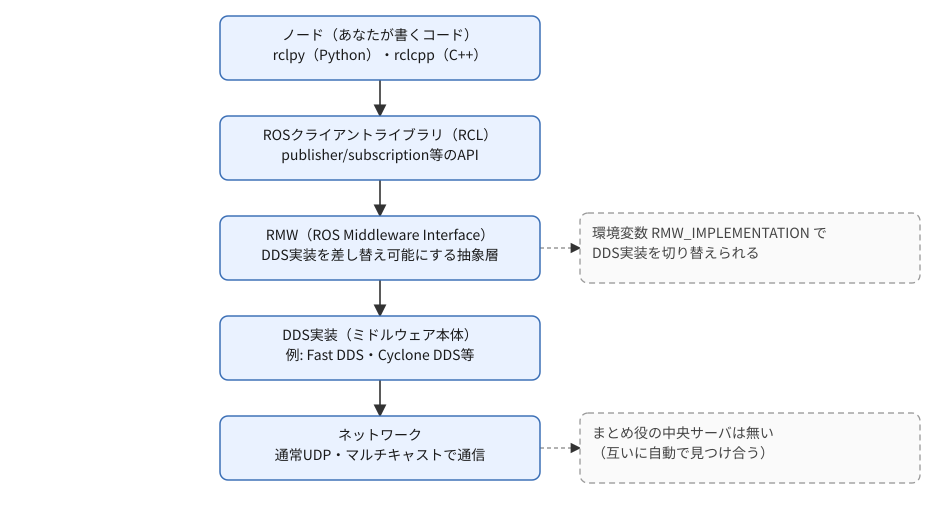

# フェーズ0 手順書: ROS2の概要と全体像

[`docs/learning_plan.md`](learning_plan.md) のフェーズ1（turtlesimでの実機観察）に入る前の読み物。コマンドは実行せず、ROS2という技術の全体像（通信の仕組みの概要・できること・業界ごとの活用・用語・学習マップ・周辺ツール）を先につかんでおく。

- 想定環境: 環境非依存（ROS2導入前でも読める）。用語の一部は [`docs/setup_wsl2_ros2.md`](setup_wsl2_ros2.md) 完了後の方が実感しやすい。
- 所要目安: 1コマ（読み物。手を動かす作業なし）
- 言語: 言語非依存

> **この手順書の位置づけと注意**
> - 本フェーズは知識の地図を作ることが目的で、完了条件は「コマンドが動く」ではなく「自分の言葉で説明できる」。
> - 文章は自分の言葉で書いたが、ROS2・DDS・周辺OSSの事実関係（バージョン、対応OS、ライセンス等）は公式ページの記載に基づく。docs.ros.orgはボット対策（Anubis）で本文の自動取得ができないため、URLはWeb検索結果で実在を確認したものだけを掲載している（詳細は末尾の9節「公式ドキュメント・参考資料」）。細部が最新の公式の情報と食い違う場合は、公式を優先する。

## 0. 学習目標

このフェーズを終えたら、次を自分の言葉で説明できる状態を目指す。

1. ROS2が何のためのソフトウェアか（OSでもフレームワーク1つでもなく、通信規約＋ツール群の集合であること）。
2. ROS2の通信が、役割の違う層を積み重ねた構造（プロトコルスタック）になっていること。
3. ROS2で実現できることの範囲（分散システム・マルチロボット・組み込み・セキュリティ等）。
4. 製造業・モビリティ・建設業・ドローン・介護などの業界で、ROS2がどう使われ、どの特徴が効いているか。
5. ノード・トピック・サービス・アクション・パラメータなど基本用語を迷わず使える。
6. 本プロジェクトの学習ロードマップ（フェーズ1〜7）が、ROS2のどの概念領域に対応しているか見通せる。
7. よく使われる周辺開発ツール（colcon、rqt、RViz2、Gazebo、Nav2等）の役割を一言で言える。

## 1. ROS2とは何か

ROS2（Robot Operating System 2）は、名前に反してOS（オペレーティングシステム）ではない。ロボット向けソフトウェアを作るための**通信の仕組み・ビルドツール・標準ライブラリ・開発ツール群の集合**である。「複数のプログラム（ノード）が、センサ値や制御指令などのデータをやり取りしながら協調して動く」ロボットソフトウェアに共通する土台を、車輪の再発明をせずに使えるようにする。

ROS2は、初代のROS（ROS1）を作り直したものである（ROS1の最後の版のサポートは2025年5月に終了した）。ROS1との違いは、今からROS2で始める分には知らなくても困らないので、Tips集（[`docs/tips.md`](tips.md)）の7節「ROS1との違い」にまとめた。

## 2. 通信の仕組みの概要: 層を積み重ねた構造

ROS2でノード同士がデータをやり取りするとき、あなたが書くコードが直接ネットワークを操作しているわけではない。間には役割の違う層がいくつも積み重なっていて、上の層は、すぐ下の層に「これを送って」と頼むだけで済む。このように、通信の仕事を層に分けて積み重ねた構造を**プロトコルスタック**と呼ぶ。Webページの閲覧が、ブラウザのHTTPの下でTCP、その下でIPが働いて成り立っているのと同じ考え方である。

同じ図（mermaid版）

図の層の名前（RCL・RMW・DDS）は、今は覚えなくてよい。押さえておきたいのは、層に分かれていることで得られる次の3つである。

- **書く人は一番上だけを見ればよい**: ノードを書くときに使うのは、一番上の `rclpy`・`rclcpp` のAPIだけ。データがどんな形でネットワークを流れるかは、下の層が引き受ける。
- **下の層を取り替えられる**: 実際にデータを運ぶ層（DDS）には、複数の製品がある。間に「差し替えのための層」（RMW）が挟まっているので、ノードのコードを変えずに取り替えられる。
- **まとめ役がいなくてもつながる**: ノードは起動すると、同じネットワークにいる相手を自分たちで見つけ合う（ディスカバリ）。中央で名簿を管理するサーバは無い。また、トピックごとに「確実に届けるか、多少欠けてもよいか」といった送り方の約束（QoS）を決められる。QoSはフェーズ3-2bで実際に試す。

各層の詳しい役割（DDSという規格、RMWで選べる実装、ディスカバリの範囲の分け方、QoSの項目）は、Tips集（[`docs/tips.md`](tips.md)）の6節「ROS2の通信の層を詳しく」にまとめた。

## 3. ROS2で実現できること

箇条書きの機能一覧ではなく、「これができると何が嬉しいか」を、自分のロボットを育てていく場面を想像しながら読んでほしい。

**プロセスやPCをまたいで、ノードを増やしていける。** 今はこのPC1台・1つのワークスペースの中で学んでいるが、ROS2のノードは「同じネットワークに置くだけ」でつながる。中央の管理者にノードの存在を届け出る必要はない（2節のディスカバリ）。この教材のフェーズ5では、車両シミュレーションを、制御ノード（目標の速度に近づくように指令を出すノード）とプラントノード（プラント＝制御される対象。ここでは、指令を受けて車両の速度を計算するノード）に分けて作る。だから、将来センサ用の基板や別のPCを足したくなったとき、これらのノードを分散させる、という選択肢がすでに手の中にある。倉庫の中を何十台もの搬送ロボットが同時に動く現場や、複数のロボットが同じ場所を共有する研究（マルチロボット）も、同じ仕組み（ドメインID＝ROS2のシステムを番号で分ける仕組み・namespace＝ノードやトピックの名前の前に区切りを付けて分ける仕組み）の延長線上にある。

**プログラムが実機の「安全」を左右する場面にも耐えられるよう設計されている。** QoSで通信の信頼性を作り込めること、そしてリアルタイムOS上でも動く設計を志向していることは、「多少データが欠けても良いセンサ値」と「絶対に届かないと困る制御指令」を、同じフレームワークの中で区別して扱えるということでもある（本プロジェクトではフェーズ3-2bでQoSの一端に触れる程度に留めるが、産業用ロボットや自動運転がROS2を採用する理由の1つはここにある）。

**PCの中で完結しない世界にも、同じ書き方のまま出ていける。** micro-ROSを使うと、Arduinoのような非力なマイコンでさえ、あなたが今書いているのと同じノード・トピック・パラメータの語彙でROS2に参加できる。「シミュレーションのプラントノードを、いつか本物のモータとセンサに置き換える」という本プロジェクトの発展方向（[`docs/idea_origin.md`](idea_origin.md)の実機連携）は、まさにこの延長線上にある。

**1台の完成形にたどり着くまでの「壊れながら育てる」過程も面倒を見てくれる。** ライフサイクルノード（managed node）という仕組みでは、ノードを「準備はできたが、まだ動いてはいけない」状態から明示的に起動させられる。何十個ものノードが絡み合う大きなシステムほど、この「順番に、確実に立ち上げる」機能のありがたみが増す。

**実機を壊す前に、机の上で何度でも試せる。** Gazeboのような物理シミュレータと組み合わせれば、モータを焼いたり部品を壊したりする心配なく、思いついた制御則を何度でも試せる。フェーズ5の車両シミュレーションは、まさにこの「実機の前にまず仮想で」という発想の最小版であり、フェーズ7で発展させる二足歩行の構想（[`docs/idea_origin.md`](idea_origin.md)）でも同じ考え方を使う。

**自律移動やアーム操作のような「1人では作りきれない機能」を、借りて使える。** Nav2（自律移動・経路計画）、MoveIt2（アームのモーションプランニング）、ros2_control（アクチュエータ制御の抽象化）は、いずれも何年もかけて磨かれてきた大規模OSS。「センサから経路を計画してモータを動かす」を一から書く必要はなく、まずは動かして中身を覗くところから始められる。

**離れた場所や他人とも安全に共有できる。** SROS2によるDDS Securityの認証・暗号化は、「このロボットを外部のネットワークにつないでも、誰かに乗っ取られない」という安心を持ち込む仕組み。1人で学んでいる今は意識しなくてよいが、将来ロボットをチームで開発したり、外部と通信させたりする日が来たときの選択肢として覚えておくとよい。

## 4. 業界ごとのROS2の活用

3節では、ROS2でできることを機能の側から眺めた。この節では視点を変えて、実際の産業の現場を見ていく。製造業・モビリティ・建設業・ドローン・介護を順に見ると、業界によって困りごとが違い、ROS2のどの特徴が効くかも違う。一方で、「センサで周りを知り、判断し、アクチュエータを動かす」という流れは、どの業界にも共通している。これはフィジカルAIの骨格でもあり、フェーズ5で作る「目標速度→制御ノード→プラントノード」のループは、その最小版にあたる。

各業界の小節の最後には、この教材のどのフェーズとつながるかを書いた。今は「こういう世界の入口に立っている」と分かれば十分である。

> 団体・OSSの事実関係は、末尾の9節に挙げた公式ページと記事（2026-09-25時点）に基づく。導入事例や対応バージョンは変わりやすいので、詳しく調べるときは公式の最新情報を確認する。

### 4-1. 製造業: 教えた通りに動くロボットから、見て考えるロボットへ

工場の産業用ロボットは長い間、メーカーごとの専用コントローラと専用言語で、決まった動きを繰り返し教え込む（ティーチングする）ものだった。大量生産のラインなら、それで十分だった。ところが、多品種を少しずつ作る現場や、形も置き方もばらばらな部品をつかむ作業（ばら積みピッキング）では、カメラで対象を見て、その場で経路を計画する必要がある。こうした知能の部分は、メーカーをまたいで共通に作れたほうがよい。

この流れを支えているのが**ROS-Industrial**である。ROSの機能を製造業へ広げるオープンソースのプロジェクトで、米国のSwRI（サウスウエスト研究所）、ドイツのFraunhofer IPA、シンガポールのARTCが中心になったコンソーシアムが方向づけをしている。ロボットメーカー自身がROS2のドライバを出す動きも進んでいる。Universal Robotsは公式のROS2ドライバをGitHubで公開しており、FANUCも協働ロボットCRXシリーズ向けのROS2ドライバを公式に出している。どちらもMoveIt2（アームの動作計画）と組み合わせて使うことを想定している。こうしてメーカーが違っても、上位の「見て、計画して、動かす」部分を同じROS2の語彙で書けるようになる。

- 効いてくるROS2の特徴: ros2_controlによるハードウェアの抽象化、MoveIt2、URDFによるロボットの形の記述
- この教材との接点: フェーズ7のURDF/xacroとros2_control（概念）。フェーズ5で「モデル部をトピックのI/Fから分離しておく」のは、あとでプラントを実機やメーカーのドライバに差し替えるという、同じ発想の小さな版である

### 4-2. モビリティ: 自動運転と搬送ロボット

自動運転車は、LiDAR・カメラ・GNSS（衛星測位）・IMU（慣性センサ）など多くのセンサを積む。それらの情報から自車の位置を推定し（自己位置推定）、周りの物体を認識し、その動きを予測し、走る経路を計画して、ハンドルとアクセルを制御する。この長い処理の流れを多くのノードに分け、トピックでつなぐ構成は、ROS2の得意分野である。

代表例が**Autoware**である。ROS2の上に作られたオープンソースの自動運転ソフトウェアで、上に挙げた自己位置推定・認識・予測・計画・制御の一連の処理を、ノードとトピックの集まりとして実装している。開発は、日本のティアフォーなどが立ち上げたAutoware Foundationが進めている。小さな例では、工場や倉庫で荷物を運ぶ自律移動ロボット（AMR）がある。ここでは3節でも触れたNav2が、地図の上での経路計画と障害物の回避を担う候補になる。

モビリティでは、センサのデータ量が多く、しかも止まっては困る制御指令を同時に流す。3節で見た「多少データが欠けても良いセンサ値」と「絶対に届かないと困る制御指令」をQoSで分けて扱う設計が、ここで効いてくる。

- 効いてくるROS2の特徴: 多数のノードへの分割、QoS、tf2による座標系の管理
- この教材との接点: フェーズ5の車両シミュレーション（速度の指令→プラント→現在速度）は、自動運転の制御部分をぐっと小さくしたものである。フェーズ3-2aで扱う `Twist` 型の速度指令は、移動ロボットで広く使われる型である。フェーズ3-2bのQoSは、この業界で重みが増す

### 4-3. 建設業: 人手不足と危険な現場を、自律施工で補う

建設の現場は、人手不足が深刻なうえ、重機のそばで働く危険も大きい。そこで油圧ショベルなどの建設機械を自動で動かす「自律施工」の研究が進んでいる。ただ、建機はメーカーごとに制御の仕組みが違う。しかも1台で数十トンになる機械を、研究のたびに一から用意して試すことは難しい。

日本では、国立研究開発法人の土木研究所が、自律施工技術基盤**OPERA**を公開している。自動運転に対応した建設機械、実験フィールド、シミュレータ、建機を動かす共通の制御信号、ROSベースのソフトウェア群をまとめて提供するもので、ソフトウェアの一部はGitHubの `pwri-opera` で公開されている（油圧ショベル向けのROS2パッケージもある）。建機のハードウェアの違いをROSの層で吸収するので、研究機関や企業の成果を持ち寄って組み合わせやすい。実際に、清水建設・土木研究所・日立建機の共同で、OPERAを使って油圧ショベルの土砂の掘削からダンプへの積み込みまでを自動化する実験が行われた（2025年の清水建設の発表）。

現場の巡回や点検では、四足歩行ロボットも使われ始めている。Boston DynamicsのSpotには、ROS2から操作するためのドライバ（`spot_ros2`）がオープンソースで公開されている。

- 効いてくるROS2の特徴: ハードウェアの抽象化、シミュレータでの事前検証、1つの現場で複数の機械を協調させる分散構成
- この教材との接点: 重機のように「実機でいきなり試せない」ものほど、フェーズ5-0で触るGazeboのようなシミュレータの価値が上がる。フェーズ5で、実機の代わりに疑似プラントノードで制御を試すのも同じ考え方である

### 4-4. ドローン: 機体の中の制御と、外の知能を分ける

ドローンの姿勢制御は、1秒間に数百回以上の速さで回り続ける必要がある。そのため、この部分は機体に積んだフライトコントローラ（マイコン）で専用のソフトウェアが動かしている。代表的なオープンソースのフライトコントローラ用ソフトウェアがPX4とArduPilotで、どちらもROS2とつながる仕組みを持っている。

- **PX4**: uXRCE-DDSというブリッジを使う。フライトコントローラ側で小さなクライアントが動き、その相手（エージェント）が、機体に一緒に積むコンピュータ（コンパニオンコンピュータ）で動く。エージェントが代理でDDSの世界へ出入りするので、ROS2のノードからは機体の状態がトピックとして見え、指令もトピックで送れる。
- **ArduPilot**: `AP_DDS` というライブラリで、ROS2との通信を標準で持っている。

どちらの場合も、「速い姿勢制御は機体の中」「地図づくり・経路計画・画像認識のような重い知能は、ROS2でコンパニオンコンピュータ側」という役割分担になる。複数のドローンを協調させる研究では、ROS2の上に作られたフレームワーク**Aerostack2**（スペインのマドリード工科大学のグループが開発）もある。

- 効いてくるROS2の特徴: マイコンとPCをまたぐ通信（XRCE-DDS）、マルチロボット
- この教材との接点: 3節のmicro-ROSも、マイコンをROS2に参加させるために同じXRCE-DDSの仕組みを使う。PX4の構成は、3節で書いた、マイコンがPCと同じ語彙でROS2に参加できるという話の、実用化された例として読める

### 4-5. 介護・医療・生活支援: 人のすぐそばで動くロボット

介護や生活支援のロボットは、人のすぐそばで、人に触れることさえある。そのため工場のロボット以上に、安全と信頼性が問われる。この分野で実際に現場に出ている製品は、中身が公開されていないものが多い。ROS（ROS2を含む）が目立つのは、主に次の2つの場面である。

1つは**研究のための共通の土台**である。トヨタのHSR（Human Support Robot）は、移動台車・アーム・カメラ・マイクを備えた生活支援ロボットで、ソフトウェアはROSをもとにしている（ROS1とROS2のどちらに対応しているかは、この手順書では確かめていない。使う場合は公式の最新情報を確認する）。家庭内の支援タスクを競うRoboCup@Homeや、World Robot Summitで標準機として採用されている。研究者は同じ機体の上で成果を共有でき、ハードウェアを一から作る手間が省ける。

もう1つは**施設の中で、複数のロボットと設備をつなぐ仕組み**である。病院では、薬や検体を運ぶロボット、清掃ロボットなど、メーカーの違う複数のロボットが同じ廊下やエレベーターを使う。これらを交通整理し、自動ドアやエレベーターとも連携させる仕組みが**Open-RMF**である。シンガポール政府の支援で病院向けに始まったプロジェクト（RoMi-H）が前身で、ROS2の上に作られている。導入前の検証にはGazeboのシミュレーションも使われる。2021年10月に新しい版の公開を報じたThe Robot Reportの記事では、病院に限らず、空港や商業施設、倉庫などでの利用が紹介されている（今の利用状況は、公式の最新情報で確認する）。

- 効いてくるROS2の特徴: 異なるメーカーのロボットの相互運用、ライフサイクルノードによる確実な立ち上げ、SROS2による通信の保護（3節）
- この教材との接点: この教材では直接は扱わない。ただ、フェーズ4の4-6節で扱うnamespace（ノードやトピックの名前の前に `demo` のような区切りを付けて住み分ける仕組み）は、同じノードを複数台ぶん起動するときに名前がぶつからないようにする基本の道具で、複数のロボットを1つのシステムで動かすときの土台になる

### 4-6. まとめ: 業界と、この教材とのつながり

| 業界 | 代表的なOSS・取り組み | 効いてくるROS2の特徴 | この教材で近いところ |
|---|---|---|---|
| 製造業 | ROS-Industrial、メーカー公式のROS2ドライバ（Universal Robots・FANUC等）、MoveIt2 | ハードウェアの抽象化、動作計画 | フェーズ7（URDF/xacro・ros2_control） |
| モビリティ | Autoware、Nav2 | 多数のノードへの分割、QoS、tf2 | フェーズ3-2a・3-2b、フェーズ5、フェーズ7（tf2） |
| 建設業 | OPERA（土木研究所）、`spot_ros2` | ハードウェアの抽象化、シミュレータ | フェーズ5-0（Gazebo）、フェーズ5（疑似プラント） |
| ドローン | PX4（uXRCE-DDS）、ArduPilot（`AP_DDS`）、Aerostack2 | マイコンとの通信、マルチロボット | 3節のmicro-ROS（この教材では扱わない） |
| 介護・医療・生活支援 | HSR（研究用の共通機体）、Open-RMF | 相互運用、ライフサイクル、セキュリティ | フェーズ4（namespace） |

業界は違っても、見えてくる構図は同じである。センサ・判断・アクチュエータをノードに分け、トピックでつなぎ、できるだけシミュレーションで試してから実機に移す。このあとのフェーズで身に着けるのは、その共通の部分である。

## 5. 基本用語集

| 用語 | 意味 |
|---|---|
| ノード（Node） | 処理の実行単位。基本は1プロセス＝1ノードだが、Composition（この表の下の方の「コンポーネント」の行）で1プロセスに複数ノードをまとめることもできる |
| トピック（Topic） | 名前付きの一方向・継続的な通信チャネル（publish/subscribe） |
| メッセージ（Message） | トピックでやり取りするデータの型。`.msg` ファイルで定義する |
| パブリッシャ／サブスクライバ | トピックにデータを送る側／受け取る側 |
| サービス（Service） | 1回の要求→応答（同期的なRPCに近い）。`.srv` ファイルで型を定義する |
| クライアント／サーバ | サービスを要求する側／処理して結果を返す側 |
| アクション（Action） | 時間のかかる処理向けの非同期通信。goal（目標）・feedback（途中経過）・result（結果）があり、キャンセルもできる。`.action` ファイルで型を定義する |
| パラメータ（Parameter） | ノードの実行時設定値。YAMLファイルや `ros2 param` コマンドで変更できる |
| インターフェース（Interface） | msg／srv／actionの総称。専用パッケージとしてビルドされ、複数言語から共通の型として使える |
| パッケージ（Package） | ROS2の配布・ビルドの単位（`ament_python`／`ament_cmake` 等のビルドタイプがある） |
| ワークスペース（Workspace） | 複数パッケージをまとめてビルドする作業ディレクトリ（`src/`・`build/`・`install/`・`log/`） |
| launchファイル | 複数ノードをまとめて起動する設定（Python／XML／YAMLのいずれかで書ける） |
| QoSプロファイル | 通信の信頼性・持続性・履歴保持等をまとめた設定の組 |
| DDS | ROS2の標準通信ミドルウェア規格（本文2節の図。詳しくは[Tips集](tips.md)の6節） |
| RMW | ROS2のAPIとDDS実装をつなぐ抽象層（本文2節の図。詳しくは[Tips集](tips.md)の6節） |
| Executor | ノードのコールバック（受信時に呼ばれる関数）をいつ・どのスレッドで実行するかを管理する仕組み |
| コールバックグループ | 複数のコールバックを、同時実行してよいか排他にすべきかで束ねる仕組み。Executorと組み合わせて使う |
| ライフサイクルノード（Managed Node） | unconfigured→inactive→active等の状態遷移を持つ、起動・終了の手順が管理されたノード |
| コンポーネント（Composition） | 複数ノードを1プロセスにまとめて実行する仕組み（プロセス間通信のオーバーヘッドを避けられる）。フェーズ4とフェーズ5の間の間章（[`docs/interlude_components.md`](interlude_components.md)）で扱う |
| colcon | ROS2の標準ビルドツール。ワークスペース単位で複数パッケージをビルドする |
| ament | ROS2のビルドシステム・Lint等のツール群の総称（`ament_cmake`／`ament_python` はこの一部） |
| rosdep | パッケージが必要とする依存関係を解決・導入するツール |
| ROS_DOMAIN_ID | 同一ネットワーク上で複数のROS2システムを分離するための番号 |

## 6. 学習しなければならない概念（本プロジェクトの地図）

いきなり全部を学ぶのではなく、段階的に積み上げる。本プロジェクトの各フェーズがどこに対応するかを整理する。

| 概念領域 | 具体的な内容 | 本プロジェクトでの対応 |
|---|---|---|
| 通信パターン | トピック・サービス・アクション・パラメータ | フェーズ1（観察）・フェーズ3（自作。サービスとアクションは概要を掴む程度でよい） |
| QoS | reliability／durability／history等 | フェーズ3-2b（合わないと黙ってつながらないことを体験する） |
| ビルド・パッケージ管理 | colcon、ament、`package.xml`（パッケージの名前・依存などを書く設定ファイル）、ワークスペース | フェーズ2 |
| 起動管理 | launchファイル（Python/XML/YAML）、namespace、remap（起動するときにノード名やトピック名を付け替えること） | フェーズ4 |
| 実行モデル | Executor、コールバックグループ、spin（コールバックを呼び出しながら、ノードを動かし続ける処理） | フェーズ3で触れる程度（フェーズ3-5で複数スレッドのexecutorに少し触れる）。深入りは発展課題 |
| ノードの組み立て方 | コンポーネント（Composition）、`Node` クラスの内部構造 | 間章（[`docs/interlude_components.md`](interlude_components.md)）、参考資料（[`docs/reference_node_class.md`](reference_node_class.md)） |
| 座標変換 | tf2（broadcaster/listener、座標系） | フェーズ7 |
| ロボット記述 | URDF／xacro、RViz2での可視化 | フェーズ7 |
| 制御フレームワーク | ros2_control（ハードウェア抽象化） | フェーズ7 |
| シミュレーション | Gazebo（物理エンジン、センサ模擬） | フェーズ5-0（導入と基本。必須）、フェーズ5-1〜5-4（車両の表示と、物理での制御）、フェーズ7（URDF等と組み合わせた発展） |
| ライフサイクル管理 | managed node、状態遷移 | 本プロジェクトでは扱わない（用語のみ把握） |
| ナビゲーション／操作 | Nav2、MoveIt2 | 本プロジェクトの範囲外（将来の発展課題） |
| セキュリティ | SROS2（認証・暗号化） | 本プロジェクトでは扱わない（用語のみ把握） |
| 組み込み | micro-ROS | 本プロジェクトでは扱わない（将来の実機連携時に検討） |

## 7. よく使われるROS2の周辺開発環境・ツール

全部を今覚える必要はない。「ROS2を学んでいて、こういう場面が来たら、これを思い出せばいい」という地図として眺めてほしい。ツールは、あなたがROS2の開発で実際に踏む5つの場面ごとに並べている。

**場面1: まず手元で動かす・作る（この後すぐ使う）**

コードを書く前後に必ず触る、いわば「道具箱の土台」。

| ツール | できること |
|---|---|
| colcon | ワークスペースの複数パッケージを一括ビルドする |
| ament | ビルドの仕組み・Lint等を支えるツール群（`ament_python`／`ament_cmake`はこの一部） |
| rosdep | パッケージが必要とする依存関係を自動で解決・導入する |

**場面2: 「今、中で何が起きているか」を目で見る**

コードを読むだけでは、ノード同士が実際につながっているか、センサの値がどう流れているかは分からない。そこで役立つのが可視化系のツール。

| ツール | 見えるようになるもの |
|---|---|
| rqt_graph | 「誰が誰と話しているか」をノードとトピックの線図で見せる（フェーズ1で早速使う） |
| rqt_console／rqt_plot | ログの一覧、数値の時系列グラフ |
| RViz2 | ロボットの姿勢・座標系・センサ点群を3D空間で見る（フェーズ7でURDFを表示するときに使う） |
| Foxglove Studio | RViz2やrqtの機能をWeb／デスクトップアプリでまとめて使える、サードパーティの可視化ツール |

**場面3: 「あの時の挙動」を記録して、後から検証する**

一発勝負で確認するのではなく、動かした結果を保存しておいて、後でじっくり見返す・他の人と共有する、という使い方ができる。

| ツール | 何を残せるか |
|---|---|
| `ros2 bag`（rosbag2） | トピックの記録・再生。フェーズ6で、制御の効き方を後から評価するのに使う |
| PlotJuggler（任意） | bagデータをより高機能に可視化する |

**場面4: 「何年もかけて磨かれた機能」を、自分の手で書かずに使う**

自律移動やアーム操作、座標変換、ロボットの3D形状記述といった、それ自体が奥深い専門分野については、車輪の再発明をせず既存のOSSに乗るのが定石。まずは動かして中身を覗くところから理解が始まる。

| ツール | 何をしてくれるか |
|---|---|
| tf2／tf2_tools | ロボットの各部位の座標系どうしの関係（位置・向き）を管理・変換する（フェーズ7） |
| URDF／xacro | ロボットの構造・見た目を記述する（xacroはURDFを書きやすくするマクロ拡張）。フェーズ7でRViz2表示とセットで使う |
| ros2_control | モータ等のアクチュエータ制御を抽象化するフレームワーク（フェーズ7で概念を把握） |
| Gazebo（Harmonic等） | 3D物理シミュレータ。実機を壊す心配なく試せる（フェーズ5-0で導入し、フェーズ5で使う。フェーズ7ではURDF等と組み合わせた発展に使う） |
| Nav2 | 自律移動スタック（経路計画・SLAM連携等）。本プロジェクトの範囲外だが、次に進むときの選択肢として覚えておくとよい |
| MoveIt2 | アーム等のモーションプランニング。同上（範囲外・発展課題） |

**場面5: 実機につなぐ・人と共有する日が来たとき**

1人で机の上のシミュレーションを動かしている今はまだ出番がないが、学習が進んで「本物のモータやセンサにつなぐ」「他の人と一緒に開発する」「外部のネットワークに公開する」段階になったときに思い出したい道具。

| ツール | どんな場面で効いてくるか |
|---|---|
| micro-ROS | マイコン（Arduino等）を、PCと同じROS2の語彙（ノード・トピック・パラメータ）でシステムに参加させる |
| SROS2 | DDS Securityによる認証・暗号化・アクセス制御。ロボットを外部ネットワークにつなぐときの安心材料 |
| Docker | 環境をまるごと再現できるコンテナ。複数人・複数PCで同じ環境を揃えたいときに使う |

本プロジェクトで実際に使う予定があるのは、場面1〜3の全部と、場面4のGazebo（フェーズ5で必須）・tf2・URDF/xacro・ros2_control（概念）。導入時期は [`docs/learning_plan.md`](learning_plan.md) の「OSS活用計画」を参照。

## 8. 次のフェーズへ

まだROS2を導入していない場合は、環境構築の手順書（[`docs/setup_wsl2_ros2.md`](setup_wsl2_ros2.md)）で、WSL2・Ubuntu・ROS2を導入する。そのうえでフェーズ1（[`docs/phase1_cli_turtlesim.md`](phase1_cli_turtlesim.md)）に進む。フェーズ1では、本フェーズで説明した4つの通信方式（トピック・サービス・パラメータ・アクション）を、turtlesimを動かしながら実際に `ros2` コマンドで観察する。ここで「知っている」状態にした用語を、次のフェーズで「触って確認した」状態にする。

## 9. 公式ドキュメント・参考資料

確認状況（2026-09-23。「業界ごとの活用例」は2026-09-25）: 以下のURLはWeb検索結果で実在を確認した。docs.ros.orgは本文取得がボット対策で拒否されるため、内容の逐語照合はできていない（本文は自分の言葉で書いた要約）。

### ROS2本体（公式・Jazzy）

- [ROS 2 Documentation: Jazzy](https://docs.ros.org/en/jazzy/)（目次）
- [Basic Concepts — Jazzy](https://docs.ros.org/en/jazzy/Concepts/Basic.html)
- [Different ROS 2 middleware vendors — Jazzy](https://docs.ros.org/en/jazzy/Concepts/Intermediate/About-Different-Middleware-Vendors.html)
- [RMW implementations — Jazzy](https://docs.ros.org/en/jazzy/Installation/RMW-Implementations.html)
- [Quality of Service settings — Jazzy](https://docs.ros.org/en/jazzy/Concepts/Intermediate/About-Quality-of-Service-Settings.html)
- [Managing nodes with managed lifecycles — Jazzy](https://docs.ros.org/en/jazzy/Tutorials/Demos/Managed-Nodes.html)
- [ROS 2 design: Quality of Service policies](https://design.ros2.org/articles/qos.html)
- [ROS 2 design: Managed nodes (node lifecycle)](https://design.ros2.org/articles/node_lifecycle.html)
- [ROS 2 design documentation（トップ）](http://design.ros2.org/)

### DDS（通信ミドルウェア規格）

- [Data Distribution Service (DDS) — Object Management Group](https://www.omg.org/omg-dds-portal/)
- [DATA-DISTRIBUTION SERVICE SPECIFICATION（PDF・OMG）](https://www.omg.org/intro/DDS.pdf)

### 周辺OSS・ツール（公式）

- [colcon documentation](https://colcon.readthedocs.io/)
- [ros2_control documentation — Jazzy](https://control.ros.org/jazzy/index.html)
- [Nav2 documentation](https://docs.nav2.org/)
- [MoveIt 2 Documentation](https://moveit.picknik.ai/)
- [micro-ROS](https://micro.ros.org/)
- [ros2/sros2（GitHub）](https://github.com/ros2/sros2)
- [Foxglove — Visualize ROS data](https://foxglove.dev/ros)
- [Installing Gazebo with ROS — Gazebo documentation](https://gazebosim.org/docs/latest/ros_installation/)

### 業界ごとの活用例（4節）

- [ROS-Industrial](https://rosindustrial.org/)（[FAQ](https://rosindustrial.org/about/faq)）
- [UniversalRobots/Universal_Robots_ROS2_Driver（GitHub）](https://github.com/UniversalRobots/Universal_Robots_ROS2_Driver)
- [FANUC's Open Platform ROS 2 Driver](https://www.fanucamerica.com/solutions/ros-2)
- [Autoware Overview — Autoware](https://autoware.org/autoware-overview/)
- [自律施工技術基盤 OPERA — 土木研究所 先端技術チーム](https://www.pwri.go.jp/team/advanced/opera.html)
- [pwri-opera（GitHub）](https://github.com/pwri-opera)
- [油圧ショベルによる土砂掘削・ダンプ積載作業を自動化 — 清水建設（2025年）](https://www.shimz.co.jp/company/about/news-release/2025/2025011.html)
- [bdaiinstitute/spot_ros2（GitHub）](https://github.com/bdaiinstitute/spot_ros2)
- [ROS 2 User Guide — PX4 Guide](https://docs.px4.io/main/en/ros2/user_guide)
- [uXRCE-DDS (PX4-ROS 2/DDS Bridge) — PX4 Guide](https://docs.px4.io/main/en/middleware/uxrce_dds)
- [ROS 2 — ArduPilot Dev documentation](https://ardupilot.org/dev/docs/ros2.html)
- [aerostack2/aerostack2（GitHub）](https://github.com/aerostack2/aerostack2)
- [Open-RMF（公式）](https://www.open-rmf.org/)
- [New version of Open-RMF hits ROS 2 — The Robot Report](https://www.therobotreport.com/new-version-of-open-rmf-hits-ros2/)
- [ROMI-H — Changi General Hospital（CHART）](https://www.cgh.com.sg/chart/projects/romi-h)
- [ROMI-H: Bringing Robot Traffic Control to Healthcare — Open Robotics](https://www.openrobotics.org/blog/2021/2/10/romi-h-bringing-robot-traffic-control-to-healthcare)
- [Toyota: Advancing the Integration of Robots and AI（HSRの研究コミュニティ）](https://global.toyota/en/mobility/frontier-research/42394425.html)

> 各ツールは版によって対応状況が変わりうる。本プロジェクトで実際に導入・使用する際は、その時点の公式ページを改めて確認する。

> 出典: ROS2・DDS・周辺OSS・業界の活用例の事実関係は、9節に挙げた公式ページと記事に基づく（ROS 2の公式ドキュメントはCC BY 4.0）。文章と構成は自分の言葉でまとめたもので、逐語の転載ではない。
