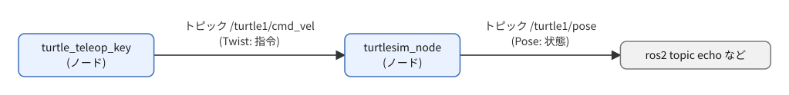
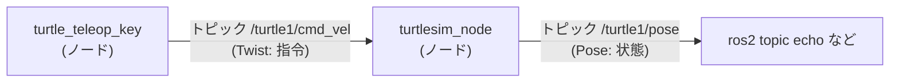
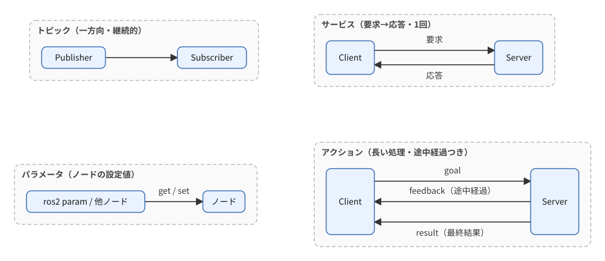
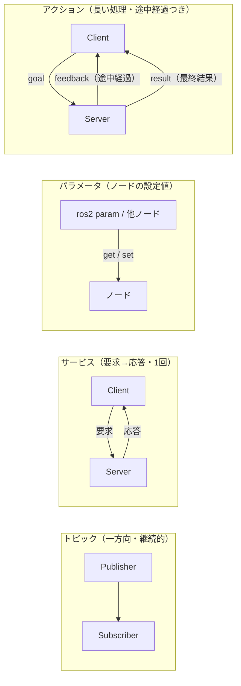

# フェーズ1 手順書: turtlesimとCLIでROS2の通信を観察する

[`docs/learning_plan.md`](learning_plan.md) フェーズ1（idea_origin.md ステップ1の1-1）に対応する。コードは書かず、既製のノード（turtlesim）を動かしながら `ros2` コマンドとrqtでROS2の仕組みを観察する。

- 想定環境: WSL2 + Ubuntu 24.04 + ROS2 Jazzy（[`docs/setup_wsl2_ros2.md`](setup_wsl2_ros2.md) 完了済み）
- 所要目安: 1〜2コマ
- 言語: 本フェーズは言語非依存（Python/C++の区別なし）。

> **この手順書の位置づけと注意**
> - **実機確認済み（2026-09-21）**: 本手順書のコマンドは、すべて実機で実行して動作を確認した。出力例は筆者の知識に基づくため、表示が細部で異なる場合は実機を優先する。
> - コマンドは筆者（Claude）の知識に基づく。公式ページ（docs.ros.org）はボット対策で本文を取得できず、逐語照合はできていない。**出力例と実際の表示が違う場合は、実機の表示を優先する**。
> - **実行環境が無くても読めるように**: コマンドの直後に「期待する結果」として、表示される内容の例とその読み方を載せている。時刻・数値の細部は実行するたびに変わる。
> - 文章・構成は自分の言葉で書いたが、コマンド例の値（`linear.x: 2.0`、`/spawn` の座標、`rotate_absolute` の角度等）は公式チュートリアルの例と同等のものを含む。公式ドキュメントはCC BY 4.0で、出典は末尾に記載する。期待する結果に載せた `ros2 interface show` の表示のうち、`turtlesim` の型の定義は `turtlesim` パッケージ（BSD License）、`geometry_msgs` の型の定義は `common_interfaces`（Apache License 2.0）のものである。詳細は末尾の公式ドキュメントを参照。

## 0. 学習目標と完了条件

学ぶこと: ROS2の4つの通信（トピック・サービス・パラメータ・アクション）と、それを調べる `ros2` コマンド。

完了条件（すべて満たす）:

1. `/turtle1/cmd_vel` の型が [`geometry_msgs/msg/Twist`](https://github.com/ros2/common_interfaces/blob/jazzy/geometry_msgs/msg/Twist.msg) であることを `ros2 interface show` で確認し、フィールドの意味（直進速度・回転速度）を説明できる。
2. `ros2 topic pub` で亀を動かせる。
3. トピック・サービス・パラメータ・アクションを、それぞれ1回以上コマンドで操作できる。
4. 4つの通信の違い（誰が誰に、一方向か往復か、途中経過があるか）を、自分の言葉で説明できる。
5. `rqt_graph` の図とノード・トピックの一覧が対応していると確認できる。

## 1. 準備

### 1-1. パッケージの導入

turtlesimとrqtはROS2の公式aptパッケージ。環境構築の手順書のとおり Desktop Install で導入していれば、既に入っている（下のコマンドを実行しても、「最新版です」と表示されるだけで害は無い）。

- 目的: 観察用のシミュレータ（turtlesim）とGUIツール（rqt）を入れる
- セキュリティへの影響: 公式aptリポジトリ（手順書 [`setup_wsl2_ros2.md`](setup_wsl2_ros2.md) で登録済み）からの導入で、外部通信はapt取得のみ。追加のリポジトリ登録はない

```bash
sudo apt update

sudo apt install -y ros-jazzy-turtlesim ros-jazzy-rqt ros-jazzy-rqt-graph ros-jazzy-rqt-console
```

**期待する結果**: 導入するパッケージの一覧が表示され、最後にエラー（`E:` で始まる行）が出ずにプロンプトへ戻れば成功。

導入確認:

```bash
ros2 pkg executables turtlesim
```

`ros2 pkg executables <パッケージ名>` は、そのパッケージに入っている実行ファイル（`ros2 run` で起動できるプログラム）の名前を並べるコマンドである。

**期待する結果**: turtlesimパッケージの実行ファイルが4つ並べば、導入できている。

```text
turtlesim draw_square
turtlesim mimic
turtlesim turtle_teleop_key
turtlesim turtlesim_node
```

### 1-2. GUIが出ることの確認

turtlesimやrqtはWSLg経由でWindows側にウィンドウが出る。

**手順A: 表示の前提を確認する（WSL側）**

```bash
echo $DISPLAY          # 空でなければよい

echo $WAYLAND_DISPLAY  # 空でもX11経由で表示できることが多い

ls /mnt/wslg           # WSLgの領域が見えること
```

**期待する結果**（WSLgが有効な場合）:

```text
$ echo $DISPLAY
:0
$ echo $WAYLAND_DISPLAY
wayland-0
$ ls /mnt/wslg
PulseServer  PulseAudioRDPSink  runtime-dir  stderr.log  versions.txt  weston.log  wlog.log
```

`ls /mnt/wslg` の中身は版によって多少異なる。ディレクトリが存在して何かが並べばよい。

**手順B: turtlesimを起動する（T1）**

```bash
ros2 run turtlesim turtlesim_node
```

書式は `ros2 run <パッケージ名> <実行ファイル名>`。ここでは、`turtlesim` パッケージの `turtlesim_node`（亀を表示するシミュレータのノード）を起動する。

**期待する結果**: 水色（青系）の背景に亀が1匹いるウィンドウがWindows側に出る。ターミナルには次のようなログが出る（時刻の数字は実行ごとに変わる）。亀の初期位置は画面の中央（x, yとも約5.54）で、向き（theta）は0＝右向き。

```text
[INFO] [1790072000.123456789] [turtlesim]: Starting turtlesim with node name /turtlesim
[INFO] [1790072000.134567890] [turtlesim]: Spawning turtle [turtle1] at x=[5.544445], y=[5.544445], theta=[0.000000]
```
- 確認後は、T1で `Ctrl+C` で止める（ウィンドウも閉じる）。

**手順C: rqtを起動する（T1）**

```bash
rqt
```

**期待する結果**: 空のrqtウィンドウが出る。上部メニュー `Plugins` が開ければよい（ここではプラグインは使わない）。

- 確認後はウィンドウを閉じるか、`Ctrl+C` で止める。

**手順D: 起動できたものを個別に確認する（任意）**

```bash
# T1
rqt_graph      # ノード・トピックの図を出すウィンドウ（フェーズ1の後半で使う）

# T2
ros2 run rqt_console rqt_console    # ログ表示ウィンドウ（rqt_console単独のコマンドはPATHになく、ros2 run経由で起動する）
```

**期待する結果**: T1とT2のそれぞれで、ウィンドウがWindows側に開けばよい（中身は3-8節（rqtで可視化する）で使う）。どちらのコマンドも、ウィンドウを閉じるまでターミナルを占有するので、ターミナルを分けて実行する。確かめたら、ウィンドウを閉じる。

**うまくいかない場合の切り分け**

| 症状 | 確認・対処（この順に） |
|---|---|
| `echo $DISPLAY` が空 | WSLgが無効。Windows側のPowerShellで `wsl --version` を実行しWSLgの記載を確認し、`wsl --update` を実行 |
| `wsl --update` 後も出ない | Windows側のPowerShellで `wsl --shutdown` を実行し、WSLを開き直して手順Aからやり直す |
| Qtの `could not connect to display` 系のエラー | 手順Aの `$DISPLAY` を再確認。別ターミナルで `export DISPLAY=:0` を試す（一時的な確認用） |
| `Package 'turtlesim' not found` | 1-1の導入が未完了。`ros2 pkg executables turtlesim` で確認 |

- 目的・影響: 上記はすべて読み取りか自分のPC内のプロセス起動で、外部通信・設定変更はない（`wsl --update` はMicrosoftの公式更新でWindows側の変更を伴うため、実行するかは自分で判断する）。
- 出力例・エラー文言は筆者の知識に基づく。実機の表示が違う場合は、実機を優先する。

### 1-3. 環境変数（追記する）

他のPCやネットワーク上のROS2ノードと混線しないよう、通信範囲を自分のPC内に限定する。

```bash
export ROS_AUTOMATIC_DISCOVERY_RANGE=LOCALHOST
```

**期待する結果**: 何も表示されない（`export` は、成功しても何も表示しない）。`echo $ROS_AUTOMATIC_DISCOVERY_RANGE` で `LOCALHOST` と表示されれば、設定されている。

環境変数は**ターミナルごとの設定**なので、毎回手入力だとT1〜T3の一部だけに設定漏れが起き、通信範囲が食い違って `ros2 node list` が空になる、というフェーズ内・フェーズ間で再現性のない不具合につながる。**`~/.bashrc` に追記する**（追記後は新しく開くターミナルから有効）。

**`~/.bashrc` 追記行（累積・この時点）**: [`docs/setup_wsl2_ros2.md`](setup_wsl2_ros2.md) の4節の5番目の手順の分に、本節の分を加えると次の状態になっているはず。

```bash
source /opt/ros/jazzy/setup.bash                  # セットアップ手順（ステップ0）で追加。ROS2本体の読み込み（常時必要、削除しない）

export ROS_AUTOMATIC_DISCOVERY_RANGE=LOCALHOST    # 本節（フェーズ1）で追加。通信範囲を自分のPC内に限定（常時必要、削除しない）
```

以後のフェーズで `~/.bashrc` への追記が必要になった場合は、その手順書の該当箇所で上記に追記した累積リストを示す（学習が一区切りついた際に、どれが恒常的な設定でどれが検証用の一時的な行かを判別できるようにする意図）。

### 1-4. ターミナルの構成

ターミナルを複数使う。どのターミナルでも、ROS2は `~/.bashrc` で読み込み済みなので追加の `source` は不要（新しく開いたターミナルなら自動的に有効）。

| ターミナル | 用途 |
|---|---|
| T1 | turtlesim本体を動かし続ける |
| T2 | 操作用のキーボード（teleop）、または観察コマンドの実行 |
| T3 | 観察コマンドを追加で実行 |

## 2. 全体像

まず、これから観察する対象を図で押さえる。



<details>
<summary>同じ図（mermaid版）</summary>



</details>

4つの通信の違い:



<details>
<summary>同じ図（mermaid版）</summary>



</details>

> **車両シミュレーションとの対応**（フェーズ5への伏線）: フェーズ5では、車両を「制御ノード」（目標に近づくように指令を出す側）と「プラント」（制御される対象。指令を受けて動き、今の状態を返す側）のノードに分けて作る。`Twist` は「制御ノード → プラント」の指令、`Pose` は「プラント → 制御ノード」の状態に相当する。turtlesimは、私たちが後で作るプラントノードの見本になる。

## 3. 手順

### 3-1. turtlesimを起動する（T1）

```bash
ros2 run turtlesim turtlesim_node
```

**期待する結果**: 青い背景に亀のウィンドウが出る（ターミナルのログは1-2の手順Bと同じ）。

### 3-2. キーボードで動かす（T2）

```bash
ros2 run turtlesim turtle_teleop_key
```

**期待する結果**: T2に操作方法の案内が出る。

```text
Reading from keyboard
---------------------------
Use arrow keys to move the turtle.
Use G|B|V|C|D|E|R|T keys to rotate to absolute orientations. 'F' to cancel a rotation.
'Q' to quit.
```

このターミナルを選択した状態で矢印キーを押すと、亀が動く（↑で前進、↓で後退、←→でその場で旋回）。亀が通った跡には白い線が残る。動いたら、**その裏で何がやり取りされているか**が次の観察の対象になる。

### 3-3. ノードを調べる（T3）

```bash
ros2 node list

ros2 node info /turtlesim
```

`node list` には、T1とT2で動かしている2つのノードが並ぶ。`node info` の出力には、そのノードが購読（Subscribers）・配信（Publishers）・提供（Service Servers）・アクション（Action Servers）するものが並ぶ。

**期待する結果**（抜粋。`/turtlesim/describe_parameters` などパラメータ用のサービスが6つほど続くが、省略した）:

```text
$ ros2 node list
/teleop_turtle
/turtlesim

$ ros2 node info /turtlesim
/turtlesim
  Subscribers:
    /parameter_events: rcl_interfaces/msg/ParameterEvent
    /turtle1/cmd_vel: geometry_msgs/msg/Twist
  Publishers:
    /parameter_events: rcl_interfaces/msg/ParameterEvent
    /rosout: rcl_interfaces/msg/Log
    /turtle1/color_sensor: turtlesim/msg/Color
    /turtle1/pose: turtlesim/msg/Pose
  Service Servers:
    /clear: std_srvs/srv/Empty
    /kill: turtlesim/srv/Kill
    /reset: std_srvs/srv/Empty
    /spawn: turtlesim/srv/Spawn
    /turtle1/set_pen: turtlesim/srv/SetPen
    /turtle1/teleport_absolute: turtlesim/srv/TeleportAbsolute
    /turtle1/teleport_relative: turtlesim/srv/TeleportRelative
    /turtlesim/describe_parameters: rcl_interfaces/srv/DescribeParameters
    ...
  Service Clients:

  Action Servers:
    /turtle1/rotate_absolute: turtlesim/action/RotateAbsolute
  Action Clients:

```

「トピック名: 型」の形で並ぶ。`/turtle1/...` の名前が付いたものは亀1匹ごとに用意され、`/clear` や `/spawn` のように亀の名前が付かないものはシミュレータ全体に1つだけある。

> 課題1: `/turtlesim` のSubscribersに `/turtle1/cmd_vel` が、Publishersに `/turtle1/pose` があることを確認する。

ノード名の変更（remap）も試す。T1のturtlesimを止めて、名前を変えて再起動する。

```bash
# T1
ros2 run turtlesim turtlesim_node --ros-args --remap __node:=my_turtle

# T3
ros2 node list
```

`--ros-args` より後ろは、プログラムではなくROS2に向けた指定である。`--remap __node:=my_turtle` は「ノード名（`__node`）を `my_turtle` に付け替える」という意味になる。

**期待する結果**: ノード一覧の `/turtlesim` が `/my_turtle` に置き換わる。起動ログも `Starting turtlesim with node name /my_turtle` になる。動作（亀のウィンドウ）は何も変わらない。

```text
/my_turtle
/teleop_turtle
```

試し終わったら、T1を `Ctrl+C` で止め、元の名前（`ros2 run turtlesim turtlesim_node`）で起動し直してから次へ進む（以降のコマンドは `/turtlesim` の名前を前提にしている）。

### 3-4. トピック（一方向・継続的）

```bash
ros2 topic list -t                 # -t で型も表示

ros2 topic info /turtle1/cmd_vel   # 型、Publisher数、Subscription数

ros2 interface show geometry_msgs/msg/Twist

ros2 topic echo /turtle1/pose      # 亀の状態を流し見る（Ctrl+Cで停止）

ros2 topic hz /turtle1/pose        # 配信周期を測る
```

**期待する結果**（1コマンドずつ。`echo` と `hz` は `Ctrl+C` で止めるまで表示が続く）:

```text
$ ros2 topic list -t
/parameter_events [rcl_interfaces/msg/ParameterEvent]
/rosout [rcl_interfaces/msg/Log]
/turtle1/cmd_vel [geometry_msgs/msg/Twist]
/turtle1/color_sensor [turtlesim/msg/Color]
/turtle1/pose [turtlesim/msg/Pose]

$ ros2 topic info /turtle1/cmd_vel
Type: geometry_msgs/msg/Twist
Publisher count: 1
Subscription count: 1

$ ros2 interface show geometry_msgs/msg/Twist
# This expresses velocity in free space broken into its linear and angular parts.

Vector3  linear
	float64 x
	float64 y
	float64 z
Vector3  angular
	float64 x
	float64 y
	float64 z

$ ros2 topic echo /turtle1/pose
x: 5.544444561004639
y: 5.544444561004639
theta: 0.0
linear_velocity: 0.0
angular_velocity: 0.0
---
x: 5.544444561004639
...

$ ros2 topic hz /turtle1/pose
average rate: 62.502
	min: 0.015s max: 0.017s std dev: 0.00041s window: 64
```

- `topic info` の `Publisher count: 1` はteleop（`/teleop_turtle`）、`Subscription count: 1` はturtlesim。teleopを止めると `Publisher count: 0` になる。
- `topic echo` は、亀が止まっていても同じ値を流し続ける（状態を定期的に配信しているため）。矢印キーで亀を動かすと、x・y・thetaの値が変わる。
- `topic hz` は約62 Hz（turtlesimの内部の更新周期、約16ミリ秒ごと）になる。

`Twist` は `linear`（x, y, z）と `angular`（x, y, z）を持つ。亀（2D）では `linear.x`（前進速度）と `angular.z`（旋回速度）だけが意味を持つ。

コマンドから直接指令を送る:

```bash
# 1回だけ送る: 前進しながら旋回
ros2 topic pub --once /turtle1/cmd_vel geometry_msgs/msg/Twist "{linear: {x: 2.0}, angular: {z: 1.8}}"

# 1 Hzで送り続ける（円を描く。Ctrl+Cで停止）
ros2 topic pub -r 1 /turtle1/cmd_vel geometry_msgs/msg/Twist "{linear: {x: 2.0}, angular: {z: 1.8}}"
```

**期待する結果**: どちらのコマンドも、送った内容をターミナルに表示する。

```text
publisher: beginning loop
publishing #1: geometry_msgs.msg.Twist(linear=geometry_msgs.msg.Vector3(x=2.0, y=0.0, z=0.0), angular=geometry_msgs.msg.Vector3(x=0.0, y=0.0, z=1.8))
```

- `--once` では、亀は弧を描いて少し進み、約1秒で止まる（turtlesimは、指令が1秒届かないと止まる作り）。コマンドは1回送ると終了する。
- `-r 1` では `publishing #2`, `#3`, ... と1秒ごとに表示が増え、亀は円を描き続ける。指令が1秒おきに届くので、止まる前に次の指令が来て動き続ける。

> 課題2: `--once` と `-r 1` で亀の動き方がどう違うか観察する。`ros2 topic echo /turtle1/pose` を並行して実行し、位置（x, y）と角度（theta）が変化する様子を確認する。
>
> 課題3: `ros2 topic hz /turtle1/cmd_vel` を実行しながら `pub -r 1` と `pub -r 10` を試し、周期が一致することを確認する。

### 3-5. サービス（要求→応答）

```bash
ros2 service list -t

ros2 service type /clear

ros2 interface show turtlesim/srv/Spawn

ros2 service call /clear std_srvs/srv/Empty                                 # 軌跡を消す

ros2 service call /spawn turtlesim/srv/Spawn "{x: 2.0, y: 2.0, theta: 0.2, name: ''}"   # 亀を追加
```

**期待する結果**（抜粋）:

```text
$ ros2 service list -t
/clear [std_srvs/srv/Empty]
/kill [turtlesim/srv/Kill]
/reset [std_srvs/srv/Empty]
/spawn [turtlesim/srv/Spawn]
/teleop_turtle/describe_parameters [rcl_interfaces/srv/DescribeParameters]
...
/turtle1/set_pen [turtlesim/srv/SetPen]
/turtle1/teleport_absolute [turtlesim/srv/TeleportAbsolute]
/turtle1/teleport_relative [turtlesim/srv/TeleportRelative]
/turtlesim/describe_parameters [rcl_interfaces/srv/DescribeParameters]
...

$ ros2 service type /clear
std_srvs/srv/Empty

$ ros2 interface show turtlesim/srv/Spawn
float32 x
float32 y
float32 theta
string name # Optional.  A unique name will be created and returned if this is empty
---
string name

$ ros2 service call /clear std_srvs/srv/Empty
requester: making request: std_srvs.srv.Empty_Request()

response:
std_srvs.srv.Empty_Response()

$ ros2 service call /spawn turtlesim/srv/Spawn "{x: 2.0, y: 2.0, theta: 0.2, name: ''}"
requester: making request: turtlesim.srv.Spawn_Request(x=2.0, y=2.0, theta=0.2, name='')

response:
turtlesim.srv.Spawn_Response(name='turtle2')
```

- `service list` には、ノードごとに自動で作られるパラメータ用のサービス（`describe_parameters` など）が多数並ぶ。自分で使うのは上の `/clear` や `/spawn` など。
- `interface show` の `---` より上が要求（Request）、下が応答（Response）。サービスの型は、この2つの組である。
- `/clear` を呼ぶと、画面上の軌跡（白い線）が消える。`/clear` の型は [`std_srvs/srv/Empty`](https://github.com/ros2/common_interfaces/blob/jazzy/std_srvs/srv/Empty.srv) で、要求にも応答にも中身が無い。応答は空（`Empty_Response()`）で、「終わった」ことだけが返る。
- `/spawn` を呼ぶと、画面の左下寄り（x=2, y=2）に2匹目の亀が現れ、応答として付けられた名前 `turtle2` が返る（`name` を空にしたので自動で付いた）。

`/spawn` の後で `ros2 topic list` を実行すると、2匹目の亀（`/turtle2/...`）用のトピックが増える。ノード名や名前空間で対象が区別されることを確認する。

> 課題4: `/spawn` で2匹目を出し、`ros2 topic pub` で `/turtle2/cmd_vel` に指令を送って2匹目だけを動かす。

### 3-6. パラメータ（ノードの設定値）

```bash
ros2 param list

ros2 param get /turtlesim background_r

ros2 param set /turtlesim background_r 150   # 背景色が変わる

ros2 param dump /turtlesim                   # 現在の設定をYAMLで出力
```

**期待する結果**（`dump` の分は、この下の読み方の後に載せる）:

```text
$ ros2 param list
/teleop_turtle:
  qos_overrides./parameter_events.publisher.depth
  ...
  scale_angular
  scale_linear
  use_sim_time
/turtlesim:
  background_b
  background_g
  background_r
  holonomic
  qos_overrides./parameter_events.publisher.depth
  ...
  use_sim_time

$ ros2 param get /turtlesim background_r
Integer value is: 69

$ ros2 param set /turtlesim background_r 150
Set parameter successful
```

- `param list` は、動いているノードごとにパラメータ名を並べる。
- 背景色の初期値はR=69, G=86, B=255（青）。`background_r` を150に上げると、背景が紫がかった色に変わる。

`param dump` の出力はYAML形式で、フェーズ3-3（[`docs/phase3_3_parameters.md`](phase3_3_parameters.md)）の5-4節（YAMLファイルで指定する）で「起動時にYAMLでパラメータを与える」際の書式の見本になる。

**期待する結果**（`ros2 param dump /turtlesim` の分。`background_r` を150に変えた後）:

```text
$ ros2 param dump /turtlesim
/turtlesim:
  ros__parameters:
    background_b: 255
    background_g: 86
    background_r: 150
    holonomic: false
    qos_overrides:
      /parameter_events:
        publisher:
          depth: 1000
          durability: volatile
          history: keep_last
          reliability: reliable
    use_sim_time: false
```

- 読み方: 先頭の `/turtlesim` が対象ノード名、その下の `ros__parameters:` に「パラメータ名: 値」が並ぶ。ノード名から始まる階層が、フェーズ3で使うパラメータYAMLの書式そのもの。
- `background_r/g/b`（背景色）は `set` で変えた値が反映される。`use_sim_time` はシミュレーション時刻を使うかどうかの共通パラメータ（ここでは `false`）。
- `qos_overrides` の項は、そのノードが使うトピックの通信品質（QoS）の設定値。次の補足を参照。
- 出力例は筆者の知識に基づく。パラメータの種類・順序・値は実機で異なることがある（`holonomic` の有無等）。実機の出力を優先する。

**補足: QoS（通信品質の設定）を軽く**

QoS（Quality of Service）は、トピック通信の「信頼性」「過去データを覚えておくか」「キューの深さ」などを決める設定で、Publisher/Subscriberごとに持つ。上の `qos_overrides` に出ている項目の意味は次のとおり。

| 項目 | 意味（上の例の値） |
|---|---|
| `reliability` | `reliable`＝届くまで再送する。`best_effort`＝再送せず取りこぼしを許容（速さ優先） |
| `durability` | `volatile`＝過去分は保存しない。`transient_local`＝後から参加した相手にも直近分を渡す |
| `history` / `depth` | `keep_last` ＋ `depth`＝最新N件だけキューに保持する（例では1000件） |

- Publisher側とSubscriber側のQoSが噛み合わないと、**エラーにならず黙ってつながらない**ことがある。実際の相性の体験はフェーズ3-2b（[`docs/phase3_2b_qos.md`](phase3_2b_qos.md)）で行う（キューの深さ `10` の意味はフェーズ3-1でも触れる）。
- 今の段階では「トピックにはQoSという設定があり、`ros2 topic info /turtle1/cmd_vel -v` でも見られる」と知っておけば十分。

> 課題5: `ros2 param dump /turtlesim > /tmp/turtlesim_params.yaml` で保存し、中身を読む（保存先は `/tmp` 等の作業外でよい。リポジトリには入れない）。

### 3-7. アクション（途中経過つきの長い処理）

```bash
ros2 action list -t

ros2 action info /turtle1/rotate_absolute

ros2 interface show turtlesim/action/RotateAbsolute

ros2 action send_goal /turtle1/rotate_absolute turtlesim/action/RotateAbsolute "{theta: 1.57}" --feedback
```

**期待する結果**（抜粋。`send_goal` のfeedbackは実際にはもっと多くの行が流れる）:

```text
$ ros2 action list -t
/turtle1/rotate_absolute [turtlesim/action/RotateAbsolute]

$ ros2 action info /turtle1/rotate_absolute
Action: /turtle1/rotate_absolute
Action clients: 1
    /teleop_turtle
Action servers: 1
    /turtlesim

$ ros2 interface show turtlesim/action/RotateAbsolute
# The desired heading in radians
float32 theta
---
# The angular displacement in radians to the starting position
float32 delta
---
# The remaining rotation in radians
float32 remaining

$ ros2 action send_goal /turtle1/rotate_absolute turtlesim/action/RotateAbsolute "{theta: 1.57}" --feedback
Waiting for an action server to become available...
Sending goal:
     theta: 1.57

Goal accepted with ID: 2b0c5d...

Feedback:
    remaining: 1.5520000457763672

Feedback:
    remaining: 1.5360000133514404

...

Result:
    delta: -1.5520000457763672

Goal finished with status: SUCCEEDED
```

- アクションの型は `---` で3つに区切られ、上からゴール（目標）・結果・フィードバック（途中経過）。
- 亀は、その場で左に回って上向き（1.57ラジアン＝約90度）になる。`remaining`（残りの回転角）が0に向かって減り、最後に `Result` と `SUCCEEDED` が出る。
- teleopもアクションのクライアントになっている（`action info` の `/teleop_turtle`）。teleopのG・Bなどのキーは、このアクションを使って向きを変えている。
- 数値（`remaining`・`delta`）は、亀が最初どちらを向いていたかで変わる。

`--feedback` を付けると、回転の途中経過（残り角度）が流れ、最後に結果が返る。サービスとの違い（途中経過があり、実行中に中断できる）を体感する。

> 課題6: 回転中に `Ctrl+C` を押してみる（ゴールがキャンセルされる）。次に、もう一度 `theta` を変えて実行し、feedbackの値が減っていく様子を観察する。

### 3-8. rqtで可視化する

T1・T2でturtlesimとteleopが動いたまま、rqtを起動する（Windows側にウィンドウが開く）。

```bash
rqt_graph
```

`/teleop_turtle` → `/turtle1/cmd_vel` → `/turtlesim` の図が出る（楕円がノード、矢印に添えられた名前がトピック。表示のフィルタによっては、トピックが四角で描かれる）。ノードを追加（`/spawn`）した後は、左上の更新ボタンで反映する。

> 課題7: 2節の図と実際の `rqt_graph` を見比べる。表示のフィルタ（Nodes only / Nodes/Topics (all)）を切り替え、隠れていたトピック（`/rosout` 等）を確認する。

続いてログ用のrqt_consoleを起動する:

```bash
ros2 run rqt_console rqt_console
```

**期待する結果**: rqt_consoleのウィンドウが開く。亀を壁にぶつけると、警告ログ（Warn）が出る。rqt_consoleのウィンドウに、次のような内容の行が表示される（T1のturtlesimのターミナルにも同じ文が出る）。

```text
[WARN] [1790072100.123456789] [turtlesim]: Oh no! I hit the wall! (Clamping from [x=11.106667, y=5.544445])
```

「壁に当たったので、位置を画面内に押し戻した」という意味。ログレベル（Debug/Info/Warn/Error/Fatal）でのフィルタを試す。

### 3-9. 片付け

各ターミナルで `Ctrl+C`。ウィンドウは閉じてよい。

## 4. 4つの通信のまとめ

本フェーズで観察した4つの通信を、実際に使ったコマンドとあわせて振り返る（2節の図の「一方向/往復」「途中経過の有無」に、3節で実行したコマンドを対応させたもの）。

| 通信 | 操作したコマンド（3節） | 一方向/往復 | 途中経過 |
|---|---|---|---|
| トピック | `ros2 topic pub`／`ros2 topic echo` | 一方向・継続的 | 無し（値が流れ続けるだけ） |
| サービス | `ros2 service call` | 往復（要求→応答） | 無し（1回で完結） |
| パラメータ | `ros2 param get`／`set` | 往復（get/set） | 無し |
| アクション | `ros2 action send_goal` | 往復（goal→result） | 有り（feedbackで進捗が届く） |

「途中経過（feedback）の有無」がアクションとサービスを分ける決定的な違い、「継続的に流れ続けるか1回で終わるか」がトピックとサービス・パラメータを分ける違い、という2軸で整理すると覚えやすい。

## 5. つまずきやすい点

| 症状 | 確認すること |
|---|---|
| `ros2: command not found` | 新しいターミナルを開く。`echo $ROS_DISTRO` が `jazzy` か確認 |
| ウィンドウが出ない | `echo $DISPLAY`、`wsl --update`（Windows側で実行） |
| `ros2 node list` が空 | 別ターミナルでturtlesimが動いているか。`ROS_AUTOMATIC_DISCOVERY_RANGE` を全ターミナルで揃える |
| 亀が動かない（teleop） | teleopのターミナルが選択されているか（矢印キーの入力先） |
| 出力が手順書と違う | 版や環境による違いのことが多い。実機の表示を優先し、エラー（`ERROR`・`error:` など）でなければ先へ進んでよい |

## 6. 次のフェーズへ

フェーズ2（[`docs/phase2_packages.md`](phase2_packages.md)）で、パッケージの作成とビルドを学ぶ。`ament_python` と `ament_cmake` の空パッケージを作る。本フェーズで確認した `ros2 run <パッケージ> <実行ファイル>` の書式が、自作パッケージでも同じように使える。

## 7. 公式ドキュメント・参考資料

確認状況（2026-09-20）: 「Beginner: CLI tools」「Using turtlesim, ros2, and rqt」「Using rqt_console」とQiita 2件は、今回のWeb検索結果で実在を確認した。「Launching nodes」「Introspection with command line tools」「Basic Concepts」は [`idea_origin.md`](idea_origin.md) に掲載済みのURLで、今回は再確認していない。docs.ros.orgは本文取得がボット対策で拒否されたため、内容の照合はできていない。

### 公式（ROS 2 Jazzy）

- [Beginner: CLI tools — Jazzy](https://docs.ros.org/en/jazzy/Tutorials/Beginner-CLI-Tools.html)（本フェーズの目次。ノード・トピック・サービス・パラメータ・アクションの各ページはここから辿る）
- [Using turtlesim, ros2, and rqt — Jazzy](https://docs.ros.org/en/jazzy/Tutorials/Beginner-CLI-Tools/Introducing-Turtlesim/Introducing-Turtlesim.html)
- [Using rqt_console to view logs — Jazzy](https://docs.ros.org/en/jazzy/Tutorials/Beginner-CLI-Tools/Using-Rqt-Console/Using-Rqt-Console.html)
- [Launching nodes — Jazzy](https://docs.ros.org/en/jazzy/Tutorials/Beginner-CLI-Tools/Launching-Multiple-Nodes/Launching-Multiple-Nodes.html)（フェーズ4の予習。idea_origin.mdに掲載済み）
- [Introspection with command line tools — Jazzy](https://docs.ros.org/en/jazzy/Concepts/Basic/About-Command-Line-Tools.html)
- [Basic Concepts — Jazzy](https://docs.ros.org/en/jazzy/Concepts/Basic.html)

### 日本語記事（Qiita）

- [実習ROS 2 ROStools #ROS2 - Qiita](https://qiita.com/s-kubota/items/e9d69b44d6659d44e95c)
- [ROS2 勉強①（turtlesim環境構築編） #Ubuntu24.04 - Qiita](https://qiita.com/Toshiaki0315/items/a4ca8d1a7121721fdda2)（Ubuntu 24.04向け）

> 記事は個人による非公式の解説で、版によってコマンドや出力が異なる場合がある。公式ドキュメントと食い違う場合は公式を優先する。
