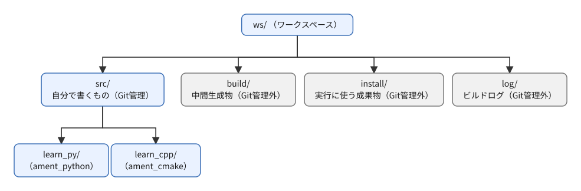
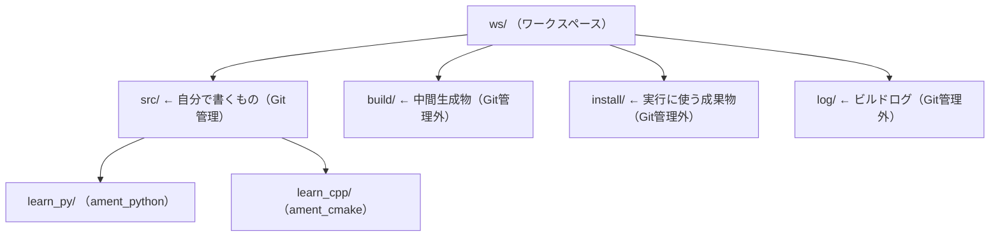
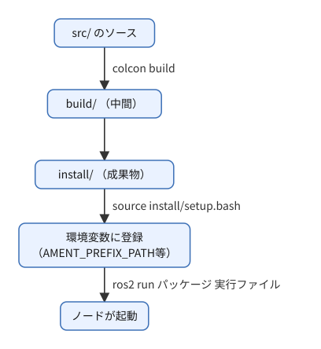
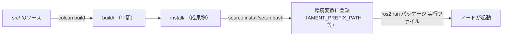

# フェーズ2 手順書: ワークスペースとパッケージ作成・ビルド

`docs/learning_plan.md` フェーズ2（idea_origin.md ステップ1の1-0）に対応する。`ament_python` と `ament_cmake` の空パッケージを1つずつ作り、ビルドと実行の流れの違いを確認する。

- 想定環境: WSL2 + Ubuntu 24.04 + ROS2 Jazzy（`colcon`、`gcc`、`cmake` は導入済み）
- 所要目安: 1コマ
- 言語: **Python（`ament_python`）とC++（`ament_cmake`）の両方**
- 前提: フェーズ1（`docs/phase1_cli_turtlesim.md`）で `ros2 run <パッケージ> <実行ファイル>` の書式に触れていること

> **この手順書の位置づけ**: コマンドはROS2 Jazzyの実機の雛形（`ros2 pkg create` のテンプレート）を読んで確認しているが、公式チュートリアルの本文とは照合できていない（docs.ros.orgがボット対策で取得不可）。出力が違えば実機を優先し、差分を貼ってほしい。文章・構成は自分の言葉で書いた。公式ドキュメント（CC BY 4.0）の出典は末尾に記載する。

## 0. 学習目標と完了条件

1. ワークスペース（`ws/`）を作り、`ament_python` と `ament_cmake` のパッケージを1つずつ作れる。
2. `colcon build` → `source install/setup.bash` → `ros2 run` の流れを説明できる。
3. 2種類のパッケージで「必要なファイル」と「実行ファイルが登録される仕組み」の違いを説明できる。
4. `--symlink-install` の有無で、Pythonの修正が再ビルドなしで反映されるかどうかが変わることを体験する。

## 1. 全体像

### 1-1. ワークスペースの構成



<details>
<summary>同じ図（mermaid版）</summary>



</details>

`build/`・`install/`・`log/` は `.gitignore` に登録済み（リポジトリ直下の `.gitignore`）。`src/` だけがGit管理の対象になる。

### 1-2. ビルドと実行の流れ



<details>
<summary>同じ図（mermaid版）</summary>



</details>

`source install/setup.bash` を忘れると、`ros2 run` が「パッケージが見つからない」と言う。ビルドし直した後だけでなく、**新しいターミナルを開くたびに必要**（`~/.bashrc` には `/opt/ros/jazzy` のsourceだけが入っているため）。

### 1-3. 2種類のパッケージの違い

| 観点 | `ament_python` | `ament_cmake`（C++） |
|---|---|---|
| ビルド設定 | `setup.py` と `setup.cfg` | `CMakeLists.txt` |
| 依存の宣言 | `package.xml` の `<depend>` （加えて `setup.py` の `install_requires`） | `package.xml` の `<depend>` と `CMakeLists.txt` の `find_package` |
| ソースの置き場所 | `パッケージ名/`（Pythonモジュール） | `src/`、`include/` |
| 実行ファイルの登録 | `setup.py` の `entry_points` の `console_scripts` | `CMakeLists.txt` の `add_executable` と `install(TARGETS ...)` |
| コンパイル | なし（ソースをそのまま配置） | あり（`g++` 経由で機械語にする） |
| 修正後の再ビルド | `--symlink-install` なら**不要** | **必須** |

## 2. 手順

以降、コマンドは `~/work/ros2MinimalPhysicalAi`（本リポジトリのclone先）を起点に書く。場所が違う場合は読み替える。

### 2-1. ワークスペースを作る

```bash
cd ~/work/ros2MinimalPhysicalAi
mkdir -p ws/src
cd ws/src
```

`ws/src` に置いたものがパッケージとして扱われる。

### 2-2. Pythonパッケージを作る

```bash
ros2 pkg create --build-type ament_python \
  --license Apache-2.0 \
  --maintainer-name learner --maintainer-email noreply@example.com \
  --dependencies rclpy std_msgs \
  --node-name hello \
  learn_py
```

- `--dependencies`: `package.xml` に `<depend>` として書かれる（後の手順で `std_msgs` を使うため今のうちに入れる）。
- `--node-name hello`: 動作確認用の最小ノード `hello` の雛形が作られる。
- **メンテナ名・メールは必ず明示する**。省略すると、コマンドがGitの設定などから自動で補う場合があり、実メールアドレスがファイルに入る恐れがある。本リポジトリはPublic化を前提にしているため、`learner` / `noreply@example.com` のようなダミーを使う。

作られたものを確認する:

```bash
find learn_py -type f | sort
cat learn_py/package.xml
cat learn_py/setup.py
```

### 2-3. C++パッケージを作る

```bash
ros2 pkg create --build-type ament_cmake \
  --license Apache-2.0 \
  --maintainer-name learner --maintainer-email noreply@example.com \
  --dependencies rclcpp std_msgs \
  --node-name hello \
  learn_cpp

find learn_cpp -type f | sort
cat learn_cpp/package.xml
cat learn_cpp/CMakeLists.txt
```

> 課題1: 2つのパッケージの `package.xml` を見比べる。`<buildtool_depend>` の違い（`ament_python` / `ament_cmake`）と、`<export><build_type>` の違いを確認する。

### 2-4. ビルドする

```bash
cd ~/work/ros2MinimalPhysicalAi/ws
colcon build --symlink-install
```

- **必ずワークスペースの直下（`ws/`）で実行する**。`src/` の中で実行すると `build/` などが意図しない場所にできる。
- 初回は数十秒かかる。WSLのメモリ（実測は `setup_wsl2_ros2.md` 参照）が小さいため、並列数を絞りたい場合は `colcon build --symlink-install --parallel-workers 2` とする。
- 成功すると `Summary: 2 packages finished` のように表示される。
- Pythonパッケージのビルド中に `SetuptoolsDeprecationWarning`（非推奨の警告）が出ることがある。ビルドが成功していれば、この段階では無視してよい。

確認:

```bash
ls
# build  install  log  src
```

### 2-5. 環境に登録して実行する

```bash
source install/setup.bash
ros2 run learn_py hello
ros2 run learn_cpp hello
```

期待される表示（雛形の内容。文言が違っていても、実行できていればよい）:

```
Hi from learn_py.
hello world learn_cpp package
```

`source` の効果を確認する:

```bash
ros2 pkg list | grep learn
ros2 pkg prefix learn_py
ros2 pkg executables learn_py
ros2 pkg executables learn_cpp
```

> 課題2: 新しいターミナルを開き、`source` しないまま `ros2 run learn_py hello` を試す。エラーになることを確認してから、`source install/setup.bash` をして再実行する。

### 2-6. `install/` の中身を見る

実行ファイルがどこにできているか見て、2種類の違いを実感する。

```bash
ls -l install/learn_py/lib/learn_py/
ls -l install/learn_cpp/lib/learn_cpp/
cat install/learn_py/lib/learn_py/hello | head -20
file install/learn_cpp/lib/learn_cpp/hello
```

- Python版の `hello` は、Pythonの `main` を呼び出すだけの**短いスクリプト**（`setup.py` の `entry_points` から生成される）。
- C++版の `hello` は**コンパイル済みのバイナリ**（`file` コマンドが `ELF ... executable` と表示する）。

> 課題3: `--symlink-install` を付けた場合、`install/learn_py/lib/python3.12/site-packages/learn_py` がシンボリックリンクになっていることを `ls -l` で確認する。

### 2-7. 修正の反映を体験する（`--symlink-install` の効果）

**Python（再ビルド不要）**: `learn_py/learn_py/hello.py` の `print` の文言を書き換え、**ビルドせずに**実行する。

```bash
# 書き換え後
ros2 run learn_py hello     # 文言が変わっている
```

**C++（再ビルド必須）**: `learn_cpp/src/hello.cpp` の文言を書き換え、ビルドせずに実行する。

```bash
ros2 run learn_cpp hello    # まだ古い文言
cd ~/work/ros2MinimalPhysicalAi/ws
colcon build --symlink-install --packages-select learn_cpp
ros2 run learn_cpp hello    # 新しい文言になる
```

- `--packages-select <名前>`: 指定したパッケージだけをビルドする。C++は時間がかかるので、普段はこれを使うと速い。
- 新しい実行ファイルを追加する場合（`setup.py` の `entry_points` や `CMakeLists.txt` の変更）は、`--symlink-install` でも**再ビルドが必要**。

> 課題4: `--symlink-install` を付けずに `colcon build` して、Pythonのソースを書き換えても反映されないことを確認する。確認後は `rm -rf build install log` で消して、`--symlink-install` 付きでビルドし直す（`ws/` の中だけを消すこと）。

### 2-8. Git管理の確認

```bash
cd ~/work/ros2MinimalPhysicalAi
git status --short
```

`ws/src/` だけが未追跡として出て、`ws/build`・`ws/install`・`ws/log` は出ないこと（フェーズ3-3〜4の途中では、一時的に `ws/config/` も出る。フェーズ4で移すのでコミットしない）。あわせて、Public化前提のため、次を確認する:

```bash
grep -n 'maintainer' ws/src/learn_py/package.xml ws/src/learn_cpp/package.xml
grep -n 'maintainer' ws/src/learn_py/setup.py
```

実メールアドレスが入っていないこと（`noreply@example.com` であること）。コミットするかどうかはClaudeに依頼する（コミットは規約に従いClaudeが行う）。

## 3. 記録用の表（完了条件の確認）

| 観点 | Python（ament_python） | C++（ament_cmake） |
|---|---|---|
| 作成コマンドの差 | | |
| 実行ファイルの登録場所 | | |
| `install/` 内の実行ファイルの正体 | | |
| ソース修正後に必要な操作 | | |
| つまずいた点 | | |

## 4. つまずきやすい点

| 症状 | 確認すること |
|---|---|
| `Package 'learn_py' not found` | `source install/setup.bash` をしたか。別ターミナルで `ws/` の `install` を読んだか |
| `colcon: command not found` | `sudo apt install python3-colcon-common-extensions`（導入はユーザーが行う）。`colcon --help` で確認 |
| ビルド中に応答が遅い・止まる | メモリ不足の可能性。`--parallel-workers 1` か `2` に絞る |
| `No executable found`（`ros2 run`） | `entry_points` / `install(TARGETS ...)` の記述、ビルド後の `source` |
| Pythonの修正が反映されない | `--symlink-install` を付けてビルドしたか。実行ファイルを**追加**した場合は再ビルドが必要 |
| 警告が大量に出る | 失敗（`Failed`）かどうかだけ確認する。`Summary` の行が判断基準 |

## 5. 次のフェーズへ

フェーズ3（ノードの基本）では、この2つのパッケージ（`learn_py`、`learn_cpp`）に、Publisher/Subscriber・パラメータ・サービス・アクションのノードを**同じ仕様で**追加していく。

## 6. 公式ドキュメント・参考資料

確認状況（2026-09-20）: 下記は `docs/idea_origin.md` に掲載済みのURLで、今回は再確認していない（docs.ros.orgは本文取得がボット対策で拒否される）。コマンドとテンプレートの内容は、WSLに導入済みのROS2 Jazzy（`/opt/ros/jazzy`）の雛形を直接読んで確認した。

### 公式

- [Beginner: Client libraries — Jazzy](https://docs.ros.org/en/jazzy/Tutorials/Beginner-Client-Libraries.html)（ワークスペース作成・パッケージ作成・colconの各チュートリアルはここから辿る）
- [colcon documentation](https://colcon.readthedocs.io/)
- [ament_cmake user documentation — Jazzy](https://docs.ros.org/en/jazzy/How-To-Guides/Ament-CMake-Documentation.html)
- [ament_cmake_python user documentation — Jazzy](https://docs.ros.org/en/jazzy/How-To-Guides/Ament-CMake-Python-Documentation.html)（純Pythonのパッケージは `ament_python` を使う旨の記載あり）

### 日本語

- [ROS 2のワークスペース：colconとパッケージ](https://gbiggs.github.io/rosjp_ros2_intro/workspaces_and_colcon.html)（colcon解説）

> 記事は個人による非公式の解説で、版によって異なる場合がある。公式ドキュメントと食い違う場合は公式を優先する。
