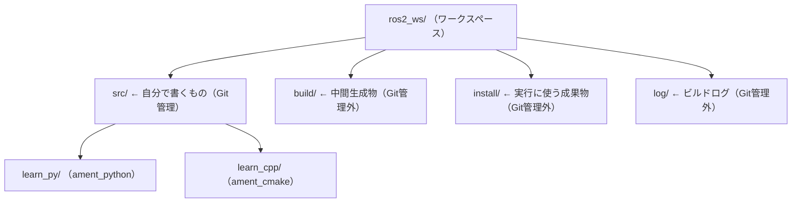
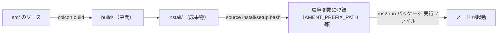

# フェーズ2 手順書: ワークスペースとパッケージ作成・ビルド

[`docs/learning_plan.md`](learning_plan.md) フェーズ2（idea_origin.md ステップ1の1-0）に対応する。`ament_python` と `ament_cmake` の空パッケージを1つずつ作り、ビルドと実行の流れの違いを確認する。

- 想定環境: WSL2 + Ubuntu 24.04 + ROS2 Jazzy（`colcon`、`gcc`/`g++`、`cmake` は、環境構築の `ros-dev-tools` の導入で入っている。1-3節の補足を参照）
- 所要目安: 1コマ
- 言語: **Python（`ament_python`）とC++（`ament_cmake`）の両方**
- 前提: フェーズ1（[`docs/phase1_cli_turtlesim.md`](phase1_cli_turtlesim.md)）で `ros2 run <パッケージ> <実行ファイル>` の書式に触れていること

> **この手順書の位置づけ**: コマンドはROS2 Jazzyの実機の雛形（`ros2 pkg create` のテンプレート）を読んで確認しているが、公式チュートリアルの本文とは照合できていない（docs.ros.orgがボット対策で取得不可）。出力が違う場合は、実機の表示を優先する。文章・構成は自分の言葉で書いた。公式ドキュメント（CC BY 4.0）の出典は末尾に記載する。

> **実行環境が無くても読めるように**: コマンドの直後に「期待する結果」として、表示される内容の例とその読み方を載せている。`ros2 pkg create` から `colcon build`、`install/` の中身までは、手順書の作成時に使い捨ての環境で実行して確かめた表示を元にしている（日時・秒数・パスは環境によって変わる）。

## 0. 学習目標と完了条件

1. ワークスペース（`ros2_ws/`）を作り、`ament_python` と `ament_cmake` のパッケージを1つずつ作れる。
2. `colcon build` → `source install/setup.bash` → `ros2 run` の流れを説明できる。
3. 2種類のパッケージで「必要なファイル」と「実行ファイルが登録される仕組み」の違いを説明できる。
4. `--symlink-install` の有無で、Pythonの修正が再ビルドなしで反映されるかどうかが変わることを体験する。

## 1. 全体像

### 1-1. ワークスペースの構成


<details>
<summary>同じ図（mermaid版）</summary>



</details>

一般に、ROS2のワークスペースでGitの管理対象にするのは `src/` だけで、`build/`・`install/`・`log/` の生成物は含めない（この教材のリポジトリでも、直下の `.gitignore` に登録してある）。なお、練習用のワークスペース `ros2_ws/` は、教材のリポジトリとは別の場所（ホームディレクトリの下の `~/ros2_ws`。2-1節）に作るので、教材のリポジトリをcloneした場合も、練習コードが混ざることはない。練習コードもGitで管理したい場合の方法は、2-8節（練習コードをGitで管理する）で扱う。

### 1-2. ビルドと実行の流れ


<details>
<summary>同じ図（mermaid版）</summary>



</details>

`source install/setup.bash` を忘れると、`ros2 run` が「パッケージが見つからない」と言う。ビルドし直した後だけでなく、**新しいターミナルを開くたびに必要**（`~/.bashrc` には `/opt/ros/jazzy` のsourceだけが入っているため）。

### 1-3. 2種類のパッケージの違い

この節の表は、2節で作る2種類のパッケージの違いを先に並べたものである。表に出てくるファイルや設定は、2-2節〜2-7節で実物を見ながら確かめるので、ここでは名前を眺める程度でよい。表の前に、表に出てくる用語を短く説明しておく。

- `setup.py`・`setup.cfg`: Pythonのパッケージのビルドとインストールの設定（`setup.cfg` は、インストール先などの細かな設定を分けて書いたもの）。`install_requires` は、`setup.py` に書く「動かすのに要るPythonのパッケージ」の一覧。
- `package.xml`: パッケージの名前・メンテナ・依存（`<depend>`）などを書く、ROS2のパッケージの設定ファイル（2-2節）。
- `entry_points` の `console_scripts`（Python）と `add_executable`・`install(TARGETS ...)`（C++）: `ros2 run` で起動できる実行ファイルとして登録する書き方（1-4節、2-6節）。`find_package` は、C++で使う外部のパッケージを探して使えるようにする命令。
- `--symlink-install`: `colcon build` に付けるオプション。ソースを `install/` へ写す代わりに、リンク（参照）でつなぐ。Pythonなら、ソースを書き換えるだけで、ビルドし直さずに反映される（2-6節の課題3、2-7節）。

| 観点 | `ament_python` | `ament_cmake`（C++） |
|---|---|---|
| ビルド設定 | `setup.py` と `setup.cfg` | `CMakeLists.txt` |
| 依存の宣言 | `package.xml` の `<depend>` （加えて `setup.py` の `install_requires`） | `package.xml` の `<depend>` と `CMakeLists.txt` の `find_package` |
| ソースの置き場所 | `パッケージ名/`（Pythonモジュール） | `src/`、`include/` |
| 実行ファイルの登録 | `setup.py` の `entry_points` の `console_scripts` | `CMakeLists.txt` の `add_executable` と `install(TARGETS ...)` |
| コンパイル | なし（ソースをそのまま配置） | あり（`g++` 経由で機械語にする） |
| 修正後の再ビルド | `--symlink-install` なら**不要** | **必須** |

#### 補足: C++のコンパイラはどこから来て、いつ使われるか

C++のコンパイラを自分で入れた覚えが無くても、`colcon build` でC++のパッケージがビルドできるのは、環境構築（[`docs/setup_wsl2_ros2.md`](setup_wsl2_ros2.md) の手順4の3番目）で入れた `ros-dev-tools` が、依存としてコンパイラ一式を連れてきているからである。依存は次のようにたどれる（`apt-cache depends <パッケージ名>` で1段ずつ確認できる）。

```text
ros-dev-tools
└── ros-build-essential
    ├── build-essential   … Ubuntu標準の「C/C++の開発に最低限必要なもの」一式
    │   ├── gcc           … Cのコンパイラ
    │   ├── g++           … C++のコンパイラ（GNU Compiler Collection）
    │   ├── make          … ビルド手順の実行役
    │   └── libc6-dev     … 標準Cライブラリのヘッダ等
    └── cmake             … ビルド設定（CMakeLists.txt）を解釈する道具
```

Ubuntu 24.04では、`g++` の実体は `g++-13`（GCC 13系）になる。`g++ --version` を実行すると `g++ (Ubuntu 13.3.0-...) 13.3.0` のように表示される（末尾の細かな版数は更新によって変わる）。

`colcon build` の中では、コンパイラは次の順に呼び出される。

1. `colcon` が、パッケージの種類（`ament_cmake`）を見て `cmake` を呼ぶ。
2. `cmake` が `CMakeLists.txt` を読み、ビルド手順（Makefile）を `build/learn_cpp/` の中に作る。このとき、使うコンパイラとして `/usr/bin/c++` を選ぶ。`/usr/bin/c++` は「システムの既定のC++コンパイラ」を指す別名で、Ubuntuの標準では `g++` につながっている。
3. `make` がMakefileに従って `g++` を呼び、`.cpp` を実行ファイルにする。

どのコンパイラが選ばれたかは、一度ビルドした後に `grep CMAKE_CXX_COMPILER: build/learn_cpp/CMakeCache.txt` で確かめられる（`CMAKE_CXX_COMPILER:FILEPATH=/usr/bin/c++` と表示される）。

コンパイラを使うのは**ビルドのときだけ**で、`ros2 run` や `ros2 launch` でノードを動かすときには使わない。実行されるのは、ビルドででき上がった実行ファイル（2-6節の `ELF ... executable`）である。Pythonのパッケージは、そもそもコンパイルをしないので、コンパイラとは関わらない。

この学習ではコンパイラを意識して選ぶ場面は無く、既定の `g++` のままでよい。別のコンパイラ（例: Clang）に切り替える方法もあるが、扱わない。

### 1-4. 用語の整理: 実行ファイル・ノード・launchファイル

この手順書で言う「実行ファイル」は、`ros2 run <パッケージ> <実行ファイル>` の第2引数に書ける名前のこと。`setup.py` の `entry_points`（Python）や `CMakeLists.txt` の `add_executable`（C++）で**ビルド時に登録**され、`ros2 pkg executables` で一覧できる、パッケージング上の単位。実体はPythonの短いラッパースクリプトか、コンパイル済みのELFバイナリで、1個 = `ros2 run` すると1個のプロセスが立ち上がる。

これは「ノード」「launchファイル」とは別の軸の概念で、次のように整理できる。

| 概念 | 何の単位か | どこで見える・使うか |
|---|---|---|
| 実行ファイル | ビルド・パッケージングの単位（プロセスとして起動できるもの） | `ros2 pkg executables`、`ros2 run <pkg> <実行ファイル>` |
| ノード | 実行時（ランタイム）の単位。コードの上では、ROS2のライブラリ（Pythonは `rclpy`、C++は `rclcpp`）が用意する `Node` クラスのインスタンス（フェーズ3-1で書く） | `ros2 node list`、トピック/サービス/パラメータの持ち主 |
| launchファイル | 複数の実行ファイル（＝複数のノード）をまとめて起動する設定の単位 | `ros2 launch <pkg> <ファイル>`（フェーズ4で扱う） |

この手順書で作る雛形の `hello` は、文字を表示するだけで、まだノードを作らない。フェーズ3-1（[`docs/phase3_1_pubsub.md`](phase3_1_pubsub.md)）以降のサンプルのように「1つの実行ファイルの `main()` が1つのノードを作ってspinする」（spinは、届いたメッセージやタイマーに応じてコールバックを呼びながら、ノードを動かし続ける処理。フェーズ3-1の1節）のが、最小構成では最も単純で典型的な形だが、**実行ファイルとノードは厳密には1対1ではない**。1つの実行ファイル（1プロセス）が複数のノードを作って同時にspinすることもできるし、逆にノード単体を `ros2 run` で直接起動する方法はない（必ず「それを起動する実行ファイル」を経由する）。launchファイルはさらに1段上の層で、`ros2 pkg executables` には出てこず、`ros2 run` の対象にもならない（`ros2 launch` 専用のファイル）。フェーズ4（[`docs/phase4_launch.md`](phase4_launch.md)）で、launchファイルが複数の実行ファイル＝ノードをまとめて起動する様子を実際に書いて確認する。

## 2. 手順

練習用のワークスペースは、ホームディレクトリの下に `~/ros2_ws` として作る（環境構築の6節）。名前は、ROS2の公式チュートリアルが使っている `ros2_ws` に合わせた（名前そのものに決まりは無く、`colcon build` を実行したフォルダがワークスペースになる）。以降の手順書で `ros2_ws/` と書いたときは、このフォルダを指す。別の場所に作る場合は読み替える。

### 2-1. ワークスペースを作る

```bash
mkdir -p ~/ros2_ws/src

cd ~/ros2_ws/src
```

**期待する結果**: これらのコマンドは成功すると何も表示しない（プロンプトが戻るだけ）。`pwd` を実行すると `/home/<ユーザー名>/ros2_ws/src` と表示される。

`ros2_ws/src` に置いたものがパッケージとして扱われる。

### 2-2. Pythonパッケージを作る

```bash
ros2 pkg create --build-type ament_python \
  --license Apache-2.0 \
  --maintainer-name learner --maintainer-email noreply@example.com \
  --dependencies rclpy std_msgs \
  --node-name hello \
  learn_py
```

**期待する結果**（抜粋）: 設定内容の確認に続いて、作ったファイルが1行ずつ表示される。

```text
going to create a new package
package name: learn_py
destination directory: /home/<ユーザー名>/ros2_ws/src
package format: 3
version: 0.0.0
description: TODO: Package description
maintainer: ['learner <noreply@example.com>']
licenses: ['Apache-2.0']
build type: ament_python
dependencies: ['rclpy', 'std_msgs']
node_name: hello
creating folder ./learn_py
creating ./learn_py/package.xml
...
creating ./learn_py/learn_py/hello.py
```

`maintainer` の行がダミーの値になっていること、`dependencies` の行に `rclpy` と `std_msgs` が入っていることを、ここで確認できる。

- `--dependencies`: `package.xml` に `<depend>` として書かれる（後の手順で `std_msgs` を使うため今のうちに入れる）。
- `--node-name hello`: 動作確認用の最小の実行ファイル `hello` の雛形が作られる（文字を表示するだけで、ROS2の機能はまだ使わない）。
- **メンテナ名・メールは必ず明示する**。省略すると、コマンドがGitの設定などから自動で補う場合があり、実メールアドレスがファイルに入る恐れがある。本リポジトリはPublic化を前提にしているため、`learner` / `noreply@example.com` のようなダミーを使う。

作られたものを確認する:

```bash
find learn_py -type f | sort

cat learn_py/package.xml

cat learn_py/setup.py
```

**期待する結果**（`find` の分）:

```text
learn_py/LICENSE
learn_py/learn_py/__init__.py
learn_py/learn_py/hello.py
learn_py/package.xml
learn_py/resource/learn_py
learn_py/setup.cfg
learn_py/setup.py
learn_py/test/test_copyright.py
learn_py/test/test_flake8.py
learn_py/test/test_pep257.py
```

- `learn_py/learn_py/` のように同じ名前が2段重なるのは、外側がパッケージのフォルダ、内側がPythonのモジュール（`import learn_py` で読み込まれる側）だから。ノードのコードは内側に置く。
- `hello.py` の中身は、`print('Hi from learn_py.')` を実行するだけの `main` 関数。
- `test/` の3ファイルは、著作権表示・コードの書式・docstringの書式を検査する雛形のテスト。

`package.xml` に `<depend>rclpy</depend>` と `<depend>std_msgs</depend>` の2行があれば、`--dependencies` が効いている。`<test_depend>` の行しか無い場合は指定が抜けているので、この2行を `<license>` の行の後ろに手で足す（フェーズ3-1の3-2でも触れる）。

### 2-3. C++パッケージを作る

```bash
ros2 pkg create --build-type ament_cmake \
  --license Apache-2.0 \
  --maintainer-name learner --maintainer-email noreply@example.com \
  --dependencies rclcpp std_msgs \
  --node-name hello \
  learn_cpp

find learn_cpp -type f | sort

cat learn_cpp/package.xml

cat learn_cpp/CMakeLists.txt
```

**期待する結果**（`find` の分）: C++版はファイルが4つだけで、Python版より少ない。

```text
learn_cpp/CMakeLists.txt
learn_cpp/LICENSE
learn_cpp/package.xml
learn_cpp/src/hello.cpp
```

- `src/hello.cpp` の中身は、`printf("hello world learn_cpp package\n");` を実行するだけの `main` 関数（ROS2の機能はまだ使っていない）。
- `package.xml` には `<buildtool_depend>ament_cmake</buildtool_depend>` と、`<depend>rclcpp</depend>`・`<depend>std_msgs</depend>` が入る。
- `CMakeLists.txt` には、`find_package(rclcpp REQUIRED)` などの依存の読み込みと、`add_executable(hello src/hello.cpp)`・`install(TARGETS hello ...)` という実行ファイルの登録が入る。

> 補足: `--node-name` は生成する実行ファイルの**名前**を指定するだけのオプション（`ros2 pkg create --help` でも `name of the empty executable` としか説明されておらず、選べる「種類」の列挙はない）。ノードの言語・雛形の中身を決めているのは `--build-type` の方（`ament_python` → Pythonの雛形、`ament_cmake`/`cmake` → C++の雛形、`ament_cargo` → Rust）。2-2と2-3で同じ `--node-name hello` を指定しているのは、両方とも「動作確認用の最小の実行ファイル」という同じ役割を、`--build-type` 違いのテンプレートで作っているため。

> 課題1: 2つのパッケージの `package.xml` を見比べる。`<buildtool_depend>` の違い（`ament_python` / `ament_cmake`）と、`<export><build_type>` の違いを確認する。

### 2-4. ビルドする

```bash
cd ~/ros2_ws

colcon build --symlink-install
```

- **必ずワークスペースの直下（`ros2_ws/`）で実行する**。`src/` の中で実行すると `build/` などが意図しない場所にできる。
- 初回のビルド時間は環境による（この手順書の検証環境では約10秒だった）。応答が遅い・止まる場合のみ、メモリ不足を疑って `colcon build --symlink-install --parallel-workers 2` のように並列数を絞る（検証環境ではこの絞り込みは不要だった。WSLのメモリは [`setup_wsl2_ros2.md`](setup_wsl2_ros2.md) の1節を参照）。
- Pythonパッケージのビルド中に `SetuptoolsDeprecationWarning`（非推奨の警告）が出ることがある。ビルドが成功していれば、この段階では無視してよい（警告の意味と、無視してよい理由は [`docs/tips.md`](tips.md) の3節）。

**期待する結果**（秒数は環境によって変わる）: `Summary: 2 packages finished` の行が出れば成功。

```text
Starting >>> learn_cpp
Starting >>> learn_py
Finished <<< learn_py [6.36s]
Finished <<< learn_cpp [10.6s]

Summary: 2 packages finished [11.1s]
```

2つのパッケージは並行してビルドされるので、`Starting` が2行続けて出る。先に終わった方から `Finished` が出る（C++はコンパイルがある分、遅れて終わることが多い）。

ビルドの後、ワークスペースの中身を確かめる。

```bash
ls
```

**期待する結果**: 元からある `src/` に、ビルドで作られた `build/`・`install/`・`log/` の3つが加わる。

```text
build  install  log  src
```

### 2-5. 環境に登録して実行する

```bash
source install/setup.bash

ros2 run learn_py hello

ros2 run learn_cpp hello
```

**期待する結果**（雛形の内容。文言が違っていても、実行できていればよい）:

```text
Hi from learn_py.
hello world learn_cpp package
```

> 2026-09-22時点で実機で確認済み: `learn_py`・`learn_cpp`とも期待どおりの表示だった。

`source` の効果を確認する:

```bash
ros2 pkg list | grep learn

ros2 pkg prefix learn_py

ros2 pkg executables learn_py

ros2 pkg executables learn_cpp
```

**期待する結果**:

```text
$ ros2 pkg list | grep learn
learn_cpp
learn_py

$ ros2 pkg prefix learn_py
/home/<ユーザー名>/ros2_ws/install/learn_py

$ ros2 pkg executables learn_py
learn_py hello

$ ros2 pkg executables learn_cpp
learn_cpp hello
```

`ros2 pkg executables` は「パッケージ名 実行ファイル名」の組で並べる。これがそのまま `ros2 run` の2つの引数になる。`source` をしていないターミナルでは、`ros2 pkg list | grep learn` は何も表示しない（ROS2本体のパッケージしか見えない）。

> 課題2: 新しいターミナルを開き、`source` しないまま `ros2 run learn_py hello` を試す。`Package 'learn_py' not found` というエラーになることを確認してから、`source install/setup.bash` をして再実行する。

#### `ros2 pkg` サブコマンドの補足

ここまでで使った4つのサブコマンド（`ros2 pkg <sub> --help` で確認済み、Jazzy時点）の役割とオプション:

| サブコマンド | 役割 | 主なオプション |
|---|---|---|
| `create <package_name>` | 新規パッケージの雛形を作る（2-2/2-3で使用） | `--build-type {cmake,ament_cmake,ament_cargo,ament_python}`（言語・ビルド系）、`--node-name`（雛形ノードの実行ファイル名。上記の補足参照）、`--library-name`（雛形ライブラリ名、C++のみ）、`--dependencies`（`package.xml`の`<depend>`）、`--license`、`--maintainer-name`/`--maintainer-email`、`--destination-directory`（作成先ディレクトリ）、`--package-format {2,3}`（`package.xml`のスキーマ版） |
| `list` | `source`済みの環境から見えているパッケージ名を一覧表示する | オプションなし（`-h`のみ）。今回のように `grep` で絞り込む使い方が一般的 |
| `prefix <package_name>` | そのパッケージのインストール先prefix（`install/<pkg>` 等）を表示する | `--share`: launchファイルやconfig等の共有リソースが入る `share/<pkg>` を表示する |
| `executables [package_name]` | そのパッケージが提供する実行ファイル名（`ros2 run` の第2引数に使える名前）を一覧表示する | `package_name`省略で全パッケージ分。`--full-path`: インストール先の絶対パスも表示する |

`list`・`prefix`・`executables`はいずれも読み取り専用（副作用なし）で、`ros2 run` する前の確認・デバッグに使う。

### 2-6. `install/` の中身を見る

実行ファイルがどこにできているか見て、2種類の違いを実感する。

```bash
ls -l install/learn_py/lib/learn_py/

ls -l install/learn_cpp/lib/learn_cpp/

cat install/learn_py/lib/learn_py/hello | head -20

file -L install/learn_cpp/lib/learn_cpp/hello
```

**期待する結果**（抜粋。日時・サイズ・パスの途中は環境によって変わる）:

```text
$ ls -l install/learn_py/lib/learn_py/
-rwxr-xr-x 1 <ユーザー名> <ユーザー名> 936 Sep 24 11:41 hello

$ ls -l install/learn_cpp/lib/learn_cpp/
lrwxrwxrwx 1 <ユーザー名> <ユーザー名> 38 Sep 24 11:41 hello -> /home/<ユーザー名>/ros2_ws/build/learn_cpp/hello

$ cat install/learn_py/lib/learn_py/hello | head -20
#!/usr/bin/python3
# EASY-INSTALL-ENTRY-SCRIPT: 'learn-py','console_scripts','hello'
import re
import sys
...

$ file -L install/learn_cpp/lib/learn_cpp/hello
install/learn_cpp/lib/learn_cpp/hello: ELF 64-bit LSB pie executable, x86-64, ...
```

- Python版の `hello` は、Pythonの `main` を呼び出すだけの**短いスクリプト**（`setup.py` の `entry_points` から生成される）。1行目の `#!/usr/bin/python3` は「このファイルをPythonで実行する」という指定。
- C++版の `hello` は**コンパイル済みのバイナリ**。`--symlink-install` を付けているので、`install/` にあるのは `build/learn_cpp/hello` へのシンボリックリンク（`ls -l` の行頭が `l`、末尾に `-> リンク先` が付く）になる。`file` にリンクの先を調べさせる `-L` を付けると、実体が `ELF ... executable`（Linuxの実行形式）だと分かる。`-L` を付けないと `symbolic link to ...` とだけ表示される。

> 課題3: `--symlink-install` を付けた場合に、Pythonのソースがどうつながっているかを `ls -l build/learn_py/` で確認する。`learn_py -> .../ros2_ws/src/learn_py/learn_py` というシンボリックリンクがあり、`build/` 側から `src/` のコードを直接指していることが分かる。`install/learn_py/lib/python3.12/site-packages/` には `learn-py.egg-link` という小さなファイルがあり、中身（`cat` で読める）は `build/learn_py` の場所を示している。つまり「`install/` → `build/` → `src/`」とたどって、編集中のソースがそのまま使われる。

### 2-7. 修正の反映を体験する（`--symlink-install` の効果）

ここで初めて、練習環境のファイルを書き換える。ファイルを開いて書き換える方法（`nano` を使う方法と、VS Codeを使う方法）は、[`docs/howto_place_code.md`](howto_place_code.md) にまとめている。既にあるファイルを開いて書き換える手順は、その4節（`nano setup.py` で開く、VS Codeのエクスプローラーから開く等）を、`hello.py` に読み替えればよい。

**Python（再ビルド不要）**: `learn_py/learn_py/hello.py` の `print` の文言を書き換え、**ビルドせずに**実行する。

```bash
# 書き換え後
ros2 run learn_py hello     # 文言が変わっている
```

**期待する結果**: 例えば `print('Hi from learn_py.')` を `print('Hello, edited!')` に書き換えた場合、ビルドをしていなくても次のように表示される。

```text
Hello, edited!
```

**C++（再ビルド必須）**: `learn_cpp/src/hello.cpp` の文言を書き換え、ビルドせずに実行する。

```bash
ros2 run learn_cpp hello    # ビルドする前に実行する

cd ~/ros2_ws

colcon build --symlink-install --packages-select learn_cpp

ros2 run learn_cpp hello    # ビルドした後に実行する
```

**期待する結果**: 1回目の `ros2 run` では、書き換える前の `hello world learn_cpp package` がそのまま出る（ソースを書き換えても、実行されるのはコンパイル済みの古いバイナリのため）。`colcon build` の後の2回目で、書き換えた文言に変わる。ビルドの表示は `Starting >>> learn_cpp`・`Finished <<< learn_cpp`・`Summary: 1 package finished` の3つになる。

- `--packages-select <名前>`: 指定したパッケージだけをビルドする。C++は時間がかかるので、普段はこれを使うと速い。
- 新しい実行ファイルを追加する場合（`setup.py` の `entry_points` や `CMakeLists.txt` の変更）は、`--symlink-install` でも**再ビルドが必要**。

> 補足: なぜC++の再ビルドにも `--symlink-install` を付けるか
>
> C++のコンパイル済み実行ファイルは `src/` に実体が無い（ソースからコンパイルして初めて生成される）ため、`--symlink-install` を付けても「再ビルド不要」にはならない（`install/learn_cpp/lib/learn_cpp/hello` は `src/` ではなく `build/learn_cpp/hello` へのシンボリックリンクになるだけで、`build/` 側の中身はどのみち再コンパイルが要る）。この1コマンド単体では、付けても付けなくても動作は変わらない。
>
> それでも付ける理由は、**ワークスペース全体のインストール方式を一貫させるため**。`--packages-select` で対象を絞っている間は他パッケージに影響しないが、`--packages-select` を付け忘れて`colcon build`（対象なし＝ワークスペース全体）を実行すると、既にシンボリックリンク化されていた `learn_py` 側が実体コピーに巻き戻り、「Pythonは編集がビルド無しで反映される」状態が静かに壊れる（実機での検証で確認済み）。毎回同じ形のコマンドを使い回すことで、この事故を防いでいる。なお、C++パッケージでも `package.xml` やCMake生成物（`install/learn_cpp/share/learn_cpp/` 配下の一部）はシンボリックリンクになるため、実行ファイル以外では`--symlink-install`に意味がある。

> 課題4: `--symlink-install` を付けずに `colcon build` して、Pythonのソースを書き換えても反映されないことを確認する。確認後は `rm -rf build install log` で消して、`--symlink-install` 付きでビルドし直す（`ros2_ws/` の中だけを消すこと）。

### 2-8. 練習コードをGitで管理する（任意）

> この節は任意。練習コードの変更履歴を残したい場合だけ行う。2-1節で作った `~/ros2_ws` は、作っただけではGitの管理下にないただのフォルダである。

練習コードをGitで管理するには、ワークスペース `ros2_ws/` をそのままGitのリポジトリにする。1-1節のとおり、管理するのは `src/` だけで、生成物の `build/`・`install/`・`log/` は `.gitignore` で除外する。

```bash
cd ~/ros2_ws

git init -b main

printf 'build/\ninstall/\nlog/\n' > .gitignore

git status --short
```

**期待する結果**（`git init` の行のパスは環境によって変わる）:

```text
$ git init -b main
Initialized empty Git repository in /home/<ユーザー名>/ros2_ws/.git/
$ git status --short
?? .gitignore
?? src/
```

- `git init -b main` は、`ros2_ws/` をGitのリポジトリにして、最初のブランチの名前を `main` にする（`-b main` を付けないと、ブランチ名についての長いヒントが表示される）。
- `printf` の行は、`build/`・`install/`・`log/` の3行を書いた `.gitignore` を作る。
- `git status --short` の `??` は「まだ管理していないファイル」の印。`src/` と `.gitignore` だけが出て、`build/`・`install/`・`log/` が出なければ、除外が効いている。`src/` の中身が1行にまとまっているのは、まだ1つもコミットしていないディレクトリを、Gitが中身を展開せずに表示するため（`git status --short -uall` にすると、`src/learn_py/package.xml` のようにファイルごとに出る）。フェーズ3-3〜4の途中では、一時的に `?? config/` も出る（フェーズ4で `learn_bringup/config/` へ移すので、コミットしなくてよい）。

> **教材のリポジトリをcloneした場合**: `~/ros2_ws` は教材のフォルダの外にあるので、影響しない。

練習コードをGitで管理し、いつか公開する可能性があるなら、コミットの前に、雛形に書いた連絡先を確かめる（`ros2_ws/` で実行する）。

```bash
grep -n 'maintainer' src/learn_py/package.xml src/learn_cpp/package.xml

grep -n 'maintainer' src/learn_py/setup.py
```

**期待する結果**（2-2節・2-3節のコマンドで作った場合）:

```text
$ grep -n 'maintainer' src/learn_py/package.xml src/learn_cpp/package.xml
src/learn_py/package.xml:7:  <maintainer email="noreply@example.com">learner</maintainer>
src/learn_cpp/package.xml:7:  <maintainer email="noreply@example.com">learner</maintainer>
$ grep -n 'maintainer' src/learn_py/setup.py
16:    maintainer='learner',
17:    maintainer_email='noreply@example.com',
```

メールアドレスが `noreply@example.com` で、実際のメールアドレスが入っていなければよい。確認できたら、`git add .gitignore src` と `git commit` でコミットする。初めてGitでコミットする環境では、先に `git config --global user.name` と `git config --global user.email` で名前とメールアドレスを設定する必要がある。公開する可能性があるなら、ここにも実際のメールアドレスではなく、GitHubが用意する公開用のアドレス（noreply）を使う。

## 3. Python版とC++版の違いのまとめ

本フェーズで確認したPython（`ament_python`）とC++（`ament_cmake`）の違いを整理する（1-3節の表・2-6節・2-7節の内容の総括）。

| 観点 | Python（`ament_python`） | C++（`ament_cmake`） |
|---|---|---|
| 作成コマンドの差 | `--build-type ament_python` | `--build-type ament_cmake` |
| 実行ファイルの登録場所 | `setup.py` の `entry_points` の `console_scripts` | `CMakeLists.txt` の `add_executable` と `install(TARGETS ...)` |
| `install/` 内の実行ファイルの正体 | Pythonスクリプト（ソースを呼び出す短いラッパー） | コンパイル済みELFバイナリ |
| ソース修正後に必要な操作 | `--symlink-install` なら不要（即反映） | 必須（`g++` での再コンパイルが要る。2-7節） |

コンパイルという工程が挟まる分、C++は「編集→即実行」のPythonに比べて反復（トライ＆エラー）のサイクルが長くなる。一方でコンパイル時に型やシグネチャの誤りを検出できる点はC++の利点（実行時まで気づかないPythonとの違い）。

## 4. つまずきやすい点

| 症状 | 確認すること |
|---|---|
| `Package 'learn_py' not found` | `source install/setup.bash` をしたか。別ターミナルで `ros2_ws/` の `install` を読んだか |
| `colcon: command not found` | `sudo apt install python3-colcon-common-extensions` で導入する。`colcon --help` で確認 |
| ビルド中に応答が遅い・止まる | メモリ不足の可能性。`--parallel-workers 1` か `2` に絞る |
| `No executable found`（`ros2 run`） | `entry_points` / `install(TARGETS ...)` の記述、ビルド後の `source` |
| Pythonの修正が反映されない | `--symlink-install` を付けてビルドしたか。実行ファイルを**追加**した場合は再ビルドが必要 |
| 警告が大量に出る | 失敗（`Failed`）かどうかだけ確認する。`Summary` の行が判断基準 |

## 5. 次のフェーズへ

フェーズ3（ノードの基本）では、この2つのパッケージ（`learn_py`、`learn_cpp`）に、Publisher/Subscriber・パラメータ・サービス・アクションのノードを**同じ仕様で**追加していく。最初はフェーズ3-1（[`docs/phase3_1_pubsub.md`](phase3_1_pubsub.md)）で、Publisher/Subscriberを書く。

## 6. 公式ドキュメント・参考資料

確認状況（2026-09-20）: 下記は [`docs/idea_origin.md`](idea_origin.md) に掲載済みのURLで、今回は再確認していない（docs.ros.orgは本文取得がボット対策で拒否される）。コマンドとテンプレートの内容は、WSLに導入済みのROS2 Jazzy（`/opt/ros/jazzy`）の雛形を直接読んで確認した。

### 公式

- [Beginner: Client libraries — Jazzy](https://docs.ros.org/en/jazzy/Tutorials/Beginner-Client-Libraries.html)（ワークスペース作成・パッケージ作成・colconの各チュートリアルはここから辿る）
- [colcon documentation](https://colcon.readthedocs.io/)
- [ament_cmake user documentation — Jazzy](https://docs.ros.org/en/jazzy/How-To-Guides/Ament-CMake-Documentation.html)
- [ament_cmake_python user documentation — Jazzy](https://docs.ros.org/en/jazzy/How-To-Guides/Ament-CMake-Python-Documentation.html)（純Pythonのパッケージは `ament_python` を使う旨の記載あり）

### 日本語

- [ROS 2のワークスペース：colconとパッケージ](https://gbiggs.github.io/rosjp_ros2_intro/workspaces_and_colcon.html)（colcon解説）

> 記事は個人による非公式の解説で、版によって異なる場合がある。公式ドキュメントと食い違う場合は公式を優先する。
