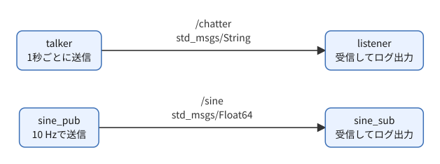
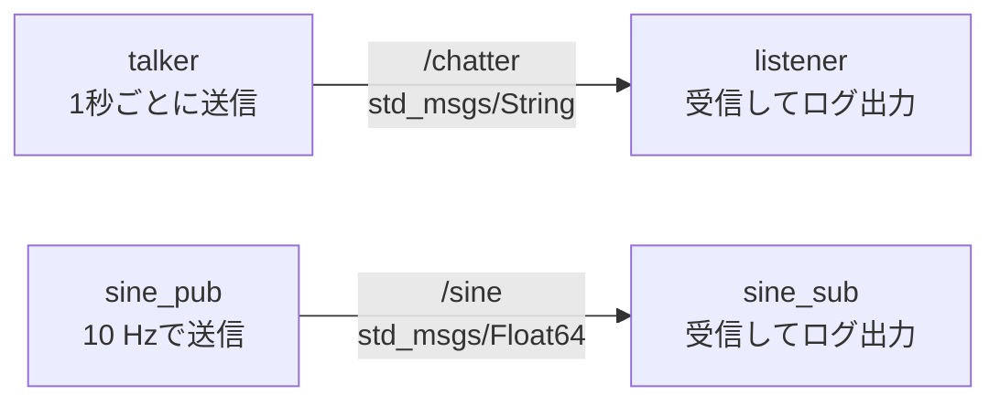
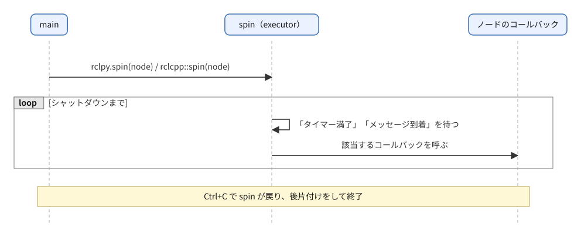
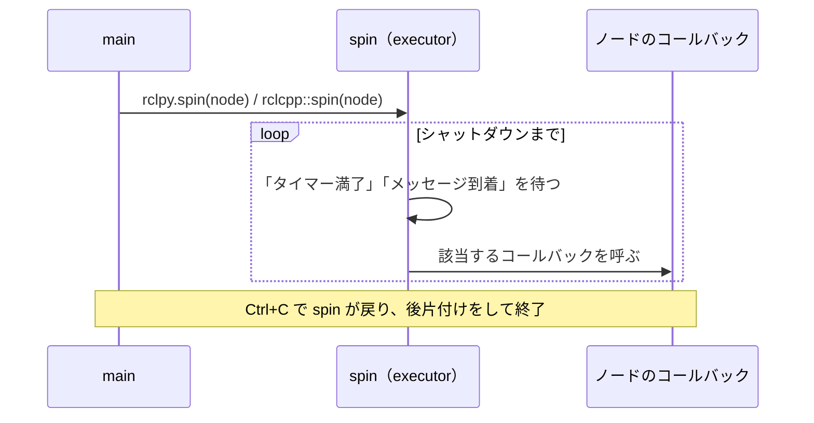

# フェーズ3-1 手順書: Publisher / Subscriber（トピック）をPython・C++で書く

`docs/learning_plan.md` フェーズ3（idea_origin.md ステップ1の1-2 ①②）に対応する。同じ仕様のノードをPythonとC++の両方で書き、動作と書き方の違いを比べる。

- 想定環境: WSL2 + Ubuntu 24.04 + ROS2 Jazzy
- 前提: フェーズ2完了（`ws/src/learn_py` と `ws/src/learn_cpp` があり、`colcon build --symlink-install` が通る）
- 所要目安: 1〜2コマ
- 言語: **Python・C++の両方**（Python → C++の順を推奨）

> **進め方**: 2節の仕様は「何を作るか」の定義で、`rclpy`/`rclcpp` のAPIの使い方までは書いていない（この時点ではAPIを知らないので、仕様だけを見て同等のコードを書くのは無理があって当然。それでよい）。まず3節・4節冒頭の「主なAPI」表でこのファイルに必要なAPIを把握し、続くサンプルコードと解説を読んで、1行ずつ何をしているか理解する。読んで分かったら、変数名やログの文言を変える・送る値や周期を変える・フィールドを増やすなど、実際に手を動かして改造してみると定着する（各節末の課題も参照）。サンプルは学習の手がかりとして最小限に書いたもので、公式チュートリアルの転載ではない。コードはこの手順書の作成時にビルド確認済みだが、ノードの実行結果は未確認（出力が違えば差分を貼ってほしい）。

> **実行環境が無くても読めるように**: 実行する手順の直後には「期待する結果」として、表示される内容の例とその読み方を載せている。これはコードとROS2の仕様から筆者が想定したもので、実機では時刻・秒数・細かな行が異なる。

## 0. 学習目標と完了条件

1. Publisher（`create_publisher`）とSubscriber（`create_subscription`）の基本形を、Python・C++の両方で書ける。
2. タイマーコールバックと、購読コールバックの動く仕組み（`spin` が呼び出す）を説明できる。
3. **Pythonの Publisher × C++ の Subscriber**（およびその逆）でも通信できることを確認する。
4. `ros2 topic list/echo/hz/info` と `rqt_graph` で、自作ノードの通信を観察できる。

## 1. 全体像



<details>
<summary>同じ図（mermaid版）</summary>



</details>

コールバックの動き（`spin` の役割）:



<details>
<summary>同じ図（mermaid版）</summary>



</details>

## 2. 仕様（Python版・C++版で同一）

| ノード | 役割 | トピック（型） | 動作 |
|---|---|---|---|
| `talker` | Publisher | `chatter`（`std_msgs/msg/String`） | 1秒ごとに `hello 0`, `hello 1`, ... を送り、送った内容をログに出す |
| `listener` | Subscriber | `chatter`（`std_msgs/msg/String`） | 受信した文字列をログに出す |
| `sine_pub` | Publisher | `sine`（`std_msgs/msg/Float64`） | 10 Hz（0.1秒周期）で、時刻 t に対して `sin(2π × 0.5 × t)` の値を送る（周期2秒の正弦波） |
| `sine_sub` | Subscriber | `sine`（`std_msgs/msg/Float64`） | 受信した値をログに出す |

- キューの深さ（QoSの `depth`）は10とする（QoSはフェーズ3-2で扱う）。
- 実行ファイル名は上表のノード名と同じにする（`ros2 run learn_py talker` のように起動できる）。

## 3. Python版（`ws/src/learn_py`）

### 3-1. 書くもの

`ws/src/learn_py/learn_py/` の下に4ファイルを作る: `talker.py`, `listener.py`, `sine_pub.py`, `sine_sub.py`。

主なAPI（rclpy）:

| やりたいこと | API |
|---|---|
| ノードの作成 | `class X(Node)` を継承し、`super().__init__('ノード名')` |
| Publisherの作成 | `self.create_publisher(メッセージ型, 'トピック名', 10)` |
| Subscriberの作成 | `self.create_subscription(メッセージ型, 'トピック名', コールバック, 10)` |
| タイマー | `self.create_timer(周期[秒], コールバック)` |
| ログ出力 | `self.get_logger().info('...')` |
| 送信 | `publisher.publish(メッセージ)` |
| 起動と終了 | `rclpy.init()` → `rclpy.spin(node)` → `rclpy.try_shutdown()` |

#### サンプルコードと解説（Python版）

**talker.py**

ファイル: `ws/src/learn_py/learn_py/talker.py`

<!-- file: ws/src/learn_py/learn_py/talker.py -->
```python
import rclpy
from rclpy.executors import ExternalShutdownException
from rclpy.node import Node
from std_msgs.msg import String


# 1秒ごとに "hello N" を chatter トピックへ送るノード。
class Talker(Node):
    # Publisher とタイマーを作る。
    def __init__(self):
        super().__init__('talker')
        self.pub = self.create_publisher(String, 'chatter', 10)
        self.count = 0
        self.timer = self.create_timer(1.0, self.on_timer)

    # タイマーから1秒ごとに呼ばれ、1通送ってログに出す。
    def on_timer(self):
        msg = String()
        msg.data = f'hello {self.count}'
        self.pub.publish(msg)
        self.get_logger().info(f'publish: {msg.data}')
        self.count += 1


# エントリポイント（setup.py の entry_points から呼ばれる）。
# ノードを作って spin で回し、Ctrl+C で後片付けして終わる。
def main(args=None):
    rclpy.init(args=args)
    node = Talker()
    try:
        rclpy.spin(node)
    except (KeyboardInterrupt, ExternalShutdownException):
        pass
    finally:
        node.destroy_node()
        rclpy.try_shutdown()
```

解説（talker.py）:

- **役割と流れ**: 1秒ごとにタイマーが `on_timer` を呼び、`hello 0`, `hello 1`, ... を `chatter` に送る。全体は「ノードを作る → `spin` でコールバックを待ち続ける → Ctrl+Cで後片付けして終わる」の3段構え。この骨組みは Python版の4ファイルすべてで共通なので、ここで覚えておく。
- **import**: `rclpy` はPythonのROS2クライアントライブラリ、`Node` はノードの基底クラス、`String` は `std_msgs/msg/String`（フィールド `data` を1つ持つだけのメッセージ）。`ExternalShutdownException` は「外部からシャットダウンされた」ときに `spin` が投げる例外で、後述の `except` で握りつぶすために使う。
- **`__init__` の中身**:
  - `super().__init__('talker')` でノード名を決める。これを呼ばないと以降の `create_*` が使えない。
  - `create_publisher(String, 'chatter', 10)` は「型・トピック名・QoSのdepth」の順。`10` は送信側のキュー（バッファ）の深さで、相手の受信が追いつかないときに最大10件まで溜めておく、という意味（詳しくはフェーズ3-2）。
  - `create_timer(1.0, self.on_timer)` の第1引数は周期で、単位は**秒**（実数）。第2引数は呼んでほしい関数。`self.on_timer` のように**括弧を付けず**関数そのものを渡す（`self.on_timer()` と書くと、その場で実行した結果を渡してしまう）。
  - `self.pub` / `self.timer` に代入して保持しているのは、後から使うため、また何を持つノードかがコードから読み取れるようにするため（Pythonではノードが内部でも保持するので、保持しなくても動くことが多い）。
- **`on_timer`**: メッセージ型のインスタンスを作り、`data` に文字列を入れて `publish` する。ログ出力の `get_logger().info(...)` は標準出力ではなくROS2のロギング経由で、時刻やノード名が付く。f文字列は `hello {self.count}` のように値を埋め込む書き方。
- **`main`**:
  - `rclpy.init(args=args)` でROS2の通信基盤を初期化する。ノードを作る前に必ず呼ぶ。
  - `rclpy.spin(node)` は、シャットダウンされるまで戻ってこない。中で「タイマー満了」「メッセージ到着」を待ち、該当するコールバックを呼び出している（1節の図）。`spin` を呼ばないと、コールバックが一度も呼ばれずプログラムが終わる。
  - `try / except / finally`: Ctrl+Cで `KeyboardInterrupt`（環境によっては `ExternalShutdownException`）が出る。これを受け止めて黙って抜け、`finally` で `destroy_node()` と `rclpy.try_shutdown()` を実行する。`try_shutdown` は「すでにシャットダウン済みなら何もしない」版なので、二重に呼んでもエラーにならない。
- **つまずきやすい点**: `main` の関数名は `setup.py` の `'talker = learn_py.talker:main'` と一致させる。`create_timer` の周期に整数の `1` を渡しても動くが、ミリ秒と勘違いして `1000` を渡すと約17分周期になる。
- **観察ポイント**: `ros2 run learn_py talker` で1秒ごとに `publish: hello N` が出て、Nが1ずつ増えること。別ターミナルで `ros2 topic echo /chatter` すると、`data: hello N` が同じ順序で見える。

**listener.py**

ファイル: `ws/src/learn_py/learn_py/listener.py`

<!-- file: ws/src/learn_py/learn_py/listener.py -->
```python
import rclpy
from rclpy.executors import ExternalShutdownException
from rclpy.node import Node
from std_msgs.msg import String


# chatter トピックを購読し、届いた文字列をログに出すノード。
class Listener(Node):
    # 購読（Subscription）を作り、届いたら on_message を呼ぶよう登録する。
    def __init__(self):
        super().__init__('listener')
        self.sub = self.create_subscription(String, 'chatter', self.on_message, 10)

    # メッセージが1件届くたびに spin から呼ばれる。
    def on_message(self, msg):
        self.get_logger().info(f'received: {msg.data}')


# エントリポイント（setup.py の entry_points から呼ばれる）。
# ノードを作って spin で回し、Ctrl+C で後片付けして終わる。
def main(args=None):
    rclpy.init(args=args)
    node = Listener()
    try:
        rclpy.spin(node)
    except (KeyboardInterrupt, ExternalShutdownException):
        pass
    finally:
        node.destroy_node()
        rclpy.try_shutdown()
```

解説（listener.py）:

- **役割**: `chatter` を購読し、届いたメッセージ1件ごとに `on_message` が呼ばれてログに出す。`main` はtalkerとほぼ同じで、違うのはノードのクラスだけ。
- **`create_subscription(String, 'chatter', self.on_message, 10)`**: 引数は「型・トピック名・コールバック・QoSのdepth」の順。Publisherと違い、**コールバックを第3引数に渡す**点に注意（Python版では、コールバックの後ろにQoSが来る）。`10` は受信側のキューの深さで、コールバックの処理が遅れて未処理のメッセージが溜まったとき、最大10件まで保持する。
- **`on_message(self, msg)`**: 引数 `msg` は受信したメッセージ（`String` のインスタンス）で、`msg.data` で中身を取り出す。コールバックは `spin` の中から呼ばれるので、自分で呼び出すコードは書かない。
- **つまずきやすい点**: トピック名や型が送信側と1文字でも違うと、エラーも出ずに何も受信しない（`ros2 topic list -t` で名前と型を確認する）。また、コールバックの中で長い処理（`time.sleep` など）を書くと、その間は他のコールバックも呼ばれない。
- **観察ポイント**: talkerより先にlistenerを起動しても構わない。listenerを後から起動した場合、それまでに送られた `hello 0`, ... は受け取れず、起動後に送られたものから表示される（既定のQoSでは過去分は保存されない）。

**sine_pub.py**

ファイル: `ws/src/learn_py/learn_py/sine_pub.py`

<!-- file: ws/src/learn_py/learn_py/sine_pub.py -->
```python
import math

import rclpy
from rclpy.executors import ExternalShutdownException
from rclpy.node import Node
from std_msgs.msg import Float64


# 正弦波（周波数 freq_hz）の値を 10 Hz で sine トピックへ送るノード。
class SinePub(Node):
    # Publisher・周波数・0.1秒周期のタイマーを用意する。
    def __init__(self):
        super().__init__('sine_pub')
        self.pub = self.create_publisher(Float64, 'sine', 10)
        self.freq_hz = 0.5
        self.timer = self.create_timer(0.1, self.on_timer)

    # 現在時刻から正弦波の値を計算して送る（ログは出さない）。
    def on_timer(self):
        t = self.get_clock().now().nanoseconds * 1e-9
        msg = Float64()
        msg.data = math.sin(2.0 * math.pi * self.freq_hz * t)
        self.pub.publish(msg)


# エントリポイント（setup.py の entry_points から呼ばれる）。
# ノードを作って spin で回し、Ctrl+C で後片付けして終わる。
def main(args=None):
    rclpy.init(args=args)
    node = SinePub()
    try:
        rclpy.spin(node)
    except (KeyboardInterrupt, ExternalShutdownException):
        pass
    finally:
        node.destroy_node()
        rclpy.try_shutdown()
```

解説（sine_pub.py）:

- **役割**: 0.1秒（10 Hz）ごとに、現在時刻を使った正弦波の値を `sine` に送る。talkerとの違いは、メッセージ型が `Float64`（フィールドは `data` で実数1つ）であることと、送る値を計算することだけ。
- **値の計算**: `sin(2π × f × t)` は周波数 `f` [Hz]、時刻 `t` [秒] の正弦波。`freq_hz = 0.5` なので周期は `1 / 0.5 = 2` 秒。周期が `create_timer` の周期（0.1秒）と別物である点を混同しない。前者は波の形、後者は「何秒おきに標本を取って送るか」。2秒周期の波が、0.1秒おき（1周期あたり20点）でサンプリングされる。
- **時刻の取り方**: `self.get_clock().now()` はノードが使う時計の現在時刻（`Time` 型）で、`.nanoseconds` は整数のナノ秒。`1e-9` を掛けて秒（float）にしている。単位換算（ナノ秒→秒）は間違えやすいので、桁を意識する。
- **なぜ時計の時刻を使うか**: カウンタを増やして `count * 0.1` としてもよいが、タイマーの呼び出しが遅れても波形が崩れない（値が実時刻に対応する）ため、時刻から計算するほうが素直。ROS2の時計は、シミュレーション時間を使う設定にも切り替えられる（今回は触れない）。
- **`self.freq_hz` を属性にしている理由**: 6節の課題4（`freq_hz` を変えて値の変化を見る）とフェーズ3-3（パラメータ化）の準備。定数をコードのあちこちに直書きしない。
- **つまずきやすい点**: `math.sin` は**ラジアン**を取る。度数のつもりで `360` を使うと波形にならない。`2.0 * math.pi * ...` の括弧を落とす計算ミスも多い。
- **観察ポイント**: `ros2 topic hz /sine` が約10 Hz、`ros2 topic echo /sine` の値が-1〜1の間を約2秒周期で往復すること。

**sine_sub.py**

ファイル: `ws/src/learn_py/learn_py/sine_sub.py`

<!-- file: ws/src/learn_py/learn_py/sine_sub.py -->
```python
import rclpy
from rclpy.executors import ExternalShutdownException
from rclpy.node import Node
from std_msgs.msg import Float64


# sine トピックを購読し、値を小数点以下3桁でログに出すノード。
class SineSub(Node):
    # 購読を作り、届いたら on_message を呼ぶよう登録する。
    def __init__(self):
        super().__init__('sine_sub')
        self.sub = self.create_subscription(Float64, 'sine', self.on_message, 10)

    # 値が1件届くたびに呼ばれ、ログに出す。
    def on_message(self, msg):
        self.get_logger().info(f'sine: {msg.data:.3f}')


# エントリポイント（setup.py の entry_points から呼ばれる）。
# ノードを作って spin で回し、Ctrl+C で後片付けして終わる。
def main(args=None):
    rclpy.init(args=args)
    node = SineSub()
    try:
        rclpy.spin(node)
    except (KeyboardInterrupt, ExternalShutdownException):
        pass
    finally:
        node.destroy_node()
        rclpy.try_shutdown()
```

解説（sine_sub.py）:

- **役割**: `sine` を購読し、値を小数点以下3桁で表示する。構造はlistenerと同じ。
- **`{msg.data:.3f}`**: f文字列の書式指定で、小数点以下3桁の固定小数点表記にする（`0.588` のように）。ここを外すと `0.5877852522924731` のような長い表示になり、ログが読みにくくなる。C++版の `%.3f` と同じ意味。
- **観察ポイント**: `sine_pub` と一緒に動かすと、ログの値が0付近から増えて1に近づき、減って-1に近づく、という往復が約2秒周期で見える。10 Hzで流れるので、ログは1秒に10行出る。

Python版の4ファイルに共通する要点は、「ノードクラスの `__init__` で通信の口（Publisher / Subscription / Timer）を作り、コールバックに処理を書き、`main` の `spin` で回す」という形。以降のフェーズでも同じ形を使い回す。

### 3-2. 実行ファイルとして登録する

`ws/src/learn_py/setup.py` の `entry_points` に4行を足す（既存の `hello` は残す）。**登録を足したので、この後は再ビルドが必要**（`--symlink-install` でも同じ）。

<!-- snippet: py_entry_points_pubsub -->
```python
    entry_points={
        'console_scripts': [
            'hello = learn_py.hello:main',
            'talker = learn_py.talker:main',
            'listener = learn_py.listener:main',
            'sine_pub = learn_py.sine_pub:main',
            'sine_sub = learn_py.sine_sub:main',
        ],
    },
```

- **最後の行の末尾のコンマ**（`'sine_sub = learn_py.sine_sub:main',`）は誤りではない。Pythonのリスト・辞書では最後の要素の後ろにもコンマを置いてよく（トレーリングコンマ。`[a, b,]` と `[a, b]` は同じ意味）、`ros2 pkg create` の雛形もこの書き方をしている。付けておくと、次に行を足すときに前の行へコンマを足し忘れる事故が起きず、差分も1行で済む。
- **インデントはスペースで揃える**。かっこの内側なのでタブが混ざっても動作はするが、`colcon test` で走るスタイルチェック（flake8）で警告になる。

`package.xml` には、`ros2 pkg create` 時に `--dependencies rclpy std_msgs` を指定していれば、依存はすでに入っている（`<depend>rclpy</depend>` と `<depend>std_msgs</depend>`）。`cat ws/src/learn_py/package.xml` で `<test_depend>` の行しか見えない場合は、`--dependencies` の指定が抜けていた。その場合は `<license>` の行の後ろに次の2行を手で足し、再ビルドする。

```xml
  <depend>rclpy</depend>
  <depend>std_msgs</depend>
```

この2行が無くても、この環境ではノードは動く（`rclpy` も `std_msgs` も `/opt/ros/jazzy` に入っていて、そこから `import` できるため）。ただし、`rosdep` による依存の自動導入や、別の環境でのビルドでは依存が漏れるため、宣言しておくのが正しい形である。

### 3-3. ビルドして動かす

```bash
cd ~/work/ros2MinimalPhysicalAi/ws
colcon build --symlink-install --packages-select learn_py
source install/setup.bash
```

期待する結果（ビルド）: 次のように `Finished` と `Summary` の行が出れば成功。秒数は環境によって変わる。`Failed` や `Aborted` が出たら、その上に出ているエラー文を読む。

```text
Starting >>> learn_py
Finished <<< learn_py [1.5s]

Summary: 1 package finished [1.8s]
```

ターミナルを2つ使う。

```bash
# T1
ros2 run learn_py talker
# T2
ros2 run learn_py listener
```

期待する結果: T1には1秒ごとに1行ずつ送信のログが出て、T2には同じ文字列を受信したログが出る。Ctrl+Cで止めるまで続く。

```text
# T1（talker）
[INFO] [1790232000.123456789] [talker]: publish: hello 0
[INFO] [1790232001.123401234] [talker]: publish: hello 1
[INFO] [1790232002.123398765] [talker]: publish: hello 2

# T2（listener）
[INFO] [1790232001.124012345] [listener]: received: hello 1
[INFO] [1790232002.123987654] [listener]: received: hello 2
```

- ログ1行は「重要度（`INFO`）・時刻（1970年からの秒数）・ノード名・本文」の並び。時刻の数字は実行するたびに変わる。
- 番号は0から1ずつ増える。listenerを後から起動した場合は、起動前に送られた分（上の例では `hello 0`）は表示されず、途中の番号から始まる（3-1節のlistenerの解説を参照）。
- Ctrl+Cで止めると、プロンプトに戻る。止めたときに例外のトレースバック（`Traceback ...`）が出なければ、`try/except/finally` が効いている。

`sine_pub` / `sine_sub` も同様に動かす。

期待する結果: `sine_pub` はログを出さないので、T1には何も表示されない（動いていないわけではない）。`sine_sub` 側には1秒に10行、小数点以下3桁の値が出る。値は0.1秒ごとに少しずつ変わり、約2秒で-1〜1を1往復する。

```text
# T2（sine_sub）
[INFO] [1790232010.100123456] [sine_sub]: sine: 0.588
[INFO] [1790232010.200134567] [sine_sub]: sine: 0.809
[INFO] [1790232010.300098765] [sine_sub]: sine: 0.951
[INFO] [1790232010.400112345] [sine_sub]: sine: 1.000
[INFO] [1790232010.500087654] [sine_sub]: sine: 0.951
[INFO] [1790232010.600123456] [sine_sub]: sine: 0.809
```

最初の値は起動した時刻で決まるため、上の例とは一致しない。見るべき点は、値が滑らかに増減し、±1を超えないこと。

## 4. C++版（`ws/src/learn_cpp`）

### 4-1. 書くもの

`ws/src/learn_cpp/src/` の下に4ファイルを作る: `talker.cpp`, `listener.cpp`, `sine_pub.cpp`, `sine_sub.cpp`。

主なAPI（rclcpp）:

| やりたいこと | API |
|---|---|
| ノードの作成 | `class X : public rclcpp::Node`、コンストラクタで `Node("ノード名")` |
| Publisherの作成 | `create_publisher<メッセージ型>("トピック名", 10)` |
| Subscriberの作成 | `create_subscription<メッセージ型>("トピック名", 10, コールバック)` |
| タイマー | `create_wall_timer(周期, コールバック)`（`std::chrono_literals` の `1s`, `100ms` が使える） |
| ログ出力 | `RCLCPP_INFO(get_logger(), "書式 %s", ...)` |
| 送信 | `publisher->publish(メッセージ)` |
| 起動と終了 | `rclcpp::init` → `rclcpp::spin(std::make_shared<X>())` → `rclcpp::shutdown()` |

Pythonとの違いの見どころ:

- 型がテンプレート引数（`<std_msgs::msg::String>`）で明示される。
- ポインタ（`SharedPtr`）で持つ。Publisherは `->publish()`。
- メンバ変数（`pub_`, `timer_`）を保持しないと、コンストラクタを抜けた時点で解放され動かなくなる。

#### サンプルコードと解説（C++版）

**talker.cpp**

ファイル: `ws/src/learn_cpp/src/talker.cpp`

<!-- file: ws/src/learn_cpp/src/talker.cpp -->
```cpp
#include <chrono>
#include <memory>
#include <string>

#include "rclcpp/rclcpp.hpp"
#include "std_msgs/msg/string.hpp"

using namespace std::chrono_literals;

// 1秒ごとに "hello N" を chatter トピックへ送るノード（talker.py と同じ仕様）。
class Talker : public rclcpp::Node
{
public:
  // コンストラクタ: Publisher とタイマーを作る。
  Talker() : Node("talker")
  {
    pub_ = create_publisher<std_msgs::msg::String>("chatter", 10);
    timer_ = create_wall_timer(1s, [this]() { on_timer(); });
  }

private:
  // タイマーから1秒ごとに呼ばれ、1通送ってログに出す。
  void on_timer()
  {
    std_msgs::msg::String msg;
    msg.data = "hello " + std::to_string(count_++);
    pub_->publish(msg);
    RCLCPP_INFO(get_logger(), "publish: %s", msg.data.c_str());
  }

  rclcpp::Publisher<std_msgs::msg::String>::SharedPtr pub_;
  rclcpp::TimerBase::SharedPtr timer_;
  int count_ = 0;
};

// エントリポイント。ノードを作って spin で回し、Ctrl+C で spin を抜けて終わる。
int main(int argc, char ** argv)
{
  rclcpp::init(argc, argv);
  rclcpp::spin(std::make_shared<Talker>());
  rclcpp::shutdown();
  return 0;
}
```

解説（talker.cpp）: Python版のtalkerと同じ動作を、C++の書き方に置き換えたもの。骨組み（ノードを作る → `spin` → 終了）は同じで、以下は言語固有の点。

- **include と `using`**: `rclcpp/rclcpp.hpp` がrclcppの本体、`std_msgs/msg/string.hpp` がメッセージ型のヘッダ（メッセージ名 `String` をスネークケースにしたファイル名）。`using namespace std::chrono_literals;` は `1s`, `100ms` のような時間リテラルを使えるようにする。
- **クラス定義**: `rclcpp::Node` を継承し、初期化リストで `Node("talker")` を呼んでノード名を決める（Pythonの `super().__init__('talker')` に相当）。
- **`create_publisher<std_msgs::msg::String>("chatter", 10)`**: 型は `< >` のテンプレート引数、引数は「トピック名・QoS」。数値の `10` はQoSのdepthを簡易指定したもので、Pythonと同じ意味。戻り値は `SharedPtr`（`std::shared_ptr` の別名）なので、`pub_` メンバに保存し、送るときは `pub_->publish(msg)` と矢印で呼ぶ。
- **`create_wall_timer(1s, [this]() { on_timer(); })`**: `wall` は「壁掛け時計」の意味で、実時間（シミュレーション時間ではない）で数える。周期は `std::chrono` の型で渡す。コールバックには**ラムダ式**を使っている。`[this]` は「このオブジェクト（`this`）をラムダの中で使えるように取り込む」という指定で、これがないと `on_timer()` を呼べない。同じことは `std::bind(&Talker::on_timer, this)` でも書けるが、ラムダのほうが読みやすいので今回はこちらを使う。
- **`on_timer`**: `count_++` は「今の値を使ってから1増やす」後置インクリメント。`std::to_string` で数値を文字列に変える。ログの `RCLCPP_INFO(get_logger(), "publish: %s", msg.data.c_str())` は `printf` 形式で、`%s` に渡すのは `std::string` ではなく `c_str()` で得るC文字列。`std::string` をそのまま渡すと、コンパイルは通っても実行時に文字化けや異常終了になりうる。
- **メンバ変数（`pub_`, `timer_`）**: ローカル変数にすると、コンストラクタを抜けた時点で解放されて、タイマーが止まる（Pythonでも `self.` に保持するのは同じ理由）。
- **`main`**:
  - `rclcpp::init(argc, argv)` は、Pythonの `rclpy.init` に相当する初期化（ROS引数もここで解釈される）。
  - `std::make_shared<Talker>()` でノードを `shared_ptr` として作り、`rclcpp::spin` に渡す。`spin` は Ctrl+C までブロックする。ノードのオブジェクトは、`spin` を抜けるまで `shared_ptr` により生存している。
  - `rclcpp::shutdown()` で後片付け。Python版のような `try/except` は要らない（Ctrl+Cで `spin` が普通に戻る）。
- **つまずきやすい点**: `int count_ = 0;` のようにメンバを初期化し忘れると、値が不定になる。`private:` の宣言順は初期化順と関係する。`ament_target_dependencies` に `std_msgs` を書き忘れると、include で失敗する（8節）。
- **観察ポイント**: Python版と出力が同じ形（`publish: hello N`）になること。ビルドに時間がかかるだけで、動きは同じ。

**listener.cpp**

ファイル: `ws/src/learn_cpp/src/listener.cpp`

<!-- file: ws/src/learn_cpp/src/listener.cpp -->
```cpp
#include <memory>

#include "rclcpp/rclcpp.hpp"
#include "std_msgs/msg/string.hpp"

// chatter トピックを購読し、届いた文字列をログに出すノード（listener.py と同じ仕様）。
class Listener : public rclcpp::Node
{
public:
  // コンストラクタ: 購読を作る。届いたときの処理はラムダで直接書く。
  Listener() : Node("listener")
  {
    sub_ = create_subscription<std_msgs::msg::String>(
      "chatter", 10,
      [this](const std_msgs::msg::String & msg) {
        RCLCPP_INFO(get_logger(), "received: %s", msg.data.c_str());
      });
  }

private:
  rclcpp::Subscription<std_msgs::msg::String>::SharedPtr sub_;
};

// エントリポイント。ノードを作って spin で回し、Ctrl+C で spin を抜けて終わる。
int main(int argc, char ** argv)
{
  rclcpp::init(argc, argv);
  rclcpp::spin(std::make_shared<Listener>());
  rclcpp::shutdown();
  return 0;
}
```

解説（listener.cpp）:

- **`create_subscription<std_msgs::msg::String>("chatter", 10, コールバック)`**: 引数の順は「トピック名・QoS・コールバック」。Python版（型・トピック名・コールバック・QoS）とは**QoSとコールバックの順序が逆**なので注意。
- **コールバックのラムダ**: `[this](const std_msgs::msg::String & msg) { ... }`。引数は「メッセージへのconst参照」で、コピーせずに読み取り専用で受け取る。`[this]` は `get_logger()` を呼ぶために必要。ログでは `msg.data.c_str()` を使う（talkerと同じ理由）。
- **クラスに `on_message` メソッドを作らない書き方**: 短い処理ならラムダにその場で書くと、行き来が減って読みやすい。処理が増えたらメソッドに分けて `[this](const auto & msg) { on_message(msg); }` のように呼ぶ。
- **`sub_` メンバ**: 保持しないと購読が終わってしまう点はPublisherと同じ。型は `rclcpp::Subscription<...>::SharedPtr`。
- **つまずきやすい点**: コールバックの引数の型を、メッセージ型と食い違わせるとテンプレートのエラーが長大に出る。最初の `error:` 行を読むと、原因（型の不一致）が書かれている。
- **観察ポイント**: PythonのtalkerとC++のlistenerを組み合わせても、同じ表示になること（6節）。

**sine_pub.cpp**

ファイル: `ws/src/learn_cpp/src/sine_pub.cpp`

<!-- file: ws/src/learn_cpp/src/sine_pub.cpp -->
```cpp
#include <chrono>
#include <cmath>
#include <memory>

#include "rclcpp/rclcpp.hpp"
#include "std_msgs/msg/float64.hpp"

using namespace std::chrono_literals;

// 正弦波の値を 10 Hz で sine トピックへ送るノード（sine_pub.py と同じ仕様）。
class SinePub : public rclcpp::Node
{
public:
  // コンストラクタ: Publisher と 100ms 周期のタイマーを作る。
  SinePub() : Node("sine_pub")
  {
    pub_ = create_publisher<std_msgs::msg::Float64>("sine", 10);
    timer_ = create_wall_timer(100ms, [this]() { on_timer(); });
  }

private:
  // 現在時刻から正弦波の値を計算して送る（ログは出さない）。
  void on_timer()
  {
    const double t = now().seconds();
    std_msgs::msg::Float64 msg;
    msg.data = std::sin(2.0 * M_PI * freq_hz_ * t);
    pub_->publish(msg);
  }

  rclcpp::Publisher<std_msgs::msg::Float64>::SharedPtr pub_;
  rclcpp::TimerBase::SharedPtr timer_;
  double freq_hz_ = 0.5;
};

// エントリポイント。ノードを作って spin で回し、Ctrl+C で spin を抜けて終わる。
int main(int argc, char ** argv)
{
  rclcpp::init(argc, argv);
  rclcpp::spin(std::make_shared<SinePub>());
  rclcpp::shutdown();
  return 0;
}
```

解説（sine_pub.cpp）:

- **役割と計算**: Python版の `sine_pub` と同じ（周期0.1秒で `sin(2π × 0.5 × t)` を送る）。計算式の意味や、波の周期とタイマー周期が別物である点はPython版の解説を参照。
- **`create_wall_timer(100ms, ...)`**: `100ms` は `chrono_literals` のリテラルで、Pythonの `0.1`（秒）に相当する。単位が型に含まれるので、秒とミリ秒の取り違えが起きにくい。
- **時刻の取得**: `now()` は `Node` のメソッドで、ノードの時計の現在時刻（`rclcpp::Time`）を返す。`.seconds()` で、秒単位の `double` が直接得られる。Python版の `nanoseconds * 1e-9` の手動換算が不要。
- **円周率**: `M_PI` は `<cmath>` 由来の定数（環境によっては定義されないことがあるが、Linux/gccでは通常使える）。`std::sin` もラジアンを取る。
- **`const double t`**: 変更しない値は `const` を付ける習慣にすると、意図しない書き換えをコンパイラが検出してくれる。
- **つまずきやすい点**: 整数除算（`1 / 2` が0になる）に注意。周波数を `0.5` ではなく `1/2` と書くと0になり、波形が消える。
- **観察ポイント**: Python版と同じく約10 Hzで、値が-1〜1を約2秒周期で往復すること。

**sine_sub.cpp**

ファイル: `ws/src/learn_cpp/src/sine_sub.cpp`

<!-- file: ws/src/learn_cpp/src/sine_sub.cpp -->
```cpp
#include <memory>

#include "rclcpp/rclcpp.hpp"
#include "std_msgs/msg/float64.hpp"

// sine トピックを購読し、値を小数点以下3桁でログに出すノード（sine_sub.py と同じ仕様）。
class SineSub : public rclcpp::Node
{
public:
  // コンストラクタ: 購読を作る。届いたときの処理はラムダで直接書く。
  SineSub() : Node("sine_sub")
  {
    sub_ = create_subscription<std_msgs::msg::Float64>(
      "sine", 10,
      [this](const std_msgs::msg::Float64 & msg) {
        RCLCPP_INFO(get_logger(), "sine: %.3f", msg.data);
      });
  }

private:
  rclcpp::Subscription<std_msgs::msg::Float64>::SharedPtr sub_;
};

// エントリポイント。ノードを作って spin で回し、Ctrl+C で spin を抜けて終わる。
int main(int argc, char ** argv)
{
  rclcpp::init(argc, argv);
  rclcpp::spin(std::make_shared<SineSub>());
  rclcpp::shutdown();
  return 0;
}
```

解説（sine_sub.cpp）:

- **役割**: `sine` を購読して値を表示する。構造はC++版のlistenerと同じで、メッセージ型が `Float64` になっただけ。
- **`%.3f`**: `printf` 形式で小数点以下3桁。`msg.data` は `double` なので、`%f` 系がそのまま使える（`%s` と違って `c_str()` のような変換は要らない）。Python版の `:.3f` と同じ意味。
- **つまずきやすい点**: `%d`（整数用）に `double` を渡すと、コンパイラが警告を出すか、出力が不正な値になる。書式指定子と引数の型を合わせる。
- **観察ポイント**: PythonのsineノードとC++のsineノードを混ぜても、値と周期が変わらないこと。

C++版の4ファイルに共通する要点は、「Node継承クラスのコンストラクタで通信の口を作り、`shared_ptr` のメンバに保持し、`main` で `make_shared` してから `spin` に渡す」という形。Python版との対応は、`create_*` の名前と引数、コールバックの渡し方（ラムダ）、`spin` の役割が同じで、言語の違いは主に型の明示・所有権（`shared_ptr`）・書式指定の3点に出る。

### 4-2. `CMakeLists.txt` に登録する

`ws/src/learn_cpp/CMakeLists.txt` に、実行ファイルごとの定義を足し、`install(TARGETS ...)` に名前を並べる。雛形の `hello` の定義は残す。

<!-- snippet: cmake_pubsub -->
```cmake
add_executable(talker src/talker.cpp)
ament_target_dependencies(talker rclcpp std_msgs)

add_executable(listener src/listener.cpp)
ament_target_dependencies(listener rclcpp std_msgs)

add_executable(sine_pub src/sine_pub.cpp)
ament_target_dependencies(sine_pub rclcpp std_msgs)

add_executable(sine_sub src/sine_sub.cpp)
ament_target_dependencies(sine_sub rclcpp std_msgs)

install(TARGETS
  hello
  talker
  listener
  sine_pub
  sine_sub
  DESTINATION lib/${PROJECT_NAME})
```

- 雛形にある `install(TARGETS hello DESTINATION lib/${PROJECT_NAME})` は、上の `install(TARGETS ...)` に**置き換える**（重複させない）。
- `ament_package()` は必ずファイルの**最後**に置く。

### 4-3. ビルドして動かす

```bash
cd ~/work/ros2MinimalPhysicalAi/ws
colcon build --symlink-install --packages-select learn_cpp
source install/setup.bash

# T1
ros2 run learn_cpp talker
# T2
ros2 run learn_cpp listener
```

期待する結果: ビルドの表示は3-3と同じ形（`Finished <<< learn_cpp` と `Summary: 1 package finished`）。Pythonより時間がかかり、コンパイルの進行中は `[Processing: learn_cpp]` のような表示が出ることがある。実行時のログはPython版と同じ形式で、本文も同じ文言にしてある。

```text
# T1（talker）
[INFO] [1790232100.223456789] [talker]: publish: hello 0
[INFO] [1790232101.223401234] [talker]: publish: hello 1

# T2（listener）
[INFO] [1790232101.224012345] [listener]: received: hello 1
```

ログの見た目だけでは、PythonのノードかC++のノードかは区別できない。これは、同じトピック名・型なら言語を気にせずつながる（6節）ことの裏返しでもある。`sine_pub` / `sine_sub` も同様に動かすと、3-3と同じ表示になる。

> C++のビルドは時間がかかる。エラーが出たら**最初の `error:` の行**から読む（後続のエラーは連鎖であることが多い）。

## 5. 観察する

2つの言語のノードを動かした状態で、フェーズ1のコマンドを使う。

```bash
ros2 node list
ros2 topic list -t
ros2 topic info /chatter -v      # -v でPublisher/Subscriberの詳細（QoSも）が出る
ros2 topic echo /sine
ros2 topic hz /sine              # 約10 Hzになること
rqt_graph                        # GUI（ユーザーが起動して確認）
```

期待する結果: `talker`・`listener`・`sine_pub`・`sine_sub` の4つを動かしている場合の例（抜粋）。

```text
$ ros2 node list
/listener
/sine_pub
/sine_sub
/talker

$ ros2 topic list -t
/chatter [std_msgs/msg/String]
/parameter_events [rcl_interfaces/msg/ParameterEvent]
/rosout [rcl_interfaces/msg/Log]
/sine [std_msgs/msg/Float64]

$ ros2 topic info /chatter -v
Type: std_msgs/msg/String

Publisher count: 1

Node name: talker
Node namespace: /
Topic type: std_msgs/msg/String
Endpoint type: PUBLISHER
QoS profile:
  Reliability: RELIABLE
  History (Depth): KEEP_LAST (10)
  Durability: VOLATILE
  ...

Subscription count: 1

Node name: listener
...
Endpoint type: SUBSCRIPTION
...

$ ros2 topic echo /sine
data: 0.5877852522924731
---
data: 0.8090169943749475
---

$ ros2 topic hz /sine
average rate: 10.000
	min: 0.100s max: 0.100s std dev: 0.00012s window: 11
```

- `ros2 node list` はノード名を `/` 付きで、アルファベット順に並べる。起動していないノードは出てこない。
- `ros2 topic list -t` には、自分で作っていない `/parameter_events` と `/rosout` も出る。どちらもノードが自動で作るトピックで、`/rosout` はログの集約先。
- `ros2 topic info -v` の `History (Depth): KEEP_LAST (10)` の `10` は、コードで渡したdepthの値。`GID` や `Topic type hash` など、上の抜粋より多くの行が出る。
- `ros2 topic echo` はメッセージを `---` で区切って表示する。`sine_sub` のログと違って書式を指定していないため、桁の多い表示になる。
- `ros2 topic hz` は数秒ごとに集計を出し直す。`average rate` が10前後なら仕様どおり。
- `rqt_graph` では、ノードが楕円、トピックが矢印（または四角）で描かれ、`/talker → /chatter → /listener` と `/sine_pub → /sine → /sine_sub` の2本の流れが見える。

## 6. 言語をまたいだ接続

トピック名と型が同じなら、言語は関係なくつながる。次の組み合わせをすべて試す。

| 組み合わせ | T1 | T2 |
|---|---|---|
| Python → Python | `ros2 run learn_py talker` | `ros2 run learn_py listener` |
| Python → C++ | `ros2 run learn_py talker` | `ros2 run learn_cpp listener` |
| C++ → Python | `ros2 run learn_cpp talker` | `ros2 run learn_py listener` |
| C++ → C++ | `ros2 run learn_cpp talker` | `ros2 run learn_cpp listener` |

期待する結果: 4つの組み合わせすべてで、3-3と同じ表示（T1に `publish: hello N`、T2に `received: hello N`）になる。組み合わせによってログの見た目が変わることはない。どれか1つでもT2に何も出ない場合は、その組み合わせで使っているパッケージのビルドと `source` を確認する。

> 課題1: `ros2 topic info /chatter -v` で、PublisherとSubscriberのノード名・型・QoSを確認する。言語が違っても、表示が同じ形式になることを確認する。
>
> 課題2: `talker` を2つ同時に（別ターミナルで）起動するとどうなるか観察する。`ros2 node list` でノード名の重複を示す警告が出ることを確認する（起動直後のログには出ないこともある）。
>
> 課題3: `listener` を起動してから `ros2 topic pub /chatter std_msgs/msg/String "{data: 'from cli'}"` を実行し、CLIからの送信もlistenerが受け取ることを確認する。
>
> 課題4（発展）: `sine_pub` の周波数 `freq_hz` を変えて、`ros2 topic echo /sine` の値の変化を見る。フェーズ3-3でパラメータ化する予習になる。

## 7. Python版とC++版の違いのまとめ

`talker`を例に、3・4節のコードを比較する。

| 観点 | Python | C++ |
|---|---|---|
| コード行数（`talker`。概要のコメント行を除く） | 31行 | 39行（include・波括弧の分だけやや長い） |
| Publisherの作成 | `create_publisher(String, 'chatter', 10)`（型・トピック名・QoSの順、通常の関数引数） | `create_publisher<std_msgs::msg::String>("chatter", 10)`（型はテンプレート引数`< >`、戻り値は`SharedPtr`） |
| コールバックの渡し方 | メソッドをそのまま渡す（`self.on_timer`、括弧を付けない） | ラムダ式 `[this]() { on_timer(); }`（`[this]`が無いとメンバ関数を呼べない） |
| 購読コールバックの引数順 | 型・トピック名・**コールバック**・QoS | トピック名・QoS・**コールバック**（Pythonと順序が逆） |
| 修正から動作確認までの手数 | 保存するだけ（`--symlink-install`時） | 保存→`colcon build`での再コンパイルが必要（2-7節） |
| 実行時エラーの出方 | 型不一致があっても実行時まで気づかないことがある | テンプレートの型不一致はコンパイル時にエラーになる（エラー文は長くなりがち） |

C++の方が記述量・手数は増えるが、コールバック配線の間違い（型の取り違え等）をコンパイル時に検出できる点は利点。Pythonは手数が少なく反復しやすい分、実行してみるまで誤りに気づきにくい。

## 8. つまずきやすい点

| 症状 | 確認すること |
|---|---|
| `ros2 run` で `No executable found` | `setup.py` の `entry_points` / `CMakeLists.txt` の `install(TARGETS ...)` を足したか。再ビルド後に `source` したか |
| C++で `fatal error: std_msgs/msg/string.hpp: No such file` | `find_package(std_msgs REQUIRED)` と `ament_target_dependencies` があるか（雛形の `--dependencies` を指定しなかった場合は手で足す） |
| Pythonの `package.xml` に `<test_depend>` しか無い | `ros2 pkg create` で `--dependencies` を指定し忘れている。3-2のとおり `<depend>rclpy</depend>` と `<depend>std_msgs</depend>` を手で足す（無くてもこの環境では動くが、依存の宣言として必要） |
| listenerに何も出ない | トピック名（`chatter`）と型の綴り。`ros2 topic list -t` で確認 |
| 起動後すぐ終了する | `spin` を呼んでいるか |
| Ctrl+CでPythonが例外を吐く | `try/finally` と `rclpy.try_shutdown()` の記述を確認 |
| `ros2 topic hz` が10より大きく異なる | WSLの負荷が高い可能性。他のプロセスを止めて再測定 |

## 9. 次へ

フェーズ3-2（`docs/phase3_2_turtlesim_qos.md`）で、Twistでturtlesimを動かし、QoSの相性を体験する。

## 10. 公式ドキュメント・参考資料

確認状況（2026-09-20）: 下記は `docs/idea_origin.md` に掲載済みのURLで、今回は再確認していない（docs.ros.orgは本文取得がボット対策で拒否される）。

### 公式（ROS 2 Jazzy）

- [Beginner: Client libraries — Jazzy](https://docs.ros.org/en/jazzy/Tutorials/Beginner-Client-Libraries.html)（pub/subのチュートリアルはここから辿る）
- [rclpy API — Jazzy](https://docs.ros.org/en/jazzy/p/rclpy/)、[rclpy Node](https://docs.ros.org/en/jazzy/p/rclpy/api/node.html)
- [C++ API rclcpp — Jazzy](https://docs.ros.org/en/jazzy/p/rclcpp/generated/index.html)
- [ros2/common_interfaces（GitHub）](https://github.com/ros2/common_interfaces)（`std_msgs` 等のメッセージ定義）

### 日本語

- [実習ROS 2 Pub&Sub通信 #ROS2 - Qiita](https://qiita.com/s-kitajima/items/5a4d7f06413120010e6b)
- [ROS2で単純なPublisher＆Subscriberのノード間通信をPythonで作成・実行してみた](https://taku-info.com/simplepubsubtutorial-python/)（公式チュートリアルの和訳ベース）

> 記事は個人による非公式の解説で、版によって異なる場合がある。公式ドキュメントと食い違う場合は公式を優先する。

> 出典: 各サンプルのAPIの使い方は、上記の公式チュートリアルを参考にした（ROS 2ドキュメントはCC BY 4.0）。ノード名・仕様・コード・文章は独自に書いたもので、逐語の転載ではない。
