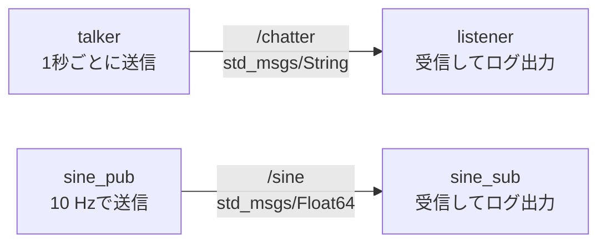
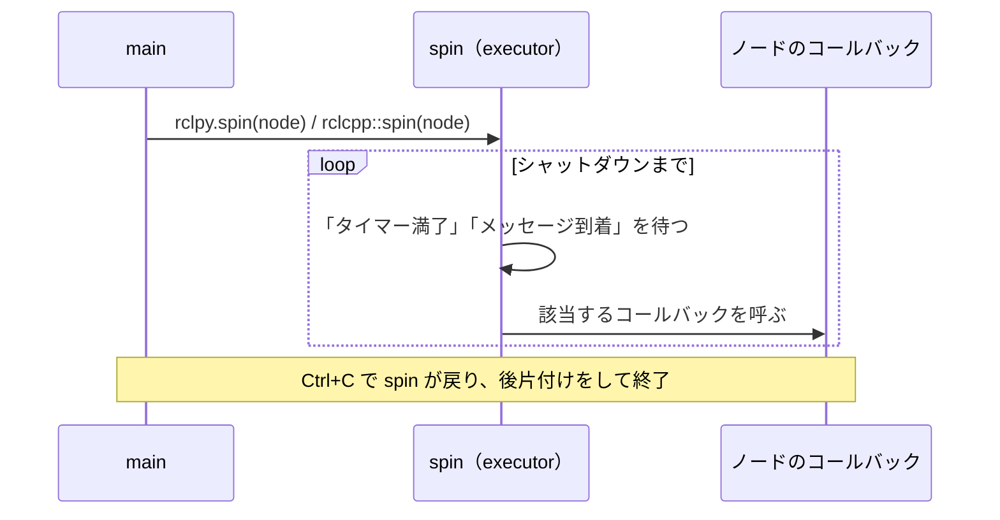

# フェーズ3-1 手順書: Publisher / Subscriber（トピック）をPython・C++で書く

`docs/learning_plan.md` フェーズ3（idea_origin.md ステップ1の1-2 ①②）に対応する。同じ仕様のノードをPythonとC++の両方で書き、動作と書き方の違いを比べる。

- 想定環境: WSL2 + Ubuntu 24.04 + ROS2 Jazzy
- 前提: フェーズ2完了（`ws/src/learn_py` と `ws/src/learn_cpp` があり、`colcon build --symlink-install` が通る）
- 所要目安: 1〜2コマ
- 言語: **Python・C++の両方**（Python → C++の順を推奨）

> **進め方**: 学習が目的なので、まず**仕様（2節）だけを見て自分で書いてみる**。詰まったら各節の「サンプルコード」を開いて答え合わせをする。サンプルは学習の手がかりとして最小限に書いたもので、公式チュートリアルの転載ではない。コードはこの手順書の作成時にビルド確認済みだが、ノードの実行結果は未確認（出力が違えば差分を貼ってほしい）。

## 0. 学習目標と完了条件

1. Publisher（`create_publisher`）とSubscriber（`create_subscription`）の基本形を、Python・C++の両方で書ける。
2. タイマーコールバックと、購読コールバックの動く仕組み（`spin` が呼び出す）を説明できる。
3. **Pythonの Publisher × C++ の Subscriber**（およびその逆）でも通信できることを確認する。
4. `ros2 topic list/echo/hz/info` と `rqt_graph` で、自作ノードの通信を観察できる。

## 1. 全体像



コールバックの動き（`spin` の役割）:



## 2. 仕様（Python版・C++版で同一）

| ノード | 役割 | トピック（型） | 動作 |
|---|---|---|---|
| `talker` | Publisher | `chatter`（`std_msgs/msg/String`） | 1秒ごとに `hello 0`, `hello 1`, ... を送り、送った内容をログに出す |
| `listener` | Subscriber | `chatter`（`std_msgs/msg/String`） | 受信した文字列をログに出す |
| `sine_pub` | Publisher | `sine`（`std_msgs/msg/Float64`） | 10 Hz（0.1秒周期）で、時刻 t に対して `sin(2π × 0.5 × t)` の値を送る（周期2秒の正弦波） |
| `sine_sub` | Subscriber | `sine`（`std_msgs/msg/Float64`） | 受信した値をログに出す |

- キューの深さ（QoSの `depth`）は10とする（QoSはフェーズ3-2で扱う）。
- 実行ファイル名は上表のノード名と同じにする（`ros2 run learn_py talker` のように起動できる）。

## 3. Python版（`ws/src/learn_py`）

### 3-1. 書くもの

`ws/src/learn_py/learn_py/` の下に4ファイルを作る: `talker.py`, `listener.py`, `sine_pub.py`, `sine_sub.py`。

主なAPI（rclpy）:

| やりたいこと | API |
|---|---|
| ノードの作成 | `class X(Node)` を継承し、`super().__init__('ノード名')` |
| Publisherの作成 | `self.create_publisher(メッセージ型, 'トピック名', 10)` |
| Subscriberの作成 | `self.create_subscription(メッセージ型, 'トピック名', コールバック, 10)` |
| タイマー | `self.create_timer(周期[秒], コールバック)` |
| ログ出力 | `self.get_logger().info('...')` |
| 送信 | `publisher.publish(メッセージ)` |
| 起動と終了 | `rclpy.init()` → `rclpy.spin(node)` → `rclpy.try_shutdown()` |

<details>
<summary>サンプルコード（答え合わせ用）</summary>

ファイル: `ws/src/learn_py/learn_py/talker.py`

<!-- file: ws/src/learn_py/learn_py/talker.py -->
```python
import rclpy
from rclpy.executors import ExternalShutdownException
from rclpy.node import Node
from std_msgs.msg import String


class Talker(Node):
    def __init__(self):
        super().__init__('talker')
        self.pub = self.create_publisher(String, 'chatter', 10)
        self.count = 0
        self.timer = self.create_timer(1.0, self.on_timer)

    def on_timer(self):
        msg = String()
        msg.data = f'hello {self.count}'
        self.pub.publish(msg)
        self.get_logger().info(f'publish: {msg.data}')
        self.count += 1


def main(args=None):
    rclpy.init(args=args)
    node = Talker()
    try:
        rclpy.spin(node)
    except (KeyboardInterrupt, ExternalShutdownException):
        pass
    finally:
        node.destroy_node()
        rclpy.try_shutdown()
```

ファイル: `ws/src/learn_py/learn_py/listener.py`

<!-- file: ws/src/learn_py/learn_py/listener.py -->
```python
import rclpy
from rclpy.executors import ExternalShutdownException
from rclpy.node import Node
from std_msgs.msg import String


class Listener(Node):
    def __init__(self):
        super().__init__('listener')
        self.sub = self.create_subscription(String, 'chatter', self.on_message, 10)

    def on_message(self, msg):
        self.get_logger().info(f'received: {msg.data}')


def main(args=None):
    rclpy.init(args=args)
    node = Listener()
    try:
        rclpy.spin(node)
    except (KeyboardInterrupt, ExternalShutdownException):
        pass
    finally:
        node.destroy_node()
        rclpy.try_shutdown()
```

ファイル: `ws/src/learn_py/learn_py/sine_pub.py`

<!-- file: ws/src/learn_py/learn_py/sine_pub.py -->
```python
import math

import rclpy
from rclpy.executors import ExternalShutdownException
from rclpy.node import Node
from std_msgs.msg import Float64


class SinePub(Node):
    def __init__(self):
        super().__init__('sine_pub')
        self.pub = self.create_publisher(Float64, 'sine', 10)
        self.freq_hz = 0.5
        self.timer = self.create_timer(0.1, self.on_timer)

    def on_timer(self):
        t = self.get_clock().now().nanoseconds * 1e-9
        msg = Float64()
        msg.data = math.sin(2.0 * math.pi * self.freq_hz * t)
        self.pub.publish(msg)


def main(args=None):
    rclpy.init(args=args)
    node = SinePub()
    try:
        rclpy.spin(node)
    except (KeyboardInterrupt, ExternalShutdownException):
        pass
    finally:
        node.destroy_node()
        rclpy.try_shutdown()
```

ファイル: `ws/src/learn_py/learn_py/sine_sub.py`

<!-- file: ws/src/learn_py/learn_py/sine_sub.py -->
```python
import rclpy
from rclpy.executors import ExternalShutdownException
from rclpy.node import Node
from std_msgs.msg import Float64


class SineSub(Node):
    def __init__(self):
        super().__init__('sine_sub')
        self.sub = self.create_subscription(Float64, 'sine', self.on_message, 10)

    def on_message(self, msg):
        self.get_logger().info(f'sine: {msg.data:.3f}')


def main(args=None):
    rclpy.init(args=args)
    node = SineSub()
    try:
        rclpy.spin(node)
    except (KeyboardInterrupt, ExternalShutdownException):
        pass
    finally:
        node.destroy_node()
        rclpy.try_shutdown()
```

</details>

### 3-2. 実行ファイルとして登録する

`ws/src/learn_py/setup.py` の `entry_points` に4行を足す（既存の `hello` は残す）。**登録を足したので、この後は再ビルドが必要**（`--symlink-install` でも同じ）。

<!-- snippet: py_entry_points_pubsub -->
```python
    entry_points={
        'console_scripts': [
            'hello = learn_py.hello:main',
            'talker = learn_py.talker:main',
            'listener = learn_py.listener:main',
            'sine_pub = learn_py.sine_pub:main',
            'sine_sub = learn_py.sine_sub:main',
        ],
    },
```

`package.xml` には、`ros2 pkg create` 時に `--dependencies rclpy std_msgs` を指定していれば、依存はすでに入っている（`<depend>rclpy</depend>` と `<depend>std_msgs</depend>`）。

### 3-3. ビルドして動かす

```bash
cd ~/work/ros2MinimalPhysicalAi/ws
colcon build --symlink-install --packages-select learn_py
source install/setup.bash
```

ターミナルを2つ使う。

```bash
# T1
ros2 run learn_py talker
# T2
ros2 run learn_py listener
```

`sine_pub` / `sine_sub` も同様に動かす。

## 4. C++版（`ws/src/learn_cpp`）

### 4-1. 書くもの

`ws/src/learn_cpp/src/` の下に4ファイルを作る: `talker.cpp`, `listener.cpp`, `sine_pub.cpp`, `sine_sub.cpp`。

主なAPI（rclcpp）:

| やりたいこと | API |
|---|---|
| ノードの作成 | `class X : public rclcpp::Node`、コンストラクタで `Node("ノード名")` |
| Publisherの作成 | `create_publisher<メッセージ型>("トピック名", 10)` |
| Subscriberの作成 | `create_subscription<メッセージ型>("トピック名", 10, コールバック)` |
| タイマー | `create_wall_timer(周期, コールバック)`（`std::chrono_literals` の `1s`, `100ms` が使える） |
| ログ出力 | `RCLCPP_INFO(get_logger(), "書式 %s", ...)` |
| 送信 | `publisher->publish(メッセージ)` |
| 起動と終了 | `rclcpp::init` → `rclcpp::spin(std::make_shared<X>())` → `rclcpp::shutdown()` |

Pythonとの違いの見どころ:

- 型がテンプレート引数（`<std_msgs::msg::String>`）で明示される。
- ポインタ（`SharedPtr`）で持つ。Publisherは `->publish()`。
- メンバ変数（`pub_`, `timer_`）を保持しないと、コンストラクタを抜けた時点で解放され動かなくなる。

<details>
<summary>サンプルコード（答え合わせ用）</summary>

ファイル: `ws/src/learn_cpp/src/talker.cpp`

<!-- file: ws/src/learn_cpp/src/talker.cpp -->
```cpp
#include <chrono>
#include <memory>
#include <string>

#include "rclcpp/rclcpp.hpp"
#include "std_msgs/msg/string.hpp"

using namespace std::chrono_literals;

class Talker : public rclcpp::Node
{
public:
  Talker() : Node("talker")
  {
    pub_ = create_publisher<std_msgs::msg::String>("chatter", 10);
    timer_ = create_wall_timer(1s, [this]() { on_timer(); });
  }

private:
  void on_timer()
  {
    std_msgs::msg::String msg;
    msg.data = "hello " + std::to_string(count_++);
    pub_->publish(msg);
    RCLCPP_INFO(get_logger(), "publish: %s", msg.data.c_str());
  }

  rclcpp::Publisher<std_msgs::msg::String>::SharedPtr pub_;
  rclcpp::TimerBase::SharedPtr timer_;
  int count_ = 0;
};

int main(int argc, char ** argv)
{
  rclcpp::init(argc, argv);
  rclcpp::spin(std::make_shared<Talker>());
  rclcpp::shutdown();
  return 0;
}
```

ファイル: `ws/src/learn_cpp/src/listener.cpp`

<!-- file: ws/src/learn_cpp/src/listener.cpp -->
```cpp
#include <memory>

#include "rclcpp/rclcpp.hpp"
#include "std_msgs/msg/string.hpp"

class Listener : public rclcpp::Node
{
public:
  Listener() : Node("listener")
  {
    sub_ = create_subscription<std_msgs::msg::String>(
      "chatter", 10,
      [this](const std_msgs::msg::String & msg) {
        RCLCPP_INFO(get_logger(), "received: %s", msg.data.c_str());
      });
  }

private:
  rclcpp::Subscription<std_msgs::msg::String>::SharedPtr sub_;
};

int main(int argc, char ** argv)
{
  rclcpp::init(argc, argv);
  rclcpp::spin(std::make_shared<Listener>());
  rclcpp::shutdown();
  return 0;
}
```

ファイル: `ws/src/learn_cpp/src/sine_pub.cpp`

<!-- file: ws/src/learn_cpp/src/sine_pub.cpp -->
```cpp
#include <chrono>
#include <cmath>
#include <memory>

#include "rclcpp/rclcpp.hpp"
#include "std_msgs/msg/float64.hpp"

using namespace std::chrono_literals;

class SinePub : public rclcpp::Node
{
public:
  SinePub() : Node("sine_pub")
  {
    pub_ = create_publisher<std_msgs::msg::Float64>("sine", 10);
    timer_ = create_wall_timer(100ms, [this]() { on_timer(); });
  }

private:
  void on_timer()
  {
    const double t = now().seconds();
    std_msgs::msg::Float64 msg;
    msg.data = std::sin(2.0 * M_PI * freq_hz_ * t);
    pub_->publish(msg);
  }

  rclcpp::Publisher<std_msgs::msg::Float64>::SharedPtr pub_;
  rclcpp::TimerBase::SharedPtr timer_;
  double freq_hz_ = 0.5;
};

int main(int argc, char ** argv)
{
  rclcpp::init(argc, argv);
  rclcpp::spin(std::make_shared<SinePub>());
  rclcpp::shutdown();
  return 0;
}
```

ファイル: `ws/src/learn_cpp/src/sine_sub.cpp`

<!-- file: ws/src/learn_cpp/src/sine_sub.cpp -->
```cpp
#include <memory>

#include "rclcpp/rclcpp.hpp"
#include "std_msgs/msg/float64.hpp"

class SineSub : public rclcpp::Node
{
public:
  SineSub() : Node("sine_sub")
  {
    sub_ = create_subscription<std_msgs::msg::Float64>(
      "sine", 10,
      [this](const std_msgs::msg::Float64 & msg) {
        RCLCPP_INFO(get_logger(), "sine: %.3f", msg.data);
      });
  }

private:
  rclcpp::Subscription<std_msgs::msg::Float64>::SharedPtr sub_;
};

int main(int argc, char ** argv)
{
  rclcpp::init(argc, argv);
  rclcpp::spin(std::make_shared<SineSub>());
  rclcpp::shutdown();
  return 0;
}
```

</details>

### 4-2. `CMakeLists.txt` に登録する

`ws/src/learn_cpp/CMakeLists.txt` に、実行ファイルごとの定義を足し、`install(TARGETS ...)` に名前を並べる。雛形の `hello` の定義は残す。

<!-- snippet: cmake_pubsub -->
```cmake
add_executable(talker src/talker.cpp)
ament_target_dependencies(talker rclcpp std_msgs)

add_executable(listener src/listener.cpp)
ament_target_dependencies(listener rclcpp std_msgs)

add_executable(sine_pub src/sine_pub.cpp)
ament_target_dependencies(sine_pub rclcpp std_msgs)

add_executable(sine_sub src/sine_sub.cpp)
ament_target_dependencies(sine_sub rclcpp std_msgs)

install(TARGETS
  hello
  talker
  listener
  sine_pub
  sine_sub
  DESTINATION lib/${PROJECT_NAME})
```

- 雛形にある `install(TARGETS hello DESTINATION lib/${PROJECT_NAME})` は、上の `install(TARGETS ...)` に**置き換える**（重複させない）。
- `ament_package()` は必ずファイルの**最後**に置く。

### 4-3. ビルドして動かす

```bash
cd ~/work/ros2MinimalPhysicalAi/ws
colcon build --symlink-install --packages-select learn_cpp
source install/setup.bash

# T1
ros2 run learn_cpp talker
# T2
ros2 run learn_cpp listener
```

> C++のビルドは時間がかかる。エラーが出たら**最初の `error:` の行**から読む（後続のエラーは連鎖であることが多い）。

## 5. 観察する

2つの言語のノードを動かした状態で、フェーズ1のコマンドを使う。

```bash
ros2 node list
ros2 topic list -t
ros2 topic info /chatter -v      # -v でPublisher/Subscriberの詳細（QoSも）が出る
ros2 topic echo /sine
ros2 topic hz /sine              # 約10 Hzになること
rqt_graph                        # GUI（ユーザーが起動して確認）
```

## 6. 言語をまたいだ接続

トピック名と型が同じなら、言語は関係なくつながる。次の組み合わせをすべて試す。

| 組み合わせ | T1 | T2 |
|---|---|---|
| Python → Python | `ros2 run learn_py talker` | `ros2 run learn_py listener` |
| Python → C++ | `ros2 run learn_py talker` | `ros2 run learn_cpp listener` |
| C++ → Python | `ros2 run learn_cpp talker` | `ros2 run learn_py listener` |
| C++ → C++ | `ros2 run learn_cpp talker` | `ros2 run learn_cpp listener` |

> 課題1: `ros2 topic info /chatter -v` で、PublisherとSubscriberのノード名・型・QoSを確認する。言語が違っても、表示が同じ形式になることを確認する。
>
> 課題2: `talker` を2つ同時に（別ターミナルで）起動するとどうなるか観察する。`ros2 node list` でノード名の重複を示す警告が出ることを確認する（起動直後のログには出ないこともある）。
>
> 課題3: `listener` を起動してから `ros2 topic pub /chatter std_msgs/msg/String "{data: 'from cli'}"` を実行し、CLIからの送信もlistenerが受け取ることを確認する。
>
> 課題4（発展）: `sine_pub` の周波数 `freq_hz` を変えて、`ros2 topic echo /sine` の値の変化を見る。フェーズ3-3でパラメータ化する予習になる。

## 7. 記録用の表（Python版とC++版の比較）

フェーズ3の総括（idea_origin.md の1-7の比較表）の材料になる。書きながら埋める。

| 観点 | Python | C++ |
|---|---|---|
| コード行数（`talker`） | | |
| Publisherの作成の書き方 | | |
| コールバックの書き方 | | |
| ビルドの所要時間 | | |
| 修正から動作確認までの手数 | | |
| つまずいた点 | | |

## 8. つまずきやすい点

| 症状 | 確認すること |
|---|---|
| `ros2 run` で `No executable found` | `setup.py` の `entry_points` / `CMakeLists.txt` の `install(TARGETS ...)` を足したか。再ビルド後に `source` したか |
| C++で `fatal error: std_msgs/msg/string.hpp: No such file` | `find_package(std_msgs REQUIRED)` と `ament_target_dependencies` があるか（雛形の `--dependencies` を指定しなかった場合は手で足す） |
| listenerに何も出ない | トピック名（`chatter`）と型の綴り。`ros2 topic list -t` で確認 |
| 起動後すぐ終了する | `spin` を呼んでいるか |
| Ctrl+CでPythonが例外を吐く | `try/finally` と `rclpy.try_shutdown()` の記述を確認 |
| `ros2 topic hz` が10より大きく異なる | WSLの負荷が高い可能性。他のプロセスを止めて再測定 |

## 9. 次へ

フェーズ3-2（`docs/phase3_2_turtlesim_qos.md`）で、Twistでturtlesimを動かし、QoSの相性を体験する。

## 10. 公式ドキュメント・参考資料

確認状況（2026-09-20）: 下記は `docs/idea_origin.md` に掲載済みのURLで、今回は再確認していない（docs.ros.orgは本文取得がボット対策で拒否される）。

### 公式（ROS 2 Jazzy）

- [Beginner: Client libraries — Jazzy](https://docs.ros.org/en/jazzy/Tutorials/Beginner-Client-Libraries.html)（pub/subのチュートリアルはここから辿る）
- [rclpy API — Jazzy](https://docs.ros.org/en/jazzy/p/rclpy/)、[rclpy Node](https://docs.ros.org/en/jazzy/p/rclpy/api/node.html)
- [C++ API rclcpp — Jazzy](https://docs.ros.org/en/jazzy/p/rclcpp/generated/index.html)
- [ros2/common_interfaces（GitHub）](https://github.com/ros2/common_interfaces)（`std_msgs` 等のメッセージ定義）

### 日本語

- [実習ROS 2 Pub&Sub通信 #ROS2 - Qiita](https://qiita.com/s-kitajima/items/5a4d7f06413120010e6b)
- [ROS2で単純なPublisher＆Subscriberのノード間通信をPythonで作成・実行してみた](https://taku-info.com/simplepubsubtutorial-python/)（公式チュートリアルの和訳ベース）

> 記事は個人による非公式の解説で、版によって異なる場合がある。公式ドキュメントと食い違う場合は公式を優先する。

> 出典: 各サンプルのAPIの使い方は、上記の公式チュートリアルを参考にした（ROS 2ドキュメントはCC BY 4.0）。ノード名・仕様・コード・文章は独自に書いたもので、逐語の転載ではない。
