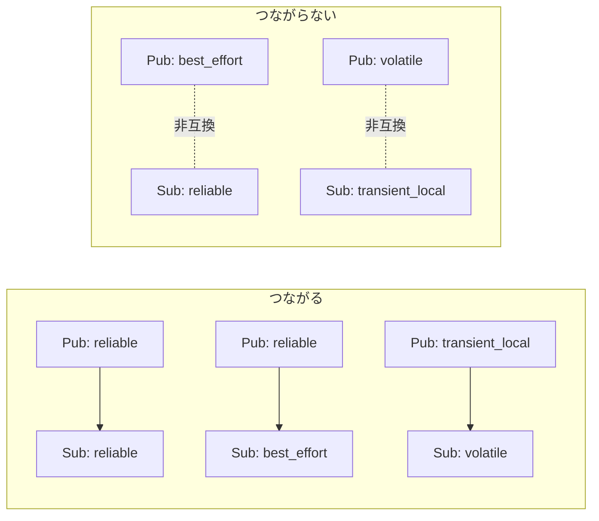

# フェーズ3-2 手順書: Twistでturtlesimを動かす・QoSの相性を体験する

`docs/learning_plan.md` フェーズ3（idea_origin.md ステップ1の1-2 ③とQoS補足）に対応する。

- 想定環境: WSL2 + Ubuntu 24.04 + ROS2 Jazzy（turtlesimはフェーズ1で導入済み）
- 前提: フェーズ3-1完了（`talker` 等が動く）
- 所要目安: 1コマ
- 言語: **Python・C++の両方**
- OSS: turtlesim（GUIの起動と目視確認はユーザーが行う）

> **進め方**: 3-1と同じく、2節の仕様は「何を作るか」の定義で、APIの使い方までは書いていない。3節・4節冒頭の「主なAPI」表とサンプルコード・解説を読んで理解し、QoSのパラメータや送る値を変えて動かしながら体で覚える。サンプルはこの手順書の作成時にビルド確認済みで、ノードの実行結果は未確認（出力が違えば差分を貼ってほしい）。

## 0. 学習目標と完了条件

1. `geometry_msgs/msg/Twist` をpublishして、turtlesimを自作ノードから動かせる（フェーズ1で `ros2 topic pub` でやったことをコードで行う）。
2. 新しい依存パッケージ（`geometry_msgs`）を、`package.xml` と `CMakeLists.txt`（C++）に足す手順を理解する。
3. QoS（reliability / durability）の設定で、**つながる組み合わせとつながらない組み合わせ**を実際に確認する。
4. `ros2 topic info -v` でQoSを読み取れる。

## 1. 全体像


<details>
<summary>同じ図（mermaid版）</summary>


</details>

QoSの相性（購読側の「要求」を、配信側の「提供」が満たせるとつながる）:


<details>
<summary>同じ図（mermaid版）</summary>



</details>

## 2. 仕様

### 2-1. `turtle_circle`（Twist → turtlesim）

| 項目 | 内容 |
|---|---|
| 役割 | Publisher |
| トピック（型） | `/turtle1/cmd_vel`（`geometry_msgs/msg/Twist`） |
| 動作 | 10 Hz（0.1秒周期）で `linear.x = 2.0`、`angular.z = 1.0` を送り続ける（亀が円を描く） |
| 備考 | パラメータ化はフェーズ3-3で行うので、今は固定値でよい |

### 2-2. `qos_talker` / `qos_listener`（QoS実験用）

| ノード | 役割 | トピック（型） | 動作 |
|---|---|---|---|
| `qos_talker` | Publisher | `qos_test`（`std_msgs/msg/String`） | 1秒ごとに `msg 0`, `msg 1`, ... を送る。QoSはROSパラメータ `reliability`（`reliable` / `best_effort`）と `durability`（`volatile` / `transient_local`）で決める。既定は `reliable` と `volatile`。深さは10 |
| `qos_listener` | Subscriber | `qos_test`（`std_msgs/msg/String`） | 受信した文字列をログに出す。QoSはtalkerと同じパラメータで決める |

パラメータの与え方（コマンドライン）:

```bash
ros2 run learn_py qos_talker --ros-args -p reliability:=best_effort -p durability:=volatile
```

（パラメータの詳しい扱いはフェーズ3-3で学ぶ。ここでは「起動時に値を渡せる」ことだけ使う。）

## 3. 準備: 依存の追加（`geometry_msgs`）

`turtle_circle` は `geometry_msgs` を使うので、まず依存を足す。

**Python（`ws/src/learn_py/package.xml`）**: 既存の `<depend>` の並びに1行足す。

```xml
<depend>geometry_msgs</depend>
```

**C++（`ws/src/learn_cpp/package.xml`）**: 同じく足す。加えて `CMakeLists.txt` に `find_package(geometry_msgs REQUIRED)` を、既存の `find_package(std_msgs REQUIRED)` の隣へ足す（後のCMake追記で `ament_target_dependencies` にも書く）。

```xml
<depend>geometry_msgs</depend>
```

<!-- snippet: cmake_find_geometry -->
```cmake
find_package(geometry_msgs REQUIRED)
```

`package.xml` の `<depend>` は「このパッケージは `geometry_msgs` に依存する」という宣言で、`colcon` が依存関係からビルド順を決めたり、`rosdep` が不足を検出したりするために使う。`<depend>` はビルド時・実行時の両方の依存をまとめて宣言する書き方。一方 `CMakeLists.txt` の `find_package` は、C++のビルド時にヘッダやライブラリの場所を探す指示。C++では**両方**必要で、片方だけだとビルドエラーになる（第8節）。Pythonは `package.xml` だけでよい。

## 4. Python版（`ws/src/learn_py`）

`ws/src/learn_py/learn_py/` に `turtle_circle.py`, `qos_talker.py`, `qos_listener.py` を作る。

主なAPI（rclpy）:

| やりたいこと | API |
|---|---|
| Twist型のメッセージ | `from geometry_msgs.msg import Twist`、`msg.linear.x = 2.0`、`msg.angular.z = 1.0` |
| QoSの設定 | `from rclpy.qos import QoSProfile, ReliabilityPolicy, DurabilityPolicy`、`QoSProfile(depth=10, reliability=..., durability=...)` |
| パラメータの宣言と取得 | `self.declare_parameter('名前', 既定値)`、`self.get_parameter('名前').get_parameter_value().string_value` |

### サンプルコードと解説

ファイル: `ws/src/learn_py/learn_py/turtle_circle.py`

<!-- file: ws/src/learn_py/learn_py/turtle_circle.py -->
```python
import rclpy
from geometry_msgs.msg import Twist
from rclpy.executors import ExternalShutdownException
from rclpy.node import Node


class TurtleCircle(Node):
    def __init__(self):
        super().__init__('turtle_circle')
        self.pub = self.create_publisher(Twist, '/turtle1/cmd_vel', 10)
        self.timer = self.create_timer(0.1, self.on_timer)

    def on_timer(self):
        msg = Twist()
        msg.linear.x = 2.0
        msg.angular.z = 1.0
        self.pub.publish(msg)


def main(args=None):
    rclpy.init(args=args)
    node = TurtleCircle()
    try:
        rclpy.spin(node)
    except (KeyboardInterrupt, ExternalShutdownException):
        pass
    finally:
        node.destroy_node()
        rclpy.try_shutdown()
```

**`turtle_circle.py` の解説**

役割は「一定の速度指令を10 Hzで送り続ける Publisher」。フェーズ1で `ros2 topic pub -r 10 ...` と手で打っていたことを、ノードにしたものにあたる。流れは「ノードを作る → Publisherとタイマーを用意する → タイマーが鳴るたびにTwistを作って送る」。

- `import` 部: `Twist` は `geometry_msgs` パッケージのメッセージ型。だから `package.xml` に `geometry_msgs` の依存が要る（第3節）。`ExternalShutdownException` は後述の終了処理で使う。
- `super().__init__('turtle_circle')`: 親クラス `Node` を、ノード名 `turtle_circle` で初期化する。これを呼ばないと、以降の `create_*` 系が使えない。
- `create_publisher(Twist, '/turtle1/cmd_vel', 10)`: 引数は「メッセージ型・トピック名・QoS」。QoSに整数を渡すと「深さ（キューに溜める件数）が10で、他は既定値（reliable・volatile）」の意味になる。先頭の `/` を付けると絶対名になり、名前空間に左右されない。turtlesimの購読トピックは `/turtle1/cmd_vel` なので、綴りが違うと亀は動かず、エラーも出ない。
- `create_timer(0.1, self.on_timer)`: 0.1秒（=10 Hz）ごとに `on_timer` を呼ぶ。第1引数の単位は**秒**。`self.timer` に保持しているのは、後から止めたり周期を変えたりできるようにするため（Pythonではノードも内部で保持するので、必須ではない）。
- `on_timer`: `Twist()` は全フィールドが0で作られる。`Twist` は `linear`（並進速度 x, y, z、単位 m/s）と `angular`（回転速度 x, y, z、単位 rad/s）の2つのベクトルを持つ。turtlesimは2次元なので、使うのは `linear.x`（前進）と `angular.z`（旋回）だけ。前進2.0と旋回1.0を同時に出し続けるので、亀は半径 `2.0 / 1.0 = 2.0` の円を描く（課題2の根拠）。
- `main` 内の流れ: `rclpy.init` → ノード生成 → `rclpy.spin`（コールバックを処理し続けて、ここで待つ）→ 終了時に後始末。`Ctrl+C` は `KeyboardInterrupt`、外部からのシャットダウンは `ExternalShutdownException` になるので、どちらも握りつぶして正常終了させる。`finally` の `destroy_node()` と `rclpy.try_shutdown()` は、途中で例外が出ても必ず実行したい後始末。`try_shutdown` は「すでにシャットダウン済みでもエラーにならない」版。
- `main(args=None)` という形は、`setup.py` の `'turtle_circle = learn_py.turtle_circle:main'` がこの関数を呼ぶため。ファイル末尾に `if __name__ == '__main__':` は不要（`ros2 run` は `entry_points` から生成されたスクリプト経由で `main` を呼ぶ）。

観察ポイント: turtlesimを先に起動しておき、`ros2 topic echo /turtle1/cmd_vel` で `linear.x: 2.0`、`angular.z: 1.0` が流れていることを見る。亀が動かないときは、まずecho側に値が出ているかで「送れていない」のか「届いていない」のかを切り分ける。

ファイル: `ws/src/learn_py/learn_py/qos_talker.py`

<!-- file: ws/src/learn_py/learn_py/qos_talker.py -->
```python
import rclpy
from rclpy.executors import ExternalShutdownException
from rclpy.node import Node
from rclpy.qos import DurabilityPolicy, QoSProfile, ReliabilityPolicy
from std_msgs.msg import String


def make_qos(reliability, durability):
    if reliability not in ('reliable', 'best_effort'):
        raise ValueError(f'invalid reliability: {reliability}')
    if durability not in ('volatile', 'transient_local'):
        raise ValueError(f'invalid durability: {durability}')
    return QoSProfile(
        depth=10,
        reliability=(ReliabilityPolicy.RELIABLE if reliability == 'reliable'
                     else ReliabilityPolicy.BEST_EFFORT),
        durability=(DurabilityPolicy.TRANSIENT_LOCAL if durability == 'transient_local'
                    else DurabilityPolicy.VOLATILE),
    )


class QosTalker(Node):
    def __init__(self):
        super().__init__('qos_talker')
        self.declare_parameter('reliability', 'reliable')
        self.declare_parameter('durability', 'volatile')
        reliability = self.get_parameter('reliability').get_parameter_value().string_value
        durability = self.get_parameter('durability').get_parameter_value().string_value
        self.get_logger().info(f'QoS: reliability={reliability}, durability={durability}')
        self.pub = self.create_publisher(String, 'qos_test', make_qos(reliability, durability))
        self.count = 0
        self.timer = self.create_timer(1.0, self.on_timer)

    def on_timer(self):
        msg = String()
        msg.data = f'msg {self.count}'
        self.pub.publish(msg)
        self.get_logger().info(f'publish: {msg.data}')
        self.count += 1


def main(args=None):
    rclpy.init(args=args)
    node = QosTalker()
    try:
        rclpy.spin(node)
    except (KeyboardInterrupt, ExternalShutdownException):
        pass
    finally:
        node.destroy_node()
        rclpy.try_shutdown()
```

**`qos_talker.py` の解説**

役割は「QoSを起動時のパラメータで切り替えられる Publisher」。1秒ごとに `msg 0`, `msg 1`, ... と送る。QoSの相性実験（第6-2節）の送り手になる。

- `make_qos(reliability, durability)`: 文字列2つから `QoSProfile` を作る関数。想定外の文字列は `ValueError` にして、綴りミスに気づけるようにしている（黙って既定値に落とすと、実験結果が何の設定だったか分からなくなる）。
- `QoSProfile(depth=10, reliability=..., durability=...)` の各項目:
  - `depth`: 履歴（history）の深さ。直近何件まで保持するか。ここでは「直近10件を保持する」設定（keep last）になる。
  - `reliability`: `RELIABLE` は届くまで再送を試みる。`BEST_EFFORT` は再送せず、取りこぼしを許す（その代わり軽い）。
  - `durability`: `VOLATILE` は「送った時点でつながっている相手にだけ届く」。`TRANSIENT_LOCAL` は「Publisherが直近の `depth` 件を覚えておき、あとから接続した購読側にも渡す」。
- `declare_parameter('reliability', 'reliable')`: パラメータを名前と既定値つきで宣言する。宣言していないパラメータは `-p` で渡しても受け付けられない。既定値の型（ここでは文字列）が、そのパラメータの型になる。
- `get_parameter(...).get_parameter_value().string_value`: 値は `ParameterValue` という入れ物で返るので、型に合ったフィールド（文字列なら `string_value`）を取り出す。整数なら `integer_value`、実数なら `double_value`。
- 起動時に `QoS: reliability=..., durability=...` をログに出しているのは、「今どの設定で動いているか」をターミナルで確認するため。実験で設定を取り違えないための工夫。
- `on_timer`: `f'msg {self.count}'` で連番の文字列を作り、`publish` してログに出す。ログの `publish:` は「送ろうとした」印であり、受け取り側がいるかどうかは関係なく出る。**つながらない組み合わせでも、talker側は普通にログを出し続ける**（相手が受け取れないだけで、送り手のエラーにはならない）。

観察ポイント:

- ⑤（`transient_local` 同士）は、talkerを先に起動して5秒ほど待ってからlistenerを起動する。listenerが起動した直後に `msg 0` から数件が一気に届けば成功。`depth=10` なので、10件を超えて溜まっても、届くのは直近10件まで。
- ④・⑦のようにつながらない組み合わせでは、QoSが非互換だという警告がログに出ることが多い（出方はノードや言語で異なりうるので、実験で確認する）。`ros2 topic info /qos_test -v` で、PublisherとSubscriptionのQoSを見比べる。

つまずき: ノードのコンストラクタで例外が出ると、`spin` に入る前にプロセスごと落ちる。`ValueError: invalid reliability` は、パラメータの綴りか大文字小文字を疑う。

ファイル: `ws/src/learn_py/learn_py/qos_listener.py`

<!-- file: ws/src/learn_py/learn_py/qos_listener.py -->
```python
import rclpy
from rclpy.executors import ExternalShutdownException
from rclpy.node import Node
from rclpy.qos import DurabilityPolicy, QoSProfile, ReliabilityPolicy
from std_msgs.msg import String


def make_qos(reliability, durability):
    if reliability not in ('reliable', 'best_effort'):
        raise ValueError(f'invalid reliability: {reliability}')
    if durability not in ('volatile', 'transient_local'):
        raise ValueError(f'invalid durability: {durability}')
    return QoSProfile(
        depth=10,
        reliability=(ReliabilityPolicy.RELIABLE if reliability == 'reliable'
                     else ReliabilityPolicy.BEST_EFFORT),
        durability=(DurabilityPolicy.TRANSIENT_LOCAL if durability == 'transient_local'
                    else DurabilityPolicy.VOLATILE),
    )


class QosListener(Node):
    def __init__(self):
        super().__init__('qos_listener')
        self.declare_parameter('reliability', 'reliable')
        self.declare_parameter('durability', 'volatile')
        reliability = self.get_parameter('reliability').get_parameter_value().string_value
        durability = self.get_parameter('durability').get_parameter_value().string_value
        self.get_logger().info(f'QoS: reliability={reliability}, durability={durability}')
        self.sub = self.create_subscription(
            String, 'qos_test', self.on_message, make_qos(reliability, durability))

    def on_message(self, msg):
        self.get_logger().info(f'received: {msg.data}')


def main(args=None):
    rclpy.init(args=args)
    node = QosListener()
    try:
        rclpy.spin(node)
    except (KeyboardInterrupt, ExternalShutdownException):
        pass
    finally:
        node.destroy_node()
        rclpy.try_shutdown()
```

**`qos_listener.py` の解説**

役割は「同じパラメータでQoSを決める Subscriber」。受け取った文字列をログに出す。`make_qos` と `declare_parameter` まわりは talker と同じなので、差分だけ書く。

- `create_subscription(String, 'qos_test', self.on_message, make_qos(...))`: 引数の順は「型・トピック名・**コールバック**・QoS」。Publisherの `create_publisher(型, 名前, QoS)` とは違い、コールバックがQoSより前に来る。順番を逆にすると、型エラーになる。
- `on_message(self, msg)`: メッセージが届くたびに呼ばれる。`msg` は `String` 型で、中身は `msg.data`。コールバックは `spin` の中で呼ばれるので、`spin` に入っていないと何も起きない。
- `self.sub` に保持しているのは、後から参照できるようにするため（Pythonではノードも内部で保持するので、必須ではない）。
- `make_qos` を talker と listener に同じ内容で二重に書いているのは、1ファイルで読み切れるようにするための割り切り。実務なら共通モジュールに切り出す。

観察ポイント: listenerを起動したときのログ `QoS: reliability=..., durability=...` を、talker側の値と見比べる。「つながる / つながらない」は、この2つの組（購読側の要求と配信側の提供）で決まる。つながらないとき、`received:` は1件も出ない。

`setup.py` の `entry_points` に3行を足し（前節までの行は残す）、再ビルドする。

<!-- snippet: py_entry_points_qos -->
```python
            'turtle_circle = learn_py.turtle_circle:main',
            'qos_talker = learn_py.qos_talker:main',
            'qos_listener = learn_py.qos_listener:main',
```

`'実行ファイル名 = パッケージ.モジュール:関数'` の形式で、`ros2 run learn_py turtle_circle` の `turtle_circle` が左辺、呼ばれる関数が右辺の `main`。前節でも触れたとおり、`entry_points` を変えたときは `--symlink-install` でも再ビルドが必要。カンマの付け忘れや、リストの外へ書いてしまうミスに注意する。

```bash
cd ~/work/ros2MinimalPhysicalAi/ws
colcon build --symlink-install --packages-select learn_py
source install/setup.bash
```

## 5. C++版（`ws/src/learn_cpp`）

`ws/src/learn_cpp/src/` に `turtle_circle.cpp`, `qos_talker.cpp`, `qos_listener.cpp` を作る。

主なAPI（rclcpp）:

| やりたいこと | API |
|---|---|
| Twist型のメッセージ | `#include "geometry_msgs/msg/twist.hpp"`、`msg.linear.x = 2.0;`、`msg.angular.z = 1.0;` |
| QoSの設定 | `rclcpp::QoS qos(10); qos.reliable(); qos.best_effort(); qos.transient_local(); qos.durability_volatile();` |
| パラメータの宣言と取得 | `declare_parameter<std::string>("名前", "既定値")`（宣言と同時に値が返る） |

### サンプルコードと解説

ファイル: `ws/src/learn_cpp/src/turtle_circle.cpp`

<!-- file: ws/src/learn_cpp/src/turtle_circle.cpp -->
```cpp
#include <chrono>
#include <memory>

#include "geometry_msgs/msg/twist.hpp"
#include "rclcpp/rclcpp.hpp"

using namespace std::chrono_literals;

class TurtleCircle : public rclcpp::Node
{
public:
  TurtleCircle() : Node("turtle_circle")
  {
    pub_ = create_publisher<geometry_msgs::msg::Twist>("/turtle1/cmd_vel", 10);
    timer_ = create_wall_timer(100ms, [this]() { on_timer(); });
  }

private:
  void on_timer()
  {
    geometry_msgs::msg::Twist msg;
    msg.linear.x = 2.0;
    msg.angular.z = 1.0;
    pub_->publish(msg);
  }

  rclcpp::Publisher<geometry_msgs::msg::Twist>::SharedPtr pub_;
  rclcpp::TimerBase::SharedPtr timer_;
};

int main(int argc, char ** argv)
{
  rclcpp::init(argc, argv);
  rclcpp::spin(std::make_shared<TurtleCircle>());
  rclcpp::shutdown();
  return 0;
}
```

**`turtle_circle.cpp` の解説**

Python版と同じ「10 Hzで `linear.x=2.0`、`angular.z=1.0` を送る」Publisherを、C++で書いたもの。Twistの各フィールドの意味や、亀が半径2の円を描く理由は Python版の解説を参照。ここでは言語固有の点を中心に書く。

- `#include "geometry_msgs/msg/twist.hpp"`: メッセージ型は「パッケージ名/msg/型名（小文字・スネークケース）.hpp」のヘッダで取り込む。型名の側は `geometry_msgs::msg::Twist`（名前空間で区切る）。
- `using namespace std::chrono_literals;`: `100ms` や `1s` のような時間リテラルを使えるようにする。Pythonの `0.1`（秒）に対応する部分で、こちらは単位が型に入るので取り違えにくい。
- `class TurtleCircle : public rclcpp::Node`: Pythonの `class TurtleCircle(Node)` にあたる継承。`Node("turtle_circle")` を初期化子リストで呼んで、ノード名を渡す。
- `create_publisher<geometry_msgs::msg::Twist>("/turtle1/cmd_vel", 10)`: 型はテンプレート引数で指定し、引数は「トピック名・QoS」。`10` は `rclcpp::QoS` に暗黙変換され、深さ10・他は既定値になる。
- `create_wall_timer(100ms, [this]() { on_timer(); })`: 周期とコールバックを渡す。`wall` は「実時間（壁時計）で動くタイマー」の意味。コールバックはラムダ式で、`[this]` はメンバ関数を呼ぶためにオブジェクト自身を取り込む指定。同じことは `std::bind(&TurtleCircle::on_timer, this)` でも書けるが、ラムダのほうが読みやすいので本手順書はラムダに統一している。
- `geometry_msgs::msg::Twist msg;`: 各フィールドは0で初期化されているので、使う2つだけ代入すればよい。`pub_->publish(msg)` の `->` は、Publisherが `shared_ptr` で返ってくるため。
- メンバ変数の `pub_`・`timer_` は `SharedPtr`（`std::shared_ptr` の別名）。ノードが持ち続けている間だけ、Publisherとタイマーが生きる。ローカル変数に受けて関数を抜けると破棄され、タイマーが鳴らなくなる。
- `main`: `rclcpp::init` → `std::make_shared<TurtleCircle>()` でノードを共有ポインタとして作る → `rclcpp::spin`（Ctrl+Cまで戻らない）→ `rclcpp::shutdown`。Python版のような `try/finally` は不要で、`Ctrl+C` はrclcppが受けて `spin` から抜けさせる。ノードは `shared_ptr` なので、`main` を抜けるときに自動で解放される。

つまずき: `CMakeLists.txt` の `ament_target_dependencies` に `geometry_msgs` を書き忘れると、`geometry_msgs/msg/twist.hpp` が見つからないビルドエラーになる。

ファイル: `ws/src/learn_cpp/src/qos_talker.cpp`

<!-- file: ws/src/learn_cpp/src/qos_talker.cpp -->
```cpp
#include <chrono>
#include <memory>
#include <stdexcept>
#include <string>

#include "rclcpp/rclcpp.hpp"
#include "std_msgs/msg/string.hpp"

using namespace std::chrono_literals;

static rclcpp::QoS make_qos(const std::string & reliability, const std::string & durability)
{
  if (reliability != "reliable" && reliability != "best_effort") {
    throw std::invalid_argument("invalid reliability: " + reliability);
  }
  if (durability != "volatile" && durability != "transient_local") {
    throw std::invalid_argument("invalid durability: " + durability);
  }
  rclcpp::QoS qos(10);
  if (reliability == "best_effort") {
    qos.best_effort();
  } else {
    qos.reliable();
  }
  if (durability == "transient_local") {
    qos.transient_local();
  } else {
    qos.durability_volatile();
  }
  return qos;
}

class QosTalker : public rclcpp::Node
{
public:
  QosTalker() : Node("qos_talker")
  {
    const auto reliability = declare_parameter<std::string>("reliability", "reliable");
    const auto durability = declare_parameter<std::string>("durability", "volatile");
    RCLCPP_INFO(
      get_logger(), "QoS: reliability=%s, durability=%s",
      reliability.c_str(), durability.c_str());
    pub_ = create_publisher<std_msgs::msg::String>("qos_test", make_qos(reliability, durability));
    timer_ = create_wall_timer(1s, [this]() { on_timer(); });
  }

private:
  void on_timer()
  {
    std_msgs::msg::String msg;
    msg.data = "msg " + std::to_string(count_++);
    pub_->publish(msg);
    RCLCPP_INFO(get_logger(), "publish: %s", msg.data.c_str());
  }

  rclcpp::Publisher<std_msgs::msg::String>::SharedPtr pub_;
  rclcpp::TimerBase::SharedPtr timer_;
  int count_ = 0;
};

int main(int argc, char ** argv)
{
  rclcpp::init(argc, argv);
  rclcpp::spin(std::make_shared<QosTalker>());
  rclcpp::shutdown();
  return 0;
}
```

**`qos_talker.cpp` の解説**

Python版 `qos_talker.py` と同じ仕様（QoSをパラメータで切り替える Publisher）。QoSの各項目（depth・reliability・durability）の意味は Python版の解説を参照し、ここでは対応関係と言語固有の点を書く。

- `make_qos`: Pythonでは `QoSProfile(...)` に引数で渡していたものを、C++では `rclcpp::QoS qos(10);`（深さ10）を作ってから、メソッドで設定を上書きしていく。対応は次のとおり。

| Python | C++ |
|---|---|
| `ReliabilityPolicy.RELIABLE` | `qos.reliable()` |
| `ReliabilityPolicy.BEST_EFFORT` | `qos.best_effort()` |
| `DurabilityPolicy.TRANSIENT_LOCAL` | `qos.transient_local()` |
| `DurabilityPolicy.VOLATILE` | `qos.durability_volatile()` |

  最後だけ名前が `durability_volatile()` なのは、`volatile` がC++の予約語だから。
- `static`: この関数をそのファイル内だけで使う指定（他のファイルとの名前衝突を避ける）。引数の `const std::string &` は「コピーせず参照で受け取り、書き換えない」の意味。
- `throw std::invalid_argument(...)`: Pythonの `ValueError` に相当。コンストラクタで例外が出るとノードは作られず、プロセスが例外で終了する。
- `declare_parameter<std::string>("reliability", "reliable")`: 宣言と同時に**値が返る**（Pythonでは `declare_parameter` のあとに `get_parameter` が別途必要だった）。`const auto` で受けると `std::string` になる。テンプレート引数の型を付けないと、既定値の型から推論される場面もあるが、文字列は `<std::string>` と明示しておくほうが安全。
- `RCLCPP_INFO(get_logger(), "...%s...", reliability.c_str())`: ログ用のマクロで、書式はprintf形式。`%s` には `std::string` そのものではなく `.c_str()`（C形式の文字列）を渡す。`std::string` を直接渡すと、実行時に不正な表示になったり落ちたりする。
- `create_publisher<std_msgs::msg::String>("qos_test", make_qos(...))`: QoSの引数には、整数の代わりに `rclcpp::QoS` を渡せる。
- `"msg " + std::to_string(count_++)`: `count_++` は現在の値を使ってから1増やす。`"msg "` は `const char *` だが、右辺が `std::string` なので連結できる。`std::to_string` を通さず `"msg " + count_` と書くと、意図しないポインタ演算になる。
- `count_` の初期化は `int count_ = 0;`。Pythonの `self.count = 0` にあたる。

観察ポイントと落とし穴は Python版と同じ。Python版とC++版でQoSの扱いは変わらないので、課題5で組み合わせて確認する。

ファイル: `ws/src/learn_cpp/src/qos_listener.cpp`

<!-- file: ws/src/learn_cpp/src/qos_listener.cpp -->
```cpp
#include <memory>
#include <stdexcept>
#include <string>

#include "rclcpp/rclcpp.hpp"
#include "std_msgs/msg/string.hpp"

static rclcpp::QoS make_qos(const std::string & reliability, const std::string & durability)
{
  if (reliability != "reliable" && reliability != "best_effort") {
    throw std::invalid_argument("invalid reliability: " + reliability);
  }
  if (durability != "volatile" && durability != "transient_local") {
    throw std::invalid_argument("invalid durability: " + durability);
  }
  rclcpp::QoS qos(10);
  if (reliability == "best_effort") {
    qos.best_effort();
  } else {
    qos.reliable();
  }
  if (durability == "transient_local") {
    qos.transient_local();
  } else {
    qos.durability_volatile();
  }
  return qos;
}

class QosListener : public rclcpp::Node
{
public:
  QosListener() : Node("qos_listener")
  {
    const auto reliability = declare_parameter<std::string>("reliability", "reliable");
    const auto durability = declare_parameter<std::string>("durability", "volatile");
    RCLCPP_INFO(
      get_logger(), "QoS: reliability=%s, durability=%s",
      reliability.c_str(), durability.c_str());
    sub_ = create_subscription<std_msgs::msg::String>(
      "qos_test", make_qos(reliability, durability),
      [this](const std_msgs::msg::String & msg) {
        RCLCPP_INFO(get_logger(), "received: %s", msg.data.c_str());
      });
  }

private:
  rclcpp::Subscription<std_msgs::msg::String>::SharedPtr sub_;
};

int main(int argc, char ** argv)
{
  rclcpp::init(argc, argv);
  rclcpp::spin(std::make_shared<QosListener>());
  rclcpp::shutdown();
  return 0;
}
```

**`qos_listener.cpp` の解説**

Python版 `qos_listener.py` と同じ Subscriber。`make_qos` とパラメータ取得は talker と同内容なので、差分だけ書く。

- `create_subscription<std_msgs::msg::String>("qos_test", make_qos(...), コールバック)`: 引数の順は「トピック名・QoS・コールバック」。**Python版はコールバックが先でQoSが後**なので、言語を行き来するときに取り違えやすい。
- コールバックは `[this](const std_msgs::msg::String & msg) {...}` というラムダ。引数は「メッセージへのconst参照」で、コピーが起きない。本文中で `get_logger()` を呼ぶために `[this]` の取り込みが要る。`msg.data` は `std::string` なので、ログには `.c_str()` を付ける。
- `sub_` を `SharedPtr` のメンバとして保持するのは、Publisherと同じ理由（消えると購読が解除される）。
- `#include <memory>` は `SharedPtr` まわりのために置いてある。

観察ポイント: つながらない組み合わせ（④・⑦）では `received:` が出ず、警告だけが出る。警告の文言（どのQoSポリシーが非互換か）を、課題4の記録表に控える。

`CMakeLists.txt` に追記し、`install(TARGETS ...)` へ名前を足す（前節の分は残す）。

<!-- snippet: cmake_qos -->
```cmake
add_executable(turtle_circle src/turtle_circle.cpp)
ament_target_dependencies(turtle_circle rclcpp geometry_msgs)

add_executable(qos_talker src/qos_talker.cpp)
ament_target_dependencies(qos_talker rclcpp std_msgs)

add_executable(qos_listener src/qos_listener.cpp)
ament_target_dependencies(qos_listener rclcpp std_msgs)

install(TARGETS
  hello
  talker
  listener
  sine_pub
  sine_sub
  turtle_circle
  qos_talker
  qos_listener
  DESTINATION lib/${PROJECT_NAME})
```

- `add_executable(実行ファイル名 ソース)`: ソースから実行ファイルをビルドする指定。Pythonの `entry_points` にあたる。
- `ament_target_dependencies(ターゲット 依存...)`: そのターゲットが使うパッケージ（ヘッダ・ライブラリ）を、ターゲットごとに列挙する。`turtle_circle` は `Twist` を使うので `geometry_msgs`、`qos_talker` と `qos_listener` は `String` を使うので `std_msgs`。どちらも `rclcpp` は必要。ここに書き漏らすと、`find_package` があってもそのターゲットのビルドが通らない。
- `install(TARGETS ... DESTINATION lib/${PROJECT_NAME})`: ビルドした実行ファイルを `install/learn_cpp/lib/learn_cpp/` へ置く。`ros2 run learn_cpp ...` はこの場所を探すので、ここに名前がないと `No executable found` になる。既存の名前（`hello` 〜 `sine_sub`）は消さずに残し、新しい3つを足す。

```bash
cd ~/work/ros2MinimalPhysicalAi/ws
colcon build --symlink-install --packages-select learn_cpp
source install/setup.bash
```

## 6. 実験

### 6-1. Twistでturtlesimを動かす

ターミナルを2つ使う（GUIの起動と目視はユーザー）。

```bash
# T1
ros2 run turtlesim turtlesim_node
# T2（Python版かC++版のどちらか）
ros2 run learn_py turtle_circle
ros2 run learn_cpp turtle_circle
```

> 課題1: Python版とC++版の `turtle_circle` を、それぞれ動かして亀の動きが同じになることを確認する。
>
> 課題2: 円の半径は `linear.x / angular.z` になる。値を変えて（例: `linear.x = 1.0`）、半径が変わることを確認する。
>
> 課題3（発展）: `/turtle1/pose`（`turtlesim/msg/Pose`）を購読するノードを作り、位置をログに出す。`turtlesim` への依存を `package.xml` に足す必要がある。

### 6-2. QoSの相性を確認する

以下、`ros2 run learn_py qos_talker` / `qos_listener`（C++版でも同様）で、パラメータを変えて起動する。表の各行を試す。

**reliability の組み合わせ**

| 試すこと | qos_talker | qos_listener | 期待 |
|---|---|---|---|
| ① | `reliable` | `reliable` | つながる |
| ② | `reliable` | `best_effort` | つながる |
| ③ | `best_effort` | `best_effort` | つながる |
| ④ | `best_effort` | `reliable` | **つながらない**（受信側に非互換の警告が出る） |

例（④）:

```bash
# T1
ros2 run learn_py qos_talker --ros-args -p reliability:=best_effort
# T2
ros2 run learn_py qos_listener --ros-args -p reliability:=reliable
```

**durability の組み合わせ**

| 試すこと | qos_talker | qos_listener | 期待 |
|---|---|---|---|
| ⑤ | `transient_local` | `transient_local` | つながり、**後から起動した**listenerにも過去のメッセージ（深さ10まで）が届く |
| ⑥ | `transient_local` | `volatile` | つながる（過去分は届かない） |
| ⑦ | `volatile` | `transient_local` | **つながらない** |

⑤は、talkerを先に起動して5秒ほど待ってから、listenerを起動する。listenerを起動した直後に、それまでのメッセージが一気に届くことを確認する。

確認コマンド:

```bash
ros2 topic info /qos_test -v
```

Publisher・SubscriptionそれぞれのQoS（`Reliability`、`Durability`）が表示される。**つながらない場合は、この2つを見比べて、どちらが食い違っているかを読み取る**。

> 課題4: 表の①〜⑦をすべて試し、期待どおりの結果になるか確認する。つながらない組み合わせ（④・⑦）では、受信側のログに非互換のポリシー名を含む警告が出ることを確認する。
>
> 課題5: Python版のtalker × C++版のlistener（およびその逆）でも、④と⑦が同じ結果になることを確認する。QoSの扱いが言語に依存しないことを確認する。

### 6-3. 実務への手がかり

センサデータは「多少欠けても最新が大事」なので、`best_effort` にすることが多い。ROS2には、そのための定義済み設定がある。

- Python: `from rclpy.qos import qos_profile_sensor_data`
- C++: `rclcpp::SensorDataQoS()`

フェーズ5の車両シミュレーションで、速度（センサ相当）と制御指令のトピックにどのQoSを使うか、考える材料になる。

## 7. QoS互換性のまとめ

6-2節で確認した組み合わせを、判定ルールとして整理する。

- **reliability**: `best_effort`側のPublisherと`reliable`側のSubscriberの組み合わせ（④）だけがつながらない。Subscriberが要求する品質（`reliable`）を、Publisherが提供できない（`best_effort`）ため。それ以外の3通り（①②③）はつながる。
- **durability**: `volatile`側のPublisherと`transient_local`側のSubscriber（⑦）だけがつながらない。理由はreliabilityと同じ構造（Subscriberが要求する`transient_local`をPublisherが提供できない）。
- 共通の考え方: QoSの互換性は「Subscriberが要求する最低品質 ≦ Publisherが提供する品質」で決まる（「要求 vs 提供」モデル）。**Publisher側の設定を緩めるとつながらなくなる**ことがある、と覚えておくと判断しやすい。
- 6-2節で確認したとおり、この互換性判定はPython版・C++版のどちらの組み合わせでも同じ結果になる（QoSはROS2共通の仕組みで、言語には依存しない）。

## 8. つまずきやすい点

| 症状 | 確認すること |
|---|---|
| 亀が動かない | turtlesimが起動しているか。`ros2 topic info /turtle1/cmd_vel` でSubscriberが1つあるか。トピック名の先頭 `/` |
| C++でビルドエラー（`geometry_msgs` が見つからない） | `package.xml` の `<depend>`、`CMakeLists.txt` の `find_package(geometry_msgs REQUIRED)` と `ament_target_dependencies` |
| `ValueError: invalid reliability` | パラメータの綴り。`reliable` か `best_effort`（小文字） |
| ⑤で過去分が届かない | talkerが `transient_local` か、listener側も `transient_local` か。talkerを先に起動して待ったか |
| 非互換の警告が出ない | 警告はノードのログ（ターミナル）に出る。`rqt_console` でも確認できる |

## 9. 次へ

フェーズ3-3（`docs/phase3_3_parameters.md`）で、パラメータを本格的に扱う。ここで使った `-p` の指定と、YAMLでの指定を学ぶ。

## 10. 公式ドキュメント・参考資料

確認状況（2026-09-20）: 下記は `docs/idea_origin.md` に掲載済みのURLで、今回は再確認していない（docs.ros.orgは本文取得がボット対策で拒否される）。

### 公式（ROS 2 Jazzy）

- [Quality of Service settings — Jazzy](https://docs.ros.org/en/jazzy/Concepts/Intermediate/About-Quality-of-Service-Settings.html)（互換性の一覧表がある）
- [Class QoS — rclcpp Jazzy](https://docs.ros.org/en/jazzy/p/rclcpp/generated/classrclcpp_1_1QoS.html)
- [geometry_msgs — Jazzy](https://docs.ros.org/en/jazzy/p/geometry_msgs/)
- [Using turtlesim, ros2, and rqt — Jazzy](https://docs.ros.org/en/jazzy/Tutorials/Beginner-CLI-Tools/Introducing-Turtlesim/Introducing-Turtlesim.html)

> 公式ドキュメントと食い違う場合は、公式を優先する。

> 出典: 各サンプルのAPIの使い方は、上記の公式チュートリアルを参考にした（ROS 2ドキュメントはCC BY 4.0）。ノード名・仕様・コード・文章は独自に書いたもので、逐語の転載ではない。
