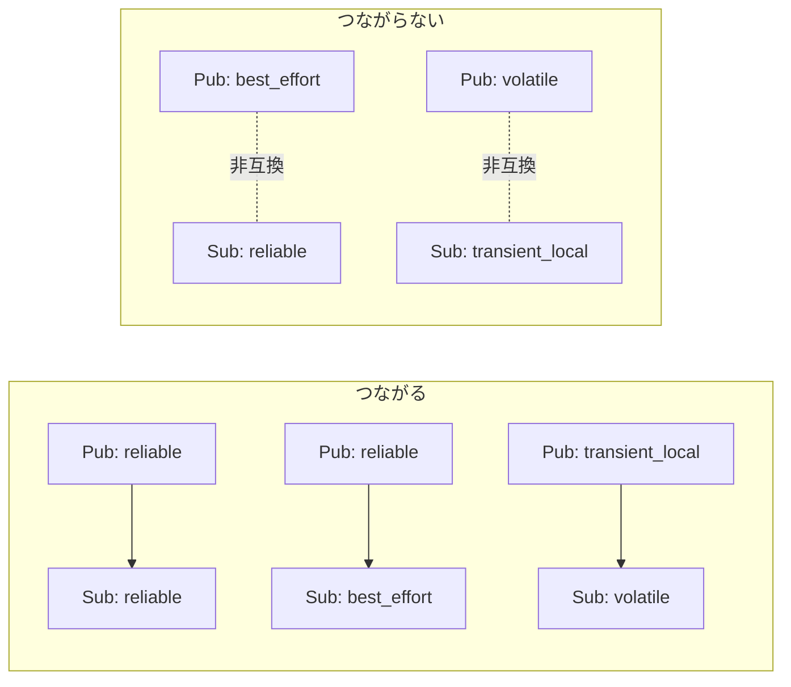

# フェーズ3-2 手順書: Twistでturtlesimを動かす・QoSの相性を体験する

`docs/learning_plan.md` フェーズ3（idea_origin.md ステップ1の1-2 ③とQoS補足）に対応する。

- 想定環境: WSL2 + Ubuntu 24.04 + ROS2 Jazzy（turtlesimはフェーズ1で導入済み）
- 前提: フェーズ3-1完了（`talker` 等が動く）
- 所要目安: 1コマ
- 言語: **Python・C++の両方**
- OSS: turtlesim（GUIの起動と目視確認はユーザーが行う）

> **進め方**: 3-1と同じく、仕様を見て自分で書き、詰まったら「サンプルコード」で答え合わせをする。サンプルはこの手順書の作成時にビルド確認済みで、ノードの実行結果は未確認（出力が違えば差分を貼ってほしい）。

## 0. 学習目標と完了条件

1. `geometry_msgs/msg/Twist` をpublishして、turtlesimを自作ノードから動かせる（フェーズ1で `ros2 topic pub` でやったことをコードで行う）。
2. 新しい依存パッケージ（`geometry_msgs`）を、`package.xml` と `CMakeLists.txt`（C++）に足す手順を理解する。
3. QoS（reliability / durability）の設定で、**つながる組み合わせとつながらない組み合わせ**を実際に確認する。
4. `ros2 topic info -v` でQoSを読み取れる。

## 1. 全体像


QoSの相性（購読側の「要求」を、配信側の「提供」が満たせるとつながる）:



## 2. 仕様

### 2-1. `turtle_circle`（Twist → turtlesim）

| 項目 | 内容 |
|---|---|
| 役割 | Publisher |
| トピック（型） | `/turtle1/cmd_vel`（`geometry_msgs/msg/Twist`） |
| 動作 | 10 Hz（0.1秒周期）で `linear.x = 2.0`、`angular.z = 1.0` を送り続ける（亀が円を描く） |
| 備考 | パラメータ化はフェーズ3-3で行うので、今は固定値でよい |

### 2-2. `qos_talker` / `qos_listener`（QoS実験用）

| ノード | 役割 | トピック（型） | 動作 |
|---|---|---|---|
| `qos_talker` | Publisher | `qos_test`（`std_msgs/msg/String`） | 1秒ごとに `msg 0`, `msg 1`, ... を送る。QoSはROSパラメータ `reliability`（`reliable` / `best_effort`）と `durability`（`volatile` / `transient_local`）で決める。既定は `reliable` と `volatile`。深さは10 |
| `qos_listener` | Subscriber | `qos_test`（`std_msgs/msg/String`） | 受信した文字列をログに出す。QoSはtalkerと同じパラメータで決める |

パラメータの与え方（コマンドライン）:

```bash
ros2 run learn_py qos_talker --ros-args -p reliability:=best_effort -p durability:=volatile
```

（パラメータの詳しい扱いはフェーズ3-3で学ぶ。ここでは「起動時に値を渡せる」ことだけ使う。）

## 3. 準備: 依存の追加（`geometry_msgs`）

`turtle_circle` は `geometry_msgs` を使うので、まず依存を足す。

**Python（`ws/src/learn_py/package.xml`）**: 既存の `<depend>` の並びに1行足す。

```xml
<depend>geometry_msgs</depend>
```

**C++（`ws/src/learn_cpp/package.xml`）**: 同じく足す。加えて `CMakeLists.txt` に `find_package(geometry_msgs REQUIRED)` を、既存の `find_package(std_msgs REQUIRED)` の隣へ足す（後のCMake追記で `ament_target_dependencies` にも書く）。

```xml
<depend>geometry_msgs</depend>
```

<!-- snippet: cmake_find_geometry -->
```cmake
find_package(geometry_msgs REQUIRED)
```

## 4. Python版（`ws/src/learn_py`）

`ws/src/learn_py/learn_py/` に `turtle_circle.py`, `qos_talker.py`, `qos_listener.py` を作る。

主なAPI（rclpy）:

| やりたいこと | API |
|---|---|
| Twist型のメッセージ | `from geometry_msgs.msg import Twist`、`msg.linear.x = 2.0`、`msg.angular.z = 1.0` |
| QoSの設定 | `from rclpy.qos import QoSProfile, ReliabilityPolicy, DurabilityPolicy`、`QoSProfile(depth=10, reliability=..., durability=...)` |
| パラメータの宣言と取得 | `self.declare_parameter('名前', 既定値)`、`self.get_parameter('名前').get_parameter_value().string_value` |

<details>
<summary>サンプルコード（答え合わせ用）</summary>

ファイル: `ws/src/learn_py/learn_py/turtle_circle.py`

<!-- file: ws/src/learn_py/learn_py/turtle_circle.py -->
```python
import rclpy
from geometry_msgs.msg import Twist
from rclpy.executors import ExternalShutdownException
from rclpy.node import Node


class TurtleCircle(Node):
    def __init__(self):
        super().__init__('turtle_circle')
        self.pub = self.create_publisher(Twist, '/turtle1/cmd_vel', 10)
        self.timer = self.create_timer(0.1, self.on_timer)

    def on_timer(self):
        msg = Twist()
        msg.linear.x = 2.0
        msg.angular.z = 1.0
        self.pub.publish(msg)


def main(args=None):
    rclpy.init(args=args)
    node = TurtleCircle()
    try:
        rclpy.spin(node)
    except (KeyboardInterrupt, ExternalShutdownException):
        pass
    finally:
        node.destroy_node()
        rclpy.try_shutdown()
```

ファイル: `ws/src/learn_py/learn_py/qos_talker.py`

<!-- file: ws/src/learn_py/learn_py/qos_talker.py -->
```python
import rclpy
from rclpy.executors import ExternalShutdownException
from rclpy.node import Node
from rclpy.qos import DurabilityPolicy, QoSProfile, ReliabilityPolicy
from std_msgs.msg import String


def make_qos(reliability, durability):
    if reliability not in ('reliable', 'best_effort'):
        raise ValueError(f'invalid reliability: {reliability}')
    if durability not in ('volatile', 'transient_local'):
        raise ValueError(f'invalid durability: {durability}')
    return QoSProfile(
        depth=10,
        reliability=(ReliabilityPolicy.RELIABLE if reliability == 'reliable'
                     else ReliabilityPolicy.BEST_EFFORT),
        durability=(DurabilityPolicy.TRANSIENT_LOCAL if durability == 'transient_local'
                    else DurabilityPolicy.VOLATILE),
    )


class QosTalker(Node):
    def __init__(self):
        super().__init__('qos_talker')
        self.declare_parameter('reliability', 'reliable')
        self.declare_parameter('durability', 'volatile')
        reliability = self.get_parameter('reliability').get_parameter_value().string_value
        durability = self.get_parameter('durability').get_parameter_value().string_value
        self.get_logger().info(f'QoS: reliability={reliability}, durability={durability}')
        self.pub = self.create_publisher(String, 'qos_test', make_qos(reliability, durability))
        self.count = 0
        self.timer = self.create_timer(1.0, self.on_timer)

    def on_timer(self):
        msg = String()
        msg.data = f'msg {self.count}'
        self.pub.publish(msg)
        self.get_logger().info(f'publish: {msg.data}')
        self.count += 1


def main(args=None):
    rclpy.init(args=args)
    node = QosTalker()
    try:
        rclpy.spin(node)
    except (KeyboardInterrupt, ExternalShutdownException):
        pass
    finally:
        node.destroy_node()
        rclpy.try_shutdown()
```

ファイル: `ws/src/learn_py/learn_py/qos_listener.py`

<!-- file: ws/src/learn_py/learn_py/qos_listener.py -->
```python
import rclpy
from rclpy.executors import ExternalShutdownException
from rclpy.node import Node
from rclpy.qos import DurabilityPolicy, QoSProfile, ReliabilityPolicy
from std_msgs.msg import String


def make_qos(reliability, durability):
    if reliability not in ('reliable', 'best_effort'):
        raise ValueError(f'invalid reliability: {reliability}')
    if durability not in ('volatile', 'transient_local'):
        raise ValueError(f'invalid durability: {durability}')
    return QoSProfile(
        depth=10,
        reliability=(ReliabilityPolicy.RELIABLE if reliability == 'reliable'
                     else ReliabilityPolicy.BEST_EFFORT),
        durability=(DurabilityPolicy.TRANSIENT_LOCAL if durability == 'transient_local'
                    else DurabilityPolicy.VOLATILE),
    )


class QosListener(Node):
    def __init__(self):
        super().__init__('qos_listener')
        self.declare_parameter('reliability', 'reliable')
        self.declare_parameter('durability', 'volatile')
        reliability = self.get_parameter('reliability').get_parameter_value().string_value
        durability = self.get_parameter('durability').get_parameter_value().string_value
        self.get_logger().info(f'QoS: reliability={reliability}, durability={durability}')
        self.sub = self.create_subscription(
            String, 'qos_test', self.on_message, make_qos(reliability, durability))

    def on_message(self, msg):
        self.get_logger().info(f'received: {msg.data}')


def main(args=None):
    rclpy.init(args=args)
    node = QosListener()
    try:
        rclpy.spin(node)
    except (KeyboardInterrupt, ExternalShutdownException):
        pass
    finally:
        node.destroy_node()
        rclpy.try_shutdown()
```

</details>

`setup.py` の `entry_points` に3行を足し（前節までの行は残す）、再ビルドする。

<!-- snippet: py_entry_points_qos -->
```python
            'turtle_circle = learn_py.turtle_circle:main',
            'qos_talker = learn_py.qos_talker:main',
            'qos_listener = learn_py.qos_listener:main',
```

```bash
cd ~/work/ros2MinimalPhysicalAi/ws
colcon build --symlink-install --packages-select learn_py
source install/setup.bash
```

## 5. C++版（`ws/src/learn_cpp`）

`ws/src/learn_cpp/src/` に `turtle_circle.cpp`, `qos_talker.cpp`, `qos_listener.cpp` を作る。

主なAPI（rclcpp）:

| やりたいこと | API |
|---|---|
| Twist型のメッセージ | `#include "geometry_msgs/msg/twist.hpp"`、`msg.linear.x = 2.0;`、`msg.angular.z = 1.0;` |
| QoSの設定 | `rclcpp::QoS qos(10); qos.reliable(); qos.best_effort(); qos.transient_local(); qos.durability_volatile();` |
| パラメータの宣言と取得 | `declare_parameter<std::string>("名前", "既定値")`（宣言と同時に値が返る） |

<details>
<summary>サンプルコード（答え合わせ用）</summary>

ファイル: `ws/src/learn_cpp/src/turtle_circle.cpp`

<!-- file: ws/src/learn_cpp/src/turtle_circle.cpp -->
```cpp
#include <chrono>
#include <memory>

#include "geometry_msgs/msg/twist.hpp"
#include "rclcpp/rclcpp.hpp"

using namespace std::chrono_literals;

class TurtleCircle : public rclcpp::Node
{
public:
  TurtleCircle() : Node("turtle_circle")
  {
    pub_ = create_publisher<geometry_msgs::msg::Twist>("/turtle1/cmd_vel", 10);
    timer_ = create_wall_timer(100ms, [this]() { on_timer(); });
  }

private:
  void on_timer()
  {
    geometry_msgs::msg::Twist msg;
    msg.linear.x = 2.0;
    msg.angular.z = 1.0;
    pub_->publish(msg);
  }

  rclcpp::Publisher<geometry_msgs::msg::Twist>::SharedPtr pub_;
  rclcpp::TimerBase::SharedPtr timer_;
};

int main(int argc, char ** argv)
{
  rclcpp::init(argc, argv);
  rclcpp::spin(std::make_shared<TurtleCircle>());
  rclcpp::shutdown();
  return 0;
}
```

ファイル: `ws/src/learn_cpp/src/qos_talker.cpp`

<!-- file: ws/src/learn_cpp/src/qos_talker.cpp -->
```cpp
#include <chrono>
#include <memory>
#include <stdexcept>
#include <string>

#include "rclcpp/rclcpp.hpp"
#include "std_msgs/msg/string.hpp"

using namespace std::chrono_literals;

static rclcpp::QoS make_qos(const std::string & reliability, const std::string & durability)
{
  if (reliability != "reliable" && reliability != "best_effort") {
    throw std::invalid_argument("invalid reliability: " + reliability);
  }
  if (durability != "volatile" && durability != "transient_local") {
    throw std::invalid_argument("invalid durability: " + durability);
  }
  rclcpp::QoS qos(10);
  if (reliability == "best_effort") {
    qos.best_effort();
  } else {
    qos.reliable();
  }
  if (durability == "transient_local") {
    qos.transient_local();
  } else {
    qos.durability_volatile();
  }
  return qos;
}

class QosTalker : public rclcpp::Node
{
public:
  QosTalker() : Node("qos_talker")
  {
    const auto reliability = declare_parameter<std::string>("reliability", "reliable");
    const auto durability = declare_parameter<std::string>("durability", "volatile");
    RCLCPP_INFO(
      get_logger(), "QoS: reliability=%s, durability=%s",
      reliability.c_str(), durability.c_str());
    pub_ = create_publisher<std_msgs::msg::String>("qos_test", make_qos(reliability, durability));
    timer_ = create_wall_timer(1s, [this]() { on_timer(); });
  }

private:
  void on_timer()
  {
    std_msgs::msg::String msg;
    msg.data = "msg " + std::to_string(count_++);
    pub_->publish(msg);
    RCLCPP_INFO(get_logger(), "publish: %s", msg.data.c_str());
  }

  rclcpp::Publisher<std_msgs::msg::String>::SharedPtr pub_;
  rclcpp::TimerBase::SharedPtr timer_;
  int count_ = 0;
};

int main(int argc, char ** argv)
{
  rclcpp::init(argc, argv);
  rclcpp::spin(std::make_shared<QosTalker>());
  rclcpp::shutdown();
  return 0;
}
```

ファイル: `ws/src/learn_cpp/src/qos_listener.cpp`

<!-- file: ws/src/learn_cpp/src/qos_listener.cpp -->
```cpp
#include <memory>
#include <stdexcept>
#include <string>

#include "rclcpp/rclcpp.hpp"
#include "std_msgs/msg/string.hpp"

static rclcpp::QoS make_qos(const std::string & reliability, const std::string & durability)
{
  if (reliability != "reliable" && reliability != "best_effort") {
    throw std::invalid_argument("invalid reliability: " + reliability);
  }
  if (durability != "volatile" && durability != "transient_local") {
    throw std::invalid_argument("invalid durability: " + durability);
  }
  rclcpp::QoS qos(10);
  if (reliability == "best_effort") {
    qos.best_effort();
  } else {
    qos.reliable();
  }
  if (durability == "transient_local") {
    qos.transient_local();
  } else {
    qos.durability_volatile();
  }
  return qos;
}

class QosListener : public rclcpp::Node
{
public:
  QosListener() : Node("qos_listener")
  {
    const auto reliability = declare_parameter<std::string>("reliability", "reliable");
    const auto durability = declare_parameter<std::string>("durability", "volatile");
    RCLCPP_INFO(
      get_logger(), "QoS: reliability=%s, durability=%s",
      reliability.c_str(), durability.c_str());
    sub_ = create_subscription<std_msgs::msg::String>(
      "qos_test", make_qos(reliability, durability),
      [this](const std_msgs::msg::String & msg) {
        RCLCPP_INFO(get_logger(), "received: %s", msg.data.c_str());
      });
  }

private:
  rclcpp::Subscription<std_msgs::msg::String>::SharedPtr sub_;
};

int main(int argc, char ** argv)
{
  rclcpp::init(argc, argv);
  rclcpp::spin(std::make_shared<QosListener>());
  rclcpp::shutdown();
  return 0;
}
```

</details>

`CMakeLists.txt` に追記し、`install(TARGETS ...)` へ名前を足す（前節の分は残す）。

<!-- snippet: cmake_qos -->
```cmake
add_executable(turtle_circle src/turtle_circle.cpp)
ament_target_dependencies(turtle_circle rclcpp geometry_msgs)

add_executable(qos_talker src/qos_talker.cpp)
ament_target_dependencies(qos_talker rclcpp std_msgs)

add_executable(qos_listener src/qos_listener.cpp)
ament_target_dependencies(qos_listener rclcpp std_msgs)

install(TARGETS
  hello
  talker
  listener
  sine_pub
  sine_sub
  turtle_circle
  qos_talker
  qos_listener
  DESTINATION lib/${PROJECT_NAME})
```

```bash
cd ~/work/ros2MinimalPhysicalAi/ws
colcon build --symlink-install --packages-select learn_cpp
source install/setup.bash
```

## 6. 実験

### 6-1. Twistでturtlesimを動かす

ターミナルを2つ使う（GUIの起動と目視はユーザー）。

```bash
# T1
ros2 run turtlesim turtlesim_node
# T2（Python版かC++版のどちらか）
ros2 run learn_py turtle_circle
ros2 run learn_cpp turtle_circle
```

> 課題1: Python版とC++版の `turtle_circle` を、それぞれ動かして亀の動きが同じになることを確認する。
>
> 課題2: 円の半径は `linear.x / angular.z` になる。値を変えて（例: `linear.x = 1.0`）、半径が変わることを確認する。
>
> 課題3（発展）: `/turtle1/pose`（`turtlesim/msg/Pose`）を購読するノードを作り、位置をログに出す。`turtlesim` への依存を `package.xml` に足す必要がある。

### 6-2. QoSの相性を確認する

以下、`ros2 run learn_py qos_talker` / `qos_listener`（C++版でも同様）で、パラメータを変えて起動する。表の各行を試す。

**reliability の組み合わせ**

| 試すこと | qos_talker | qos_listener | 期待 |
|---|---|---|---|
| ① | `reliable` | `reliable` | つながる |
| ② | `reliable` | `best_effort` | つながる |
| ③ | `best_effort` | `best_effort` | つながる |
| ④ | `best_effort` | `reliable` | **つながらない**（受信側に非互換の警告が出る） |

例（④）:

```bash
# T1
ros2 run learn_py qos_talker --ros-args -p reliability:=best_effort
# T2
ros2 run learn_py qos_listener --ros-args -p reliability:=reliable
```

**durability の組み合わせ**

| 試すこと | qos_talker | qos_listener | 期待 |
|---|---|---|---|
| ⑤ | `transient_local` | `transient_local` | つながり、**後から起動した**listenerにも過去のメッセージ（深さ10まで）が届く |
| ⑥ | `transient_local` | `volatile` | つながる（過去分は届かない） |
| ⑦ | `volatile` | `transient_local` | **つながらない** |

⑤は、talkerを先に起動して5秒ほど待ってから、listenerを起動する。listenerを起動した直後に、それまでのメッセージが一気に届くことを確認する。

確認コマンド:

```bash
ros2 topic info /qos_test -v
```

Publisher・SubscriptionそれぞれのQoS（`Reliability`、`Durability`）が表示される。**つながらない場合は、この2つを見比べて、どちらが食い違っているかを読み取る**。

> 課題4: 表の①〜⑦をすべて試し、期待と実際の結果を記録表に書く。警告の文言（非互換のポリシー名が出ること）を控える。
>
> 課題5: Python版のtalker × C++版のlistener（およびその逆）でも、④と⑦が同じ結果になることを確認する。QoSの扱いが言語に依存しないことを確認する。

### 6-3. 実務への手がかり

センサデータは「多少欠けても最新が大事」なので、`best_effort` にすることが多い。ROS2には、そのための定義済み設定がある。

- Python: `from rclpy.qos import qos_profile_sensor_data`
- C++: `rclcpp::SensorDataQoS()`

フェーズ5の車両シミュレーションで、速度（センサ相当）と制御指令のトピックにどのQoSを使うか、考える材料になる。

## 7. 記録用の表

| 試すこと | 期待 | 実際（言語の組み合わせ） | 警告の文言・気づき |
|---|---|---|---|
| ① reliable / reliable | つながる | | |
| ② reliable / best_effort | つながる | | |
| ③ best_effort / best_effort | つながる | | |
| ④ best_effort / reliable | つながらない | | |
| ⑤ transient_local / transient_local | 過去分も届く | | |
| ⑥ transient_local / volatile | つながる | | |
| ⑦ volatile / transient_local | つながらない | | |

## 8. つまずきやすい点

| 症状 | 確認すること |
|---|---|
| 亀が動かない | turtlesimが起動しているか。`ros2 topic info /turtle1/cmd_vel` でSubscriberが1つあるか。トピック名の先頭 `/` |
| C++でビルドエラー（`geometry_msgs` が見つからない） | `package.xml` の `<depend>`、`CMakeLists.txt` の `find_package(geometry_msgs REQUIRED)` と `ament_target_dependencies` |
| `ValueError: invalid reliability` | パラメータの綴り。`reliable` か `best_effort`（小文字） |
| ⑤で過去分が届かない | talkerが `transient_local` か、listener側も `transient_local` か。talkerを先に起動して待ったか |
| 非互換の警告が出ない | 警告はノードのログ（ターミナル）に出る。`rqt_console` でも確認できる |

## 9. 次へ

フェーズ3-3（`docs/phase3_3_parameters.md`）で、パラメータを本格的に扱う。ここで使った `-p` の指定と、YAMLでの指定を学ぶ。

## 10. 公式ドキュメント・参考資料

確認状況（2026-09-20）: 下記は `docs/idea_origin.md` に掲載済みのURLで、今回は再確認していない（docs.ros.orgは本文取得がボット対策で拒否される）。

### 公式（ROS 2 Jazzy）

- [Quality of Service settings — Jazzy](https://docs.ros.org/en/jazzy/Concepts/Intermediate/About-Quality-of-Service-Settings.html)（互換性の一覧表がある）
- [Class QoS — rclcpp Jazzy](https://docs.ros.org/en/jazzy/p/rclcpp/generated/classrclcpp_1_1QoS.html)
- [geometry_msgs — Jazzy](https://docs.ros.org/en/jazzy/p/geometry_msgs/)
- [Using turtlesim, ros2, and rqt — Jazzy](https://docs.ros.org/en/jazzy/Tutorials/Beginner-CLI-Tools/Introducing-Turtlesim/Introducing-Turtlesim.html)

> 公式ドキュメントと食い違う場合は、公式を優先する。

> 出典: 各サンプルのAPIの使い方は、上記の公式チュートリアルを参考にした（ROS 2ドキュメントはCC BY 4.0）。ノード名・仕様・コード・文章は独自に書いたもので、逐語の転載ではない。
