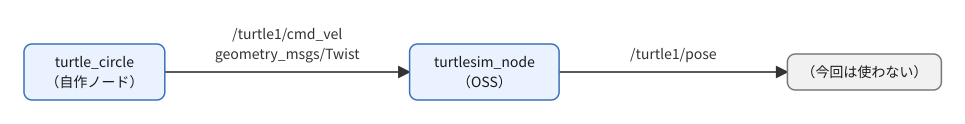
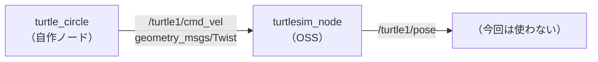

# フェーズ3-2a 手順書: Twistでturtlesimを動かす

`docs/learning_plan.md` フェーズ3（idea_origin.md ステップ1の1-2 ③）に対応する。

- 想定環境: WSL2 + Ubuntu 24.04 + ROS2 Jazzy（turtlesimはフェーズ1で導入済み）
- 前提: フェーズ3-1完了（`talker` 等が動く）
- 所要目安: 半コマ
- 言語: **Python**（C++版は任意）
- OSS: turtlesim（GUIのウィンドウが開く）

> **このフェーズの位置づけ**: フェーズ3-2は、互いに独立した2つのテーマに分けている。この3-2aでは、速度指令 `Twist` を送って相手（turtlesim）を動かす `turtle_circle` を作る。フェーズ5の車両シミュレーションで直接使う内容なので、Python版は必須。もう1つのテーマ（QoSの相性）は `docs/phase3_2b_qos.md`（フェーズ3-2b）で扱う。C++版（5節）は任意とする。
>
> **進め方**: 3-1と同じく、2節の仕様は「何を作るか」の定義で、APIの使い方までは書いていない。3節・4節冒頭の「主なAPI」表とサンプルコード・解説を読んで理解し、送る値を変えて動かしながら体で覚える。サンプルはこの手順書の作成時にビルド確認済みで、ノードの実行結果は未確認（出力が違う場合は、実機の表示を優先する）。

> **実行環境が無くても読めるように**: 実行する手順の直後には「期待する結果」として、表示される内容や画面の様子とその読み方を載せている。コードとROS2の仕様から筆者が想定したもので、実機では時刻などの細部が異なる。

## 0. 学習目標と完了条件

必須:

1. `geometry_msgs/msg/Twist` をpublishして、turtlesimを自作ノードから動かせる（フェーズ1で `ros2 topic pub` でやったことをコードで行う。Python版）。
2. 新しい依存パッケージ（`geometry_msgs`）を `package.xml` に足す手順を理解する。

任意（発展。余力があれば）:

3. C++版を書き、`CMakeLists.txt` にも依存を足す手順を理解する。

## 1. 全体像



<details>
<summary>同じ図（mermaid版）</summary>



</details>

## 2. 仕様: `turtle_circle`（Twist → turtlesim）

| 項目 | 内容 |
|---|---|
| 役割 | Publisher |
| トピック（型） | `/turtle1/cmd_vel`（`geometry_msgs/msg/Twist`） |
| 動作 | 10 Hz（0.1秒周期）で `linear.x = 2.0`、`angular.z = 1.0` を送り続ける（亀が円を描く） |
| 備考 | パラメータ化はフェーズ3-3で行うので、今は固定値でよい |

## 3. 準備: 依存の追加（`geometry_msgs`）

`turtle_circle` は `geometry_msgs` を使うので、まず依存を足す。

**Python（`ws/src/learn_py/package.xml`）**: 既存の `<depend>` の並びに1行足す。

```xml
<depend>geometry_msgs</depend>
```

**C++（`ws/src/learn_cpp/package.xml`）**（C++版を作る場合のみ）: 同じく足す。加えて `CMakeLists.txt` に `find_package(geometry_msgs REQUIRED)` を、既存の `find_package(std_msgs REQUIRED)` の隣へ足す（5節の終わりのCMake追記で、`ament_target_dependencies` にも書く）。

```xml
<depend>geometry_msgs</depend>
```

<!-- snippet: cmake_find_geometry -->
```cmake
find_package(geometry_msgs REQUIRED)
```

`package.xml` の `<depend>` は「このパッケージは `geometry_msgs` に依存する」という宣言で、`colcon` が依存関係からビルド順を決めたり、`rosdep` が不足を検出したりするために使う。`<depend>` はビルド時・実行時の両方の依存をまとめて宣言する書き方。一方 `CMakeLists.txt` の `find_package` は、C++のビルド時にヘッダやライブラリの場所を探す指示。C++では**両方**必要で、片方だけだとビルドエラーになる（7節）。Pythonは `package.xml` だけでよい。

## 4. Python版（`ws/src/learn_py`）

`ws/src/learn_py/learn_py/` に `turtle_circle.py` を作る。

主なAPI（rclpy）:

| やりたいこと | API |
|---|---|
| Twist型のメッセージ | `from geometry_msgs.msg import Twist`、`msg.linear.x = 2.0`、`msg.angular.z = 1.0` |

### サンプルコードと解説

ファイル: `ws/src/learn_py/learn_py/turtle_circle.py`

<!-- file: ws/src/learn_py/learn_py/turtle_circle.py -->
```python
import rclpy
from geometry_msgs.msg import Twist
from rclpy.executors import ExternalShutdownException
from rclpy.node import Node


# 一定の速度指令（Twist）を 10 Hz で送り続け、turtlesim の亀に円を描かせるノード。
class TurtleCircle(Node):
    # /turtle1/cmd_vel への Publisher と 0.1秒周期のタイマーを作る。
    def __init__(self):
        super().__init__('turtle_circle')
        self.pub = self.create_publisher(Twist, '/turtle1/cmd_vel', 10)
        self.timer = self.create_timer(0.1, self.on_timer)

    # 前進 2.0・旋回 1.0 の速度指令を1回送る。
    def on_timer(self):
        msg = Twist()
        msg.linear.x = 2.0
        msg.angular.z = 1.0
        self.pub.publish(msg)


# エントリポイント（setup.py の entry_points から呼ばれる）。
# ノードを作って spin で回し、Ctrl+C で後片付けして終わる。
def main(args=None):
    rclpy.init(args=args)
    node = TurtleCircle()
    try:
        rclpy.spin(node)
    except (KeyboardInterrupt, ExternalShutdownException):
        pass
    finally:
        node.destroy_node()
        rclpy.try_shutdown()
```

**`turtle_circle.py` の解説**

役割は「一定の速度指令を10 Hzで送り続ける Publisher」。フェーズ1で `ros2 topic pub -r 10 ...` と手で打っていたことを、ノードにしたものにあたる。流れは「ノードを作る → Publisherとタイマーを用意する → タイマーが鳴るたびにTwistを作って送る」。

- `import` 部: `Twist` は `geometry_msgs` パッケージのメッセージ型。だから `package.xml` に `geometry_msgs` の依存が要る（3節）。`ExternalShutdownException` は終了処理で使う（この解説の最後から2つ目の項「`main` 内の流れ」で説明する）。
- `super().__init__('turtle_circle')`: 親クラス `Node` を、ノード名 `turtle_circle` で初期化する。これを呼ばないと、以降の `create_*` 系が使えない。
- `create_publisher(Twist, '/turtle1/cmd_vel', 10)`: 引数は「メッセージ型・トピック名・QoS」。QoSに整数を渡すと「深さ（キューに溜める件数）が10で、他は既定値（reliable・volatile）」の意味になる（QoSの中身はフェーズ3-2bで扱う）。先頭の `/` を付けると絶対名になり、名前空間に左右されない。turtlesimの購読トピックは `/turtle1/cmd_vel` なので、綴りが違うと亀は動かず、エラーも出ない。
- `create_timer(0.1, self.on_timer)`: 0.1秒（=10 Hz）ごとに `on_timer` を呼ぶ。第1引数の単位は**秒**。`self.timer` に保持しているのは、後から止めたり周期を変えたりできるようにするため（Pythonではノードも内部で保持するので、必須ではない）。
- `on_timer`: `Twist()` は全フィールドが0で作られる。`Twist` は `linear`（並進速度 x, y, z、単位 m/s）と `angular`（回転速度 x, y, z、単位 rad/s）の2つのベクトルを持つ。turtlesimは2次元なので、使うのは `linear.x`（前進）と `angular.z`（旋回）だけ。前進2.0と旋回1.0を同時に出し続けるので、亀は半径 `2.0 / 1.0 = 2.0` の円を描く（6節の課題2で、値を変えて半径が変わることを確かめる）。
- `main` 内の流れ: `rclpy.init` → ノード生成 → `rclpy.spin`（コールバックを処理し続けて、ここで待つ）→ 終了時に後始末。`Ctrl+C` は `KeyboardInterrupt`、外部からのシャットダウンは `ExternalShutdownException` になるので、どちらも握りつぶして正常終了させる。`finally` の `destroy_node()` と `rclpy.try_shutdown()` は、途中で例外が出ても必ず実行したい後始末。`try_shutdown` は「すでにシャットダウン済みでもエラーにならない」版。
- `main(args=None)` という形は、`setup.py` の `'turtle_circle = learn_py.turtle_circle:main'` がこの関数を呼ぶため。ファイル末尾に `if __name__ == '__main__':` は不要（`ros2 run` は `entry_points` から生成されたスクリプト経由で `main` を呼ぶ）。

観察ポイント: turtlesimを先に起動しておき、`ros2 topic echo /turtle1/cmd_vel` で `linear.x: 2.0`、`angular.z: 1.0` が流れていることを見る。亀が動かないときは、まずecho側に値が出ているかで「送れていない」のか「届いていない」のかを切り分ける。

`setup.py` の `entry_points` に1行を足し（前節までの行は残す）、再ビルドする。

<!-- snippet: py_entry_points_turtle -->
```python
            'turtle_circle = learn_py.turtle_circle:main',
```

`'実行ファイル名 = パッケージ.モジュール:関数'` の形式で、`ros2 run learn_py turtle_circle` の `turtle_circle` が左辺、呼ばれる関数が右辺の `main`。前節でも触れたとおり、`entry_points` を変えたときは `--symlink-install` でも再ビルドが必要。カンマの付け忘れや、リストの外へ書いてしまうミスに注意する。

```bash
cd ~/work/ros2MinimalPhysicalAi/ws
colcon build --symlink-install --packages-select learn_py
source install/setup.bash
```

期待する結果: フェーズ3-1と同じく、`Finished <<< learn_py` と `Summary: 1 package finished` が出れば成功。`ros2 pkg executables learn_py` を実行すると、今回足した `learn_py turtle_circle` の行が、既存の実行ファイルと一緒に並ぶ。

## 5. C++版（`ws/src/learn_cpp`）

> **このフェーズのC++版は任意（発展）**。フェーズ5の車両シミュレーションはPythonで実装すると決めているため、ここでC++版を作らなくても先へ進める。Python版との違いは、下の `turtle_circle.cpp` の解説に書いてあるので、読むだけでも概要が掴める。C++版を作らない場合は、C++向けの依存の追加（`package.xml` と `CMakeLists.txt`）も不要。

`ws/src/learn_cpp/src/` に `turtle_circle.cpp` を作る。

主なAPI（rclcpp）:

| やりたいこと | API |
|---|---|
| Twist型のメッセージ | `#include "geometry_msgs/msg/twist.hpp"`、`msg.linear.x = 2.0;`、`msg.angular.z = 1.0;` |

### サンプルコードと解説

ファイル: `ws/src/learn_cpp/src/turtle_circle.cpp`

<!-- file: ws/src/learn_cpp/src/turtle_circle.cpp -->
```cpp
#include <chrono>
#include <memory>

#include "geometry_msgs/msg/twist.hpp"
#include "rclcpp/rclcpp.hpp"

using namespace std::chrono_literals;

// 一定の速度指令（Twist）を 10 Hz で送り、turtlesim の亀に円を描かせるノード。
class TurtleCircle : public rclcpp::Node
{
public:
  // コンストラクタ: /turtle1/cmd_vel への Publisher と 100ms 周期のタイマーを作る。
  TurtleCircle() : Node("turtle_circle")
  {
    pub_ = create_publisher<geometry_msgs::msg::Twist>("/turtle1/cmd_vel", 10);
    timer_ = create_wall_timer(100ms, [this]() { on_timer(); });
  }

private:
  // 前進 2.0・旋回 1.0 の速度指令を1回送る。
  void on_timer()
  {
    geometry_msgs::msg::Twist msg;
    msg.linear.x = 2.0;
    msg.angular.z = 1.0;
    pub_->publish(msg);
  }

  rclcpp::Publisher<geometry_msgs::msg::Twist>::SharedPtr pub_;
  rclcpp::TimerBase::SharedPtr timer_;
};

// エントリポイント。ノードを作って spin で回し、Ctrl+C で spin を抜けて終わる。
int main(int argc, char ** argv)
{
  rclcpp::init(argc, argv);
  rclcpp::spin(std::make_shared<TurtleCircle>());
  rclcpp::shutdown();
  return 0;
}
```

**`turtle_circle.cpp` の解説**

Python版と同じ「10 Hzで `linear.x=2.0`、`angular.z=1.0` を送る」Publisherを、C++で書いたもの。Twistの各フィールドの意味や、亀が半径2の円を描く理由は Python版の解説を参照。ここでは言語固有の点を中心に書く。

- `#include "geometry_msgs/msg/twist.hpp"`: メッセージ型は「パッケージ名/msg/型名（小文字・スネークケース）.hpp」のヘッダで取り込む。型名の側は `geometry_msgs::msg::Twist`（名前空間で区切る）。
- `using namespace std::chrono_literals;`: `100ms` や `1s` のような時間リテラルを使えるようにする。Pythonの `0.1`（秒）に対応する部分で、こちらは単位が型に入るので取り違えにくい。
- `class TurtleCircle : public rclcpp::Node`: Pythonの `class TurtleCircle(Node)` にあたる継承。`Node("turtle_circle")` を初期化子リストで呼んで、ノード名を渡す。
- `create_publisher<geometry_msgs::msg::Twist>("/turtle1/cmd_vel", 10)`: 型はテンプレート引数で指定し、引数は「トピック名・QoS」。`10` は `rclcpp::QoS` に暗黙変換され、深さ10・他は既定値になる。
- `create_wall_timer(100ms, [this]() { on_timer(); })`: 周期とコールバックを渡す。`wall` は「実時間（壁時計）で動くタイマー」の意味。コールバックはラムダ式で、`[this]` はメンバ関数を呼ぶためにオブジェクト自身を取り込む指定。同じことは `std::bind(&TurtleCircle::on_timer, this)` でも書けるが、ラムダのほうが読みやすいので本手順書はラムダに統一している。
- `geometry_msgs::msg::Twist msg;`: 各フィールドは0で初期化されているので、使う2つだけ代入すればよい。`pub_->publish(msg)` の `->` は、Publisherが `shared_ptr` で返ってくるため。
- メンバ変数の `pub_`・`timer_` は `SharedPtr`（`std::shared_ptr` の別名）。ノードが持ち続けている間だけ、Publisherとタイマーが生きる。ローカル変数に受けて関数を抜けると破棄され、タイマーが鳴らなくなる。
- `main`: `rclcpp::init` → `std::make_shared<TurtleCircle>()` でノードを共有ポインタとして作る → `rclcpp::spin`（Ctrl+Cまで戻らない）→ `rclcpp::shutdown`。Python版のような `try/finally` は不要で、`Ctrl+C` はrclcppが受けて `spin` から抜けさせる。ノードは `shared_ptr` なので、`main` を抜けるときに自動で解放される。

つまずき: `CMakeLists.txt` の `ament_target_dependencies` に `geometry_msgs` を書き忘れると、`geometry_msgs/msg/twist.hpp` が見つからないビルドエラーになる。

`CMakeLists.txt` に追記し、`install(TARGETS ...)` へ `turtle_circle` を足す（前節の分は残す）。

<!-- snippet: cmake_turtle -->
```cmake
add_executable(turtle_circle src/turtle_circle.cpp)
ament_target_dependencies(turtle_circle rclcpp geometry_msgs)

install(TARGETS
  hello
  talker
  listener
  sine_pub
  sine_sub
  turtle_circle
  DESTINATION lib/${PROJECT_NAME})
```

- `add_executable(実行ファイル名 ソース)`: ソースから実行ファイルをビルドする指定。Pythonの `entry_points` にあたる。
- `ament_target_dependencies(ターゲット 依存...)`: そのターゲットが使うパッケージ（ヘッダ・ライブラリ）を、ターゲットごとに列挙する。`turtle_circle` は `Twist` を使うので `geometry_msgs`、それと `rclcpp` が必要。ここに書き漏らすと、`find_package` があってもそのターゲットのビルドが通らない。
- `install(TARGETS ... DESTINATION lib/${PROJECT_NAME})`: ビルドした実行ファイルを `install/learn_cpp/lib/learn_cpp/` へ置く。`ros2 run learn_cpp ...` はこの場所を探すので、ここに名前がないと `No executable found` になる。既存の名前（`hello` 〜 `sine_sub`）は消さずに残し、`turtle_circle` を足す。

```bash
cd ~/work/ros2MinimalPhysicalAi/ws
colcon build --symlink-install --packages-select learn_cpp
source install/setup.bash
```

期待する結果: `Finished <<< learn_cpp` と `Summary: 1 package finished` が出れば成功。`find_package(geometry_msgs REQUIRED)` を書き忘れていると、ここで `Failed <<< learn_cpp` になり、その上に `geometry_msgs` が見つからないという趣旨のCMakeのエラーが出る（7節）。

## 6. 実験: Twistでturtlesimを動かす

ターミナルを2つ使う。

```bash
# T1
ros2 run turtlesim turtlesim_node
# T2（Python版。C++版を作った場合は、下の行でもよい）
ros2 run learn_py turtle_circle
ros2 run learn_cpp turtle_circle
```

期待する結果:

- `turtle_circle` はログを出さないので、T2には何も表示されない。変化はturtlesimのウィンドウに現れる。
- 亀は画面の中央から右向きに動き出し、左回り（反時計回り）に円を描き続ける。半径は `linear.x / angular.z = 2.0 / 1.0 = 2`（画面の一辺は約11）で、1周にかかる時間は `2π / angular.z` ≒ 6.3秒。通った跡に白い円が残る。
- T2を `Ctrl+C` で止めると、指令が途切れて約1秒後に亀が止まる。
- Python版とC++版で、亀の動きに違いは無い。

> 課題1（C++版を作った場合）: Python版とC++版の `turtle_circle` を、それぞれ動かして亀の動きが同じになることを確認する。
>
> 課題2: 円の半径は `linear.x / angular.z` になる。値を変えて（例: `linear.x = 1.0`）、半径が変わることを確認する。
>
> 課題3（発展）: `/turtle1/pose`（`turtlesim/msg/Pose`）を購読するノードを作り、位置をログに出す。`turtlesim` への依存を `package.xml` に足す必要がある。

## 7. つまずきやすい点

| 症状 | 確認すること |
|---|---|
| 亀が動かない | turtlesimが起動しているか。`ros2 topic info /turtle1/cmd_vel` でSubscriberが1つあるか。トピック名の先頭 `/` |
| C++でビルドエラー（`geometry_msgs` が見つからない） | `package.xml` の `<depend>`、`CMakeLists.txt` の `find_package(geometry_msgs REQUIRED)` と `ament_target_dependencies` |

## 8. 次へ

フェーズ3-2b（`docs/phase3_2b_qos.md`）で、QoSの相性を体験する。3-2aとは独立したテーマで、ここで作った `turtle_circle` は使わない。

## 9. 公式ドキュメント・参考資料

確認状況（2026-09-20）: 下記は `docs/idea_origin.md` に掲載済みのURLで、今回は再確認していない（docs.ros.orgは本文取得がボット対策で拒否される）。

### 公式（ROS 2 Jazzy）

- [geometry_msgs — Jazzy](https://docs.ros.org/en/jazzy/p/geometry_msgs/)
- [Using turtlesim, ros2, and rqt — Jazzy](https://docs.ros.org/en/jazzy/Tutorials/Beginner-CLI-Tools/Introducing-Turtlesim/Introducing-Turtlesim.html)

> 公式ドキュメントと食い違う場合は、公式を優先する。

> 出典: 各サンプルのAPIの使い方は、上記の公式チュートリアルを参考にした（ROS 2ドキュメントはCC BY 4.0）。ノード名・仕様・コード・文章は独自に書いたもので、逐語の転載ではない。
