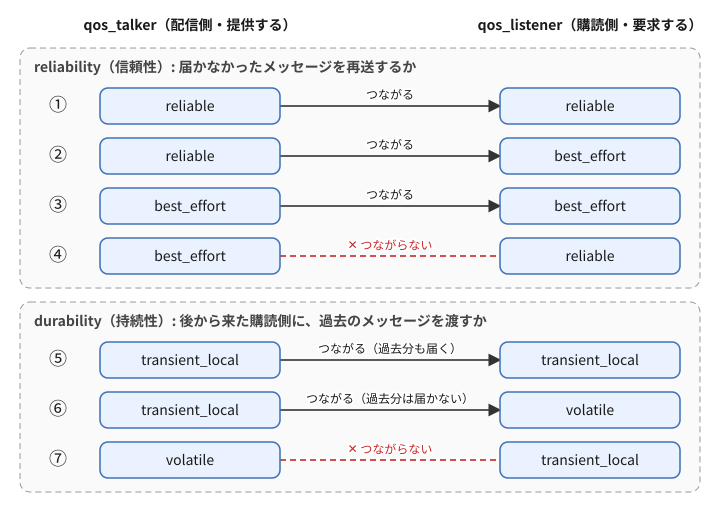
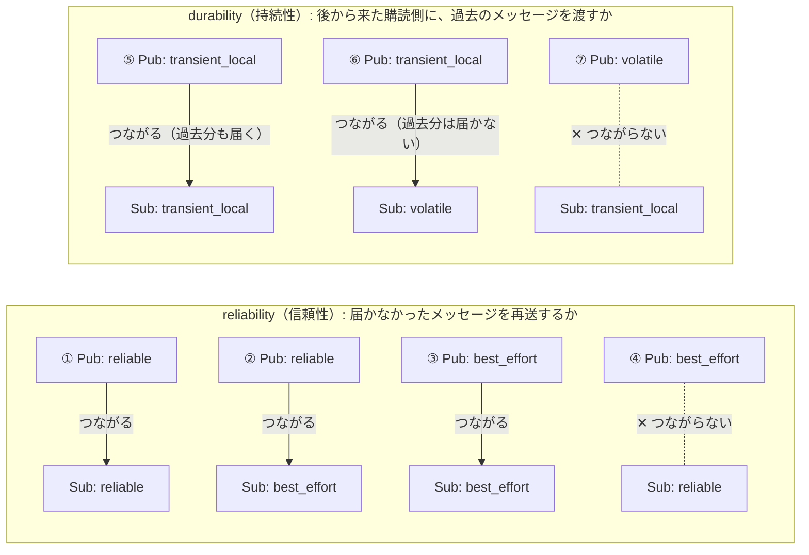

# フェーズ3-2b 手順書: QoSの相性を体験する

[`docs/learning_plan.md`](learning_plan.md) フェーズ3（idea_origin.md ステップ1のQoS補足）に対応する。

- 想定環境: WSL2 + Ubuntu 24.04 + ROS2 Jazzy
- 前提: フェーズ3-1完了（`talker` 等が動く）。フェーズ3-2a（Twistでturtlesimを動かす）とは独立したテーマで、3-2aで作ったものは使わない
- 所要目安: 半コマ
- 言語: **Python**（C++版は任意）
- OSS: なし

> **このフェーズの位置づけ**: 「QoSという設定があり、合わないと**エラーも出ずに黙ってつながらない**ことがある」と知るのが目的で、概要を掴む程度でよい（フェーズ5では、全ノードが既定のQoSのまま通信する）。2-2節の7通りの組み合わせのうち、①（talker・listenerとも `reliable`。つながる）と④（talkerが `best_effort`、listenerが `reliable`。つながらない）の2つを試せば十分で、残りは任意。C++版（4節）も任意とする。
>
> **進め方**: 3-1と同じく、2節の仕様は「何を作るか」の定義で、APIの使い方までは書いていない。3節・4節冒頭の「主なAPI」表（C++版の4節は任意）とサンプルコード・解説を読んで理解し、QoSのパラメータを変えて動かしながら体で覚える。サンプルはこの手順書の作成時にビルド確認済みで、ノードの実行結果は未確認（出力が違う場合は、実機の表示を優先する）。
>
> **パラメータについて（詳しくは次のフェーズ3-3）**: このフェーズでは、QoSの設定を起動時に切り替えるために、ROSのパラメータ（ノードの外から与えられる設定値）を使う。ただし、パラメータそのものの解説は、次のフェーズ3-3（[`docs/phase3_3_parameters.md`](phase3_3_parameters.md)）で行う。ここでは「`declare_parameter` で名前と既定値を宣言し、起動時に `-p 名前:=値` で値を渡すと、ノードの中で読み取れる」という使い方だけを押さえておけば十分で、細かな仕組みが分からなくても先へ進んでよい。

> **実行環境が無くても読めるように**: 実行する手順の直後には「期待する結果」として、表示される内容や画面の様子とその読み方を載せている。コードとROS2の仕様から筆者が想定したもので、実機では時刻などの細部が異なる。

## 0. 学習目標と完了条件

必須:

1. QoSが合わないと、エラーにならずに黙ってつながらないことがある、と説明できる（5-1節で、2-2節の①と④を試す）。

任意（発展。余力があれば）:

2. 2-2節の7通りの組み合わせをすべて試し、`ros2 topic info -v` でQoSを読み取れる。
3. C++版を書き、QoSの扱いが言語によらないことを確かめる。

## 1. 全体像

同じトピック `qos_test` を、送り手 `qos_talker` と受け手 `qos_listener` でやり取りする。どちらもQoSを起動時のパラメータで切り替えられるようにしておき、組み合わせを変えて「つながる / つながらない」を観察する。

QoSの相性は、購読側の「要求」を、配信側の「提供」が満たせるかで決まる。この教材で扱うQoSの設定は、reliability（信頼性）とdurability（持続性）の2つで、それぞれの組み合わせは次の図のとおり。図の番号①〜⑦は、2-2節の表（5節の実験で試す組み合わせ）の番号と同じ。



<details>
<summary>同じ図（mermaid版）</summary>



</details>

読み方の目安: 配信側（Pub）が購読側（Sub）の要求と同じか、それより手厚いものを提供していればつながる（`reliable` は `best_effort` より、`transient_local` は `volatile` より手厚い）。要求のほうが手厚いと、④と⑦のようにつながらない。

## 2. 仕様

### 2-1. `qos_talker` / `qos_listener`

| ノード | 役割 | トピック（型） | 動作 |
|---|---|---|---|
| `qos_talker` | Publisher | `qos_test`（[`std_msgs/msg/String`](https://github.com/ros2/common_interfaces/blob/jazzy/std_msgs/msg/String.msg)） | 1秒ごとに `msg 0`, `msg 1`, ... を送る。QoSはROSパラメータ `reliability`（`reliable` / `best_effort`）と `durability`（`volatile` / `transient_local`）で決める。既定は `reliable` と `volatile`。深さは10 |
| `qos_listener` | Subscriber | `qos_test`（`std_msgs/msg/String`） | 受信した文字列をログに出す。QoSはtalkerと同じパラメータで決める |

パラメータの与え方（コマンドライン）:

```bash
ros2 run learn_py qos_talker --ros-args -p reliability:=best_effort -p durability:=volatile
```

（パラメータの詳しい扱いは、次のフェーズ3-3で学ぶ。宣言・取得・型の決まり方は3-3の3節、起動時の `-p` は5-2節、実行中に値を読み書きする `ros2 param` は5-3節、YAMLファイルでの指定は5-4節で扱う。ここでは「起動時に値を渡せる」ことだけを使う。）

### 2-2. 試す組み合わせ（①〜⑦）

5節の実験で試す組み合わせに、番号を振っておく。以降の解説と実験では、この番号で呼ぶ。

**reliability の組み合わせ**（durabilityは両方とも既定の `volatile`）

| 番号 | qos_talker | qos_listener | 期待 |
|---|---|---|---|
| ① | `reliable` | `reliable` | つながる |
| ② | `reliable` | `best_effort` | つながる |
| ③ | `best_effort` | `best_effort` | つながる |
| ④ | `best_effort` | `reliable` | **つながらない**（送信側・受信側の両方に、非互換の警告が出る） |

**durability の組み合わせ**（reliabilityは両方とも既定の `reliable`）

| 番号 | qos_talker | qos_listener | 期待 |
|---|---|---|---|
| ⑤ | `transient_local` | `transient_local` | つながり、**後から起動した**listenerにも過去のメッセージ（深さ10まで）が届く |
| ⑥ | `transient_local` | `volatile` | つながる（過去分は届かない） |
| ⑦ | `volatile` | `transient_local` | **つながらない** |

必須は①と④の2つ。残りは任意。

## 3. Python版（`ws/src/learn_py`）

`ws/src/learn_py/learn_py/` に `qos_util.py`, `qos_talker.py`, `qos_listener.py` の3つを作る。`qos_util.py` はノードではなく、talkerとlistenerが共通で使う関数 `make_qos` を置く部品である。使うメッセージ型は `std_msgs` のもので、依存はフェーズ3-1で `package.xml` に足してあるので、新たに足す依存は無い。

主なAPI（rclpy）:

| やりたいこと | API |
|---|---|
| QoSの設定 | `from rclpy.qos import QoSProfile, ReliabilityPolicy, DurabilityPolicy`、`QoSProfile(depth=10, reliability=..., durability=...)` |
| パラメータの宣言と取得 | `self.declare_parameter('名前', 既定値)`、`self.get_parameter('名前').get_parameter_value().string_value` |
| 同じパッケージの自作モジュールを使う | `from learn_py.qos_util import make_qos`（`パッケージ名.モジュール名`） |

### サンプルコードと解説

ファイル: `ws/src/learn_py/learn_py/qos_util.py`

<!-- file: ws/src/learn_py/learn_py/qos_util.py -->
```python
from rclpy.qos import DurabilityPolicy, QoSProfile, ReliabilityPolicy


# パラメータの文字列（reliability / durability）から QoSProfile を組み立てる。
# 想定外の値なら ValueError で止める。qos_talker と qos_listener の両方から使う。
def make_qos(reliability_str, durability_str):
    if reliability_str not in ('reliable', 'best_effort'):
        raise ValueError(f'invalid reliability: {reliability_str}')
    if durability_str not in ('volatile', 'transient_local'):
        raise ValueError(f'invalid durability: {durability_str}')
    return QoSProfile(
        depth=10,
        reliability=(ReliabilityPolicy.RELIABLE if reliability_str == 'reliable'
                     else ReliabilityPolicy.BEST_EFFORT),
        durability=(DurabilityPolicy.TRANSIENT_LOCAL if durability_str == 'transient_local'
                    else DurabilityPolicy.VOLATILE),
    )
```

**`qos_util.py` の解説**

役割は「talkerとlistenerが同じ規則でQoSを組み立てるための、共通の関数」。ノードではないので `main` は無く、`setup.py` の `entry_points` にも足さない（`entry_points` に書くのは、`ros2 run` で起動する実行ファイルだけ）。

- `make_qos(reliability_str, durability_str)`: 文字列2つから `QoSProfile` を作る関数。想定外の文字列は `ValueError` にして、綴りミスに気づけるようにしている（黙って既定値に落とすと、実験結果が何の設定だったか分からなくなる）。
- `QoSProfile(depth=10, reliability=..., durability=...)` の各項目:
  - `depth`: 履歴（history）の深さ。直近何件まで保持するか。ここでは「直近10件を保持する」設定（keep last）になる。
  - `reliability`: `RELIABLE` は届くまで再送を試みる。`BEST_EFFORT` は再送せず、取りこぼしを許す（その代わり軽い）。
  - `durability`: `VOLATILE` は「送った時点でつながっている相手にだけ届く」。`TRANSIENT_LOCAL` は「Publisherが直近の `depth` 件を覚えておき、あとから接続した購読側にも渡す」。
- **1か所にまとめる理由**: この実験では、talkerとlistenerが「同じ文字列を同じQoSに変換する」ことが前提になっている。同じ関数を2つのファイルに書き写すと、片方だけ直したとき（受け付ける文字列を増やす、`depth` を変える等）に食い違いが起き、「QoSが合わないからつながらない」のか「変換の規則がずれている」のかが区別できなくなる。1か所に置けば、直す場所も1つで済む。
- **置き場所と読み込み方**: `ws/src/learn_py/learn_py/` に置いた `.py` ファイルは、パッケージ `learn_py` の一部としてインストールされる。そのため、同じパッケージの別のファイルから `from learn_py.qos_util import make_qos`（`パッケージ名.モジュール名`）で読み込める。ファイル名の `.py` は付けない。

> **補足: 変数名とパラメータ名を分けている理由**
>
> このサンプルでは、パラメータ名は `reliability` だが、その値を受け取るローカル変数と `make_qos` の引数は `reliability_str` と名前を変えている（`durability` も同じ）。
>
> **一般的な書き方**: パラメータの値を、同じ名前の変数に入れる書き方は、ROS2のコードでよく見かける。どのパラメータがどの変数に入るかが一目で分かるからである。C++では、メンバ変数に末尾の `_` を付けて区別することが多い（フェーズ3-3のC++版の `"message"` → `message_`、`"period"` → `period_`）。受け取った値を型も意味も変えずにそのまま使うなら、同じ名前でも困ることは少ない。
>
> **このサンプルで分けた理由**: ここでは、パラメータから読んだ文字列（`'reliable'` など）を、APIが求める列挙値（`ReliabilityPolicy.RELIABLE` など）に変換してから渡す。仮に全部を `reliability` と書くと、同じ名前が中身の違う3つのものを指すことになる。
>
> | 書く場所 | 何の名前か | 中身 | 名前を変えられるか |
> |---|---|---|---|
> | `declare_parameter('reliability', ...)`、`-p reliability:=best_effort` | ROSパラメータの名前 | ノードの外から見える設定の名前 | 変えられる（ただし起動コマンドも変わる） |
> | `reliability_str = ...`、`make_qos(reliability_str, ...)` | コードの中の変数・引数 | 文字列 `'reliable'` / `'best_effort'` | 自由に付けられる |
> | `QoSProfile(..., reliability=...)` | rclpyのAPIのキーワード引数 | 列挙値 `ReliabilityPolicy.RELIABLE` など | 変えられない（APIが決めている） |
>
> 特に `make_qos` の中の `reliability=(ReliabilityPolicy.RELIABLE if reliability_str == 'reliable' ...)` の行は、変数も `reliability` という名前だと、1行の中に同じ名前の別物が並んでしまう。そこで、学習のためのサンプルとして読み間違いを防ぐことを優先し、「パラメータから読んだ、変換前の文字列」だと分かるように末尾に `_str` を付けた。一方、ログやエラーの文言（`QoS: reliability=...`、`invalid reliability: ...`）は、ノードを使う人が `-p` で指定する名前と対応させるため、パラメータ名のままにしている。
>
> **実務での目安**: 値を別の型や意味に変換する前と後で名前を分ける書き方（`_str`・`_name` を付ける、変換後を `reliability_policy` とする等）は、ROS2に限らずよく使われる。どちらの書き方にするかは、チームのコーディング規約があればそれに従う。

ファイル: `ws/src/learn_py/learn_py/qos_talker.py`

<!-- file: ws/src/learn_py/learn_py/qos_talker.py -->
```python
from learn_py.qos_util import make_qos
import rclpy
from rclpy.executors import ExternalShutdownException
from rclpy.node import Node
from std_msgs.msg import String


# パラメータで決めた QoS で、1秒ごとに "msg N" を qos_test へ送るノード。
class QosTalker(Node):
    # パラメータを宣言・取得し、その QoS で Publisher を作る。
    def __init__(self):
        super().__init__('qos_talker')
        self.declare_parameter('reliability', 'reliable')
        self.declare_parameter('durability', 'volatile')
        reliability_str = (
            self.get_parameter('reliability').get_parameter_value().string_value)
        durability_str = (
            self.get_parameter('durability').get_parameter_value().string_value)
        self.get_logger().info(
            f'QoS: reliability={reliability_str}, durability={durability_str}')
        self.pub = self.create_publisher(
            String, 'qos_test', make_qos(reliability_str, durability_str))
        self.count = 0
        self.timer = self.create_timer(1.0, self.on_timer)

    # 1通送ってログに出す（相手とつながっていなくてもログは出る）。
    def on_timer(self):
        msg = String()
        msg.data = f'msg {self.count}'
        self.pub.publish(msg)
        self.get_logger().info(f'publish: {msg.data}')
        self.count += 1


# エントリポイント（setup.py の entry_points から呼ばれる）。
# ノードを作って spin で回し、Ctrl+C で後片付けして終わる。
def main(args=None):
    rclpy.init(args=args)
    node = QosTalker()
    try:
        rclpy.spin(node)
    except (KeyboardInterrupt, ExternalShutdownException):
        pass
    finally:
        node.destroy_node()
        rclpy.try_shutdown()
```

**`qos_talker.py` の解説**

役割は「QoSを起動時のパラメータで切り替えられる Publisher」。1秒ごとに `msg 0`, `msg 1`, ... と送る。QoSの相性実験（5節）の送り手になる。

- `from learn_py.qos_util import make_qos`: 上の `qos_util.py` の関数を読み込む。QoSの組み立ては `make_qos` に任せたので、このファイルでは `rclpy.qos` を `import` しない。`import` の並べ方は、ROS2の標準のLinter（`ament_flake8`。`colcon test` で動く）の規則に合わせている。この規則では、自分のパッケージ `learn_py` も `rclpy`・`std_msgs` と同じ「インストール済みのパッケージ」として扱い、モジュール名のアルファベット順に並べる（`learn_py` → `rclpy` → `std_msgs`）。一般的なPythonの慣習（PEP 8）では自作のモジュールを最後に分けて書くことも多いが、ROS2のパッケージではLinterの規則に従うほうが、`colcon test` で指摘されずに済む。
- 次の2項目（`declare_parameter` と `get_parameter`）は、フェーズ3-3で詳しく学ぶパラメータの先取りである。ここでは「こう書くと `-p` で渡した値を読める」と分かれば十分。
- `declare_parameter('reliability', 'reliable')`: パラメータを名前と既定値つきで宣言する。宣言していないパラメータは `-p` で渡しても受け付けられない。既定値の型（ここでは文字列）が、そのパラメータの型になる。
- `get_parameter(...).get_parameter_value().string_value`: `get_parameter` が返すのは `Parameter`（名前と値の組）で、そこから `get_parameter_value()` で値の入れ物 `ParameterValue` を取り出し、型に合ったフィールド（文字列なら `string_value`）を読む。整数なら `integer_value`、実数なら `double_value`。フェーズ3-3では、型を問わずに値を取り出せる、より短い `get_parameter(...).value` の書き方を使う（3-3の3節の「主なAPI」表）。
- 起動時に `QoS: reliability=..., durability=...` をログに出しているのは、「今どの設定で動いているか」をターミナルで確認するため。実験で設定を取り違えないための工夫。
- `on_timer`: `f'msg {self.count}'` で連番の文字列を作り、`publish` してログに出す。ログの `publish:` は「送ろうとした」印であり、受け取り側がいるかどうかは関係なく出る。**つながらない組み合わせでも、talker側は普通にログを出し続ける**（相手が受け取れないだけで、送り手のエラーにはならない）。

観察ポイント（2-2節の番号で書く。実験はビルドの後に5節でまとめて行うので、ここでは何を見るかだけ押さえておけばよい）:

- ⑤（talker・listenerとも `durability` が `transient_local`）では、talkerを先に起動して5秒ほど待ってからlistenerを起動する。listenerが起動した直後に `msg 0` から数件が一気に届けば成功。`depth=10` なので、10件を超えて溜まっても、届くのは直近10件まで。
- ④（talkerが `best_effort`、listenerが `reliable`）と⑦（talkerが `volatile`、listenerが `transient_local`）のようにつながらない組み合わせでは、QoSが非互換だという警告がログに出ることが多い（出方はノードや言語で異なりうるので、実験で確認する）。`ros2 topic info /qos_test -v` で、PublisherとSubscriptionのQoSを見比べる。

つまずき: ノードのコンストラクタで例外が出ると、`spin` に入る前にプロセスごと落ちる。`ValueError: invalid reliability` は、パラメータの綴りか大文字小文字を疑う。

ファイル: `ws/src/learn_py/learn_py/qos_listener.py`

<!-- file: ws/src/learn_py/learn_py/qos_listener.py -->
```python
from learn_py.qos_util import make_qos
import rclpy
from rclpy.executors import ExternalShutdownException
from rclpy.node import Node
from std_msgs.msg import String


# パラメータで決めた QoS で qos_test を購読し、届いた文字列をログに出すノード。
class QosListener(Node):
    # パラメータを宣言・取得し、その QoS で購読を作る。
    def __init__(self):
        super().__init__('qos_listener')
        self.declare_parameter('reliability', 'reliable')
        self.declare_parameter('durability', 'volatile')
        reliability_str = (
            self.get_parameter('reliability').get_parameter_value().string_value)
        durability_str = (
            self.get_parameter('durability').get_parameter_value().string_value)
        self.get_logger().info(
            f'QoS: reliability={reliability_str}, durability={durability_str}')
        self.sub = self.create_subscription(
            String, 'qos_test', self.on_message, make_qos(reliability_str, durability_str))

    # メッセージが1件届くたびに呼ばれ、ログに出す。
    def on_message(self, msg):
        self.get_logger().info(f'received: {msg.data}')


# エントリポイント（setup.py の entry_points から呼ばれる）。
# ノードを作って spin で回し、Ctrl+C で後片付けして終わる。
def main(args=None):
    rclpy.init(args=args)
    node = QosListener()
    try:
        rclpy.spin(node)
    except (KeyboardInterrupt, ExternalShutdownException):
        pass
    finally:
        node.destroy_node()
        rclpy.try_shutdown()
```

**`qos_listener.py` の解説**

役割は「同じパラメータでQoSを決める Subscriber」。受け取った文字列をログに出す。`make_qos` と `declare_parameter` まわりは talker と同じなので、差分だけ書く。

- `create_subscription(String, 'qos_test', self.on_message, make_qos(...))`: 引数の順は「型・トピック名・**コールバック**・QoS」。Publisherの `create_publisher(型, 名前, QoS)` とは違い、コールバックがQoSより前に来る。順番を逆にすると、型エラーになる。
- `on_message(self, msg)`: メッセージが届くたびに呼ばれる。`msg` は `String` 型で、中身は `msg.data`。コールバックは `spin` の中で呼ばれるので、`spin` に入っていないと何も起きない。
- `self.sub` に保持しているのは、後から参照できるようにするため（Pythonではノードも内部で保持するので、必須ではない）。
- `make_qos` は、talkerと同じく `qos_util.py` から読み込む。talkerとlistenerが同じ関数を使うので、同じパラメータの値を渡せば、必ず同じQoSが組み立てられる。

観察ポイント: listenerを起動したときのログ `QoS: reliability=..., durability=...` を、talker側の値と見比べる。「つながる / つながらない」は、この2つの組（購読側の要求と配信側の提供）で決まる。つながらないとき、`received:` は1件も出ない。

`setup.py` の `entry_points` に2行を足し（前節までの行は残す）、再ビルドする。

<!-- snippet: py_entry_points_qos -->
```python
            'qos_talker = learn_py.qos_talker:main',
            'qos_listener = learn_py.qos_listener:main',
```

`'実行ファイル名 = パッケージ.モジュール:関数'` の形式で、`ros2 run learn_py qos_talker` の `qos_talker` が左辺、呼ばれる関数が右辺の `main`。`entry_points` を変えたときは `--symlink-install` でも再ビルドが必要。カンマの付け忘れや、リストの外へ書いてしまうミスに注意する。

```bash
cd ~/work/ros2MinimalPhysicalAi/ws

colcon build --symlink-install --packages-select learn_py

source install/setup.bash
```

**期待する結果**: フェーズ3-1と同じく、`Finished <<< learn_py` と `Summary: 1 package finished` が出れば成功。`ros2 pkg executables learn_py` を実行すると、今回足した `learn_py qos_listener`・`learn_py qos_talker` の2行が、既存の実行ファイルと一緒に並ぶ。

## 4. C++版（`ws/src/learn_cpp`）

> **このフェーズのC++版は任意（発展）**。フェーズ5の車両シミュレーションはPythonで実装すると決めているため、ここでC++版を作らなくても先へ進める。Python版との違いは、下の各ファイルの解説（特に `qos_util.hpp` の解説にある対応表）を読めば概要が掴める。

`ws/src/learn_cpp/include/learn_cpp/` に共通のヘッダ `qos_util.hpp` を、`ws/src/learn_cpp/src/` に `qos_talker.cpp`, `qos_listener.cpp` を作る。Python版の `qos_util.py` と同じく、`make_qos` をヘッダの1か所に置き、2つのノードから使う。`include/learn_cpp/` は、フェーズ2の `ros2 pkg create` が空のフォルダとして作ってある。`std_msgs` の依存はフェーズ3-1で足してあるので、`package.xml` と `find_package` の追加は要らない。

主なAPI（rclcpp）:

| やりたいこと | API |
|---|---|
| QoSの設定 | `rclcpp::QoS qos(10); qos.reliable(); qos.best_effort(); qos.transient_local(); qos.durability_volatile();` |
| パラメータの宣言と取得 | `declare_parameter<std::string>("名前", "既定値")`（宣言と同時に値が返る） |
| 共通のヘッダを使う | `#include "learn_cpp/qos_util.hpp"`、CMakeの `target_include_directories(ターゲット PRIVATE include)` |

### サンプルコードと解説

ファイル: `ws/src/learn_cpp/include/learn_cpp/qos_util.hpp`

<!-- file: ws/src/learn_cpp/include/learn_cpp/qos_util.hpp -->
```cpp
#ifndef LEARN_CPP__QOS_UTIL_HPP_
#define LEARN_CPP__QOS_UTIL_HPP_

#include <stdexcept>
#include <string>

#include "rclcpp/rclcpp.hpp"

// パラメータの文字列から QoS を組み立てる。想定外の値なら例外を投げて止める。
// qos_talker.cpp と qos_listener.cpp の両方から使う。
inline rclcpp::QoS make_qos(
  const std::string & reliability_str, const std::string & durability_str)
{
  if (reliability_str != "reliable" && reliability_str != "best_effort") {
    throw std::invalid_argument("invalid reliability: " + reliability_str);
  }
  if (durability_str != "volatile" && durability_str != "transient_local") {
    throw std::invalid_argument("invalid durability: " + durability_str);
  }
  rclcpp::QoS qos(10);
  if (reliability_str == "best_effort") {
    qos.best_effort();
  } else {
    qos.reliable();
  }
  if (durability_str == "transient_local") {
    qos.transient_local();
  } else {
    qos.durability_volatile();
  }
  return qos;
}

#endif  // LEARN_CPP__QOS_UTIL_HPP_
```

**`qos_util.hpp` の解説**

Python版の `qos_util.py` にあたる、talkerとlistenerの共通部品。1か所にまとめる理由は、`qos_util.py` の解説と同じ（2つのノードの変換の規則がずれないようにするため）。

- `make_qos`: Pythonでは `QoSProfile(...)` に引数で渡していたものを、C++では `rclcpp::QoS qos(10);`（深さ10）を作ってから、メソッドで設定を上書きしていく。対応は次のとおり。

| Python | C++ |
|---|---|
| `ReliabilityPolicy.RELIABLE` | `qos.reliable()` |
| `ReliabilityPolicy.BEST_EFFORT` | `qos.best_effort()` |
| `DurabilityPolicy.TRANSIENT_LOCAL` | `qos.transient_local()` |
| `DurabilityPolicy.VOLATILE` | `qos.durability_volatile()` |

  最後だけ名前が `durability_volatile()` なのは、`volatile` がC++の予約語だから。
- `#ifndef LEARN_CPP__QOS_UTIL_HPP_` 〜 `#endif`: インクルードガード。同じヘッダが1つの `.cpp` の中で2回以上読み込まれても、中身が1回分だけになるようにする決まり文句。マクロの名前は「パッケージ名__ファイル名_」を大文字にする形が、ROS2のC++のコードでよく使われる。
- `inline`: ヘッダに関数の本体まで書くときに付ける。ヘッダは複数の `.cpp` に読み込まれるので、`inline` が無いと、同じ関数が複数の場所で定義されたことになり、1つの実行ファイルに複数の `.cpp` をまとめたときにリンクエラーになる（今回はtalkerとlistenerが別の実行ファイルなので起きないが、ヘッダに本体を書くときの決まりとして付けておく）。
- 引数の `const std::string &` は「コピーせず参照で受け取り、書き換えない」の意味。
- `throw std::invalid_argument(...)`: Pythonの `ValueError` に相当。コンストラクタで例外が出るとノードは作られず、プロセスが例外で終了する。
- `#include <stdexcept>`（`std::invalid_argument`）と `#include <string>` は、このヘッダ自身が使うものなので、ヘッダの中で読み込む。ヘッダを読み込む側の `.cpp` に頼らないことで、どの `.cpp` から読み込んでもそのままビルドできる。

ファイル: `ws/src/learn_cpp/src/qos_talker.cpp`

<!-- file: ws/src/learn_cpp/src/qos_talker.cpp -->
```cpp
#include <chrono>
#include <memory>
#include <string>

#include "learn_cpp/qos_util.hpp"
#include "rclcpp/rclcpp.hpp"
#include "std_msgs/msg/string.hpp"

using namespace std::chrono_literals;

// パラメータで決めた QoS で、1秒ごとに "msg N" を qos_test へ送るノード。
class QosTalker : public rclcpp::Node
{
public:
  // コンストラクタ: パラメータを宣言・取得し、その QoS で Publisher とタイマーを作る。
  QosTalker() : Node("qos_talker")
  {
    const auto reliability_str = declare_parameter<std::string>("reliability", "reliable");
    const auto durability_str = declare_parameter<std::string>("durability", "volatile");
    RCLCPP_INFO(
      get_logger(), "QoS: reliability=%s, durability=%s",
      reliability_str.c_str(), durability_str.c_str());
    pub_ = create_publisher<std_msgs::msg::String>(
      "qos_test", make_qos(reliability_str, durability_str));
    timer_ = create_wall_timer(1s, [this]() { on_timer(); });
  }

private:
  // 1通送ってログに出す（相手とつながっていなくてもログは出る）。
  void on_timer()
  {
    std_msgs::msg::String msg;
    msg.data = "msg " + std::to_string(count_++);
    pub_->publish(msg);
    RCLCPP_INFO(get_logger(), "publish: %s", msg.data.c_str());
  }

  rclcpp::Publisher<std_msgs::msg::String>::SharedPtr pub_;
  rclcpp::TimerBase::SharedPtr timer_;
  int count_ = 0;
};

// エントリポイント。ノードを作って spin で回し、Ctrl+C で spin を抜けて終わる。
int main(int argc, char ** argv)
{
  rclcpp::init(argc, argv);
  rclcpp::spin(std::make_shared<QosTalker>());
  rclcpp::shutdown();
  return 0;
}
```

**`qos_talker.cpp` の解説**

Python版 `qos_talker.py` と同じ仕様（QoSをパラメータで切り替える Publisher）。QoSの各項目（depth・reliability・durability）の意味は Python版の `qos_util.py` の解説を参照し、ここでは言語固有の点を書く。

- `#include "learn_cpp/qos_util.hpp"`: 上の共通のヘッダを読み込む。パスは `include/` からの相対パスで書く（`include/` をどこから探すかは、後で `CMakeLists.txt` の `target_include_directories` で指定する）。自分のパッケージのヘッダも、`rclcpp` などと同じ `" "` の形で読み込む。
- `declare_parameter<std::string>("reliability", "reliable")`（パラメータの先取り。詳しくはフェーズ3-3の4節のC++版）: 宣言と同時に**値が返る**（このサンプルのPython版では、宣言の後に `get_parameter` で読み直していた。rclpyの `declare_parameter` も値の入った `Parameter` を返すので、`self.declare_parameter('名前', 既定値).value` と1行で書くこともできる）。`const auto` で受けると `std::string` になる。テンプレート引数の型を付けないと、既定値の型から推論される場面もあるが、文字列は `<std::string>` と明示しておくほうが安全。受け取る変数を `reliability_str` とパラメータ名から変えているのは、Python版と同じ理由（3節の `qos_util.py` の解説の後にある補足「変数名とパラメータ名を分けている理由」。変換前の文字列だと分かるようにするため）。
- `RCLCPP_INFO(get_logger(), "...%s...", reliability_str.c_str())`: ログ用のマクロで、書式はprintf形式。`%s` には `std::string` そのものではなく `.c_str()`（C形式の文字列）を渡す。`std::string` を直接渡すと、実行時に不正な表示になったり落ちたりする。
- `create_publisher<std_msgs::msg::String>("qos_test", make_qos(...))`: QoSの引数には、整数の代わりに `rclcpp::QoS` を渡せる。
- `create_wall_timer(1s, [this]() { on_timer(); })`: 1秒周期のタイマー。`1s` は `std::chrono_literals` の時間リテラルで、ラムダの `[this]` はメンバ関数を呼ぶためにオブジェクト自身を取り込む指定（フェーズ3-1の `talker.cpp` と同じ書き方）。
- `"msg " + std::to_string(count_++)`: `count_++` は現在の値を使ってから1増やす。`"msg "` は `const char *` だが、右辺が `std::string` なので連結できる。`std::to_string` を通さず `"msg " + count_` と書くと、意図しないポインタ演算になる。
- `count_` の初期化は `int count_ = 0;`。Pythonの `self.count = 0` にあたる。

観察ポイントと落とし穴は Python版と同じ。Python版とC++版でQoSの扱いは変わらないので、5-3節の課題3（Python版とC++版を組み合わせ、④・⑦が同じ結果になるか確かめる）で確認する。

ファイル: `ws/src/learn_cpp/src/qos_listener.cpp`

<!-- file: ws/src/learn_cpp/src/qos_listener.cpp -->
```cpp
#include <memory>
#include <string>

#include "learn_cpp/qos_util.hpp"
#include "rclcpp/rclcpp.hpp"
#include "std_msgs/msg/string.hpp"

// パラメータで決めた QoS で qos_test を購読し、届いた文字列をログに出すノード。
class QosListener : public rclcpp::Node
{
public:
  // コンストラクタ: パラメータを宣言・取得し、その QoS で購読を作る。
  QosListener() : Node("qos_listener")
  {
    const auto reliability_str = declare_parameter<std::string>("reliability", "reliable");
    const auto durability_str = declare_parameter<std::string>("durability", "volatile");
    RCLCPP_INFO(
      get_logger(), "QoS: reliability=%s, durability=%s",
      reliability_str.c_str(), durability_str.c_str());
    sub_ = create_subscription<std_msgs::msg::String>(
      "qos_test", make_qos(reliability_str, durability_str),
      [this](const std_msgs::msg::String & msg) {
        RCLCPP_INFO(get_logger(), "received: %s", msg.data.c_str());
      });
  }

private:
  rclcpp::Subscription<std_msgs::msg::String>::SharedPtr sub_;
};

// エントリポイント。ノードを作って spin で回し、Ctrl+C で spin を抜けて終わる。
int main(int argc, char ** argv)
{
  rclcpp::init(argc, argv);
  rclcpp::spin(std::make_shared<QosListener>());
  rclcpp::shutdown();
  return 0;
}
```

**`qos_listener.cpp` の解説**

Python版 `qos_listener.py` と同じ Subscriber。`make_qos` はtalkerと同じく `qos_util.hpp` から読み込み、パラメータ取得もtalkerと同内容なので、差分だけ書く。

- `create_subscription<std_msgs::msg::String>("qos_test", make_qos(...), コールバック)`: 引数の順は「トピック名・QoS・コールバック」。**Python版はコールバックが先でQoSが後**なので、言語を行き来するときに取り違えやすい。
- コールバックは `[this](const std_msgs::msg::String & msg) {...}` というラムダ。引数は「メッセージへのconst参照」で、コピーが起きない。本文中で `get_logger()` を呼ぶために `[this]` の取り込みが要る。`msg.data` は `std::string` なので、ログには `.c_str()` を付ける。
- `sub_` を `SharedPtr` のメンバとして保持するのは、Publisherと同じ理由（消えると購読が解除される）。
- `#include <memory>` は `SharedPtr` まわりのために置いてある。

観察ポイント: 2-2節のつながらない組み合わせ（④: talkerが `best_effort`・listenerが `reliable`、⑦: talkerが `volatile`・listenerが `transient_local`）では `received:` が出ず、警告だけが出る。警告の末尾には、どのQoSポリシーが非互換かが示される（文言の例は5-1節の「期待する結果」を参照）。

`CMakeLists.txt` に追記し、`install(TARGETS ...)` へ名前を足す（前節までの分は残す）。

<!-- snippet: cmake_qos -->
```cmake
add_executable(qos_talker src/qos_talker.cpp)
target_include_directories(qos_talker PRIVATE include)
ament_target_dependencies(qos_talker rclcpp std_msgs)

add_executable(qos_listener src/qos_listener.cpp)
target_include_directories(qos_listener PRIVATE include)
ament_target_dependencies(qos_listener rclcpp std_msgs)

install(TARGETS
  hello
  talker
  listener
  sine_pub
  sine_sub
  turtle_circle
  qos_talker
  qos_listener
  DESTINATION lib/${PROJECT_NAME})
```

- `add_executable(実行ファイル名 ソース)`: ソースから実行ファイルをビルドする指定。Pythonの `entry_points` にあたる。
- `target_include_directories(ターゲット PRIVATE include)`: そのターゲットをビルドするとき、`#include "..."` のヘッダを、パッケージの `include/` フォルダからも探すように指定する。これで `#include "learn_cpp/qos_util.hpp"` が `include/learn_cpp/qos_util.hpp` を指す。`PRIVATE` は「このターゲットの中だけで使う」の意味。フェーズ2で `ros2 pkg create` が `hello` 用に書いた `target_include_directories` はもっと長い形（`$<BUILD_INTERFACE:...>` と `$<INSTALL_INTERFACE:...>`）だが、あれは「ビルドするとき」と「インストールした後」でヘッダの探し先を切り替える書き方である。この切り替えが要るのは、主にヘッダをライブラリとして他のパッケージへ公開する場合で、実行ファイルがパッケージの中のヘッダを読むだけの今回は、この短い形で足りる。
- `ament_target_dependencies(ターゲット 依存...)`: そのターゲットが使うパッケージ（ヘッダ・ライブラリ）を、ターゲットごとに列挙する。`qos_talker` と `qos_listener` は `String` を使うので `std_msgs`、それと `rclcpp` が必要。
- `install(TARGETS ... DESTINATION lib/${PROJECT_NAME})`: ビルドした実行ファイルを `install/learn_cpp/lib/learn_cpp/` へ置く。`ros2 run learn_cpp ...` はこの場所を探すので、ここに名前がないと `No executable found` になる。既存の名前は消さずに残し、新しい2つを足す。
- `install(TARGETS ...)` の `turtle_circle` は、フェーズ3-2aでC++版の `turtle_circle` を作った場合だけ書く。作っていないのに名前を書くと、存在しないターゲットを指定したことになり、CMakeの段階でビルドがエラーになる。

```bash
cd ~/work/ros2MinimalPhysicalAi/ws

colcon build --symlink-install --packages-select learn_cpp

source install/setup.bash
```

**期待する結果**: `Finished <<< learn_cpp` と `Summary: 1 package finished` が出れば成功。`install(TARGETS ...)` に作っていないノード（3-2aでC++版を作らなかった場合の `turtle_circle` など）の名前が残っていると、`Failed <<< learn_cpp` になり、その上に `install TARGETS given target "turtle_circle" which does not exist` という趣旨のCMakeのエラーが出る（9節）。

## 5. 実験: QoSの相性を確かめる

以下、`ros2 run learn_py qos_talker` / `qos_listener`（C++版でも同様）で、2-2節の表のとおりにパラメータを変えて起動する。ターミナルを2つ使う（T1にtalker、T2にlistener）。概要を掴むだけなら、5-1節の①と④の2つを試せば十分（0節の完了条件）。

### 5-1. reliability（①〜④）

まず①（両方とも既定の `reliable`）で、つながる様子を見る。

```bash
# T1
ros2 run learn_py qos_talker

# T2
ros2 run learn_py qos_listener
```

**期待する結果**（抜粋）:

```text
# T1（qos_talker）
[INFO] [1790242000.100000000] [qos_talker]: QoS: reliability=reliable, durability=volatile
[INFO] [1790242001.101234567] [qos_talker]: publish: msg 0
[INFO] [1790242002.101198765] [qos_talker]: publish: msg 1

# T2（qos_listener）
[INFO] [1790242000.900000000] [qos_listener]: QoS: reliability=reliable, durability=volatile
[INFO] [1790242001.101987654] [qos_listener]: received: msg 0
[INFO] [1790242002.101954321] [qos_listener]: received: msg 1
```

起動直後の1行目は、パラメータから読み取ったQoSの設定。ここで意図した組み合わせになっているかを、まず確かめる。T2に `received:` が1秒ごとに出れば、つながっている。時刻（`[...]` の数字）は実行ごとに変わる。

次に、両方を `Ctrl+C` で止めてから④（talkerが `best_effort`、listenerが `reliable`）を試す。

```bash
# T1
ros2 run learn_py qos_talker --ros-args -p reliability:=best_effort

# T2
ros2 run learn_py qos_listener --ros-args -p reliability:=reliable
```

**期待する結果**: talkerは `publish: msg N` を出し続けるが、listenerには `received:` が1行も出ない。その代わり、両方のターミナルに警告が出る（Python版の場合。C++版では末尾の方針名が `RELIABILITY_QOS_POLICY` になる）。

```text
# T2（qos_listener、reliable）
[WARN] [1790242010.200000000] [qos_listener]: New publisher discovered on topic '/qos_test', offering incompatible QoS. No messages will be received from it. Last incompatible policy: RELIABILITY

# T1（qos_talker、best_effort）
[WARN] [1790242010.200000000] [qos_talker]: New subscription discovered on topic '/qos_test', requesting incompatible QoS. No messages will be sent to it. Last incompatible policy: RELIABILITY
```

警告は「相手を見つけたが、QoSが合わないのでメッセージをやり取りしない」という意味で、最後の `Last incompatible policy` が食い違っている項目を示す。エラーで止まるわけではないので、ログを見落とすと「何も起きない」ように見える。

④のまま、3つ目のターミナルでQoSを確かめる。

```bash
ros2 topic info /qos_test -v
```

**期待する結果**: Publisher・SubscriptionそれぞれのQoS（`Reliability`、`Durability`）が表示される（抜粋）。

```text
Type: std_msgs/msg/String

Publisher count: 1

Node name: qos_talker
...
Endpoint type: PUBLISHER
QoS profile:
  Reliability: BEST_EFFORT
  History (Depth): KEEP_LAST (10)
  Durability: VOLATILE
  ...

Subscription count: 1

Node name: qos_listener
...
Endpoint type: SUBSCRIPTION
QoS profile:
  Reliability: RELIABLE
  History (Depth): KEEP_LAST (10)
  Durability: VOLATILE
  ...
```

`Publisher count` と `Subscription count` はどちらも1で、ROS2から見ると「両方いる」。それでもつながらない理由は、`Reliability` の行の食い違い（Publisherが `BEST_EFFORT`、Subscriptionが `RELIABLE`）にある。**つながらない場合は、この2つを見比べて、どちらが食い違っているかを読み取る**。

②・③（任意）も同じ要領で、`-p reliability:=...` の値を2-2節の表のとおりに変えて起動する。どちらもつながる。

### 5-2. durability（⑤〜⑦。任意）

⑤（両方とも `transient_local`）は、talkerを先に起動して5秒ほど待ってから、listenerを起動する。

```bash
# T1（先に起動し、5秒ほど待つ）
ros2 run learn_py qos_talker --ros-args -p durability:=transient_local

# T2
ros2 run learn_py qos_listener --ros-args -p durability:=transient_local
```

**期待する結果**: listenerの起動直後に、それまでの分がまとめて届く。

```text
# T2（qos_listener、⑤）
[INFO] [...] [qos_listener]: QoS: reliability=reliable, durability=transient_local
[INFO] [...] [qos_listener]: received: msg 0
[INFO] [...] [qos_listener]: received: msg 1
[INFO] [...] [qos_listener]: received: msg 2
[INFO] [...] [qos_listener]: received: msg 3
[INFO] [...] [qos_listener]: received: msg 4
[INFO] [...] [qos_listener]: received: msg 5     ← ここからは1秒ごと
```

最初の数行は、時刻がほぼ同じ（一気に届いた）になる。talkerを10秒以上待ってから起動した場合は、深さ10を超えた古い分は捨てられているので、直近10件だけが届く。

⑥（talkerが `transient_local`、listenerが `volatile`）では、同じ手順でも過去分は届かず、listenerの起動後に送られた番号から始まる。

⑦（talkerが `volatile`、listenerが `transient_local`）はつながらず、5-1節の④と同じ形の警告が出る。違いは末尾の `Last incompatible policy` が `DURABILITY` になる点。`ros2 topic info /qos_test -v` では、`Durability` の行が食い違っている。

### 5-3. 課題

> 課題1（任意）: 2-2節の表の①〜⑦をすべて試し、期待どおりの結果になるか確認する。つながらない組み合わせ（④・⑦）では、受信側のログに非互換のポリシー名を含む警告が出ることを確認する。
>
> 課題2（任意）: つながらない組み合わせのまま、`ros2 topic info /qos_test -v` で、PublisherとSubscriptionのどの行が食い違っているかを読み取る。
>
> 課題3（C++版を作った場合）: Python版のtalker × C++版のlistener（およびその逆）でも、④と⑦が同じ結果になることを確認する。QoSの扱いが言語に依存しないことを確認する。

## 6. QoS互換性のまとめ

5節で確認した組み合わせ（番号は2-2節の表）を、判定ルールとして整理する。

- **reliability**: `best_effort`側のPublisherと`reliable`側のSubscriberの組み合わせ（④）だけがつながらない。Subscriberが要求する品質（`reliable`）を、Publisherが提供できない（`best_effort`）ため。それ以外の3通り（①②③）はつながる。
- **durability**: `volatile`側のPublisherと`transient_local`側のSubscriber（⑦）だけがつながらない。理由はreliabilityと同じ構造（Subscriberが要求する`transient_local`をPublisherが提供できない）。
- 共通の考え方: QoSの互換性は「Subscriberが要求する最低品質 ≦ Publisherが提供する品質」で決まる（「要求 vs 提供」モデル）。**Publisher側の設定を緩めるとつながらなくなる**ことがある、と覚えておくと判断しやすい。
- この互換性判定は、Python版・C++版のどちらの組み合わせでも同じ結果になる（QoSはROS2共通の仕組みで、言語には依存しない。5-3節の課題3で確かめられる）。

## 7. 実務への手がかり

センサデータは「多少欠けても最新が大事」なので、`best_effort` にすることが多い。ROS2には、そのための定義済み設定がある。

- Python: `from rclpy.qos import qos_profile_sensor_data`
- C++: `rclcpp::SensorDataQoS()`

フェーズ5の車両シミュレーションで、速度（センサ相当）と制御指令のトピックにどのQoSを使うか、考える材料になる。

## 8. Python版とC++版の違いのまとめ

3節・4節のサンプルを比べると、QoSの中身（depth・reliability・durability）と互換性の判定は言語によらず同じで（6節）、違いは組み立て方とパラメータの取り方に集まる。

| 観点 | Python | C++ |
|---|---|---|
| QoSの組み立て | `QoSProfile(depth=10, reliability=..., durability=...)` に、列挙型（`ReliabilityPolicy.RELIABLE` など）を引数で渡す | `rclcpp::QoS qos(10);` を作ってから、`qos.reliable()`・`qos.transient_local()` などのメソッドで上書きする（`volatile` は予約語なので `durability_volatile()`） |
| パラメータの宣言と取得 | このサンプルでは、`declare_parameter` の後に、`get_parameter(...).get_parameter_value().string_value` で取り出す（2行。`declare_parameter` の戻り値から読むこともできる） | `declare_parameter<std::string>(...)` が宣言と同時に値を返す（1行） |
| 想定外の値の扱い | `raise ValueError(...)` | `throw std::invalid_argument(...)` |
| 共通の関数の切り出し | 同じパッケージのモジュール `qos_util.py` に置き、`from learn_py.qos_util import make_qos` で読み込む。ビルドの設定は変えなくてよい | ヘッダ `include/learn_cpp/qos_util.hpp` に `inline` 関数として置き、`#include` する。`CMakeLists.txt` に `target_include_directories` を足す |
| `create_subscription` の引数の順 | 型・トピック名・**コールバック**・QoS | トピック名・**QoS**・コールバック（型はテンプレート引数） |
| ログへの文字列の渡し方 | f文字列をそのまま渡す | printf形式。`std::string` は `.c_str()` を付ける |

言語を行き来するときに最も取り違えやすいのは、`create_subscription` のコールバックとQoSの順番（4節の `qos_listener.cpp` の解説）。順番を間違えると、Pythonでは実行時の型エラー、C++ではビルドエラーになる。

## 9. つまずきやすい点

| 症状 | 確認すること |
|---|---|
| `ValueError: invalid reliability` | パラメータの綴り。`reliable` か `best_effort`（小文字） |
| Python版の起動時に `ModuleNotFoundError: No module named 'learn_py.qos_util'` | `qos_util.py` を `ws/src/learn_py/learn_py/`（`setup.py` のある階層の、1つ下の `learn_py/`）に置いたか。ファイル名の綴り。`--symlink-install` を付けずにビルドしている場合は、ファイルを足した後に再ビルドが要る |
| C++版のビルドで `fatal error: learn_cpp/qos_util.hpp: No such file or directory` | ヘッダを `ws/src/learn_cpp/include/learn_cpp/` に置いたか。`CMakeLists.txt` の、エラーが出たターゲット（`qos_talker` など）に `target_include_directories(... PRIVATE include)` を書いたか |
| 2-2節の⑤（両方 `transient_local`）で過去分が届かない | talkerが `transient_local` か、listener側も `transient_local` か。talkerを先に起動して待ったか |
| 非互換の警告が出ない | 警告はノードのログ（ターミナル）に出る。`rqt_console` でも確認できる |
| C++版のビルドで `install TARGETS given target "turtle_circle" which does not exist` のようなエラー | `install(TARGETS ...)` に、作っていないノード（フェーズ3-2aでC++版を作らなかった場合の `turtle_circle` など）の名前を書いていないか |

## 10. 次へ

フェーズ3-3（[`docs/phase3_3_parameters.md`](phase3_3_parameters.md)）で、パラメータを本格的に扱う。ここで使った `-p` の指定と、YAMLでの指定を学ぶ。

## 11. 公式ドキュメント・参考資料

確認状況（2026-09-20）: 下記は [`docs/idea_origin.md`](idea_origin.md) に掲載済みのURLで、今回は再確認していない（docs.ros.orgは本文取得がボット対策で拒否される）。

### 公式（ROS 2 Jazzy）

- [Quality of Service settings — Jazzy](https://docs.ros.org/en/jazzy/Concepts/Intermediate/About-Quality-of-Service-Settings.html)（互換性の一覧表がある）
- [Class QoS — rclcpp Jazzy](https://docs.ros.org/en/jazzy/p/rclcpp/generated/classrclcpp_1_1QoS.html)

> 公式ドキュメントと食い違う場合は、公式を優先する。

> 出典: 各サンプルのAPIの使い方は、上記の公式ドキュメントを参考にした（ROS 2ドキュメントはCC BY 4.0）。ノード名・仕様・コード・文章は独自に書いたもので、逐語の転載ではない。
