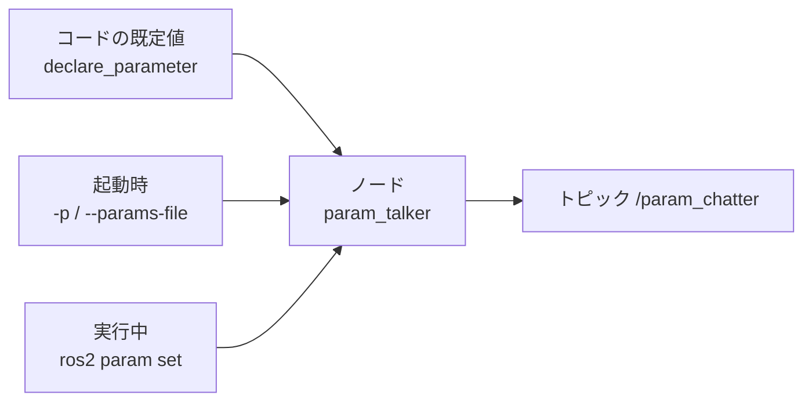
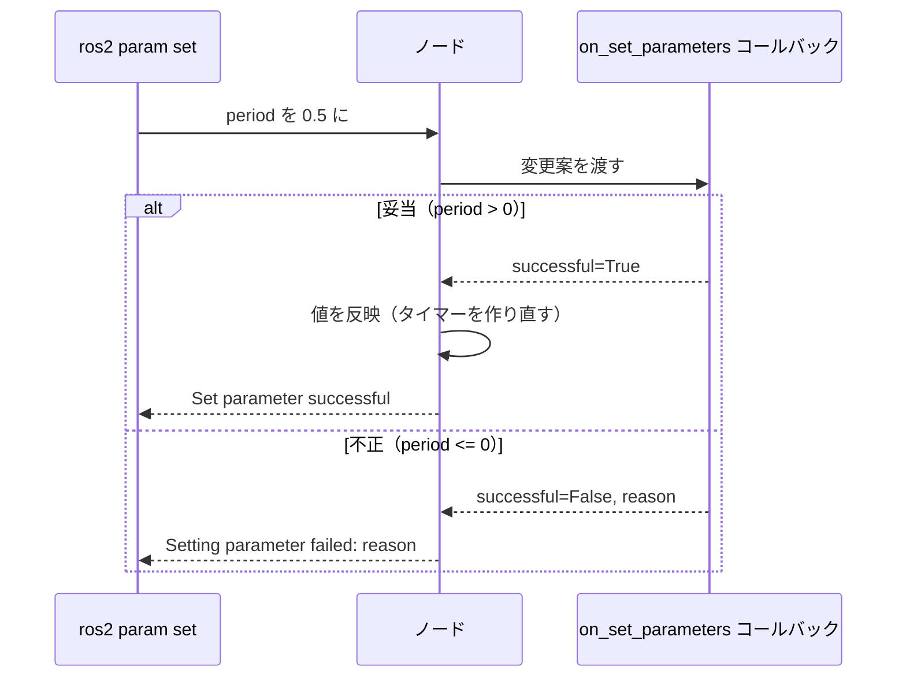

# フェーズ3-3 手順書: パラメータ（宣言・実行中の変更・YAML指定）

`docs/learning_plan.md` フェーズ3（idea_origin.md ステップ1の1-3）に対応する。ノードの設定値を、コードに埋め込まず外から与える方法を、Python・C++の両方で学ぶ。フェーズ5のPI制御ノードで、ゲイン（Kp・Ki）を外から調整する土台になる。

- 想定環境: WSL2 + Ubuntu 24.04 + ROS2 Jazzy
- 前提: フェーズ3-1、3-2完了
- 所要目安: 1コマ
- 言語: **Python・C++の両方**

> **進め方**: 仕様を見て自分で書き、詰まったら「サンプルコード」で答え合わせをする。サンプルはこの手順書の作成時にビルド確認済みで、ノードの実行結果は未確認（出力が違えば差分を貼ってほしい）。

## 0. 学習目標と完了条件

1. `declare_parameter` でパラメータを宣言し、値を取得できる（Python・C++）。
2. 3通りの与え方を使い分けられる: ①コードの既定値、②起動時（`-p` / YAML）、③実行中（`ros2 param set`）。
3. 実行中の変更に反応する（変更を検証して受け入れる/拒否する）コールバックを書ける。
4. YAMLファイルの書式（`ros__parameters`）と、型の厳密さ（`1` と `1.0` は別）を説明できる。

## 1. 全体像



値が決まる優先順位（後のものが勝つ）: **コードの既定値 < 起動時の指定（`-p` や YAML） < 実行中の `ros2 param set`**。

実行中の変更の流れ:



## 2. 仕様

| 項目 | 内容 |
|---|---|
| ノード名・実行ファイル名 | `param_talker`（Python版・C++版で同一） |
| 役割 | Publisher |
| トピック（型） | `param_chatter`（`std_msgs/msg/String`） |
| パラメータ | `message`（文字列、既定 `hello`）、`period`（実数、既定 `1.0` 秒） |
| 動作 | `period` 秒ごとに `message` の内容を送り、ログにも出す |
| 実行中の変更 | `message` は次の送信から反映する。`period` は**タイマーを作り直して**反映する。`period <= 0` は**拒否**する（変更前の値のまま） |

## 3. Python版（`ws/src/learn_py`）

`ws/src/learn_py/learn_py/param_talker.py` を作る。

主なAPI（rclpy）:

| やりたいこと | API |
|---|---|
| 宣言（既定値つき） | `self.declare_parameter('名前', 既定値)`（**既定値の型がそのパラメータの型**になる） |
| 取得 | `self.get_parameter('名前').value` |
| 変更の検証・反映 | `self.add_on_set_parameters_callback(コールバック)`、戻り値は `rcl_interfaces.msg.SetParametersResult` |
| タイマーの作り直し | `self.timer.cancel()` してから `self.create_timer(...)` |

<details>
<summary>サンプルコード（答え合わせ用）</summary>

ファイル: `ws/src/learn_py/learn_py/param_talker.py`

<!-- file: ws/src/learn_py/learn_py/param_talker.py -->
```python
import rclpy
from rcl_interfaces.msg import SetParametersResult
from rclpy.executors import ExternalShutdownException
from rclpy.node import Node
from std_msgs.msg import String


class ParamTalker(Node):
    def __init__(self):
        super().__init__('param_talker')
        self.declare_parameter('message', 'hello')
        self.declare_parameter('period', 1.0)
        self.message = self.get_parameter('message').value
        self.period = self.get_parameter('period').value

        self.pub = self.create_publisher(String, 'param_chatter', 10)
        self.timer = self.create_timer(self.period, self.on_timer)
        self.add_on_set_parameters_callback(self.on_params)

    def on_timer(self):
        msg = String()
        msg.data = self.message
        self.pub.publish(msg)
        self.get_logger().info(f'publish: {msg.data}')

    def on_params(self, params):
        # まず全体を検証し、問題なければ反映する
        for p in params:
            if p.name == 'period' and p.value <= 0.0:
                return SetParametersResult(successful=False, reason='period must be > 0')
        for p in params:
            if p.name == 'message':
                self.message = p.value
            elif p.name == 'period':
                self.period = p.value
                self.timer.cancel()
                self.timer = self.create_timer(self.period, self.on_timer)
        return SetParametersResult(successful=True)


def main(args=None):
    rclpy.init(args=args)
    node = ParamTalker()
    try:
        rclpy.spin(node)
    except (KeyboardInterrupt, ExternalShutdownException):
        pass
    finally:
        node.destroy_node()
        rclpy.try_shutdown()
```

</details>

`setup.py` の `entry_points` に1行足し、再ビルドする。

<!-- snippet: py_entry_points_param -->
```python
            'param_talker = learn_py.param_talker:main',
```

```bash
cd ~/work/ros2MinimalPhysicalAi/ws
colcon build --symlink-install --packages-select learn_py
source install/setup.bash
```

`rcl_interfaces` は `rclpy` が依存しているため、追加の宣言なしで `import` できる（明示したい場合は `package.xml` に `<depend>rcl_interfaces</depend>` を足す）。

## 4. C++版（`ws/src/learn_cpp`）

`ws/src/learn_cpp/src/param_talker.cpp` を作る。

主なAPI（rclcpp）:

| やりたいこと | API |
|---|---|
| 宣言（既定値つき・値も返る） | `declare_parameter<double>("名前", 既定値)` |
| 取得 | `get_parameter("名前").as_double()`、`.as_string()` |
| 変更の検証・反映 | `add_on_set_parameters_callback(...)`、引数は `std::vector<rclcpp::Parameter>`、戻り値は `rcl_interfaces::msg::SetParametersResult` |
| ハンドルの保持 | 戻り値の `OnSetParametersCallbackHandle::SharedPtr` を**メンバに保存する**（捨てるとコールバックが無効になる） |
| 周期が秒（実数）のタイマー | `create_wall_timer(std::chrono::duration<double>(period), ...)` |

<details>
<summary>サンプルコード（答え合わせ用）</summary>

ファイル: `ws/src/learn_cpp/src/param_talker.cpp`

<!-- file: ws/src/learn_cpp/src/param_talker.cpp -->
```cpp
#include <chrono>
#include <memory>
#include <string>
#include <vector>

#include "rcl_interfaces/msg/set_parameters_result.hpp"
#include "rclcpp/rclcpp.hpp"
#include "std_msgs/msg/string.hpp"

class ParamTalker : public rclcpp::Node
{
public:
  ParamTalker() : Node("param_talker")
  {
    message_ = declare_parameter<std::string>("message", "hello");
    period_ = declare_parameter<double>("period", 1.0);

    pub_ = create_publisher<std_msgs::msg::String>("param_chatter", 10);
    start_timer();
    param_cb_ = add_on_set_parameters_callback(
      [this](const std::vector<rclcpp::Parameter> & params) { return on_params(params); });
  }

private:
  void start_timer()
  {
    timer_ = create_wall_timer(
      std::chrono::duration<double>(period_), [this]() { on_timer(); });
  }

  void on_timer()
  {
    std_msgs::msg::String msg;
    msg.data = message_;
    pub_->publish(msg);
    RCLCPP_INFO(get_logger(), "publish: %s", msg.data.c_str());
  }

  rcl_interfaces::msg::SetParametersResult on_params(
    const std::vector<rclcpp::Parameter> & params)
  {
    rcl_interfaces::msg::SetParametersResult result;
    result.successful = true;
    // まず全体を検証し、問題なければ反映する
    for (const auto & p : params) {
      if (p.get_name() == "period" && p.as_double() <= 0.0) {
        result.successful = false;
        result.reason = "period must be > 0";
        return result;
      }
    }
    for (const auto & p : params) {
      if (p.get_name() == "message") {
        message_ = p.as_string();
      } else if (p.get_name() == "period") {
        period_ = p.as_double();
        start_timer();
      }
    }
    return result;
  }

  std::string message_;
  double period_;
  rclcpp::Publisher<std_msgs::msg::String>::SharedPtr pub_;
  rclcpp::TimerBase::SharedPtr timer_;
  rclcpp::node_interfaces::OnSetParametersCallbackHandle::SharedPtr param_cb_;
};

int main(int argc, char ** argv)
{
  rclcpp::init(argc, argv);
  rclcpp::spin(std::make_shared<ParamTalker>());
  rclcpp::shutdown();
  return 0;
}
```

</details>

`CMakeLists.txt` に追記し、`install(TARGETS ...)` へ `param_talker` を足す（これまでの分は残す）。

<!-- snippet: cmake_param -->
```cmake
add_executable(param_talker src/param_talker.cpp)
ament_target_dependencies(param_talker rclcpp std_msgs)

install(TARGETS
  hello
  talker
  listener
  sine_pub
  sine_sub
  turtle_circle
  qos_talker
  qos_listener
  param_talker
  DESTINATION lib/${PROJECT_NAME})
```

```bash
cd ~/work/ros2MinimalPhysicalAi/ws
colcon build --symlink-install --packages-select learn_cpp
source install/setup.bash
```

## 5. 実験

### 5-1. コードの既定値で動かす

```bash
# T1
ros2 run learn_py param_talker
# T2
ros2 topic echo /param_chatter
```

C++版（`ros2 run learn_cpp param_talker`）でも同様に確認する。

### 5-2. 起動時に指定する（`-p`）

```bash
ros2 run learn_py param_talker --ros-args -p message:="from cli" -p period:=0.5
```

> 課題1: `-p period:=2` （小数点なし）で起動するとエラーになることを確認する。`1` は整数、`1.0` は実数として区別される（宣言時の既定値 `1.0` が実数のため、整数を渡すと型が合わない）。エラーの文言を控える。

### 5-3. 実行中に読む・変える（`ros2 param`）

```bash
ros2 param list /param_talker
ros2 param describe /param_talker period
ros2 param get /param_talker message
ros2 param set /param_talker message "changed"
ros2 param set /param_talker period 0.2
ros2 param set /param_talker period 0.0      # 拒否される（reasonが表示される）
ros2 param get /param_talker period          # 0.2のまま
```

- `period` を変えると、`ros2 topic echo` の間隔が変わる。
- `ros2 param set /param_talker period 2` （整数）も型の不一致で失敗する。`2.0` と書く。

> 課題2: `period` を `0.0` に設定して拒否されることと、その後も動作が変わらないことを確認する。
>
> 課題3: 拒否の理由メッセージが、コードの `reason` と一致することを確認する。

### 5-4. YAMLファイルで指定する

`ws/config/param_talker.yaml` を作る（`ws/config/` はパッケージではない普通のフォルダ。フェーズ4でlaunchと一緒に整理する）。

```yaml
param_talker:
  ros__parameters:
    message: "from yaml"
    period: 0.5
```

- 1行目は**ノード名**（`param_talker`）。ノード名にかかわらず全ノードに当てたい場合は `/**:` と書く。
- `ros__parameters`（アンダースコア2つ）は固定のキー。

```bash
ros2 run learn_py param_talker --ros-args --params-file ~/work/ros2MinimalPhysicalAi/ws/config/param_talker.yaml
```

実行中の設定をYAMLで書き出す・読み込む:

```bash
ros2 param dump /param_talker
ros2 param load /param_talker ~/work/ros2MinimalPhysicalAi/ws/config/param_talker.yaml
```

> 課題4: YAMLの `period: 0.5` を `period: 1` にして起動するとどうなるか確認する。
>
> 課題5: 同時に `-p period:=3.0` も付けると、YAMLと `-p` のどちらが勝つか確認する（引数の並び順が影響する）。
>
> 課題6（発展）: `declare_parameter` に `ParameterDescriptor`（説明文と `FloatingPointRange`）を付けて、`ros2 param describe` に範囲が出ることを確認する。範囲外の値が自動で拒否されることも確認する。

## 6. 車両シミュレーションとの対応（フェーズ5への伏線）

フェーズ5のPI制御ノードでは、次のようにパラメータを使う予定。

| パラメータ | 意味 | 変更の使い方 |
|---|---|---|
| `kp` | 比例ゲイン | 実行中に `ros2 param set` で調整 |
| `ki` | 積分ゲイン | 同上 |
| `target_speed` | 目標速度 | 起動時のYAML、または実行中に変更 |

今回の「変更を検証して拒否する」コールバックは、`kp < 0` のような不正なゲインを弾くのに使える。

## 7. 記録用の表

| 観点 | Python | C++ |
|---|---|---|
| 宣言〜取得の書き方 | | |
| コールバックの引数・戻り値の型 | | |
| ハンドル保持の必要性（C++のみ） | — | |
| タイマーの作り直し | | |
| つまずいた点 | | |

## 8. つまずきやすい点

| 症状 | 確認すること |
|---|---|
| YAMLを渡しても反映されない | 1行目のノード名が実際のノード名と一致しているか。インデント（スペース）。`ros__parameters` の綴り |
| `-p period:=2` で失敗 | 実数は小数点つきで（`2.0`）。型は宣言時の既定値で決まる |
| C++で実行中の変更に反応しない | `add_on_set_parameters_callback` の戻り値を保持しているか |
| `ros2 param set` が「Node not found」 | ノードが起動しているか。ノード名（`/param_talker`）の先頭の `/` |
| Pythonで `p.value` の型が想定外 | 宣言時の既定値の型（`1.0` か `1` か） |

## 9. 次へ

フェーズ3-4（`docs/phase3_4_services.md`）で、サービス（要求と応答）を扱う。

## 10. 公式ドキュメント・参考資料

確認状況（2026-09-20）: 下記は `docs/idea_origin.md` に掲載済みのURLで、今回は再確認していない（docs.ros.orgは本文取得がボット対策で拒否される）。

### 公式（ROS 2 Jazzy）

- [Understanding parameters — Jazzy](https://docs.ros.org/en/jazzy/Tutorials/Beginner-CLI-Tools/Understanding-ROS2-Parameters/Understanding-ROS2-Parameters.html)
- [Using parameters in a class (Python) — Jazzy](https://docs.ros.org/en/jazzy/Tutorials/Beginner-Client-Libraries/Using-Parameters-In-A-Class-Python.html)
- [Using parameters in a class (C++) — Jazzy](https://docs.ros.org/en/jazzy/Tutorials/Beginner-Client-Libraries/Using-Parameters-In-A-Class-CPP.html)

### 日本語

- [YAMLファイルによるROS2のパラメータ設定 #ROS2 - Qiita](https://qiita.com/NeK/items/15bf1e657d8d694592ed)

> 記事は個人による非公式の解説で、版によって異なる場合がある。公式ドキュメントと食い違う場合は公式を優先する。
