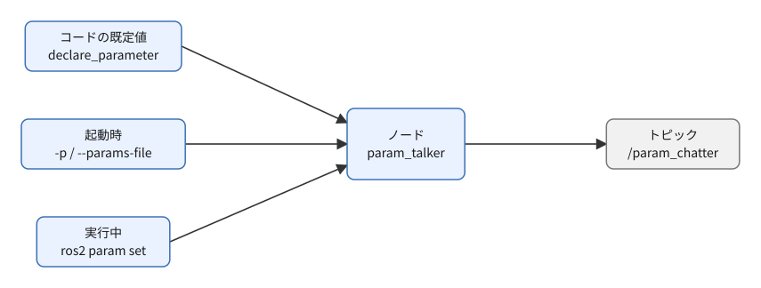
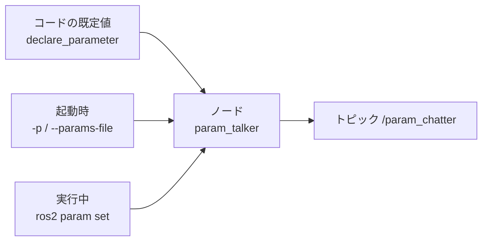
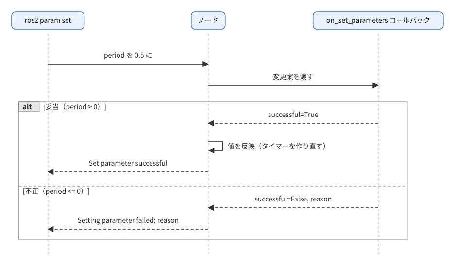
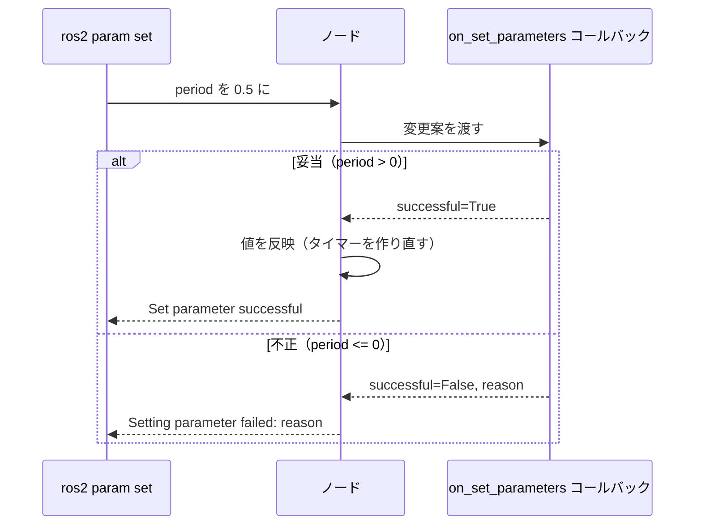

# フェーズ3-3 手順書: パラメータ（宣言・実行中の変更・YAML指定）

`docs/learning_plan.md` フェーズ3（idea_origin.md ステップ1の1-3）に対応する。ノードの設定値を、コードに埋め込まず外から与える方法を、Python・C++の両方で学ぶ。フェーズ5のPI制御ノードで、ゲイン（Kp・Ki）を外から調整する土台になる。

- 想定環境: WSL2 + Ubuntu 24.04 + ROS2 Jazzy
- 前提: フェーズ3-1、3-2完了
- 所要目安: 1コマ
- 言語: **Python・C++の両方**

> **進め方**: 仕様（2節）は「何を作るか」の定義で、APIの使い方までは書いていない。まず「主なAPI」表でパラメータ関連のAPIを把握し、サンプルコードと解説を読んで理解する。読んで分かったら、既定値や型を変える、パラメータを増やすなど手を動かして改造してみると定着する。サンプルはこの手順書の作成時にビルド確認済みで、ノードの実行結果は未確認（出力が違えば差分を貼ってほしい）。

> **実行環境が無くても読めるように**: 実行する手順の直後には「期待する結果」として、表示される内容の例とその読み方を載せている。コードとROS2の仕様（エラー文言はローカルのrclpy・rclcppのソース）から筆者が想定したもので、実機では時刻などの細部が異なる。

## 0. 学習目標と完了条件

1. `declare_parameter` でパラメータを宣言し、値を取得できる（Python・C++）。
2. 3通りの与え方を使い分けられる: ①コードの既定値、②起動時（`-p` / YAML）、③実行中（`ros2 param set`）。
3. 実行中の変更に反応する（変更を検証して受け入れる/拒否する）コールバックを書ける。
4. YAMLファイルの書式（`ros__parameters`）と、型の厳密さ（`1` と `1.0` は別）を説明できる。

## 1. 全体像



<details>
<summary>同じ図（mermaid版）</summary>



</details>

値が決まる優先順位（後のものが勝つ）: **コードの既定値 < 起動時の指定（`-p` や YAML） < 実行中の `ros2 param set`**。

実行中の変更の流れ:



<details>
<summary>同じ図（mermaid版）</summary>



</details>

> 注: 上の図は流れの説明用。サンプルコードは簡単のため、コールバック内で状態を書き換えている（同じ要求の別パラメータが後で拒否された場合に、状態が食い違う恐れがある）。Jazzyには、検証後に反映するための `add_post_set_parameters_callback` があるので、発展課題として調べるとよい。

## 2. 仕様

| 項目 | 内容 |
|---|---|
| ノード名・実行ファイル名 | `param_talker`（Python版・C++版で同一） |
| 役割 | Publisher |
| トピック（型） | `param_chatter`（`std_msgs/msg/String`） |
| パラメータ | `message`（文字列、既定 `hello`）、`period`（実数、既定 `1.0` 秒） |
| 動作 | `period` 秒ごとに `message` の内容を送り、ログにも出す |
| 実行中の変更 | `message` は次の送信から反映する。`period` は**タイマーを作り直して**反映する。`period <= 0` は**拒否**する（変更前の値のまま） |

## 3. Python版（`ws/src/learn_py`）

`ws/src/learn_py/learn_py/param_talker.py` を作る。

主なAPI（rclpy）:

| やりたいこと | API |
|---|---|
| 宣言（既定値つき） | `self.declare_parameter('名前', 既定値)`（**既定値の型がそのパラメータの型**になる） |
| 取得 | `self.get_parameter('名前').value` |
| 変更の検証・反映 | `self.add_on_set_parameters_callback(コールバック)`、戻り値は `rcl_interfaces.msg.SetParametersResult` |
| タイマーの作り直し | `self.timer.cancel()` してから `self.create_timer(...)` |

#### サンプルコードと解説（Python版）

ファイル: `ws/src/learn_py/learn_py/param_talker.py`

<!-- file: ws/src/learn_py/learn_py/param_talker.py -->
```python
import rclpy
from rcl_interfaces.msg import SetParametersResult
from rclpy.executors import ExternalShutdownException
from rclpy.node import Node
from std_msgs.msg import String


# パラメータ message の文字列を、パラメータ period 秒ごとに param_chatter へ送るノード。
# 実行中のパラメータ変更を検証して反映する。
class ParamTalker(Node):
    # パラメータを宣言して初期値を読み、Publisher・タイマー・変更時のコールバックを用意する。
    def __init__(self):
        super().__init__('param_talker')
        self.declare_parameter('message', 'hello')
        self.declare_parameter('period', 1.0)
        self.message = self.get_parameter('message').value
        self.period = self.get_parameter('period').value

        self.pub = self.create_publisher(String, 'param_chatter', 10)
        self.timer = self.create_timer(self.period, self.on_timer)
        self.add_on_set_parameters_callback(self.on_params)

    # 今の message を1回送ってログに出す。
    def on_timer(self):
        msg = String()
        msg.data = self.message
        self.pub.publish(msg)
        self.get_logger().info(f'publish: {msg.data}')

    # ros2 param set などでパラメータが変わるときに呼ばれる。
    # period <= 0 なら拒否し、妥当なら値を反映する（period はタイマーを作り直す）。
    def on_params(self, params):
        # まず全体を検証し、問題なければ反映する
        for p in params:
            if p.name == 'period' and p.value <= 0.0:
                return SetParametersResult(successful=False, reason='period must be > 0')
        for p in params:
            if p.name == 'message':
                self.message = p.value
            elif p.name == 'period':
                self.period = p.value
                self.timer.cancel()
                self.timer = self.create_timer(self.period, self.on_timer)
        return SetParametersResult(successful=True)


# エントリポイント（setup.py の entry_points から呼ばれる）。
# ノードを作って spin で回し、Ctrl+C で後片付けして終わる。
def main(args=None):
    rclpy.init(args=args)
    node = ParamTalker()
    try:
        rclpy.spin(node)
    except (KeyboardInterrupt, ExternalShutdownException):
        pass
    finally:
        node.destroy_node()
        rclpy.try_shutdown()
```

解説（param_talker.py）:

- **役割と流れ**: フェーズ3-1のtalkerに、2つのパラメータ（`message`、`period`）を足したもの。起動時に値を決め、実行中に `ros2 param set` で変わったら、その都度コールバックが検証して反映する。`main` の部分（`init` → `spin` → 後片付け）は3-1と同じなので省略する。
- **宣言と取得（`__init__` の前半）**:
  - `declare_parameter('message', 'hello')` は「この名前のパラメータを持つ」と登録し、既定値を与える。**宣言しないと、`-p` や `ros2 param set` で渡しても受け付けられない**（既定の設定では、未宣言のパラメータは設定できない）。
  - パラメータの型は、既定値の型で決まる。`'hello'` なら文字列、`1.0` なら実数（double）。これが「`period:=2` はエラー」の原因（`2` は整数として扱われ、型が合わない）。
  - `get_parameter('message').value` で現在の値を取り出す。宣言の時点で、起動時の指定（`-p` やYAML）があれば、既定値ではなくそちらの値が入っている。この「上書きされた値」を取り出すのが、この2行の目的。
- **タイマーとコールバックの登録**: 取得した `self.period` を使ってタイマーを作る。最後に `add_on_set_parameters_callback(self.on_params)` で、「パラメータを変更する要求が来たら `on_params` を呼んでほしい」と登録する。登録の順序は、タイマー等を作ってからにしてある（コールバックの中で `self.timer` を使うため）。
- **`on_timer`**: `self.message` を送るだけ。パラメータを毎回 `get_parameter` で読み直す書き方もあるが、ここでは属性に保存しておき、変更コールバックで更新する方式にしている。
- **`on_params(self, params)`**:
  - 引数 `params` は、今回の要求で変更されようとしている `Parameter` のリスト（`p.name`、`p.value` で見る）。複数のパラメータが**1回の要求でまとめて**来ることがあるため、リストを2回ループする。
  - 1回目のループは**検証だけ**。`period` が0以下なら、`SetParametersResult(successful=False, reason=...)` を返して拒否する。拒否すると値は変わらず、`ros2 param set` 側に `reason` の文字列が表示される。
  - 2回目のループで**反映**する。`message` は属性を更新するだけ。`period` は、既存のタイマーを `cancel()` してから、新しい周期で `create_timer` し直す（タイマーの周期は、作成後に変更できないため）。
  - 最後に `successful=True` を返して受け入れる。
  - なぜ2回に分けるか: 1つのループで検証と反映を同時にやると、「先頭の `message` は反映したが、後ろの `period` が不正で拒否した」という中途半端な状態になり、拒否したのに一部が変わってしまう。
- **落とし穴**:
  - コールバックが返す値は必ず `SetParametersResult`。`True` などを返すとエラーになる。
  - `p.value <= 0.0` の比較は、`period` が実数として宣言されているから成り立つ。整数が渡された場合は、そもそもコールバックより前に型の不一致で失敗する。
  - 1節の図の注記どおり、このサンプルはコールバックの中で反映している。他のパラメータが後から拒否される場合の食い違いは、この手順書では扱わない（発展課題）。
- **観察ポイント**: 起動して `ros2 topic echo /param_chatter` を見ながら、`ros2 param set /param_talker period 0.2` で間隔が5倍速くなること、`0.0` で拒否されて間隔が変わらないこと、`message` を変えると次の送信から内容が変わること。

`setup.py` の `entry_points` に1行足し、再ビルドする。

<!-- snippet: py_entry_points_param -->
```python
            'param_talker = learn_py.param_talker:main',
```

```bash
cd ~/work/ros2MinimalPhysicalAi/ws
colcon build --symlink-install --packages-select learn_py
source install/setup.bash
```

`rcl_interfaces` は `rclpy` が依存しているため、追加の宣言なしで `import` できる（明示したい場合は `package.xml` に `<depend>rcl_interfaces</depend>` を足す）。

## 4. C++版（`ws/src/learn_cpp`）

`ws/src/learn_cpp/src/param_talker.cpp` を作る。

主なAPI（rclcpp）:

| やりたいこと | API |
|---|---|
| 宣言（既定値つき・値も返る） | `declare_parameter<double>("名前", 既定値)` |
| 取得 | `get_parameter("名前").as_double()`、`.as_string()` |
| 変更の検証・反映 | `add_on_set_parameters_callback(...)`、引数は `std::vector<rclcpp::Parameter>`、戻り値は `rcl_interfaces::msg::SetParametersResult` |
| ハンドルの保持 | 戻り値の `OnSetParametersCallbackHandle::SharedPtr` を**メンバに保存する**（捨てるとコールバックが無効になる） |
| 周期が秒（実数）のタイマー | `create_wall_timer(std::chrono::duration<double>(period), ...)` |

#### サンプルコードと解説（C++版）

ファイル: `ws/src/learn_cpp/src/param_talker.cpp`

<!-- file: ws/src/learn_cpp/src/param_talker.cpp -->
```cpp
#include <chrono>
#include <memory>
#include <string>
#include <vector>

#include "rcl_interfaces/msg/set_parameters_result.hpp"
#include "rclcpp/rclcpp.hpp"
#include "std_msgs/msg/string.hpp"

// パラメータ message の文字列を、パラメータ period 秒ごとに param_chatter へ送るノード。
// 実行中のパラメータ変更を検証して反映する（param_talker.py と同じ仕様）。
class ParamTalker : public rclcpp::Node
{
public:
  // コンストラクタ: パラメータを宣言して初期値を読み、Publisher・タイマー・変更時のコールバックを用意する。
  ParamTalker() : Node("param_talker")
  {
    message_ = declare_parameter<std::string>("message", "hello");
    period_ = declare_parameter<double>("period", 1.0);

    pub_ = create_publisher<std_msgs::msg::String>("param_chatter", 10);
    start_timer();
    param_cb_ = add_on_set_parameters_callback(
      [this](const std::vector<rclcpp::Parameter> & params) { return on_params(params); });
  }

private:
  // 今の period_ でタイマーを作る（作り直しにも使う）。
  void start_timer()
  {
    timer_ = create_wall_timer(
      std::chrono::duration<double>(period_), [this]() { on_timer(); });
  }

  // 今の message_ を1回送ってログに出す。
  void on_timer()
  {
    std_msgs::msg::String msg;
    msg.data = message_;
    pub_->publish(msg);
    RCLCPP_INFO(get_logger(), "publish: %s", msg.data.c_str());
  }

  // パラメータが変わるときに呼ばれる。period <= 0 なら拒否し、妥当なら反映する。
  rcl_interfaces::msg::SetParametersResult on_params(
    const std::vector<rclcpp::Parameter> & params)
  {
    rcl_interfaces::msg::SetParametersResult result;
    result.successful = true;
    // まず全体を検証し、問題なければ反映する
    for (const auto & p : params) {
      if (p.get_name() == "period" && p.as_double() <= 0.0) {
        result.successful = false;
        result.reason = "period must be > 0";
        return result;
      }
    }
    for (const auto & p : params) {
      if (p.get_name() == "message") {
        message_ = p.as_string();
      } else if (p.get_name() == "period") {
        period_ = p.as_double();
        start_timer();
      }
    }
    return result;
  }

  std::string message_;
  double period_;
  rclcpp::Publisher<std_msgs::msg::String>::SharedPtr pub_;
  rclcpp::TimerBase::SharedPtr timer_;
  rclcpp::node_interfaces::OnSetParametersCallbackHandle::SharedPtr param_cb_;
};

// エントリポイント。ノードを作って spin で回し、Ctrl+C で spin を抜けて終わる。
int main(int argc, char ** argv)
{
  rclcpp::init(argc, argv);
  rclcpp::spin(std::make_shared<ParamTalker>());
  rclcpp::shutdown();
  return 0;
}
```

解説（param_talker.cpp）: Python版と同じ動作・同じ流れ。ここでは言語固有の点を中心に書く。

- **宣言と取得を1行で**: `declare_parameter<std::string>("message", "hello")` は、宣言と同時に**現在の値を返す**。起動時に `-p` などで指定があれば、その値が返る。Pythonの「宣言 → `get_parameter().value`」の2手順が、ここでは1行にまとまる。型はテンプレート引数（`<std::string>`, `<double>`）で明示する。`1.0` を既定値にしても、`declare_parameter<double>` のように型を書くので、型の食い違いはコンパイル時に気付きやすい。
- **コンストラクタの順序**: パラメータの宣言 → Publisher → タイマー → コールバック登録。コールバックの中で `timer_` を使うので、登録は最後にしている。
- **`start_timer()`**: `std::chrono::duration<double>(period_)` は、「秒単位の実数」を表す時間の型。`create_wall_timer` は `1s` のようなリテラルのほか、この形で実数の秒を渡せる。タイマーの作り直しに使うので、コンストラクタと `on_params` の両方から呼べるよう、メソッドに切り出してある。Pythonの `cancel()` して作り直す書き方との違いは、C++版では `timer_` に新しい `shared_ptr` を代入するだけで、古いタイマーへの参照がなくなって解放され、停止する点（明示的な `cancel` は書いていない）。
- **`add_on_set_parameters_callback` の戻り値を保持する**: 戻り値の `OnSetParametersCallbackHandle::SharedPtr`（`param_cb_`）を捨てると、コールバックの登録が解除される。メンバ変数に保存しておく必要がある。Pythonでは戻り値を保持しなくても動く。8節の「C++で実行中の変更に反応しない」の原因の典型。
- **コールバックの引数と戻り値**: 引数は `const std::vector<rclcpp::Parameter> &`（変更しようとしているパラメータのリスト、コピーしない参照渡し）。戻り値は `rcl_interfaces::msg::SetParametersResult`。`successful` と `reason` のフィールドを埋めて返す。Pythonのようにコンストラクタ引数で渡すのではなく、変数を作ってフィールドに代入する。
- **型ごとの取り出し**: `p.get_name()` で名前、`p.as_double()`、`p.as_string()` で値を取り出す。取り出す型は、宣言した型と一致させる。合わないと例外が飛ぶ。Pythonは `p.value` が型を問わず使える分、C++のほうが型に厳しい。
- **2回ループにする理由**: Python版と同じ（検証してから反映）。C++でも、検証ループの途中で `return` して拒否している。
- **メンバの初期化**: `message_` と `period_` は宣言時に初期値を持たず、コンストラクタの先頭で `declare_parameter` の戻り値を代入している。`start_timer()` は `period_` を使うので、代入より前に呼ばないこと。
- **includeの追加**: `rcl_interfaces/msg/set_parameters_result.hpp` を、`rclcpp` とは別にincludeしている。CMakeの依存に `rcl_interfaces` を書いていないのは、`rclcpp` を通じて使えているため（この構成でビルド確認済み）。依存を明示したい場合は、`package.xml` と `ament_target_dependencies` に足す。
- **つまずきやすい点**: ラムダで `[this]` を書き忘れると、`on_params` を呼べずビルドが通らない。
- **観察ポイント**: Python版と同じ実験（5節）を、`ros2 run learn_cpp param_talker` で繰り返し、同じ結果（間隔の変化・拒否のメッセージ）になること。

`CMakeLists.txt` に追記し、`install(TARGETS ...)` へ `param_talker` を足す（これまでの分は残す）。

<!-- snippet: cmake_param -->
```cmake
add_executable(param_talker src/param_talker.cpp)
ament_target_dependencies(param_talker rclcpp std_msgs)

install(TARGETS
  hello
  talker
  listener
  sine_pub
  sine_sub
  turtle_circle
  qos_talker
  qos_listener
  param_talker
  DESTINATION lib/${PROJECT_NAME})
```

```bash
cd ~/work/ros2MinimalPhysicalAi/ws
colcon build --symlink-install --packages-select learn_cpp
source install/setup.bash
```

## 5. 実験

### 5-1. コードの既定値で動かす

```bash
# T1
ros2 run learn_py param_talker
# T2
ros2 topic echo /param_chatter
```

期待する結果: 既定値（`message` は `hello`、`period` は `1.0` 秒）どおり、1秒ごとに `hello` が送られる。

```text
# T1（param_talker）
[INFO] [1727180000.100000000] [param_talker]: publish: hello
[INFO] [1727180001.100000000] [param_talker]: publish: hello

# T2（ros2 topic echo）
data: hello
---
data: hello
---
```

C++版（`ros2 run learn_cpp param_talker`）でも同様に確認する。表示は同じになる。

### 5-2. 起動時に指定する（`-p`）

```bash
ros2 run learn_py param_talker --ros-args -p message:="from cli" -p period:=0.5
```

期待する結果: 0.5秒ごと（1秒に2行）に、指定した文字列が出る。コードは1文字も変えていないのに、振る舞いが変わる点が大事。

```text
[INFO] [1727180010.500000000] [param_talker]: publish: from cli
[INFO] [1727180011.000000000] [param_talker]: publish: from cli
[INFO] [1727180011.500000000] [param_talker]: publish: from cli
```

この節（5-2）の末尾にある課題1の `-p period:=2` では、ノードは起動直後に異常終了する。Python版の場合は、トレースバック（エラーまでの呼び出しの履歴）の最後に次の行が出る。

```text
rclpy.exceptions.InvalidParameterTypeException: Trying to set parameter 'period' to '2' of type 'INTEGER', expecting type 'DOUBLE'
[ros2run]: Process exited with failure 1
```

「`period` に整数（`INTEGER`）の `2` が渡されたが、実数（`DOUBLE`）が期待されている」という意味。C++版では、`parameter 'period' has invalid type: Wrong parameter type, parameter {period} is of type {double}, setting it to {integer} is not allowed.` のような文になる。

> 課題1: `-p period:=2` （小数点なし）で起動するとエラーになることを確認する。`1` は整数、`1.0` は実数として区別される（宣言時の既定値 `1.0` が実数のため、整数を渡すと型が合わない）。エラーの文言を控える。

### 5-3. 実行中に読む・変える（`ros2 param`）

```bash
ros2 param list /param_talker
ros2 param describe /param_talker period
ros2 param get /param_talker message
ros2 param set /param_talker message "changed"
ros2 param set /param_talker period 0.2
ros2 param set /param_talker period 0.0      # 拒否される（reasonが表示される）
ros2 param get /param_talker period          # 0.2のまま
```

期待する結果（T1で `param_talker` を既定値で動かし、別ターミナルで上から順に実行した場合）:

```text
$ ros2 param list /param_talker
  message
  period
  qos_overrides./parameter_events.publisher.depth
  qos_overrides./parameter_events.publisher.durability
  qos_overrides./parameter_events.publisher.history
  qos_overrides./parameter_events.publisher.reliability
  start_type_description_service
  use_sim_time

$ ros2 param describe /param_talker period
Parameter name: period
  Type: double
  Constraints:

$ ros2 param get /param_talker message
String value is: hello

$ ros2 param set /param_talker message "changed"
Set parameter successful

$ ros2 param set /param_talker period 0.2
Set parameter successful

$ ros2 param set /param_talker period 0.0
Setting parameter failed: period must be > 0

$ ros2 param get /param_talker period
Double value is: 0.2
```

- `param list` には、自分で宣言した `message`・`period` のほかに、ノードが自動で持つパラメータ（`use_sim_time` など）も並ぶ。
- `param describe` の `Type: double` は、宣言時の既定値 `1.0` から決まった型。`Constraints:` の下が空なのは、範囲などの制約を付けていないから（5-4節の課題6で、`ParameterDescriptor` を使って範囲を付ける）。
- `message` を変えると、T1のログが次の送信から `publish: changed` に変わる。`period` を0.2にすると、ログが1秒に5行に増える。
- `period 0.0` の失敗の後ろに続く `period must be > 0` は、コードの `reason` に書いた文字列そのもの。拒否されたので、値は0.2のまま。

- `period` を変えると、`ros2 topic echo` の間隔が変わる。
- `ros2 param set /param_talker period 2` （整数）も型の不一致で失敗する。`2.0` と書く。Python版のノードでは `Setting parameter failed: Wrong parameter type, expected 'Type.DOUBLE' got 'Type.INTEGER'` と表示される（起動時の `-p` と違って、ノードは終了せず動き続ける）。

> 課題2: `period` を `0.0` に設定して拒否されることと、その後も動作が変わらないことを確認する。
>
> 課題3: 拒否の理由メッセージが、コードの `reason` と一致することを確認する。

### 5-4. YAMLファイルで指定する

`ws/config/param_talker.yaml` を作る（`ws/config/` はパッケージではない普通のフォルダ。フェーズ4で `learn_bringup/config/` へ移すので、**それまでコミットしない**。`git status` に未追跡として出ても問題ない）。

```yaml
param_talker:
  ros__parameters:
    message: "from yaml"
    period: 0.5
```

- 1行目は**ノード名**（`param_talker`）。ノード名にかかわらず全ノードに当てたい場合は `/**:` と書く。
- `ros__parameters`（アンダースコア2つ）は固定のキー。

```bash
ros2 run learn_py param_talker --ros-args --params-file ~/work/ros2MinimalPhysicalAi/ws/config/param_talker.yaml
```

期待する結果: YAMLに書いた値で動く（5-2で `-p` を使ったときと同じ振る舞い）。

```text
[INFO] [1727180100.500000000] [param_talker]: publish: from yaml
[INFO] [1727180101.000000000] [param_talker]: publish: from yaml
```

YAMLの1行目のノード名を間違えていると、エラーにはならずに既定値（`hello`、1秒ごと）で動く。「何も言われずに反映されない」ので、表示の文字列で確かめる習慣を付けるとよい。

実行中の設定をYAMLで書き出す・読み込む:

```bash
ros2 param dump /param_talker
ros2 param load /param_talker ~/work/ros2MinimalPhysicalAi/ws/config/param_talker.yaml
```

期待する結果（`ros2 param set` で `message` を `changed`、`period` を `0.2` にした後の例）:

```text
$ ros2 param dump /param_talker
/param_talker:
  ros__parameters:
    message: changed
    period: 0.2
    qos_overrides:
      /parameter_events:
        publisher:
          depth: 1000
          durability: volatile
          history: keep_last
          reliability: reliable
    start_type_description_service: true
    use_sim_time: false

$ ros2 param load /param_talker ~/work/ros2MinimalPhysicalAi/ws/config/param_talker.yaml
Set parameter message successful
Set parameter period successful
```

`dump` の出力は、5-4の冒頭で書いたYAMLと同じ書式（ノード名 → `ros__parameters` → 値）になっている。そのままファイルに保存すれば、今の設定を次回の起動に使える。`load` の後は、T1のログが `publish: from yaml` に、間隔が0.5秒に戻る。

> 課題4: YAMLの `period: 0.5` を `period: 1` にして起動するとどうなるか確認する。
>
> 課題5: 同時に `-p period:=3.0` も付けると、YAMLと `-p` のどちらが勝つか確認する（引数の並び順が影響する）。
>
> 課題6（発展）: `declare_parameter` に `ParameterDescriptor`（説明文と `FloatingPointRange`）を付けて、`ros2 param describe` に範囲が出ることを確認する。範囲外の値が自動で拒否されることも確認する。

## 6. 車両シミュレーションとの対応（フェーズ5への伏線）

フェーズ5のPI制御ノードでは、次のようにパラメータを使う予定。

| パラメータ | 意味 | 変更の使い方 |
|---|---|---|
| `kp` | 比例ゲイン | 実行中に `ros2 param set` で調整 |
| `ki` | 積分ゲイン | 同上 |
| `target_speed` | 目標速度 | 起動時のYAML、または実行中に変更 |

今回の「変更を検証して拒否する」コールバックは、`kp < 0` のような不正なゲインを弾くのに使える。

## 7. Python版とC++版の違いのまとめ

| 観点 | Python | C++ |
|---|---|---|
| 宣言〜取得の書き方 | `declare_parameter(名前, 既定値)` で宣言し、別行の `get_parameter(名前).value` で取得（2手順） | `declare_parameter<型>(名前, 既定値)` が宣言と同時に現在値を返す（1行） |
| コールバックの引数・戻り値の型 | 引数はPythonの `Parameter` のリスト、戻り値は `SetParametersResult`（コンストラクタ引数で組み立てる） | 引数は `const std::vector<rclcpp::Parameter> &`、戻り値は `rcl_interfaces::msg::SetParametersResult`（変数を作ってフィールドに代入） |
| ハンドル保持の必要性 | 不要（戻り値を保持しなくても動く） | **必須**。`add_on_set_parameters_callback` の戻り値（`OnSetParametersCallbackHandle::SharedPtr`）をメンバに保存しないと、コールバック登録が解除される |
| タイマーの作り直し | `self.timer.cancel()` してから `create_timer` し直す（明示的にキャンセル） | 新しい `shared_ptr` を `timer_` に代入するだけ（古いタイマーは参照が無くなり自動的に解放・停止） |
| 値の取り出し方 | `p.value` が型を問わず使える | `p.as_double()`／`p.as_string()` など、宣言した型に合わせて呼び分ける（型が合わないと例外） |

C++で最も見落としやすいのは「コールバックハンドルの保持忘れ」（8節）。Pythonには無い落とし穴で、C++の`add_on_set_parameters_callback`特有の注意点。

## 8. つまずきやすい点

| 症状 | 確認すること |
|---|---|
| YAMLを渡しても反映されない | 1行目のノード名が実際のノード名と一致しているか。インデント（スペース）。`ros__parameters` の綴り |
| `-p period:=2` で失敗 | 実数は小数点つきで（`2.0`）。型は宣言時の既定値で決まる |
| C++で実行中の変更に反応しない | `add_on_set_parameters_callback` の戻り値を保持しているか |
| `ros2 param set` が「Node not found」 | ノードが起動しているか。ノード名（`/param_talker`）の先頭の `/` |
| Pythonで `p.value` の型が想定外 | 宣言時の既定値の型（`1.0` か `1` か） |

## 9. 次へ

フェーズ3-4（`docs/phase3_4_services.md`）で、サービス（要求と応答）を扱う。

## 10. 公式ドキュメント・参考資料

確認状況（2026-09-20）: 下記は `docs/idea_origin.md` に掲載済みのURLで、今回は再確認していない（docs.ros.orgは本文取得がボット対策で拒否される）。

### 公式（ROS 2 Jazzy）

- [Understanding parameters — Jazzy](https://docs.ros.org/en/jazzy/Tutorials/Beginner-CLI-Tools/Understanding-ROS2-Parameters/Understanding-ROS2-Parameters.html)
- [Using parameters in a class (Python) — Jazzy](https://docs.ros.org/en/jazzy/Tutorials/Beginner-Client-Libraries/Using-Parameters-In-A-Class-Python.html)
- [Using parameters in a class (C++) — Jazzy](https://docs.ros.org/en/jazzy/Tutorials/Beginner-Client-Libraries/Using-Parameters-In-A-Class-CPP.html)

### 日本語

- [YAMLファイルによるROS2のパラメータ設定 #ROS2 - Qiita](https://qiita.com/NeK/items/15bf1e657d8d694592ed)

> 記事は個人による非公式の解説で、版によって異なる場合がある。公式ドキュメントと食い違う場合は公式を優先する。

> 出典: 各サンプルのAPIの使い方は、上記の公式チュートリアルを参考にした（ROS 2ドキュメントはCC BY 4.0）。ノード名・仕様・コード・文章は独自に書いたもので、逐語の転載ではない。
