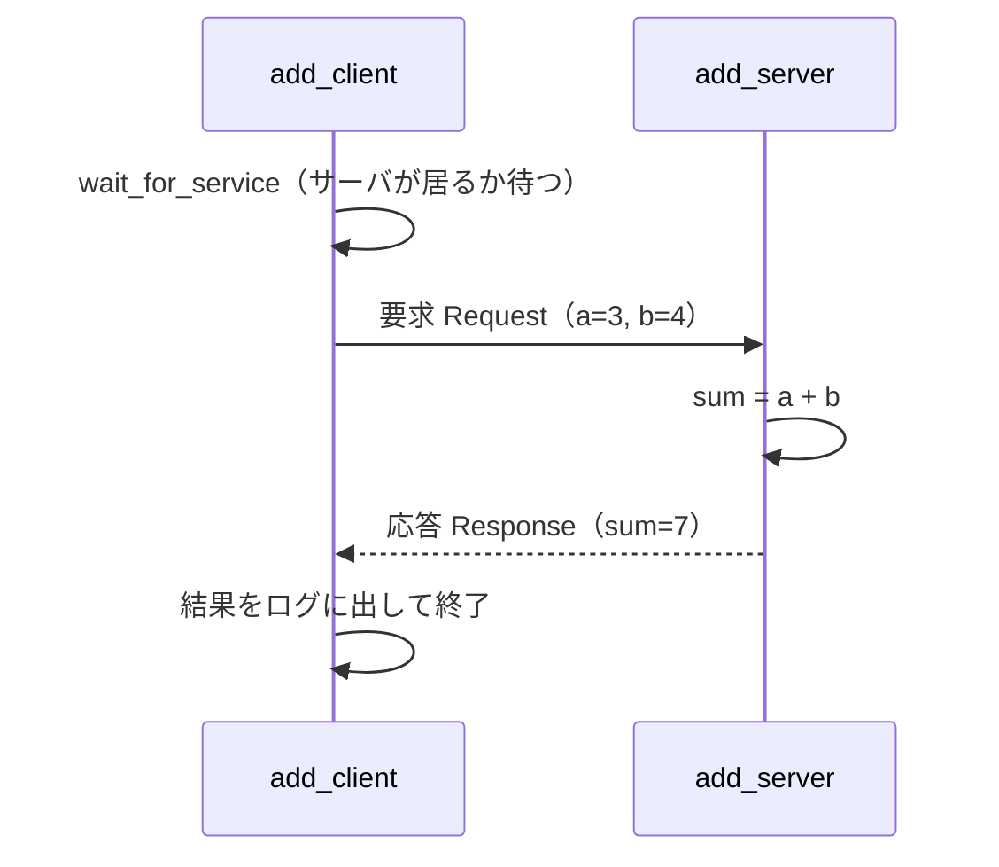
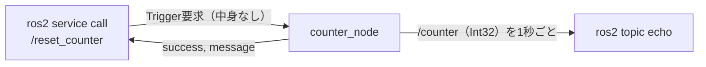

# フェーズ3-4 手順書: サービス（要求と応答）

`docs/learning_plan.md` フェーズ3（idea_origin.md ステップ1の1-4）に対応する。「1回の要求に1回の応答を返す」通信を、Python・C++の両方で書く。

- 想定環境: WSL2 + Ubuntu 24.04 + ROS2 Jazzy
- 前提: フェーズ3-1〜3-3完了
- 所要目安: 1コマ
- 言語: **Python・C++の両方**
- 使う標準インターフェース: `example_interfaces/srv/AddTwoInts`、`std_srvs/srv/Trigger`

> **進め方**: サンプルコードは隠していない。まず仕様を見て自分で書き、書き終えたら答え合わせと読み解きに「サンプルコードと解説」を使う。詰まったときも、解説を手がかりに該当部分だけ見比べればよい。サンプルはこの手順書の作成時にビルド確認済みで、ノードの実行結果は未確認（出力が違えば差分を貼ってほしい）。

## 0. 学習目標と完了条件

1. サービスのサーバ（`create_service`）とクライアント（`create_client`）を、Python・C++の両方で書ける。
2. 標準の `.srv` 定義（要求と応答の項目）を `ros2 interface show` で読める。
3. クライアントの**非同期呼び出し**（`call_async` / `async_send_request`）と、結果の待ち方を説明できる。
4. トピックとの使い分け（継続的な流れ vs 要求→応答）を、自分の言葉で説明できる。

## 1. 全体像


<details>
<summary>同じ図（mermaid版）</summary>



</details>

リセット用サービス（`Trigger`）の使い方:


<details>
<summary>同じ図（mermaid版）</summary>



</details>

インターフェースの定義を確認しておく:

```bash
ros2 interface show example_interfaces/srv/AddTwoInts
ros2 interface show std_srvs/srv/Trigger
```

`---` の上が要求（Request）、下が応答（Response）。

## 2. 仕様

### 2-1. `add_server` / `add_client`

| ノード | 役割 | サービス（型） | 動作 |
|---|---|---|---|
| `add_server` | サーバ | `add_two_ints`（`example_interfaces/srv/AddTwoInts`） | 要求の `a` と `b` を足した `sum` を返し、ログに出す |
| `add_client` | クライアント | `add_two_ints` | ROSパラメータ `a`、`b`（整数、既定 1 と 2）を要求に入れて1回呼び、結果をログに出して終了。サーバがいなければ5秒待って諦める |

### 2-2. `counter_node`（Trigger）

| 項目 | 内容 |
|---|---|
| ノード名・実行ファイル名 | `counter_node`（Python版・C++版で同一） |
| トピック（型） | `counter`（`std_msgs/msg/Int32`）に、1秒ごとにカウントアップした値を送る（0から） |
| サービス（型） | `reset_counter`（`std_srvs/srv/Trigger`）。呼ばれたらカウントを0に戻し、`success=true`、`message` に「リセット前の値」を入れて返す |

## 3. 準備: 依存の追加

両パッケージの `package.xml` に、次の2行を足す。

```xml
<depend>example_interfaces</depend>
<depend>std_srvs</depend>
```

C++（`ws/src/learn_cpp/CMakeLists.txt`）には、`find_package` も足す（既存の `find_package(...)` の並びへ）。

<!-- snippet: cmake_find_services -->
```cmake
find_package(example_interfaces REQUIRED)
find_package(std_srvs REQUIRED)
```

導入確認（`example_interfaces` が無い場合は導入をユーザーが行う）:

```bash
ros2 interface show example_interfaces/srv/AddTwoInts
```

## 4. Python版（`ws/src/learn_py`）

`ws/src/learn_py/learn_py/` に `add_server.py`, `add_client.py`, `counter_node.py` を作る。

主なAPI（rclpy）:

| やりたいこと | API |
|---|---|
| サーバの作成 | `self.create_service(型, 'サービス名', コールバック)`。コールバックは `(request, response)` を受け、`response` を**返す** |
| クライアントの作成 | `self.create_client(型, 'サービス名')` |
| サーバの待ち合わせ | `client.wait_for_service(timeout_sec=5.0)`（戻り値が真偽） |
| 非同期の呼び出し | `future = client.call_async(request)` |
| 結果の待ち方 | `rclpy.spin_until_future_complete(node, future)` の後に `future.result()` |

> **重要**: `spin_until_future_complete` は、**コールバックの中では呼ばない**（自分自身を止めて固まる）。`main` の中で使う。

### サンプルコードと解説（Python版）

ファイル: `ws/src/learn_py/learn_py/add_server.py`

<!-- file: ws/src/learn_py/learn_py/add_server.py -->
```python
import rclpy
from example_interfaces.srv import AddTwoInts
from rclpy.executors import ExternalShutdownException
from rclpy.node import Node


class AddServer(Node):
    def __init__(self):
        super().__init__('add_server')
        self.srv = self.create_service(AddTwoInts, 'add_two_ints', self.on_request)

    def on_request(self, request, response):
        response.sum = request.a + request.b
        self.get_logger().info(f'{request.a} + {request.b} = {response.sum}')
        return response


def main(args=None):
    rclpy.init(args=args)
    node = AddServer()
    try:
        rclpy.spin(node)
    except (KeyboardInterrupt, ExternalShutdownException):
        pass
    finally:
        node.destroy_node()
        rclpy.try_shutdown()
```

**解説: `add_server.py`**

役割は「`add_two_ints` という名前のサービスを公開し、要求が来るたびに `a + b` を計算して返す」こと。全体の流れは、ノードを作る → サービスを登録する → `spin` で要求を待ち続ける、の3段階。トピックの `listener` とほぼ同じ骨組みで、違いは「受け取ったら結果を返す」点だけである。

| 部分 | 何をしているか |
|---|---|
| `super().__init__('add_server')` | ノード名を `add_server` にして親クラスを初期化する。 |
| `self.create_service(AddTwoInts, 'add_two_ints', self.on_request)` | 引数は「サービス型」「サービス名」「要求が来たとき呼ぶ関数」の3つ。型は `.srv` ファイルに対応し、要求（`a`, `b`）と応答（`sum`）の形を決める。戻り値（`self.srv`）は変数に保持しておく。 |
| `on_request(self, request, response)` | サービスのコールバック。`request` に相手が送った値が、`response` に「中身が空の応答」が入って渡される。 |
| `response.sum = request.a + request.b` | 応答の欄を埋める。`AddTwoInts` の `a`, `b`, `sum` は `int64`（`ros2 interface show` で確認できる）。 |
| `return response` | **Pythonでは応答を戻り値として返す**。`return` を忘れると、サーバ側のコールバックでエラーになり、クライアントは応答を受け取れない（つまずきやすい点）。 |

`main` は、フェーズ3-1のノードと同じ定型である。`rclpy.spin(node)` の中で、要求が来るとコールバックが呼ばれる。`except (KeyboardInterrupt, ExternalShutdownException)` は `Ctrl+C` での終了を静かに扱うため、`finally` は後片付け（ノードの破棄とシャットダウン）のため。

観察ポイント: サーバだけを起動しても何も起きず、ログも出ない（要求が来て初めて動く）。`ros2 service list -t` で `/add_two_ints [example_interfaces/srv/AddTwoInts]` が見えること、`ros2 service call` で呼んだときにサーバ側のログが出ることを確認する。

ファイル: `ws/src/learn_py/learn_py/add_client.py`

<!-- file: ws/src/learn_py/learn_py/add_client.py -->
```python
import rclpy
from example_interfaces.srv import AddTwoInts
from rclpy.node import Node


class AddClient(Node):
    def __init__(self):
        super().__init__('add_client')
        self.declare_parameter('a', 1)
        self.declare_parameter('b', 2)
        self.cli = self.create_client(AddTwoInts, 'add_two_ints')


def main(args=None):
    rclpy.init(args=args)
    node = AddClient()
    try:
        if not node.cli.wait_for_service(timeout_sec=5.0):
            node.get_logger().error('service add_two_ints is not available')
            return
        request = AddTwoInts.Request()
        request.a = node.get_parameter('a').value
        request.b = node.get_parameter('b').value
        future = node.cli.call_async(request)
        rclpy.spin_until_future_complete(node, future)
        if future.result() is not None:
            node.get_logger().info(
                f'{request.a} + {request.b} = {future.result().sum}')
        else:
            node.get_logger().error(f'call failed: {future.exception()}')
    except KeyboardInterrupt:
        pass
    finally:
        node.destroy_node()
        rclpy.try_shutdown()
```

**解説: `add_client.py`**

役割は「サーバを見つけ、`a`, `b` を送って1回だけ呼び、答えをログに出して終わる」こと。サーバやパブリッシャと違い、`spin` し続けるノードではなく、**1回の仕事が終わったら `main` を抜けて終了する**形になっている。

- **`__init__`**: パラメータ `a`, `b` を既定値付きで宣言し（フェーズ3-3の復習）、`create_client(AddTwoInts, 'add_two_ints')` でクライアントを作る。クライアントを作っただけでは、まだ通信は始まらない。
- **`wait_for_service(timeout_sec=5.0)`**: サーバが見つかるまで最大5秒待ち、見つかれば `True`、見つからなければ `False` を返す。これを挟まずにいきなり呼ぶと、サーバ起動前だった場合に要求が届かない。`False` のときはエラーログを出して `return` する。
- **要求の組み立て**: `AddTwoInts.Request()` で空の要求を作り、`node.get_parameter('a').value` で取り出した値を詰める。`.value` を付け忘れると、`Parameter` オブジェクトそのものを詰めようとして型エラーになる。
- **`call_async(request)`**: 要求を送って、すぐ `future`（あとで結果が入る箱）を返す。ここでは結果はまだ無い。
- **`rclpy.spin_until_future_complete(node, future)`**: `future` に結果が入るまでノードを回す（この間に応答を受け取る処理が動く）。これが終わってから `future.result()` で `Response` を取り出す。`result()` が `None` のときは呼び出しが失敗しており、`future.exception()` で原因が見られる。

> なぜ「非同期」か: `call_async` は応答を待たずにすぐ戻るので、「結果をいつ取りに行くか」は自分で決める必要がある。このコードは `main` の中で `spin_until_future_complete` を使って待つ。ノードのコールバックの中から別のサービスを呼びたい場合は、この待ち方は使えない（上の「重要」の注意）ので、futureの完了時に呼ばれるコールバックで結果を受ける、などの別の方法になる（このフェーズでは扱わない）。

落とし穴:

- `wait_for_service` が `False` のとき、このコードは `return` するだけで、終了コードは0のままになる（C++版は `return 1`）。スクリプトから結果を判定したい場合は、ここが差になる。
- `-p a:=3.0` のように実数を渡すと、宣言した型（整数）と合わず、パラメータの設定でエラーになる。整数で渡す。

動作確認: サーバを起動した状態で `ros2 run learn_py add_client`（既定なら `1 + 2 = 3`）と、`ros2 run learn_py add_client --ros-args -p a:=10 -p b:=20` を実行する。サーバを止めた状態で実行すると、約5秒後にエラーログが出て終わることも確認する。

ファイル: `ws/src/learn_py/learn_py/counter_node.py`

<!-- file: ws/src/learn_py/learn_py/counter_node.py -->
```python
import rclpy
from rclpy.executors import ExternalShutdownException
from rclpy.node import Node
from std_msgs.msg import Int32
from std_srvs.srv import Trigger


class CounterNode(Node):
    def __init__(self):
        super().__init__('counter_node')
        self.count = 0
        self.pub = self.create_publisher(Int32, 'counter', 10)
        self.timer = self.create_timer(1.0, self.on_timer)
        self.srv = self.create_service(Trigger, 'reset_counter', self.on_reset)

    def on_timer(self):
        msg = Int32()
        msg.data = self.count
        self.pub.publish(msg)
        self.count += 1

    def on_reset(self, request, response):
        response.success = True
        response.message = f'counter reset (was {self.count})'
        self.count = 0
        self.get_logger().info(response.message)
        return response


def main(args=None):
    rclpy.init(args=args)
    node = CounterNode()
    try:
        rclpy.spin(node)
    except (KeyboardInterrupt, ExternalShutdownException):
        pass
    finally:
        node.destroy_node()
        rclpy.try_shutdown()
```

**解説: `counter_node.py`**

役割は「1秒ごとにカウントを配信しつつ、`reset_counter` サービスで0に戻せる」こと。**1つのノードにトピックの発行（タイマー）とサービスのサーバが同居する**例で、トピックは継続的な流れ、サービスは必要なときの操作、という使い分け（後述の§7）を1本のノードで体感できる。

| 部分 | 何をしているか |
|---|---|
| `self.count = 0` | ノードが持つ状態。タイマーのコールバックとサービスのコールバックの**両方が同じ変数を読み書きする**。 |
| `create_publisher` / `create_timer` | フェーズ3-1と同じ。1秒ごとに `on_timer` が呼ばれる。 |
| `create_service(Trigger, 'reset_counter', self.on_reset)` | `Trigger` は要求が空で、応答が `success`（真偽）と `message`（文字列）だけの標準サービス型。「引数の要らない合図」を送る用途に向く。 |
| `on_timer` | 今の `count` を配信してから `+1` する。最初に配信される値は0。 |
| `on_reset` | `success` を真にし、`message` に**リセット前の値**を入れてから `count` を0に戻す。順序が大事で、先に0にすると「リセット前の値」が取れない。 |

`on_reset` の引数 `request` は、`Trigger` の要求が空なので使っていない。それでも引数としては必要である（省くとコールバックの呼び出しでエラーになる）。

同じ変数を2つのコールバックが触っても安全なのは、`rclpy.spin` の既定の実行方式（シングルスレッド）では、コールバックが**同時には動かず1つずつ順に処理される**ため。複数スレッドの実行方式に変えると、この前提が崩れて排他制御が必要になる（このフェーズでは扱わない）。

観察ポイント: `ros2 topic echo /counter` を見ながら `ros2 service call /reset_counter std_srvs/srv/Trigger` を実行し、値が0に戻ること、応答の `message` に直前の値が入っていることを確認する（§6-2）。

### 登録とビルド

`setup.py` の `entry_points` に3行を足し、再ビルドする。

<!-- snippet: py_entry_points_service -->
```python
            'add_server = learn_py.add_server:main',
            'add_client = learn_py.add_client:main',
            'counter_node = learn_py.counter_node:main',
```

```bash
cd ~/work/ros2MinimalPhysicalAi/ws
colcon build --symlink-install --packages-select learn_py
source install/setup.bash
```

## 5. C++版（`ws/src/learn_cpp`）

`ws/src/learn_cpp/src/` に `add_server.cpp`, `add_client.cpp`, `counter_node.cpp` を作る。

主なAPI（rclcpp）:

| やりたいこと | API |
|---|---|
| サーバの作成 | `create_service<型>("サービス名", コールバック)`。コールバックは `(Request::SharedPtr, Response::SharedPtr)` を受け、`response` に**書き込む**（Pythonと違い戻り値は無い） |
| クライアントの作成 | `create_client<型>("サービス名")` |
| サーバの待ち合わせ | `client->wait_for_service(5s)`（戻り値が真偽） |
| 非同期の呼び出し | `auto future = client->async_send_request(request);` |
| 結果の待ち方 | `rclcpp::spin_until_future_complete(node, future)` が `SUCCESS` なら `future.get()` |

Pythonとの違いの見どころ: 応答を「返す」のか「書き込む」のか、型名が `Request`/`Response` のネストした型になること。

### サンプルコードと解説（C++版）

ファイル: `ws/src/learn_cpp/src/add_server.cpp`

<!-- file: ws/src/learn_cpp/src/add_server.cpp -->
```cpp
#include <memory>

#include "example_interfaces/srv/add_two_ints.hpp"
#include "rclcpp/rclcpp.hpp"

using AddTwoInts = example_interfaces::srv::AddTwoInts;

class AddServer : public rclcpp::Node
{
public:
  AddServer() : Node("add_server")
  {
    service_ = create_service<AddTwoInts>(
      "add_two_ints",
      [this](
        const std::shared_ptr<AddTwoInts::Request> request,
        std::shared_ptr<AddTwoInts::Response> response) {
        response->sum = request->a + request->b;
        RCLCPP_INFO(
          get_logger(), "%lld + %lld = %lld",
          static_cast<long long>(request->a), static_cast<long long>(request->b),
          static_cast<long long>(response->sum));
      });
  }

private:
  rclcpp::Service<AddTwoInts>::SharedPtr service_;
};

int main(int argc, char ** argv)
{
  rclcpp::init(argc, argv);
  rclcpp::spin(std::make_shared<AddServer>());
  rclcpp::shutdown();
  return 0;
}
```

**解説: `add_server.cpp`**

Python版と同じ「要求を受けて `a + b` を返す」サーバ。差分を中心に読む。

- **`using AddTwoInts = ...`**: 長い型名に別名を付けている。`example_interfaces::srv::AddTwoInts` は `.srv` から自動生成された型で、`Request` と `Response` がその中にネストしている（`AddTwoInts::Request`）。ヘッダ名は `add_two_ints.hpp`（型名をスネークケースにしたもの）で、`CMakeLists.txt` の依存に `example_interfaces` が必要。
- **`create_service<AddTwoInts>("add_two_ints", ラムダ式)`**: 型はテンプレート引数で、サービス名とコールバックを渡す。戻り値は `rclcpp::Service<AddTwoInts>::SharedPtr` で、**メンバ変数 `service_` に保持する**。保持しないとこの行の終わりで破棄され、サービスが消える。
- **コールバックの引数**: `(request, response)` の両方が `shared_ptr` で渡されるので、`->` で欄にアクセスする。**応答は戻り値ではなく `response` に書き込む**（Pythonとの最大の違い）。ラムダは `[this]` で自分自身（ノード）を捕まえており、`get_logger()` を呼ぶために必要。
- **`static_cast<long long>` と `%lld`**: `a`, `b`, `sum` は `int64_t`。`printf` 系の書式指定は環境によって `int64_t` の実体（`long` か `long long`）が違うため、`long long` に揃えて `%lld` で出す、という安全策である。
- **`main`**: `rclcpp::spin(std::make_shared<AddServer>())` で、ノードの生成と待ち受けを1行で行う。`Ctrl+C` で `spin` から戻り、`shutdown()` で終わる。

観察ポイント: Python版のサーバと**入れ替えても、同じクライアントから同じ結果が返る**こと（サービス名と型が同じなら、実装言語は関係ない）。

ファイル: `ws/src/learn_cpp/src/add_client.cpp`

<!-- file: ws/src/learn_cpp/src/add_client.cpp -->
```cpp
#include <chrono>
#include <cstdint>
#include <memory>

#include "example_interfaces/srv/add_two_ints.hpp"
#include "rclcpp/rclcpp.hpp"

using namespace std::chrono_literals;
using AddTwoInts = example_interfaces::srv::AddTwoInts;

int main(int argc, char ** argv)
{
  rclcpp::init(argc, argv);
  auto node = rclcpp::Node::make_shared("add_client");
  const int64_t a = node->declare_parameter<int64_t>("a", 1);
  const int64_t b = node->declare_parameter<int64_t>("b", 2);

  auto client = node->create_client<AddTwoInts>("add_two_ints");
  if (!client->wait_for_service(5s)) {
    RCLCPP_ERROR(node->get_logger(), "service add_two_ints is not available");
    rclcpp::shutdown();
    return 1;
  }

  auto request = std::make_shared<AddTwoInts::Request>();
  request->a = a;
  request->b = b;
  auto future = client->async_send_request(request);
  if (rclcpp::spin_until_future_complete(node, future) == rclcpp::FutureReturnCode::SUCCESS) {
    RCLCPP_INFO(
      node->get_logger(), "%lld + %lld = %lld",
      static_cast<long long>(a), static_cast<long long>(b),
      static_cast<long long>(future.get()->sum));
  } else {
    RCLCPP_ERROR(node->get_logger(), "call failed");
  }
  rclcpp::shutdown();
  return 0;
}
```

**解説: `add_client.cpp`**

Python版と同じ流れ（待つ → 要求を作る → 非同期に送る → 結果を待つ）を、`main` の中に順に書いている。クラスを作らず `rclcpp::Node::make_shared("add_client")` でノードを直接作るのが、Python版との構造上の違い。

- **`declare_parameter<int64_t>("a", 1)`**: 型をテンプレート引数で指定して宣言し、宣言時に値を受け取る。Python版の `declare_parameter` + `get_parameter(...).value` の2段階が1行にまとまっている。
- **`using namespace std::chrono_literals;` と `wait_for_service(5s)`**: `5s` は「5秒」を表すリテラルで、この `using` が無いとコンパイルできない。戻り値が `false` ならエラーログを出し、`rclcpp::shutdown()` して**終了コード1**で終わる（Python版は0のまま）。
- **`make_shared<AddTwoInts::Request>()`**: 要求は `shared_ptr` で作り、`request->a = a;` のように詰める。
- **`async_send_request(request)`**: Pythonの `call_async` に相当し、`future`（`shared_future`）を返す。
- **`spin_until_future_complete(node, future)`**: 戻り値は `FutureReturnCode`。`SUCCESS` のときだけ `future.get()` で応答（`shared_ptr`）を取り出し、`->sum` を読む。それ以外（`TIMEOUT` や `INTERRUPTED`）は失敗として扱う。Pythonの `result() is not None` の判定に当たる。

落とし穴: `future.get()` は、結果が入っていない状態で呼ぶと待たされるか例外になる。**先に戻り値が `SUCCESS` であることを確認してから**呼ぶ、という順序を守る。また、`spin_until_future_complete` を**サービスのコールバックの中で呼ぶ**と固まる（§4の「重要」と同じ理由）。

動作確認: Python版と同様に、`ros2 run learn_cpp add_client` と `--ros-args -p a:=10 -p b:=20` を、サーバありとなしの両方で試す。サーバなしのときは約5秒後にエラーログが出て、`echo $?` で終了コード1が見える。

ファイル: `ws/src/learn_cpp/src/counter_node.cpp`

<!-- file: ws/src/learn_cpp/src/counter_node.cpp -->
```cpp
#include <chrono>
#include <memory>
#include <string>

#include "rclcpp/rclcpp.hpp"
#include "std_msgs/msg/int32.hpp"
#include "std_srvs/srv/trigger.hpp"

using namespace std::chrono_literals;

class CounterNode : public rclcpp::Node
{
public:
  CounterNode() : Node("counter_node")
  {
    pub_ = create_publisher<std_msgs::msg::Int32>("counter", 10);
    timer_ = create_wall_timer(1s, [this]() { on_timer(); });
    service_ = create_service<std_srvs::srv::Trigger>(
      "reset_counter",
      [this](
        const std::shared_ptr<std_srvs::srv::Trigger::Request>,
        std::shared_ptr<std_srvs::srv::Trigger::Response> response) {
        response->success = true;
        response->message = "counter reset (was " + std::to_string(count_) + ")";
        count_ = 0;
        RCLCPP_INFO(get_logger(), "%s", response->message.c_str());
      });
  }

private:
  void on_timer()
  {
    std_msgs::msg::Int32 msg;
    msg.data = count_++;
    pub_->publish(msg);
  }

  rclcpp::Publisher<std_msgs::msg::Int32>::SharedPtr pub_;
  rclcpp::TimerBase::SharedPtr timer_;
  rclcpp::Service<std_srvs::srv::Trigger>::SharedPtr service_;
  int count_ = 0;
};

int main(int argc, char ** argv)
{
  rclcpp::init(argc, argv);
  rclcpp::spin(std::make_shared<CounterNode>());
  rclcpp::shutdown();
  return 0;
}
```

**解説: `counter_node.cpp`**

Python版と同じく、タイマーによる配信と `reset_counter` サービスを1ノードに同居させている。

- **`create_wall_timer(1s, [this]() { on_timer(); })`**: 1秒周期のタイマー。ラムダ経由でメンバ関数を呼んでいる。
- **`create_service<std_srvs::srv::Trigger>(...)`**: `Trigger` の型もヘッダ（`std_srvs/srv/trigger.hpp`）も `std_srvs` パッケージのもので、`CMakeLists.txt` の依存に `std_srvs` が要る。
- **コールバックの第1引数（要求）に名前が無い**: `Trigger` の要求は空で使わないため、あえて変数名を書かない。名前を付けて使わないと「未使用引数」の警告が出るので、この書き方が定番である。
- **`response->message = "counter reset (was " + std::to_string(count_) + ")";`**: 文字列とカウンタを連結して、リセット前の値を入れる。その後で `count_ = 0;`。順序はPython版と同じで、先に0にするとリセット前の値が取れない。ログ出力の `%s` には `c_str()` が要る。
- **`msg.data = count_++;`**: 「今の値を `data` に入れてから、`count_` を1増やす」（後置インクリメント）。配信される最初の値は0で、Python版の「配信してから加算」と同じ結果になる。
- **メンバ変数**: `pub_`, `timer_`, `service_` はいずれも保持が必要（消えると機能が止まる）。`count_` は、`spin` の既定ではコールバックが1つずつ順に呼ばれるので、排他制御なしで2つのコールバックから触れる。

観察ポイント: Python版と同じ実験（§6-2）で、値が0に戻ること、`message` にリセット前の値が入ることを確認する。Python版とC++版で結果が同じになるかも見比べる。

### 登録とビルド

`CMakeLists.txt` に追記し、`install(TARGETS ...)` に名前を足す（これまでの分は残す）。

<!-- snippet: cmake_service -->
```cmake
add_executable(add_server src/add_server.cpp)
ament_target_dependencies(add_server rclcpp example_interfaces)

add_executable(add_client src/add_client.cpp)
ament_target_dependencies(add_client rclcpp example_interfaces)

add_executable(counter_node src/counter_node.cpp)
ament_target_dependencies(counter_node rclcpp std_msgs std_srvs)

install(TARGETS
  hello
  talker
  listener
  sine_pub
  sine_sub
  turtle_circle
  qos_talker
  qos_listener
  param_talker
  add_server
  add_client
  counter_node
  DESTINATION lib/${PROJECT_NAME})
```

```bash
cd ~/work/ros2MinimalPhysicalAi/ws
colcon build --symlink-install --packages-select learn_cpp
source install/setup.bash
```

## 6. 実験

### 6-1. AddTwoInts

```bash
# T1
ros2 run learn_py add_server
# T2
ros2 run learn_py add_client --ros-args -p a:=3 -p b:=4
```

CLIからも呼べる:

```bash
ros2 service call /add_two_ints example_interfaces/srv/AddTwoInts "{a: 10, b: 20}"
```

言語の組み合わせを試す:

| 組み合わせ | T1 | T2 |
|---|---|---|
| Python × Python | `ros2 run learn_py add_server` | `ros2 run learn_py add_client ...` |
| Python × C++ | `ros2 run learn_py add_server` | `ros2 run learn_cpp add_client ...` |
| C++ × Python | `ros2 run learn_cpp add_server` | `ros2 run learn_py add_client ...` |
| C++ × C++ | `ros2 run learn_cpp add_server` | `ros2 run learn_cpp add_client ...` |

> 課題1: サーバを**起動しない**でクライアントを起動し、5秒待って諦めるメッセージが出ることを確認する。
>
> 課題2: クライアントを先に起動し、5秒以内にサーバを起動して、呼び出しが成功することを確認する（`wait_for_service` の効果）。
>
> 課題3: `ros2 service list -t`、`ros2 service type /add_two_ints`、`ros2 node info /add_server` で、サービスがどう見えるか確認する。

### 6-2. Trigger（カウンタのリセット）

```bash
# T1
ros2 run learn_py counter_node
# T2
ros2 topic echo /counter
# T3
ros2 service call /reset_counter std_srvs/srv/Trigger
```

`echo` の値が0に戻り、サービスの応答に `success=True` と `message`（リセット前の値）が入っていることを確認する。C++版でも同様に確認する。

> 課題4: サーバ（`add_server`）の中で `time.sleep(3)`（C++は `std::this_thread::sleep_for`）を入れて、クライアントの呼び出しが3秒ブロックされることを確認する。その間、サーバの他のコールバック（タイマー等）はどうなるか考える（現状は1スレッドの `spin` なので止まる）。
>
> 課題5（発展）: `Trigger` のクライアントを自分で書き、`counter_node` をリセットするだけのノードを作る（AddTwoIntsのクライアントとの違いは、要求に中身がない点だけ）。

## 7. トピックとサービスの使い分け

| 観点 | トピック | サービス |
|---|---|---|
| 通信の形 | 一方向・継続的 | 要求→応答（1回） |
| 相手を待つか | 待たない | 応答を待つ（非同期でも結果を待つ） |
| 向く用途 | センサ値、指令の連続送信 | 状態のリセット、設定の取得、一度だけの計算 |
| フェーズ5での使いどころ | 速度、制御指令 | シミュレーションのリセット、制御の有効/無効 |

長くかかる処理で、途中経過を知りたい場合は、サービスではなく**アクション**（フェーズ3-5）を使う。

## 8. 記録用の表

| 観点 | Python | C++ |
|---|---|---|
| サーバのコールバックの書き方（応答の返し方） | | |
| クライアントの待ち方 | | |
| `wait_for_service` の書き方 | | |
| 型名（`Request`/`Response`）の扱い | | |
| つまずいた点 | | |

## 9. つまずきやすい点

| 症状 | 確認すること |
|---|---|
| クライアントが固まる | サーバが動いているか。`ros2 service list` に出るか。サービス名の綴り |
| Pythonのクライアントが無反応 | `spin_until_future_complete` を呼んでいるか。コールバック内で呼んでいないか |
| C++で `%ld` の警告 | `int64_t` は環境で `long` / `long long` が異なるため、`static_cast<long long>` と `%lld` にそろえる |
| サーバが応答しない（Python） | コールバックの最後で `return response` しているか |
| ビルドで `example_interfaces` が見つからない | `package.xml` の `<depend>`、`CMakeLists.txt` の `find_package(example_interfaces REQUIRED)` |
| `ros2 service call` の引数が通らない | YAMLの書式（`"{a: 10, b: 20}"`、コロンの後ろに空白） |

## 10. 次へ

フェーズ3-5（`docs/phase3_5_actions.md`）で、途中経過を返せる「アクション」を扱う。

## 11. 公式ドキュメント・参考資料

確認状況（2026-09-20）: 下記は `docs/idea_origin.md` に掲載済みのURLで、今回は再確認していない（docs.ros.orgは本文取得がボット対策で拒否される）。

### 公式（ROS 2 Jazzy）

- [Writing a simple service and client (Python) — Jazzy](https://docs.ros.org/en/jazzy/Tutorials/Beginner-Client-Libraries/Writing-A-Simple-Py-Service-And-Client.html)
- [Writing a simple service and client (C++) — Jazzy](https://docs.ros.org/en/jazzy/Tutorials/Beginner-Client-Libraries/Writing-A-Simple-Cpp-Service-And-Client.html)
- [ros2/common_interfaces（GitHub）](https://github.com/ros2/common_interfaces)（`std_srvs` の定義）

> 公式ドキュメントと食い違う場合は、公式を優先する。

> 出典: 各サンプルのAPIの使い方は、上記の公式チュートリアルを参考にした（ROS 2ドキュメントはCC BY 4.0）。ノード名・仕様・コード・文章は独自に書いたもので、逐語の転載ではない。
