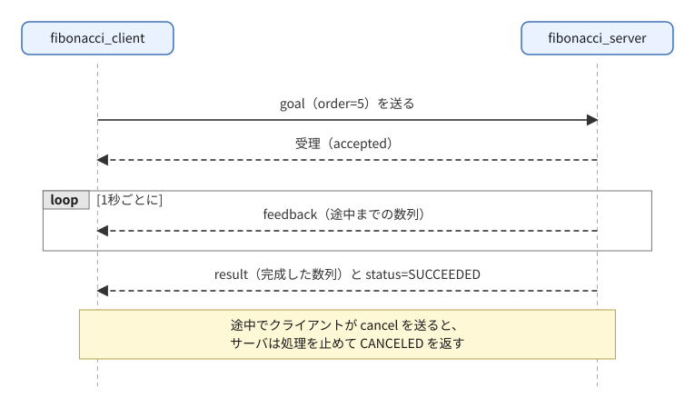
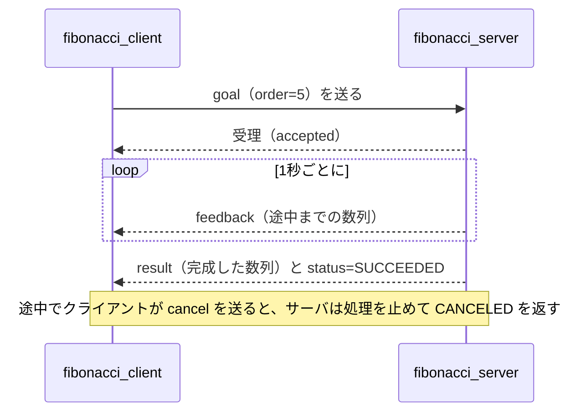
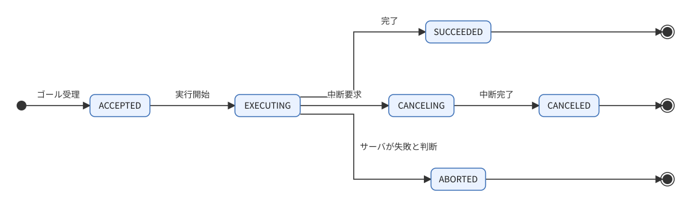
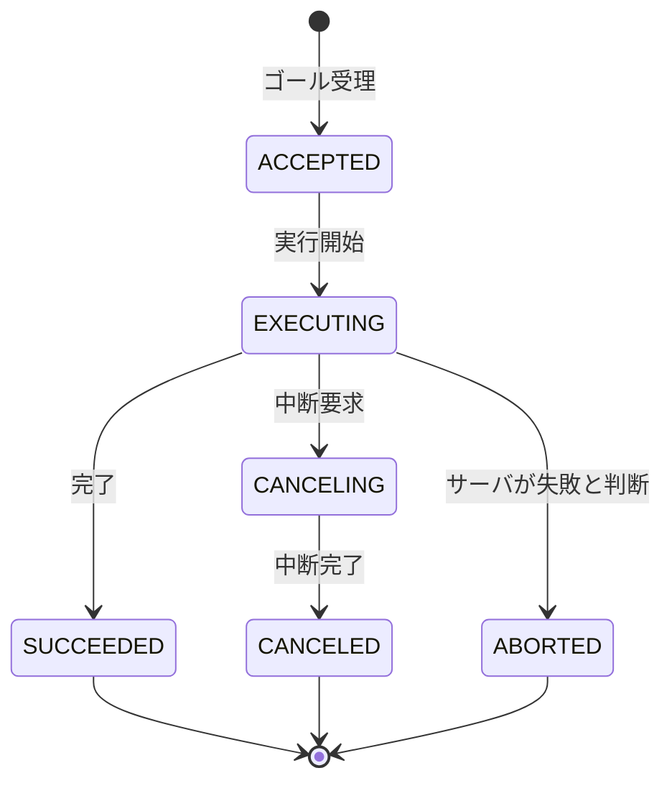

# フェーズ3-5 手順書: アクション（途中経過つき・中断できる長い処理）

`docs/learning_plan.md` フェーズ3（idea_origin.md ステップ1の1-5）に対応する。時間のかかる処理に対し、ゴールの送信・途中経過（フィードバック）・最終結果・中断を扱う通信を、Python・C++の両方で書く。

- 想定環境: WSL2 + Ubuntu 24.04 + ROS2 Jazzy
- 前提: フェーズ3-1〜3-4完了
- 所要目安: 2コマ（コード量が多い）
- 言語: **Python・C++の両方**
- 使う標準インターフェース: `example_interfaces/action/Fibonacci`（WSLの `/opt/ros/jazzy/share/example_interfaces/action/Fibonacci.action` で内容を確認済み）

> **進め方**: 今までより長いので、まず**Pythonを完成**させ、動作を理解してからC++に進む。サンプルコードと解説は隠さずに載せてある。まず仕様（§2）から自分で書き、答え合わせや、コードの読み解きにサンプルと解説を使う。サンプルはこの手順書の作成時にビルド確認済みで、ノードの実行結果は未確認（出力が違えば差分を貼ってほしい）。

## 0. 学習目標と完了条件

1. アクションサーバ・クライアントを、Python・C++の両方で書ける。
2. ゴール（goal）・フィードバック（feedback）・結果（result）・中断（cancel）の流れを説明できる。
3. **サーバの処理中に中断要求を受け付ける**ために、実行の仕組み（Pythonはマルチスレッドexecutor、C++は別スレッド）が必要なことを説明できる。
4. サービスとアクションの使い分けを説明できる。

## 1. 全体像



<details>
<summary>同じ図（mermaid版）</summary>



</details>

ゴールの状態遷移:



<details>
<summary>同じ図（mermaid版）</summary>



</details>

インターフェースを確認する:

```bash
ros2 interface show example_interfaces/action/Fibonacci
```

`---` で3つに分かれる: 上から**ゴール**（`order`）、**結果**（`sequence`）、**フィードバック**（`sequence`）。

サービスとの違い:

| 観点 | サービス | アクション |
|---|---|---|
| 途中経過 | なし | あり（feedback） |
| 中断 | できない | できる（cancel） |
| 向く処理 | 短い | 数秒〜数分かかる |

## 2. 仕様

| ノード | 役割 | アクション名（型） | 動作 |
|---|---|---|---|
| `fibonacci_server` | サーバ | `fibonacci`（`example_interfaces/action/Fibonacci`） | ゴール `order`（1以上）を受け、数列 `[0, 1]` から始めて、**1秒ごとに**次の項を足し、その時点の数列をフィードバックとして送る。`order - 1` 回の加算を終えたら、結果に完成した数列（`order + 1` 項）を入れて成功で終わる。`order < 1` のゴールは**拒否**する。処理中に中断要求を受けたら、処理を止めて `CANCELED` で終わる |
| `fibonacci_client` | クライアント | `fibonacci` | ROSパラメータ `order`（整数、既定5）でゴールを送り、フィードバックをログに出し、結果を受けて終了する。パラメータ `cancel_after`（実数、秒、既定 `0.0`）が正なら、ゴール受理からその秒数後に中断要求を送る。サーバがいなければ5秒待って諦める |

例: `order = 5` → 結果の数列は `[0, 1, 1, 2, 3, 5]`（6項）。

## 3. 準備: 依存の追加

**Python（`ws/src/learn_py/package.xml`）**: 次の行を足す（`example_interfaces` は3-4で追加済み）。

```xml
<depend>action_msgs</depend>
```

**C++（`ws/src/learn_cpp/package.xml`）**: 次の行を足す。

```xml
<depend>rclcpp_action</depend>
```

C++の `CMakeLists.txt` にも足す（既存の `find_package(...)` の並びへ）。

<!-- snippet: cmake_find_action -->
```cmake
find_package(rclcpp_action REQUIRED)
```

## 4. Python版（`ws/src/learn_py`）

`ws/src/learn_py/learn_py/` に `fibonacci_server.py`, `fibonacci_client.py` を作る。

主なAPI（rclpy）:

| やりたいこと | API |
|---|---|
| サーバの作成 | `ActionServer(self, 型, 'アクション名', execute_callback=..., goal_callback=..., cancel_callback=...)` |
| ゴールを受けるか決める | `goal_callback` が `GoalResponse.ACCEPT` / `REJECT` を返す |
| 中断を受けるか決める | `cancel_callback` が `CancelResponse.ACCEPT` / `REJECT` を返す |
| 実行処理 | `execute_callback(goal_handle)`。`goal_handle.request` が受けたゴール。`goal_handle.publish_feedback(...)`、`goal_handle.succeed()` / `canceled()`、最後に**結果を返す** |
| 中断の検知 | `goal_handle.is_cancel_requested` |
| クライアントの作成 | `ActionClient(self, 型, 'アクション名')` |
| ゴール送信 | `client.send_goal_async(goal, feedback_callback=...)`（Futureを返す） |
| 結果の取得 | `goal_handle.get_result_async()`（Futureを返す）。`add_done_callback` で受ける |
| 中断要求 | `goal_handle.cancel_goal_async()` |

> **重要（中断の仕組み）**: サーバの実行処理が `time.sleep` で待っている間、通常の単一スレッドのexecutorでは、他のコールバック（中断要求の受付）が動けない。そこで、`MultiThreadedExecutor` と `ReentrantCallbackGroup` を使い、実行処理と並行して中断要求を処理できるようにする。C++版では代わりに、実行処理を**別スレッド**で行う。

### サンプルコードと解説（Python）

ファイル: `ws/src/learn_py/learn_py/fibonacci_server.py`

<!-- file: ws/src/learn_py/learn_py/fibonacci_server.py -->
```python
import time

import rclpy
from example_interfaces.action import Fibonacci
from rclpy.action import ActionServer, CancelResponse, GoalResponse
from rclpy.callback_groups import ReentrantCallbackGroup
from rclpy.executors import ExternalShutdownException, MultiThreadedExecutor
from rclpy.node import Node


class FibonacciServer(Node):
    def __init__(self):
        super().__init__('fibonacci_server')
        self.server = ActionServer(
            self, Fibonacci, 'fibonacci',
            execute_callback=self.execute,
            goal_callback=self.on_goal,
            cancel_callback=self.on_cancel,
            callback_group=ReentrantCallbackGroup())

    def on_goal(self, goal_request):
        if goal_request.order < 1:
            self.get_logger().warn(f'reject goal: order={goal_request.order}')
            return GoalResponse.REJECT
        self.get_logger().info(f'accept goal: order={goal_request.order}')
        return GoalResponse.ACCEPT

    def on_cancel(self, goal_handle):
        self.get_logger().info('cancel requested')
        return CancelResponse.ACCEPT

    def execute(self, goal_handle):
        order = goal_handle.request.order
        sequence = [0, 1]
        feedback = Fibonacci.Feedback()
        result = Fibonacci.Result()
        for i in range(1, order):
            if goal_handle.is_cancel_requested:
                goal_handle.canceled()
                result.sequence = sequence
                self.get_logger().info('goal canceled')
                return result
            sequence.append(sequence[i] + sequence[i - 1])
            feedback.sequence = sequence
            goal_handle.publish_feedback(feedback)
            time.sleep(1.0)
        goal_handle.succeed()
        result.sequence = sequence
        self.get_logger().info(f'goal succeeded: {list(sequence)}')
        return result


def main(args=None):
    rclpy.init(args=args)
    node = FibonacciServer()
    executor = MultiThreadedExecutor()
    try:
        rclpy.spin(node, executor=executor)
    except (KeyboardInterrupt, ExternalShutdownException):
        pass
    finally:
        node.destroy_node()
        rclpy.try_shutdown()
```

**解説: `fibonacci_server.py`**

役割は「ゴールを受け、1秒ごとに数列を伸ばしながら feedback を返し、最後に result を返す」こと。流れは、(1) ゴールが届くと `on_goal` が受理か拒否かを決める → (2) 受理されたら（ACCEPTED）`execute` が呼ばれて実行に入る（EXECUTING）→ (3) ループの各周回で中断要求を確認し、なければ項を足して feedback を出し、1秒待つ → (4) 終われば `succeed()`（SUCCEEDED）、中断要求があれば `canceled()`（CANCELED）、のどちらかで終わる。§1の状態遷移図のうち、サーバ側が担当するのがこの部分。

- **import とクラス**: `ActionServer`・`GoalResponse`・`CancelResponse` は `rclpy.action` から取る。`ReentrantCallbackGroup` と `MultiThreadedExecutor` は、後述の「中断を受け付ける仕組み」のために使う。
- **`ActionServer(...)` の引数**: 第1〜3引数は「ノード、アクション型、アクション名」。`execute_callback` は受理されたゴールを実際に処理する関数、`goal_callback` は届いたゴールを受けるか決める関数、`cancel_callback` は中断要求を受けるか決める関数。`goal_callback` と `cancel_callback` は省略もでき、省略した場合の既定は「ゴールは受理、中断要求は**拒否**」（中断を受け付けたいなら `cancel_callback` で受理を返す必要がある。実機での確認は未実施）。本手順書では動作を見るために明示している。
- **`on_goal`**: 引数はゴールの中身（`goal_request.order`）。`GoalResponse.REJECT` を返すと、クライアントには「拒否された」が届き、`execute` は呼ばれない。仕様の「`order < 1` は拒否」はここで実現している。
- **`on_cancel`**: 中断要求が来たときに呼ばれ、`CancelResponse.ACCEPT` を返すとゴールが CANCELING に入り、`goal_handle.is_cancel_requested` が `True` になる。`REJECT` を返せば、中断できないゴールとして扱える。
- **`execute`**: `goal_handle.request` がゴール本体。`Fibonacci.Feedback()` と `Fibonacci.Result()` は、送るメッセージの入れ物を先に作っておいて使い回している。ループ `range(1, order)` は `order - 1` 回まわり、初期の2項と合わせて `order + 1` 項になる（仕様どおり）。`sequence[i] + sequence[i - 1]` が「直前2項の和」。
- **`publish_feedback`**: 呼んだ瞬間に feedback がクライアントへ飛ぶ。ループの先頭で1回目を出してから `time.sleep(1.0)` するので、最初の feedback はほぼ即座に、以降は約1秒間隔で届く。
- **`succeed()` と `canceled()`**: どちらも「ゴールの最終状態を宣言する」呼び出しで、**戻り値として結果を返すのとは別**。宣言のあとに `return result` で結果本体をクライアントへ渡す。宣言を忘れると、`execute` が戻ったときに警告が出てゴールは ABORTED 扱いになる（実機での確認は未実施）。`canceled()` は中断要求を受け付けたあと（CANCELING のとき）に呼ぶ、という順序も守る。
- **なぜ `MultiThreadedExecutor` と `ReentrantCallbackGroup` が要るか**: `execute` は `time.sleep` を含む長い処理で、その間ずっとexecutorのスレッドを占有する。単一スレッドのexecutorだと、その間に届いた中断要求（`on_cancel`）は順番待ちになり、`execute` が終わるまで処理されない。複数スレッドのexecutorに変えたうえで、`ReentrantCallbackGroup`（同じグループのコールバックを同時に動かしてよい）にしておくと、`execute` の実行中に別スレッドで `on_cancel` が動ける。課題3はこの効果を外して確認するもの。同じ理由で、課題4のように2つのゴールを並行処理できるのも、この2つのおかげ。
- **`main`**: `rclpy.spin(node, executor=executor)` にexecutorを渡すのが要点。`ExternalShutdownException` は外部からシャットダウンされたときの例外で、`Ctrl+C` の `KeyboardInterrupt` と一緒に握りつぶして静かに終わらせている。

つまずきやすい点と観察ポイント:

- 中断要求はループの**先頭でしか**確認していないため、クライアントの cancel から反応までに最大1秒ほど遅れる。ログの `cancel requested`（`on_cancel`）と `goal canceled`（`execute`）の時刻差に注目するとよい。
- 最後の周回の `sleep` 中に中断要求が届いた場合、ループを抜けたあとに確認がないので、そのまま `succeed()` に進む。学習用のコードでは許容しているが、厳密には `succeed()` の前にも `is_cancel_requested` を確認した方がよい（発展課題）。
- `feedback.sequence = sequence` は同じリストを指しているだけで、コピーではない。この例では毎回送信のたびにシリアライズされるので問題ないが、別スレッドで書き換えるコードを書く場合は注意する。

ファイル: `ws/src/learn_py/learn_py/fibonacci_client.py`

<!-- file: ws/src/learn_py/learn_py/fibonacci_client.py -->
```python
import rclpy
from action_msgs.msg import GoalStatus
from example_interfaces.action import Fibonacci
from rclpy.action import ActionClient
from rclpy.node import Node

STATUS_NAMES = {
    GoalStatus.STATUS_SUCCEEDED: 'SUCCEEDED',
    GoalStatus.STATUS_CANCELED: 'CANCELED',
    GoalStatus.STATUS_ABORTED: 'ABORTED',
}


class FibonacciClient(Node):
    def __init__(self):
        super().__init__('fibonacci_client')
        self.declare_parameter('order', 5)
        self.declare_parameter('cancel_after', 0.0)
        self.client = ActionClient(self, Fibonacci, 'fibonacci')
        self.goal_handle = None
        self.cancel_timer = None
        self.done = False

    def send_goal(self):
        if not self.client.wait_for_server(timeout_sec=5.0):
            self.get_logger().error('action server fibonacci is not available')
            self.done = True
            return
        goal = Fibonacci.Goal()
        goal.order = self.get_parameter('order').value
        future = self.client.send_goal_async(goal, feedback_callback=self.on_feedback)
        future.add_done_callback(self.on_goal_response)

    def on_goal_response(self, future):
        goal_handle = future.result()
        if not goal_handle.accepted:
            self.get_logger().error('goal rejected')
            self.done = True
            return
        self.get_logger().info('goal accepted')
        self.goal_handle = goal_handle
        goal_handle.get_result_async().add_done_callback(self.on_result)
        cancel_after = self.get_parameter('cancel_after').value
        if cancel_after > 0.0:
            self.cancel_timer = self.create_timer(cancel_after, self.on_cancel_timer)

    def on_cancel_timer(self):
        self.cancel_timer.cancel()
        self.get_logger().info('send cancel request')
        self.goal_handle.cancel_goal_async()

    def on_feedback(self, feedback_msg):
        self.get_logger().info(f'feedback: {list(feedback_msg.feedback.sequence)}')

    def on_result(self, future):
        response = future.result()
        name = STATUS_NAMES.get(response.status, str(response.status))
        self.get_logger().info(f'result [{name}]: {list(response.result.sequence)}')
        self.done = True


def main(args=None):
    rclpy.init(args=args)
    node = FibonacciClient()
    try:
        node.send_goal()
        while rclpy.ok() and not node.done:
            rclpy.spin_once(node, timeout_sec=0.1)
    except KeyboardInterrupt:
        pass
    finally:
        node.destroy_node()
        rclpy.try_shutdown()
```

**解説: `fibonacci_client.py`**

役割は「ゴールを送り、feedback をログに出し、結果を受けて終わる。設定があれば途中で中断要求も送る」こと。クライアントは、サーバと違って**待ち受ける処理が非同期の連鎖**になる。流れは、`send_goal`（送信）→ `on_goal_response`（受理/拒否の返事）→ `on_feedback`（何度も）→ `on_result`（最終結果）、と、それぞれ前段の Future やコールバックが完了したときに次が動く。

- **`STATUS_NAMES`**: 結果の `response.status` は `GoalStatus` の整数値。そのままだと読みにくいので、名前に直す辞書を用意している。§1の状態遷移図の終端3つ（SUCCEEDED / CANCELED / ABORTED）に対応する。
- **パラメータ**: `declare_parameter` で `order` と `cancel_after` を宣言し、`--ros-args -p order:=6` のように起動時に渡せるようにしている（3-3の復習）。
- **`self.done`**: 終了判定用のフラグ。`main` のループがこれを見て抜ける。ゴール拒否・サーバ不在・結果受信、どのケースでも `True` にしないと終わらなくなる（§8参照）。
- **`send_goal`**: `wait_for_server(timeout_sec=5.0)` はサーバが見つかるまで最大5秒待つ（見つからなければ `False`）。`send_goal_async(goal, feedback_callback=...)` はゴールを送るとすぐ戻り、返ってくる `Future`（後で結果が入る入れ物）を返す。`add_done_callback` で「返事が来たらこの関数を呼ぶ」と登録している。この時点では返事はまだ来ていない。
- **`on_goal_response`**: `future.result()` が `goal_handle`（ゴールを識別・操作するための取っ手）。`goal_handle.accepted` が `False` なら拒否されたということ。受理なら、`goal_handle.get_result_async()` で「最終結果を取る Future」を得て、これにも完了コールバック（`on_result`）をつなぐ。ここで結果を**待ち始める**が、実際の結果はゴール完了後に届く。
- **`cancel_after` の扱い**: `create_timer(cancel_after, ...)` は周期タイマなので、コールバック内で `self.cancel_timer.cancel()` を呼んで1回で止めている。中断は `goal_handle.cancel_goal_async()` で要求する（これも Future を返すが、この例では結果を待たない）。中断要求が受け入れられると、サーバが `canceled()` を宣言し、`on_result` に `CANCELED` の結果が届く。
- **`on_feedback`**: 引数は feedback メッセージそのものでなく、包みの `feedback_msg`。中身は `.feedback` で取り出す。
- **`on_result`**: `response.status` が最終状態、`response.result` が結果メッセージ。
- **`main` とスピン**: `send_goal` を呼んだあと、`rclpy.spin_once(node, timeout_sec=0.1)` を `done` になるまで繰り返す。`Future` の完了コールバックやタイマは、**スピンして初めて**動く（スピンしないと何も起きない）。`spin` ではなく `spin_once` のループにしたのは、`done` フラグで自分の好きなタイミングで抜けるため。
- **サーバ側との違い**: クライアントは単一スレッドでよい。コールバックはどれも一瞬で終わり、待つ処理を持たないから。

観察ポイントとつまずき:

- `-p order:=10 -p cancel_after:=3.0` で、feedback が3〜4回出たあとに `send cancel request` → サーバの `cancel requested` → `result [CANCELED]: [...]` の順に並ぶ（結果の数列は中断時点までのもの）。
- 中断後も `on_result` は必ず呼ばれる。中断は「結果が来なくなる」ではなく「結果のstatusが CANCELED になる」こと。
- サーバを起動していないと、5秒待って `not available` のエラーで終わる。先にサーバを起動しているか確認する。

`setup.py` の `entry_points` に2行を足し、再ビルドする。

<!-- snippet: py_entry_points_action -->
```python
            'fibonacci_server = learn_py.fibonacci_server:main',
            'fibonacci_client = learn_py.fibonacci_client:main',
```

```bash
cd ~/work/ros2MinimalPhysicalAi/ws
colcon build --symlink-install --packages-select learn_py
source install/setup.bash
```

## 5. C++版（`ws/src/learn_cpp`）

`ws/src/learn_cpp/src/` に `fibonacci_server.cpp`, `fibonacci_client.cpp` を作る。

主なAPI（rclcpp_action。`#include "rclcpp_action/rclcpp_action.hpp"`）:

| やりたいこと | API |
|---|---|
| サーバの作成 | `rclcpp_action::create_server<型>(this, "アクション名", goal処理, cancel処理, accepted処理)` |
| ゴールの受理判断 | `GoalResponse::ACCEPT_AND_EXECUTE` / `REJECT` を返す |
| 中断の受理判断 | `CancelResponse::ACCEPT` / `REJECT` を返す |
| 受理後の実行 | accepted処理の中で**別スレッド**（`std::thread`）を起こして実行する（executorを塞がない） |
| 実行中の操作 | `goal_handle->publish_feedback(...)`、`is_canceling()`、`succeed(結果)` / `canceled(結果)` |
| クライアントの作成 | `rclcpp_action::create_client<型>(this, "アクション名")` |
| ゴール送信 | `client->async_send_goal(goal, options)`。`options` に `goal_response_callback`、`feedback_callback`、`result_callback` を設定 |
| 中断要求 | `client->async_cancel_goal(goal_handle)` |

Pythonとの違いの見どころ: Pythonは `Future` の完了コールバックをつなぐが、C++は送信時にまとめて `options` に3つのコールバックを渡す。

### サンプルコードと解説（C++）

ファイル: `ws/src/learn_cpp/src/fibonacci_server.cpp`

<!-- file: ws/src/learn_cpp/src/fibonacci_server.cpp -->
```cpp
#include <memory>
#include <thread>

#include "example_interfaces/action/fibonacci.hpp"
#include "rclcpp/rclcpp.hpp"
#include "rclcpp_action/rclcpp_action.hpp"

using Fibonacci = example_interfaces::action::Fibonacci;
using GoalHandle = rclcpp_action::ServerGoalHandle<Fibonacci>;

class FibonacciServer : public rclcpp::Node
{
public:
  FibonacciServer() : Node("fibonacci_server")
  {
    server_ = rclcpp_action::create_server<Fibonacci>(
      this, "fibonacci",
      [this](const rclcpp_action::GoalUUID &, std::shared_ptr<const Fibonacci::Goal> goal) {
        if (goal->order < 1) {
          RCLCPP_WARN(get_logger(), "reject goal: order=%d", goal->order);
          return rclcpp_action::GoalResponse::REJECT;
        }
        RCLCPP_INFO(get_logger(), "accept goal: order=%d", goal->order);
        return rclcpp_action::GoalResponse::ACCEPT_AND_EXECUTE;
      },
      [this](const std::shared_ptr<GoalHandle>) {
        RCLCPP_INFO(get_logger(), "cancel requested");
        return rclcpp_action::CancelResponse::ACCEPT;
      },
      [this](const std::shared_ptr<GoalHandle> goal_handle) {
        // executorを塞がないよう、実行は別スレッドで行う
        std::thread([this, goal_handle]() { execute(goal_handle); }).detach();
      });
  }

private:
  void execute(const std::shared_ptr<GoalHandle> goal_handle)
  {
    const auto goal = goal_handle->get_goal();
    auto feedback = std::make_shared<Fibonacci::Feedback>();
    auto result = std::make_shared<Fibonacci::Result>();
    auto & sequence = feedback->sequence;
    sequence = {0, 1};
    rclcpp::Rate rate(1);

    for (int i = 1; i < goal->order && rclcpp::ok(); ++i) {
      if (goal_handle->is_canceling()) {
        result->sequence = sequence;
        goal_handle->canceled(result);
        RCLCPP_INFO(get_logger(), "goal canceled");
        return;
      }
      sequence.push_back(sequence[i] + sequence[i - 1]);
      goal_handle->publish_feedback(feedback);
      rate.sleep();
    }

    if (rclcpp::ok()) {
      result->sequence = sequence;
      goal_handle->succeed(result);
      RCLCPP_INFO(get_logger(), "goal succeeded");
    }
  }

  rclcpp_action::Server<Fibonacci>::SharedPtr server_;
};

int main(int argc, char ** argv)
{
  rclcpp::init(argc, argv);
  rclcpp::spin(std::make_shared<FibonacciServer>());
  rclcpp::shutdown();
  return 0;
}
```

**解説: `fibonacci_server.cpp`**

Python版と同じ仕事をする。対応関係は次のとおり。

| Python版 | C++版 |
|---|---|
| `on_goal` | `create_server` の第3引数のラムダ（ゴール処理） |
| `on_cancel` | 第4引数のラムダ（cancel処理） |
| `execute`（executorが呼ぶ） | 第5引数のラムダ（accepted処理）が起こす**別スレッド**で `execute` を呼ぶ |
| `succeed()` / `canceled()` して `return result` | `succeed(result)` / `canceled(result)` に結果を渡す（戻り値はvoid） |
| `is_cancel_requested` | `is_canceling()` |
| `time.sleep(1.0)` | `rclcpp::Rate rate(1)` と `rate.sleep()` |
| `MultiThreadedExecutor` | 不要（実行を別スレッドにするため） |

- **型の別名**: `Fibonacci` はアクション型、`GoalHandle` は `ServerGoalHandle<Fibonacci>`（サーバ側でゴールを操作する取っ手）。`example_interfaces/action/fibonacci.hpp` のように、ヘッダは型名を小文字にしたファイル名になる。
- **`create_server<Fibonacci>(this, "fibonacci", A, B, C)`**: 第1〜2引数はノードとアクション名。A/B/C は3つのコールバックで、順に「ゴールを受けるか」「中断を受けるか」「受理されたゴールをどう実行するか」。Pythonと違い、C++では**3つとも必須**で、実行処理（C）も自分で起動する。
- **ゴール処理（A）**: 引数はゴールのUUIDとゴール本体（`goal->order`）。UUIDは使わないので名前を付けずに受けている。返り値の `ACCEPT_AND_EXECUTE` は「受理して、すぐ実行に進む」（`REJECT` は拒否）。実行を後回しにする `ACCEPT_AND_DEFER` という選択肢もあるが、ここでは使わない。
- **cancel処理（B）**: `CancelResponse::ACCEPT` を返すと、ゴールが CANCELING に移り、`is_canceling()` が真になる。
- **accepted処理（C）と `std::thread`**: ここが最重要。受理後に呼ばれるこのコールバックは、executorのスレッドで動く。もしここで直接 `execute` を呼ぶと、1秒ごとの待ちを含む処理が終わるまでexecutorが塞がり、中断要求（B）も処理されない。そこで**新しいスレッドを作って `execute` を任せ、すぐ戻る**。`goal_handle` は `shared_ptr` なので、値でキャプチャしておけばスレッドが生きている間は破棄されない。`detach()` はスレッドを切り離して自走させる指定。
- **`execute`**: ロジックはPython版と同じ。違いを挙げる。
  - feedback と result は `make_shared` で作る。`auto & sequence = feedback->sequence;` は feedback 内の配列への参照で、`sequence = {0, 1};` で初期化し、`push_back` で伸ばす。`publish_feedback(feedback)` を呼ぶたびに、その時点の内容が送られる。
  - ループ条件の `rclcpp::ok()` は、`Ctrl+C` などでシャットダウンされたらループを抜けるための保険。
  - `canceled(result)` / `succeed(result)` は**状態の宣言と結果の受け渡しを1回で**行う。呼んだあとは `return`（cancel側）で関数を終える。
  - `rate.sleep()` は、前回の `sleep` からの経過を考慮して周期を保つ待ち方。`time.sleep(1.0)` と違い、処理時間が長引いても間隔がずれにくい。
- **`main`**: 普通の `rclcpp::spin`（単一スレッド）でよい。長い処理は別スレッドにあるので、executorは常に空いていて、中断要求を即座に処理できる。
- **メンバ `server_`**: サーバを保持する `SharedPtr`。保持しないと、コンストラクタを出た時点で破棄され、サーバが消える。

つまずきやすい点:

- `detach` したスレッドはノードの破棄を待たない。処理中に `Ctrl+C` するとスレッドが残ったまま終了に入り、エラーが出ることがある（§8）。本格的なコードでは、スレッドを保持して終了時に `join` する、または専用のexecutor/コールバックグループで処理する。
- Python版と同様、中断の確認は周回の先頭のみ。最後の周回中に届いた中断要求は見落とされ、`succeed` に進みうる。
- ラムダの `[this]` は「ノード自身へのポインタを持ち込む」指定。メンバ関数（`get_logger()` など）をラムダ内で使うために必要。

観察ポイント: Python版サーバと比べて、feedback の間隔や cancel 時の反応（`cancel requested` から `goal canceled` まで）がほぼ同じになることを確認する。同じ結果が出るなら、片方の言語で書いたクライアントからもう片方のサーバを使える（§6の組み合わせ表）。

ファイル: `ws/src/learn_cpp/src/fibonacci_client.cpp`

<!-- file: ws/src/learn_cpp/src/fibonacci_client.cpp -->
```cpp
#include <chrono>
#include <cstdint>
#include <memory>
#include <sstream>
#include <string>
#include <vector>

#include "example_interfaces/action/fibonacci.hpp"
#include "rclcpp/rclcpp.hpp"
#include "rclcpp_action/rclcpp_action.hpp"

using namespace std::chrono_literals;
using Fibonacci = example_interfaces::action::Fibonacci;
using GoalHandle = rclcpp_action::ClientGoalHandle<Fibonacci>;

static std::string to_text(const std::vector<int32_t> & values)
{
  std::ostringstream out;
  out << "[";
  for (size_t i = 0; i < values.size(); ++i) {
    out << (i == 0 ? "" : ", ") << values[i];
  }
  out << "]";
  return out.str();
}

class FibonacciClient : public rclcpp::Node
{
public:
  FibonacciClient() : Node("fibonacci_client")
  {
    order_ = declare_parameter<int64_t>("order", 5);
    cancel_after_ = declare_parameter<double>("cancel_after", 0.0);
    client_ = rclcpp_action::create_client<Fibonacci>(this, "fibonacci");
  }

  void send_goal()
  {
    if (!client_->wait_for_action_server(5s)) {
      RCLCPP_ERROR(get_logger(), "action server fibonacci is not available");
      rclcpp::shutdown();
      return;
    }

    auto goal = Fibonacci::Goal();
    goal.order = static_cast<int32_t>(order_);

    rclcpp_action::Client<Fibonacci>::SendGoalOptions options;
    options.goal_response_callback = [this](const GoalHandle::SharedPtr & goal_handle) {
      if (!goal_handle) {
        RCLCPP_ERROR(get_logger(), "goal rejected");
        rclcpp::shutdown();
        return;
      }
      RCLCPP_INFO(get_logger(), "goal accepted");
      goal_handle_ = goal_handle;
      if (cancel_after_ > 0.0) {
        cancel_timer_ = create_wall_timer(
          std::chrono::duration<double>(cancel_after_), [this]() {
            cancel_timer_->cancel();
            RCLCPP_INFO(get_logger(), "send cancel request");
            client_->async_cancel_goal(goal_handle_);
          });
      }
    };
    options.feedback_callback = [this](
      GoalHandle::SharedPtr, const std::shared_ptr<const Fibonacci::Feedback> feedback) {
      RCLCPP_INFO(get_logger(), "feedback: %s", to_text(feedback->sequence).c_str());
    };
    options.result_callback = [this](const GoalHandle::WrappedResult & result) {
      const char * name = "UNKNOWN";
      switch (result.code) {
        case rclcpp_action::ResultCode::SUCCEEDED: name = "SUCCEEDED"; break;
        case rclcpp_action::ResultCode::CANCELED: name = "CANCELED"; break;
        case rclcpp_action::ResultCode::ABORTED: name = "ABORTED"; break;
        default: break;
      }
      RCLCPP_INFO(
        get_logger(), "result [%s]: %s", name, to_text(result.result->sequence).c_str());
      rclcpp::shutdown();
    };
    client_->async_send_goal(goal, options);
  }

private:
  int64_t order_;
  double cancel_after_;
  rclcpp_action::Client<Fibonacci>::SharedPtr client_;
  GoalHandle::SharedPtr goal_handle_;
  rclcpp::TimerBase::SharedPtr cancel_timer_;
};

int main(int argc, char ** argv)
{
  rclcpp::init(argc, argv);
  auto node = std::make_shared<FibonacciClient>();
  node->send_goal();
  rclcpp::spin(node);
  rclcpp::shutdown();
  return 0;
}
```

**解説: `fibonacci_client.cpp`**

Python版クライアントと同じ役割。構造の違いは、Pythonが `Future` に完了コールバックを1つずつつなぐのに対し、C++は**送信時に `SendGoalOptions` へ3つのコールバックをまとめて設定**する点。対応は次のとおり。

| Python版 | C++版（`options` のメンバ） |
|---|---|
| `future.add_done_callback(self.on_goal_response)` | `goal_response_callback` |
| `feedback_callback=self.on_feedback` | `feedback_callback` |
| `get_result_async().add_done_callback(self.on_result)` | `result_callback` |
| `self.done = True` で `main` のループを抜ける | `rclcpp::shutdown()` で `spin` を終わらせる |

- **`to_text`**: 数列を `[0, 1, 1]` の形の文字列にする補助関数。`RCLCPP_INFO` の書式（`%s`）にはそのまま配列を渡せないため。`.c_str()` で `const char *` に直して渡している。
- **コンストラクタ**: `declare_parameter<int64_t>("order", 5)` で宣言と同時に値を受け取る（Pythonの `declare_parameter` → `get_parameter` の2手順を1回にした形）。ROSの整数パラメータは64ビットなので `int64_t`。ゴールに入れるときに `int32_t` へ `static_cast` している。
- **`send_goal`**: `wait_for_action_server(5s)` は、サーバが見つかるまで最大5秒ブロックする（`5s` は `chrono_literals` の書き方）。見つからなければ `shutdown()` して終える。ここはスピン前に呼んでいるので、待っている間は他のコールバックが動かないが、まだ何も登録していないので問題ない。
- **`goal_response_callback`**: 引数は `GoalHandle::SharedPtr`。**拒否されたときは空（null）** で渡るので、`if (!goal_handle)` で判定する。受理なら `goal_handle_` に保存して、あとの中断で使う。`cancel_after_ > 0.0` ならタイマを作り、そのコールバックで1回だけ `async_cancel_goal(goal_handle_)` を呼ぶ。`create_wall_timer` は周期タイマなので、Python版と同じく `cancel()` で自分を止める。
- **`feedback_callback`**: 第1引数（ゴールの取っ手）は使わないので名前なしで受け、第2引数の feedback から `sequence` を取る。
- **`result_callback`**: `WrappedResult` は「最終状態 `code` と結果本体 `result`」のセット。`switch` で `code` を名前にして表示する。最後に `rclcpp::shutdown()` を呼ぶことで、`main` の `spin` が戻り、プロセスが終わる（これを忘れると「終わらない」症状になる。§8）。
- **`async_send_goal(goal, options)`**: 送信して戻る。返り値の `future` は使っていないが、結果は `options` のコールバックで受けられるので問題ない。
- **`main`**: `send_goal()` のあとで `rclcpp::spin(node)`。スピンして初めて、返事・feedback・結果・タイマのコールバックが動く。

つまずきやすい点:

- コールバックの引数の型は、ROSのバージョンで変わっている。Jazzyの型は本文の表のとおり。ネット上の古い記事にある `std::shared_future<...>` を受ける形は、そのまま書くとエラーになる（§8）。
- 各コールバックはラムダで、`[this]` を取り込んでいる。ノードの破棄後に動くと危ないが、この例ではノードが `spin` の間ずっと生きているので問題ない。
- クライアントも単一スレッドのexecutorでよい。待つ処理（`sleep`）がないため。

観察ポイント: `cancel_after:=3.0` でPython版クライアントと同じログの並びになること（feedback → `send cancel request` → `result [CANCELED]`）を確認する。

`CMakeLists.txt` に追記し、`install(TARGETS ...)` に名前を足す（これまでの分は残す）。

<!-- snippet: cmake_action -->
```cmake
add_executable(fibonacci_server src/fibonacci_server.cpp)
ament_target_dependencies(fibonacci_server rclcpp rclcpp_action example_interfaces)

add_executable(fibonacci_client src/fibonacci_client.cpp)
ament_target_dependencies(fibonacci_client rclcpp rclcpp_action example_interfaces)

install(TARGETS
  hello
  talker
  listener
  sine_pub
  sine_sub
  turtle_circle
  qos_talker
  qos_listener
  param_talker
  add_server
  add_client
  counter_node
  fibonacci_server
  fibonacci_client
  DESTINATION lib/${PROJECT_NAME})
```

```bash
cd ~/work/ros2MinimalPhysicalAi/ws
colcon build --symlink-install --packages-select learn_cpp
source install/setup.bash
```

## 6. 実験

### 6-1. CLIから使う

```bash
# T1
ros2 run learn_py fibonacci_server
# T2
ros2 action list -t
ros2 action info /fibonacci
ros2 action send_goal /fibonacci example_interfaces/action/Fibonacci "{order: 5}" --feedback
```

フィードバックが1秒ごとに流れ、最後に結果が出る。**処理の途中で `Ctrl+C`** を押すと、中断要求が送られる（サーバ側のログに `cancel requested`）。

### 6-2. 自作クライアントから使う

```bash
# T1
ros2 run learn_py fibonacci_server
# T2
ros2 run learn_py fibonacci_client --ros-args -p order:=6
# 中断も試す（3秒後に中断要求）
ros2 run learn_py fibonacci_client --ros-args -p order:=10 -p cancel_after:=3.0
```

言語の組み合わせを試す:

| 組み合わせ | T1 | T2 |
|---|---|---|
| Python × Python | `ros2 run learn_py fibonacci_server` | `ros2 run learn_py fibonacci_client ...` |
| Python × C++ | `ros2 run learn_py fibonacci_server` | `ros2 run learn_cpp fibonacci_client ...` |
| C++ × Python | `ros2 run learn_cpp fibonacci_server` | `ros2 run learn_py fibonacci_client ...` |
| C++ × C++ | `ros2 run learn_cpp fibonacci_server` | `ros2 run learn_cpp fibonacci_client ...` |

> 課題1: `order:=0` でゴールを送り、拒否されること（クライアントとサーバ双方のログ）を確認する。
>
> 課題2: `cancel_after:=3.0` で、フィードバックが3回ほど流れた後に中断され、結果のstatusが `CANCELED` になることを確認する。
>
> 課題3: Python版サーバで、`MultiThreadedExecutor` を**外して**（`rclpy.spin(node)` にして）、`ReentrantCallbackGroup` も外し、中断要求がどうなるか確認する（処理が終わるまで中断が届かない、またはゴールが最後まで走ることを観察する）。確認後は元に戻す。
>
> 課題4: サーバが動いている間に、クライアントを2つ同時に起動して、2つのゴールが並行して処理されることを確認する（Python版は `ReentrantCallbackGroup` が効いている）。
>
> 課題5（発展）: `rqt_graph` でアクションが内部的に「サービス3つ＋トピック2つ」（`_action/send_goal`、`_action/cancel_goal`、`_action/get_result`、`_action/feedback`、`_action/status`）でできていることを、`ros2 topic list -t` / `ros2 service list -t` で見つける。

## 7. 記録用の表

| 観点 | Python | C++ |
|---|---|---|
| サーバの構成（コールバックの数と役割） | | |
| 実行処理の動かし方（executor / スレッド） | | |
| クライアントの結果の受け方（Future / options） | | |
| コード行数（サーバ+クライアント） | | |
| つまずいた点 | | |

## 8. つまずきやすい点

| 症状 | 確認すること |
|---|---|
| 中断要求が効かない（Python） | `MultiThreadedExecutor` と `ReentrantCallbackGroup` を使っているか。`time.sleep` 中は他のコールバックが動けない |
| クライアントが終わらない（Python） | `on_result` で `self.done = True` にしているか。ゴールが拒否された場合も `done` にしているか |
| C++でビルドエラー（`rclcpp_action` が見つからない） | `package.xml` の `<depend>rclcpp_action</depend>`、`find_package(rclcpp_action REQUIRED)`、`ament_target_dependencies` |
| C++の `goal_response_callback` の型エラー | Jazzyでは引数が `GoalHandle::SharedPtr`（ゴールが拒否されると空）。古い資料の `std::shared_future` 形式は使わない |
| Ctrl+Cで終了するとき、C++サーバでエラーや異常終了が出る | 実行処理を別スレッド（`detach`）で動かしているため、処理中のスレッドが残りうる。学習用としては許容する。本格的に作る場合は、スレッドを管理して終了時に待つ |
| 実行が終わってもプロセスが残る | C++クライアントは `rclcpp::shutdown()` を結果コールバックで呼んでいるか |
| `ros2 action send_goal` で型が見つからない | 型名の綴り `example_interfaces/action/Fibonacci`（`action` が入る） |

## 9. 次へ

フェーズ4（`docs/phase4_launch.md`）で、これまでのノードをlaunchファイルで束ねる。フェーズ3の総括（1-7の比較表）は、フェーズ3-1〜3-5の各「記録用の表」を材料に、ユーザーが `docs/` に「1-7の比較表」としてまとめる（完成後にレビューを依頼できる）。

## 10. 公式ドキュメント・参考資料

確認状況（2026-09-20）: 下記は `docs/idea_origin.md` に掲載済みのURLで、今回は再確認していない（docs.ros.orgは本文取得がボット対策で拒否される）。

### 公式（ROS 2 Jazzy）

- [Writing an action server and client (Python) — Jazzy](https://docs.ros.org/en/jazzy/Tutorials/Intermediate/Writing-an-Action-Server-Client/Py.html)
- [Writing an action server and client (C++) — Jazzy](https://docs.ros.org/en/jazzy/Tutorials/Intermediate/Writing-an-Action-Server-Client/Cpp.html)
- [Intermediate — Jazzy](https://docs.ros.org/en/jazzy/Tutorials/Intermediate.html)

> 公式チュートリアルは独自の `.action` 定義（`action_tutorials_interfaces`）を使うが、本手順書は標準の `example_interfaces` を使う。公式ドキュメントと食い違う場合は、公式を優先する。

> 出典: 各サンプルのAPIの使い方は、上記の公式チュートリアルを参考にした（ROS 2ドキュメントはCC BY 4.0）。ノード名・仕様・コード・文章は独自に書いたもので、逐語の転載ではない。
