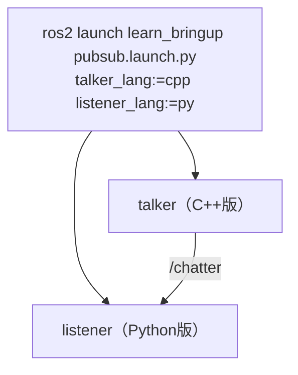
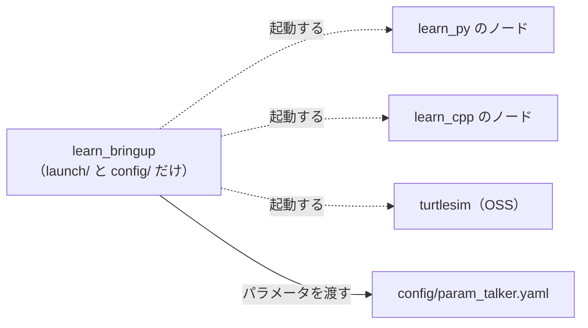
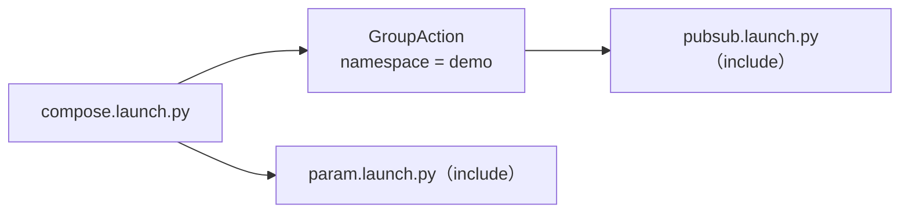

# フェーズ4 手順書: launchファイルで複数ノードを束ねる

`docs/learning_plan.md` フェーズ4（idea_origin.md ステップ1の1-6）に対応する。これまで別々のターミナルで起動していたノードを、1つのlaunchファイルで起動する。**Python版とC++版のノードを引数で切り替える**のが要点。

- 想定環境: WSL2 + Ubuntu 24.04 + ROS2 Jazzy
- 前提: フェーズ3-1〜3-5完了（`learn_py` と `learn_cpp` に各ノードがある）
- 所要目安: 1〜2コマ
- 言語: launchファイルはPython・XML・YAMLの3形式を扱う（ノードはPython・C++）
- OSS: turtlesim（GUIの起動と目視確認はユーザーが行う）

> **進め方**: 仕様を見て自分で書き、詰まったら「サンプル」で答え合わせをする。サンプルはこの手順書の作成時に、`ros2 launch --print`（起動せずに内容を表示する）で読み込めることまで確認済み。ノードを実際に起動した結果は未確認（出力が違えば差分を貼ってほしい）。

## 0. 学習目標と完了条件

1. launchパッケージ（`learn_bringup`）を作り、launchファイルをインストールして `ros2 launch` で起動できる。
2. launch引数（`DeclareLaunchArgument` / `LaunchConfiguration`）で、ノードの言語（Python版・C++版）を切り替えられる。
3. **4通りの組み合わせ**（Py×Py、Py×C++、C++×Py、C++×C++）を、引数だけで起動できる。
4. パラメータ（YAMLファイル、引数からの上書き）、`remap`、`namespace` をlaunchから指定できる。
5. Python・XML・YAMLの3形式の書き方の違いを説明できる。

## 1. 全体像



launchパッケージの役割（ノードを作らず、起動の設定だけを持つ）:



launchファイルの合成（`IncludeLaunchDescription`）:



## 2. 仕様

### 2-1. パッケージ

| 項目 | 内容 |
|---|---|
| パッケージ名 | `learn_bringup`（`ament_cmake`。ノードを持たない、launchと設定の専用パッケージ） |
| 置くもの | `launch/`（launchファイル）、`config/`（パラメータYAML） |
| 依存 | `learn_py`、`learn_cpp`、`turtlesim`（起動対象）、`launch`、`launch_ros`、`launch_xml`、`launch_yaml`（実行時の依存 `<exec_depend>`） |

### 2-2. launchファイル

| ファイル | 内容 |
|---|---|
| `pubsub.launch.py` | `talker` と `listener` を起動。引数 `talker_lang`、`listener_lang`（`py` または `cpp`、既定は `py`）で、それぞれの言語を選ぶ |
| `pubsub.launch.xml` | 上と同じ内容をXML形式で書く |
| `pubsub.launch.yaml` | 上と同じ内容をYAML形式で書く |
| `param.launch.py` | `param_talker` を起動。引数 `lang`（既定 `py`）と `period`（既定 `1.0`）。パラメータは `config/param_talker.yaml` を読み、さらに引数 `period` で上書きする |
| `turtle.launch.py` | `turtlesim_node`（OSS）と `turtle_circle` を起動。引数 `lang`（既定 `py`） |
| `compose.launch.py` | `pubsub.launch.py`（`talker_lang=cpp`、`listener_lang=py` を固定）を名前空間 `demo` の下で、`param.launch.py` はそのまま、それぞれincludeする |

## 3. 準備

### 3-1. パッケージを作る

```bash
cd ~/work/ros2MinimalPhysicalAi/ws/src
ros2 pkg create --build-type ament_cmake \
  --license Apache-2.0 \
  --maintainer-name learner --maintainer-email noreply@example.com \
  learn_bringup
mkdir -p learn_bringup/launch learn_bringup/config
```

フェーズ3-3で `ws/config/` に作ったパラメータYAMLを、このパッケージへ移す。

```bash
mv ~/work/ros2MinimalPhysicalAi/ws/config/param_talker.yaml ~/work/ros2MinimalPhysicalAi/ws/src/learn_bringup/config/
```

（`ws/config/` が空になったら、`rmdir ~/work/ros2MinimalPhysicalAi/ws/config` で消してよい。）

### 3-2. `package.xml` に依存を足す

`ws/src/learn_bringup/package.xml` の `<buildtool_depend>` の次あたりに、実行時の依存を足す。

```xml
<exec_depend>learn_py</exec_depend>
<exec_depend>learn_cpp</exec_depend>
<exec_depend>turtlesim</exec_depend>
<exec_depend>launch</exec_depend>
<exec_depend>launch_ros</exec_depend>
<exec_depend>launch_xml</exec_depend>
<exec_depend>launch_yaml</exec_depend>
```

### 3-3. `CMakeLists.txt` でインストールする

`ws/src/learn_bringup/CMakeLists.txt` の `ament_package()` の**前**に、`launch/` と `config/` を `share/` へ入れる指定を足す。

<!-- snippet: cmake_bringup -->
```cmake
install(DIRECTORY launch config
  DESTINATION share/${PROJECT_NAME})
```

- ここでインストールしたものが、`ros2 launch` から探される（`install/learn_bringup/share/learn_bringup/launch`）。
- `--symlink-install` でビルドすると、**既存ファイルの編集は再ビルド不要**で反映される。**新しいファイルを足したときは再ビルド**が必要。

## 4. launchファイルを書く

### 4-1. Python形式（`pubsub.launch.py`）

主なAPI:

| やりたいこと | API |
|---|---|
| 引数の宣言 | `DeclareLaunchArgument('名前', default_value='既定', description='説明')` |
| 引数の値を使う | `LaunchConfiguration('名前')`（実行時に評価される「置換」） |
| ノードの起動 | `launch_ros.actions.Node(package=..., executable=..., name=..., output='screen')` |
| 文字列と置換の連結 | リストで書く: `package=['learn_', LaunchConfiguration('talker_lang')]` |
| 全体を返す | `generate_launch_description()` が `LaunchDescription([...])` を返す |

<details>
<summary>サンプル</summary>

ファイル: `ws/src/learn_bringup/launch/pubsub.launch.py`

<!-- file: ws/src/learn_bringup/launch/pubsub.launch.py -->
```python
from launch import LaunchDescription
from launch.actions import DeclareLaunchArgument
from launch.substitutions import LaunchConfiguration
from launch_ros.actions import Node


def generate_launch_description():
    return LaunchDescription([
        DeclareLaunchArgument(
            'talker_lang', default_value='py', description='talkerの言語（py または cpp）'),
        DeclareLaunchArgument(
            'listener_lang', default_value='py', description='listenerの言語（py または cpp）'),
        Node(
            package=['learn_', LaunchConfiguration('talker_lang')],
            executable='talker',
            name='talker',
            output='screen',
        ),
        Node(
            package=['learn_', LaunchConfiguration('listener_lang')],
            executable='listener',
            name='listener',
            output='screen',
        ),
    ])
```

</details>

実行前に、引数の一覧と、展開結果を確認する（**ノードは起動しない**）:

```bash
cd ~/work/ros2MinimalPhysicalAi/ws
colcon build --symlink-install --packages-select learn_bringup
source install/setup.bash
ros2 launch learn_bringup pubsub.launch.py --show-args
ros2 launch learn_bringup pubsub.launch.py --print
```

起動する:

```bash
ros2 launch learn_bringup pubsub.launch.py
ros2 launch learn_bringup pubsub.launch.py talker_lang:=cpp listener_lang:=py
```

> 課題1: 4通りの組み合わせをすべて起動し、`ros2 node list` と `ros2 topic info /chatter -v` で、どの言語のノードがつながっているか確認する。
>
> 課題2: 存在しない値（`talker_lang:=rust`）を渡すとどうなるか確認する（`learn_rust` パッケージが見つからないエラーになる）。
>
> 課題3（発展）: 値を検証して、`py` / `cpp` 以外は分かりやすいエラーにしたい。`OpaqueFunction` を使うと、引数の値を文字列として取り出して、Python側で `if` で判定できる。調べて書いてみる。

### 4-2. XML形式（`pubsub.launch.xml`）

XMLでは、`$(var 引数名)` で引数を参照し、文字列に埋め込める。**リストで連結する必要がない**ぶん、この用途ではPythonより短く書ける。

<details>
<summary>サンプル</summary>

ファイル: `ws/src/learn_bringup/launch/pubsub.launch.xml`

<!-- file: ws/src/learn_bringup/launch/pubsub.launch.xml -->
```xml
<launch>
  <arg name="talker_lang" default="py" description="talkerの言語（py または cpp）"/>
  <arg name="listener_lang" default="py" description="listenerの言語（py または cpp）"/>

  <node pkg="learn_$(var talker_lang)" exec="talker" name="talker" output="screen"/>
  <node pkg="learn_$(var listener_lang)" exec="listener" name="listener" output="screen"/>
</launch>
```

</details>

### 4-3. YAML形式（`pubsub.launch.yaml`）

<details>
<summary>サンプル</summary>

ファイル: `ws/src/learn_bringup/launch/pubsub.launch.yaml`

<!-- file: ws/src/learn_bringup/launch/pubsub.launch.yaml -->
```yaml
launch:
  - arg:
      name: talker_lang
      default: py
      description: talkerの言語（py または cpp）
  - arg:
      name: listener_lang
      default: py
      description: listenerの言語（py または cpp）
  - node:
      pkg: learn_$(var talker_lang)
      exec: talker
      name: talker
      output: screen
  - node:
      pkg: learn_$(var listener_lang)
      exec: listener
      name: listener
      output: screen
```

</details>

3形式を、それぞれ確認する:

```bash
ros2 launch learn_bringup pubsub.launch.xml talker_lang:=cpp --print
ros2 launch learn_bringup pubsub.launch.yaml talker_lang:=cpp --print
```

> 課題4: 3形式の書き方を比べて、次の表に感想を書く。
>
> | 観点 | Python | XML | YAML |
> |---|---|---|---|
> | 行数 | | | |
> | 引数の埋め込みの書き方 | | | |
> | 条件分岐・計算など複雑なことができるか | | | |
>
> 目安: 複雑な条件・計算が要る場合はPython、単純な起動の一覧はXML/YAMLが読みやすい。

### 4-4. パラメータをlaunchから渡す（`param.launch.py`）

主なAPI:

| やりたいこと | API |
|---|---|
| インストール先のパスを得る | `FindPackageShare('learn_bringup')`（`PathJoinSubstitution` と組み合わせる） |
| YAMLを読ませる | `Node(parameters=[YAMLファイルのパス])` |
| 個別の値で上書き | `parameters=[..., {'period': 値}]`（**後ろのものが勝つ**） |
| 引数の値の型を指定する | `ParameterValue(LaunchConfiguration('period'), value_type=float)` |

`ParameterValue` を使う理由: 引数はもともと文字列で、そのままだと `1` のような値が整数として渡されて、フェーズ3-3で見た「型の不一致」になり得る。`value_type=float` を指定すれば、実数として渡せる。

<details>
<summary>サンプル</summary>

ファイル: `ws/src/learn_bringup/launch/param.launch.py`

<!-- file: ws/src/learn_bringup/launch/param.launch.py -->
```python
from launch import LaunchDescription
from launch.actions import DeclareLaunchArgument
from launch.substitutions import LaunchConfiguration, PathJoinSubstitution
from launch_ros.actions import Node
from launch_ros.parameter_descriptions import ParameterValue
from launch_ros.substitutions import FindPackageShare


def generate_launch_description():
    config = PathJoinSubstitution(
        [FindPackageShare('learn_bringup'), 'config', 'param_talker.yaml'])
    return LaunchDescription([
        DeclareLaunchArgument(
            'lang', default_value='py', description='ノードの言語（py または cpp）'),
        DeclareLaunchArgument(
            'period', default_value='1.0', description='送信周期[秒]（実数）'),
        Node(
            package=['learn_', LaunchConfiguration('lang')],
            executable='param_talker',
            name='param_talker',
            output='screen',
            parameters=[
                config,
                {'period': ParameterValue(LaunchConfiguration('period'), value_type=float)},
            ],
        ),
    ])
```

</details>

```bash
ros2 launch learn_bringup param.launch.py
ros2 launch learn_bringup param.launch.py lang:=cpp period:=0.2
```

別ターミナルで、実際に値が入っているか確認する:

```bash
ros2 param get /param_talker message     # YAMLの値
ros2 param get /param_talker period      # 引数で上書きした値
```

> 課題5: `period` を渡さない場合、YAMLの `0.5` になるか、引数の既定 `1.0` になるか確認する（`parameters` の並び順のルールから予想してから試す）。
>
> （補足: 引数 `period` に既定値 `1.0` があるため、指定しなくても常に引数側が勝ち、YAMLの `0.5` は使われない。発展: 引数の既定を空にして、未指定ならYAMLの値を使う書き方を調べて試す。）
>
> 課題6: `--print` の出力から、YAMLのパスがどこに展開されているか確認する（`install/learn_bringup/share/...`）。

### 4-5. OSSと自作ノードを一緒に起動する（`turtle.launch.py`）

<details>
<summary>サンプル</summary>

ファイル: `ws/src/learn_bringup/launch/turtle.launch.py`

<!-- file: ws/src/learn_bringup/launch/turtle.launch.py -->
```python
from launch import LaunchDescription
from launch.actions import DeclareLaunchArgument
from launch.substitutions import LaunchConfiguration
from launch_ros.actions import Node


def generate_launch_description():
    return LaunchDescription([
        DeclareLaunchArgument(
            'lang', default_value='py', description='turtle_circleの言語（py または cpp）'),
        Node(
            package='turtlesim',
            executable='turtlesim_node',
            name='turtlesim',
            output='screen',
        ),
        Node(
            package=['learn_', LaunchConfiguration('lang')],
            executable='turtle_circle',
            name='turtle_circle',
            output='screen',
        ),
    ])
```

</details>

```bash
ros2 launch learn_bringup turtle.launch.py lang:=cpp
```

（GUIの起動と目視確認はユーザーが行う。）

### 4-6. launchを合成する・名前空間・remap（`compose.launch.py`）

主なAPI:

| やりたいこと | API |
|---|---|
| 別のlaunchファイルを呼ぶ | `IncludeLaunchDescription(PythonLaunchDescriptionSource(パス), launch_arguments={...}.items())` |
| 名前空間をまとめて付ける | `GroupAction([PushRosNamespace('demo'), ...])` |
| トピック名の付け替え | `Node(remappings=[('chatter', 'renamed_chatter')])` |

名前空間 `demo` の下では、ノード名は `/demo/talker`、トピックは `/demo/chatter` になる。

<details>
<summary>サンプル</summary>

ファイル: `ws/src/learn_bringup/launch/compose.launch.py`

<!-- file: ws/src/learn_bringup/launch/compose.launch.py -->
```python
from launch import LaunchDescription
from launch.actions import GroupAction, IncludeLaunchDescription
from launch.launch_description_sources import PythonLaunchDescriptionSource
from launch.substitutions import PathJoinSubstitution
from launch_ros.actions import PushRosNamespace
from launch_ros.substitutions import FindPackageShare


def _launch_file(name):
    return PythonLaunchDescriptionSource(
        PathJoinSubstitution([FindPackageShare('learn_bringup'), 'launch', name]))


def generate_launch_description():
    pubsub = GroupAction([
        PushRosNamespace('demo'),
        IncludeLaunchDescription(
            _launch_file('pubsub.launch.py'),
            launch_arguments={'talker_lang': 'cpp', 'listener_lang': 'py'}.items()),
    ])
    param = IncludeLaunchDescription(_launch_file('param.launch.py'))
    return LaunchDescription([pubsub, param])
```

</details>

```bash
ros2 launch learn_bringup compose.launch.py
ros2 node list       # /demo/talker, /demo/listener, /param_talker
ros2 topic list      # /demo/chatter, /param_chatter
```

> 課題7: `pubsub.launch.py` の `Node` に `remappings=[('chatter', 'renamed')]` を足して、トピック名が変わることと、talkerとlistenerの**両方に同じremapを付けないとつながらない**ことを確認する。確認後は元に戻す。
>
> 課題8: launchを `Ctrl+C` で止めたとき、起動した全ノードが終了することを確認する（ログに各ノードの終了が出る）。

## 5. ビルドと反映

launchファイルを**追加した**ときは再ビルドが必要:

```bash
cd ~/work/ros2MinimalPhysicalAi/ws
colcon build --symlink-install --packages-select learn_bringup
source install/setup.bash
```

既存のlaunchファイルの**編集だけ**なら、`--symlink-install` により再ビルドなしで反映される（新しいターミナルで確認する）。

## 6. 記録用の表

| 観点 | 内容 |
|---|---|
| 4通りの組み合わせの起動結果（Py×Py / Py×C++ / C++×Py / C++×C++） | |
| 引数の渡し方と、置換（`LaunchConfiguration`）の理解 | |
| パラメータの優先順位（YAML / 引数） | |
| `namespace` と `remap` の効き方 | |
| Python / XML / YAML の使い分け | |
| つまずいた点 | |

このあと、フェーズ3の各「記録用の表」と合わせて、**1-7の振り返り**（Python版とC++版の比較表: コード量・型の扱い・ビルド手順・起動速度・つまずき）をまとめる。フェーズ5の言語方針（Python中心）の根拠になる。

## 7. つまずきやすい点

| 症状 | 確認すること |
|---|---|
| `file 'xxx' was not found in the share directory of package 'learn_bringup'` | launchファイルを追加した後に再ビルドしたか。`CMakeLists.txt` の `install(DIRECTORY launch config ...)` があるか |
| `Package 'learn_cpp' not found` | `source install/setup.bash` をしたか。`learn_cpp` をビルド済みか |
| ビルドで `ament_cmake_symlink_install_directory() can't find '.../config'` | `ws/src/learn_bringup/config/` が無い（または空でGit上に存在しない）。手順3-1のとおり `config/` を作り、`param_talker.yaml` を入れる |
| `ros2 launch` でパラメータが効かない | YAMLの1行目のノード名と、`Node(name=...)` が一致しているか。`ros__parameters` の綴り |
| 型の不一致（`period`） | `ParameterValue(..., value_type=float)` を使っているか。YAMLの `period: 1` のような整数になっていないか |
| ノードが起動しない・すぐ終了する | `output='screen'` にして、エラーログを見る。`ros2 launch ... --print` で展開結果を確認 |
| XML/YAMLで引数が展開されない | `$(var 引数名)` の書式（`$(arg ...)` は古い書き方）。引数を `<arg>` / `arg:` で宣言しているか |

## 8. 次へ

フェーズ5（車両シミュレーション本体）に進む。フェーズ5の手順書は、フェーズ3・4の振り返り（1-7）を踏まえて、着手時に作る。フェーズ5では、`learn_bringup` に車両シミュレーション用のlaunchファイルを追加していく予定。

## 9. 公式ドキュメント・参考資料

確認状況（2026-09-20）: 下記は `docs/idea_origin.md` に掲載済みのURLで、今回は再確認していない（docs.ros.orgは本文取得がボット対策で拒否される）。

### 公式（ROS 2 Jazzy）

- [Creating a launch file — Jazzy](https://docs.ros.org/en/jazzy/Tutorials/Intermediate/Launch/Creating-Launch-Files.html)
- [Integrating launch files into ROS 2 packages — Jazzy](https://docs.ros.org/en/jazzy/Tutorials/Intermediate/Launch/Launch-system.html)
- [Launch tutorials — Jazzy](https://docs.ros.org/en/jazzy/Tutorials/Intermediate/Launch/Launch-Main.html)
- [Launching nodes — Jazzy](https://docs.ros.org/en/jazzy/Tutorials/Beginner-CLI-Tools/Launching-Multiple-Nodes/Launching-Multiple-Nodes.html)

> 公式ドキュメントと食い違う場合は、公式を優先する。

> 出典: 各サンプルのAPIの使い方は、上記の公式チュートリアルを参考にした（ROS 2ドキュメントはCC BY 4.0）。ノード名・仕様・コード・文章は独自に書いたもので、逐語の転載ではない。
