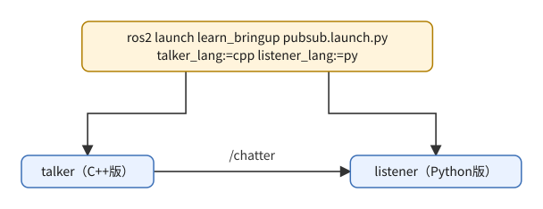
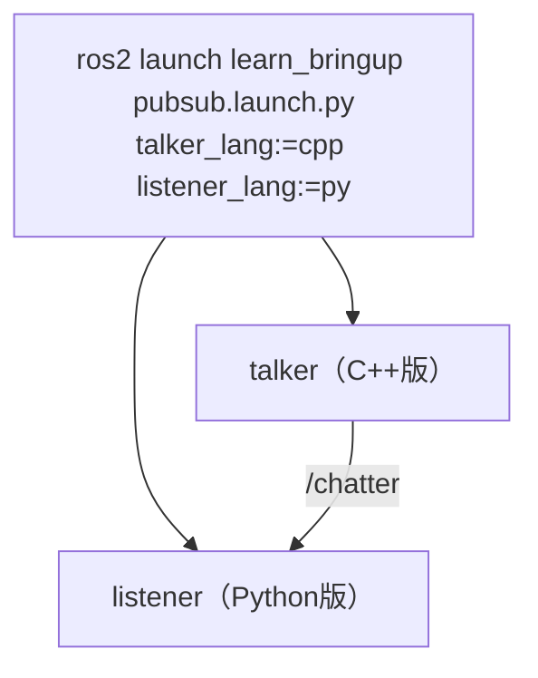
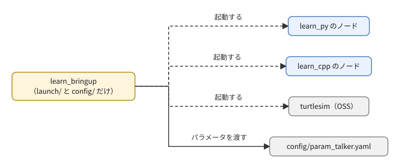
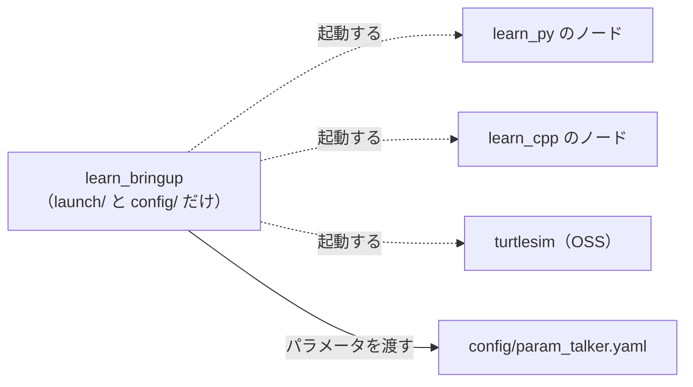
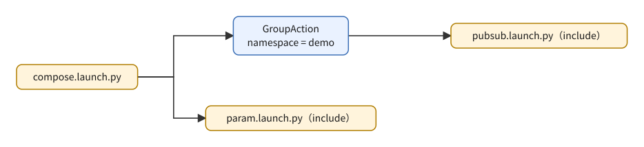
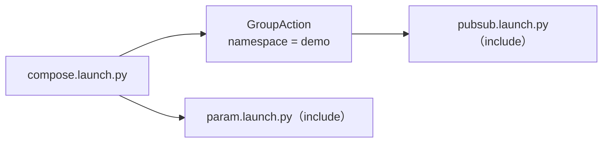

# フェーズ4 手順書: launchファイルで複数ノードを束ねる

`docs/learning_plan.md` フェーズ4（idea_origin.md ステップ1の1-6）に対応する。これまで別々のターミナルで起動していたノードを、1つのlaunchファイルで起動する。**Python版とC++版のノードを引数で切り替える**のが要点。

- 想定環境: WSL2 + Ubuntu 24.04 + ROS2 Jazzy
- 前提: フェーズ3-1〜3-5完了（`learn_py` と `learn_cpp` に各ノードがある）
- 所要目安: 1〜2コマ
- 言語: launchファイルはPython・XML・YAMLの3形式を扱う（ノードはPython・C++）
- OSS: turtlesim（GUIの起動と目視確認はユーザーが行う）

> **進め方**: 2節の仕様は「何を作るか」の定義で、launchのAPIの使い方までは書いていない。まず各節冒頭の「主なAPI」表でそのファイルに必要なAPIを把握し、続くサンプルと解説を読んで、1行ずつ何をしているか理解する。読んで分かったら、引数の既定値や起動するノードを変えるなど手を動かして改造してみると定着する。サンプルはこの手順書の作成時に、`ros2 launch --print`（起動せずに内容を表示する）で読み込めることまで確認済み。ノードを実際に起動した結果は未確認（出力が違えば差分を貼ってほしい）。

> **実行環境が無くても読めるように**: 実行する手順の直後には「期待する結果」として、表示される内容の例とその読み方を載せている。`--show-args` と `--print` の表示は手順書の作成時に使い捨ての環境で実行して確かめたもの、ノードを起動した後の表示はコードとROS2の仕様から筆者が想定したもので、実機では時刻・プロセス番号（pid）などの細部が異なる。

## 0. 学習目標と完了条件

1. launchパッケージ（`learn_bringup`）を作り、launchファイルをインストールして `ros2 launch` で起動できる。
2. launch引数（`DeclareLaunchArgument` / `LaunchConfiguration`）で、ノードの言語（Python版・C++版）を切り替えられる。
3. **4通りの組み合わせ**（Py×Py、Py×C++、C++×Py、C++×C++）を、引数だけで起動できる。
4. パラメータ（YAMLファイル、引数からの上書き）、`remap`、`namespace` をlaunchから指定できる。
5. Python・XML・YAMLの3形式の書き方の違いを説明できる。

## 1. 全体像



<details>
<summary>同じ図（mermaid版）</summary>



</details>

launchパッケージの役割（ノードを作らず、起動の設定だけを持つ）:



<details>
<summary>同じ図（mermaid版）</summary>



</details>

launchファイルの合成（`IncludeLaunchDescription`）:



<details>
<summary>同じ図（mermaid版）</summary>



</details>

## 2. 仕様

### 2-1. パッケージ

| 項目 | 内容 |
|---|---|
| パッケージ名 | `learn_bringup`（`ament_cmake`。ノードを持たない、launchと設定の専用パッケージ） |
| 置くもの | `launch/`（launchファイル）、`config/`（パラメータYAML） |
| 依存 | `learn_py`、`learn_cpp`、`turtlesim`（起動対象）、`launch`、`launch_ros`、`launch_xml`、`launch_yaml`（実行時の依存 `<exec_depend>`） |

### 2-2. launchファイル

| ファイル | 内容 |
|---|---|
| `pubsub.launch.py` | `talker` と `listener` を起動。引数 `talker_lang`、`listener_lang`（`py` または `cpp`、既定は `py`）で、それぞれの言語を選ぶ |
| `pubsub.launch.xml` | 上と同じ内容をXML形式で書く |
| `pubsub.launch.yaml` | 上と同じ内容をYAML形式で書く |
| `param.launch.py` | `param_talker` を起動。引数 `lang`（既定 `py`）と `period`（既定 `1.0`）。パラメータは `config/param_talker.yaml` を読み、さらに引数 `period` で上書きする |
| `turtle.launch.py` | `turtlesim_node`（OSS）と `turtle_circle` を起動。引数 `lang`（既定 `py`） |
| `compose.launch.py` | `pubsub.launch.py`（`talker_lang=cpp`、`listener_lang=py` を固定）を名前空間 `demo` の下で、`param.launch.py` はそのまま、それぞれincludeする |

## 3. 準備

### 3-1. パッケージを作る

```bash
cd ~/work/ros2MinimalPhysicalAi/ws/src
ros2 pkg create --build-type ament_cmake \
  --license Apache-2.0 \
  --maintainer-name learner --maintainer-email noreply@example.com \
  learn_bringup
mkdir -p learn_bringup/launch learn_bringup/config
```

期待する結果: `ros2 pkg create` の表示は、フェーズ2の2-3（C++パッケージ）と同じ形。`--node-name` と `--dependencies` を付けていないので、`src/` は作られず、`dependencies: []` と表示される。`mkdir` は成功しても何も表示しない。`ls learn_bringup` を実行すると、`CMakeLists.txt  LICENSE  config  include  launch  package.xml  src` のように並ぶ（`include/` と `src/` は雛形が作る空のフォルダで、このパッケージでは使わない）。

フェーズ3-3で `ws/config/` に作ったパラメータYAMLを、このパッケージへ移す。

```bash
mv ~/work/ros2MinimalPhysicalAi/ws/config/param_talker.yaml ~/work/ros2MinimalPhysicalAi/ws/src/learn_bringup/config/
```

（`ws/config/` が空になったら、`rmdir ~/work/ros2MinimalPhysicalAi/ws/config` で消してよい。）

### 3-2. `package.xml` に依存を足す

`ws/src/learn_bringup/package.xml` の `<buildtool_depend>` の次あたりに、実行時の依存を足す。

```xml
<exec_depend>learn_py</exec_depend>
<exec_depend>learn_cpp</exec_depend>
<exec_depend>turtlesim</exec_depend>
<exec_depend>launch</exec_depend>
<exec_depend>launch_ros</exec_depend>
<exec_depend>launch_xml</exec_depend>
<exec_depend>launch_yaml</exec_depend>
```

### 3-3. `CMakeLists.txt` でインストールする

`ws/src/learn_bringup/CMakeLists.txt` の `ament_package()` の**前**に、`launch/` と `config/` を `share/` へ入れる指定を足す。

<!-- snippet: cmake_bringup -->
```cmake
install(DIRECTORY launch config
  DESTINATION share/${PROJECT_NAME})
```

- ここでインストールしたものが、`ros2 launch` から探される（`install/learn_bringup/share/learn_bringup/launch`）。
- `--symlink-install` でビルドすると、**既存ファイルの編集は再ビルド不要**で反映される。**新しいファイルを足したときは再ビルド**が必要。

## 4. launchファイルを書く

### 4-1. Python形式（`pubsub.launch.py`）

主なAPI:

| やりたいこと | API |
|---|---|
| 引数の宣言 | `DeclareLaunchArgument('名前', default_value='既定', description='説明')` |
| 引数の値を使う | `LaunchConfiguration('名前')`（実行時に評価される「置換」） |
| ノードの起動 | `launch_ros.actions.Node(package=..., executable=..., name=..., output='screen')` |
| 文字列と置換の連結 | リストで書く: `package=['learn_', LaunchConfiguration('talker_lang')]` |
| 全体を返す | `generate_launch_description()` が `LaunchDescription([...])` を返す |

#### サンプルと解説

ファイル: `ws/src/learn_bringup/launch/pubsub.launch.py`

<!-- file: ws/src/learn_bringup/launch/pubsub.launch.py -->
```python
from launch import LaunchDescription
from launch.actions import DeclareLaunchArgument
from launch.substitutions import LaunchConfiguration
from launch_ros.actions import Node


def generate_launch_description():
    return LaunchDescription([
        DeclareLaunchArgument(
            'talker_lang', default_value='py', description='talkerの言語（py または cpp）'),
        DeclareLaunchArgument(
            'listener_lang', default_value='py', description='listenerの言語（py または cpp）'),
        Node(
            package=['learn_', LaunchConfiguration('talker_lang')],
            executable='talker',
            name='talker',
            output='screen',
        ),
        Node(
            package=['learn_', LaunchConfiguration('listener_lang')],
            executable='listener',
            name='listener',
            output='screen',
        ),
    ])
```

**解説: `pubsub.launch.py`**

役割は「`talker` と `listener` の2ノードを、言語（Python版・C++版）を引数で選んで起動する」こと。launchファイルは**ノードを起動する手順書のようなプログラム**で、`ros2 launch` はこのファイルの `generate_launch_description()` を呼び、返ってきた `LaunchDescription`（やることの一覧）を上から順に実行する。

| 部分 | 何をしているか |
|---|---|
| `generate_launch_description()` | 関数名は固定。`ros2 launch` がこの名前で探して呼ぶので、綴りを変えると「見つからない」エラーになる。 |
| `LaunchDescription([...])` | 起動の「アクション」（引数宣言、ノード起動など）をリストで並べたもの。 |
| `DeclareLaunchArgument('talker_lang', default_value='py', description=...)` | 起動時に `talker_lang:=cpp` の形で渡せる引数を宣言する。`default_value` は未指定のときの値、`description` は `--show-args` で表示される説明。 |
| `LaunchConfiguration('talker_lang')` | 「引数 `talker_lang` の値」を表す**置換（substitution）**。その場で文字列になるのではなく、**起動の実行時に評価される**予約票のようなもの。 |
| `Node(package=..., executable=..., name=..., output='screen')` | ROS2ノードを1つ起動する。`package` と `executable` は `ros2 run パッケージ 実行ファイル` の2つの引数に相当し、`name` でノード名を上書きし、`output='screen'` でログを端末に出す。 |
| `package=['learn_', LaunchConfiguration('talker_lang')]` | 文字列と置換をリストで並べると、**連結されて1つの文字列**になる。`py` なら `learn_py`、`cpp` なら `learn_cpp` になり、**パッケージ名を切り替える**ことで言語を切り替えている。 |

ポイントは、`LaunchConfiguration` が「あとで評価される置換」であること。`generate_launch_description()` が動く時点では、まだ引数の値は確定していない。そのため、この関数の中で `if LaunchConfiguration(...) == 'cpp':` のように**Pythonの `if` では判定できない**（常に「置換オブジェクト」が比較されてしまう）。値で分岐したい場合は、`OpaqueFunction` を使う（この節（4-1）の末尾の課題3で扱う）。

つまずきやすい点:

- `DeclareLaunchArgument` を書き忘れて `LaunchConfiguration` だけ使うと、「その launch configuration が存在しない」という趣旨のエラーになる。宣言は `LaunchDescription` のリストに入れておく（慣例としてノードより上に書く）。
- 引数の値は**常に文字列**として扱われる。型が要る場面（数値など）は、4-4節の `ParameterValue` のように明示する。
- `package` と `executable` の組み合わせが実在しないと、起動時にエラーになる（例: `talker_lang:=rust` は `learn_rust` が無いエラー。この節の末尾の課題2で試す）。

観察ポイント: `--show-args` で2つの引数と説明・既定値が見えること、`--print` では置換が**評価される前の形**（`'learn_' + LaunchConfig('talker_lang')`）で見えること、起動後に `ros2 node list` に `/talker` と `/listener` が出ることを確認する。「`LaunchConfiguration` は起動時に評価される予約票」という上の説明を、`--print` の表示で目で確かめられる。

この後の XML 版・YAML 版は、**同じ内容を別の書き方で表したもの**。Python版との対応を見比べる。

実行前に、引数の一覧と、展開結果を確認する（**ノードは起動しない**）:

```bash
cd ~/work/ros2MinimalPhysicalAi/ws
colcon build --symlink-install --packages-select learn_bringup
source install/setup.bash
ros2 launch learn_bringup pubsub.launch.py --show-args
ros2 launch learn_bringup pubsub.launch.py --print
```

期待する結果（`0x...` のアドレスは毎回変わる）:

```text
$ ros2 launch learn_bringup pubsub.launch.py --show-args
Arguments (pass arguments as '<name>:=<value>'):

    'talker_lang':
        talkerの言語（py または cpp）
        (default: 'py')

    'listener_lang':
        listenerの言語（py または cpp）
        (default: 'py')

$ ros2 launch learn_bringup pubsub.launch.py --print
<launch.launch_description.LaunchDescription object at 0x77051428a240>
├── Action('<launch.actions.declare_launch_argument.DeclareLaunchArgument object at 0x770514f8e090>')
├── Action('<launch.actions.declare_launch_argument.DeclareLaunchArgument object at 0x770514f8ffb0>')
├── ExecuteProcess(cmd=[ExecInPkg(pkg='learn_' + LaunchConfig('talker_lang'), exec='talker'), '--ros-args', '-r', LocalVar('node name')], cwd=None, env=None, shell=False)
└── ExecuteProcess(cmd=[ExecInPkg(pkg='learn_' + LaunchConfig('listener_lang'), exec='listener'), '--ros-args', '-r', LocalVar('node name')], cwd=None, env=None, shell=False)
```

- `--show-args` は、`DeclareLaunchArgument` に書いた名前・説明・既定値をそのまま並べる。
- `--print` は、`LaunchDescription` の中身を木の形で表示する。`DeclareLaunchArgument` が2つと、ノードの起動（`ExecuteProcess`）が2つ、コードに書いた順に並ぶ。
- パッケージ名は `'learn_' + LaunchConfig('talker_lang')` という**式のまま**で、`learn_py` には置き換わっていない。`talker_lang:=cpp` を付けて `--print` しても表示は同じ。置換の評価は実際の起動時に行われるため、`--print` で分かるのは「ファイルが読み込めて、構造が正しいか」まで。

起動する:

```bash
ros2 launch learn_bringup pubsub.launch.py
ros2 launch learn_bringup pubsub.launch.py talker_lang:=cpp listener_lang:=py
```

期待する結果（1つ目のコマンドの例）: 2つのノードのログが、1つのターミナルに混ざって出る。各行の先頭の `[talker-1]` などは、launchが付ける「どのプロセスの出力か」の印（`-1` は起動した順の番号）。

```text
[INFO] [launch]: All log files can be found below /home/<ユーザー名>/.ros/log/2026-09-24-12-00-00-123456-<ホスト名>-12340
[INFO] [launch]: Default logging verbosity is set to INFO
[INFO] [talker-1]: process started with pid [12345]
[INFO] [listener-2]: process started with pid [12346]
[talker-1] [INFO] [1727210001.100000000] [talker]: publish: hello 0
[listener-2] [INFO] [1727210001.101000000] [listener]: received: hello 0
[talker-1] [INFO] [1727210002.100000000] [talker]: publish: hello 1
[listener-2] [INFO] [1727210002.101000000] [listener]: received: hello 1
```

`Ctrl+C` を押すと、2つのノードがまとめて終了する。

```text
^C[WARNING] [launch]: user interrupted with ctrl-c (SIGINT)
[INFO] [listener-2]: process has finished cleanly [pid 12346]
[INFO] [talker-1]: process has finished cleanly [pid 12345]
```

2つ目のコマンド（`talker_lang:=cpp`）でも、ログの見た目は同じになる。どちらの言語が動いているかは、ログではなく `ros2 node info /talker` などで調べる（この節の末尾の課題1）。同じく課題2の `talker_lang:=rust` では、ノードは1つも起動せず、`[ERROR] [launch]: Caught exception in launch (see debug for traceback): ...` に続いて、`learn_rust` というパッケージが見つからないという趣旨のメッセージが出て終わる。

> 課題1: 4通りの組み合わせをすべて起動し、`ros2 node list` と `ros2 topic info /chatter -v` で、どの言語のノードがつながっているか確認する。
>
> 課題2: 存在しない値（`talker_lang:=rust`）を渡すとどうなるか確認する（`learn_rust` パッケージが見つからないエラーになる）。
>
> 課題3（発展）: 値を検証して、`py` / `cpp` 以外は分かりやすいエラーにしたい。`OpaqueFunction` を使うと、引数の値を文字列として取り出して、Python側で `if` で判定できる。調べて書いてみる。

### 4-2. XML形式（`pubsub.launch.xml`）

XMLでは、`$(var 引数名)` で引数を参照し、文字列に埋め込める。**リストで連結する必要がない**ぶん、この用途ではPythonより短く書ける。

#### サンプルと解説

ファイル: `ws/src/learn_bringup/launch/pubsub.launch.xml`

<!-- file: ws/src/learn_bringup/launch/pubsub.launch.xml -->
```xml
<launch>
  <arg name="talker_lang" default="py" description="talkerの言語（py または cpp）"/>
  <arg name="listener_lang" default="py" description="listenerの言語（py または cpp）"/>

  <node pkg="learn_$(var talker_lang)" exec="talker" name="talker" output="screen"/>
  <node pkg="learn_$(var listener_lang)" exec="listener" name="listener" output="screen"/>
</launch>
```

**解説: `pubsub.launch.xml`**

Python版の各要素が、XMLのタグにほぼ1対1で対応している。

| Python | XML | 補足 |
|---|---|---|
| `DeclareLaunchArgument('x', default_value='py', description=...)` | `<arg name="x" default="py" description="..."/>` | 属性名が `default_value` ではなく `default` になる。 |
| `Node(package=..., executable=..., name=..., output=...)` | `<node pkg="..." exec="..." name="..." output="..."/>` | `package` は `pkg`、`executable` は `exec` と短くなる。 |
| `['learn_', LaunchConfiguration('x')]` | `learn_$(var x)` | 文字列の中に `$(var 引数名)` を**そのまま埋め込める**。 |

全体は `<launch>` タグで囲む。Pythonでは「リストで連結」しなければならなかった部分が、XMLでは1つの文字列で書けるため、この用途では短く読みやすい。

つまずきやすい点:

- `$(var 名前)` は、宣言済みの引数（`<arg>`）を参照する書式。古い資料にある `$(arg 名前)` は別の（古い）書き方なので、混ぜない。
- タグは必ず閉じる（自己終了の `/>` を忘れない）。閉じ忘れは、XMLとして読めないエラーになる。
- XMLでは、`if` や計算のような複雑な処理は書けない。条件付きの起動は属性（`if=` / `unless=`）で最低限できるが、凝った処理はPython形式に任せる。

観察ポイント: `--print` の出力が、Python版と同じ内容になること（手順書の作成時に確認した範囲では、`0x...` のアドレス以外は1文字も違わなかった）。書き方が違っても、読み込まれた後は同じ `LaunchDescription` になる。

### 4-3. YAML形式（`pubsub.launch.yaml`）

#### サンプルと解説

ファイル: `ws/src/learn_bringup/launch/pubsub.launch.yaml`

<!-- file: ws/src/learn_bringup/launch/pubsub.launch.yaml -->
```yaml
launch:
  - arg:
      name: talker_lang
      default: py
      description: talkerの言語（py または cpp）
  - arg:
      name: listener_lang
      default: py
      description: listenerの言語（py または cpp）
  - node:
      pkg: learn_$(var talker_lang)
      exec: talker
      name: talker
      output: screen
  - node:
      pkg: learn_$(var listener_lang)
      exec: listener
      name: listener
      output: screen
```

**解説: `pubsub.launch.yaml`**

同じ内容をYAMLで書いたもの。構造は次のとおり。

- 最上位のキー `launch:` の下に、**リスト（`- ` で始まる行）**でアクションを並べる。
- リストの各要素は、1つのキー（`arg:` や `node:`）を持ち、その下に属性を**インデントして**書く。属性名はXML形式とほぼ同じ（`pkg`、`exec`、`name`、`output`、引数の `default`）。
- 引数の埋め込みは、XMLと同じ `$(var 引数名)`。値の中に置ける。

YAMLでもXMLでも「引数を宣言 → ノードを起動」という順序は変わらない。YAMLの利点は、XMLのタグの閉じ忘れが無く、見た目がすっきりすること。反面、**インデントがずれると意味が変わる**（またはエラーになる）ので、スペースの数をそろえる。タブは使えない。

つまずきやすい点:

- `arg:` の直後の属性を、1段深くインデントし忘れると、読み込みに失敗する。
- コロンや特殊な記号を含む値は、YAMLでは引用符が要る場合がある。この例の `description` は、コロンを含まないのでそのまま書けている。
- 3形式とも `--print` で、読み込めるか（書式の誤りが無いか）と、読み込まれた構造を確認できる。書いたら、まず `--print` で読み込めるか見る。置換（`$(var ...)` など）の値は、`--print` では評価されない。

3形式を書き比べると、Pythonは自由度が高く（分岐・計算・関数化）、XML/YAMLは単純な起動の一覧を短く書ける、という違いが見える。

| 観点 | Python | XML | YAML |
|---|---|---|---|
| 行数（`pubsub.launch.*`） | 25行 | 7行 | 19行 |
| 引数の埋め込み | `LaunchConfiguration('引数名')`（Pythonのオブジェクトとして扱う） | `$(var 引数名)` | `$(var 引数名)`（XMLと共通の記法） |
| 条件分岐・計算 | 可能（`IfCondition`・`PythonExpression`や、素のPythonの関数・分岐がそのまま使える） | 不可（宣言的な起動の一覧のみ） | 不可（同左） |

行数だけならXMLが圧倒的に短いが、これは「talker/listenerを1つずつ書くだけ」という単純な内容だから。4-4・4-6のようにパスの組み立てや条件分岐が絡むと、Python形式でないと書けない処理が増える（この節の末尾の課題4で、3形式を実際に動かして確かめる）。

3形式を、それぞれ確認する:

```bash
ros2 launch learn_bringup pubsub.launch.xml talker_lang:=cpp --print
ros2 launch learn_bringup pubsub.launch.yaml talker_lang:=cpp --print
```

期待する結果: どちらも、4-1の `pubsub.launch.py --print` と同じ木（`DeclareLaunchArgument` 2つ、`ExecuteProcess` 2つ）が表示される。`talker_lang:=cpp` を付けていても、パッケージ名は `'learn_' + LaunchConfig('talker_lang')` のまま。XMLやYAMLの書式を間違えている場合は、木の代わりに読み込みのエラーが出る。

> 課題4: 3形式（Python/XML/YAML）で同じ`pubsub.launch.*`を実際に動かし、上の表の内容（行数・引数の埋め込み・分岐可否）を自分の目で確かめる。目安: 複雑な条件・計算が要る場合はPython、単純な起動の一覧はXML/YAMLが読みやすい。

### 4-4. パラメータをlaunchから渡す（`param.launch.py`）

主なAPI:

| やりたいこと | API |
|---|---|
| インストール先のパスを得る | `FindPackageShare('learn_bringup')`（`PathJoinSubstitution` と組み合わせる） |
| YAMLを読ませる | `Node(parameters=[YAMLファイルのパス])` |
| 個別の値で上書き | `parameters=[..., {'period': 値}]`（**後ろのものが勝つ**） |
| 引数の値の型を指定する | `ParameterValue(LaunchConfiguration('period'), value_type=float)` |

`ParameterValue` を使う理由: 引数はもともと文字列で、そのままだと `1` のような値が整数として渡されて、フェーズ3-3で見た「型の不一致」になり得る。`value_type=float` を指定すれば、実数として渡せる。

#### サンプルと解説

ファイル: `ws/src/learn_bringup/launch/param.launch.py`

<!-- file: ws/src/learn_bringup/launch/param.launch.py -->
```python
from launch import LaunchDescription
from launch.actions import DeclareLaunchArgument
from launch.substitutions import LaunchConfiguration, PathJoinSubstitution
from launch_ros.actions import Node
from launch_ros.parameter_descriptions import ParameterValue
from launch_ros.substitutions import FindPackageShare


def generate_launch_description():
    config = PathJoinSubstitution(
        [FindPackageShare('learn_bringup'), 'config', 'param_talker.yaml'])
    return LaunchDescription([
        DeclareLaunchArgument(
            'lang', default_value='py', description='ノードの言語（py または cpp）'),
        DeclareLaunchArgument(
            'period', default_value='1.0', description='送信周期[秒]（実数）'),
        Node(
            package=['learn_', LaunchConfiguration('lang')],
            executable='param_talker',
            name='param_talker',
            output='screen',
            parameters=[
                config,
                {'period': ParameterValue(LaunchConfiguration('period'), value_type=float)},
            ],
        ),
    ])
```

**解説: `param.launch.py`**

役割は「`param_talker` を、YAMLファイルのパラメータで起動し、一部だけ引数で上書きする」こと。パラメータの渡し方を、3段（ファイル → 個別の値 → 型の指定）で読む。

| 部分 | 何をしているか |
|---|---|
| `FindPackageShare('learn_bringup')` | パッケージのインストール先（`install/learn_bringup/share/learn_bringup`）を実行時に見つける置換。`--symlink-install` の有無やインストール場所に依存しない書き方になる。 |
| `PathJoinSubstitution([..., 'config', 'param_talker.yaml'])` | 複数の要素を、OSに合ったパス区切りでつないで1つのパスにする。文字列の `+` で連結するより安全。 |
| `config = ...`（`generate_launch_description` の先頭） | パスをいったん変数に入れておき、後で `parameters` に渡している。これも置換なので、評価は起動時。 |
| `DeclareLaunchArgument('lang'...)` / `('period'...)` | 言語と送信周期の引数。既定値は文字列 `'1.0'` になっている。 |
| `parameters=[config, {'period': ...}]` | パラメータの**リスト**。要素にはYAMLファイルのパス、または `{名前: 値}` の辞書を置ける。**前から順に適用され、後ろが勝つ**ので、YAMLで読んだ `period` を、辞書の `period` が上書きする。 |
| `ParameterValue(LaunchConfiguration('period'), value_type=float)` | 引数（文字列）を、実数として渡すための包み。 |

YAMLパラメータファイルの構造（`config/param_talker.yaml`）は、次の3階層になっている。

1. 最上位: **ノード名**（`param_talker`）。`Node(name='param_talker')` と一致しないと、パラメータが**黙って無視される**。
2. その下: `ros__parameters:`（アンダースコア2つ。綴りを間違えるとやはり無視される）。
3. その下: パラメータ名と値（`message`、`period` など）。

`ParameterValue` が要る理由（直前の説明の補足）: launch引数はすべて文字列で、そのまま辞書に入れると、`1` のような値が整数として解釈されうる。フェーズ3-3で見たとおり、ノードは `period` を実数として宣言しているので、整数が来ると型の不一致で起動に失敗する。`value_type=float` を付けると、`1` でも `1.0` として渡される。

つまずきやすい点:

- `Node(name=...)` を変えたのに、YAMLの最上位のノード名を直し忘れる。
- YAMLを `parameters` の**後ろ**に置くと、引数で渡したはずの値がYAMLに上書きされる。並びの順序に意味がある。
- 引数に既定値があるので、`period` を指定しなくても引数側（`1.0`）が使われ、YAMLの値（`0.5`）は結果的に使われない（この節の末尾の課題5と、その補足）。

観察ポイント: `ros2 param get` で、`message` はYAMLの値、`period` は引数の値（`period:=0.2` なら0.2）になっていること。YAMLが `install/.../share/...` から読まれていること（この節の末尾の課題6）。

```bash
ros2 launch learn_bringup param.launch.py
ros2 launch learn_bringup param.launch.py lang:=cpp period:=0.2
```

期待する結果（2つ目のコマンドの例。launch自体の行は4-1と同じなので省く）: YAMLの `message`（`from yaml`）が、引数で上書きした周期0.2秒（1秒に5行）で送られる。

```text
[INFO] [param_talker-1]: process started with pid [12400]
[param_talker-1] [INFO] [1727210100.200000000] [param_talker]: publish: from yaml
[param_talker-1] [INFO] [1727210100.400000000] [param_talker]: publish: from yaml
[param_talker-1] [INFO] [1727210100.600000000] [param_talker]: publish: from yaml
```

1つ目のコマンド（引数なし）では、周期は引数の既定値1.0秒になる（この節の末尾の課題5と、その補足）。

別ターミナルで、実際に値が入っているか確認する:

```bash
ros2 param get /param_talker message     # YAMLの値
ros2 param get /param_talker period      # 引数で上書きした値
```

期待する結果（`period:=0.2` で起動した場合）:

```text
String value is: from yaml
Double value is: 0.2
```

> 課題5: `period` を渡さない場合、YAMLの `0.5` になるか、引数の既定 `1.0` になるか確認する（`parameters` の並び順のルールから予想してから試す）。
>
> （補足: 引数 `period` に既定値 `1.0` があるため、指定しなくても常に引数側が勝ち、YAMLの `0.5` は使われない。発展: 引数の既定を空にして、未指定ならYAMLの値を使う書き方を調べて試す。）
>
> 課題6: `FindPackageShare('learn_bringup')` がどこを指すかを、`ros2 pkg prefix --share learn_bringup` で確認する（`.../ws/install/learn_bringup/share/learn_bringup` と表示される）。その下の `config/` に `param_talker.yaml` があることを `ls` で確かめ、`PathJoinSubstitution` が組み立てるパスと一致することを確認する。`--print` では、パラメータのパスは表示されない（置換は起動時に評価されるため）。

### 4-5. OSSと自作ノードを一緒に起動する（`turtle.launch.py`）

#### サンプルと解説

ファイル: `ws/src/learn_bringup/launch/turtle.launch.py`

<!-- file: ws/src/learn_bringup/launch/turtle.launch.py -->
```python
from launch import LaunchDescription
from launch.actions import DeclareLaunchArgument
from launch.substitutions import LaunchConfiguration
from launch_ros.actions import Node


def generate_launch_description():
    return LaunchDescription([
        DeclareLaunchArgument(
            'lang', default_value='py', description='turtle_circleの言語（py または cpp）'),
        Node(
            package='turtlesim',
            executable='turtlesim_node',
            name='turtlesim',
            output='screen',
        ),
        Node(
            package=['learn_', LaunchConfiguration('lang')],
            executable='turtle_circle',
            name='turtle_circle',
            output='screen',
        ),
    ])
```

**解説: `turtle.launch.py`**

役割は「OSS（turtlesim）のノードと、自作の `turtle_circle` を1つのコマンドで一緒に起動する」こと。構造は `pubsub.launch.py` と同じで、違いは次の点。

- **OSSのノードも同じ `Node` で起動できる**。`package='turtlesim'`, `executable='turtlesim_node'` は、`ros2 run turtlesim turtlesim_node` と同じ指定。自作でも他人のパッケージでも、launchの書き方は変わらない。
- `turtlesim` 側の `package` は固定の文字列で、自作側だけ `['learn_', LaunchConfiguration('lang')]` で切り替えている。切り替えたい部分にだけ置換を使う、という使い分けの例になっている。
- `name='turtlesim'` は、ノード名を `turtlesim`（既定の `turtlesim` と同じ）に明示している。

つまずきやすい点:

- launchは**リストのノードを、ほぼ同時に起動する**。順番は保証されない。turtlesimのウィンドウが立ち上がる前に、`turtle_circle` が最初の指令を送ると、その指令は届かないことがある。慌てず、少し待って動きが始まるか見る。
- `turtlesim` が入っていない（`Package 'turtlesim' not found`）場合は、導入がフェーズ3-2で済んでいるか確認する。

観察ポイント: 1つのターミナルの `Ctrl+C` で、2つのノードが**まとめて止まる**こと（個別のターミナルで起動していたときとの差）。`ros2 node list` に `/turtlesim` と `/turtle_circle` が並ぶこと。GUIの起動と目視確認はユーザーが行う。

```bash
ros2 launch learn_bringup turtle.launch.py lang:=cpp
```

（GUIの起動と目視確認はユーザーが行う。）

期待する結果: turtlesimのウィンドウが開き、少し待つと亀が円を描き始める（フェーズ3-2の6-1と同じ動き）。ターミナルには2つのプロセスの起動が出る。`turtle_circle` はログを出さないので、以降はturtlesim側のログだけが出る。

```text
[INFO] [turtlesim_node-1]: process started with pid [12500]
[INFO] [turtle_circle-2]: process started with pid [12501]
[turtlesim_node-1] [INFO] [1727210200.100000000] [turtlesim]: Starting turtlesim with node name /turtlesim
[turtlesim_node-1] [INFO] [1727210200.110000000] [turtlesim]: Spawning turtle [turtle1] at x=[5.544445], y=[5.544445], theta=[0.000000]
```

### 4-6. launchを合成する・名前空間・remap（`compose.launch.py`）

主なAPI:

| やりたいこと | API |
|---|---|
| 別のlaunchファイルを呼ぶ | `IncludeLaunchDescription(PythonLaunchDescriptionSource(パス), launch_arguments={...}.items())` |
| 名前空間をまとめて付ける | `GroupAction([PushRosNamespace('demo'), ...])` |
| トピック名の付け替え | `Node(remappings=[('chatter', 'renamed_chatter')])` |

名前空間 `demo` の下では、ノード名は `/demo/talker`、トピックは `/demo/chatter` になる。

#### サンプルと解説

ファイル: `ws/src/learn_bringup/launch/compose.launch.py`

<!-- file: ws/src/learn_bringup/launch/compose.launch.py -->
```python
from launch import LaunchDescription
from launch.actions import GroupAction, IncludeLaunchDescription
from launch.launch_description_sources import PythonLaunchDescriptionSource
from launch.substitutions import PathJoinSubstitution
from launch_ros.actions import PushRosNamespace
from launch_ros.substitutions import FindPackageShare


def _launch_file(name):
    return PythonLaunchDescriptionSource(
        PathJoinSubstitution([FindPackageShare('learn_bringup'), 'launch', name]))


def generate_launch_description():
    pubsub = GroupAction([
        PushRosNamespace('demo'),
        IncludeLaunchDescription(
            _launch_file('pubsub.launch.py'),
            launch_arguments={'talker_lang': 'cpp', 'listener_lang': 'py'}.items()),
    ])
    param = IncludeLaunchDescription(_launch_file('param.launch.py'))
    return LaunchDescription([pubsub, param])
```

**解説: `compose.launch.py`**

役割は「既存のlaunchファイルを部品として呼び出し、名前空間をまとめて付ける」こと。新しいノードを直接は書かず、`pubsub.launch.py` と `param.launch.py` を**組み合わせる**。

| 部分 | 何をしているか |
|---|---|
| `_launch_file(name)` | 「`learn_bringup` の `launch/` 下の、指定したファイル」を指す `PythonLaunchDescriptionSource`（起動元）を作る補助関数。同じ書き方を2回書かないためのまとめで、先頭のアンダースコアは「このファイルの内部用」という慣習。 |
| `IncludeLaunchDescription(起動元, launch_arguments={...}.items())` | 別のlaunchファイルを、この場所で実行する。`launch_arguments` は、呼び出す側の引数を**まとめて固定する**指定で、辞書の `.items()`（キーと値の組の並び）で渡す。値は文字列。 |
| `PushRosNamespace('demo')` | 以降のノードに、名前空間 `demo` を付ける。 |
| `GroupAction([PushRosNamespace('demo'), IncludeLaunchDescription(...)])` | アクションをグループにまとめる。名前空間の指定は**グループの中だけに効く**ので、グループの外の `param` には影響しない。 |
| `LaunchDescription([pubsub, param])` | 最後に、グループとincludeを並べて返す。 |

実行結果として、`pubsub.launch.py` のノードは `/demo/talker`、`/demo/listener`、トピックは `/demo/chatter` になる。`param.launch.py` は名前空間の外なので、`/param_talker` のまま。`ros2 node list` で、この違いが見える。

補足:

- includeされた側の引数は、`launch_arguments` で渡さなければ、**その既定値**が使われる。`param` の呼び出しは引数を渡していないので、`lang=py`、`period=1.0` になる。`pubsub` は `talker_lang=cpp`、`listener_lang=py` で固定している。
- 名前空間が効くのは、**相対名**（先頭に `/` が無い名前）のノード名・トピック名。コードの中で `/chatter` のように絶対名で書くと、名前空間を付けても変わらない。`talker` が `chatter` と相対名で書いているので、`/demo/chatter` になる。
- **remap**（トピック名の付け替え）は、このサンプルには含まない。`Node(remappings=[('chatter', 'renamed_chatter')])` のように「元の名前 → 新しい名前」のペアで指定する。この節の末尾の課題7で試す。片方だけに付けると名前が食い違って、つながらなくなる。

つまずきやすい点:

- `launch_arguments` に辞書をそのまま渡す（`.items()` を付けない）と、型のエラーになる。
- 名前空間を付けたのに、コードが絶対名を使っていて変わらない、という食い違いに注意する。
- 同じノード名が2つ起動するとログに警告が出る（名前空間を付ける理由の1つ）。

観察ポイント: `ros2 node list` と `ros2 topic list` の結果が、コメントの例（`/demo/talker`、`/demo/listener`、`/param_talker`、`/demo/chatter`、`/param_chatter`）になること。`Ctrl+C` で全ノードが止まること（この節の末尾の課題8）。

```bash
ros2 launch learn_bringup compose.launch.py
ros2 node list       # /demo/talker, /demo/listener, /param_talker
ros2 topic list      # /demo/chatter, /param_chatter
```

期待する結果: launchのターミナルには、3つのプロセス（`talker`・`listener`・`param_talker`）のログが混ざって出る。ノード名は名前空間付き（`[demo.talker]` のようにドット区切り）で表示される。

```text
[talker-1] [INFO] [1727210300.100000000] [demo.talker]: publish: hello 0
[listener-2] [INFO] [1727210300.101000000] [demo.listener]: received: hello 0
[param_talker-3] [INFO] [1727210300.100000000] [param_talker]: publish: from yaml
```

別のターミナルでの確認（`ros2 topic list` の抜粋）:

```text
$ ros2 node list
/demo/listener
/demo/talker
/param_talker

$ ros2 topic list
/demo/chatter
/param_chatter
/parameter_events
/rosout
```

`demo` の下に入るのは、`GroupAction` の中でincludeした `pubsub.launch.py` の2ノードとそのトピックだけで、`param.launch.py` の側は名前空間なしのまま。`/parameter_events` と `/rosout` は、どのノードも共有する全体のトピックなので、名前空間が付かない。

> 課題7: `pubsub.launch.py` の `Node` に `remappings=[('chatter', 'renamed')]` を足して、トピック名が変わることと、talkerとlistenerの**両方に同じremapを付けないとつながらない**ことを確認する。確認後は元に戻す。
>
> 課題8: launchを `Ctrl+C` で止めたとき、起動した全ノードが終了することを確認する（ログに各ノードの終了が出る）。

## 5. ビルドと反映

launchファイルを**追加した**ときは再ビルドが必要:

```bash
cd ~/work/ros2MinimalPhysicalAi/ws
colcon build --symlink-install --packages-select learn_bringup
source install/setup.bash
```

既存のlaunchファイルの**編集だけ**なら、`--symlink-install` により再ビルドなしで反映される（新しいターミナルで確認する）。

## 6. 本フェーズのまとめ

| 観点 | 内容 |
|---|---|
| 4通りの組み合わせ（Py×Py / Py×C++ / C++×Py / C++×C++）の起動結果 | 全通りとも**つながる**（4-1節、フェーズ3-1で確認済みの「言語は関係なくつながる」がlaunchでも成り立つ） |
| パラメータの優先順位（YAML／引数） | `parameters=[YAML, {...}]`のリストは**後ろが勝つ**（4-4節）。さらに引数側に既定値があると、指定しなくても引数が優先されYAMLの値は使われない（4-4節の課題5補足） |
| `namespace`と`remap`の効き方 | 名前空間は**相対名**（先頭が`/`でない名前）にだけ効く。絶対名（`/chatter`等）で書かれたノードには効かない（4-6節）。remapは送信側・受信側の**両方**に同じ指定が要る（片方だけだとつながらなくなる） |
| Python／XML／YAMLの使い分け | 単純な起動の並びはXML/YAMLが短く書ける（`pubsub.launch.*`で7行・19行・25行）。条件分岐・計算・パスの組み立てが要る場合（4-4・4-6）はPython形式でないと書けない（4-3節） |

フェーズ3-1〜3-5・フェーズ2の各「Python版とC++版の違いのまとめ」節と合わせて読み返すと、**1-7の振り返り**（コード量・型の扱い・ビルド手順・つまずきの傾向）の材料になる。フェーズ5の言語方針（Python中心）は既に決定済みだが、この振り返りは今後C++で書く場合の勘所の再確認として使える。

## 7. つまずきやすい点

| 症状 | 確認すること |
|---|---|
| `file 'xxx' was not found in the share directory of package 'learn_bringup'` | launchファイルを追加した後に再ビルドしたか。`CMakeLists.txt` の `install(DIRECTORY launch config ...)` があるか |
| `Package 'learn_cpp' not found` | `source install/setup.bash` をしたか。`learn_cpp` をビルド済みか |
| ビルドで `ament_cmake_symlink_install_directory() can't find '.../config'` | `ws/src/learn_bringup/config/` が無い（または空でGit上に存在しない）。手順3-1のとおり `config/` を作り、`param_talker.yaml` を入れる |
| `ros2 launch` でパラメータが効かない | YAMLの1行目のノード名と、`Node(name=...)` が一致しているか。`ros__parameters` の綴り |
| 型の不一致（`period`） | `ParameterValue(..., value_type=float)` を使っているか。YAMLの `period: 1` のような整数になっていないか |
| ノードが起動しない・すぐ終了する | `output='screen'` にして、エラーログを見る。`ros2 launch ... --print` でファイルが読み込めるか、`--show-args` で引数の名前と既定値を確認（置換の値は `--print` では評価されない） |
| XML/YAMLで引数が展開されない | `$(var 引数名)` の書式（`$(arg ...)` は古い書き方）。引数を `<arg>` / `arg:` で宣言しているか |

## 8. 次へ

フェーズ5（車両シミュレーション本体）に進む。フェーズ5の手順書は、フェーズ3・4の振り返り（1-7）を踏まえて、着手時に作る。フェーズ5では、`learn_bringup` に車両シミュレーション用のlaunchファイルを追加していく予定。

## 9. 公式ドキュメント・参考資料

確認状況（2026-09-20）: 下記は `docs/idea_origin.md` に掲載済みのURLで、今回は再確認していない（docs.ros.orgは本文取得がボット対策で拒否される）。

### 公式（ROS 2 Jazzy）

- [Creating a launch file — Jazzy](https://docs.ros.org/en/jazzy/Tutorials/Intermediate/Launch/Creating-Launch-Files.html)
- [Integrating launch files into ROS 2 packages — Jazzy](https://docs.ros.org/en/jazzy/Tutorials/Intermediate/Launch/Launch-system.html)
- [Launch tutorials — Jazzy](https://docs.ros.org/en/jazzy/Tutorials/Intermediate/Launch/Launch-Main.html)
- [Launching nodes — Jazzy](https://docs.ros.org/en/jazzy/Tutorials/Beginner-CLI-Tools/Launching-Multiple-Nodes/Launching-Multiple-Nodes.html)

> 公式ドキュメントと食い違う場合は、公式を優先する。

> 出典: 各サンプルのAPIの使い方は、上記の公式チュートリアルを参考にした（ROS 2ドキュメントはCC BY 4.0）。ノード名・仕様・コード・文章は独自に書いたもので、逐語の転載ではない。
