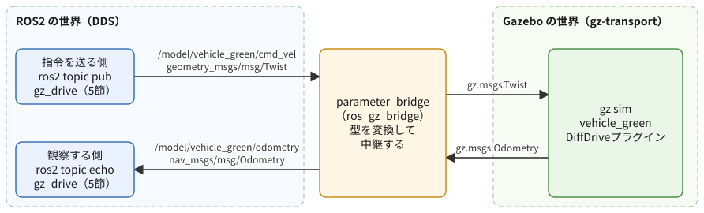
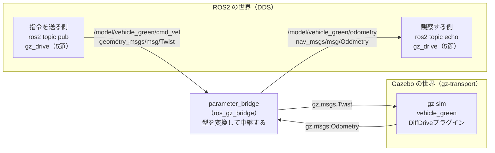

# フェーズ5-0 手順書: Gazeboを導入し、用意されたロボットをROS2から動かす

`docs/learning_plan.md` フェーズ5の冒頭（idea_origin.md ステップ5）に対応する。3D物理シミュレータのGazebo（Harmonic）を導入し、公式のデモ集 `ros_gz_sim_demos` に入っている2輪の車両を、ROS2のトピックで走らせる。フェーズ5-1以降で自作する「車両」の速度制御を、物理シミュレータの車両で先に体験しておく位置づけ。

- 想定環境: WSL2 + Ubuntu 24.04 + ROS2 Jazzy
- 前提: フェーズ1（`ros2 topic pub` でTwistを送れる）とフェーズ3-1（Publisherを書ける。`ws/src/learn_py` がある）。launchファイルは起動するだけで、書き方（フェーズ4）は知らなくてよい
- 所要目安: 1〜2コマ
- 言語: 導入と観察は言語非依存。自作ノードはPython

> **進め方**: 前半（1〜4節）は、Gazeboを導入し、用意されたデモをコマンドだけで動かして仕組みを観察する。後半（5節）で、フェーズ3-1のPublisherを応用した小さなノードを書いて車両を走らせる。サンプルは学習の手がかりとして最小限に書いたもので、公式チュートリアルの転載ではない。コードはこの手順書の作成時にビルドと `import` まで確認済みで、Gazeboを起動した後の挙動は未確認（出力が違う場合は、実機の表示を優先する）。

> **実行環境が無くても読めるように**: 実行する手順の直後には「期待する結果」として、表示される内容の例とその読み方を載せている。導入の確認（1-3節）とlaunchの引数・展開結果（3-1節）は実機で確かめた表示、ビルドの表示（5-4節）は使い捨ての環境で確かめた表示、Gazeboやノードを起動した後の表示はデモの設定ファイルとROS2の仕様から筆者が想定したもので、実機では時刻・数値の細部が異なる。

## 0. 学習目標と完了条件

1. Gazebo（Harmonic）とROS2の連携パッケージ `ros_gz` を導入し、ROS2の版とGazeboの版の対応を説明できる。
2. `ros_gz_sim_demos` の2輪車のデモを起動し、`ros2 topic pub` で車両を走らせられる。
3. Gazebo側のトピックとROS2側のトピックは別の仕組みで、`ros_gz_bridge` が型を変換して橋渡ししていることを説明できる。
4. フェーズ3-1のPublisherを応用した自作ノードで車両を走らせ、オドメトリ（車輪の回転から推定した位置・速度）を購読して観察できる。

完了条件: 5節の自作ノード `gz_drive` で緑の車両を走らせ、ログに出る速度が指令の値に近づくこと、ノードを止めても車両が走り続ける理由（4-3節）を説明できる。

## 1. Gazeboの導入

### 1-1. どのGazeboを入れるか

Gazeboには、旧来の「Gazebo Classic」と、その後継の新しい「Gazebo」（以前はIgnitionと呼ばれていた系統）がある。Gazebo Classicはサポートが終わる系統のため、この教材では新しいGazeboを使う。

新しいGazeboには「Harmonic」「Ionic」などの名前の付いた版がある。ROS2の版ごとに推奨の組み合わせが決まっていて、**ROS2 JazzyにはGazebo Harmonic**が推奨されている。Jazzyからは、GazeboがROS2のaptリポジトリから「vendorパッケージ」（ROS2の配布物としてGazeboのライブラリを同梱したもの）として配布されるので、Gazebo本家のaptリポジトリを別に追加しなくてよい。

入れるものは次の2つ。

| パッケージ | 中身 |
|---|---|
| `ros-jazzy-ros-gz` | Gazebo Harmonic本体（vendorパッケージ経由）と、ROS2と連携するための `ros_gz_sim`（起動用）・`ros_gz_bridge`（トピックの橋渡し）など |
| `ros-jazzy-ros-gz-sim-demos` | 公式のデモ集。この手順書で動かす2輪車のデモが入っている |

### 1-2. インストール

```bash
sudo apt update
sudo apt install ros-jazzy-ros-gz ros-jazzy-ros-gz-sim-demos
```

依存するパッケージ（RViz2・rqt_plot・xacro など）もまとめて入るので、ダウンロードとインストールにしばらくかかる。

> **PCの負荷について**: Gazeboは3D描画と物理計算を同時に行うため、ここまでのturtlesimやrqtよりはるかに重い。WSL2に割り当てたメモリが少ない環境では、動かす間はブラウザなど他のアプリを閉じておくとよい。

**期待する結果**（仕様から想定した表示。パッケージの数・容量は環境によって異なる）:

```text
...
The following NEW packages will be installed:
  ros-jazzy-gz-sim-vendor ros-jazzy-ros-gz ros-jazzy-ros-gz-bridge ros-jazzy-ros-gz-sim ros-jazzy-ros-gz-sim-demos ...
...
Do you want to continue? [Y/n]
```

`Y` で続け、最後にエラー（`E:` で始まる行）が出ずにプロンプトへ戻れば成功。

### 1-3. 入ったことを確かめる

インストール直後のターミナルでは、新しく入ったパッケージの設定が読み込まれていない。**新しいターミナルを開いてから**次を実行する（`~/.bashrc` で `/opt/ros/jazzy/setup.bash` が読み込まれる）。

```bash
ros2 pkg list | grep ros_gz
gz sim --version
```

**期待する結果**（実機で確かめた表示。版の細かな数字は、導入した時期によって異なる）:

```text
ros_gz
ros_gz_bridge
ros_gz_image
ros_gz_interfaces
ros_gz_sim
ros_gz_sim_demos
Gazebo Sim, version 8.15.0
Copyright (C) 2018 Open Source Robotics Foundation.
Released under the Apache 2.0 License.
```

- 1つめのコマンドで `ros_gz_bridge`・`ros_gz_sim`・`ros_gz_sim_demos` が並べば、ROS2側の連携パッケージが入っている。
- 2つめで `version 8.` と出れば、Gazebo Harmonic（Gazebo Simの8系）が使える。
- `gz: command not found` になる場合は、インストール前から開いていたターミナルで試していないかを確かめる。`gz` コマンドは `/opt/ros/jazzy/opt/gz_tools_vendor/bin/` に入り、`setup.bash` を読み込んだときにPATHへ足される。そのため、`ros2` は動くのに `gz` だけが見つからない、ということが起きる。

## 2. 全体像

この手順書で動かすのは、Gazeboに付属するワールド `diff_drive.sdf` である。平らな地面に、2輪＋キャスター（向きが自由に変わる補助輪）の車両が2台置かれている。

| 車両 | 初期位置 | 最高速度 | 加速度の上限 | オドメトリの送信周期 |
|---|---|---|---|---|
| `vehicle_blue`（青） | y = 2 m、x軸の正の向き | 前後 0.5 m/s、旋回 1 rad/s | 前後 1 m/s²、旋回 2 rad/s² | 1 Hz |
| `vehicle_green`（緑） | y = -2 m、x軸の正の向き | 同上 | 同上 | 50 Hz（既定値） |

どちらの車両にも、Gazeboの「DiffDrive」プラグイン（左右の車輪の回転速度の差で進む・曲がる2輪車を動かす部品）が付いている。DiffDriveは、速度指令（前進の速さと旋回の速さ）を受け取って左右の車輪を回し、車輪の回転からオドメトリを計算して送り出す。表の値はワールドファイル（`/opt/ros/jazzy/opt/gz_sim_vendor/share/gz/gz-sim8/worlds/diff_drive.sdf`）から読み取ったもの。

ここで大事なのは、**Gazeboは、ROS2とは別の通信の仕組み（gz-transport）でトピックをやり取りする**という点である。Gazeboの車両が待っている指令は、ROS2の `geometry_msgs/msg/Twist` ではなく、Gazeboの型 `gz.msgs.Twist` で届く必要がある。この2つの世界をつなぐのが `ros_gz_bridge` の `parameter_bridge` で、型を変換しながらメッセージを中継する。



<details>
<summary>同じ図（mermaid版）</summary>



</details>

2〜4節で、この図を順に確かめていく。まずGazebo単体で動かし（2-1節）、ROS2からは見えないことを確かめ、次にブリッジを挟んでROS2から動かす（3節）。

### 2-1. Gazebo単体でワールドを開く

ROS2を使わずに、Gazeboだけでワールドを開く。

```bash
gz sim diff_drive.sdf
```

**期待する結果**（仕様から想定した表示）: Gazeboのウィンドウが開き、灰色の地面の上に青と緑の車両が1台ずつ見える。最初の起動は、描画の準備に時間がかかることがある。

- ウィンドウ左下に再生ボタン（▶）がある。`gz sim` は**一時停止の状態で始まる**ので、▶を押すまで物理の時間は進まない（`-r` を付けて起動すると、始めから再生される）。
- ▶を押すと、右下の「RTF」（Real Time Factor。シミュレーションの時間が現実の時間の何倍の速さで進んでいるか）が動き出す。100%に近ければ現実と同じ速さ、PCが重くて追いつかないと100%を下回る。
- 画面の操作: 左ドラッグで平行移動、右ドラッグ（またはホイール）で拡大・縮小、ホイールを押しながらドラッグで回転。

ウィンドウが開かない・真っ黒になる場合は、8節の表を参照する。

▶を押して再生した状態で、**別のターミナル**からGazeboのトピックを見る。

```bash
gz topic -l
```

**期待する結果**（仕様から想定した表示。並びと行数は異なる）:

```text
/clock
/model/vehicle_blue/cmd_vel
/model/vehicle_blue/odometry
/model/vehicle_blue/tf
/model/vehicle_green/cmd_vel
/model/vehicle_green/odometry
/model/vehicle_green/tf
/stats
/world/diff_drive/clock
...
```

`/model/<車両名>/cmd_vel` が指令を受け付けるトピック、`/model/<車両名>/odometry` がオドメトリを送り出すトピック。これらの名前は、DiffDriveプラグインの既定の決まり（`/model/{モデル名}/...`）で付いている。

Gazeboのコマンドで、青の車両に指令を送ってみる。

```bash
gz topic -t /model/vehicle_blue/cmd_vel -m gz.msgs.Twist -p "linear: {x: 0.5}, angular: {z: 0.3}"
```

**期待する結果**（仕様から想定した表示）: コマンドは何も表示せずにすぐ終わり、Gazeboの画面で青の車両が左回りの円を描いて走り出す。1回送っただけで走り続けるのは、DiffDriveが最後に受け取った指令を保持し続けるため（4-3節）。止めるには、速度0の指令を送る。

```bash
gz topic -t /model/vehicle_blue/cmd_vel -m gz.msgs.Twist -p "linear: {x: 0.0}, angular: {z: 0.0}"
```

最後に、同じトピックがROS2から見えるかを確かめる。

```bash
ros2 topic list
```

**期待する結果**（仕様から想定した表示）:

```text
/parameter_events
/rosout
```

`/model/...` のトピックは**1つも出てこない**。Gazeboのトピックはgz-transportの上にあり、ROS2の通信（DDS）とは別の仕組みだからである。これが、ブリッジが必要な理由である。

確かめたら、Gazeboのウィンドウを閉じる（または起動したターミナルで `Ctrl+C`）。

> 課題1: 車両の最高速度は0.5 m/sに制限されている（2節の表）。`linear: {x: 2.0}` を送ると、画面上の速さが0.5のときと変わらないことを確かめる。制限はDiffDriveプラグインの設定（`max_linear_velocity`）でかかっている。

## 3. デモを起動し、ROS2のコマンドで車両を走らせる

### 3-1. launchの中身を確かめる

`ros_gz_sim_demos` の `diff_drive.launch.py` は、次の3つを起動する。

1. Gazebo（`ros_gz_sim` の `gz_sim.launch.py` を取り込み、`gz sim -r diff_drive.sdf` を起動する。`-r` なので再生された状態で始まる）
2. `parameter_bridge`（2節の図のブリッジ。青と緑の2台分、cmd_velとodometryの計4本）
3. RViz2（ROS2の可視化ツール。引数 `rviz` で起動するかを切り替える）

起動する前に、引数と展開結果を確かめる（ノードは起動しない）。

```bash
ros2 launch ros_gz_sim_demos diff_drive.launch.py --show-args
```

**期待する結果**（実機で確かめた表示。抜粋）:

```text
Arguments (pass arguments as '<name>:=<value>'):

    'gz_args':
        Arguments to be passed to Gazebo Sim
        (default: '')
...
    'on_exit_shutdown':
        Shutdown on gz-sim exit
        (default: 'false')

    'rviz':
        Open RViz.
        (default: 'true')
```

`rviz` の既定は `true` で、何も指定しないとRViz2も一緒に開く。Gazeboと同時に開くと重いので、この手順書では `rviz:=false` を付けて起動する。`on_exit_shutdown` が `false` なので、Gazeboのウィンドウを閉じてもブリッジは止まらない（止めるときはlaunchのターミナルで `Ctrl+C`）。

```bash
ros2 launch ros_gz_sim_demos diff_drive.launch.py rviz:=false --print
```

**期待する結果**（実機で確かめた表示。オブジェクトのアドレスは実行ごとに変わる。長い行は折り返している）:

```text
<launch.launch_description.LaunchDescription object at 0x...>
├── Action('<launch.actions.include_launch_description.IncludeLaunchDescription object at 0x...>')
├── Action('<launch.actions.declare_launch_argument.DeclareLaunchArgument object at 0x...>')
├── ExecuteProcess(cmd=[ExecInPkg(pkg='ros_gz_bridge', exec='parameter_bridge'),
      '/model/vehicle_blue/cmd_vel@geometry_msgs/msg/Twist@gz.msgs.Twist',
      '/model/vehicle_blue/odometry@nav_msgs/msg/Odometry@gz.msgs.Odometry',
      '/model/vehicle_green/cmd_vel@geometry_msgs/msg/Twist@gz.msgs.Twist',
      '/model/vehicle_green/odometry@nav_msgs/msg/Odometry@gz.msgs.Odometry', '--ros-args'], ...)
└── ExecuteProcess(cmd=[ExecInPkg(pkg='rviz2', exec='rviz2'), '-d', '/opt/ros/jazzy/share/ros_gz_sim_demos/rviz/diff_drive.rviz', '--ros-args'], ...)
```

ブリッジの引数は `トピック名@ROS2の型@Gazeboの型` の形で、1本ずつ「どのトピックを、どの型どうしで変換するか」を指定している。区切りの `@` は双方向の中継を意味する（片方向だけにしたい場合は、ROS2→Gazeboを `]`、Gazebo→ROS2を `[` で書く）。RViz2の行が残っているのは、`--print` が起動の条件（`rviz:=false`）を評価せずに一覧を出すためで、実際に起動したときはRViz2は開かない。

### 3-2. 起動して、ROS2からトピックを見る

ターミナルを2つ使う。

```bash
# T1
ros2 launch ros_gz_sim_demos diff_drive.launch.py rviz:=false
```

**期待する結果**（仕様から想定した表示）: 2-1節と同じGazeboのウィンドウが開き、今度は初めから再生された状態になる。T1には、ブリッジが作った中継の一覧が出る。

```text
[parameter_bridge-2] [INFO] [...] [ros_gz_bridge]: Creating GZ->ROS Bridge: [/model/vehicle_blue/odometry (gz.msgs.Odometry) -> /model/vehicle_blue/odometry (nav_msgs/msg/Odometry)] (Lazy 0)
[parameter_bridge-2] [INFO] [...] [ros_gz_bridge]: Creating ROS->GZ Bridge: [/model/vehicle_blue/cmd_vel (geometry_msgs/msg/Twist) -> /model/vehicle_blue/cmd_vel (gz.msgs.Twist)] (Lazy 0)
...
```

`GZ->ROS` と `ROS->GZ` の両方の向きが、トピックごとに作られていれば成功。

```bash
# T2
ros2 topic list
```

**期待する結果**（仕様から想定した表示）:

```text
/model/vehicle_blue/cmd_vel
/model/vehicle_blue/odometry
/model/vehicle_green/cmd_vel
/model/vehicle_green/odometry
/parameter_events
/rosout
```

2-1節では見えなかった `/model/...` のトピックが、今度はROS2から見える。ブリッジがROS2側に同じ名前のトピックを作ったためである。

### 3-3. `ros2 topic pub` で走らせる

T2から、緑の車両に指令を送る。フェーズ1でturtlesimに送ったのと同じ `Twist` 型である。

```bash
# T2
ros2 topic pub --once /model/vehicle_green/cmd_vel geometry_msgs/msg/Twist "{linear: {x: 0.5}, angular: {z: 0.3}}"
```

**期待する結果**（仕様から想定した表示）:

```text
publisher: beginning loop
publishing #1: geometry_msgs.msg.Twist(linear=geometry_msgs.msg.Vector3(x=0.5, y=0.0, z=0.0), angular=geometry_msgs.msg.Vector3(x=0.0, y=0.0, z=0.3))
```

Gazeboの画面で、緑の車両が左回りの円を描き始める。`--once` で1回送っただけなのに走り続けるのは、2-1節と同じく、DiffDriveが最後の指令を保持するため。止めるには速度0を送る。

```bash
# T2
ros2 topic pub --once /model/vehicle_green/cmd_vel geometry_msgs/msg/Twist "{}"
```

`"{}"` は「全フィールドが既定値（0）のTwist」を意味する。

> 課題2: 旋回だけ（`{angular: {z: 0.5}}`）、後退（`{linear: {x: -0.3}}`）を送り、車両の動きがTwistの値と対応していることを確かめる。turtlesimと同じく、使うのは `linear.x`（前進）と `angular.z`（旋回）だけ。

### 3-4. オドメトリを観察する

緑の車両を走らせた状態（3-3節の最初の指令）で、オドメトリを1回だけ表示する。

```bash
# T2
ros2 topic echo --once /model/vehicle_green/odometry
```

**期待する結果**（仕様から想定した表示。時刻と位置・向きの値は、走らせた時間によって変わる。`covariance` の行は省略）:

```text
header:
  stamp:
    sec: 42
    nanosec: 120000000
  frame_id: vehicle_green/odom
child_frame_id: vehicle_green/chassis
pose:
  pose:
    position:
      x: 0.93
      y: 0.28
      z: 0.0
    orientation:
      x: 0.0
      y: 0.0
      z: 0.29
      w: 0.96
  ...
twist:
  twist:
    linear:
      x: 0.5
      y: 0.0
      z: 0.0
    angular:
      x: 0.0
      y: 0.0
      z: 0.3
  ...
```

`nav_msgs/msg/Odometry` の読み方:

| フィールド | 意味 |
|---|---|
| `header.stamp` | いつの値か。**シミュレーションの時刻**（Gazeboを起動してからの経過時間）で、現実の時刻ではない |
| `header.frame_id` | 位置の基準になる座標系。`vehicle_green/odom` は「走り始めた地点」を原点とする座標系 |
| `child_frame_id` | 動いている物体の座標系（車両の車体 `chassis`） |
| `pose.pose` | 位置（`position`、m）と向き（`orientation`。クォータニオンという4つの数で向きを表す形式） |
| `twist.twist` | 速度。車体から見た前進の速さ（`linear.x`、m/s）と旋回の速さ（`angular.z`、rad/s） |

`twist.twist.linear.x` が指令の0.5に、`angular.z` が0.3に近ければ、指令どおりに走っている。フェーズ5で扱う「現在速度」にあたるのがこの `linear.x` である。

> **オドメトリは推定値**: DiffDriveは、車輪の回転の角度から走った距離を計算してオドメトリを出している。車輪が滑ると、実際の位置とずれていく（実物のロボットでも同じ問題が起きる）。

次に、2台のオドメトリの送信周期を比べる。

```bash
# T2
ros2 topic hz /model/vehicle_green/odometry
# Ctrl+Cで止めてから
ros2 topic hz /model/vehicle_blue/odometry
```

**期待する結果**（仕様から想定した表示。値は少し揺れる）:

```text
average rate: 50.000
	min: 0.019s max: 0.021s std dev: 0.00050s window: 52
...
average rate: 1.000
	min: 1.000s max: 1.000s std dev: 0.00000s window: 3
```

緑は約50 Hz、青は約1 Hz。青の車両だけワールドファイルで `odom_publish_frequency` が1に設定されているためで、ブリッジはGazeboから届いた分をそのまま中継しているだけ、ということが分かる。速度の変化を細かく見たいときは、緑の車両を使う（5節の自作ノードも緑を使う）。RTFが100%を大きく下回っている環境では、`ros2 topic hz` の値も小さくなる（現実の時間で測っているため）。

> 課題3: 3-3節の停止の指令を送り、`ros2 topic echo /model/vehicle_green/odometry --field twist.twist.linear.x` で、速度が0.5から0へ下がっていく様子を見る。加速度の上限が1 m/s²なので、0.5 m/s から止まるまでにかかるのは約0.5秒で、その間の値が数十行にわたって少しずつ減っていく（50 Hzで流れるため）。

## 4. 仕組み: ブリッジとQoS、指令の保持

### 4-1. `parameter_bridge` の役割

`parameter_bridge` は、ROS2のノードであると同時に、gz-transportのクライアントでもある。3-1節の引数1本ごとに、次の2つを作る。

- ROS2→Gazeboの向き: ROS2のSubscriberで受けた `geometry_msgs/msg/Twist` を `gz.msgs.Twist` に詰め替え、Gazeboのトピックへ送る。
- Gazebo→ROS2の向き: Gazeboから受けた `gz.msgs.Odometry` を `nav_msgs/msg/Odometry` に詰め替え、ROS2のPublisherで送る。

`ros2 node list` を見ると、ブリッジは1つのROS2ノードとして見える（ノード名は `ros_gz_bridge`）。

```bash
# T2
ros2 node list
ros2 topic info /model/vehicle_green/cmd_vel
```

**期待する結果**（仕様から想定した表示）:

```text
/ros_gz_bridge
Type: geometry_msgs/msg/Twist
Publisher count: 0
Subscription count: 1
```

`/model/vehicle_green/cmd_vel` を購読しているのがブリッジ（Subscription count: 1）で、そこへ `ros2 topic pub` や5節の自作ノードがPublisherとして加わる。

### 4-2. QoS: 指令は `reliable` で受ける

cmd_velを受けるブリッジのSubscriberの信頼性（reliability）は `reliable` である。QoSの相性の規則（フェーズ3-2の7節「QoS互換性のまとめ」）では、Subscriberが `reliable` のとき、Publisherが `best_effort` だとつながらない。

Subscriberの設定は、`-v` を付けた `ros2 topic info` で確かめられる。

```bash
# T2
ros2 topic info -v /model/vehicle_green/cmd_vel
```

**期待する結果**（仕様から想定した表示。抜粋。GIDなどの行は省略）:

```text
Type: geometry_msgs/msg/Twist

Publisher count: 0

Subscription count: 1

Node name: ros_gz_bridge
Node namespace: /
Topic type: geometry_msgs/msg/Twist
...
Endpoint type: SUBSCRIPTION
...
QoS profile:
  Reliability: RELIABLE
  ...
```

`Endpoint type: SUBSCRIPTION`（受ける側）の `Node name` がブリッジで、その `Reliability` が `RELIABLE` であることを確かめる。

> **launchファイルのQoSの指定について**: `diff_drive.launch.py` には、ブリッジのパラメータとして `qos_overrides./model/vehicle_green.subscriber.reliability: reliable` が書かれている。ただし、このキーのトピック名の部分（`/model/vehicle_green`）は実際のトピック名（`/model/vehicle_green/cmd_vel`）と一致していないので、この指定が効いているかどうかは疑わしい（この手順書の作成時には確かめていない）。いずれにしても、ROS2のSubscriberの既定は `reliable` なので、上の表示で確かめた設定が実際の値である。

`ros2 topic pub` とフェーズ3-1の書き方（`create_publisher(型, トピック名, 10)`）は、どちらも既定で `reliable` なので、この組み合わせではつながる。自分でQoSを `best_effort` にしたノードから送ると車両が動かなくなる、という点だけ覚えておく。

### 4-3. DiffDriveは最後の指令を保持する

2-1節と3-3節で見たとおり、DiffDriveは新しい指令が届くまで、最後に受け取った速度を出し続ける（指令が途絶えたら止まる、という仕組み（タイムアウト）を持たない）。このため、**指令を送っていたノードを `Ctrl+C` で止めても、車両は最後の速度で走り続ける**。止めたいときは、速度0の指令を送る。

実物のロボットでは、通信が途切れたときに走り続けるのは危険なので、「一定時間指令が来なければ止まる」仕組みを入れるのがふつうである。シミュレーションの車両では、止め忘れても壁や物にぶつかるだけで済むが、この違いは覚えておくとよい。

## 5. 自作ノードで走らせ、オドメトリを観察する

フェーズ3-1のtalker（Publisher）とlistener（Subscriber）を1つのノードにまとめたものを書く。

### 5-1. 仕様

- ノード名・実行ファイル名: `gz_drive`（パッケージ `learn_py`）
- 送る: `/model/vehicle_green/cmd_vel`（`geometry_msgs/msg/Twist`）に、前進 0.3 m/s（旋回なし）を0.1秒ごとに送る
- 受ける: `/model/vehicle_green/odometry`（`nav_msgs/msg/Odometry`）を購読し、前進の速さ（`twist.twist.linear.x`）と位置のx座標（`pose.pose.position.x`）を、1秒に1回ログに出す

主なAPI（フェーズ3-1で使ったもの以外）:

| API | 役割 |
|---|---|
| `geometry_msgs.msg.Twist` | 速度指令の型。`linear.x`（前進、m/s）と `angular.z`（旋回、rad/s）を使う |
| `nav_msgs.msg.Odometry` | オドメトリの型。3-4節の表のとおり、`msg.twist.twist.linear.x` のように2段の入れ子をたどって値を取り出す |
| `get_logger().info(..., throttle_duration_sec=1.0)` | 同じ行のログを、指定した秒数に1回だけ出す。50 Hzで届くメッセージを全部ログに出すと読めないので、間引くために使う |

### 5-2. 依存の追加

`Twist` は `geometry_msgs`、`Odometry` は `nav_msgs` パッケージの型なので、`ws/src/learn_py/package.xml` の `<depend>` の並びに2行足す（フェーズ3-2で `geometry_msgs` をすでに足している場合は、`nav_msgs` の1行だけでよい）。

<!-- snippet: py_package_xml_gz -->
```xml
  <depend>geometry_msgs</depend>
  <depend>nav_msgs</depend>
```

`nav_msgs` は `ros-jazzy-ros-gz`（あるいはROS2本体）と一緒に入っているので、追加の導入は要らない。

### 5-3. サンプルコードと解説

ファイル: `ws/src/learn_py/learn_py/gz_drive.py`

<!-- file: ws/src/learn_py/learn_py/gz_drive.py -->
```python
import rclpy
from geometry_msgs.msg import Twist
from nav_msgs.msg import Odometry
from rclpy.executors import ExternalShutdownException
from rclpy.node import Node


# Gazeboの緑の車両に一定の前進指令を送り、オドメトリの速度と位置をログに出すノード。
class GzDrive(Node):
    # 指令のPublisher、オドメトリのSubscription、0.1秒周期のタイマーを作る。
    def __init__(self):
        super().__init__('gz_drive')
        self.pub = self.create_publisher(Twist, '/model/vehicle_green/cmd_vel', 10)
        self.sub = self.create_subscription(
            Odometry, '/model/vehicle_green/odometry', self.on_odom, 10)
        self.timer = self.create_timer(0.1, self.on_timer)

    # 前進 0.3 m/s の速度指令を1回送る。
    def on_timer(self):
        msg = Twist()
        msg.linear.x = 0.3
        self.pub.publish(msg)

    # オドメトリが届くたびに呼ばれ、速度と位置を1秒に1回だけログに出す。
    def on_odom(self, msg):
        speed = msg.twist.twist.linear.x
        x = msg.pose.pose.position.x
        self.get_logger().info(
            f'speed: {speed:.3f} m/s, x: {x:.2f} m', throttle_duration_sec=1.0)


# エントリポイント（setup.py の entry_points から呼ばれる）。
# ノードを作って spin で回し、Ctrl+C で後片付けして終わる。
def main(args=None):
    rclpy.init(args=args)
    node = GzDrive()
    try:
        rclpy.spin(node)
    except (KeyboardInterrupt, ExternalShutdownException):
        pass
    finally:
        node.destroy_node()
        rclpy.try_shutdown()
```

**`gz_drive.py` の解説**

役割は「一定の速度指令を10 Hzで送り続けながら、車両から返ってくるオドメトリを見る」こと。フェーズ3-1のtalker（タイマーで送る）とlistener（届いたら処理する）を1つのノードにまとめた形で、骨組み（`__init__` で通信の口を作る → コールバックに処理を書く → `main` の `spin` で回す）は同じである。

- **`__init__`**: Publisher・Subscription・タイマーを1つずつ作る。1つのノードにいくつ持たせてもよく、`spin` が、タイマーの満了とメッセージの到着の両方を待って、それぞれのコールバックを呼ぶ。トピック名は `/` から始まる絶対名で、3-2節の `ros2 topic list` に出た名前と一字一句同じにする。綴りを間違えるとエラーは出ず、単に車両が動かない・ログが出ないだけになる。
- **`on_timer`**: `Twist()` は全フィールドが0で作られるので、`linear.x` だけ0.3にすれば「旋回なしで前進」になる。DiffDriveは最後の指令を保持するので（4-3節）、この車両を動かすだけなら1回送れば足りる。それでも周期的に送っているのは、送り続けるのがROS2での速度指令のふつうの形だからである（実物のロボットは、4-3節のとおり、指令が途絶えたら止まるように作ることが多い）。
- **`on_odom`**: 引数 `msg` が届いた `Odometry`。速度は `msg.twist.twist.linear.x`、位置は `msg.pose.pose.position.x` のように入れ子をたどって取り出す（`twist` と `pose` が2回続くのは、外側が「値＋誤差の大きさ（covariance）」の組、内側が値そのもの、という型の作りのため）。緑の車両のオドメトリは50 Hzで届くので、`throttle_duration_sec=1.0` で1秒に1回に間引いている。
- **`main`**: フェーズ3-1のtalkerと同じ。

観察ポイント: 車両が止まった状態から起動すると、最初のログの `speed` は0に近く、すぐに0.3付近に落ち着く。加速度の上限が1 m/s²なので、0.3 m/s に達するまでは約0.3秒で、1秒おきのログでは途中の値はほとんど見えない。`x` は1秒に約0.3 mずつ増えていく。

### 5-4. 実行ファイルとして登録し、ビルドする

`ws/src/learn_py/setup.py` の `entry_points` に1行足す（既存の行はすべて残す）。フェーズ3-1まで進めた状態なら、次のようになる。

<!-- snippet: py_entry_points_gz -->
```python
    entry_points={
        'console_scripts': [
            'hello = learn_py.hello:main',
            'talker = learn_py.talker:main',
            'listener = learn_py.listener:main',
            'sine_pub = learn_py.sine_pub:main',
            'sine_sub = learn_py.sine_sub:main',
            'gz_drive = learn_py.gz_drive:main',
        ],
    },
```

フェーズ3-2以降の行（`turtle_circle` など）がある場合も、それらは残して `gz_drive` の行を足す。

```bash
cd ~/work/ros2MinimalPhysicalAi/ws
colcon build --symlink-install --packages-select learn_py
source install/setup.bash
```

**期待する結果**（ビルド。使い捨ての環境で確かめた表示の形式。秒数は環境によって変わる）:

```text
Starting >>> learn_py
Finished <<< learn_py [1.5s]

Summary: 1 package finished [1.8s]
```

### 5-5. 動かす

3-3節や課題2で車両を走らせたあとは、車両の向きとオドメトリの値が初期状態からずれている。このままだと、下の期待する結果（`x` が0から増える、まっすぐ前へ進む）にならないので、**先にT1を `Ctrl+C` で止めて、3-2節と同じコマンドで起動し直す**（ワールドが初期状態に戻る）。そのうえで、T2で自作ノードを動かす。

```bash
# T2
cd ~/work/ros2MinimalPhysicalAi/ws
source install/setup.bash
ros2 run learn_py gz_drive
```

**期待する結果**（仕様から想定した表示。時刻と数値の細部は異なる）:

```text
[INFO] [1790000000.123456789] [gz_drive]: speed: 0.012 m/s, x: 0.00 m
[INFO] [1790000001.130000000] [gz_drive]: speed: 0.300 m/s, x: 0.21 m
[INFO] [1790000002.131000000] [gz_drive]: speed: 0.300 m/s, x: 0.51 m
[INFO] [1790000003.135000000] [gz_drive]: speed: 0.300 m/s, x: 0.81 m
...
```

- ログが1秒に1行出て、`speed` が0.300付近で落ち着き、`x` が1秒に約0.3 mずつ増えていれば成功。Gazeboの画面では、緑の車両がまっすぐ前（x軸の正の向き）へ進む。
- `x` はオドメトリの座標系（走り始めた地点が原点）での値なので、ワールド上の位置（初期位置 y = -2 m）とは原点が違う。
- ログが1行も出ない場合は、トピック名の綴りと、T1のデモが動いているかを確かめる（`ros2 topic list` に `/model/vehicle_green/odometry` があるか）。RTFが100%を大きく下回る環境では、`x` の増え方が現実の1秒あたり0.3 mより遅くなる。

`Ctrl+C` で `gz_drive` を止めても、車両は走り続ける（4-3節）。止めるには、T2で停止の指令を送る。

```bash
# T2
ros2 topic pub --once /model/vehicle_green/cmd_vel geometry_msgs/msg/Twist "{}"
```

走らせすぎて車両が画面の外へ出たときも、同じようにT1を起動し直せば初期状態に戻る。

> 課題4: `linear.x` を0.8にすると、ログの `speed` はいくつで落ち着くか。予想してから確かめる（2節の表の最高速度を参照）。

> 課題5: `angular.z` に0.2を足すと、`x` の増え方はどう変わるか。円を描くので、`x` は増えたあと減りはじめる（`pose.pose.position.y` もログに足すと分かりやすい）。

> 課題6（発展）: ノードに「10秒走ったら速度0を送って止まる」処理を足す。ノードの開始からの経過時間は、`self.get_clock().now()` の差で測れる。止まるまでの `speed` の変化を見ると、加速度の上限（1 m/s²）で減速している様子が分かる。

## 6. 本フェーズのまとめ

- Jazzyの推奨はGazebo Harmonicで、`ros-jazzy-ros-gz` を入れるとROS2のaptリポジトリからまとめて導入できる。
- Gazeboのトピック（gz-transport）とROS2のトピック（DDS）は別の仕組みで、`ros_gz_bridge` の `parameter_bridge` が、`トピック名@ROS2の型@Gazeboの型` の指定に従って型を変換しながら中継する。
- 2輪車の速度指令は、turtlesimと同じ `geometry_msgs/msg/Twist`。返ってくる状態は `nav_msgs/msg/Odometry` で、`twist.twist.linear.x` が現在の前進の速さ。
- DiffDriveは最後の指令を保持し続けるので、指令を送るノードを止めても車両は止まらない。

## 7. フェーズ5-1以降とのつながり

フェーズ5-1では、1次元の車両の疑似プラント（「速度指令を受けて、慣性で少し遅れて現在速度が変わる」ノード）を自作し、5-2でPI制御をつないで目標速度に追従させる。この手順書で動かしたGazeboの車両は、同じ役割を物理シミュレータで果たしている。

| | 5-1で自作する疑似プラント | この手順書のGazeboの車両 |
|---|---|---|
| 入力 | 指令（トピック） | `Twist` の `linear.x`（`/model/vehicle_green/cmd_vel`） |
| 出力 | 現在速度（トピック） | `Odometry` の `twist.twist.linear.x`（`/model/vehicle_green/odometry`） |
| 動きの決まり方 | 自分で書いた式（1D質点＋一次遅れ＋オイラー積分） | Gazeboの物理エンジンと、DiffDriveの設定（最高速度・加速度の上限） |
| 中身を変えられるか | 式もパラメータも自由に変えられる | ワールドファイルの設定の範囲で変えられる |

入出力の形が似ているので、5-2で作る制御ノードのトピック名を差し替えれば、自作のプラントの代わりにGazeboの車両をつなぐこともできる。ただし、この車両はDiffDriveが速度指令をほぼそのまま実現してしまう（加速度の上限の範囲で指令の速度へ直線的に近づく）ため、制御の効き方を観察する題材としては、5-1で自作する「アクセルとブレーキで遅れ方の違う」プラントのほうが分かりやすい。まず自作のプラントで制御を組み、余力があればGazeboの車両につなぎ替えて比べる、という順を想定している。

## 8. つまずきやすい点

| 症状 | 確認すること |
|---|---|
| `gz: command not found` | インストール前から開いていたターミナルで試していないか（1-3節）。新しいターミナルを開く |
| Gazeboのウィンドウが開かない・真っ黒・すぐ落ちる | WSL2のGUI（WSLg）で3D描画がうまくいかない場合がある。よく知られた回避策は、ソフトウェアで描画させる `export LIBGL_ALWAYS_SOFTWARE=1` を実行してから同じターミナルで起動すること（描画は遅くなる）。GPUドライバがWSL2に対応した版かも確かめる（この手順書の作成時には、これらの回避策の効果は確かめていない） |
| 画面は出るが車両が動かない（2-1節） | 左下の▶を押したか。`gz sim` は一時停止で始まる |
| ROS2から送っても車両が動かない | `ros2 topic list` に `/model/vehicle_green/cmd_vel` があるか（ブリッジが動いているか）。トピック名の綴り。QoSを `best_effort` にしていないか（4-2節） |
| 車両が止まらない | DiffDriveは最後の指令を保持する。速度0を送る（4-3節） |
| 動作が重い・RTFが低い | `rviz:=false` を付けて起動しているか。他のアプリを閉じる。RTFが低いと、シミュレーションの1秒が現実の1秒より長くなる |
| Gazeboを閉じてもlaunchが終わらない | `on_exit_shutdown` の既定が `false` のため。launchのターミナルで `Ctrl+C` |

## 9. 次へ

フェーズ5-1で、1次元の車両の疑似プラントを自作する。フェーズ3-2（Twistとturtlesim）・3-3（パラメータ）・4（launch）をまだ終えていない場合は、先にそちらを進める（5-1以降では、パラメータとlaunchを使う）。

## 10. 公式ドキュメント・参考資料

確認状況（2026-09-24）: Gazebo公式の2ページはこの手順書の作成時に本文を確認した。DiffDriveプラグインの既定値（オドメトリの送信周期50 Hz、トピック名の決まり）と、指令のタイムアウトが無いことは、GitHubのgz-simのソース（gz-sim8ブランチ）で確認した。日本語の記事は `docs/idea_origin.md` に掲載済みのもので、今回は再確認していない。

### 公式

- [Installing Gazebo with ROS — Gazebo Harmonic](https://gazebosim.org/docs/harmonic/ros_installation/)（ROS2の版とGazeboの版の対応、Jazzyでの導入方法）
- [gazebosim/ros_gz — ros_gz_sim_demos（GitHub、jazzyブランチ）](https://github.com/gazebosim/ros_gz/tree/jazzy/ros_gz_sim_demos)（デモの一覧と起動方法）
- [gazebosim/gz-sim — DiffDriveプラグイン（GitHub、gz-sim8ブランチ）](https://github.com/gazebosim/gz-sim/tree/gz-sim8/src/systems/diff_drive)（パラメータの一覧と既定値はヘッダ `DiffDrive.hh` のコメントにある）

### 日本語

- [ROS 2初心者向けレベル2 – TF | URDF | RViz | Gazebo：Gazebo｜Hafnium](https://note.com/hafnium/n/n29e7e879da18)
- [gazeboとROS2を連携してロボットを操作する #Gazebo - Qiita](https://qiita.com/N622/items/9d89f77d85d9da0af29e)

> 記事は個人による非公式の解説で、版によって異なる場合がある。公式ドキュメントと食い違う場合は公式を優先する。

> 出典: 導入のコマンドは、上記のGazebo公式ドキュメントの手順と同等のもの。デモの構成・トピック名・車両の設定値は、導入したパッケージ（`ros_gz_sim_demos`・`gz_sim_vendor`。いずれもApache 2.0）のファイルを読んで自分の言葉でまとめたもので、ファイルの転載ではない。サンプルコード・文章は独自に書いたもの。
