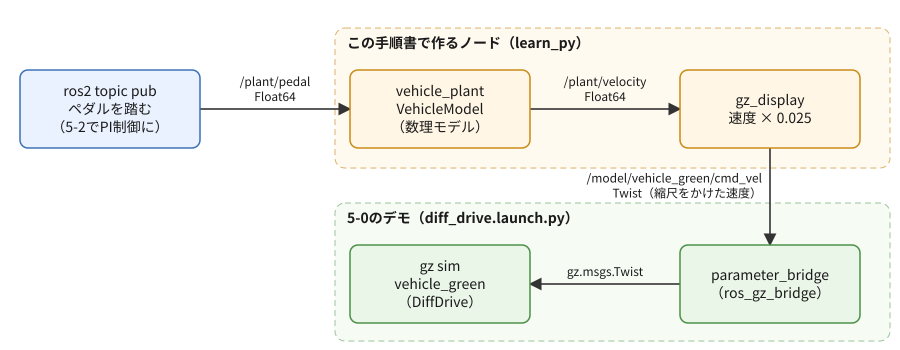
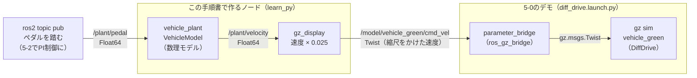

# フェーズ5-1 手順書: 車両の疑似プラントを作り、Gazeboで動きを見る

[`docs/learning_plan.md`](learning_plan.md) フェーズ5の5-1（idea_origin.md ステップ2）に対応する。1次元（前後の動きだけ）の車両の「疑似プラント」、つまり、制御の対象になる車両の動きを数式で計算するノードを自作する。数式の中身（数理モデル）を作ることが、この手順書の中心である。計算した速度は、フェーズ5-0で動かしたGazeboの緑の車両に送って、目で見える形にする。

- 想定環境: WSL2 + Ubuntu 24.04 + ROS2 Jazzy
- 前提: フェーズ3-1（Publisher・Subscriber）、フェーズ3-3（パラメータの宣言と、変更を検証するコールバック）、フェーズ5-0（[`docs/phase5_0_gazebo.md`](phase5_0_gazebo.md)。Gazeboのデモを起動できる。`ros2_ws/src/learn_py` の `package.xml` に `geometry_msgs` がある）。launch（フェーズ4）は、この手順書ではまだ使わない（フェーズ5-3で使う）
- 所要目安: 2コマ
- 言語: Python

> **進め方**: 前半（2節）で、車両に働く力とアクセル・ブレーキの遅れを式にし、手計算で答え（落ち着く速さと、落ち着くまでの時間の目安）を出しておく。4節で、その式をROS2を使わないPythonのクラスとして書き、計算結果が手計算と合うことを確かめる。5節でクラスをノードで包み、6節でログとGazeboの画面で動きを見る。サンプルは学習の手がかりとして最小限に書いたもので、公式チュートリアルの転載ではない。コードはこの手順書の作成時にビルドと `import` まで確認し、Gazeboを使わない部分（6-1節・6-3節と、`gz_display` が速度を縮尺して送ること）は使い捨ての環境でノードを起動して確かめた。Gazeboと組み合わせた挙動は、画面なしのGazeboでオドメトリの速度が縮尺どおりに変わることと、`vehicle_plant` を止めると車両が止まることまで確かめた。画面の見え方は未確認（出力が違う場合は、実機の表示を優先する）。

> **実行環境が無くても読めるように**: 実行する手順の直後には「期待する結果」として、表示される内容の例とその読み方を載せている。表示の出どころは次のとおり。4節のモデル単体の計算結果は、使い捨ての環境で実際に実行した表示（同じコードなら、同じ数値になる）。ビルドの表示（5-3節）は、使い捨ての環境で確かめた表示の形式。ノードを起動した後の表示のうち、Gazeboを使わない部分（6-1節・6-3節の `vehicle_plant` のログと `ros2 param` の表示、6-2節の最後の `gz_display` のログ）は、使い捨ての環境で実際に実行した表示で、時刻と、ペダルを送った時刻による数値の細部は実行ごとに異なる。6-2節のオドメトリの値は、使い捨ての環境でGazeboを画面なし（`gz sim -s`）で起動し、ブリッジを手で起動して確かめた表示。6-2節の画面の様子は、筆者が想定したもの。

## 0. 学習目標と完了条件

1. 車両に働く力（駆動力・制動力・転がり抵抗・速度に比例する抵抗）と、アクセル・ブレーキの遅れ（一次遅れ）を式で書き、落ち着く速さ（定常速度）と時定数を手計算できる。
2. 微分方程式をオイラー法で1ステップずつ計算するコードを書き、計算の刻み幅と時定数の関係（安定に計算できる条件）を説明できる。
3. 数理モデルをROS2に依存しないクラスに分け、ノードで包む理由を説明できる。
4. 車両のパラメータ（特に時定数）を実行中に変え、動きの変化をログとGazeboで確かめられる。

完了条件: ペダル0.5を踏み続けると速度が約9.1 m/s（2-3節の手計算の値）へ近づくことをログで確かめ、Gazeboの緑の車両が同じように加速して一定の速さに落ち着く様子を見る。`tau_accel` を大きくすると加速の立ち上がりが遅くなる理由を、2-2節の式で説明できる。

## 1. 全体像

この手順書で作るのは、次の2つのノードである。

- `vehicle_plant`: ペダルの指令（`/plant/pedal`）を受け取り、2節の式で車両の速度を計算して、`/plant/velocity` へ送る。これが疑似プラントで、数式の計算は `VehicleModel` というクラスに任せる。
- `gz_display`: `/plant/velocity` の速度に縮尺（既定は1/40）をかけ、Gazeboの緑の車両の速度指令（`/model/vehicle_green/cmd_vel`）として送る。Gazeboは、計算結果を見せる「表示器」として使う。



<details>
<summary>同じ図（mermaid版）</summary>



</details>

この手順書では、ペダルは `ros2 topic pub` で人が踏む。フェーズ5-2では、ここをPI制御のノードに置き換え、目標速度に合わせて自動でペダルを踏ませる。

Gazeboを表示器として使うのは、学習の中心を自作の数式に置くためである。車両の動きは自分の式で決まり、Gazeboの車両は送られた速度をなぞるだけにする（学習計画の[フェーズ5](learning_plan.md)の方針）。Gazeboの物理エンジンで車両を動かす方法は、フェーズ5-4で扱う。

## 2. 数理モデル

### 2-1. 車両に働く力

車両は前後にだけ動くものとし、前向きの速さを $v$（m/s）とする。車両に働く力は次の4つ。

| 力 | 記号 | 向き | 大きさ |
|---|---|---|---|
| 駆動力（アクセル） | $F_d$ | 前向き | アクセルの踏み込みに応じて、2-2節の遅れで変わる |
| 制動力（ブレーキ） | $F_b$ | 後ろ向き | ブレーキの踏み込みに応じて、2-2節の遅れで変わる |
| 転がり抵抗 | $F_r = \mu m g$ | 後ろ向き | 一定（タイヤが変形しながら転がることによる抵抗。 $\mu$ は転がり抵抗係数、 $m$ は質量、 $g$ は重力加速度） |
| 速度に比例する抵抗 | $c\,v$ | 後ろ向き | 速さに比例（空気抵抗などをまとめて、線形にしたもの。 $c$ は係数） |

ニュートンの運動方程式（質量 × 加速度 ＝ 力の合計）から、速度の変化は次の式で決まる。

$$
m \frac{dv}{dt} = F_d - F_b - \mu m g - c\,v
$$

ただし、この車両は後ろへは進まないものとする。ブレーキと転がり抵抗は、本来「動きを止める向き」にしか働かないので、止まった車両を後ろへ押すことはない。この式のままだと、止まった後も後ろ向きの力で $v$ が負になってしまうので、計算では $v$ が0を下回ったら0にそろえる（4節の `max(self.velocity, 0.0)`）。

### 2-2. アクセルとブレーキの遅れ（一次遅れ）

ペダルを踏んでも、力はすぐには出ない。エンジンやモーターが回転を上げるまで、ブレーキの油圧が高まるまでには、少し時間がかかる。この遅れを、次の「一次遅れ」の式で表す。

$$
\tau_a \frac{dF_d}{dt} = u_a F_{d,\max} - F_d, \qquad
\tau_b \frac{dF_b}{dt} = u_b F_{b,\max} - F_b
$$

- $u_a$・ $u_b$ はアクセル・ブレーキの踏み込み（0〜1）。ペダルの指令は1つの数 $u$（−1〜1）で受け取り、正ならアクセル（ $u_a = u$）、負ならブレーキ（ $u_b = -u$）とする。
- $F_{d,\max}$・ $F_{b,\max}$ は、踏み切ったときの力。右辺の $u_a F_{d,\max}$ が「出したい力」で、今の力 $F_d$ との差に比例する速さで近づいていく。
- $\tau_a$・ $\tau_b$ が**時定数**（秒）。ペダルを急に踏むと、力は時定数の時間で目標の約63%、3倍の時間で約95%に達する。時定数が大きいほど、ゆっくり立ち上がる。
- 止まった状態（ $F_d = 0$）からアクセル $u_a$ を踏み続けたときの力は、この式を解くと $F_d(t) = u_a F_{d,\max}\,(1 - e^{-t/\tau_a})$ になる（ $e \approx 2.718$ は自然対数の底）。 $t = \tau_a$ で $1 - e^{-1} \approx 0.63$、 $t = 3\tau_a$ で $1 - e^{-3} \approx 0.95$ になるのが、上の63%・95%の出どころである。力が一定の値から別の値へ変わるときも、差が同じ形で縮む。

アクセルとブレーキに別々の時定数を持たせているのが、このモデルの特徴である（既定値はアクセル0.5秒、ブレーキ0.2秒）。加速させるときと減速させるときで効き方が違う車両を、フェーズ5-2のPI制御でどう扱うかが、後の題材になる。

### 2-3. 定常速度と時定数を手計算する

ペダルを $u$ のまま踏み続けると、力が目標に達し（ $F_d = u F_{d,\max}$、 $F_b = 0$）、やがて速度も変わらなくなる（ $dv/dt = 0$）。2-1節の式の左辺を0にすると、そのときの速度（**定常速度**）が求まる。

$$
v_{ss} = \frac{u F_{d,\max} - \mu m g}{c}
$$

既定値（2-5節の表。 $\mu$ = 0.015、 $m$ = 1500 kg、 $F_{d,\max}$ = 3000 N、 $c$ = 140 N/(m/s)）と、重力加速度 $g$ = 9.81 m/s² を入れると、次のようになる。

- 転がり抵抗: $\mu m g = 0.015 \times 1500 \times 9.81 \approx 220.7$ N
- ペダル0.5: $v_{ss} = (0.5 \times 3000 - 220.7) / 140 \approx 9.14$ m/s（約33 km/h）
- ペダル1.0（全開）: $v_{ss} \approx 19.85$ m/s（約71 km/h）
- ペダルが $220.7 / 3000 \approx 0.074$ 未満だと、駆動力が転がり抵抗に負けて、車両は動き出さない。

定常速度に近づく速さも、式から分かる。力が一定なら、2-1節の式は速度についての一次遅れと同じ形（ $\frac{m}{c} \frac{dv}{dt} = \frac{F_d - \mu m g}{c} - v$）になり、その時定数は次のとおり。

$$
T = \frac{m}{c} = \frac{1500}{140} \approx 10.7 \text{ 秒}
$$

つまり、ペダル0.5を踏んでから約11秒で定常速度の約63%（約5.8 m/s）、約32秒で約95%（約8.7 m/s）に達する。アクセルの遅れ（0.5秒）は、この10.7秒に比べて短いので、ペダルを踏みっぱなしにしたときの速度の変化には小さな影響しか与えない。アクセルやブレーキの遅れが効いてくるのは、ペダルを細かく踏み変えるとき、つまりフェーズ5-2でPI制御がペダルを操作するときである。

### 2-4. オイラー法で計算する

2-1節と2-2節の式は、「今の状態から、変化率（1秒あたりの変化）が決まる」形をしている。状態は $v$・ $F_d$・ $F_b$ の3つ。コンピュータでは、短い時間 $\Delta t$ ごとに、次の式で状態を少しずつ進める。これを**オイラー法**と呼ぶ。

$$
x_{k+1} = x_k + \Delta t \cdot \left(\frac{dx}{dt}\right)_k
$$

$x_k$ は $k$ 回目の状態、 $(dx/dt)_k$ はそのときの変化率。3つの状態それぞれについて、**今の状態から変化率を全部求めてから**、まとめて $\Delta t$ だけ進める。この手順書では $\Delta t = 0.01$ 秒（1秒に100回）とする。

オイラー法は簡単だが、 $\Delta t$ が時定数に比べて長すぎると、計算が振動したり発散したりする。一次遅れの式で確かめると、1ステップごとに「目標との差」が $(1 - \Delta t / \tau)$ 倍になる。

| $\Delta t$ と $\tau$ の関係 | 目標との差の変わり方 | 計算の様子 |
|---|---|---|
| $\Delta t < \tau$ | 同じ符号のまま小さくなる | なめらかに目標へ近づく（正しい計算） |
| $\tau < \Delta t < 2\tau$ | 符号が毎回入れ替わりながら小さくなる | 目標をまたいで振動しながら近づく（実物には無い振動） |
| $\Delta t > 2\tau$ | 符号が入れ替わりながら大きくなる | 発散する（値が際限なく大きくなる） |

$\Delta t = 0.01$ 秒なら、時定数が0.01秒より長い限り、なめらかに計算できる。既定値の0.2秒・0.5秒には十分な余裕がある。時定数を実行中に変えられるようにするので（6-3節）、とても小さな値を入れるとこの問題が起きることは、覚えておく（6-3節の末尾の課題3で確かめる）。

### 2-5. パラメータと既定値

| パラメータ名 | 記号 | 既定値 | 単位 | 既定値の考え方 |
|---|---|---|---|---|
| `mass` | $m$ | 1500.0 | kg | 乗用車の大まかな質量 |
| `drive_force_max` | $F_{d,\max}$ | 3000.0 | N | 質量1500 kgで、止まった状態から約2 m/s²で加速できる力 |
| `brake_force_max` | $F_{b,\max}$ | 9000.0 | N | 約6 m/s²で減速できる力。アクセルより強くしてある |
| `tau_accel` | $\tau_a$ | 0.5 | s | 駆動力の立ち上がりの遅れ。筆者が目安として選んだ値 |
| `tau_brake` | $\tau_b$ | 0.2 | s | 制動力の立ち上がりの遅れ。アクセルより速く効く想定で、筆者が目安として選んだ値 |
| `rolling_coeff` | $\mu$ | 0.015 | なし | 舗装路の乗用車のタイヤで一般的に言われる範囲（0.01〜0.015程度）から |
| `drag_coeff` | $c$ | 140.0 | N/(m/s) | アクセル全開の定常速度が約20 m/sになるように選んだ値（下の補足） |
| `period` | $\Delta t$ | 0.01 | s | 計算の周期（オイラー法の刻み幅） |

時定数などの値は、実在の特定の車両から測ったものではなく、動きが分かりやすく、現実から大きく外れない範囲で選んだものである。6節で、実行中に変えて違いを見る。

> **補足: 抵抗を線形にした理由**
>
> - **一般的なモデル**: 空気抵抗は、速さの2乗に比例する（ $\frac{1}{2}\rho C_d A v^2$。 $\rho$ は空気の密度、 $C_d A$ は車体の形と大きさで決まる値）。転がり抵抗は、速さによらずほぼ一定。乗用車の最高速度は、多くの場合、エンジンやモーターの出力（力 × 速さ）の上限で決まる。
> - **このサンプルで線形にした理由**: 速さに比例する抵抗にすると、2-1節の式が線形の微分方程式になり、2-3節のように定常速度と時定数を手計算で求められる。4節の計算結果を手計算と見比べられることを優先した。係数 $c$ は、このモデルに出力の上限が無い代わりに、アクセル全開の最高速度を約20 m/sに収める役も担っている。そのため、本物の空気抵抗を線形にした値（20 m/s付近で10 N/(m/s)前後）よりかなり大きく、「速度が上がるほど増える抵抗（駆動系の損失なども含む）を、まとめて1つの係数にしたもの」と考える。
> - **実務の目安**: 車両の運動を実物に近づけたいときは、空気抵抗を2乗の式にし、駆動力に出力の上限（速くなるほど出せる力が減る）を入れる。制御器を設計するときには、逆に、ある速度の付近で線形に近似したモデルを使うことが多い（線形のモデルなら、伝達関数（入力と出力の関係を1つの式で表す、制御工学の道具）などで解析できるため）。

## 3. 仕様

- パッケージ: `learn_py`（フェーズ3-1から使っているもの）に、ファイルを3つ足す。

| ファイル | 中身 |
|---|---|
| `vehicle_model.py` | 2節の式を計算するクラス `VehicleModel` と、パラメータをまとめる `VehicleParams`。**ROS2を使わない**（`import rclpy` をしない） |
| `plant_node.py` | `VehicleModel` を包むノード `vehicle_plant`（実行ファイル名も `vehicle_plant`） |
| `gz_display.py` | 表示用のノード `gz_display`（実行ファイル名も `gz_display`） |

- `vehicle_plant`:
  - 受ける: `/plant/pedal`（[`std_msgs/msg/Float64`](https://github.com/ros2/common_interfaces/blob/jazzy/std_msgs/msg/Float64.msg)）。−1〜1の範囲外の値は、範囲の端にそろえる。次の指令が来るまで、同じ値を踏み続ける。
  - 送る: `/plant/velocity`（`std_msgs/msg/Float64`、m/s）を、`period` 秒ごとに。
  - パラメータ: 2-5節の表の8つ。実行中に `ros2 param set` で変えられる（`rolling_coeff`・`drag_coeff` は0以上、それ以外は正の値だけを受け付ける）。
  - ログ: 1秒に1回、ペダル・速度・駆動力・制動力を出す。
- `gz_display`:
  - 受ける: `/plant/velocity`。
  - 送る: `/model/vehicle_green/cmd_vel`（[`geometry_msgs/msg/Twist`](https://github.com/ros2/common_interfaces/blob/jazzy/geometry_msgs/msg/Twist.msg)）の `linear.x` に、速度 × `scale` を入れて送る。
  - パラメータ: `scale`（既定0.025 ＝ 1/40）。
  - `/plant/velocity` が0.5秒以上届かなければ、停止の指令を1回送る。

トピックの型は、速度もペダルも1つの数なので、いちばん単純な `Float64` にした。位置や向きまで含む [`nav_msgs/msg/Odometry`](https://github.com/ros2/common_interfaces/blob/jazzy/nav_msgs/msg/Odometry.msg)（フェーズ5-0で見た型）は、前後の速さだけを扱うこの車両には大きすぎる。フェーズ5-2のPI制御ノードも、この2つのトピックをそのまま使う。フェーズ5-4でプラントをGazeboの物理に差し替えるときも、この2つのトピックの名前・型・単位（ペダルは−1〜1、速度は実車のm/s）を保つので、PI制御ノードを変えずにつなぎ替えられる。

縮尺を1/40にしたのは、フェーズ5-0の2節の表のとおり、Gazeboの車両の最高速度が0.5 m/sだからである。アクセル全開の約20 m/sが、1/40で約0.5 m/sに収まる。縮尺は `gz_display` が送る直前にかけるだけなので、`vehicle_plant` の計算には影響しない。

主なAPI（これまでの手順書で使ったもの以外）:

| API | 役割 |
|---|---|
| `@dataclass`（Python標準の `dataclasses`） | 値をまとめて持つだけのクラスを、フィールドと既定値を並べるだけで作る |
| `dataclasses.fields(クラス)` | データクラスのフィールドの一覧を得る。パラメータを名前の一覧から一括で宣言するのに使う |
| `dataclasses.replace(インスタンス, 名前=値, ...)` | 一部のフィールドだけを変えた新しいインスタンスを作る |
| `std_msgs.msg.Float64` | 実数1つの型。値は `msg.data` |

## 4. 数理モデルをROS2なしで確かめる

まず、2節の式だけを書いたファイルを作り、ROS2を使わずに計算結果を確かめる。

ファイル: `ros2_ws/src/learn_py/learn_py/vehicle_model.py`

<!-- file: ros2_ws/src/learn_py/learn_py/vehicle_model.py -->
```python
from dataclasses import dataclass

GRAVITY = 9.81  # 重力加速度 [m/s^2]


# 車両のパラメータ（単位はSI）。既定値は乗用車を大まかに想定した値。
@dataclass
class VehicleParams:
    mass: float = 1500.0             # 質量 [kg]
    drive_force_max: float = 3000.0  # アクセル全開のときの駆動力 [N]
    brake_force_max: float = 9000.0  # ブレーキ全開のときの制動力 [N]
    tau_accel: float = 0.5           # 駆動力の遅れの時定数 [s]
    tau_brake: float = 0.2           # 制動力の遅れの時定数 [s]
    rolling_coeff: float = 0.015     # 転がり抵抗係数 [-]
    drag_coeff: float = 140.0        # 速度に比例する抵抗の係数 [N/(m/s)]


# 1次元の車両の疑似プラント。ペダルの指令から速度までを、オイラー法で1ステップずつ計算する。
class VehicleModel:
    # パラメータを受け取り、止まった状態（速度0、力0）から始める。
    def __init__(self, params):
        self.params = params
        self.velocity = 0.0
        self.drive_force = 0.0
        self.brake_force = 0.0

    # ペダルの指令 pedal（-1〜1。正がアクセル、負がブレーキ）で dt 秒進め、新しい速度を返す。
    def step(self, pedal, dt):
        p = self.params
        pedal = min(max(pedal, -1.0), 1.0)
        accel_cmd = max(pedal, 0.0)
        brake_cmd = max(-pedal, 0.0)

        # 今の状態から、3つの状態量の変化率（1秒あたりの変化）を求める
        d_drive = (accel_cmd * p.drive_force_max - self.drive_force) / p.tau_accel
        d_brake = (brake_cmd * p.brake_force_max - self.brake_force) / p.tau_brake
        rolling = p.rolling_coeff * p.mass * GRAVITY
        drag = p.drag_coeff * self.velocity
        d_velocity = (self.drive_force - self.brake_force - rolling - drag) / p.mass

        # オイラー法: 変化率 × dt だけ進める
        self.drive_force += d_drive * dt
        self.brake_force += d_brake * dt
        self.velocity += d_velocity * dt
        # ブレーキと転がり抵抗は動きを止める向きにしか働かないので、後ろへは進ませない
        self.velocity = max(self.velocity, 0.0)
        return self.velocity


# ROS2を使わずにモデルだけを動かし、アクセル0.5で30秒、ブレーキ0.3で10秒の速度を表示する。
def main():
    model = VehicleModel(VehicleParams())
    dt = 0.01
    shown = [0.0, 0.5, 1.0, 5.0, 10.0, 15.0, 20.0, 25.0,
             30.0, 30.5, 31.0, 32.0, 33.0, 34.0, 35.0, 40.0]
    print('  t[s]  pedal  v[m/s]  drive[N]  brake[N]')
    for i in range(int(40.0 / dt) + 1):
        t = round(i * dt, 2)
        pedal = 0.5 if t < 30.0 else -0.3
        if t in shown:
            print(f'{t:6.1f}  {pedal:+.1f}  {model.velocity:6.2f}  '
                  f'{model.drive_force:8.0f}  {model.brake_force:8.0f}')
        model.step(pedal, dt)


if __name__ == '__main__':
    main()
```

**`vehicle_model.py` の解説**

- **`VehicleParams`**: 2-5節の表の7つの値を、既定値付きで並べたデータクラス。`@dataclass` を付けると、`VehicleParams()` で既定値のまま、`VehicleParams(tau_accel=3.0)` で一部だけ変えて作れる（`__init__` を自分で書かなくてよい）。単位は、コメントに書いたとおりすべてSI（kg・N・s・m/s）。`period`（計算の周期）はここに含めず、`step` の引数 `dt` として渡す。周期は「モデルの性質」ではなく「どれだけ細かく計算するか」の設定だからである。
- **`VehicleModel.__init__`**: 状態は、速度・駆動力・制動力の3つ（2-4節の $v$・ $F_d$・ $F_b$）。止まった状態（すべて0）から始める。
- **`step`**: 2節の式を、そのまま1ステップ分のコードにしたもの。
  - 最初に、ペダルの値を−1〜1にそろえ、アクセルの踏み込み `accel_cmd` とブレーキの踏み込み `brake_cmd` に分ける（どちらかは必ず0）。
  - 次に、**今の状態から**3つの変化率 `d_drive`・`d_brake`・`d_velocity` を全部求める。`d_drive` の式は、2-2節の式の両辺を $\tau_a$ で割った形（ $dF_d/dt = (u_a F_{d,\max} - F_d)/\tau_a$）。`d_velocity` は、2-1節の式を $m$ で割った形。
  - 最後に、3つの状態をまとめて `変化率 × dt` だけ進める（2-4節のオイラー法）。変化率を求める途中で状態を書き換えると、ある式は新しい値を、別の式は古い値を使うことになり、2-4節の式と食い違うため、この順にしている。
  - `max(self.velocity, 0.0)` が、2-1節の「後ろへは進まない」の実装。
- **`main`**: ROS2を使わずに、モデルだけを40秒分計算する。最初の30秒はペダル0.5、その後の10秒はブレーキ0.3（ペダル−0.3）。4000ステップのうち、`shown` に挙げた時刻の行だけを表示する。
- **`if __name__ == '__main__':`**: このファイルを `python3` で直接実行したときだけ `main` を呼ぶ。ノード（5節）から `import` したときは呼ばれない。

ファイルを保存したら、ビルドせずにそのまま実行できる（ROS2を使わないので、`source` も要らない）。

```bash
python3 ~/ros2_ws/src/learn_py/learn_py/vehicle_model.py
```

**期待する結果**:

```text
  t[s]  pedal  v[m/s]  drive[N]  brake[N]
   0.0  +0.5    0.00         0         0
   0.5  +0.5    0.11       954         0
   1.0  +0.5    0.41      1301         0
   5.0  +0.5    3.08      1500         0
  10.0  +0.5    5.34      1500         0
  15.0  +0.5    6.76      1500         0
  20.0  +0.5    7.65      1500         0
  25.0  +0.5    8.20      1500         0
  30.0  -0.3    8.55      1500         0
  30.5  -0.3    7.84       546      2492
  31.0  -0.3    6.67       199      2684
  32.0  -0.3    4.27        26      2700
  33.0  -0.3    2.04         3      2700
  34.0  -0.3    0.00         0      2700
  35.0  -0.3    0.00         0      2700
  40.0  -0.3    0.00         0      2700
```

各行は「その時刻の状態」と「その時刻から踏むペダル」。2-3節の手計算と見比べる。

- **加速（0〜30秒）**: 速度は、10秒で5.34 m/s、30秒で8.55 m/sと、定常速度の9.14 m/sへ近づいていく。一次遅れの式から求めた値（2-2節の $F_d(t)$ と同じ形で、目標を定常速度、時定数を2-3節の $T$ = 10.7秒にした $9.14 \times (1 - e^{-t/10.7})$）は、10秒で約5.56 m/s、30秒で約8.58 m/sで、計算結果はそれより少しだけ遅れている。アクセルの遅れ（0.5秒）の分だけ、力が立ち上がるのが遅いためである。
- **駆動力**: 0.5秒で954 N、1秒で1301 Nと、目標の1500 N（0.5 × 3000 N）へ近づき、5秒後には1500 Nに落ち着いている。0.5秒（時定数）の時点で、目標の約63%（1500 × 0.63 ≈ 950）になっていることが、2-2節の説明と合う。
- **ブレーキ（30秒〜）**: ペダルを−0.3にすると、制動力は0.5秒で2492 Nと、目標の2700 N（0.3 × 9000 N）へ速く近づく。一方、駆動力は0.5秒で546 Nと、ゆっくり減っていく。**アクセルを離しても、駆動力はすぐには消えない**。アクセルとブレーキの時定数の違いが、このように数字に表れる。
- **停止（34秒〜）**: 約4秒で速度が0になり、その後も制動力は2700 Nのままだが、速度は負にならない（2-1節の「後ろへは進まない」）。

> 課題1: `main` の `pedal = 0.5` を `1.0` に変えて実行し、30秒の速度が、2-3節で求めた全開の定常速度（約19.85 m/s）の何%になっているか確かめる。時定数 $T$ はペダルの踏み込みによらないので、割合は0.5のときとほぼ同じになる。
>
> 課題2: `main` の最初の行を `model = VehicleModel(VehicleParams(drag_coeff=70.0))` に変えると、定常速度と時定数はそれぞれ何倍になるか。2-3節の式から予想してから実行する（どちらも約2倍になる。30秒ではまだ定常速度から遠い）。

## 5. ノードで包む

### 5-1. 疑似プラントのノード（`plant_node.py`）

ファイル: `ros2_ws/src/learn_py/learn_py/plant_node.py`

<!-- file: ros2_ws/src/learn_py/learn_py/plant_node.py -->
```python
import dataclasses

import rclpy
from rcl_interfaces.msg import SetParametersResult
from rclpy.executors import ExternalShutdownException
from rclpy.node import Node
from std_msgs.msg import Float64

from learn_py.vehicle_model import VehicleModel, VehicleParams


# VehicleModel をノードで包んだ疑似プラント。plant/pedal の指令で速度を計算し、plant/velocity へ送る。
# 車両のパラメータ（時定数など）は、実行中に ros2 param set で変えられる。
class VehiclePlant(Node):
    # 車両のパラメータと計算の周期を宣言し、モデル・通信の口・タイマーを用意する。
    def __init__(self):
        super().__init__('vehicle_plant')
        self.model_param_names = [f.name for f in dataclasses.fields(VehicleParams)]
        defaults = VehicleParams()
        for name in self.model_param_names:
            self.declare_parameter(name, getattr(defaults, name))
        self.declare_parameter('period', 0.01)

        values = {name: self.get_parameter(name).value for name in self.model_param_names}
        self.model = VehicleModel(VehicleParams(**values))
        self.period = self.get_parameter('period').value
        self.pedal = 0.0

        self.sub = self.create_subscription(Float64, 'plant/pedal', self.on_pedal, 10)
        self.pub = self.create_publisher(Float64, 'plant/velocity', 10)
        self.timer = self.create_timer(self.period, self.on_timer)
        self.add_on_set_parameters_callback(self.on_params)

    # 届いたペダルの指令を覚えておく（次の指令が来るまで、同じ値を踏み続ける）。
    def on_pedal(self, msg):
        self.pedal = msg.data

    # モデルを1周期ぶん進め、速度を送る。1秒に1回、状態をログに出す。
    def on_timer(self):
        velocity = self.model.step(self.pedal, self.period)
        msg = Float64()
        msg.data = velocity
        self.pub.publish(msg)
        self.get_logger().info(
            f'pedal: {self.pedal:+.2f}, velocity: {velocity:5.2f} m/s, '
            f'drive: {self.model.drive_force:5.0f} N, brake: {self.model.brake_force:5.0f} N',
            throttle_duration_sec=1.0)

    # パラメータの変更を検証してから反映する。車両のパラメータは、速度などの状態を保ったまま差し替える。
    def on_params(self, params):
        for p in params:
            if p.name in ('rolling_coeff', 'drag_coeff'):
                if p.value < 0.0:
                    return SetParametersResult(successful=False, reason=f'{p.name} must be >= 0')
            elif p.name in self.model_param_names or p.name == 'period':
                if p.value <= 0.0:
                    return SetParametersResult(successful=False, reason=f'{p.name} must be > 0')
        changes = {p.name: p.value for p in params if p.name in self.model_param_names}
        if changes:
            self.model.params = dataclasses.replace(self.model.params, **changes)
        for p in params:
            if p.name == 'period':
                self.period = p.value
                self.timer.cancel()
                self.timer = self.create_timer(self.period, self.on_timer)
        return SetParametersResult(successful=True)


# エントリポイント（setup.py の entry_points から呼ばれる）。
# ノードを作って spin で回し、Ctrl+C で後片付けして終わる。
def main(args=None):
    rclpy.init(args=args)
    node = VehiclePlant()
    try:
        rclpy.spin(node)
    except (KeyboardInterrupt, ExternalShutdownException):
        pass
    finally:
        node.destroy_node()
        rclpy.try_shutdown()
```

**`plant_node.py` の解説**

役割は、4節の `VehicleModel` を、トピックとパラメータでROS2につなぐこと。**式はこのファイルに1行も無い**。計算はすべて `self.model.step(...)` に任せ、ノードは「指令を受け取る」「周期的に計算を進める」「結果を送る」「パラメータを受け付ける」だけを担当する。

- **`import`**: `from learn_py.vehicle_model import ...` で、同じパッケージの4節のファイルを読み込む。ビルドすると、`learn_py` パッケージの中のモジュールとして `import` できるようになる。
- **`__init__`（パラメータの宣言）**:
  - `dataclasses.fields(VehicleParams)` で、`VehicleParams` のフィールド名（`mass`・`drive_force_max` …）の一覧を得て、同じ名前のパラメータを、`VehicleParams` の既定値で宣言する。フィールドを7つ並べて `declare_parameter` を7行書く代わりに、ループで書いている。こうしておくと、`VehicleParams` にフィールドを足すだけで、パラメータも自動で増える。
  - 既定値は `1500.0` のように小数点付きなので、パラメータの型は実数（double）になる（フェーズ3-3の5-3節のとおり、`ros2 param set` で整数を渡すと型の不一致で拒否される）。
  - 宣言の後、`get_parameter` で値を読み（起動時に `-p` などで指定されていればその値）、`VehicleParams(**values)` でパラメータを作ってモデルに渡す。`**values` は、辞書 `{'mass': 1500.0, ...}` を `mass=1500.0, ...` の形の引数に展開するPythonの書き方。
- **`on_pedal`**: 届いた値を `self.pedal` に覚えるだけ。計算はここでは行わない。ペダルの指令がいつ・どのくらいの頻度で届いても、計算の周期（`period`）は一定に保ちたいからである。
- **`on_timer`**: `period` 秒ごとに、モデルを `period` 秒分だけ進めて、速度を送る。計算の刻み幅として、タイマーの周期の値をそのまま使っている（実際の呼び出し間隔は少し揺れるが、計算上は「ちょうど `period` 秒進んだ」とみなす。この揺れの影響は小さい）。ログは `throttle_duration_sec=1.0` で1秒に1回に間引く（フェーズ5-0の5-1節と同じ）。
- **`on_params`**: フェーズ3-3の `param_talker` と同じく、1回目のループで検証、残りで反映する。
  - 車両のパラメータは、`dataclasses.replace` で「変更分だけを入れ替えた新しい `VehicleParams`」を作り、モデルの `params` を差し替える。**モデルの状態（速度・駆動力・制動力）はそのまま**なので、走っている途中で時定数を変えても、その瞬間から新しい時定数で計算が続く。
  - `period` を変えたときは、フェーズ3-3と同じくタイマーを作り直す。
  - `use_sim_time` など、ノードが自動で持つパラメータの変更は、どちらの `if` にも当たらないので、検証も反映もせずに受け入れる。
- **`main`**: フェーズ3-1のtalkerと同じ。

> **補足: 起動時の値を検証していない理由**
>
> - **一般的な書き方**: 外から受け取る値は、実行中の変更だけでなく、起動時に `-p` やYAMLで渡された値も検証する。やり方は、`__init__` で値を読んだ直後に、`on_params` と同じ検証をかけること。rclpyは、パラメータを宣言した時点で登録済みの検証のコールバックを呼ぶので、コールバックを宣言より前に登録する方法もある。ただし、このサンプルの `on_params` は検証だけでなく反映（`self.model` の書き換えやタイマーの作り直し）もしているので、そのまま前へ移すと、宣言の時点ではまだモデルやタイマーが無く失敗する。前へ移すなら、検証だけの関数に分ける。
> - **このサンプルで検証していない理由**: このノードは、宣言と値の読み込みを済ませてから、最後に `on_params` を登録している。そのため、`on_params` が確かめるのは実行中の変更（`ros2 param set`）だけで、起動時に `-p tau_accel:=0.0` のように0を渡すと、そのままモデルに入り、最初の計算で0で割って（`ZeroDivisionError`）ノードが止まる。止まるのはシミュレーションだけで、起動し直せば元に戻る。起動時の検証まで書くとコードが膨らみ、パラメータの受け取り方という学習の要点が見えにくくなるので、あえて省いている。
> - **実務の目安**: 実物の機器につながるノードでは、不正な値で止まると機器が動きの途中で放置されかねないので、起動時の値も必ず検証し、不正なら分かりやすいメッセージで起動を止める。

### 5-2. 表示用のノード（`gz_display.py`）

ファイル: `ros2_ws/src/learn_py/learn_py/gz_display.py`

<!-- file: ros2_ws/src/learn_py/learn_py/gz_display.py -->
```python
import rclpy
from geometry_msgs.msg import Twist
from rcl_interfaces.msg import SetParametersResult
from rclpy.clock import Clock, ClockType
from rclpy.executors import ExternalShutdownException
from rclpy.node import Node
from std_msgs.msg import Float64


# 疑似プラントの速度に縮尺をかけ、Gazeboの緑の車両への速度指令として送る表示用のノード。
# プラントからの速度が途絶えたら、車両を止める。
class GzDisplay(Node):
    # 縮尺のパラメータを宣言し、通信の口と、途絶えたかを調べるタイマー・時計を用意する。
    def __init__(self):
        super().__init__('gz_display')
        self.declare_parameter('scale', 0.025)
        self.scale = self.get_parameter('scale').value
        self.steady_clock = Clock(clock_type=ClockType.STEADY_TIME)
        self.last_received = None

        self.pub = self.create_publisher(Twist, '/model/vehicle_green/cmd_vel', 10)
        self.sub = self.create_subscription(Float64, 'plant/velocity', self.on_velocity, 10)
        self.timer = self.create_timer(0.1, self.on_watchdog)
        self.add_on_set_parameters_callback(self.on_params)

    # プラントの速度が届くたびに、縮尺をかけた速度指令を送る。
    def on_velocity(self, msg):
        self.last_received = self.steady_clock.now()
        cmd = Twist()
        cmd.linear.x = msg.data * self.scale
        self.pub.publish(cmd)

    # 速度が0.5秒以上届いていなければ、停止の指令を1回送る（DiffDriveは最後の指令を保持するため）。
    def on_watchdog(self):
        if self.last_received is None:
            return
        elapsed = (self.steady_clock.now() - self.last_received).nanoseconds * 1e-9
        if elapsed > 0.5:
            self.pub.publish(Twist())
            self.last_received = None
            self.get_logger().info('plant/velocity timed out; sent a stop command')

    # scale は正の値だけを受け付ける。
    def on_params(self, params):
        for p in params:
            if p.name == 'scale' and p.value <= 0.0:
                return SetParametersResult(successful=False, reason='scale must be > 0')
        for p in params:
            if p.name == 'scale':
                self.scale = p.value
        return SetParametersResult(successful=True)


# エントリポイント（setup.py の entry_points から呼ばれる）。
# ノードを作って spin で回し、Ctrl+C で後片付けして終わる。
def main(args=None):
    rclpy.init(args=args)
    node = GzDisplay()
    try:
        rclpy.spin(node)
    except (KeyboardInterrupt, ExternalShutdownException):
        pass
    finally:
        node.destroy_node()
        rclpy.try_shutdown()
```

**`gz_display.py` の解説**

- **`on_velocity`**: 速度が届くたびに、縮尺をかけて `Twist` の `linear.x` に入れて送る。フェーズ5-0の `gz_drive` の `on_timer` と同じ形で、送る値が一定の0.3ではなく、プラントの速度 × 縮尺になっただけ。`vehicle_plant` が100 Hzで送るので、Gazeboへの指令も100 Hzになる。
- **`on_watchdog`**（途絶えの見張り）: Gazeboの車両（DiffDrive）は、最後に受け取った指令を保持し続ける（フェーズ5-0の4-3節）。そのため、`vehicle_plant` を止めると、Gazeboの車両は最後の速度のまま走り続けてしまう。0.1秒ごとに「最後に速度が届いてから何秒たったか」を調べ、0.5秒を超えたら停止の指令（全フィールドが0の `Twist()`）を1回送る。一定時間指令が途絶えたら止める仕組みは、実物のロボットでもよく使われる（ウォッチドッグと呼ばれる）。
  - 経過時間は、`__init__` で作った `self.steady_clock`（`ClockType.STEADY_TIME`。単調増加する時計）で測る。2つの時刻の差は `Duration` になり、`.nanoseconds` でナノ秒の整数を取り出して秒に直している。
  - ノードの時計（`self.get_clock()`）を使わないのは、ノードの時計がふつうはPCの現在時刻で、時刻合わせ（NTPなど）で数秒飛ぶことがあるからである。現在時刻が前へ飛ぶと、速度が届いているのに「0.5秒以上届いていない」と誤って判定し、停止の指令を送ってしまう（この手順書の作成時に、使い捨ての環境で実際に起きた）。単調増加する時計は、時刻合わせの影響を受けず、戻ったり飛んだりしない。一般に、タイムアウトや処理時間など**経過時間を測るときは単調増加する時計**、ログの記録など**いつ起きたかを残すときは現在時刻**を使う。
  - 停止の指令を送った後は `self.last_received = None` に戻し、何度も送らないようにしている。
- **`on_params`**: `scale` を正の値に限って受け付ける。実行中に縮尺を変えると、その後に届いた速度から新しい縮尺で送られる。
- `gz_display` 自身を先に止めた場合（`Ctrl+C`）は、停止の指令を送る前に終わるので、Gazeboの車両は走り続ける。止める順は、**`vehicle_plant` が先、`gz_display` が後**にする。

### 5-3. 実行ファイルとして登録し、ビルドする

依存の追加は要らない。`Float64` の `std_msgs` はフェーズ3-1で、`Twist` の `geometry_msgs` はフェーズ5-0で `package.xml` に足してあり、`rcl_interfaces` は `rclpy` を通じて使える（フェーズ3-3と同じ）。

`ros2_ws/src/learn_py/setup.py` の `entry_points` に2行足す（既存の行はすべて残す）。必須の冊（フェーズ3-1〜3-3と5-0）まで進めた状態なら、次のようになる。

<!-- snippet: py_entry_points_plant -->
```python
    entry_points={
        'console_scripts': [
            'hello = learn_py.hello:main',
            'talker = learn_py.talker:main',
            'listener = learn_py.listener:main',
            'sine_pub = learn_py.sine_pub:main',
            'sine_sub = learn_py.sine_sub:main',
            'turtle_circle = learn_py.turtle_circle:main',
            'qos_talker = learn_py.qos_talker:main',
            'qos_listener = learn_py.qos_listener:main',
            'param_talker = learn_py.param_talker:main',
            'gz_drive = learn_py.gz_drive:main',
            'vehicle_plant = learn_py.plant_node:main',
            'gz_display = learn_py.gz_display:main',
        ],
    },
```

並び順や、任意の冊（フェーズ3-4・3-5など）で足した行の有無は、進め方によって違ってよい。既存の行は残して、最後の2行を足す。`vehicle_model.py` は実行ファイルではない（ノードから `import` される部品）ので、登録しない。

```bash
cd ~/ros2_ws

colcon build --symlink-install --packages-select learn_py

source install/setup.bash

ros2 pkg executables learn_py
```

**期待する結果**（ビルドの秒数は環境によって変わる。`ros2 pkg executables` の分は、フェーズ5-0までの実行ファイルに2つ加わる。抜粋）:

```text
Starting >>> learn_py
Finished <<< learn_py [1.9s]

Summary: 1 package finished [2.2s]
...
learn_py gz_display
...
learn_py vehicle_plant
```

`ros2 pkg executables` の一覧に `gz_display` と `vehicle_plant` があれば、登録できている（並びは名前順）。

## 6. 動かす

### 6-1. プラントだけを動かす

まずGazeboを使わずに、プラントのログだけで動きを確かめる。ターミナルを2つ使う。T2は `ros2 topic pub` と `ros2 param` しか使わないが、ほかのターミナルと手順をそろえるため、同じように `source` しておく。

```bash
# T1
cd ~/ros2_ws

source install/setup.bash

ros2 run learn_py vehicle_plant

# T2
cd ~/ros2_ws

source install/setup.bash

ros2 topic pub --once /plant/pedal std_msgs/msg/Float64 "{data: 0.5}"
```

**期待する結果**（T1の分。T2でペダル0.5を送った前後。時刻は実行ごとに変わり、数値もペダルが届いた時刻とログの時刻のずれで少し変わる）:

```text
[INFO] [1790401347.906197978] [vehicle_plant]: pedal: +0.00, velocity:  0.00 m/s, drive:     0 N, brake:     0 N
...
[INFO] [1790401350.924728804] [vehicle_plant]: pedal: +0.00, velocity:  0.00 m/s, drive:     0 N, brake:     0 N
[INFO] [1790401351.934830672] [vehicle_plant]: pedal: +0.50, velocity:  0.31 m/s, drive:  1231 N, brake:     0 N
[INFO] [1790401352.944361550] [vehicle_plant]: pedal: +0.50, velocity:  1.03 m/s, drive:  1465 N, brake:     0 N
[INFO] [1790401353.944690823] [vehicle_plant]: pedal: +0.50, velocity:  1.75 m/s, drive:  1495 N, brake:     0 N
[INFO] [1790401354.954452196] [vehicle_plant]: pedal: +0.50, velocity:  2.41 m/s, drive:  1499 N, brake:     0 N
...
```

- 起動直後はペダル0で、速度も力も0のまま。ペダル0.5が届くと、`pedal: +0.50` に変わり、駆動力が1500 Nへ、速度が少しずつ上がっていく。
- 数字は、4節の表（1秒で0.41 m/s・1301 N）とぴったりは同じにならない。ログは1秒おきで、ペダルが届いた瞬間とは揃っていないためである。この例の `pedal: +0.50` の1行目は、駆動力1231 Nから2-2節の $F_d(t)$ の式で逆算すると、ペダルが届いてから約0.9秒後の値。
- そのまま待つと、ペダルを送ってから30秒で8.5 m/s前後、40秒で8.9 m/s前後と（4節の表の値）、定常速度の9.14 m/sへ近づきながら、増え方が小さくなっていく。

続けてT2でブレーキを踏む。

```bash
# T2
ros2 topic pub --once /plant/pedal std_msgs/msg/Float64 "{data: -0.3}"
```

**期待する結果**（T1の分。ペダル0.5を約41秒踏んだ後（8.93 m/s）でブレーキ0.3を送った前後。数値の細部は変わる）:

```text
[INFO] [1790401395.794488988] [vehicle_plant]: pedal: +0.50, velocity:  8.93 m/s, drive:  1500 N, brake:     0 N
[INFO] [1790401396.804495879] [vehicle_plant]: pedal: -0.30, velocity:  7.58 m/s, drive:   317 N, brake:  2648 N
[INFO] [1790401397.814433044] [vehicle_plant]: pedal: -0.30, velocity:  5.11 m/s, drive:    41 N, brake:  2700 N
[INFO] [1790401398.814484135] [vehicle_plant]: pedal: -0.30, velocity:  2.81 m/s, drive:     5 N, brake:  2700 N
[INFO] [1790401399.824574118] [vehicle_plant]: pedal: -0.30, velocity:  0.68 m/s, drive:     1 N, brake:  2700 N
[INFO] [1790401400.834040141] [vehicle_plant]: pedal: -0.30, velocity:  0.00 m/s, drive:     0 N, brake:  2700 N
```

制動力はすぐに2700 Nに達し、駆動力はゆっくり0へ減る。約4秒で止まり、速度は0のまま負にならない。T1は、次の6-2節でもそのまま使う。

### 6-2. Gazeboで見る

T1の `vehicle_plant` は動かしたまま、ターミナルを2つ足す。T3でフェーズ5-0のデモを起動し、T4で表示用のノードを動かす。

```bash
# T3
ros2 launch ros_gz_sim_demos diff_drive.launch.py rviz:=false

# T4
cd ~/ros2_ws

source install/setup.bash

ros2 run learn_py gz_display
```

**期待する結果**: T3でGazeboのウィンドウが開き、青と緑の車両が見える（フェーズ5-0の3-2節と同じ）。T4は、起動しても何も表示しない（ログを出すのは、速度が途絶えたときだけ）。6-1節の最後にブレーキで止めてあるので、緑の車両は止まったまま。

T2でペダルを踏み、Gazeboの画面を見る。

```bash
# T2
ros2 topic pub --once /plant/pedal std_msgs/msg/Float64 "{data: 0.5}"
```

**期待する結果**: Gazeboの画面で、緑の車両がゆっくり動き出し、だんだん速くなって、やがて一定の速さで走り続ける。T1のログは6-1節の1つめの期待する結果と同じように変わる。加速の様子が、T1の速度の数字の変わり方と一致していることを確かめる。

Gazebo側の車両の速さは、フェーズ5-0の3-4節のオドメトリで確かめられる。定常速度の近くまで待ってから（30秒ほど）、T2で次を実行する。

```bash
# T2
ros2 topic echo --once /model/vehicle_green/odometry --field twist.twist.linear.x
```

**期待する結果**（ペダルを送ってから約36秒後の例。値は、待った時間によって変わり、少し揺れる）:

```text
0.22084287765338217
---
```

T1のログの速度に縮尺をかけた値（この例では、同じころのプラントの速度が8.79 m/sで、8.79 × 0.025 ≈ 0.220 m/s。定常速度の9.14 m/sなら約0.228 m/s）に近ければ、表示用ノードとブリッジが正しくつながっている。加速している最中は、T1のログとこのコマンドを実行した時刻のずれの分だけ、値が食い違って見える。

止めるときは、T2でブレーキを踏んで止めてから、**T1の `vehicle_plant` → T4の `gz_display` の順**に `Ctrl+C` で止める（5-2節の解説の最後の項目）。

```bash
# T2
ros2 topic pub --once /plant/pedal std_msgs/msg/Float64 "{data: -1.0}"
```

**期待する結果**: 緑の車両が減速して止まる。ブレーキ全開（9000 N）なので、ブレーキ0.3のときより早く止まる。

ブレーキで止める前にT1を止めた場合は、T4に次の1行が出て、Gazeboの車両が止まる。

**期待する結果**（T4の分。T1を止めて0.5秒ほど後）:

```text
[INFO] [1790401890.127369923] [gz_display]: plant/velocity timed out; sent a stop command
```

走っている車両が、プラントの計算とは関係なく、Gazeboの加速度の上限（1 m/s²。1/40の縮尺では実車の40 m/s²に相当）で急に止まる。プラントが止まったので、表示も止めた、という意味である。

走らせすぎて車両が画面の外へ出たときは、フェーズ5-0の5-5節の末尾の「Gazeboのリセット」で、車両を初期位置に戻せる（`vehicle_plant` のモデルの状態は戻らないので、先にブレーキで止めておく）。

### 6-3. 時定数を実行中に変える

T1の `vehicle_plant` を動かしたまま、アクセルの時定数を変えて、加速の立ち上がりの違いを見る。Gazeboの表示（T3・T4）は、動かしていてもいなくてもよい。

止まった状態から比べるため、先にブレーキで止め、ペダルを0に戻してから、時定数を変えてアクセルを踏む。

```bash
# T2
ros2 topic pub --once /plant/pedal std_msgs/msg/Float64 "{data: -1.0}"

ros2 topic pub --once /plant/pedal std_msgs/msg/Float64 "{data: 0.0}"

ros2 param set /vehicle_plant tau_accel 3.0

ros2 topic pub --once /plant/pedal std_msgs/msg/Float64 "{data: 0.5}"

ros2 param set /vehicle_plant tau_accel 0.0

ros2 param get /vehicle_plant tau_accel
```

1行目の後は、T1のログで速度が0になるのを待ってから次へ進む。2行目で制動力を抜き（0.2秒の遅れで0へ戻る）、3行目で時定数を変える。

**期待する結果**（T2の分。`ros2 topic pub` の表示は省略）:

```text
$ ros2 param set /vehicle_plant tau_accel 3.0
Set parameter successful

$ ros2 param set /vehicle_plant tau_accel 0.0
Setting parameter failed: tau_accel must be > 0

$ ros2 param get /vehicle_plant tau_accel
Double value is: 3.0
```

**期待する結果**（T1の分。2行目でペダルを0に戻した後から、4行目でペダル0.5を送った後の数秒まで。数値の細部は変わる）:

```text
[INFO] [1790401413.574582144] [vehicle_plant]: pedal: +0.00, velocity:  0.00 m/s, drive:     0 N, brake:  1573 N
[INFO] [1790401414.584671332] [vehicle_plant]: pedal: +0.00, velocity:  0.00 m/s, drive:     0 N, brake:     9 N
...
[INFO] [1790401418.603926456] [vehicle_plant]: pedal: +0.50, velocity:  0.00 m/s, drive:   125 N, brake:     0 N
[INFO] [1790401419.604337331] [vehicle_plant]: pedal: +0.50, velocity:  0.08 m/s, drive:   515 N, brake:     0 N
[INFO] [1790401420.604458720] [vehicle_plant]: pedal: +0.50, velocity:  0.35 m/s, drive:   795 N, brake:     0 N
[INFO] [1790401421.614351042] [vehicle_plant]: pedal: +0.50, velocity:  0.76 m/s, drive:   997 N, brake:     0 N
[INFO] [1790401422.624536416] [vehicle_plant]: pedal: +0.50, velocity:  1.24 m/s, drive:  1141 N, brake:     0 N
```

ペダルを0に戻すと、制動力は約1秒で抜ける（ブレーキの時定数0.2秒）。ペダル0.5を送った後の1行目は、ペダルが届いてから約0.3秒後の値で、以降のログも約0.3秒ずつずれている。

ログの時刻のずれを除くため、4節のモデルで「ペダルを踏んでからちょうど1〜4秒」の値を計算して、既定値（`tau_accel` 0.5）と比べると次のようになる。

| 経過 | 駆動力（0.5秒） | 駆動力（3.0秒） | 速度（0.5秒） | 速度（3.0秒） |
|---|---|---|---|---|
| 1秒 | 1301 N | 426 N | 0.41 m/s | 0.04 m/s |
| 2秒 | 1474 N | 731 N | 1.14 m/s | 0.27 m/s |
| 3秒 | 1497 N | 949 N | 1.84 m/s | 0.64 m/s |
| 4秒 | 1500 N | 1105 N | 2.49 m/s | 1.10 m/s |

- 時定数3.0秒では、3秒たっても駆動力は目標の約63%（949 N ÷ 1500 N）にしか達していない。2-2節の「時定数の時間で約63%」のとおり。
- 速度の立ち上がりも遅れる。ただし、最後に落ち着く速さ（9.14 m/s）は変わらない。2-3節の定常速度の式に、時定数が入っていないためである。時定数が変えるのは「どれだけ速く応えるか」で、「最後にどこへ落ち着くか」ではない。
- `tau_accel 0.0` は、コードの検証（`on_params`）で拒否され、値は3.0のまま。0だと2-2節の式で0で割ることになり、計算できない。この検証が効くのは実行中の変更だけで、起動時に0を渡すとノードが止まる（5-1節の「補足: 起動時の値を検証していない理由」）。

Gazeboを表示していれば、緑の車両の動き出しが、既定値のときより目に見えてもたつく。

終わったら、T2で `ros2 param set /vehicle_plant tau_accel 0.5` として既定値に戻す（または `vehicle_plant` を起動し直す）。

> 課題1: ブレーキの時定数 `tau_brake` を1.0にして、定常速度（ペダル0.5）からブレーキ0.3で止まるまでの時間を、既定値（0.2）のときと比べる。4節のモデルで計算すると、止まるまでの時間は約4.2秒から約4.8秒に、進む距離は約19 mから約23 mに延びる。
>
> 課題2: 起動時に時定数を指定する。`ros2 run learn_py vehicle_plant --ros-args -p tau_accel:=2.0 -p tau_brake:=0.5` で起動し、`ros2 param get` で値を確かめる。
>
> 課題3（数値計算の安定性）: `tau_brake` を0.004（刻み幅0.01秒の半分より小さい）にしてから、ブレーキを踏む。2-4節の表の「 $\Delta t > 2\tau$」に当たり、ログの `brake` の値が正負に振れながら大きくなって、速度の計算がおかしくなる（4節のモデルで計算すると、制動力は6750 N、−3375 N、11812 N…と振れて大きくなる）。確かめたら、`vehicle_plant` を起動し直す。0.006（ $\tau < \Delta t < 2\tau$）にした場合も試し、振動しながら2700 Nへ落ち着く様子と比べる。

## 7. 時定数をパラメータにした理由（フィジカルAIへのつながり）

このプラントでは、アクセルとブレーキの時定数を、起動時にも実行中にも変えられるようにした。これは、この教材の先の課題のための準備である。

実物の車両やロボットでは、アクチュエータ（モーターやブレーキ）の遅れ方は一定ではない。部品の摩耗、温度、積んだ荷物の重さ、車両ごとの個体差で変わる。ある時定数に合わせて調整した制御（フェーズ5-2のPIのゲイン。目標速度との差からペダルの踏み込みを決めるときの、効き方の強さを表す係数）は、時定数が変わると、追いつくのが遅れたり、行き過ぎたりするようになる。

学習計画では、フェーズ6の後に、PIのゲインを強化学習のエージェントに調整させる課題（idea_origin.md ステップ6）を予定している。そこでは、「時定数が変わるたびに、AIがゲインを調整し直す」ことを扱う。このプラントのように、時定数をパラメータとして外から変えられれば、次のことを試せる。

- 時定数を変えたプラントで、同じゲインの制御がどれだけ悪くなるかを測る。
- 学習のたびに時定数をばらつかせて、どの時定数でもそこそこ動くゲインを探す（シミュレーションで条件をばらつかせて学習させる方法は、ドメインランダマイゼーションと呼ばれ、シミュレーションで学習したAIを実物に移すときによく使われる）。
- 実行中に時定数が変わったことを、プラントの応答から推定して、ゲインを切り替える。

6-3節で、実行中に時定数を変えても計算が続くことと、変えすぎると数値計算が壊れること（6-3節の末尾の課題3。時定数を刻み幅の半分より小さくすると発散する）を確かめた。時定数をばらつかせる範囲を決めるときは、2-4節の条件（刻み幅より十分長いこと）を守る必要がある。

変わるのは時定数だけではない。フェーズ5-4では、車体の部分（質量と抵抗）を自作の式からGazeboの物理に差し替え、式と物理の違いで、同じゲインの制御の効き方が変わることを確かめる。

## 8. 本フェーズのまとめ

- 車両の速度は、駆動力・制動力・転がり抵抗・速度に比例する抵抗のつり合いで決まる。抵抗を線形にすると、定常速度（ $v_{ss} = (u F_{d,\max} - \mu m g)/c$）と時定数（ $T = m/c$）を手計算で求められる。
- アクセルとブレーキの遅れは一次遅れで表し、時定数の時間で目標の約63%に達する。アクセルとブレーキで時定数を分けると、加速と減速で効き方の違う車両になる。
- 微分方程式はオイラー法で1ステップずつ計算する。刻み幅は時定数より十分短くする（長すぎると、実物には無い振動や発散が起きる）。
- 数理モデルはROS2に依存しないクラスに分け、ノードは通信とパラメータだけを受け持つ。モデルはROS2なしで確かめられ、ノードは中身を知らなくても組み立てられる。
- Gazeboは、縮尺をかけた速度を送る表示器として使った。DiffDriveは最後の指令を保持するので、指令が途絶えたら止める仕組みを表示用ノードに入れた。

## 9. つまずきやすい点

| 症状 | 確認すること |
|---|---|
| `python3 .../vehicle_model.py` で `ModuleNotFoundError` | `vehicle_model.py` の中で `rclpy` などを `import` していないか。このファイルはPythonの標準の機能だけで書く |
| `ros2 run learn_py vehicle_plant` で `No executable found` | `setup.py` の `entry_points` に足したか。足した後に `colcon build` と `source install/setup.bash` をしたか（5-3節） |
| `vehicle_plant` の起動時に `ModuleNotFoundError: No module named 'learn_py.vehicle_model'` | `vehicle_model.py` を `ros2_ws/src/learn_py/learn_py/` に置いたか（`setup.py` と同じ階層ではなく、その下の `learn_py/` の中） |
| ペダルを送っても速度が変わらない | トピック名（`/plant/pedal`）と型（`std_msgs/msg/Float64`）の綴り。ペダルが0.074未満だと、転がり抵抗に負けて動かない（2-3節） |
| `ros2 param set ... tau_accel 1` が失敗する | 整数を渡している。`1.0` と書く（フェーズ3-3の5-3節） |
| `vehicle_plant` が起動直後に `ZeroDivisionError: float division by zero` で止まる | 起動時に `-p` やYAMLで、時定数（`tau_accel`・`tau_brake`）や質量に0.0を渡した（整数の `0` と書いた場合は、型が合わず、宣言の時点で別のエラー（`InvalidParameterTypeException`）になる）。起動時の値は検証していない（5-1節の「補足: 起動時の値を検証していない理由」）。0より大きい値にして起動し直す |
| Gazeboの車両が動かない | T3のデモとT4の `gz_display` が動いているか。`ros2 topic list` に `/model/vehicle_green/cmd_vel` があるか |
| Gazeboの車両が止まらない | `gz_display` を `vehicle_plant` より先に止めた。T2で `ros2 topic pub --once /model/vehicle_green/cmd_vel geometry_msgs/msg/Twist "{}"` を送る（フェーズ5-0の3-3節） |
| ログの時刻が、途中で数秒飛ぶ | PCの時計が時刻合わせ（NTPなど）で進められたときに起きる（WSL2で起きることがある）。ログの時刻は現在時刻なので飛ぶが、`vehicle_plant` の計算は周期の回数で進むので影響しない。`gz_display` の途絶えの見張りも、単調増加する時計で測っているので影響しない（5-2節） |
| ログの `brake` が正負に大きく振れる | 時定数を刻み幅（`period`）に比べて小さくしすぎた（2-4節、6-3節の末尾の課題3）。既定値に戻すか、起動し直す |

## 10. 次へ

フェーズ5-2（[`docs/phase5_2_pi.md`](phase5_2_pi.md)）で、目標速度に合わせてペダルを自動で踏むPI制御ノードを作り、このプラントとつないでループを閉じる。フェーズ5-3では、すべてのノードとGazeboのデモをlaunchでまとめて起動するので、それまでにフェーズ4（launch）を終えておく。フェーズ5-4では、このプラントの車体の部分をGazeboの物理に差し替えて比べる。

## 11. 公式ドキュメント・参考資料

確認状況（2026-09-26）: 公式の2ページは、この手順書の作成時に実在を確認した（ROS 2のページは `ros2/ros2_documentation` のjazzyブランチの原稿で確認。Pythonのページは本文を確認）。型の定義へのリンクは、`raw.githubusercontent.com` の同じパスが200を返すことを確認した。日本語の記事は [`docs/idea_origin.md`](idea_origin.md) に掲載済みのもので、今回は再確認していない。

### 公式

- [Using parameters in a class (Python) — ROS 2 Documentation: Jazzy](https://docs.ros.org/en/jazzy/Tutorials/Beginner-Client-Libraries/Using-Parameters-In-A-Class-Python.html)（rclpyでのパラメータの宣言と取得）
- [dataclasses — Python 3.12 ドキュメント](https://docs.python.org/3.12/library/dataclasses.html)（`@dataclass`・`fields`・`replace`）

### 日本語

- [PID制御の基本理論と設計法：幅広く使われるPID制御 - 制御工学ブログ](https://blog.control-theory.com/entry/pid-control)（伝達関数・一次遅れ系の考え方）
- [PID制御チューニング完全ガイド：基礎理論からプロの実践技術まで](https://denki-study.com/pid%e5%88%b6%e5%be%a1%e3%83%81%e3%83%a5%e3%83%bc%e3%83%8b%e3%83%b3%e3%82%b0%e5%ae%8c%e5%85%a8%e3%82%ac%e3%82%a4%e3%83%89%ef%bc%9a%e5%9f%ba%e7%a4%8e%e7%90%86%e8%ab%96%e3%81%8b%e3%82%89%e3%83%97/)（むだ時間と一次遅れ（FOPDT）のモデルの解説）

> 記事は個人による非公式の解説で、版によって異なる場合がある。公式ドキュメントと食い違う場合は公式を優先する。

> 出典: 車両のモデル（運動方程式・一次遅れ・オイラー法）は、力学と制御工学の一般的な内容を自分の言葉でまとめたもの。パラメータの既定値は、2-5節の表のとおり筆者が選んだ値で、特定の車両や文献の値ではない。サンプルコード・文章は独自に書いたもの。
