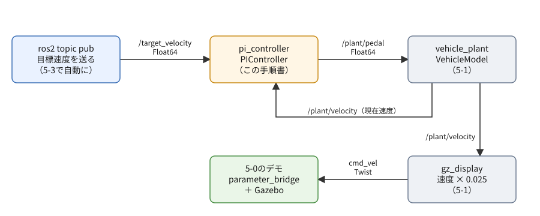
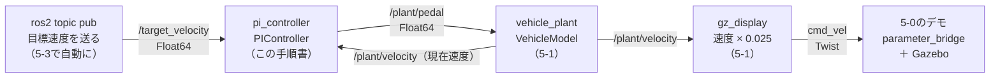

# フェーズ5-2 手順書: PI制御で目標速度に追従させる

[`docs/learning_plan.md`](learning_plan.md) フェーズ5の5-2（[`docs/idea_origin.md`](idea_origin.md) ステップ3）に対応する。目標速度と現在速度の差から、ペダルをどれだけ踏むかを自動で決めるPI制御のノードを自作し、フェーズ5-1の疑似プラントとつないでループを閉じる。制御の式（数理モデル）と、ゲインの決め方が、この手順書の中心である。

- 想定環境: WSL2 + Ubuntu 24.04 + ROS2 Jazzy
- 前提: フェーズ5-1（[`docs/phase5_1_plant.md`](phase5_1_plant.md)。`vehicle_plant` と `gz_display` が動く）。launch（フェーズ4）は、この手順書ではまだ使わない（フェーズ5-3で使う）
- 所要目安: 2コマ
- 言語: Python

> **進め方**: 前半（2節）で、PI制御の式と、ゲインの目安の求め方を手計算で確かめる。4節で、PI制御をROS2を使わないPythonのクラスとして書き、5-1のモデルとつないだ計算（閉ループのシミュレーション）で、ゲインや条件を変えたときの違いを確かめる。5節でクラスをノードで包み、6節でログとGazeboの画面で追従の様子を見る。サンプルは学習の手がかりとして最小限に書いたもので、公式チュートリアルの転載ではない。コードはこの手順書の作成時にビルドと `import` を確認し、6節の手順は使い捨ての環境でノードを起動して確かめた（Gazeboは画面なしで起動したので、画面の見え方は未確認）。出力が違う場合は、実機の表示を優先する。

> **実行環境が無くても読めるように**: 実行する手順の直後には「期待する結果」として、表示される内容の例とその読み方を載せている。表示の出どころは次のとおり。4節のシミュレーションの結果は、使い捨ての環境で実際に実行した表示（同じコードなら、同じ数値になる）。ビルドの表示（5-3節。4-2節は成功の見分け方だけを書いた）は、使い捨ての環境で確かめた表示の形式。6節のノードのログ・`ros2 param` の表示・オドメトリの値は、使い捨ての環境で実際に実行した表示で、時刻と、目標速度を送った時刻による数値の細部は実行ごとに異なる（ログは抜粋）。6-4節の画面の様子は、筆者が想定したもの。

## 0. 学習目標と完了条件

1. PI制御の式と、比例（P）の項・積分（I）の項の役割を説明し、P制御だけでは偏差（目標との差）が残ることを手計算で確かめられる。
2. プラントを線形に近似して、ゲインの目安を式で求め、シミュレーションで調整できる。
3. ペダルが上限に張り付いたときに起きる積分の飽和（ワインドアップ）と、その対策を説明できる。
4. PI制御ノードで5-1のプラントとのループを閉じ、起動時や実行中にゲインを変えて、追従の違いをログとGazeboで確かめられる。

完了条件: 目標速度10 m/s → 5 m/sに、行き過ぎなく追従することをログで確かめる。P制御だけにすると約9.0 m/sで止まる理由と、アクセル・ブレーキの時定数を変えると同じゲインでも追従が悪くなる理由を、2節の式で説明できる。

## 1. 全体像

この手順書で作るのは、PI制御のノード `pi_controller` である。目標速度（`/target_velocity`）とプラントの現在速度（`/plant/velocity`）を受け取り、その差からペダルの指令（`/plant/pedal`）を計算して送る。5-1ではペダルを人が `ros2 topic pub` で踏んでいたが、ここからは `pi_controller` が踏む。人が送るのは目標速度だけになる。



<details>
<summary>同じ図（mermaid版）</summary>



</details>

`pi_controller` → `vehicle_plant` → `pi_controller` と、情報が輪になって戻ってくる。これを**フィードバック制御**（閉ループ）と呼ぶ。結果（現在速度）を見て操作（ペダル）を直すので、プラントの性質が多少変わっても、目標へ近づける。

## 2. PI制御の数理

### 2-1. PI制御の式

目標速度を $r$、現在速度を $v$ とし、その差を**偏差** $e = r - v$ とする。PI制御は、ペダルの指令 $u$ を次の式で決める。

$$
u = K_p\, e + K_i \int_0^t e\, dt
$$

- **比例（P）の項** $K_p e$: 今の偏差に比例して踏む。目標より遅いほど強くアクセルを、速すぎるほど強くブレーキを踏む。 $K_p$ を比例ゲインと呼ぶ。
- **積分（I）の項** $K_i \int e\,dt$: 偏差を時間で積み上げたもの。偏差が小さくても、残り続ける限り少しずつ大きくなり、踏み込みを足していく。 $K_i$ を積分ゲインと呼ぶ。
- ペダルの指令は−1〜1の範囲なので、計算した $u$ が範囲を超えたら、端の値にそろえる（飽和）。

プログラムでは、積分をフェーズ5-1の2-4節のオイラー法と同じ考え方で、制御の周期 $\Delta t$ ごとに足し込む。

$$
I_{k+1} = I_k + K_i\, e_k\, \Delta t, \qquad u_k = K_p\, e_k + I_{k+1}
$$

### 2-2. P制御だけでは偏差が残る

$K_i = 0$（P制御だけ）の場合を考える。速度が一定になったとき、プラントの式（フェーズ5-1の2-3節）から、その速度を保つのに必要なペダル $u^*$ は次のとおり。

$$
u^* = \frac{\mu m g + c\,v}{F_{d,\max}}
$$

10 m/sを保つには $u^* = (220.7 + 140 \times 10) / 3000 \approx 0.54$ が必要である。ところがP制御では $u = K_p e$ なので、ペダルを0.54踏み続けるには、 $e = 0.54 / K_p$ の偏差が残っていなければならない。 $K_p = 0.5$ なら、約1 m/sの偏差が残る計算になる。

正確には、 $u = K_p (r - v)$ をプラントの定常の式に入れて $v$ について解くと、P制御で落ち着く速度は次のようになる。

$$
v_{ss} = \frac{K_p F_{d,\max}\, r - \mu m g}{c + K_p F_{d,\max}}
$$

$K_p = 0.5$、 $r = 10$ なら $v_{ss} = (0.5 \times 3000 \times 10 - 220.7) / (140 + 1500) \approx 9.01$ m/s。目標に届かない。 $K_p$ を大きくすれば偏差は小さくなるが、0にはならない。

積分の項があると、偏差が残る限り $I$ が増え続けるので、 $I$ が $u^*$（0.54）に達して偏差が0になったところで、ようやく変化が止まる。**積分の項は、「速度を保つのに必要な踏み込み」を自分で探し当てる役**を担う。転がり抵抗や速度に比例する抵抗の大きさを知らなくても、偏差を0にできるのはこのためである。

### 2-3. ゲインの目安を式で求める

ゲインを当てずっぽうで探す前に、式で目安を立てる。アクセルの遅れを無視し、ペダルが範囲の端に達しない（線形の）範囲で考えると、フェーズ5-1の2-1節の式は、ペダル $u$ から速度 $v$ への一次遅れになる。

$$
T \frac{dv}{dt} = K u - v + (\text{一定の項}), \qquad K = \frac{F_{d,\max}}{c} \approx 21.4 \ \text{(m/s)}, \quad T = \frac{m}{c} \approx 10.7 \ \text{s}
$$

$K$ は「ペダルを1だけ踏み増したとき、最後に速度がどれだけ上がるか」、 $T$ はプラントの時定数（5-1の2-3節）である。

一次遅れのプラントには、積分ゲインを $K_i = K_p / T$ に選ぶと、ループ全体が次の時定数の一次遅れになる、という教科書的な選び方がある（プラントの遅れを、制御器の積分の項で打ち消すので、**極零相殺**と呼ばれる）。

$$
T_c = \frac{T}{K K_p}
$$

$K_p = 0.5$ なら $T_c = 10.7 / (21.4 \times 0.5) \approx 1.0$ 秒、 $K_i = 0.5 / 10.7 \approx 0.047$ となる。プラント単独の時定数10.7秒に比べて、約10倍速く目標へ近づける計算である。

ただし、これは「ペダルが範囲の端に達しない」ことが前提である。目標を0から10 m/sへ一気に上げると、偏差10に $K_p = 0.5$ を掛けた5は上限の1を大きく超え、しばらくペダルは全開に張り付く。その間は線形の式が成り立たない。4節のシミュレーションで確かめると、 $K_i = 0.047$ では、目標の±2%に収まるまでに約24秒かかった（ペダルが張り付いている間は積分を止めるので、張り付きが終わった後、積分の項が必要な0.54まで育つのに時間がかかる）。そこで、この手順書では $K_i$ を約2倍の0.1にして、約14秒で収まるようにした。

このように、**式で目安を立て、シミュレーションで確かめて調整する**のが、ゲインを決めるふつうの流れである。

### 2-4. アクセルとブレーキで、ループの速さが変わる

2-3節の $K$ は、アクセルの側の値である。ブレーキの側では、踏み切ったときの力が9000 Nなので、 $K_b = F_{b,\max} / c \approx 64.3$ と、アクセルの約3倍になる。同じ $K_p$ でも、減速するときはループが約3倍速く（強く）効く（ $T_c$ の式の $K$ が3倍になるため）。

さらに、実際にはアクセル（0.5秒）とブレーキ（0.2秒）の遅れがある。ループが速く効くほど、この遅れの間に行き過ぎやすくなる。ゲインを上げすぎると、ブレーキで減速しすぎてアクセルを踏み直し、また行き過ぎる、という振動が起きる（4-2節の後半の表の最後の行（`kp=5.0, ki=2.0`）と、6-2節の末尾の課題1で、ノードでも確かめる）。アクセルとブレーキで時定数が違うこと（5-1の2-2節）が、ここで効いてくる。

### 2-5. 積分の飽和（ワインドアップ）と対策

ペダルが上限（1）に張り付いている間も積分を続けると、積分の項が必要以上に大きく育つ。目標に達した後も、その育ちすぎた積分が残っているので、ペダルを戻すのが遅れ、目標を大きく行き過ぎる。これを**積分の飽和（ワインドアップ）**と呼ぶ。4節で確かめると、目標10 m/sに対して14 m/sまで行き過ぎる。

対策（**アンチワインドアップ**）にはいくつかの方法がある。この手順書では、いちばん単純な「**出力が範囲の端に張り付いていて、偏差がさらに外へ押す向きのときは、積分を足さない**」という方法を使う。ペダルが全開（1）で、なお目標より遅い（ $e > 0$）ときは、積分を止める。偏差の向きが変われば（目標を追い越しそうになれば）、また積分を再開する。

### 2-6. パラメータと既定値

| パラメータ名 | 記号 | 既定値 | 意味 |
|---|---|---|---|
| `kp` | $K_p$ | 0.5 | 比例ゲイン（偏差1 m/sあたりのペダルの踏み込み） |
| `ki` | $K_i$ | 0.1 | 積分ゲイン（偏差1 m/sが1秒続いたときに、積分の項が増える量） |
| `anti_windup` | — | `true` | アンチワインドアップを使うか |
| `period` | $\Delta t$ | 0.02 | 制御の周期（秒）。プラントの周期（0.01秒）の2倍 |

制御の周期をプラントより長くしているのは、実物の制御器が、計算やセンサの都合で、物理の変化よりも粗い間隔でしか動けないことを模したものである。

## 3. 仕様

- パッケージ: `learn_py` に、ファイルを3つ足す。

| ファイル | 中身 |
|---|---|
| `pi_control.py` | 2節の式を計算するクラス `PIController`。**ROS2を使わない** |
| `closed_loop_sim.py` | `PIController` と5-1の `VehicleModel` をつないで計算する、ROS2を使わないシミュレーション |
| `pi_node.py` | `PIController` を包むノード `pi_controller`（実行ファイル名も `pi_controller`） |

- `pi_controller`:
  - 受ける: `/target_velocity`（[`std_msgs/msg/Float64`](https://github.com/ros2/common_interfaces/blob/jazzy/std_msgs/msg/Float64.msg)、m/s。届くまでは0）と、`/plant/velocity`（5-1の `vehicle_plant` が送る現在速度）。
  - 送る: `/plant/pedal`（`std_msgs/msg/Float64`、−1〜1）を、`period` 秒ごとに。現在速度が1回も届いていない間は送らない。
  - パラメータ: 2-6節の表の4つ。実行中に `ros2 param set` で変えられる（`kp`・`ki` は0以上、`period` は正の値だけを受け付ける）。
  - ログ: 1秒に1回、目標・現在速度・ペダル・積分の項を出す。

目標速度は、パラメータではなくトピックで受け取る。目標は「実行中に次々と変わる入力」で、フェーズ5-3では目標速度を送るノードに置き換えるためである（フェーズ3-3の6節では、目標速度もパラメータにする予定と書いたが、この理由でトピックに変えた）。

主なAPI（これまでの手順書で使ったもの以外）: 新しいAPIは無い。フェーズ3-1（Publisher・Subscription・タイマー）、3-3（パラメータと変更のコールバック）、5-1（ROS2を使わないクラスをノードで包む形）の組み合わせである。

## 4. ROS2なしで閉ループを確かめる

### 4-1. PI制御器のクラス（`pi_control.py`）

ファイル: `ros2_ws/src/learn_py/learn_py/pi_control.py`

<!-- file: ros2_ws/src/learn_py/learn_py/pi_control.py -->
```python
# PI制御器。目標と現在値の差（偏差）から、ペダルの指令を計算する（ROS2を使わない）。
class PIController:
    # ゲインと出力の範囲を受け取り、積分項を0から始める。
    def __init__(self, kp, ki, output_min=-1.0, output_max=1.0, anti_windup=True):
        self.kp = kp
        self.ki = ki
        self.output_min = output_min
        self.output_max = output_max
        self.anti_windup = anti_windup
        self.integral = 0.0  # 積分項（ki × 偏差の積分）

    # 偏差 error を受け取り、dt 秒分だけ積分を進めて、範囲内に収めた出力を返す。
    def update(self, error, dt):
        p_term = self.kp * error
        new_integral = self.integral + self.ki * error * dt
        output = p_term + new_integral
        saturated_high = output > self.output_max and error > 0.0
        saturated_low = output < self.output_min and error < 0.0
        # アンチワインドアップ: 出力が範囲の端に張り付いている間は、さらに外へ向かう積分をしない
        if not (self.anti_windup and (saturated_high or saturated_low)):
            self.integral = new_integral
        output = p_term + self.integral
        return min(max(output, self.output_min), self.output_max)
```

**`pi_control.py` の解説**

- **`__init__`**: ゲイン・出力の範囲・アンチワインドアップを使うかを受け取る。状態は、積分の項 `integral` の1つだけ。
- **`update`**: 2-1節の式を、そのまま1ステップ分のコードにしたもの。
  - `new_integral` は、今回の偏差を足したと仮定した積分の項。それを使った出力 `output` が範囲を超え、かつ偏差がさらに外へ押す向き（`saturated_high`・`saturated_low`）なら、積分を足さずに元の値のままにする（2-5節のアンチワインドアップ）。
  - 最後に、範囲の端にそろえた出力を返す。
- **積分の項に $K_i$ を掛けてから足している理由**: `integral` には「偏差の積分」ではなく「 $K_i$ × 偏差の積分」、つまり積分の項そのものを持たせている。こうしておくと、実行中に $K_i$ を変えても、それまでに育った積分の項は変わらず、ペダルが急に跳ねない（6-2節で、実行中にゲインを変えるときに効いてくる）。「偏差の積分」を持たせて毎回 $K_i$ を掛ける書き方だと、 $K_i$ を2倍にした瞬間に積分の項も2倍になる。

### 4-2. 閉ループのシミュレーション（`closed_loop_sim.py`）

ファイル: `ros2_ws/src/learn_py/learn_py/closed_loop_sim.py`

<!-- file: ros2_ws/src/learn_py/learn_py/closed_loop_sim.py -->
```python
from learn_py.pi_control import PIController
from learn_py.vehicle_model import VehicleModel, VehicleParams

PLANT_DT = 0.01       # プラントの計算の刻み幅 [s]（vehicle_plant の period と同じ）
CONTROL_PERIOD = 0.02  # 制御の周期 [s]（pi_controller の period と同じ）


# 目標速度: 0秒から10 m/s、40秒から5 m/s に切り替える。
def target_at(t):
    return 10.0 if t < 40.0 else 5.0


# プラントとPI制御器をつないで duration 秒分計算し、(時刻, 目標, 速度, ペダル) の一覧を返す。
def simulate(kp, ki, anti_windup=True, params=None, duration=70.0):
    plant = VehicleModel(params if params is not None else VehicleParams())
    controller = PIController(kp, ki, anti_windup=anti_windup)
    steps_per_control = round(CONTROL_PERIOD / PLANT_DT)
    pedal = 0.0
    rows = []
    for i in range(int(duration / PLANT_DT) + 1):
        t = round(i * PLANT_DT, 2)
        target = target_at(t)
        if i % steps_per_control == 0:
            pedal = controller.update(target - plant.velocity, CONTROL_PERIOD)
        rows.append((t, target, plant.velocity, pedal))
        plant.step(pedal, PLANT_DT)
    return rows


# 既定のゲインでの時間変化と、条件を変えたときの結果の比較を表示する。
def main():
    shown = [0.0, 1.0, 2.0, 5.0, 10.0, 15.0, 20.0, 30.0,
             40.0, 41.0, 42.0, 45.0, 50.0, 60.0, 70.0]
    print('  t[s]  target  v[m/s]  pedal')
    for t, target, v, pedal in simulate(kp=0.5, ki=0.1):
        if t in shown:
            print(f'{t:6.1f}  {target:6.1f}  {v:6.2f}  {pedal:+.2f}')

    cases = [
        ('PI (kp=0.5, ki=0.1)', dict(kp=0.5, ki=0.1)),
        ('P only (kp=0.5)', dict(kp=0.5, ki=0.0)),
        ('PI, no anti-windup', dict(kp=0.5, ki=0.1, anti_windup=False)),
        ('PI, tau_brake=1.0', dict(kp=0.5, ki=0.1, params=VehicleParams(tau_brake=1.0))),
        ('PI (kp=5.0, ki=2.0)', dict(kp=5.0, ki=2.0)),
    ]
    print()
    print('case                   max(0-40s)  v(40s)  min(40-70s)  v(70s)')
    for name, kwargs in cases:
        rows = simulate(**kwargs)
        first = [v for t, _, v, _ in rows if t < 40.0]
        second = [v for t, _, v, _ in rows if t >= 40.0]
        print(f'{name:22s} {max(first):9.2f}  {first[-1]:6.2f}  '
              f'{min(second):11.2f}  {second[-1]:6.2f}')


if __name__ == '__main__':
    main()
```

**`closed_loop_sim.py` の解説**

- **`simulate`**: プラントを0.01秒ごと、制御器を0.02秒ごと（プラントの2ステップに1回）に進める。制御器は「今の速度」から偏差を求めてペダルを決め、次の制御までの間、プラントは同じペダルで進む。ノードをつないだとき（6節）と同じ周期の関係を、ROS2なしで再現している。
- **`main`**: 前半で、既定のゲインでの時間変化を表示する。後半で、ゲインや条件を変えた5つの場合について、「0〜40秒の最高速度」「40秒の速度」「40〜70秒の最低速度」「70秒の速度」を並べる。目標は0秒から10 m/s、40秒から5 m/sなので、最高速度が10を超えていれば行き過ぎ、最低速度が5を下回っていれば減速しすぎである。
- **`import`**: `from learn_py.pi_control import ...` のように、パッケージの名前から読み込んでいる。5-1の `vehicle_model.py` のようにファイルを直接 `python3` で実行すると、`learn_py` という名前が見つからない。そのため、ビルドして `source` した後に、`python3 -m`（モジュール名で実行する）で動かす。

`python3 -m` で動かすだけなら、`setup.py` に登録しなくてよい。4-1節と4-2節のファイルを置いて、ここでビルドすれば動く（ノードの実行ファイルとしての登録は、5-3節で行う）。

```bash
cd ~/ros2_ws

colcon build --symlink-install --packages-select learn_py

source install/setup.bash

python3 -m learn_py.closed_loop_sim
```

**期待する結果**（`python3 -m learn_py.closed_loop_sim` の分。ビルドは、`Finished <<< learn_py` と `Summary: 1 package finished` が出れば成功。表示の全体は5-3節の期待する結果と同じ形）:

```text
  t[s]  target  v[m/s]  pedal
   0.0    10.0    0.00  +1.00
   1.0    10.0    0.96  +1.00
   2.0    10.0    2.53  +1.00
   5.0    10.0    6.75  +1.00
  10.0    10.0    9.55  +0.56
  15.0    10.0    9.85  +0.55
  20.0    10.0    9.95  +0.54
  30.0    10.0    9.99  +0.54
  40.0     5.0   10.00  -1.00
  41.0     5.0    5.74  +0.08
  42.0     5.0    5.15  +0.34
  45.0     5.0    5.15  +0.30
  50.0     5.0    5.05  +0.30
  60.0     5.0    5.00  +0.31
  70.0     5.0    5.00  +0.31

case                   max(0-40s)  v(40s)  min(40-70s)  v(70s)
PI (kp=0.5, ki=0.1)        10.00   10.00         5.00    5.00
P only (kp=0.5)             9.09    9.01         4.32    4.44
PI, no anti-windup         14.00   10.01         4.78    5.00
PI, tau_brake=1.0          10.00   10.00         3.89    5.00
PI (kp=5.0, ki=2.0)        10.04   10.00         4.12    5.00
```

前半の表（既定のゲイン）の読み方:

- **0〜5秒**: 偏差が大きいので、ペダルは全開（+1.00）に張り付き、プラントの最大の加速で速度が上がる。
- **10秒以降**: ペダルが0.56 → 0.54へ下がり、速度が10 m/sに近づく。落ち着いたペダル0.54は、2-2節で求めた $u^*$ そのもの。積分の項が、10 m/sを保つのに必要な踏み込みを探し当てた。
- **40秒**: 目標が5 m/sに下がると、偏差が−5になり、ペダルは−1.00（ブレーキ全開）に張り付く。ブレーキは強く速いので、約1秒で5.74 m/sまで下がる。
- **42〜50秒**: 5.15 m/s前後から、ゆっくり5 m/sへ近づく。5 m/sを保つのに必要なペダルは約0.31で、積分の項が0.54から0.31へ下がるのに時間がかかるためである（偏差が小さいので、積分の項の変化もゆっくりになる）。

後半の表の読み方（上から順に）:

| 場合 | 起きていること | 対応する節 |
|---|---|---|
| PI（既定） | 行き過ぎも減速しすぎもなく、10 m/s・5 m/sに落ち着く | — |
| P only | 9.01 m/s・4.44 m/sで止まり、目標に届かない | 2-2節の式の値と一致 |
| no anti-windup | 14.00 m/sまで行き過ぎる。40秒には10.01 m/sまで戻っている | 2-5節 |
| tau_brake=1.0 | 減速で3.89 m/sまで下がりすぎる | 2-4節・6-5節 |
| kp=5.0, ki=2.0 | 減速で4.12 m/sまで下がりすぎる。途中でペダルがブレーキ全開とアクセル全開のあいだで振れる | 2-4節 |

> 課題1: `main` の最初の `simulate(kp=0.5, ki=0.1)` を `simulate(kp=0.5, ki=0.047)`（2-3節の極零相殺の値）に変え、10秒・15秒・20秒の速度を既定のゲインと比べる。張り付きが終わった後の近づき方が、ゆっくりになる。
>
> 課題2: `P only` の行の `kp` を1.0・2.0に変えると、`v(40s)` はいくつになるか。2-2節の式で予想してから確かめる（ $K_p$ を大きくするほど10に近づくが、届かない）。

## 5. ノードで包む

### 5-1. PI制御のノード（`pi_node.py`）

ファイル: `ros2_ws/src/learn_py/learn_py/pi_node.py`

<!-- file: ros2_ws/src/learn_py/learn_py/pi_node.py -->
```python
import rclpy
from rcl_interfaces.msg import SetParametersResult
from rclpy.executors import ExternalShutdownException
from rclpy.node import Node
from std_msgs.msg import Float64

from learn_py.pi_control import PIController


# 目標速度と現在速度の差から、PI制御でペダルの指令を計算して plant/pedal へ送るノード。
# ゲイン（kp・ki）は、実行中に ros2 param set で変えられる。
class PIControllerNode(Node):
    # ゲインと周期を宣言し、PI制御器・通信の口・タイマーを用意する。
    def __init__(self):
        super().__init__('pi_controller')
        self.declare_parameter('kp', 0.5)
        self.declare_parameter('ki', 0.1)
        self.declare_parameter('anti_windup', True)
        self.declare_parameter('period', 0.02)
        self.controller = PIController(
            self.get_parameter('kp').value,
            self.get_parameter('ki').value,
            anti_windup=self.get_parameter('anti_windup').value)
        self.period = self.get_parameter('period').value
        self.target = 0.0
        self.velocity = None  # 最初の速度が届くまでは None

        self.sub_target = self.create_subscription(
            Float64, 'target_velocity', self.on_target, 10)
        self.sub_velocity = self.create_subscription(
            Float64, 'plant/velocity', self.on_velocity, 10)
        self.pub = self.create_publisher(Float64, 'plant/pedal', 10)
        self.timer = self.create_timer(self.period, self.on_timer)
        self.add_on_set_parameters_callback(self.on_params)

    # 目標速度を覚えておく。
    def on_target(self, msg):
        self.target = msg.data

    # 現在速度を覚えておく。
    def on_velocity(self, msg):
        self.velocity = msg.data

    # 周期ごとに偏差からペダルを計算して送る。1秒に1回、状態をログに出す。
    def on_timer(self):
        if self.velocity is None:
            return
        error = self.target - self.velocity
        pedal = self.controller.update(error, self.period)
        msg = Float64()
        msg.data = pedal
        self.pub.publish(msg)
        self.get_logger().info(
            f'target: {self.target:5.2f}, velocity: {self.velocity:5.2f} m/s, '
            f'pedal: {pedal:+.2f}, integral: {self.controller.integral:+.3f}',
            throttle_duration_sec=1.0)

    # ゲインと周期の変更を検証してから反映する。積分項はそのまま引き継ぐ。
    def on_params(self, params):
        for p in params:
            if p.name in ('kp', 'ki') and p.value < 0.0:
                return SetParametersResult(successful=False, reason=f'{p.name} must be >= 0')
            if p.name == 'period' and p.value <= 0.0:
                return SetParametersResult(successful=False, reason='period must be > 0')
        for p in params:
            if p.name == 'kp':
                self.controller.kp = p.value
            elif p.name == 'ki':
                self.controller.ki = p.value
            elif p.name == 'anti_windup':
                self.controller.anti_windup = p.value
            elif p.name == 'period':
                self.period = p.value
                self.timer.cancel()
                self.timer = self.create_timer(self.period, self.on_timer)
        return SetParametersResult(successful=True)


# エントリポイント（setup.py の entry_points から呼ばれる）。
# ノードを作って spin で回し、Ctrl+C で後片付けして終わる。
def main(args=None):
    rclpy.init(args=args)
    node = PIControllerNode()
    try:
        rclpy.spin(node)
    except (KeyboardInterrupt, ExternalShutdownException):
        pass
    finally:
        node.destroy_node()
        rclpy.try_shutdown()
```

**`pi_node.py` の解説**

役割は、4-1節の `PIController` をトピックとパラメータでROS2につなぐこと。5-1の `plant_node.py` と同じく、**式はこのファイルに無い**。

- **クラス名**: ノードのクラスを `PIControllerNode` とし、式のクラス `PIController` と名前を分けている。同じファイルに両方を `import` しても、取り違えないようにするため。
- **`__init__`**: 4つのパラメータを宣言し、その値で `PIController` を作る。`anti_windup` は既定値が `True` なので、パラメータの型は真偽値（bool）になる。
- **`on_target`・`on_velocity`**: 届いた値を覚えるだけ。計算は `on_timer` でまとめて行う（5-1の `on_pedal` と同じ考え方）。`self.velocity` を `None` で始めているのは、プラントの速度が1回も届く前に「速度0」とみなしてペダルを踏み始めないようにするため。
- **`on_timer`**: 偏差を求め、`update` でペダルを計算して送る。制御の刻み幅には `period` を使う（5-1の `on_timer` と同じ）。
- **`on_params`**: フェーズ3-3の形で、検証してから反映する。ゲインは `PIController` の属性を直接書き換える。積分の項 `integral` はそのまま残るので、実行中に `kp` や `ki` を変えても、制御は途切れずに続く（4-1節の解説の最後の項目）。

### 5-2. 依存

依存の追加は要らない（使う型と仕組みは5-1と同じ）。

### 5-3. 実行ファイルとして登録し、ビルドする

`ros2_ws/src/learn_py/setup.py` の `entry_points` に1行足す（既存の行はすべて残す）。フェーズ5-1まで進めた状態なら、次のようになる（並び順や、任意の冊で足した行の有無は、進め方によって違ってよい）。

<!-- snippet: py_entry_points_pi -->
```python
    entry_points={
        'console_scripts': [
            'hello = learn_py.hello:main',
            'talker = learn_py.talker:main',
            'listener = learn_py.listener:main',
            'sine_pub = learn_py.sine_pub:main',
            'sine_sub = learn_py.sine_sub:main',
            'turtle_circle = learn_py.turtle_circle:main',
            'qos_talker = learn_py.qos_talker:main',
            'qos_listener = learn_py.qos_listener:main',
            'param_talker = learn_py.param_talker:main',
            'gz_drive = learn_py.gz_drive:main',
            'vehicle_plant = learn_py.plant_node:main',
            'gz_display = learn_py.gz_display:main',
            'pi_controller = learn_py.pi_node:main',
        ],
    },
```

`pi_control.py` と `closed_loop_sim.py` は実行ファイルとして登録しない（前者はノードから `import` される部品、後者は `python3 -m` で動かす）。

```bash
cd ~/ros2_ws

colcon build --symlink-install --packages-select learn_py

source install/setup.bash

ros2 pkg executables learn_py
```

**期待する結果**（ビルドの秒数は環境によって変わる。`ros2 pkg executables` の分は抜粋）:

```text
Starting >>> learn_py
Finished <<< learn_py [1.9s]

Summary: 1 package finished [2.2s]
...
learn_py pi_controller
...
```

`ros2 pkg executables` の一覧に `pi_controller` があれば、登録できている。

## 6. 動かす

### 6-1. ループを閉じる

ターミナルを3つ使う。T1でプラント、T2でPI制御のノードを動かし、T3から目標速度を送る。

```bash
# T1
cd ~/ros2_ws

source install/setup.bash

ros2 run learn_py vehicle_plant

# T2
cd ~/ros2_ws

source install/setup.bash

ros2 run learn_py pi_controller

# T3
cd ~/ros2_ws

source install/setup.bash

ros2 topic pub --once /target_velocity std_msgs/msg/Float64 "{data: 10.0}"
```

**期待する結果**（T2の分。目標10 m/sを送った前後の抜粋。時刻は実行ごとに変わり、数値も目標が届いた時刻とログの時刻のずれで少し変わる）:

```text
[INFO] [1790403026.725036517] [pi_controller]: target:  0.00, velocity:  0.00 m/s, pedal: +0.00, integral: +0.000
[INFO] [1790403027.744627223] [pi_controller]: target: 10.00, velocity:  0.57 m/s, pedal: +1.00, integral: +0.000
[INFO] [1790403028.764842380] [pi_controller]: target: 10.00, velocity:  2.14 m/s, pedal: +1.00, integral: +0.000
[INFO] [1790403029.764948497] [pi_controller]: target: 10.00, velocity:  3.69 m/s, pedal: +1.00, integral: +0.000
[INFO] [1790403030.785030713] [pi_controller]: target: 10.00, velocity:  5.16 m/s, pedal: +1.00, integral: +0.000
[INFO] [1790403031.805128289] [pi_controller]: target: 10.00, velocity:  6.49 m/s, pedal: +1.00, integral: +0.000
[INFO] [1790403032.805142695] [pi_controller]: target: 10.00, velocity:  7.68 m/s, pedal: +1.00, integral: +0.000
[INFO] [1790403033.824871277] [pi_controller]: target: 10.00, velocity:  8.73 m/s, pedal: +0.76, integral: +0.119
[INFO] [1790403034.845045963] [pi_controller]: target: 10.00, velocity:  9.27 m/s, pedal: +0.58, integral: +0.216
[INFO] [1790403035.845086232] [pi_controller]: target: 10.00, velocity:  9.46 m/s, pedal: +0.55, integral: +0.278
...
[INFO] [1790403041.964594202] [pi_controller]: target: 10.00, velocity:  9.85 m/s, pedal: +0.55, integral: +0.473
...
[INFO] [1790403071.564935770] [pi_controller]: target: 10.00, velocity: 10.00 m/s, pedal: +0.54, integral: +0.540
```

- 目標を送る前は、目標も速度も0なので、ペダルも0。
- 目標10 m/sが届くと、ペダルは+1.00（全開）に張り付く。この間、`integral` は0のまま増えない（2-5節のアンチワインドアップ）。
- 速度が9 m/s近くまで上がると、ペダルが全開から離れ、`integral` が育ち始める。やがて速度は10.00 m/sに、ペダルは0.54に、`integral` は0.540に落ち着く。2-2節で求めた $u^*$（0.54）と一致する。T1の `vehicle_plant` のログも、同じように速度が10 m/sへ近づく。

30秒ほど待ってから、T3で目標を5 m/sに下げる。

```bash
# T3
ros2 topic pub --once /target_velocity std_msgs/msg/Float64 "{data: 5.0}"
```

**期待する結果**（T2の分。目標5 m/sを送った前後の抜粋）:

```text
[INFO] [1790403071.564935770] [pi_controller]: target: 10.00, velocity: 10.00 m/s, pedal: +0.54, integral: +0.540
[INFO] [1790403072.565117580] [pi_controller]: target:  5.00, velocity:  7.06 m/s, pedal: -0.53, integral: +0.495
[INFO] [1790403073.584908683] [pi_controller]: target:  5.00, velocity:  5.18 m/s, pedal: +0.34, integral: +0.428
[INFO] [1790403074.585434755] [pi_controller]: target:  5.00, velocity:  5.14 m/s, pedal: +0.35, integral: +0.414
[INFO] [1790403075.605243468] [pi_controller]: target:  5.00, velocity:  5.18 m/s, pedal: +0.31, integral: +0.398
...
[INFO] [1790403084.705182171] [pi_controller]: target:  5.00, velocity:  5.03 m/s, pedal: +0.31, integral: +0.318
...
[INFO] [1790403109.504901103] [pi_controller]: target:  5.00, velocity:  5.00 m/s, pedal: +0.31, integral: +0.307
```

- 目標が下がった直後は、ブレーキ（ペダルがマイナス）を踏み、1秒ほどで5 m/s付近まで下がる。5 m/sを下回らずに止まっている。
- その後は、5.1〜5.2 m/sから、ゆっくり5.00 m/sへ近づく。`integral` が0.54から0.31へ下がっていく途中で、4節の表の42〜50秒と同じ振る舞いである。

続けて、パラメータの検証を確かめる。

```bash
# T3
ros2 param set /pi_controller kp -1.0

ros2 param get /pi_controller kp
```

**期待する結果**（T3の分）:

```text
$ ros2 param set /pi_controller kp -1.0
Setting parameter failed: kp must be >= 0

$ ros2 param get /pi_controller kp
Double value is: 0.5
```

負のゲインは拒否され、値は0.5のまま。

### 6-2. ゲインと条件を変えて比べる

4節の後半の表の3つの場合を、ノードで確かめる。比べやすいように、毎回、止まった状態から始める。T1の `vehicle_plant` とT2の `pi_controller` を `Ctrl+C` で止め、T1は同じコマンドで、T2はパラメータを指定して起動し直してから、T3で目標10 m/sを送る。

**P制御だけ（`ki` を0に）**

```bash
# T1
ros2 run learn_py vehicle_plant

# T2
ros2 run learn_py pi_controller --ros-args -p ki:=0.0

# T3
ros2 topic pub --once /target_velocity std_msgs/msg/Float64 "{data: 10.0}"
```

**期待する結果**（T2の分。目標を送ってから十数秒後以降の抜粋）:

```text
[INFO] [1790403121.082159437] [pi_controller]: target: 10.00, velocity:  8.77 m/s, pedal: +0.62, integral: +0.000
[INFO] [1790403125.096242266] [pi_controller]: target: 10.00, velocity:  8.97 m/s, pedal: +0.52, integral: +0.000
[INFO] [1790403126.101943036] [pi_controller]: target: 10.00, velocity:  9.09 m/s, pedal: +0.46, integral: +0.000
[INFO] [1790403127.102023805] [pi_controller]: target: 10.00, velocity:  9.04 m/s, pedal: +0.48, integral: +0.000
[INFO] [1790403128.122296834] [pi_controller]: target: 10.00, velocity:  9.01 m/s, pedal: +0.49, integral: +0.000
[INFO] [1790403129.141976346] [pi_controller]: target: 10.00, velocity:  9.01 m/s, pedal: +0.50, integral: +0.000
...
[INFO] [1790403147.401797842] [pi_controller]: target: 10.00, velocity:  9.01 m/s, pedal: +0.49, integral: +0.000
```

速度は9.01 m/sで止まり、10 m/sに届かない。`integral` は0のままで、ペダルは0.49（ $K_p \times$ 偏差 $= 0.5 \times 0.99$）。2-2節の式の値（9.01 m/s）と一致する。

実行中に `ros2 param set /pi_controller ki 0.0` として比べる方法もあるが、それだと、それまでに育った積分の項が残るので（4-1節の解説の最後の項目）、P制御だけの振る舞いにはならない。起動し直すのはそのためである。

**アンチワインドアップを使わない**

```bash
# T2
ros2 run learn_py pi_controller --ros-args -p anti_windup:=false
```

（T1の起動し直しとT3の目標10 m/sは、上と同じ。）

**期待する結果**（T2の分。抜粋）:

```text
[INFO] [1790403152.402611885] [pi_controller]: target: 10.00, velocity:  0.48 m/s, pedal: +1.00, integral: +0.669
[INFO] [1790403153.402747120] [pi_controller]: target: 10.00, velocity:  1.99 m/s, pedal: +1.00, integral: +1.546
[INFO] [1790403155.403708049] [pi_controller]: target: 10.00, velocity:  5.00 m/s, pedal: +1.00, integral: +2.837
...
[INFO] [1790403162.962891989] [pi_controller]: target: 10.00, velocity:  9.61 m/s, pedal: +1.00, integral: +3.853
[INFO] [1790403163.963001818] [pi_controller]: target: 10.00, velocity: 10.53 m/s, pedal: +1.00, integral: +3.845
[INFO] [1790403165.963527230] [pi_controller]: target: 10.00, velocity: 12.11 m/s, pedal: +1.00, integral: +3.575
[INFO] [1790403167.983257811] [pi_controller]: target: 10.00, velocity: 13.44 m/s, pedal: +1.00, integral: +3.009
[INFO] [1790403168.983330042] [pi_controller]: target: 10.00, velocity: 13.96 m/s, pedal: +0.65, integral: +2.636
[INFO] [1790403170.002821076] [pi_controller]: target: 10.00, velocity: 13.82 m/s, pedal: +0.32, integral: +2.232
[INFO] [1790403171.003092768] [pi_controller]: target: 10.00, velocity: 13.16 m/s, pedal: +0.30, integral: +1.883
...
[INFO] [1790403176.103457642] [pi_controller]: target: 10.00, velocity: 10.95 m/s, pedal: +0.48, integral: +0.961
...
[INFO] [1790403191.243076054] [pi_controller]: target: 10.00, velocity: 10.03 m/s, pedal: +0.54, integral: +0.554
```

- ペダルが全開に張り付いている間も `integral` が増え続け、3.8まで育つ（アンチワインドアップがあるときは0のまま）。
- そのため、速度が10 m/sを超えても、ペダルは全開のまま戻らず、約14 m/sまで行き過ぎる。`integral` が減るまで、ペダルを戻せない。
- その後、ゆっくり10 m/sへ戻る。4節の表の `no anti-windup` の行（14.00 m/s）と一致する。

> 課題1: `ros2 run learn_py pi_controller --ros-args -p kp:=5.0 -p ki:=2.0` で起動し、目標10 m/s → 5 m/sを送る。4-2節の後半の表の最後の行（`kp=5.0, ki=2.0`）のとおり、減速で4 m/s前後まで下がりすぎ、T2のログで、ペダルがブレーキ全開（−1.00）とアクセル全開（+1.00）のあいだで振れる様子を見る。
>
> 課題2: 既定のゲインで動かしたまま、`ros2 param set /pi_controller kp 1.0` として、目標を10 m/sと5 m/sのあいだで何度か切り替え、既定の0.5のときと追従の速さを比べる。実行中にゲインを変えてもペダルが跳ねないことも、T2のログで確かめる。

### 6-3. YAMLでゲインを渡し、調整した結果を残す

ゲインの組み合わせは、フェーズ3-3の5-4節のとおり、YAMLのファイルにまとめておくと、何度でも同じ条件で試せる。`ros2_ws/config/pi_controller.yaml` を作る（`ros2_ws/config/` はフェーズ3-3で作ったフォルダ。フェーズ4の3-1節で空になって消した場合は、`mkdir -p ~/ros2_ws/config` で作り直す。フェーズ4を済ませていれば、`learn_bringup/config/` に置いてもよい。フェーズ5-3ではそちらを使う）。

```yaml
pi_controller:
  ros__parameters:
    kp: 0.8
    ki: 0.15
```

T2の `pi_controller` を止めて、YAMLを渡して起動し直す。

```bash
# T2
ros2 run learn_py pi_controller --ros-args --params-file ~/ros2_ws/config/pi_controller.yaml

# T3
ros2 param get /pi_controller kp

ros2 param dump /pi_controller
```

**期待する結果**（T3の分）:

```text
$ ros2 param get /pi_controller kp
Double value is: 0.8

$ ros2 param dump /pi_controller
/pi_controller:
  ros__parameters:
    anti_windup: true
    ki: 0.15
    kp: 0.8
    period: 0.02
    start_type_description_service: true
    use_sim_time: false
```

YAMLに書いた `kp`・`ki` が効いていて、書かなかった `anti_windup`・`period` は既定値のまま。実行中に `ros2 param set` で良いゲインを見つけたら、`ros2 param dump /pi_controller > tuned.yaml` のようにファイルへ書き出しておけば、次回はそのファイルを `--params-file` で渡して同じ条件から始められる（フェーズ3-3の5-4節の「調整した結果を保存して、再現できる」）。

### 6-4. Gazeboで見る

5-1の6-2節と同じく、T4でフェーズ5-0のデモ、T5で表示用のノードを動かす。T1の `vehicle_plant` とT2の `pi_controller` は、既定の設定で動かしておく（5-1の6-2節のとおり、`vehicle_plant` は止めた状態から始めると、画面の車両の動き出しから見られる）。

```bash
# T4
ros2 launch ros_gz_sim_demos diff_drive.launch.py rviz:=false

# T5
cd ~/ros2_ws

source install/setup.bash

ros2 run learn_py gz_display

# T3
ros2 topic pub --once /target_velocity std_msgs/msg/Float64 "{data: 10.0}"
```

**期待する結果**: Gazeboの画面で、緑の車両が全開で加速し、目標の速さに近づくと加速を緩めて、一定の速さで走り続ける。5-1でペダル0.5を踏みっぱなしにしたときより、ずっと早く一定の速さに落ち着く。目標を5 m/sに下げると、はっきり減速してから、ゆっくりした速さで走り続ける。

定常になったころ（目標を送ってから30秒ほど）に、T3でGazeboの車両の速さを確かめる。

```bash
# T3
ros2 topic echo --once /model/vehicle_green/odometry --field twist.twist.linear.x
```

**期待する結果**（目標10 m/sで定常になった後の例。値は少し揺れる）:

```text
0.24985540507387327
---
```

10 m/s × 0.025 = 0.25 m/s。PI制御で保たれた10 m/sが、縮尺どおりにGazeboの車両の速さになっている。

止めるときは、**T1の `vehicle_plant` を先に**止める（`gz_display` の途絶えの見張りで、Gazeboの車両も止まる）。`pi_controller` を先に止めると、プラントは最後のペダルを踏み続けるので（5-1の3節の仕様）、車両が加速を続けてしまう。

### 6-5. 時定数を変えて、同じゲインで比べる

同じゲイン（既定の0.5・0.1）のまま、プラントのブレーキの時定数を0.2秒から1.0秒に変えて、目標10 m/s → 5 m/sを試す。T1の `vehicle_plant` を起動し直すときに、時定数を指定する（T2も起動し直して、止まった状態から始める）。

```bash
# T1
ros2 run learn_py vehicle_plant --ros-args -p tau_brake:=1.0

# T2
ros2 run learn_py pi_controller

# T3
ros2 topic pub --once /target_velocity std_msgs/msg/Float64 "{data: 10.0}"

ros2 topic pub --once /target_velocity std_msgs/msg/Float64 "{data: 5.0}"
```

T3の2つめのコマンドは、速度が10 m/sに落ち着いてから（30秒ほど後に）実行する。

**期待する結果**（T2の分。目標5 m/sを送った前後の抜粋）:

```text
[INFO] [1790403235.655713867] [pi_controller]: target: 10.00, velocity: 10.00 m/s, pedal: +0.54, integral: +0.539
[INFO] [1790403236.656073412] [pi_controller]: target:  5.00, velocity:  9.09 m/s, pedal: -1.00, integral: +0.539
[INFO] [1790403237.676123423] [pi_controller]: target:  5.00, velocity:  5.14 m/s, pedal: +0.36, integral: +0.428
[INFO] [1790403238.695844406] [pi_controller]: target:  5.00, velocity:  3.87 m/s, pedal: +1.00, integral: +0.468
[INFO] [1790403239.695929250] [pi_controller]: target:  5.00, velocity:  4.53 m/s, pedal: +0.77, integral: +0.531
[INFO] [1790403240.696297480] [pi_controller]: target:  5.00, velocity:  5.19 m/s, pedal: +0.45, integral: +0.541
[INFO] [1790403241.715949967] [pi_controller]: target:  5.00, velocity:  5.41 m/s, pedal: +0.30, integral: +0.506
[INFO] [1790403242.735914956] [pi_controller]: target:  5.00, velocity:  5.38 m/s, pedal: +0.28, integral: +0.465
...
[INFO] [1790403255.895693347] [pi_controller]: target:  5.00, velocity:  5.02 m/s, pedal: +0.31, integral: +0.315
```

- 目標が下がると、ブレーキ全開（−1.00）を踏むが、ブレーキの力が立ち上がるのに時間がかかるので、制御器は「まだ減速が足りない」と踏み続ける。力が遅れて効いてくると、今度は減速しすぎて3.87 m/sまで下がる。
- 下がりすぎたので、アクセル全開（+1.00）を踏み直し、5.41 m/sまで戻りすぎてから、5 m/sへ落ち着く。
- 既定の時定数（0.2秒）では5 m/sを下回らなかったのに対し、**同じゲインでも、プラントの時定数が変わると追従が悪くなる**。4節の表の `tau_brake=1.0` の行（3.89 m/s）と一致する。

終わったら、T1を起動し直して時定数を既定値に戻す。

## 7. フィジカルAIへのつながり（時定数とゲイン）

6-5節で、プラントの時定数が変わると、同じゲインでは追従が悪くなることを確かめた。フェーズ5-1の7節で書いたとおり、実物の車両やロボットのアクチュエータの遅れ方は、摩耗・温度・荷物・個体差で変わる。ある時定数に合わせて調整したゲインは、別の時定数では最適ではない。

フェーズ6の後の課題（[`docs/idea_origin.md`](idea_origin.md) ステップ6）では、PIのゲインの調整を強化学習のエージェントに任せ、**時定数が変わるたびに、AIがゲインを調整し直す**ことを扱う予定である。この手順書の部品は、そのための道具にもなる。

- `closed_loop_sim.py` のように、ROS2を使わずに閉ループを計算できれば、1回の試行が一瞬で終わる。学習のために何千回も試すときは、この速さが効く。
- `pi_controller` のゲインは実行中に `ros2 param set` で変えられるので、ROS2の上で動かしたまま、外から（AIから）ゲインを差し替えられる。積分の項を持たせる形（4-1節）にしてあるので、差し替えてもペダルが跳ねない。
- 追従の良し悪しは、4節の表のように「行き過ぎ」「下がりすぎ」「落ち着いた速度」などの数で表せる。強化学習では、このような数から「報酬」を作る。

フェーズ5-4では、プラントの時定数ではなく、車体そのもの（質量と抵抗）をGazeboの物理に差し替えて、同じゲインで比べる。自作の式で決めたゲインが、より現実に近いシミュレーションではどう効くかという、シミュレーションと現実の差の問題にもつながる。

## 8. 本フェーズのまとめ

- PI制御は、偏差に比例して踏む項と、偏差の積分で踏み増す項の和でペダルを決める。
- P制御だけでは、速度を保つのに踏み込みが要る分だけ偏差が残る（ $K_p = 0.5$ で10 m/sの目標に対して9.01 m/s）。積分の項は、必要な踏み込み（0.54）を自分で探し当て、偏差を0にする。
- ゲインの目安は、プラントを一次遅れに近似して式で求められる（極零相殺では $K_i = K_p / T$、ループの時定数は $T / (K K_p)$）。ペダルが張り付く範囲では式が成り立たないので、シミュレーションで確かめて調整する。
- ペダルが上限に張り付いている間の積分は、行き過ぎの原因になる（ワインドアップ）。張り付いている間は積分を止める（アンチワインドアップ）。
- アクセルとブレーキで力の大きさと遅れが違うので、同じゲインでも加速と減速で効き方が違い、時定数が変わると追従が悪くなる。
- 制御の式もROS2を使わないクラスに分けたので、プラントのクラスとつないで、ROS2なしで閉ループを計算できる。

## 9. つまずきやすい点

| 症状 | 確認すること |
|---|---|
| `python3 -m learn_py.closed_loop_sim` で `No module named learn_py` | ビルドして `source install/setup.bash` したか。`python3 .../closed_loop_sim.py` のようにファイルを直接実行していないか（4-2節の解説） |
| `pi_controller` のログが出ない | `vehicle_plant` が動いているか。現在速度が1回も届かない間は、何も計算しない（5-1節の解説） |
| 目標を送っても速度が上がらない | トピック名（`/target_velocity`）と型の綴り。T2のログの `target` が変わっているか |
| P制御にしたのに偏差が残らない | 実行中に `ki` を0にした。積分の項が残っているので、起動し直す（6-2節） |
| 車両が止まらない・加速し続ける | `pi_controller` を先に止めた。プラントは最後のペダルを踏み続ける。T3で `ros2 topic pub --once /plant/pedal std_msgs/msg/Float64 "{data: -1.0}"` を送ってから、`vehicle_plant` を止める |
| ペダルが−1と+1のあいだで振れる | ゲインが大きすぎる（2-4節、6-2節の末尾の課題1）。`kp`・`ki` を下げる |
| `ros2 param set ... kp 1` が失敗する | 整数を渡している。`1.0` と書く（フェーズ3-3の5-3節） |

## 10. 次へ

フェーズ5-3（[`docs/phase5_3_launch.md`](phase5_3_launch.md)）で、目標速度を送るノード（階段状に目標を変える）を作り、プラント・PI制御・表示用のノードと、Gazeboのデモを、1つのlaunchでまとめて起動する。5-3ではlaunchを書くので、それまでにフェーズ4を終えておく。その後のフェーズ5-4では、この手順書の `pi_controller` を変えずに、プラントをGazeboの物理に差し替える。

## 11. 公式ドキュメント・参考資料

確認状況（2026-09-26）: 日本語の記事は [`docs/idea_origin.md`](idea_origin.md) に掲載済みのもので、今回は再確認していない。PI制御・極零相殺・アンチワインドアップは、制御工学の一般的な内容を自分の言葉でまとめたもので、特定の文献の転載ではない。

### 公式

- [Using parameters in a class (Python) — ROS 2 Documentation: Jazzy](https://docs.ros.org/en/jazzy/Tutorials/Beginner-Client-Libraries/Using-Parameters-In-A-Class-Python.html)（rclpyでのパラメータの宣言と取得。フェーズ5-1の11節で実在を確認したもの）

### 日本語

- [PID制御とは？仕組みと動作イメージを分かりやすく解説！](https://controlabo.com/pid-control-introduction/)（PID制御の各項の役割）
- [PID制御の基本理論と設計法：幅広く使われるPID制御 - 制御工学ブログ](https://blog.control-theory.com/entry/pid-control)（伝達関数・一次遅れ系の考え方）
- [YAMLファイルによるROS2のパラメータ設定 #ROS2 - Qiita](https://qiita.com/NeK/items/15bf1e657d8d694592ed)（YAMLでのパラメータの渡し方）

> 記事は個人による非公式の解説で、版によって異なる場合がある。公式ドキュメントと食い違う場合は公式を優先する。

> 出典: PI制御の式、極零相殺によるゲインの選び方、アンチワインドアップは、制御工学の一般的な内容を自分の言葉でまとめたもの。ゲインの既定値は、2-3節のとおり筆者が式とシミュレーションで選んだ値。サンプルコード・文章は独自に書いたもの。
