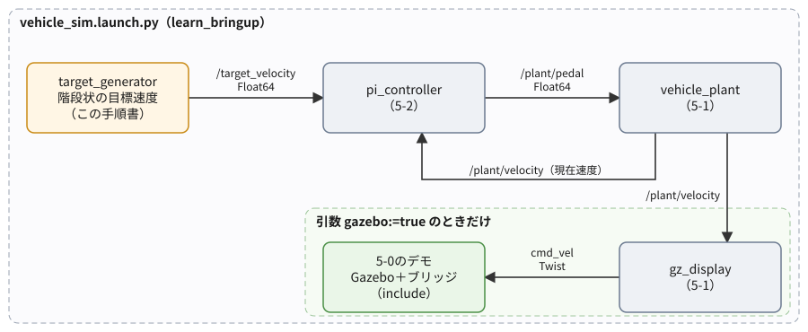
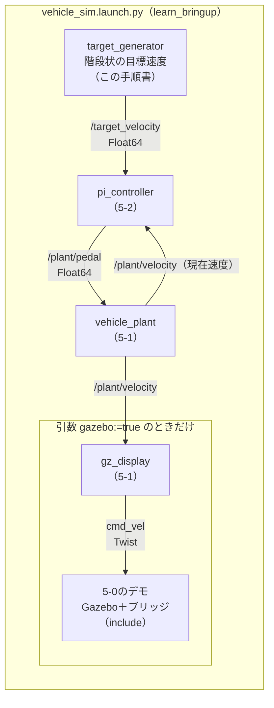

# フェーズ5-3 手順書: 目標速度を自動で変え、launchで一式を起動する

[`docs/learning_plan.md`](learning_plan.md) フェーズ5の5-3に対応する。目標速度を階段状に自動で変えるノードを作り、フェーズ5-1・5-2のノードとフェーズ5-0のGazeboのデモを、1つのlaunchファイルでまとめて起動する。最後に、目標・速度・ペダルをグラフに重ねて、アクセルとブレーキの違いが追従にどう表れるかを読み取る。これで、フェーズ5の完了条件のうち2つ（ステップ入力の目標速度への追従と、アクセル・ブレーキの非対称性の影響をグラフで説明する）に届く。

- 想定環境: WSL2 + Ubuntu 24.04 + ROS2 Jazzy
- 前提: フェーズ5-2（[`docs/phase5_2_pi.md`](phase5_2_pi.md)）と、フェーズ4（[`docs/phase4_launch.md`](phase4_launch.md)。`learn_bringup` パッケージがあり、`launch/` と `config/` をインストールする設定が済んでいる）
- 所要目安: 1〜2コマ
- 言語: Python（launchもPython形式）

> **進め方**: 2節で目標速度を送るノードを、3節でlaunchファイルとパラメータのYAMLを書く。4節で起動し、ログ・Gazebo・グラフで動きを見る。5節で、目標0で止まりきらない現象を、制御の式から読み解く。サンプルは学習の手がかりとして最小限に書いたもので、公式チュートリアルの転載ではない。コードはこの手順書の作成時に、使い捨ての環境でビルドし、launchを起動して確かめた（Gazeboは画面なしで別に起動したので、画面の見え方と、`rqt_plot` のグラフは未確認）。出力が違う場合は、実機の表示を優先する。

> **実行環境が無くても読めるように**: 実行する手順の直後には「期待する結果」として、表示される内容の例とその読み方を載せている。表示の出どころは次のとおり。ビルドの表示と、launchの `--show-args`・`--print` の表示は、使い捨ての環境で確かめたもの。4-1節のlaunchのログ、4-2節のオドメトリの値、4-4節の `Ctrl+C` の後の表示、3-4節の末尾のエラーの表示は、使い捨ての環境で実際に実行した表示で、時刻・pid・パスは実行ごとに異なる（ログは抜粋）。4-2節の画面の様子と、4-3節のグラフの見え方は、ログの数値から筆者が想定したもの。

## 0. 学習目標と完了条件

1. 起動からの経過時間に応じて階段状に目標速度を変えるノードを書き、配列のパラメータを扱える。
2. 自作のノードと、別のパッケージのlaunch（フェーズ5-0のデモ）を1つのlaunchにまとめ、引数で一部の起動を切り替えられる。
3. 複数のノードのパラメータを1つのYAMLにまとめて渡し、ファイルを差し替えて条件を変えられる。
4. `rqt_plot` で目標・速度・ペダルを重ねて表示し、加速と減速の違い（アクセルとブレーキの非対称性）をグラフで説明できる。

完了条件: `ros2 launch learn_bringup vehicle_sim.launch.py` の1回で一式が起動し、目標10 → 5 → 0 m/sに追従する様子をGazeboとグラフで見る。グラフのペダルの形から、加速のほうが減速より目標に届くまでに時間がかかる理由を、2つの力の大きさ（駆動力3000 N、制動力9000 N）と遅れ（0.5秒、0.2秒）から説明できる。

## 1. 全体像



<details>
<summary>同じ図（mermaid版）</summary>



</details>

- 5-2までは、ノードごとにターミナルを開き、目標速度も `ros2 topic pub` で人が送っていた。この手順書では、目標速度を送る役を `target_generator` に任せ、全部を1つのlaunchで起動する。
- Gazeboの部分（`gz_display` と5-0のデモ）は、引数 `gazebo` で起動するかを切り替えられるようにする。Gazeboは重いので、ログやグラフだけを見たいときは外せるようにしておく。
- 5-0のデモは、自分でノードを並べ直さず、デモのlaunchファイルをそのまま取り込む（include）。フェーズ4の4-6節の `IncludeLaunchDescription` を、別のパッケージのlaunchに使う形である。

## 2. 目標速度を送るノード（`target_node.py`）

### 2-1. 仕様

- ノード名・実行ファイル名: `target_generator`（パッケージ `learn_py`）
- 送る: `/target_velocity`（[`std_msgs/msg/Float64`](https://github.com/ros2/common_interfaces/blob/jazzy/std_msgs/msg/Float64.msg)）を0.1秒ごとに。
- 目標速度は、起動からの経過時間で階段状に変わる。切り替えの時刻と値は、パラメータ `step_times`・`step_values`（どちらも実数の配列）で決める。既定値は、10秒で10 m/s、50秒で5 m/s、80秒で0 m/s。最初の切り替えより前は0。
- 配列の長さがそろっていない、時刻が増えていない、などの誤りがあれば、起動時にエラーで止まる。実行中の変更は受け付けない（起動し直して変える）。
- ログ: 目標速度が変わったときだけ、経過時間と新しい値を出す。

最初の切り替えを10秒後にしているのは、launchで一緒に起動するGazeboの準備ができる前に車両が走り出さないようにするためである。Gazeboの起動に時間がかかる環境では、3-2節のYAMLで遅らせる。

主なAPI（これまでの手順書で使ったもの以外）:

| API | 役割 |
|---|---|
| `declare_parameter(名前, [10.0, 50.0, 80.0])` | 既定値にリストを渡して、配列のパラメータを宣言する（2-2節の解説） |
| `IfCondition(LaunchConfiguration(...))`（`launch.conditions`） | launchの引数の値（`true`・`false`）で、`Node` や `IncludeLaunchDescription` を起動するかを切り替える（3-3節） |

経過時間を測る単調増加する時計（`ClockType.STEADY_TIME`）はフェーズ5-1の5-2節、別のlaunchの取り込み（`IncludeLaunchDescription`）はフェーズ4の4-6節で使ったもの。

### 2-2. サンプルコードと解説

ファイル: `ros2_ws/src/learn_py/learn_py/target_node.py`

<!-- file: ros2_ws/src/learn_py/learn_py/target_node.py -->
```python
import rclpy
from rcl_interfaces.msg import SetParametersResult
from rclpy.clock import Clock, ClockType
from rclpy.executors import ExternalShutdownException
from rclpy.node import Node
from std_msgs.msg import Float64


# 階段の時刻と値の配列が正しいかを調べ、問題があれば理由の文字列を、無ければ None を返す。
def check_steps(times, values):
    if len(times) == 0 or len(times) != len(values):
        return 'step_times and step_values must have the same, non-zero length'
    if times[0] < 0.0 or any(a >= b for a, b in zip(times, times[1:])):
        return 'step_times must be >= 0 and strictly increasing'
    return None


# 起動からの経過時間に応じて階段状に変わる目標速度を、target_velocity へ送るノード。
# 切り替えの時刻と値は、起動時のパラメータ（配列）で決める。
class TargetGenerator(Node):
    # 配列のパラメータを宣言して検証し、時計・Publisher・タイマーを用意する。
    def __init__(self):
        super().__init__('target_generator')
        self.declare_parameter('step_times', [10.0, 50.0, 80.0])
        self.declare_parameter('step_values', [10.0, 5.0, 0.0])
        self.declare_parameter('period', 0.1)
        self.step_times = list(self.get_parameter('step_times').value)
        self.step_values = list(self.get_parameter('step_values').value)
        error = check_steps(self.step_times, self.step_values)
        if error is not None:
            raise ValueError(error)

        self.steady_clock = Clock(clock_type=ClockType.STEADY_TIME)
        self.start = self.steady_clock.now()
        self.current = None
        self.pub = self.create_publisher(Float64, 'target_velocity', 10)
        self.timer = self.create_timer(self.get_parameter('period').value, self.on_timer)
        self.add_on_set_parameters_callback(self.on_params)

    # 経過時間 elapsed 秒での目標速度を返す（最初の切り替えより前は0）。
    def target_at(self, elapsed):
        target = 0.0
        for t, value in zip(self.step_times, self.step_values):
            if elapsed >= t:
                target = value
        return target

    # 周期ごとに今の目標速度を送る。値が変わったときだけログに出す。
    def on_timer(self):
        elapsed = (self.steady_clock.now() - self.start).nanoseconds * 1e-9
        target = self.target_at(elapsed)
        msg = Float64()
        msg.data = target
        self.pub.publish(msg)
        if target != self.current:
            self.get_logger().info(f'{elapsed:5.1f} s: target -> {target:.2f} m/s')
            self.current = target

    # 階段と周期は起動時にだけ決められるので、実行中の変更は拒否する。
    def on_params(self, params):
        for p in params:
            if p.name in ('step_times', 'step_values', 'period'):
                return SetParametersResult(
                    successful=False, reason=f'{p.name} can be set only at startup')
        return SetParametersResult(successful=True)


# エントリポイント（setup.py の entry_points から呼ばれる）。
# ノードを作って spin で回し、Ctrl+C で後片付けして終わる。
def main(args=None):
    rclpy.init(args=args)
    node = TargetGenerator()
    try:
        rclpy.spin(node)
    except (KeyboardInterrupt, ExternalShutdownException):
        pass
    finally:
        node.destroy_node()
        rclpy.try_shutdown()
```

**`target_node.py` の解説**

- **`check_steps`**: 2つの配列が正しいかを調べる関数。ノードのクラスの外に置いたのは、ROS2を起動しなくても `import` して試せるようにするため（5-1・5-2でモデルを分けたのと同じ考え方）。問題があれば理由を、無ければ `None` を返す。
- **配列のパラメータ**: `declare_parameter('step_times', [10.0, 50.0, 80.0])` のように、既定値にリストを渡すと、配列のパラメータになる。要素が小数点付きなので、型は実数の配列（`DOUBLE_ARRAY`）。`get_parameter(...).value` で読むとPythonのリストのような値が返るので、`list(...)` で通常のリストにしている。
- **起動時の検証**: `check_steps` が理由を返したら、`ValueError` を投げて起動を止める。フェーズ3-3の変更のコールバックと違い、起動時の値はコールバックを通らないので、`__init__` で自分で調べる。誤った設定のまま動き続けるより、起動の時点で止まって理由を示すほうが、原因に気づきやすい。
- **経過時間の時計**: 経過時間は、5-1の `gz_display` と同じく、単調増加する時計（`ClockType.STEADY_TIME`）で測る。PCの現在時刻は時刻合わせで数秒飛ぶことがあり（5-1の5-2節）、それで測ると、目標の切り替えが数秒早まることがあるためである。
- **`target_at`**: 経過時間までに過ぎた切り替えのうち、最後のものの値を返す。
- **`on_timer`**: 目標速度を0.1秒ごとに送り続ける。変わったときだけ送る形にしないのは、後から起動したノード（たとえば `pi_controller`）にも、すぐに今の目標が届くようにするため。ログは、値が変わったときだけ出す（`self.current` に前回の値を覚えておく）。
- **`on_params`**: 階段と周期の変更を拒否する。途中で階段を差し替えると、「経過時間の何秒から新しい階段にするか」を決めなければならず、仕組みが複雑になる。この手順書では、変えたいときは起動し直す（3-2節のYAMLを直して、launchを起動し直す）。

## 3. launchとパラメータのYAML

### 3-1. 依存と実行ファイルの登録

`learn_py` の `setup.py` の `entry_points` に1行足す（既存の行は残す。5-2の5-3節の一覧の最後に続ける）。

<!-- snippet: py_entry_points_target -->
```python
            'target_generator = learn_py.target_node:main',
```

`learn_bringup` の `package.xml` に、5-0のデモのパッケージへの実行時の依存を足す（フェーズ4の3-2節で足した `<exec_depend>` の並びに加える。`learn_py`・`launch`・`launch_ros` はフェーズ4で足してある）。

```xml
<exec_depend>ros_gz_sim_demos</exec_depend>
```

`CMakeLists.txt` は変えなくてよい。フェーズ4の3-3節の `install(DIRECTORY launch config ...)` で、`launch/` と `config/` に足したファイルもインストールされる（新しいファイルなので、ビルドは要る）。

### 3-2. パラメータのYAML（`config/vehicle_sim.yaml`）

ファイル: `ros2_ws/src/learn_bringup/config/vehicle_sim.yaml`

<!-- file: ros2_ws/src/learn_bringup/config/vehicle_sim.yaml -->
```yaml
# フェーズ5-3の車両シミュレーションの、ノードごとのパラメータ
vehicle_plant:
  ros__parameters:
    tau_accel: 0.5
    tau_brake: 0.2

pi_controller:
  ros__parameters:
    kp: 0.5
    ki: 0.1

target_generator:
  ros__parameters:
    step_times: [10.0, 50.0, 80.0]
    step_values: [10.0, 5.0, 0.0]

gz_display:
  ros__parameters:
    scale: 0.025
```

- 1つのファイルに、4つのノードのパラメータを並べている。最上位のキー（`vehicle_plant:` など）がノード名で、launchの `Node(name=...)` と一致したノードにだけ、その下の値が渡される（フェーズ4の4-4節）。各ノードには同じファイルを渡し、自分の名前の部分だけが使われる。
- 書いていないパラメータ（`vehicle_plant` の `mass` など）は、コードの既定値のまま。ここには、よく変えて試すものだけを書いた。既定値と同じ値でも書いておくと、どの値で動かしたかがファイルを見れば分かる。
- 配列は `[10.0, 50.0, 80.0]` のように書く。**小数点を付ける**。`[10, 50, 80]` と書くと整数の配列になり、2-2節の型（実数の配列）と合わずに起動が失敗する（7節の表と、3-4節の末尾の、型のエラーを確かめる手順の期待する結果）。

### 3-3. launchファイル（`launch/vehicle_sim.launch.py`）

ファイル: `ros2_ws/src/learn_bringup/launch/vehicle_sim.launch.py`

<!-- file: ros2_ws/src/learn_bringup/launch/vehicle_sim.launch.py -->
```python
from launch import LaunchDescription
from launch.actions import DeclareLaunchArgument, IncludeLaunchDescription
from launch.conditions import IfCondition
from launch.launch_description_sources import PythonLaunchDescriptionSource
from launch.substitutions import LaunchConfiguration, PathJoinSubstitution
from launch_ros.actions import Node
from launch_ros.substitutions import FindPackageShare


# 車両シミュレーション一式（目標速度・PI制御・疑似プラント）を起動する。
# 引数 gazebo が true なら、5-0のGazeboのデモと表示用ノードも一緒に起動する。
def generate_launch_description():
    params_file = LaunchConfiguration('params_file')
    gazebo = LaunchConfiguration('gazebo')
    default_params = PathJoinSubstitution(
        [FindPackageShare('learn_bringup'), 'config', 'vehicle_sim.yaml'])
    gazebo_demo = PathJoinSubstitution(
        [FindPackageShare('ros_gz_sim_demos'), 'launch', 'diff_drive.launch.py'])
    return LaunchDescription([
        DeclareLaunchArgument(
            'gazebo', default_value='true',
            description='Gazeboのデモと表示用ノードも起動するか（true または false）'),
        DeclareLaunchArgument(
            'params_file', default_value=default_params,
            description='各ノードのパラメータを書いたYAMLファイル'),
        IncludeLaunchDescription(
            PythonLaunchDescriptionSource(gazebo_demo),
            launch_arguments={'rviz': 'false'}.items(),
            condition=IfCondition(gazebo),
        ),
        Node(
            package='learn_py', executable='vehicle_plant', name='vehicle_plant',
            output='screen', parameters=[params_file],
        ),
        Node(
            package='learn_py', executable='pi_controller', name='pi_controller',
            output='screen', parameters=[params_file],
        ),
        Node(
            package='learn_py', executable='target_generator', name='target_generator',
            output='screen', parameters=[params_file],
        ),
        Node(
            package='learn_py', executable='gz_display', name='gz_display',
            output='screen', parameters=[params_file],
            condition=IfCondition(gazebo),
        ),
    ])
```

**`vehicle_sim.launch.py` の解説**

役割は、「目標・PI制御・プラントの3つのノードを必ず起動し、引数 `gazebo` が `true` なら、Gazeboのデモと表示用ノードも起動する」こと。

| 部分 | 何をしているか |
|---|---|
| `DeclareLaunchArgument('gazebo', default_value='true', ...)` | Gazeboの部分を起動するかの引数。既定は起動する |
| `DeclareLaunchArgument('params_file', default_value=default_params, ...)` | パラメータのYAMLのパスの引数。既定は、このパッケージの `config/vehicle_sim.yaml`（`FindPackageShare` で探す。フェーズ4の4-4節）。別のファイルを試したいときは、`params_file:=パス` で差し替える（4-5節） |
| `FindPackageShare('ros_gz_sim_demos')` | 自分のパッケージではなく、5-0のデモのパッケージのインストール先を探す。`FindPackageShare` は、どのパッケージにも使える |
| `IncludeLaunchDescription(...)` | 5-0のデモのlaunch（`diff_drive.launch.py`）を取り込む。`launch_arguments={'rviz': 'false'}` は、5-0で `rviz:=false` と打っていた引数を、ここで渡している |
| `condition=IfCondition(gazebo)` | この行を付けた項目は、`gazebo` が `true` のときだけ実行される。`IncludeLaunchDescription` にも `Node` にも付けられる |
| `Node(..., parameters=[params_file])` | 4つのノードに同じYAMLを渡す（3-2節の1つめの項目） |

- `gazebo` の値は文字列で、`IfCondition` が `true`・`false`・`1`・`0`（大文字の `True` なども可）を判定する。`gazebo:=no` のような値は、起動時に `invalid condition expression` のエラーになる。
- 5-0のデモのlaunchは、Gazeboを起動するときの引数（`gz_args`）を中で固定しているので、取り込む側からGazeboを画面なしにする、といった変更はできない。取り込んだlaunchに引数として用意されているもの（`rviz` など）だけを変えられる。

### 3-4. ビルドして、引数と中身を確かめる

```bash
cd ~/ros2_ws

colcon build --symlink-install --packages-select learn_py learn_bringup

source install/setup.bash

ros2 launch learn_bringup vehicle_sim.launch.py --show-args
```

**期待する結果**（`--show-args` の分の抜粋。ビルドは、2つのパッケージについて `Finished` が出て `Summary: 2 packages finished` で終われば成功）:

```text
Arguments (pass arguments as '<name>:=<value>'):

    'gazebo':
        Gazeboのデモと表示用ノードも起動するか（true または false）
        (default: 'true')

    'params_file':
        各ノードのパラメータを書いたYAMLファイル
        (default: PathJoinSubstitution('FindPackageShare(pkg='learn_bringup'), 'config', 'vehicle_sim.yaml''))

    'gz_args':
        Arguments to be passed to Gazebo Sim
        (default: '')
...
    'rviz':
        Open RViz.
        (default: 'true')
```

- 最初の2つが、このlaunchで宣言した引数（説明文も表示される）。
- その後に、`gz_args`・`rviz` など、取り込んだ5-0のデモ（とその中で取り込まれている `gz_sim.launch.py`）の引数も並ぶ。`--show-args` は、取り込んだlaunchの引数も一覧に含める。`rviz` の既定値は `'true'` と表示されるが、このlaunchが取り込むときに `false` を渡すので、RViz2は開かない。`gz_args` も表示されるが、デモのlaunchの中で固定されているので、起動するときに指定しても効かない（3-3節の解説の最後の項目）。

```bash
ros2 launch learn_bringup vehicle_sim.launch.py --print
```

**期待する結果**（アドレスは実行ごとに変わる）:

```text
<launch.launch_description.LaunchDescription object at 0x...>
├── Action('<launch.actions.declare_launch_argument.DeclareLaunchArgument object at 0x...>')
├── Action('<launch.actions.declare_launch_argument.DeclareLaunchArgument object at 0x...>')
├── Action('<launch.actions.include_launch_description.IncludeLaunchDescription object at 0x...>')
├── ExecuteProcess(cmd=[ExecInPkg(pkg='learn_py', exec='vehicle_plant'), '--ros-args', '-r', LocalVar('node name')], cwd=None, env=None, shell=False)
├── ExecuteProcess(cmd=[ExecInPkg(pkg='learn_py', exec='pi_controller'), '--ros-args', '-r', LocalVar('node name')], cwd=None, env=None, shell=False)
├── ExecuteProcess(cmd=[ExecInPkg(pkg='learn_py', exec='target_generator'), '--ros-args', '-r', LocalVar('node name')], cwd=None, env=None, shell=False)
└── ExecuteProcess(cmd=[ExecInPkg(pkg='learn_py', exec='gz_display'), '--ros-args', '-r', LocalVar('node name')], cwd=None, env=None, shell=False)
```

- `IncludeLaunchDescription` は1行の `Action` として表示され、中身（Gazeboとブリッジ）までは展開されない。
- `gz_display` の行は、`gazebo:=false` を付けて `--print` しても表示される。5-0の3-1節と同じく、`--print` は起動の条件を評価せずに一覧を出すためで、実際に起動したときは条件どおりになる。

`step_times` を整数で書いたときと、2つの配列の長さがそろっていないときのエラーは、ビルドが済んだここで、次のように確かめられる（3-2節の3つめの項目の「小数点を付ける」と、2-2節の `check_steps` の確認）。

```bash
ros2 run learn_py target_generator --ros-args -p "step_times:=[10, 50]" -p "step_values:=[10.0, 0.0]"

ros2 run learn_py target_generator --ros-args -p "step_times:=[10.0, 50.0]" -p "step_values:=[10.0]"
```

**期待する結果**（最後の数行の抜粋。パスは環境によって異なる）:

```text
$ ros2 run learn_py target_generator --ros-args -p "step_times:=[10, 50]" -p "step_values:=[10.0, 0.0]"
...
rclpy.exceptions.InvalidParameterTypeException: Trying to set parameter 'step_times' to '[10, 50]' of type 'INTEGER_ARRAY', expecting type 'DOUBLE_ARRAY': step_times
[ros2run]: Process exited with failure 1
$ ros2 run learn_py target_generator --ros-args -p "step_times:=[10.0, 50.0]" -p "step_values:=[10.0]"
...
ValueError: step_times and step_values must have the same, non-zero length
[ros2run]: Process exited with failure 1
```

1つめは、宣言した型（実数の配列）と違う型（整数の配列）が渡されたので、`declare_parameter` の時点でrclpyが止めている。2つめは、型は合っているが、2-2節の `check_steps` が長さの食い違いを見つけて止めている。どちらも、その前に `Traceback` から始まる数行が出る。

## 4. 動かす

### 4-1. Gazeboなしで起動する

まず、Gazeboを外して、3つのノードの動きをログで確かめる。

```bash
ros2 launch learn_bringup vehicle_sim.launch.py gazebo:=false
```

**期待する結果**（抜粋。3つのノードのログが1つのターミナルに混ざって出る。時刻・pidは実行ごとに変わる）:

```text
[INFO] [vehicle_plant-1]: process started with pid [9754]
[INFO] [pi_controller-2]: process started with pid [9755]
[INFO] [target_generator-3]: process started with pid [9756]
[target_generator-3] [INFO] [1790404001.472884026] [target_generator]:   0.1 s: target -> 0.00 m/s
...
[target_generator-3] [INFO] [1790404011.360099994] [target_generator]:  10.0 s: target -> 10.00 m/s
[vehicle_plant-1] [INFO] [1790404011.460389912] [vehicle_plant]: pedal: +1.00, velocity:  0.00 m/s, drive:   499 N, brake:     0 N
[pi_controller-2] [INFO] [1790404011.538205361] [pi_controller]: target: 10.00, velocity:  0.02 m/s, pedal: +1.00, integral: +0.000
[vehicle_plant-1] [INFO] [1790404012.470078172] [vehicle_plant]: pedal: +1.00, velocity:  1.11 m/s, drive:  2675 N, brake:     0 N
[pi_controller-2] [INFO] [1790404012.558050703] [pi_controller]: target: 10.00, velocity:  1.23 m/s, pedal: +1.00, integral: +0.000
...
[vehicle_plant-1] [INFO] [1790404057.800022880] [vehicle_plant]: pedal: +0.54, velocity: 10.00 m/s, drive:  1621 N, brake:     0 N
[pi_controller-2] [INFO] [1790404057.797985826] [pi_controller]: target: 10.00, velocity: 10.00 m/s, pedal: +0.54, integral: +0.540
[target_generator-3] [INFO] [1790404058.560103488] [target_generator]:  50.0 s: target -> 5.00 m/s
[vehicle_plant-1] [INFO] [1790404058.800233050] [vehicle_plant]: pedal: -1.00, velocity:  9.41 m/s, drive:  1018 N, brake:  6234 N
[pi_controller-2] [INFO] [1790404058.817933547] [pi_controller]: target:  5.00, velocity:  9.36 m/s, pedal: -1.00, integral: +0.540
[vehicle_plant-1] [INFO] [1790404059.809994656] [vehicle_plant]: pedal: +0.22, velocity:  5.42 m/s, drive:   324 N, brake:   634 N
...
[vehicle_plant-1] [INFO] [1790404087.960282573] [vehicle_plant]: pedal: +0.31, velocity:  5.00 m/s, drive:   921 N, brake:     0 N
[pi_controller-2] [INFO] [1790404088.137998448] [pi_controller]: target:  5.00, velocity:  5.00 m/s, pedal: +0.31, integral: +0.307
[target_generator-3] [INFO] [1790404088.560058033] [target_generator]:  80.0 s: target -> 0.00 m/s
[vehicle_plant-1] [INFO] [1790404092.624986392] [vehicle_plant]: pedal: -1.00, velocity:  3.20 m/s, drive:   356 N, brake:  8192 N
[pi_controller-2] [INFO] [1790404092.623467180] [pi_controller]: target:  0.00, velocity:  3.26 m/s, pedal: -1.00, integral: +0.307
[vehicle_plant-1] [INFO] [1790404093.630026269] [vehicle_plant]: pedal: +0.17, velocity:  0.12 m/s, drive:   254 N, brake:   323 N
[pi_controller-2] [INFO] [1790404093.637932894] [pi_controller]: target:  0.00, velocity:  0.12 m/s, pedal: +0.17, integral: +0.230
[vehicle_plant-1] [INFO] [1790404094.630235993] [vehicle_plant]: pedal: +0.13, velocity:  0.18 m/s, drive:   427 N, brake:     2 N
[pi_controller-2] [INFO] [1790404094.638119720] [pi_controller]: target:  0.00, velocity:  0.18 m/s, pedal: +0.13, integral: +0.217
...
```

- 最初に3つのプロセスが起動し（`process started`）、`target_generator` が目標0を送り始める。10秒後に目標10 m/s、50秒後に5 m/s、80秒後に0 m/sへ切り替わった行が出る。
- `pi_controller` と `vehicle_plant` のログは、5-2の6-1節と同じ振る舞い（全開で加速し、10 m/sに落ち着いてペダル0.54、目標5 m/sでブレーキを踏んでから0.31に落ち着く）。
- 目標0では、ブレーキで速度が0.12 m/sまで下がった後、ペダルが+0.13とアクセル側に戻り、速度が0.18 m/sへ少し上がっている。これは5節で読み解く。
- ログの時刻は、途中で数秒飛ぶことがある（5-1の9節の表の「ログの時刻が、途中で数秒飛ぶ」）。上の例でも、目標が0に切り替わった行（`088.56`）の次の行が `092.62` になっているが、実際に過ぎたのは1秒足らずで、速度（3.20 m/s）もその分しか下がっていない。

止めるときは `Ctrl+C`（4-4節）。

### 4-2. Gazeboと一緒に起動する

```bash
# T1
ros2 launch learn_bringup vehicle_sim.launch.py
```

**期待する結果**: 4-1節のログに、Gazeboとブリッジの起動のログ（5-0の3-2節と同じもの）が加わり、Gazeboのウィンドウが開く。約10秒後に、緑の車両が全開で加速し始め、一定の速さで走り、50秒ごろに減速して遅い一定の速さになり、80秒ごろに止まる（止まりきる前に、ごく遅い速さでしばらく動く。5節）。

別のターミナルで、Gazeboの車両の速さを確かめる。

```bash
# T2
cd ~/ros2_ws

source install/setup.bash

ros2 topic echo --once /model/vehicle_green/odometry --field twist.twist.linear.x
```

**期待する結果**（起動から40秒ごろ（目標10 m/sで落ち着いた後）と、75秒ごろ（目標5 m/sで落ち着いた後）に実行した例。値は少し揺れる）:

```text
0.2499853247446282
---
0.12501941130338423
---
```

10 m/s × 0.025 = 0.25、5 m/s × 0.025 = 0.125。PI制御で保たれた速度が、縮尺どおりにGazeboの車両の速さになっている。

### 4-3. グラフで見る（`rqt_plot`）

launchを起動した直後に、別のターミナルで `rqt_plot` を開き、目標・速度・ペダルの3つを重ねて表示する（`rqt_plot` は、起動してから届いた値だけを描くので、目標が10 m/sに切り替わる10秒後より前に開いておく）。

```bash
# T3
ros2 run rqt_plot rqt_plot /target_velocity/data /plant/velocity/data /plant/pedal/data
```

引数には、描きたい値を `/トピック名/フィールド名` の形で並べる。`std_msgs/msg/Float64` の値は `data` というフィールドに入っているので、`/target_velocity/data` のように書く。

**期待する結果**: `rqt_plot` のウィンドウが開き、3本の線が時間とともに右へ伸びていく。ペダルは−1〜1、速度と目標は0〜10なので、ペダルの線は下のほうで小さく動いて見える。グラフの近くに並ぶボタンのうち、虫眼鏡のボタン（Zoom）でドラッグして囲んだ範囲を拡大できる（拡大するときは、横軸が最新の値へ戻されないよう、`autoscroll` のチェックを外す）。折れ線グラフの形のボタン（Figure options）では、縦軸の範囲を数で指定できる（たとえば−1.2〜11にすると、ペダルと速度の線を両方読みやすい）。ボタンの並びは、`rqt_plot` が描画に使う部品によって違うことがある（フェーズ6-1の3-2節の表と注記）。

横軸は、`rqt_plot` を開いてからの秒数である。下の表の区間の時刻は、launchを起動してからの秒数なので、グラフの目盛りとは、launchを起動してから `rqt_plot` を開くまでの時間の分だけずれる。

グラフの読み方（4-1節のログの数値から想定した形。時刻はlaunchを起動してからの秒数）:

| 区間 | 目標 | 速度の線 | ペダルの線 |
|---|---|---|---|
| 10〜約16秒 | 10 | ほぼ直線で上がる | +1（全開）に張り付いた平らな線 |
| 約16〜30秒 | 10 | 10に向かって曲がりながら近づく | +1から下がり、0.54で平らになる |
| 50秒付近 | 5 | 約1秒で5近くまで急に下がる | −1（ブレーキ全開）へ一瞬下がり、すぐ+0.3付近に戻る |
| 80秒付近 | 0 | 1〜2秒で0近くまで下がり、その後わずかに浮く | −1へ一瞬下がり、+0.1付近に戻る |

加速（約6秒の全開の後、さらに10秒ほどかけて10 m/sに近づく）と減速（5 m/sに下げるのに約1秒）の違いが、ペダルの線の「張り付いている長さ」に表れる。これがアクセルとブレーキの非対称性の影響である。

- アクセル全開の駆動力は3000 Nで、ブレーキ全開の制動力9000 Nの1/3しかない。さらに、速度に比例する抵抗は、加速のときは邪魔をし（速くなるほど加速が鈍る）、減速のときは助ける。そのため、加速では全開のまま長く踏み続けないと届かない。
- アクセルの遅れ（0.5秒）はブレーキ（0.2秒）より長い。全開から0.54へ戻す途中でも、駆動力はすぐには減らない。
- 5-2の2-4節で見たとおり、ブレーキ側ではループが約3倍強く効く。減速が速いのはそのためで、ゲインを上げると、減速のほうから先に行き過ぎや振動が出始める。

グラフの詳しい使い方（軸の範囲の固定、画像の保存、記録した値の再生など）は、フェーズ6-1（[`docs/phase6_1_record.md`](phase6_1_record.md)）の3節で扱う。

### 4-4. 止める（`Ctrl+C`）

launchを起動したターミナルで `Ctrl+C` を押すと、起動したノードがまとめて止まる（フェーズ4の4-5節の観察ポイントと、4-1節の `Ctrl+C` の期待する結果）。

**期待する結果**（抜粋。Gazeboなしで起動した場合。pid・パスは実行ごとに変わる）:

```text
^C[WARNING] [launch]: user interrupted with ctrl-c (SIGINT)
[INFO] [target_generator-3]: sending signal 'SIGINT' to process[target_generator-3]
[INFO] [pi_controller-2]: sending signal 'SIGINT' to process[pi_controller-2]
[INFO] [vehicle_plant-1]: sending signal 'SIGINT' to process[vehicle_plant-1]
...
[vehicle_plant-1] Traceback (most recent call last):
...
[vehicle_plant-1]     node.destroy_node()
...
[vehicle_plant-1] KeyboardInterrupt
[ERROR] [vehicle_plant-1]: process has died [pid 10221, exit code -2, cmd '.../install/learn_py/lib/learn_py/vehicle_plant --ros-args -r __node:=vehicle_plant --params-file .../vehicle_sim.yaml'].
...
```

- `Traceback` や `[ERROR] ... process has died` が出るが、**ノードは止まっており、異常ではない**。3つのPythonのノードそれぞれに、同じような数行が出る。
- 理由は、フェーズ4の4-1節の `Ctrl+C` の期待する結果の後の説明と同じ（端末とlaunchから割り込みが2回届き、2回目で後片付けが中断される。`exit code -2` は割り込みの信号で終わったという意味）。この教材のPythonのノードは、どれも同じ `main` の書き方なので、launchから起動すると同じ表示になる。
- `user interrupted with ctrl-c (SIGINT) again, ignoring...` の行が続けて出ることもある（launch自身が割り込みを2回受け取った場合）。これも問題ない。
- この手順書の作成時の確認は、端末の `Ctrl+C` を模して、プロセスのグループ全体に割り込みを送る方法で行った。

### 4-5. YAMLを差し替えて条件を変える

パラメータを変えて試すときは、インストールされたYAMLを直接書き換えるのではなく、コピーを作って `params_file` で渡す。元のファイルは既定の条件として残しておける。

```bash
cp ~/ros2_ws/src/learn_bringup/config/vehicle_sim.yaml ~/ros2_ws/config/slow_brake.yaml
```

コピーした `slow_brake.yaml` の `vehicle_plant` の `tau_brake: 0.2` を `tau_brake: 1.0` に書き換えて、渡す（`ros2_ws/config/` はフェーズ3-3で作ったフォルダ。フェーズ4の3-1節で空になって消した場合は、`mkdir -p ~/ros2_ws/config` で作り直す）。

```bash
ros2 launch learn_bringup vehicle_sim.launch.py params_file:=$HOME/ros2_ws/config/slow_brake.yaml
```

**期待する結果**: 5-2の6-5節と同じく、50秒ごろに目標が5 m/sへ下がったとき、ブレーキの効きが遅れて4 m/s前後まで下がりすぎ、アクセルを踏み直して5 m/sへ戻る。`rqt_plot` では、ペダルの線が−1と+1のあいだを一度大きく振れる。

- `params_file:=` の後ろは絶対パスで書く。`params_file:=~/...` と書くと、`~` はこの位置ではシェルに展開されず、そのままの文字で渡る。`$HOME` は展開されるので、`$HOME/...` と書く。
- YAMLはテキストのファイルなので、条件ごとにファイルを分けておけば、「どの条件で何が起きたか」を後から比べやすい（フェーズ3-3の5-4節の「用途ごとに設定を切り替えられる」）。

> 課題1: `slow_brake.yaml` の `pi_controller` のゲインを変えて、`tau_brake: 1.0` のままでも下がりすぎが小さくなる組み合わせを探す。5-2の4節の `closed_loop_sim.py` の `cases` に同じ条件を足して、先に計算で当たりを付けてから試すと早い。筆者の計算では、`kp` だけを0.3に下げると、かえって3.39 m/sまで下がりすぎた。`kp: 0.3`・`ki: 0.05` のように積分ゲインも下げると、4.08 m/sまでに収まる（その代わり、目標に落ち着くまでは遅くなる）。積分の項が、ブレーキの遅れの間に育ちすぎないようにするのが効く。
>
> 課題2: `target_generator` の階段を、`step_times: [10.0, 30.0, 50.0, 70.0]`、`step_values: [5.0, 10.0, 15.0, 0.0]` のように変えて、目標が上がる階段と下がる階段で、追従の違いを比べる。15 m/sはアクセル全開の定常速度（約19.85 m/s）に近いので、加速はさらに時間がかかる。

## 5. 目標0で止まりきらない理由

4-1節のログでは、目標を0にした後、速度がいったん0.12 m/sまで下がってから、0.18 m/sに少し上がった。5-2の4節の `closed_loop_sim.py` と同じ計算で、目標を10 → 5 → 0 m/sと変えた場合を筆者が計算すると、その後の様子は次のようになる（目標を0にした時刻からの秒数）。

| 経過 | 速度 | ペダル | 積分の項 |
|---|---|---|---|
| 0秒 | 5.00 m/s | −1.00 | 0.307 |
| 1秒 | 0.62 m/s | −0.07 | 0.242 |
| 1.5秒 | 0.12 m/s | +0.17 | 0.229 |
| 4秒 | 0.25 m/s | +0.06 | 0.181 |
| 10秒 | 0.06 m/s | +0.07 | 0.101 |
| 20秒 | 0.01 m/s | +0.07 | 0.076 |
| 30秒以降 | 0.00 m/s | +0.07 | 0.074 |

1.5秒ごろに0.12 m/sまで下がった後、ペダルがアクセル側に戻って、4秒ごろに0.25 m/sまで浮き、その後20秒ほどかけてゆっくり0へ近づく。4-1節のログ（0.12 m/s → 0.18 m/s）は、この浮き上がりの途中を見ている。

原因は、5-2の2-2節の積分の項と、5-1の2-1節の「後ろへは進まない」の組み合わせにある。目標5 m/sのとき、積分の項は、5 m/sを保つのに必要な0.31まで育っていた。目標が0になっても、積分の項はすぐには0に戻らない。偏差（目標 − 速度）は、速度が0以上なので0以下にしかならず、速度が小さくなるほど偏差も小さくなるので、積分の項が減る速さ（ $K_i \times$ 偏差）も遅くなる。速度が0に近づくと、比例の項も0に近づくので、ペダルは残った積分の項（プラス、つまりアクセル）に近づき、車両がわずかに押し出される。最後は、ペダルが0.074（5-1の2-3節の「動き出さない境目」）まで下がったところで、駆動力と転がり抵抗がつり合って止まる。表の各段階の動きの理由を詳しく追う説明は、フェーズ5の後の任意の間章（[`docs/interlude_classical_control.md`](interlude_classical_control.md) の4-1節）で扱う。

PI制御は、「偏差を0にする」ための仕組みで、「止まる」「後ろへは進まない」といった、式の外の決まりを知らない。そのため、ちょうど境目で止まるのは苦手である。実物の車両の制御では、目標が0のときは積分の項を0に戻してブレーキを踏ませる、といった、状況に応じた切り替えを制御器の外側に足すことが多い。

> 課題3: `pi_node.py` の `on_timer` に、「目標が0で、速度も十分小さい（たとえば0.5 m/s未満）ときは、積分の項を0に戻し、ペダルを−0.3（弱いブレーキ）にする」処理を足し、4-1節と同じ条件で、目標0の後に速度が浮かないことを確かめる。書き換えるのは `pi_node.py` だけで、`pi_control.py`（式のクラス）は変えない。状況による切り替えは、式の外側に置く、という分担になる。

## 6. 本フェーズのまとめ

- 目標のように実行中に変わる入力は、専用のノードで作ってトピックで送ると、launchで一式を起動するだけで同じ実験を繰り返せる。
- 配列のパラメータは、既定値にリストを渡して宣言する。YAMLでは小数点を付けて書く（整数だと型が合わない）。
- 別のパッケージのlaunchも、`FindPackageShare` と `IncludeLaunchDescription` でそのまま取り込める。取り込んだ側から変えられるのは、取り込まれる側が引数として用意したものだけ。
- `IfCondition` を付けると、引数で一部の起動を切り替えられる。重い部分（Gazebo）を外して、軽く試せる。
- 複数のノードのパラメータを1つのYAMLにまとめ、ファイルを差し替えて条件を変えられる。
- launchから起動したPythonのノードを `Ctrl+C` で止めると、`Traceback` と `process has died` が出ることがあるが、異常ではない。
- 学習計画のフェーズ5の完了条件のうち、「ステップ入力の目標速度に追従する」は4-1節のログで、「アクセル/ブレーキの非対称性の影響をグラフで説明する」は4-3節のグラフの読み方で確かめた。残りの「同じゲインで、自作のプラントとGazeboの物理の追従の違いを説明する」は、フェーズ5-4で扱う（フェーズ5全体のまとめは、5-4の9節（フェーズ5のまとめ）に載せる）。

## 7. つまずきやすい点

| 症状 | 確認すること |
|---|---|
| `Package 'learn_bringup' not found` | フェーズ4の3節の準備が済んでいるか。`colcon build` で `learn_bringup` もビルドし、`source install/setup.bash` したか |
| `file 'vehicle_sim.launch.py' was not found` | 新しいファイルを足した後に、`learn_bringup` をビルドし直したか（フェーズ4の3-3節。既存のファイルの編集なら不要） |
| `Package 'ros_gz_sim_demos' not found` | フェーズ5-0の1-2節で導入したか |
| `target_generator` が `INTEGER_ARRAY` のエラーで止まる | YAMLや `-p` の配列を、小数点を付けて書いたか（3-2節） |
| パラメータが効いていない | YAMLの最上位のノード名が、launchの `Node(name=...)` と一致しているか。`ros2 param get` で確かめる（フェーズ4の4-4節） |
| `params_file:=~/...` でファイルが見つからない | `~` は展開されない。`$HOME/...` か絶対パスで書く（4-5節） |
| Gazeboが開く前に車両が走り出す | `step_times` の最初の値を大きくして、目標の切り替えを遅らせる（2-1節） |
| `Ctrl+C` で `Traceback` と `process has died` が出る | 異常ではない（4-4節） |
| 目標0の後、車両がしばらく動く | 積分の項が残るため（5節）。5節の末尾の課題3で対策できる |

## 8. 次へ

次は、フェーズ5-4（[`docs/phase5_4_gazebo_plant.md`](phase5_4_gazebo_plant.md)）で、プラントをGazeboの物理に差し替え、PI制御ノードは変えずにつなぐ。その後のフェーズ6-1（[`docs/phase6_1_record.md`](phase6_1_record.md)）で、この手順書の一式を記録して、再生して見直す。作成の状況は、学習計画（[`docs/learning_plan.md`](learning_plan.md)）の「手順書一覧」で確かめられる。

## 9. 公式ドキュメント・参考資料

確認状況（2026-09-26）: 公式の2ページは、`ros2/ros2_documentation` のjazzyブランチに原稿があることを確認した。日本語の記事は [`docs/idea_origin.md`](idea_origin.md) に掲載済みのもので、今回は再確認していない。

### 公式

- [Integrating launch files into ROS 2 packages — ROS 2 Documentation: Jazzy](https://docs.ros.org/en/jazzy/Tutorials/Intermediate/Launch/Launch-system.html)（launchファイルをパッケージに入れる方法）
- [Using substitutions — ROS 2 Documentation: Jazzy](https://docs.ros.org/en/jazzy/Tutorials/Intermediate/Launch/Using-Substitutions.html)（`LaunchConfiguration`・`PathJoinSubstitution`・`IfCondition` などの置換と条件）
- [Use ROS 2 to interact with Gazebo — Gazebo Harmonic](https://gazebosim.org/docs/harmonic/ros2_integration/)（Gazeboのlaunchを自分のlaunchから使う例。フェーズ5-0の10節で本文を確認したもの）

### 日本語

- [YAMLファイルによるROS2のパラメータ設定 #ROS2 - Qiita](https://qiita.com/NeK/items/15bf1e657d8d694592ed)（YAMLでのパラメータの渡し方）

> 記事は個人による非公式の解説で、版によって異なる場合がある。公式ドキュメントと食い違う場合は公式を優先する。

> 出典: `Ctrl+C` の後の表示の理由は、ローカルのrclpyのソースと、`demo_nodes_py` の `talker` を実行した結果から、筆者がまとめたもの（詳しい説明はフェーズ4の4-1節）。サンプルコード・文章は独自に書いたもの。
