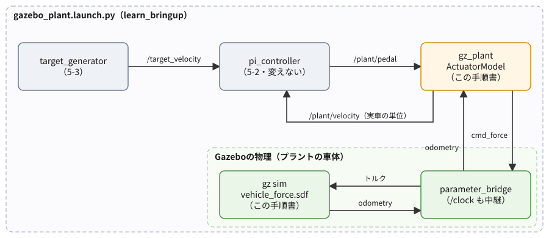
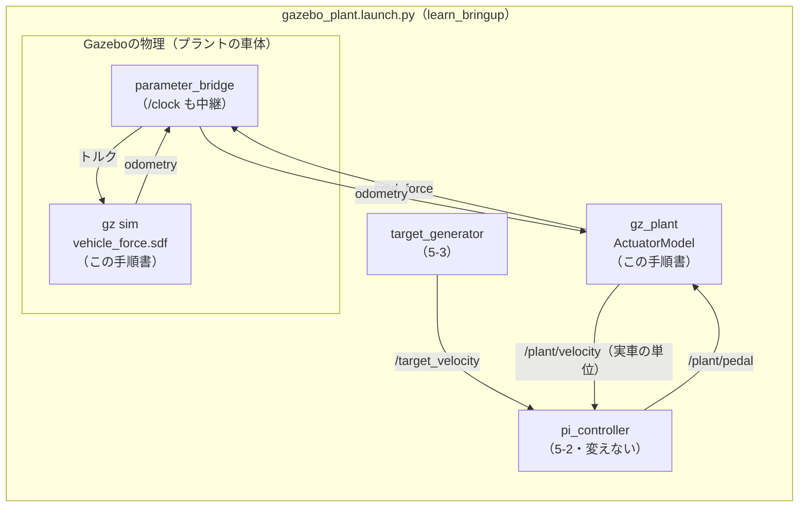

# フェーズ5-4 手順書: プラントをGazeboの物理に差し替える

[`docs/learning_plan.md`](learning_plan.md) フェーズ5の5-4に対応する。フェーズ5-1で自作した疑似プラント（`vehicle_plant`）の代わりに、Gazeboの物理エンジンが計算する車両をプラントにする。PI制御のノード（フェーズ5-2の `pi_controller`）は**一行も変えずに**つなぎ替え、同じゲインで追従がどう変わるかを比べる。「プラントを差し替えても、制御のノードはそのまま使える」という、トピックで部品をつなぐROS2の利点を確かめるのが、この手順書の目的である。

- 想定環境: WSL2 + Ubuntu 24.04 + ROS2 Jazzy
- 前提: フェーズ5-3（[`docs/phase5_3_launch.md`](phase5_3_launch.md)。`learn_bringup` に `vehicle_sim.launch.py` があり、`target_generator` が動く）
- 所要目安: 2〜3コマ
- 言語: Python（launchもPython形式）

> **進め方**: 2節でGazeboの車両を力で動かせるワールドを用意し、3節で実車の単位とGazeboの縮尺の関係を式にする。4節で、ペダルを車輪のトルクに変えるノードを書き、5節でシミュレーション時刻の扱いを押さえる。6節のlaunchで一式を起動し、7節で5-3の結果と比べる。サンプルは学習の手がかりとして最小限に書いたもので、公式チュートリアルの転載ではない。コードはこの手順書の作成時に、使い捨ての環境でビルドし、Gazeboを画面なしで起動して一連の動きを確かめた（画面の見え方と、`rqt_plot` のグラフは未確認）。出力が違う場合は、実機の表示を優先する。

> **実行環境が無くても読めるように**: 実行する手順の直後には「期待する結果」として、表示される内容の例とその読み方を載せている。表示の出どころは次のとおり。`gz sdf -k`・ビルド・launchの `--show-args`・`--print` の表示と、6-3節のlaunchのログ・7節の比較の数値は、使い捨ての環境で実際に実行した表示（Gazeboは画面なし）で、時刻・pidは実行ごとに異なる（ログは抜粋）。3-2節の加速度の値は、筆者が実験で測った値。6-3節の画面の様子と、6-4節のグラフの見え方は、ログの数値から筆者が想定したもの。

## 0. 学習目標と完了条件

1. 既存のワールドファイルを写して、車両を「速度」ではなく「力（トルク）」で動かせるように改造できる。改造したファイルの出典と変更点を残せる。
2. 実車の単位とGazeboの縮尺（速度・力）の関係を式にし、車輪の回転の慣性を含めた有効質量を計算できる。
3. シミュレーション時刻（`/clock` と `use_sim_time`）で動くノードを組める。
4. PI制御のノードを変えずにプラントを差し替え、同じゲインで追従が変わる理由を、プラントの違いから説明できる。

完了条件: `ros2 launch learn_bringup gazebo_plant.launch.py` で一式が起動し、Gazeboの緑の車両が、目標10 → 5 → 0 m/s（実車の単位）に追従して走る。5-3の自作のプラントと比べて、行き過ぎ・落ち着いたときのペダル・目標0での止まり方が違う理由を、7節の表を使って説明できる。

## 1. 全体像



<details>
<summary>同じ図（mermaid版）</summary>



</details>

5-3の構成との違いは、`vehicle_plant` が `gz_plant` とGazeboに置き換わったことだけである。

| | 5-3（自作のプラント） | 5-4（Gazeboの物理） |
|---|---|---|
| アクセル・ブレーキの遅れ | `vehicle_plant` の中の式 | `gz_plant` の中の式（5-1と同じ一次遅れ） |
| 車体（質量・抵抗・速度） | `vehicle_plant` の中の式 | Gazeboの物理エンジン |
| `pi_controller` から見えるもの | `/plant/pedal` を送り、`/plant/velocity` を受ける | 同じ |

`pi_controller` は、相手が自作の式かGazeboかを知らない。同じトピック名・同じ型・同じ単位で `/plant/velocity` が届き、`/plant/pedal` を受け取ってくれれば、中身は何でもよい。実物のロボットにつなぐときも、この形のまま、`gz_plant` の位置に実物のモーターを動かすノードを置けばよい。

アクセルとブレーキの遅れの部分は、Gazeboには任せず、自作の式のまま `gz_plant` に残す。アクチュエータの特性（時定数）を自分で変えられるようにしておくためである（フェーズ5-1の7節）。

## 2. Gazeboの車両を力で動かすワールド

### 2-1. なぜ改造が要るか

フェーズ5-0で使った緑の車両には、DiffDriveプラグインが付いている。DiffDriveは、速度の指令を受け取ると、**車輪の回転の速さを毎ステップ直接決める**。外から車輪に力をかけても、次のステップでDiffDriveが速さを上書きするので、力の効き目が出ない。車両を力で動かすには、DiffDriveを外して、次の2つのプラグインに付け替える。

| プラグイン | 役割 | トピック |
|---|---|---|
| ApplyJointForce | 関節（ここでは車輪の軸）にトルクをかける。車輪1つに1つ付ける | `/model/vehicle_green/joint/<関節名>/cmd_force`（`gz.msgs.Double`）。最後に受け取った値をかけ続ける |
| OdometryPublisher | 車両の位置の変化から、速度を計算して送る | `/model/vehicle_green/odometry`（`gz.msgs.Odometry`）。速度は車両の向きを基準にした前後・左右の成分で、直近の10回分の平均 |

どちらもGazebo Sim 8に付属しているので、追加の導入は要らない（トピック名と振る舞いは、公式のAPIリファレンスとgz-sim8のソースで確かめた）。

### 2-2. ワールドファイルを写して改造する

フェーズ5-0で使ったワールドファイル（Gazeboに付属の `diff_drive.sdf`）を、`learn_bringup` の中へ写す。

```bash
mkdir -p ~/ros2_ws/src/learn_bringup/worlds

cp /opt/ros/jazzy/opt/gz_sim_vendor/share/gz/gz-sim8/worlds/diff_drive.sdf ~/ros2_ws/src/learn_bringup/worlds/vehicle_force.sdf
```

ワールドファイルは、**SDF**（Simulation Description Format）という、Gazeboのためのデータの書き方で書かれたXMLのファイルである。要素は次のように入れ子になっている（書き換えるときと、3-2節の計算のときに探す要素だけを挙げる）。

- `<world>`: ワールド全体。中に、地面や車両の `<model>` が並ぶ。
- `<model>`: 1台の車両など、ひとまとまりの物体。緑の車両は `<model name='vehicle_green'>`。中に、次の3種類の要素を持つ。
  - `<link>`: 形と質量を持つ部品（緑の車両では、車体・左右の車輪・補助輪の4つ）。質量と慣性モーメント（回転のしにくさ。3-2節で使う）は、その中の `<inertial>` に、車輪の半径は形の記述の中の `<radius>` に書かれている（3-2節で使う）。
  - `<joint>`: 部品どうしのつなぎ目（関節）。車体と車輪をつなぐ `left_wheel_joint`・`right_wheel_joint` が、車輪の軸にあたる。
  - `<plugin>`: 物体に機能を足す部品。DiffDriveもこれで付いている。

写した `ros2_ws/src/learn_bringup/worlds/vehicle_force.sdf` を、エディタで次の3か所だけ書き換える。青の車両は残しておいてよい（指令を送らなければ止まったまま）。

**(1) ファイルの先頭のコメント**（`<!--` から `-->` まで。デモの使い方が書かれている）を、出典と変更点を書いたコメントに置き換える。

<!-- snippet: world_header_comment -->
```xml
<!--
  フェーズ5-4用のワールド。緑の車両を、車輪にかけるトルクで動かす。
  出典: Gazebo Sim 8 に付属する worlds/diff_drive.sdf（Apache License 2.0）。
  変更点: ワールド名を vehicle_force にし、緑の車両の DiffDrive プラグインを、
  ApplyJointForce（左右の車輪）と OdometryPublisher に差し替えた。
-->
```

**(2) ワールドの名前**を変える。

```xml
  <world name="vehicle_force">
```

（元は `<world name="diff_drive">`。Gazeboのトピック名の一部（`/world/vehicle_force/...`）になるので、5-0のデモと区別できるようにする。）

**(3) 緑の車両のプラグイン**を置き換える。ファイルの後半の `<model name='vehicle_green'>` の中の、最後にある `<plugin filename="gz-sim-diff-drive-system" ...>` から `</plugin>` までを、次の3つのプラグインに置き換える（青の車両の中にも同じDiffDriveがあるが、そちらは変えない）。

<!-- snippet: world_green_plugins -->
```xml
      <plugin
        filename="gz-sim-apply-joint-force-system"
        name="gz::sim::systems::ApplyJointForce">
        <joint_name>left_wheel_joint</joint_name>
      </plugin>
      <plugin
        filename="gz-sim-apply-joint-force-system"
        name="gz::sim::systems::ApplyJointForce">
        <joint_name>right_wheel_joint</joint_name>
      </plugin>
      <plugin
        filename="gz-sim-odometry-publisher-system"
        name="gz::sim::systems::OdometryPublisher">
        <odom_publish_frequency>50</odom_publish_frequency>
      </plugin>
```

書き換えたら、ファイルの書き方に誤りがないかを確かめる。

```bash
gz sdf -k ~/ros2_ws/src/learn_bringup/worlds/vehicle_force.sdf
```

**期待する結果**:

```text
Valid.
```

`Valid.` と出れば、SDFとして正しく読める。タグの閉じ忘れなどがあると、どこが誤りかを示すエラーが出る。

> **ワールドファイルの出典について**: `diff_drive.sdf` は、Gazebo Sim（Open Source Robotics Foundation）に付属するファイルで、Apache License 2.0で配布されている。Apache License 2.0では、改変したファイルを使ったり配ったりしてよいが、改変したことを分かるようにしておく必要がある。(1)のコメントで出典と変更点を残しているのは、そのためである。この教材のリポジトリには、このファイルそのものは含めていない（読者が各自で写して改造する）。

### 2-3. インストールの設定と依存

`learn_bringup` の `CMakeLists.txt` の `install(DIRECTORY ...)` に、`worlds` を足す（フェーズ4の3-3節で書いた行を変える）。

<!-- snippet: cmake_bringup_worlds -->
```cmake
install(DIRECTORY launch config worlds
  DESTINATION share/${PROJECT_NAME})
```

`package.xml` に、この手順書で起動するパッケージへの実行時の依存を足す（`ros_gz_sim_demos` の行の後に）。

```xml
<exec_depend>ros_gz_sim</exec_depend>
<exec_depend>ros_gz_bridge</exec_depend>
```

## 3. 縮尺と有効質量

### 3-1. 速度と力の縮尺

`pi_controller` は、5-2で実車の単位（10 m/sなど）でゲインを決めた。Gazeboの車両の速度とは、5-1の `gz_display` と同じく1/40の縮尺で対応させる。DiffDriveを外したので、5-1で縮尺を決めた理由（最高速度0.5 m/sの上限）はもう無いが、縮尺をそろえておくと、5-1〜5-3で表示器として見た車両と同じ速さで画面の車両が走り、見比べやすい。一方、Gazeboの車両の質量は約6 kgで、実車の1500 kgとは比率が違うので、力の縮尺は速度とは別に決める（下の3つめの項目）。

- **速度**: Gazeboの速度 ＝ 実車の速度 × $s$（ $s = 0.025$）。`gz_plant` は、Gazeboのオドメトリの速度を $s$ で割って、実車の単位に戻してから `/plant/velocity` へ送る。
- **加速度**: 時間の縮尺はそのまま（1秒は1秒）なので、加速度も同じ比率 $s$ になる。実車で2 m/s²の加速は、Gazeboでは0.05 m/s²。
- **力**: 加速度 ＝ 力 ÷ 質量なので、Gazeboで同じ比率の加速度を出す力は、次のとおり。

$$
F_{gz} = F_{real} \times \frac{m_{gz}\, s}{m_{real}}
$$

$m_{real}$ は5-1の車両の質量（1500 kg）、 $m_{gz}$ はGazeboの車両の**有効質量**（3-2節）。右辺の分数を「力の縮尺」と呼び、パラメータ `force_scale` にする。

### 3-2. 有効質量（車輪の回転も質量として効く）

Gazeboの緑の車両の各部の質量は、ワールドファイルに書かれている（車体1.14 kg、左右の車輪が2 kgずつ、補助輪1 kg。合計6.14 kg）。ところが、車輪を回して車両を加速させるときは、車両を前へ動かすだけでなく、**車輪と補助輪を回転させる**ためにも力が要る。回転の慣性（慣性モーメント $I$）を持つ半径 $r$ の輪が転がるとき、その分は、質量が $I / r^2$ だけ増えたのと同じ効き方をする。

慣性モーメントは、回転の速さの変えにくさで、直線の運動の質量にあたる（トルク ＝ 慣性モーメント × 角加速度）。車両が加速度 $a$ で進むと、滑らずに転がる輪は、角加速度 $a / r$ で回転を速める。そのために要るトルクは $I a / r$ で、これを輪の縁で出す力に直すと、半径 $r$ で割って $(I / r^2)\, a$ になる。つまり、質量 $I / r^2$ の物体を加速させるのと同じだけの力が、余分に要る。

| 部品 | 質量 | 慣性モーメント $I$（回転の軸まわり） | 半径 $r$ | $I / r^2$ |
|---|---|---|---|---|
| 車体 | 1.14 kg | — | — | — |
| 左の車輪 | 2 kg | 0.125 kg·m² | 0.3 m | 1.39 kg |
| 右の車輪 | 2 kg | 0.125 kg·m² | 0.3 m | 1.39 kg |
| 補助輪 | 1 kg | 0.1 kg·m² | 0.2 m | 2.5 kg |

$$
m_{gz} = 6.14 + 1.39 \times 2 + 2.5 \approx 11.4 \ \text{kg}
$$

慣性モーメントと半径も、ワールドファイルの値である（2-2節のとおり、各部品の `<link>` の中の `<inertial>` と `<radius>`）。筆者が実験で確かめたところ、左右の車輪に0.05 N·mずつのトルク（車両を押す力にすると $2 \times 0.05 / 0.3 \approx 0.333$ N）をかけると、加速度は0.0292 m/s²だった。 $0.333 / 0.0292 \approx 11.4$ kgで、計算と合う。

これで、力の縮尺は $11.4 \times 0.025 / 1500 \approx 1.9 \times 10^{-4}$ になる。実車のアクセル全開の3000 Nは、Gazeboでは約0.57 N、車輪1つあたりのトルクにすると $0.57 \times 0.3 / 2 \approx 0.0855$ N·mである。

> 課題1: 補助輪の慣性モーメントを使わずに（車体・車輪の質量の合計6.14 kgだけで）力の縮尺を決めると、Gazeboの車両の加速は、実車の縮尺に比べて速くなるか遅くなるか。何倍か（有効質量の比 11.4 / 6.14 ≈ 1.86倍の違いが出る）。

## 4. ペダルを車輪のトルクに変えるノード

### 4-1. 仕様

- パッケージ: `learn_py` にファイルを2つ、`learn_bringup` にファイルを3つ足す（`learn_bringup` の分は2節と6節）。

| ファイル | 中身 |
|---|---|
| `learn_py/actuator_model.py` | アクセルとブレーキの遅れだけを計算するクラス `ActuatorModel` と、パラメータをまとめる `ActuatorParams`。**ROS2を使わない** |
| `learn_py/gz_plant_node.py` | `ActuatorModel` を包み、Gazeboの車両をプラントにするノード `gz_plant`（実行ファイル名も `gz_plant`） |
| `learn_bringup/worlds/vehicle_force.sdf` | 緑の車両を力で動かせるように改造したワールド（2-2節） |
| `learn_bringup/config/gazebo_plant.yaml` | 各ノードのパラメータ（6-1節） |
| `learn_bringup/launch/gazebo_plant.launch.py` | Gazebo・ブリッジ・3つのノードを起動するlaunch（6-2節） |

- `gz_plant`:
  - 受ける: `/plant/pedal`（[`std_msgs/msg/Float64`](https://github.com/ros2/common_interfaces/blob/jazzy/std_msgs/msg/Float64.msg)、−1〜1）と、`/model/vehicle_green/odometry`（[`nav_msgs/msg/Odometry`](https://github.com/ros2/common_interfaces/blob/jazzy/nav_msgs/msg/Odometry.msg)、Gazeboの単位）。
  - 送る: `/plant/velocity`（`std_msgs/msg/Float64`、実車の単位のm/s）を、オドメトリが届くたびに。左右の車輪のトルク（`/model/vehicle_green/joint/<関節名>/cmd_force`、`std_msgs/msg/Float64`、N·m）を、`period` 秒ごとに。
  - パラメータ: アクチュエータの4つ（5-1の2-5節の表と同じ名前・既定値）と、`scale`・`force_scale`・`wheel_radius`・`brake_speed_band`・`period`。実行中に `ros2 param set` で変えられる（すべて正の値だけを受け付ける）。
  - ログ: 1秒に1回、ペダル・速度・駆動力・制動力・トルクを出す。

`/plant/pedal` と `/plant/velocity` の名前・型・単位は、5-1の `vehicle_plant` と同じにする。`pi_controller` から見て、相手を区別できないようにするためである（1節）。

主なAPI（これまでの手順書で使ったもの以外）: ノードのコードに新しいAPIは無い。5-1の `plant_node.py` と同じ形（ROS2を使わないクラスをノードで包み、パラメータを `dataclasses.fields` でまとめて宣言する）である。新しく使うのは、Gazeboのプラグイン（2-1節）と、パラメータ `use_sim_time`（5節）。

### 4-2. アクチュエータのモデル（`actuator_model.py`）

ファイル: `ros2_ws/src/learn_py/learn_py/actuator_model.py`

<!-- file: ros2_ws/src/learn_py/learn_py/actuator_model.py -->
```python
from dataclasses import dataclass


# アクチュエータ（アクセルとブレーキ）のパラメータ。値は5-1の VehicleParams と同じ。
@dataclass
class ActuatorParams:
    drive_force_max: float = 3000.0  # アクセル全開のときの駆動力 [N]
    brake_force_max: float = 9000.0  # ブレーキ全開のときの制動力 [N]
    tau_accel: float = 0.5           # 駆動力の遅れの時定数 [s]
    tau_brake: float = 0.2           # 制動力の遅れの時定数 [s]


# アクセルとブレーキの遅れ（一次遅れ）だけを計算するモデル（ROS2を使わない）。
# 5-1の VehicleModel から、車体（質量と抵抗）の部分を除いたもの。
class ActuatorModel:
    # パラメータを受け取り、力0から始める。
    def __init__(self, params):
        self.params = params
        self.drive_force = 0.0
        self.brake_force = 0.0

    # ペダルの指令 pedal（-1〜1）で dt 秒進め、(駆動力, 制動力) を返す。
    def step(self, pedal, dt):
        p = self.params
        pedal = min(max(pedal, -1.0), 1.0)
        accel_cmd = max(pedal, 0.0)
        brake_cmd = max(-pedal, 0.0)
        d_drive = (accel_cmd * p.drive_force_max - self.drive_force) / p.tau_accel
        d_brake = (brake_cmd * p.brake_force_max - self.brake_force) / p.tau_brake
        self.drive_force += d_drive * dt
        self.brake_force += d_brake * dt
        return self.drive_force, self.brake_force
```

5-1の `vehicle_model.py` から、アクセルとブレーキの遅れ（一次遅れ）の部分だけを取り出したクラスである。式（2-2節）とパラメータの既定値は、5-1と同じ。車体の部分（質量・抵抗・速度の計算）はGazeboが担うので、ここには無い。

- 5-1の `VehicleModel` を書き換えて、アクチュエータと車体の2つのクラスに分ける方法もある。この手順書では、5-1まで動いているファイルを変えずに済むよう、別のファイルにした（同じ式が2か所にあることになる。この節の末尾の課題2）。

> 課題2: 5-1の `VehicleModel` を、`ActuatorModel`（この節）と、車体だけを計算するクラスの組み合わせに書き直す。`vehicle_model.py` の `main` の表示（5-1の4節）が、書き直す前と1桁も変わらないことを確かめる。

### 4-3. Gazeboをプラントにするノード（`gz_plant_node.py`）

ファイル: `ros2_ws/src/learn_py/learn_py/gz_plant_node.py`

<!-- file: ros2_ws/src/learn_py/learn_py/gz_plant_node.py -->
```python
import dataclasses

import rclpy
from nav_msgs.msg import Odometry
from rcl_interfaces.msg import SetParametersResult
from rclpy.executors import ExternalShutdownException
from rclpy.node import Node
from std_msgs.msg import Float64

from learn_py.actuator_model import ActuatorModel, ActuatorParams


# Gazeboの緑の車両を、疑似プラントの代わりにするノード。
# ペダルの指令をアクチュエータのモデルで力に変え、縮尺して車輪のトルクとして送る。
# Gazeboのオドメトリの速度を実車の単位に戻して、plant/velocity へ送る。
class GzPlant(Node):
    # パラメータを宣言し、アクチュエータのモデル・通信の口・タイマーを用意する。
    def __init__(self):
        super().__init__('gz_plant')
        self.actuator_names = [f.name for f in dataclasses.fields(ActuatorParams)]
        defaults = ActuatorParams()
        for name in self.actuator_names:
            self.declare_parameter(name, getattr(defaults, name))
        self.declare_parameter('scale', 0.025)           # 速度の縮尺（Gazebo / 実車）
        self.declare_parameter('force_scale', 1.9e-4)    # 力の縮尺（Gazebo / 実車）
        self.declare_parameter('wheel_radius', 0.3)      # Gazeboの車輪の半径 [m]
        self.declare_parameter('brake_speed_band', 0.1)  # ブレーキを弱め始める速さ [m/s]
        self.declare_parameter('period', 0.01)

        values = {name: self.get_parameter(name).value for name in self.actuator_names}
        self.actuator = ActuatorModel(ActuatorParams(**values))
        self.settings = {name: self.get_parameter(name).value for name in
                         ('scale', 'force_scale', 'wheel_radius', 'brake_speed_band')}
        self.period = self.get_parameter('period').value
        self.pedal = 0.0
        self.velocity = 0.0  # 実車の単位 [m/s]

        self.sub_pedal = self.create_subscription(Float64, 'plant/pedal', self.on_pedal, 10)
        self.sub_odom = self.create_subscription(
            Odometry, '/model/vehicle_green/odometry', self.on_odom, 10)
        self.pub_velocity = self.create_publisher(Float64, 'plant/velocity', 10)
        self.pub_left = self.create_publisher(
            Float64, '/model/vehicle_green/joint/left_wheel_joint/cmd_force', 10)
        self.pub_right = self.create_publisher(
            Float64, '/model/vehicle_green/joint/right_wheel_joint/cmd_force', 10)
        self.timer = self.create_timer(self.period, self.on_timer)
        self.add_on_set_parameters_callback(self.on_params)

    # 届いたペダルの指令を覚えておく。
    def on_pedal(self, msg):
        self.pedal = msg.data

    # Gazeboの速度を実車の単位に戻して覚え、plant/velocity へ送る。
    def on_odom(self, msg):
        self.velocity = msg.twist.twist.linear.x / self.settings['scale']
        out = Float64()
        out.data = self.velocity
        self.pub_velocity.publish(out)

    # 周期ごとに、ペダルから力を計算し、縮尺した力を左右の車輪のトルクにして送る。
    def on_timer(self):
        drive, brake = self.actuator.step(self.pedal, self.period)
        # ブレーキは動きを止める向きに働く。止まる直前は弱め、止まった車両を押し戻さない
        band = self.settings['brake_speed_band']
        brake_direction = min(max(self.velocity / band, -1.0), 1.0)
        force = drive - brake * brake_direction
        torque = force * self.settings['force_scale'] * self.settings['wheel_radius'] / 2.0
        msg = Float64()
        msg.data = torque
        self.pub_left.publish(msg)
        self.pub_right.publish(msg)
        self.get_logger().info(
            f'pedal: {self.pedal:+.2f}, velocity: {self.velocity:5.2f} m/s, '
            f'drive: {drive:5.0f} N, brake: {brake:5.0f} N, torque: {torque:+.4f} N*m',
            throttle_duration_sec=1.0)

    # パラメータの変更を検証してから反映する（すべて正の値だけを受け付ける）。
    def on_params(self, params):
        names = self.actuator_names + list(self.settings) + ['period']
        for p in params:
            if p.name in names and p.value <= 0.0:
                return SetParametersResult(successful=False, reason=f'{p.name} must be > 0')
        changes = {p.name: p.value for p in params if p.name in self.actuator_names}
        if changes:
            self.actuator.params = dataclasses.replace(self.actuator.params, **changes)
        for p in params:
            if p.name in self.settings:
                self.settings[p.name] = p.value
            elif p.name == 'period':
                self.period = p.value
                self.timer.cancel()
                self.timer = self.create_timer(self.period, self.on_timer)
        return SetParametersResult(successful=True)


# エントリポイント（setup.py の entry_points から呼ばれる）。
# ノードを作って spin で回し、Ctrl+C で後片付けして終わる。
def main(args=None):
    rclpy.init(args=args)
    node = GzPlant()
    try:
        rclpy.spin(node)
    except (KeyboardInterrupt, ExternalShutdownException):
        pass
    finally:
        node.destroy_node()
        rclpy.try_shutdown()
```

**`gz_plant_node.py` の解説**

役割は、「`/plant/pedal` を受けて `/plant/velocity` を送る」という、5-1の `vehicle_plant` と同じ外側を持ちながら、車体の計算をGazeboに任せること。

- **パラメータ**: アクチュエータの4つ（5-1と同じ名前・既定値）は、5-1と同じく `dataclasses.fields` でまとめて宣言する。ほかに、速度の縮尺 `scale`、力の縮尺 `force_scale`（3-2節）、車輪の半径 `wheel_radius`、ブレーキの向きを決めるための `brake_speed_band`、計算の周期 `period` を持つ。
- **`on_odom`**: Gazeboのオドメトリ（ブリッジが `nav_msgs/msg/Odometry` に変換したもの）の前後の速さ（`twist.twist.linear.x`、Gazeboの単位）を $s$ で割って実車の単位に戻し、`/plant/velocity` へ送る。オドメトリは50 Hzで届くので、`/plant/velocity` も50 Hzになる（5-1の `vehicle_plant` は100 Hz）。
- **`on_timer`**: 周期ごとに、アクチュエータのモデルで駆動力と制動力を計算し（送るトルクの型は `std_msgs/msg/Float64`。ブリッジが `gz.msgs.Double` に変換する）、合計の力を $F_{gz}$ に縮めて、車輪1つあたりのトルク $F_{gz} \times r / 2$ にして、左右の車輪へ同じ値を送る。
  - 左右のトルクは、同じ周期の中で続けて送る。片方だけが先に届くと、その間だけ左右の力がずれて車両が向きを変え、力で動かす車両には向きを元に戻す仕組みが無いので、曲がったまま走り続ける（筆者が `gz topic` で左右に1つずつ送って試したときに起きた）。
- **ブレーキの向き**: ブレーキは、動いている向きと逆に働く力である。5-1では「後ろへは進まない」として速度を0で止めたが、ここではGazeboが速度を計算するので、その手は使えない。そこで、制動力に「速度 ÷ `brake_speed_band`（−1〜1に収める）」を掛けて向きを決める。速く動いているときは全部の制動力が逆向きにかかり、止まる直前（0.1 m/s未満）では弱まって、止まったときは0になる。止まった車両をブレーキが後ろへ押し出さないようにするための工夫である。
- **ログ**: 5-1の `vehicle_plant` と同じ形に、送ったトルクを足した。

## 5. シミュレーション時刻

Gazeboの中の時間（シミュレーション時刻）は、PCの負荷によって、現実の時間より遅く進むことがある（フェーズ5-0の2-1節のRTF）。この手順書では、Gazeboの物理と、`gz_plant`・`pi_controller` の計算が、同じ時計で進んでほしい。そうでないと、たとえばGazeboが遅れている間も、`pi_controller` は現実の時間で積分を進めてしまい、制御がずれる。

そのため、次の2つを行う（しくみはTips集の1節（[`docs/tips.md`](tips.md)）で説明した）。

- ブリッジで、Gazeboの `/clock` をROS2の `/clock`（[`rosgraph_msgs/msg/Clock`](https://github.com/ros2/rcl_interfaces/blob/jazzy/rosgraph_msgs/msg/Clock.msg)）へ中継する。
- `gz_plant` と `pi_controller` に、パラメータ `use_sim_time: true` を渡す。すると、ノードの時計（タイマーの周期など）が `/clock` に従うようになる。コードは変えなくてよい。

`target_generator` には `use_sim_time` を渡さない。5-3の2-2節のとおり、`target_generator` は単調増加する時計（PCの経過時間）で目標を切り替えるので、切り替えの時刻は現実の時間で決まる。目標は「人が決めて送る」ものと考え、ここではそのままにした（シミュレーション時刻で切り替えたい場合は、この節の末尾の課題3）。

> 課題3: `target_generator` を、シミュレーション時刻で目標を切り替えるように改造する。`steady_clock` の代わりにノードの時計（`self.get_clock()`）を使い、launchで `use_sim_time: true` を渡す。ただし、5-1の5-2節のとおり、ノードの時計はPCの時刻合わせの影響を受けうる（シミュレーション時刻を使う場合は受けない）。

## 6. launchで起動する

### 6-1. パラメータのYAML（`config/gazebo_plant.yaml`）

ファイル: `ros2_ws/src/learn_bringup/config/gazebo_plant.yaml`

<!-- file: ros2_ws/src/learn_bringup/config/gazebo_plant.yaml -->
```yaml
# フェーズ5-4の、Gazeboの物理をプラントにした構成の、ノードごとのパラメータ
gz_plant:
  ros__parameters:
    tau_accel: 0.5
    tau_brake: 0.2
    scale: 0.025
    force_scale: 0.00019

pi_controller:
  ros__parameters:
    kp: 0.5
    ki: 0.1

target_generator:
  ros__parameters:
    step_times: [15.0, 55.0, 85.0]
    step_values: [10.0, 5.0, 0.0]
```

- `pi_controller` のゲインは、5-3の `vehicle_sim.yaml` と同じ値にしている。**同じゲインでプラントだけを変える**のが、この手順書の比べ方である。
- `target_generator` の最初の切り替えを、5-3より5秒遅い15秒にした。Gazeboを自分のlaunchで起動し、画面が開くまで待つため。

### 6-2. launchファイル（`launch/gazebo_plant.launch.py`）

ファイル: `ros2_ws/src/learn_bringup/launch/gazebo_plant.launch.py`

<!-- file: ros2_ws/src/learn_bringup/launch/gazebo_plant.launch.py -->
```python
from launch import LaunchDescription
from launch.actions import DeclareLaunchArgument, IncludeLaunchDescription
from launch.launch_description_sources import PythonLaunchDescriptionSource
from launch.substitutions import LaunchConfiguration, PathJoinSubstitution
from launch_ros.actions import Node
from launch_ros.substitutions import FindPackageShare


# Gazeboの物理を疑似プラントの代わりにして、目標速度・PI制御とループを閉じる。
# Gazeboとブリッジ、gz_plant、pi_controller、target_generator を起動する。
def generate_launch_description():
    params_file = LaunchConfiguration('params_file')
    world = PathJoinSubstitution(
        [FindPackageShare('learn_bringup'), 'worlds', 'vehicle_force.sdf'])
    gz_sim = PathJoinSubstitution(
        [FindPackageShare('ros_gz_sim'), 'launch', 'gz_sim.launch.py'])
    default_params = PathJoinSubstitution(
        [FindPackageShare('learn_bringup'), 'config', 'gazebo_plant.yaml'])
    sim_time = {'use_sim_time': True}
    return LaunchDescription([
        DeclareLaunchArgument(
            'gz_args', default_value=['-r ', world],
            description='Gazeboに渡す引数（既定はワールドを再生した状態で開く）'),
        DeclareLaunchArgument(
            'params_file', default_value=default_params,
            description='各ノードのパラメータを書いたYAMLファイル'),
        IncludeLaunchDescription(
            PythonLaunchDescriptionSource(gz_sim),
            launch_arguments={
                'gz_args': LaunchConfiguration('gz_args'),
                'on_exit_shutdown': 'true',
            }.items(),
        ),
        Node(
            package='ros_gz_bridge', executable='parameter_bridge', name='ros_gz_bridge',
            output='screen',
            arguments=[
                '/clock@rosgraph_msgs/msg/Clock[gz.msgs.Clock',
                '/model/vehicle_green/odometry@nav_msgs/msg/Odometry[gz.msgs.Odometry',
                '/model/vehicle_green/joint/left_wheel_joint/cmd_force'
                '@std_msgs/msg/Float64]gz.msgs.Double',
                '/model/vehicle_green/joint/right_wheel_joint/cmd_force'
                '@std_msgs/msg/Float64]gz.msgs.Double',
            ],
        ),
        Node(
            package='learn_py', executable='gz_plant', name='gz_plant',
            output='screen', parameters=[params_file, sim_time],
        ),
        Node(
            package='learn_py', executable='pi_controller', name='pi_controller',
            output='screen', parameters=[params_file, sim_time],
        ),
        Node(
            package='learn_py', executable='target_generator', name='target_generator',
            output='screen', parameters=[params_file],
        ),
    ])
```

**`gazebo_plant.launch.py` の解説**

| 部分 | 何をしているか |
|---|---|
| `IncludeLaunchDescription(... gz_sim.launch.py ...)` | Gazeboを起動する、`ros_gz_sim` のlaunchを取り込む。5-0のデモの `diff_drive.launch.py` も、中でこれを使っている。ここでは、ワールドを2節の `vehicle_force.sdf` にするため、デモではなくこちらを直接取り込む |
| `DeclareLaunchArgument('gz_args', default_value=['-r ', world])` | Gazeboに渡す引数。既定は「`-r`（再生した状態で始める）＋ワールドのパス」。リストの要素（文字列と置換）は、つながって1つの文字列になる。引数にしてあるので、起動するときに差し替えられる（6-3節の「PCが重い場合」） |
| `'on_exit_shutdown': 'true'` | Gazeboのウィンドウを閉じたら、launch全体を止める（5-0の3-1節の既定は `false` だった） |
| `Node(package='ros_gz_bridge', ...)` | ブリッジ。`/clock` とオドメトリは `[`（Gazebo→ROS2の片方向）、トルクの2本は `]`（ROS2→Gazeboの片方向）。5-0の4-1節で見た「双方向で余分なPublisherができる」ことを避けるため、向きを1つずつ指定した |
| `parameters=[params_file, sim_time]` | YAMLに加えて、`{'use_sim_time': True}` を渡す（5節）。リストの後ろのものが勝つ（フェーズ4の4-4節） |

ブリッジの引数の長い文字列は、Pythonでは、隣に並べた文字列がつながって1つになる（`'...cmd_force' '@std_msgs...'` は1つの文字列）ことを使って、2行に分けている。

### 6-3. ビルドして起動する

`learn_py` の `setup.py` の `entry_points` に1行足す（既存の行は残す。5-3の3-1節で足した `target_generator` の行の後に続ける）。

<!-- snippet: py_entry_points_gz_plant -->
```python
            'gz_plant = learn_py.gz_plant_node:main',
```

```bash
cd ~/ros2_ws

colcon build --symlink-install --packages-select learn_py learn_bringup

source install/setup.bash

ros2 launch learn_bringup gazebo_plant.launch.py --show-args
```

**期待する結果**（`--show-args` の分の先頭の抜粋。ビルドは `Summary: 2 packages finished` で終われば成功）:

```text
Arguments (pass arguments as '<name>:=<value>'):

    'gz_args':
        Gazeboに渡す引数（既定はワールドを再生した状態で開く）
        (default: '-r ' + PathJoinSubstitution('FindPackageShare(pkg='learn_bringup'), 'worlds', 'vehicle_force.sdf''))

    'params_file':
        各ノードのパラメータを書いたYAMLファイル
        (default: PathJoinSubstitution('FindPackageShare(pkg='learn_bringup'), 'config', 'gazebo_plant.yaml''))

    'gz_version':
        Gazebo Sim's major version
```

最初の2つがこのlaunchの引数で、その後に、取り込んだ `gz_sim.launch.py` の引数が続く。

```bash
ros2 launch learn_bringup gazebo_plant.launch.py --print
```

**期待する結果**（アドレスは実行ごとに変わる）:

```text
<launch.launch_description.LaunchDescription object at 0x...>
├── Action('<launch.actions.declare_launch_argument.DeclareLaunchArgument object at 0x...>')
├── Action('<launch.actions.declare_launch_argument.DeclareLaunchArgument object at 0x...>')
├── Action('<launch.actions.include_launch_description.IncludeLaunchDescription object at 0x...>')
├── ExecuteProcess(cmd=[ExecInPkg(pkg='ros_gz_bridge', exec='parameter_bridge'), '/clock@rosgraph_msgs/msg/Clock[gz.msgs.Clock', '/model/vehicle_green/odometry@nav_msgs/msg/Odometry[gz.msgs.Odometry', '/model/vehicle_green/joint/left_wheel_joint/cmd_force@std_msgs/msg/Float64]gz.msgs.Double', '/model/vehicle_green/joint/right_wheel_joint/cmd_force@std_msgs/msg/Float64]gz.msgs.Double', '--ros-args', '-r', LocalVar('node name')], cwd=None, env=None, shell=False)
├── ExecuteProcess(cmd=[ExecInPkg(pkg='learn_py', exec='gz_plant'), '--ros-args', '-r', LocalVar('node name')], cwd=None, env=None, shell=False)
├── ExecuteProcess(cmd=[ExecInPkg(pkg='learn_py', exec='pi_controller'), '--ros-args', '-r', LocalVar('node name')], cwd=None, env=None, shell=False)
└── ExecuteProcess(cmd=[ExecInPkg(pkg='learn_py', exec='target_generator'), '--ros-args', '-r', LocalVar('node name')], cwd=None, env=None, shell=False)
```

最初の `ExecuteProcess`（ブリッジ）に、5節の `/clock` と、2-1節の表のトピック（左右の車輪のトルクの2本とオドメトリの1本）の、計4本が、向き（`[`・`]`）付きで並んでいることを確かめる。

中身を確かめたら、起動する。

```bash
# T1
ros2 launch learn_bringup gazebo_plant.launch.py
```

**期待する結果**（ログの抜粋。時刻・pidは実行ごとに変わる。目標10 m/s・5 m/s・0 m/sに切り替わった前後を載せる。長い行は途中で切っている）:

```text
[INFO] [gazebo-1]: process started with pid [12429]
[INFO] [parameter_bridge-2]: process started with pid [12430]
[INFO] [gz_plant-3]: process started with pid [12432]
[INFO] [pi_controller-4]: process started with pid [12433]
[INFO] [target_generator-5]: process started with pid [12434]
[parameter_bridge-2] [INFO] [1790406720.225612226] [ros_gz_bridge]: Creating GZ->ROS Bridge: [/clock (gz.msgs.Clock) -> /clock (rosgraph_msgs/msg/Cloc ...
[parameter_bridge-2] [INFO] [1790406720.228221274] [ros_gz_bridge]: Creating GZ->ROS Bridge: [/model/vehicle_green/odometry (gz.msgs.Odometry) -> /mod ...
[parameter_bridge-2] [INFO] [1790406720.231564019] [ros_gz_bridge]: Creating ROS->GZ Bridge: [/model/vehicle_green/joint/left_wheel_joint/cmd_force (s ...
[parameter_bridge-2] [INFO] [1790406720.233018709] [ros_gz_bridge]: Creating ROS->GZ Bridge: [/model/vehicle_green/joint/right_wheel_joint/cmd_force ( ...
...
[target_generator-5] [INFO] [1790406735.686812695] [target_generator]:  15.0 s: target -> 10.00 m/s
[gz_plant-3] [INFO] [1790406736.436571075] [gz_plant]: pedal: +1.00, velocity:  0.66 m/s, drive:  2327 N, brake:     0 N, torque: +0.0663 N*m
[pi_controller-4] [INFO] [1790406736.536414583] [pi_controller]: target: 10.00, velocity:  0.82 m/s, pedal: +1.00, integral: -0.000
[gz_plant-3] [INFO] [1790406737.436628068] [gz_plant]: pedal: +1.00, velocity:  2.46 m/s, drive:  2911 N, brake:     0 N, torque: +0.0830 N*m
[pi_controller-4] [INFO] [1790406737.536596251] [pi_controller]: target: 10.00, velocity:  2.65 m/s, pedal: +1.00, integral: -0.000
[gz_plant-3] [INFO] [1790406738.446303975] [gz_plant]: pedal: +1.00, velocity:  4.46 m/s, drive:  2988 N, brake:     0 N, torque: +0.0852 N*m
[pi_controller-4] [INFO] [1790406738.556496343] [pi_controller]: target: 10.00, velocity:  4.66 m/s, pedal: +1.00, integral: -0.000
[gz_plant-3] [INFO] [1790406739.446360598] [gz_plant]: pedal: +1.00, velocity:  6.46 m/s, drive:  2998 N, brake:     0 N, torque: +0.0855 N*m
[pi_controller-4] [INFO] [1790406739.576538345] [pi_controller]: target: 10.00, velocity:  6.70 m/s, pedal: +1.00, integral: -0.000
[gz_plant-3] [INFO] [1790406740.456528101] [gz_plant]: pedal: +0.83, velocity:  8.45 m/s, drive:  2902 N, brake:     0 N, torque: +0.0827 N*m
[pi_controller-4] [INFO] [1790406740.576628614] [pi_controller]: target: 10.00, velocity:  8.68 m/s, pedal: +0.72, integral: +0.059
...
[gz_plant-3] [INFO] [1790406744.382670132] [gz_plant]: pedal: +0.55, velocity:  9.10 m/s, drive:  2447 N, brake:     0 N, torque: +0.0697 N*m
[pi_controller-4] [INFO] [1790406744.393187978] [pi_controller]: target: 10.00, velocity:  9.10 m/s, pedal: +0.53, integral: +0.085
[gz_plant-3] [INFO] [1790406745.382745204] [gz_plant]: pedal: +0.03, velocity: 10.18 m/s, drive:   765 N, brake:     0 N, torque: +0.0218 N*m
[pi_controller-4] [INFO] [1790406745.412963356] [pi_controller]: target: 10.00, velocity: 10.19 m/s, pedal: +0.02, integral: +0.110
[gz_plant-3] [INFO] [1790406746.382963482] [gz_plant]: pedal: -0.03, velocity: 10.23 m/s, drive:   103 N, brake:   389 N, torque: -0.0082 N*m
[pi_controller-4] [INFO] [1790406746.432842275] [pi_controller]: target: 10.00, velocity: 10.22 m/s, pedal: -0.03, integral: +0.083
...
[target_generator-5] [INFO] [1790406782.886926465] [target_generator]:  55.0 s: target -> 5.00 m/s
[gz_plant-3] [INFO] [1790406783.226217243] [gz_plant]: pedal: -1.00, velocity:  9.17 m/s, drive:     0 N, brake:  7257 N, torque: -0.2068 N*m
[pi_controller-4] [INFO] [1790406783.246675991] [pi_controller]: target:  5.00, velocity:  9.08 m/s, pedal: -1.00, integral: +0.000
[gz_plant-3] [INFO] [1790406784.226471982] [gz_plant]: pedal: +0.12, velocity:  4.67 m/s, drive:    55 N, brake:  1458 N, torque: -0.0400 N*m
[pi_controller-4] [INFO] [1790406784.247468244] [pi_controller]: target:  5.00, velocity:  4.65 m/s, pedal: +0.14, integral: -0.031
[gz_plant-3] [INFO] [1790406785.226607697] [gz_plant]: pedal: +0.17, velocity:  4.69 m/s, drive:   522 N, brake:     9 N, torque: +0.0146 N*m
[pi_controller-4] [INFO] [1790406785.267556717] [pi_controller]: target:  5.00, velocity:  4.70 m/s, pedal: +0.16, integral: +0.012
[gz_plant-3] [INFO] [1790406786.236231573] [gz_plant]: pedal: +0.04, velocity:  4.97 m/s, drive:   277 N, brake:     0 N, torque: +0.0079 N*m
[pi_controller-4] [INFO] [1790406786.286384025] [pi_controller]: target:  5.00, velocity:  4.98 m/s, pedal: +0.04, integral: +0.026
[gz_plant-3] [INFO] [1790406787.246359847] [gz_plant]: pedal: -0.01, velocity:  5.07 m/s, drive:    49 N, brake:    69 N, torque: -0.0006 N*m
...
[target_generator-5] [INFO] [1790406816.486696325] [target_generator]:  85.1 s: target -> 0.00 m/s
[gz_plant-3] [INFO] [1790406817.051099526] [gz_plant]: pedal: -1.00, velocity:  2.92 m/s, drive:     0 N, brake:  8491 N, torque: -0.2420 N*m
[pi_controller-4] [INFO] [1790406817.071015824] [pi_controller]: target:  0.00, velocity:  2.81 m/s, pedal: -1.00, integral: +0.000
[gz_plant-3] [INFO] [1790406818.061102565] [gz_plant]: pedal: -0.04, velocity:  0.00 m/s, drive:     0 N, brake:   677 N, torque: -0.0000 N*m
[pi_controller-4] [INFO] [1790406818.090758746] [pi_controller]: target:  0.00, velocity:  0.00 m/s, pedal: -0.04, integral: -0.035
[gz_plant-3] [INFO] [1790406819.070986525] [gz_plant]: pedal: -0.04, velocity: -0.00 m/s, drive:     0 N, brake:   317 N, torque: +0.0000 N*m
[pi_controller-4] [INFO] [1790406819.090804845] [pi_controller]: target:  0.00, velocity: -0.00 m/s, pedal: -0.04, integral: -0.035
...
```

- 最初に、Gazebo（`gazebo-1`）、ブリッジ、3つのノードが起動し、ブリッジが4本の中継を作る（`Creating ...`）。Gazeboのウィンドウが開き、青と緑の車両が見える。
- 15秒後に目標が10 m/sになると、`pi_controller` がペダルを全開（+1.00）にし、`gz_plant` のトルクが+0.0855 N·m（3-2節の計算の値）まで上がる。Gazeboの画面で、緑の車両が走り出す。
- 10 m/sを少し超えて（ログでは10.23 m/s）から戻り、10.00 m/sに落ち着く。そのときのペダルは**ほぼ0**（5-3では0.54だった）。
- 目標5 m/sでは、ブレーキ全開で急に減速し、5 m/sを少し下回ってから戻る。目標0では、約1秒で止まり、その後は動かない（5-3では、止まりきらずにしばらく動いた）。
- 違いの理由は7節で読み解く。

止めるときは `Ctrl+C`。5-3の4-4節と同じく、Pythonのノード（`gz_plant`・`pi_controller`・`target_generator`）には `Traceback` と `process has died` が、Gazebo（`gazebo-1`）には `process has died` だけが出る。ブリッジ（C++）は `process has finished cleanly` で終わる。どれも異常ではない。

> **PCが重い場合**: Gazeboの画面（描画）を出さずに、物理の計算だけを動かすこともできる。`gz_args` に `-s`（サーバーだけ）を足す。ワールドのパスは、`ros2 pkg prefix --share learn_bringup` の下の `worlds/vehicle_force.sdf` になる。
>
> ```bash
> ros2 launch learn_bringup gazebo_plant.launch.py gz_args:="-s -r $(ros2 pkg prefix --share learn_bringup)/worlds/vehicle_force.sdf"
> ```
>
> 画面は開かないが、ログと、`ros2 topic echo` などでの観察はそのままできる（この手順書の作成時の確認は、この方法で行った）。

### 6-4. グラフで見る（`rqt_plot`）

トピックの名前は5-3と同じなので、5-3の4-3節と同じコマンドで、目標・速度・ペダルを重ねて表示できる。launchを起動した直後（目標が10 m/sに切り替わる15秒後より前）に、別のターミナルで開く。

```bash
# T2
ros2 run rqt_plot rqt_plot /target_velocity/data /plant/velocity/data /plant/pedal/data
```

**期待する結果**: `rqt_plot` のウィンドウが開き、3本の線が時間とともに右へ伸びていく。5-3の4-3節のグラフと見比べると、次の違いが目に付く（6-3節のログの数値から想定した形）。

| 区間 | 5-3（自作のプラント） | 5-4（Gazeboの物理） |
|---|---|---|
| 目標10 m/sに上げた後 | 速度の線は10を超えずに近づき、ペダルの線は+0.54で平らになる | 速度の線は10を少し超えてから戻り、ペダルの線はほぼ0で平らになる |
| 目標5 m/sに下げた直後 | 速度の線は5で下げ止まる（下回らない） | 速度の線は5を少し下回ってから戻る |
| 目標0に下げた後 | 速度の線は0近くからわずかに浮く | 速度の線は約1秒で0になり、そのまま動かない |

どれも、7節の表と同じ違いである。

## 7. 同じゲインで追従が変わる理由

5-3（自作のプラント）と、この手順書（Gazeboの物理）を、同じゲイン（`kp` 0.5・`ki` 0.1）で比べる。5-4の値は、Gazeboのオドメトリを1回ずつすべて記録した値（ログより細かい）。5-3の値は、「目標0の後」の行が5-3の5節の計算の表の値で、それ以外は5-3の4-1節のログの値。

| 項目 | 5-3（自作のプラント） | 5-4（Gazeboの物理） |
|---|---|---|
| 目標10 m/sでの最高速度 | 10.00 m/s（行き過ぎなし） | 10.31 m/s（約3%の行き過ぎ） |
| 10 m/sで落ち着いたときのペダル | 0.54 | ほぼ0 |
| そのときの積分の項 | 0.540 | ほぼ0 |
| 目標5 m/sでの最低速度 | 5.00 m/s（下回らない） | 4.52 m/s（約10%下回る） |
| 目標0の後 | 0.25 m/sほどまで浮き、約20秒かけて止まる | 約1秒で止まり、動かない |

理由は、プラントの車体の性質の違いにある。

- **抵抗がほとんど無い**: 自作のプラントには、転がり抵抗（約220 N）と速度に比例する抵抗（10 m/sで1400 N）があった。Gazeboの車両の車輪と補助輪は、転がっても抵抗をほとんど生まない（3-2節の実験では、一定のトルクで加速度がほぼ一定のまま、速くなっても加速が鈍らなかった）。そのため、一定の速さを保つのに力が要らず、落ち着いたペダルも積分の項も0に近づく。
- **目標0で止まる**: 5-3の5節で見たとおり、自作のプラントで止まりきらなかったのは、速度を保つのに要った積分の項（0.31）が残っていたからだった。Gazeboの車両では、もともと積分の項が0に近いので、残りが無く、ブレーキで止まったまま動かない。
- **行き過ぎ・下回り**: 抵抗が無いと、ペダルを戻しても、車両は勢いのまま進み続ける（自作のプラントでは、抵抗が自然にブレーキの役をしていた）。さらに、オドメトリの速度は直近の10回分（0.2秒分）の平均なので、実際の速度より少し遅れて届く（2-1節の表）。遅れて届く速度で制御すると、行き過ぎやすい。
- **ゲインの意味が変わる**: 5-2の2-3節で、ゲインの目安は「プラントを一次遅れに近似する」ことから求めた。抵抗が無いプラントは一次遅れではなく、「力の積み重ねで速度が決まる」積分の形になるので、同じゲインが最適ではなくなる。

**モデルと物理の違いは、フィジカルAIの中心的な課題**である。自作の式で調整した制御が、より現実に近いシミュレーション（ここではGazebo）では少し違う振る舞いをする。同じことが、シミュレーションで調整したものを実物に移すときにも起きる（シミュレーションと現実の差）。対処の方向は、次の2つがある。

- モデルを現実（ここではGazebo）に近づける: たとえば、自作のプラントの抵抗の係数を、Gazeboで測った値に合わせる（この節の末尾の課題4）。
- どちらのプラントでもそこそこ動くゲインを探す、あるいは、プラントに合わせてゲインを調整し直す: フェーズ5-1・5-2の7節で触れた、強化学習によるゲインの調整（idea_origin.md ステップ6）がこれにあたる。

> 課題4: 5-2の4節の `closed_loop_sim.py` で、`VehicleParams(rolling_coeff=0.0, drag_coeff=0.001)`（抵抗をほぼ0にしたプラント）を使って同じ比較をする。7節の表のGazeboの列に近い振る舞い（行き過ぎ、ペダルが0に近づく）になるか確かめる（筆者の計算では、最高速度10.29 m/s・目標5 m/sでの最低速度4.61 m/sと、Gazeboの10.31 m/s・4.52 m/sに近い値になった。抵抗が無いことが、違いの主な理由だと分かる）。速度に比例する抵抗の係数を0にすると、5-1の2-3節の時定数の式で0で割ることになるので、ごく小さな値にしておく。
>
> 課題5: `gazebo_plant.yaml` の `pi_controller` のゲインを変えて、Gazeboの物理のプラントで、目標10 m/sへの行き過ぎと、目標5 m/sでの下回りを小さくする組み合わせを探す。見つかったゲインを5-3の `vehicle_sim.yaml` に入れると、自作のプラントではどうなるか。

## 8. 本フェーズのまとめ

- DiffDriveは車輪の速さを直接決めるので、車両を力で動かすには、ApplyJointForce（車輪のトルク）とOdometryPublisher（速度）に付け替える。既存のワールドを写して改造するときは、出典と変更点を残す。
- 実車の単位とGazeboの縮尺は、速度・加速度が $s$ 倍、力が $m_{gz} s / m_{real}$ 倍。 $m_{gz}$ は、車輪や補助輪の回転の慣性（ $I / r^2$）を含めた有効質量で、部品の質量の合計より大きい。
- Gazeboの物理をプラントにするときは、`/clock` を中継し、計算するノードに `use_sim_time: true` を渡して、同じ時計で動かす。
- `pi_controller` は変えずに、プラントを自作の式からGazeboの物理に差し替えられた。トピックの名前・型・単位を合わせておけば、部品を入れ替えられる。
- 同じゲインでも、プラントの性質（抵抗の有無、速度の計り方の遅れ）が違えば、追従は変わる。モデルと物理（シミュレーションと現実）の差をどう埋めるかは、フィジカルAIの中心的な課題である。

## 9. フェーズ5のまとめ

フェーズ5-0〜5-4で、次のものを作り、つないだ。

| 冊 | 作ったもの | 役割 |
|---|---|---|
| 5-0 | `gz_drive` | Gazeboの車両をROS2から動かす入口 |
| 5-1 | `VehicleModel`、`vehicle_plant`、`gz_display` | 車両の数理モデルと、その速度をGazeboで見せる表示器 |
| 5-2 | `PIController`、`closed_loop_sim.py`、`pi_controller` | PI制御の式と、ROS2なしの閉ループの計算と、それをつないだノード |
| 5-3 | `target_generator`、`vehicle_sim.launch.py`、`vehicle_sim.yaml` | 目標の自動化と、一式の起動・設定の切り替え |
| 5-4 | `vehicle_force.sdf`、`ActuatorModel`、`gz_plant`、`gazebo_plant.launch.py`、`gazebo_plant.yaml` | Gazeboの物理をプラントにする改造と、同じゲインでの比較 |

学習計画のフェーズ5の完了条件のうち、「ステップ入力の目標速度に追従する」はフェーズ5-3の4-1節のログで、「アクセル/ブレーキの非対称性の影響をグラフで説明する」は同じく4-3節のグラフの読み方で、「同じゲインで、自作のプラントとGazeboの物理の追従の違いを説明する」はこの手順書の7節で確かめた。

冊をまたいで通っている考え方は、次の3つである。

- **式をROS2から分ける**: 車両のモデル（5-1）、PI制御（5-2）、アクチュエータ（5-4）は、どれもROS2を使わないクラスにして、ノードはそれを包むだけにした。式はROS2なしで確かめられ、閉ループの計算（`closed_loop_sim.py`）にもそのまま使える。
- **トピックの名前・型・単位で部品をつなぐ**: `/plant/pedal`（−1〜1）と `/plant/velocity`（実車のm/s）をそろえたので、プラントを `vehicle_plant` から `gz_plant` とGazeboに差し替えても、`pi_controller` は変えずに済んだ。
- **Gazeboの車両の使い方を段階的に変える**: 5-0でデモの車両を速度で動かし、5-1〜5-3では計算結果を見せる表示器にし、5-4では力で動かす形に改造してプラントそのものにした。

## 10. つまずきやすい点

| 症状 | 確認すること |
|---|---|
| `gz sdf -k` がエラーを出す | 2-2節の3か所の書き換えで、タグの閉じ忘れ（`</plugin>` など）や、消しすぎ・消し残しがないか |
| 車両が動かない | ブリッジのトピック名が、ワールドの関節名（`left_wheel_joint`・`right_wheel_joint`）と一致しているか。緑の車両のDiffDriveを消したか（残っていると、速度0を保ち続ける） |
| 車両がまっすぐ走らず、曲がっていく | 左右のトルクを別々のタイミングで送っていないか（4-3節の解説）。車両がひっくり返った・向きが変わった場合は、launchを起動し直す |
| `/plant/velocity` が届かない | ブリッジのオドメトリの行と、ワールドの OdometryPublisher。`ros2 topic hz /model/vehicle_green/odometry` で約50 Hzか |
| 制御がずれる・時間の進みが合わない | `gz_plant`・`pi_controller` に `use_sim_time: true` が渡っているか（`ros2 param get /pi_controller use_sim_time`）。ブリッジで `/clock` を中継しているか |
| `file 'vehicle_force.sdf' ... not found` | `CMakeLists.txt` に `worlds` を足してビルドし直したか（2-3節） |
| `Ctrl+C` で `Traceback` と `process has died` | 異常ではない（5-3の4-4節） |

## 11. 次へ

これで、フェーズ5（車両シミュレーション本体）の手順書はそろった。学習計画（[`docs/learning_plan.md`](learning_plan.md)）では、次はフェーズ6（`rqt_plot` と `ros2 bag` での記録・分析）である。最初のフェーズ6-1（[`docs/phase6_1_record.md`](phase6_1_record.md)）で、この手順書と5-3の一式を記録し、2つの記録を重ねて比べる。作成の状況は、学習計画の「手順書一覧」で確かめられる。

## 12. 公式ドキュメント・参考資料

確認状況（2026-09-26）: Gazeboの2ページは、フェーズ5-0の10節で本文を確認したもの。ApplyJointForce・OdometryPublisherのAPIリファレンスは、この手順書の作成時に実在を確認し、トピック名と振る舞いはGitHubのgz-simのソース（gz-sim8ブランチ）で確かめた。

### 公式

- [gz::sim::systems::ApplyJointForce — Gazebo Sim 8 APIリファレンス](https://gazebosim.org/api/sim/8/classgz_1_1sim_1_1systems_1_1ApplyJointForce.html)（関節にトルク・力をかけるプラグイン）
- [gz::sim::systems::OdometryPublisher — Gazebo Sim 8 APIリファレンス](https://gazebosim.org/api/sim/8/classgz_1_1sim_1_1systems_1_1OdometryPublisher.html)（位置の変化からオドメトリを送るプラグイン。パラメータの一覧と既定値）
- [gazebosim/gz-sim — systems（GitHub、gz-sim8ブランチ）](https://github.com/gazebosim/gz-sim/tree/gz-sim8/src/systems)（各プラグインのソース。トピック名はここで確かめた）
- [Use ROS 2 to interact with Gazebo — Gazebo Harmonic](https://gazebosim.org/docs/harmonic/ros2_integration/)（ブリッジの向きの書き分けと、`/clock` の中継）
- [Moving the robot — Gazebo Harmonic](https://gazebosim.org/docs/harmonic/moving_robot/)（この手順書で改造した2輪の車両と同じ形のロボットを、DiffDriveで動かすチュートリアル）

> 出典: 2-2節のワールドファイルは、Gazebo Sim 8に付属の `worlds/diff_drive.sdf`（Open Source Robotics Foundation、Apache License 2.0）を読者が写して改造するもので、この教材には、改造のために自分で書いた部分（出典のコメントとプラグインの記述）だけを載せている。有効質量の計算に使った質量・慣性モーメント・半径は、同じファイルの値。サンプルコード・文章は独自に書いたもの。
