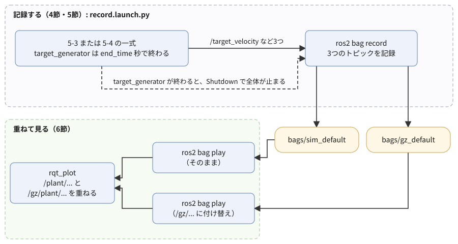
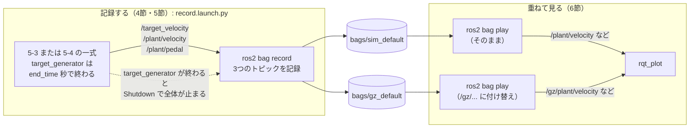

# フェーズ6-1 手順書: 記録して見直す（`ros2 bag` と `rqt_plot`）

[`docs/learning_plan.md`](learning_plan.md) フェーズ6の6-1（idea_origin.md ステップ4）に対応する。フェーズ5-3・5-4で動かした車両シミュレーションのトピックを `ros2 bag` で記録し、後から再生して `rqt_plot` で見直す。記録を決めた時間で自動的に終わらせる仕組みをlaunchに足し、最後に、5-3と5-4の記録を同時に再生して、1つのグラフに重ねて比べる。

- 想定環境: WSL2 + Ubuntu 24.04 + ROS2 Jazzy
- 前提: フェーズ5-3（[`docs/phase5_3_launch.md`](phase5_3_launch.md)。`vehicle_sim.launch.py` と `target_generator` が動く）と、フェーズ5-4（[`docs/phase5_4_gazebo_plant.md`](phase5_4_gazebo_plant.md)。`gazebo_plant.launch.py` が動く）
- 所要目安: 1〜2コマ
- 言語: Python（launchもPython形式）

> **進め方**: 2節で、手で記録して再生する流れをひととおり試す。3節で、再生した値を `rqt_plot` で見直す。4節で、記録を決めた時間で終わらせる仕組みを作り、5節で5-4の一式も同じ方法で記録する。6節で、2つの記録を重ねて比べる。サンプルは学習の手がかりとして最小限に書いたもので、公式チュートリアルの転載ではない。コードはこの手順書の作成時に、使い捨ての環境でビルドし、記録・再生を実行して確かめた（Gazeboは画面なしで起動したので、画面の見え方と、`rqt_plot` のグラフは未確認）。出力が違う場合は、実機の表示を優先する。

> **実行環境が無くても読めるように**: 実行する手順の直後には「期待する結果」として、表示される内容の例とその読み方を載せている。表示の出どころは次のとおり。`ros2 bag record`・`ros2 bag info`・`ros2 bag play` の表示、2-3節の `ros2 topic echo` の表示、4-5節のビルドと `--show-args` の表示、4-5節と5節のlaunchのログ（5節はGazeboを画面なしで起動）、6節の `ros2 node list`（`rqt_plot` は画面なしで起動）は、使い捨ての環境で実際に実行した表示で、時刻・パス・メッセージの数は実行ごとに異なる（ログは抜粋）。3節と6節の `rqt_plot` の画面の様子は、`rqt_plot` のソースと、記録から読み出した数値から筆者が想定したもの。

## 0. 学習目標と完了条件

1. `ros2 bag record` でトピックを記録し、`ros2 bag info` で中身を確かめ、`ros2 bag play` で再生できる。
2. 再生した値を `rqt_plot` で描き、軸の範囲を決めて画像に保存できる。
3. あるノードが終わったらlaunch全体を止める仕組み（`on_exit=Shutdown()`）を使い、決めた時間で記録を終わらせられる。
4. 2つの記録を、トピック名を付け替えて同時に再生し、1つのグラフに重ねて比べられる。

完了条件: `record.launch.py` で5-3と5-4の一式をそれぞれ記録し（決めた時間で自動的に終わる）、2つの記録を重ねたグラフで、5-4の7節の表の違い（5-4は目標10 m/sを少し行き過ぎる、落ち着いたペダルが0.54ではなくほぼ0）を目で確かめる。

## 1. 全体像

フェーズ5-4の7節では、自作のプラント（5-3）とGazeboの物理（5-4）の追従の違いを、表の数字で比べた。同じ違いを、グラフに重ねて目で見たい。ところが、これまでのやり方では難しい。

- `rqt_plot` は、今届いている値を描くだけで、閉じると消える。後から同じ動きを見直すには、もう一度シミュレーションを最初から動かすしかない。
- 5-3と5-4は、どちらも `/plant/velocity` などの同じトピック名を使う。同時に動かすと値が混ざるうえ、Gazeboも動かすので重い。

そこで、動かしたときのトピックを**記録**しておき、後から**再生**する。ROS2では、`ros2 bag`（rosbag2）がこの役を担う。記録（bagと呼ぶ）は、トピックに流れたメッセージを、届いた時刻と一緒にファイルへ書き込んだもので、再生すると、同じトピックに同じ間隔でメッセージが流れる。再生するときにトピック名を付け替えれば、2つの記録を同時に流しても混ざらない。



<details>
<summary>同じ図（mermaid版）</summary>



</details>

記録の置き場所は、この手順書では `~/work/ros2MinimalPhysicalAi/ws/bags/` とする（記録1回ごとに、この下にフォルダが1つできる）。

## 2. 手で記録して、再生する

### 2-1. 記録する（`ros2 bag record`）

まず、5-3の一式をGazeboなしで起動し、別のターミナルで記録する。

```bash
# T1
ros2 launch learn_bringup vehicle_sim.launch.py gazebo:=false

# T2
mkdir -p ~/work/ros2MinimalPhysicalAi/ws/bags

cd ~/work/ros2MinimalPhysicalAi/ws/bags

ros2 bag record -o manual --topics /target_velocity /plant/velocity /plant/pedal
```

**期待する結果**（T2の分。時刻は実行ごとに変わる）:

```text
[INFO] [1790434574.581064313] [rosbag2_recorder]: Press SPACE for pausing/resuming
[INFO] [1790434574.581122789] [rosbag2_recorder]: Event publisher thread: Started
[INFO] [1790434574.586045533] [rosbag2_recorder]: Starting recording to 'manual'
[INFO] [1790434574.588808759] [rosbag2_recorder]: Listening for topics...
[INFO] [1790434574.588848770] [rosbag2_recorder]: Recording...
[INFO] [1790434574.588903585] [rosbag2_recorder]: Topics discovery started.
[INFO] [1790434576.600271878] [rosbag2_recorder]: Subscribed to topic '/plant/velocity'
[INFO] [1790434576.676028527] [rosbag2_recorder]: Subscribed to topic '/target_velocity'
[INFO] [1790434576.679807976] [rosbag2_recorder]: Subscribed to topic '/plant/pedal'
[INFO] [1790434576.679855334] [rosbag2_recorder]: All requested topics are subscribed. Stopping discovery...
[INFO] [1790434576.679882295] [rosbag2_recorder]: Topics discovery stopped.
```

- `-o manual` は、記録を書き出すフォルダの名前。**まだ無い名前**にする（同じ名前のフォルダがあると、上書きせずにエラーで止まる）。
- `--topics` の後ろに、記録するトピックを並べる。`Subscribed to topic` の行が3つ出て、`All requested topics are subscribed` と出れば、3つとも記録が始まっている。3つの `Subscribed` の行の順は、実行ごとに変わる。
- `Press SPACE for pausing/resuming` のとおり、T2でスペースキーを押すと、記録を一時停止・再開できる。

T1のログで、目標が10 → 5 → 0 m/sと切り替わるのを待ち（起動から約90秒）、**T2 → T1の順に** `Ctrl+C` で止める。記録を先に止めるのは、ノードが止まっていく途中の値を記録に入れないためである。

**期待する結果**（T2で `Ctrl+C` を押した後の分）:

```text
[INFO] [1790434677.925370541] [rosbag2_recorder]: Pausing recording.
[INFO] [1790434677.925553628] [rosbag2_cpp]: Writing remaining messages from cache to the bag. It may take a while
[INFO] [1790434677.930076100] [rosbag2_recorder]: Recording stopped
[INFO] [1790434677.931254377] [rosbag2_recorder]: Event publisher thread: Exited
```

`Recording stopped` が出てプロンプトに戻れば、記録はファイルに書き終わっている。

### 2-2. 中身を確かめる（`ros2 bag info`）

```bash
# T2
ros2 bag info manual
```

**期待する結果**（数値は記録した長さによって変わる）:

```text

Files:             manual_0.mcap
Bag size:          862.6 KiB
Storage id:        mcap
ROS Distro:        jazzy
Duration:          101.311076824s
Start:             Sep 26 2026 23:56:16.606765279 (1790434576.606765279)
End:               Sep 26 2026 23:57:57.917842103 (1790434677.917842103)
Messages:          14803
Topic information: Topic: /plant/pedal | Type: std_msgs/msg/Float64 | Count: 4624 | Serialization Format: cdr
                   Topic: /plant/velocity | Type: std_msgs/msg/Float64 | Count: 9254 | Serialization Format: cdr
                   Topic: /target_velocity | Type: std_msgs/msg/Float64 | Count: 925 | Serialization Format: cdr
Service:           0
Service information:
```

| 行 | 読み方 |
|---|---|
| `Files`・`Storage id` | 記録は、フォルダ `manual/` の中の `manual_0.mcap` に入っている。MCAPは、Jazzyの `ros2 bag` が既定で使うファイルの形式。フォルダには、中身の一覧を書いた `metadata.yaml` もある |
| `Duration` | 最初のメッセージから最後のメッセージまでの時間 |
| `Count` | トピックごとのメッセージの数。約93秒の記録で、`/plant/velocity` は約9千（`vehicle_plant` が100 Hzで送る）、`/plant/pedal` は約4千6百（`pi_controller` が50 Hz）、`/target_velocity` は約9百（`target_generator` が10 Hz）で、各ノードの周期とおおよそ合う |

> **記録の時刻は、PCの現在時刻**: `ros2 bag record` は、メッセージが届いた時刻を、PCの時計（現在時刻）で書き込む。フェーズ5-1の9節の表の「ログの時刻が、途中で数秒飛ぶ」のように、記録の途中でPCの時計が時刻合わせで進められると、その分だけ `Duration` が実際の長さより長くなり、再生したときにも同じ長さの「間」があく。上の例の `Duration`（101.3秒）も、実際に記録した時間（約93秒）より長い。形を見比べるには困らないが、フェーズ6-3で時間を使う指標（整定時間など）を計算するときには、この点に気をつける。

### 2-3. 再生する（`ros2 bag play`）

再生する間は、**一式を止めたままにしておく**（2-1節で止めたもの）。一式が動いていると、再生したメッセージと、ノードが今送っているメッセージが、同じトピックに混ざる。

```bash
# T1
ros2 topic echo /target_velocity --field data

# T2
ros2 bag play manual
```

**期待する結果**（T1の分の先頭。区切りの `---` を挟んで、値が1つずつ流れる）:

```text
0.0
---
0.0
---
```

**期待する結果**（T2の分）:

```text
[INFO] [1790434712.993876295] [rosbag2_player]: Set rate to 1
[INFO] [1790434713.001247119] [rosbag2_player]: Adding keyboard callbacks.
[INFO] [1790434713.001299693] [rosbag2_player]: Press SPACE for Pause/Resume
[INFO] [1790434713.001331119] [rosbag2_player]: Press CURSOR_RIGHT for Play Next Message
[INFO] [1790434713.001359049] [rosbag2_player]: Press CURSOR_UP for Increase Rate 10%
[INFO] [1790434713.001386973] [rosbag2_player]: Press CURSOR_DOWN for Decrease Rate 10%
[INFO] [1790434713.002710515] [rosbag2_player]: Playback until timestamp: -1
```

- T1には、記録したときと同じように、`0.0` と区切りの `---` が並んだ後、約10秒後から `10.0`、約50秒後から `5.0` が流れる。ノードは1つも動いていないのに、トピックに値が流れている。
- 最後まで再生すると、T2は何も表示せずにプロンプトへ戻る。途中で止めるときは `Ctrl+C`。
- 再生中にT2でスペースキーを押すと一時停止・再開、上下の矢印キーで再生の速さを10%ずつ変えられる。

よく使うオプション:

| オプション | 意味 |
|---|---|
| `-r 2` | 2倍の速さで再生する（`--rate`） |
| `--start-offset 45` | 記録の先頭から45秒の位置から再生する（このオプションは6節でも使う） |
| `-l` | 最後まで再生したら、先頭から繰り返す（`--loop`） |
| `-p` | 一時停止の状態で始める（`--start-paused`。スペースキーで再生を始める） |

> 課題1: `ros2 bag play manual -r 5 --start-offset 45` で再生し、T1の `5.0` が、目標を5 m/sに下げた直後から流れ始めることと、再生が約1/5の時間で終わることを確かめる（記録の中の時刻は、記録を始めた時点の遅れと、PCの時計の飛び（2-2節の注記）の分だけずれるので、`5.0` が流れ始める位置には数秒の幅がある）。

## 3. `rqt_plot` で見直す

### 3-1. 再生した値を描く

フェーズ5-3の4-3節と同じコマンドで `rqt_plot` を開き、その後で再生を始める。

```bash
# T1
ros2 run rqt_plot rqt_plot /target_velocity/data /plant/velocity/data /plant/pedal/data

# T2
ros2 bag play manual
```

**期待する結果**: `rqt_plot` のウィンドウに、フェーズ5-3の4-3節と同じ形の3本の線が描かれていく。一式を動かしていないのに、記録したときと同じグラフになる。

横軸は、`rqt_plot` を起動してからの秒数である（`rqt_plot` のソース `rosplot.py` では、メッセージに時刻の欄（`header`）が無い型は、届いた時刻で横軸を決める。[`std_msgs/msg/Float64`](https://github.com/ros2/common_interfaces/blob/jazzy/std_msgs/msg/Float64.msg) には時刻の欄が無い）。そのため、`rqt_plot` を開いてから再生を始めるまでの時間の分だけ、グラフは右にずれる。

### 3-2. 軸の範囲を決めて、画像に保存する

`rqt_plot` のウィンドウには、上の段に `rqt_plot` 自身の部品が、グラフの近くに、グラフを描いている部品（Pythonのグラフ描画ライブラリのmatplotlib）の道具のボタンが並ぶ。

| 部品 | 使い方 |
|---|---|
| `autoscroll`（チェックボックス） | 外すと、横軸が新しい値に合わせて動かなくなる。拡大して見たいときに外す |
| 一時停止のボタン（`pause plot`） | 描くのを止める（再生は止まらない） |
| 虫眼鏡のボタン（Zoom） | ドラッグで囲んだ範囲を拡大する |
| 軸の設定のボタン（Figure options。折れ線グラフの形のアイコン） | 横軸・縦軸の最小値と最大値を、数で指定する。たとえば縦軸を−1.2〜11にすると、ペダルと速度の線を両方読みやすい |
| 保存のボタン（フロッピーディスクの形のアイコン） | 今のグラフを画像（PNGなど）に保存する |
| 家の形のボタン（Home） | 拡大する前の表示に戻す |

**期待する結果**: 保存のボタンでファイル名を指定すると、そのときに見えているグラフが、そのままの範囲で画像になる。

> **描画の部品が違う場合**: `rqt_plot` は、PyQtGraphというライブラリが入っていればそちらを、無ければmatplotlibを使って描く（`rqt_plot` のソースの `data_plot/__init__.py`）。この手順書の作成に使った環境にはPyQtGraphが無く、matplotlibで描かれる。PyQtGraphで描かれる場合は、ボタンの並びが上の表と違う（グラフの上で右クリックすると、軸の範囲の指定や画像の書き出しのメニューが出る）。どちらで描くかは、`rqt_plot` の設定（プラグインの右上の歯車のボタン）から選べる。

> 課題2: 2-1節で取った記録（`manual`）を再生しながら、目標を5 m/sに下げた前後（記録の45〜60秒ごろ。課題1と同じく数秒の幅がある）だけを拡大し、縦軸を−1.2〜11にそろえた画像を保存する。ブレーキ（ペダルが−1）を踏んでいる時間が、加速でアクセル（+1）を踏んでいた時間よりずっと短いことを、画像で確かめる（フェーズ5-3の4-3節の表）。

## 4. 決めた時間で記録を終わらせる

2節では、記録を `Ctrl+C` で止めた。これだと、止めた時刻が毎回ずれて、記録の長さがそろわない。フェーズ6-3で条件ごとの記録を比べるときは、同じ長さで記録したい。

`ros2 bag record` 自身には、「何秒たったら止まる」という指定が無い（`-d` は、記録のファイルを一定の時間ごとに分けるオプションで、記録は止まらない）。そこで、次の2つを組み合わせる。

1. `target_generator` に、終わる時刻 `end_time` を持たせる。目標の階段を送り終えたら、ノードが自分で終わる（4-1節）。
2. launchに、「`target_generator` が終わったら、launch全体を止める」という決まりを足す（4-2節）。全体には記録（`ros2 bag record`）も含まれるので、記録もそこで止まる。

### 4-1. `target_generator` に終わる時刻を持たせる

フェーズ5-3の2-2節の `target_node.py` を、次のように書き換える（変わるのは、`end_time` の宣言と検証、`on_timer` の最初の4行、`on_params` の拒否するパラメータの名前、コメント）。

ファイル: `ws/src/learn_py/learn_py/target_node.py`

<!-- file: ws/src/learn_py/learn_py/target_node.py -->
```python
import rclpy
from rcl_interfaces.msg import SetParametersResult
from rclpy.clock import Clock, ClockType
from rclpy.executors import ExternalShutdownException
from rclpy.node import Node
from std_msgs.msg import Float64


# 階段の時刻と値の配列が正しいかを調べ、問題があれば理由の文字列を、無ければ None を返す。
def check_steps(times, values):
    if len(times) == 0 or len(times) != len(values):
        return 'step_times and step_values must have the same, non-zero length'
    if times[0] < 0.0 or any(a >= b for a, b in zip(times, times[1:])):
        return 'step_times must be >= 0 and strictly increasing'
    return None


# 起動からの経過時間に応じて階段状に変わる目標速度を、target_velocity へ送るノード。
# 切り替えの時刻と値は、起動時のパラメータ（配列）で決める。end_time 秒たったら終わる。
class TargetGenerator(Node):
    # 配列のパラメータを宣言して検証し、時計・Publisher・タイマーを用意する。
    def __init__(self):
        super().__init__('target_generator')
        self.declare_parameter('step_times', [10.0, 50.0, 80.0])
        self.declare_parameter('step_values', [10.0, 5.0, 0.0])
        self.declare_parameter('period', 0.1)
        self.declare_parameter('end_time', 0.0)
        self.step_times = list(self.get_parameter('step_times').value)
        self.step_values = list(self.get_parameter('step_values').value)
        self.end_time = self.get_parameter('end_time').value
        error = check_steps(self.step_times, self.step_values)
        if error is None and self.end_time < 0.0:
            error = 'end_time must be >= 0 (0 means never end)'
        if error is not None:
            raise ValueError(error)

        self.steady_clock = Clock(clock_type=ClockType.STEADY_TIME)
        self.start = self.steady_clock.now()
        self.current = None
        self.pub = self.create_publisher(Float64, 'target_velocity', 10)
        self.timer = self.create_timer(self.get_parameter('period').value, self.on_timer)
        self.add_on_set_parameters_callback(self.on_params)

    # 経過時間 elapsed 秒での目標速度を返す（最初の切り替えより前は0）。
    def target_at(self, elapsed):
        target = 0.0
        for t, value in zip(self.step_times, self.step_values):
            if elapsed >= t:
                target = value
        return target

    # 周期ごとに今の目標速度を送る。値が変わったときだけログに出す。
    # end_time が正で、その時刻を過ぎたら、ROS2を終わらせて spin から抜ける。
    def on_timer(self):
        elapsed = (self.steady_clock.now() - self.start).nanoseconds * 1e-9
        if self.end_time > 0.0 and elapsed >= self.end_time:
            self.get_logger().info(f'{elapsed:5.1f} s: end_time reached, shutting down')
            rclpy.shutdown()
            return
        target = self.target_at(elapsed)
        msg = Float64()
        msg.data = target
        self.pub.publish(msg)
        if target != self.current:
            self.get_logger().info(f'{elapsed:5.1f} s: target -> {target:.2f} m/s')
            self.current = target

    # 階段と周期と終わる時刻は起動時にだけ決められるので、実行中の変更は拒否する。
    def on_params(self, params):
        for p in params:
            if p.name in ('step_times', 'step_values', 'period', 'end_time'):
                return SetParametersResult(
                    successful=False, reason=f'{p.name} can be set only at startup')
        return SetParametersResult(successful=True)


# エントリポイント（setup.py の entry_points から呼ばれる）。
# ノードを作って spin で回し、Ctrl+C か end_time で終わったら後片付けする。
def main(args=None):
    rclpy.init(args=args)
    node = TargetGenerator()
    try:
        rclpy.spin(node)
    except (KeyboardInterrupt, ExternalShutdownException):
        pass
    finally:
        node.destroy_node()
        rclpy.try_shutdown()
```

**`target_node.py` の変更点の解説**

- **`end_time`**: 既定値は0.0で、0のときは終わらない（フェーズ5-3までと同じ振る舞い）。負の値は、`check_steps` と同じく起動時に `ValueError` で止める。
- **`on_timer` の最初の4行**: 経過時間が `end_time` を過ぎたら、ログを1行出して `rclpy.shutdown()` を呼ぶ。`rclpy.shutdown()` は、このプロセスのROS2を終わらせる関数で、`main` の `rclpy.spin(node)` は、ROS2が終わったことに気づいて戻ってくる。その後は、`Ctrl+C` のときと同じく `finally` で後片付けをして、プロセスが終わる。`main` は変えなくてよい。
- 経過時間は、フェーズ5-3と同じく単調増加する時計で測っているので、PCの時計が飛んでも、終わる時刻は早まらない。

### 4-2. ノードが終わったら、launch全体を止める

フェーズ5-3の `vehicle_sim.launch.py`（3-3節）と、フェーズ5-4の `gazebo_plant.launch.py`（6-2節）の2つのファイルで、`target_generator` の `Node(...)` に1行足し、`import` の行に `Shutdown` を足す。

<!-- snippet: launch_target_on_exit -->
```python
from launch.actions import DeclareLaunchArgument, IncludeLaunchDescription, Shutdown
```

```python
        Node(
            package='learn_py', executable='target_generator', name='target_generator',
            output='screen', parameters=[params_file],
            on_exit=Shutdown(),
        ),
```

- `on_exit=` は、そのプロセスが終わったときに実行する動作を指定する。`Shutdown()` は「launch全体を止める」動作で、launchは、まだ動いているプロセスすべてに割り込み（SIGINT）を送って止める。
- これは、フェーズ4では扱わなかった「イベントハンドラ」（何かが起きたときに、決めた動作をする仕組み）の簡単な書き方である。同じことを、`RegisterEventHandler(OnProcessExit(target_action=ノード, on_exit=[Shutdown()]))` と書くこともできる（公式ドキュメントの「Using event handlers」。10節）。
- 5-3・5-4のYAML（`vehicle_sim.yaml`・`gazebo_plant.yaml`）には `end_time` を書いていないので、既定値の0のまま、`target_generator` は終わらない。そのため、この1行を足しても、5-3・5-4の手順はこれまでどおりに動く。`target_generator` が起動時のエラー（フェーズ5-3の3-2節）で止まった場合は、全体が止まる。

### 4-3. 記録用のYAML

5-3・5-4のYAMLを写して、`target_generator` に `end_time` を足した、記録用のYAMLを作る。

```bash
cd ~/work/ros2MinimalPhysicalAi/ws/src/learn_bringup/config

cp vehicle_sim.yaml vehicle_sim_record.yaml

cp gazebo_plant.yaml gazebo_plant_record.yaml
```

写したファイルの `target_generator` の部分に、1行ずつ足す。

`vehicle_sim_record.yaml`（`target_generator` の部分）:

<!-- snippet: vehicle_sim_record_yaml -->
```yaml
target_generator:
  ros__parameters:
    step_times: [10.0, 50.0, 80.0]
    step_values: [10.0, 5.0, 0.0]
    end_time: 100.0
```

`gazebo_plant_record.yaml`（`target_generator` の部分）:

<!-- snippet: gazebo_plant_record_yaml -->
```yaml
target_generator:
  ros__parameters:
    step_times: [15.0, 55.0, 85.0]
    step_values: [10.0, 5.0, 0.0]
    end_time: 105.0
```

どちらも、目標を0にしてから20秒後に終わる。ファイルの先頭のコメントの行も、「記録用」と分かるように書き換えておくとよい。

### 4-4. 記録用のlaunch（`launch/record.launch.py`）

ファイル: `ws/src/learn_bringup/launch/record.launch.py`

<!-- file: ws/src/learn_bringup/launch/record.launch.py -->
```python
from launch import LaunchDescription
from launch.actions import DeclareLaunchArgument, ExecuteProcess, IncludeLaunchDescription
from launch.launch_description_sources import PythonLaunchDescriptionSource
from launch.substitutions import LaunchConfiguration, PathJoinSubstitution
from launch_ros.substitutions import FindPackageShare


# 5-3（vehicle_sim）か5-4（gazebo_plant）の一式を、記録用のYAMLで起動し、
# 目標・速度・ペダルを ros2 bag record で記録する。
def generate_launch_description():
    scenario = LaunchConfiguration('scenario')
    share = FindPackageShare('learn_bringup')
    scenario_launch = PathJoinSubstitution([share, 'launch', [scenario, '.launch.py']])
    record_params = PathJoinSubstitution([share, 'config', [scenario, '_record.yaml']])
    return LaunchDescription([
        DeclareLaunchArgument(
            'scenario', default_value='vehicle_sim',
            description='記録する一式（vehicle_sim または gazebo_plant）'),
        DeclareLaunchArgument(
            'bag', description='記録を書き出すフォルダ（まだ無い名前にする）'),
        DeclareLaunchArgument(
            'params_file', default_value=record_params,
            description='各ノードのパラメータを書いたYAMLファイル（既定は scenario の名前_record.yaml）'),
        IncludeLaunchDescription(
            PythonLaunchDescriptionSource(scenario_launch),
            launch_arguments={
                'params_file': LaunchConfiguration('params_file'),
                'gazebo': 'false',
            }.items(),
        ),
        ExecuteProcess(
            cmd=['ros2', 'bag', 'record', '-o', LaunchConfiguration('bag'),
                 '--topics', '/target_velocity', '/plant/velocity', '/plant/pedal'],
            output='screen',
        ),
    ])
```

**`record.launch.py` の解説**

役割は、「5-3か5-4の一式を記録用のYAMLで起動し、同時に `ros2 bag record` も起動する」こと。止めるのは、4-2節で一式の側に足した `on_exit=Shutdown()` の役目で、このファイルには止める仕組みを書いていない。

| 部分 | 何をしているか |
|---|---|
| `[scenario, '.launch.py']` | 置換（`LaunchConfiguration`）と文字列を並べたリストは、つながって1つの文字列になる（フェーズ5-4の6-2節の `gz_args` と同じ）。`scenario:=gazebo_plant` なら `gazebo_plant.launch.py` と `gazebo_plant_record.yaml` になる。ファイル名の付け方をそろえておくと、引数1つで両方を切り替えられる |
| `DeclareLaunchArgument('bag', ...)` | 既定値の無い引数。起動するときに `bag:=...` を必ず指定する（指定しないとエラーで止まる）。記録のフォルダの名前を、毎回自分で決めるため |
| `DeclareLaunchArgument('params_file', ...)` | 既定は記録用のYAML。条件を変えた記録を取るときは、別のYAMLに差し替える（この節の末尾の課題3） |
| `launch_arguments={... 'gazebo': 'false'}` | 取り込む側の引数を渡す。`gazebo` は `vehicle_sim.launch.py` の引数で、記録では表示用のGazeboを外す。`gazebo_plant.launch.py` にはこの引数が無いが、使われない値を渡しても問題はない |
| `ExecuteProcess(cmd=['ros2', 'bag', 'record', ...])` | ROS2のノードではないコマンドを、launchから起動する。`ros2 bag record` も、ほかのプロセスと同じく、`Shutdown` で割り込みを受けて止まる |

> 課題3（フェーズ6-3への準備）: `vehicle_sim_record.yaml` を写して `slow_brake_record.yaml` を作り、`vehicle_plant` の `tau_brake` を1.0にする（フェーズ5-3の4-5節と同じ条件）。この手順書の4-5節の `record.launch.py` の起動のコマンドを、`ros2 launch learn_bringup record.launch.py params_file:=$HOME/work/ros2MinimalPhysicalAi/ws/src/learn_bringup/config/slow_brake_record.yaml bag:=$HOME/work/ros2MinimalPhysicalAi/ws/bags/slow_brake` として記録する（`~` ではなく `$HOME` と書く理由は、フェーズ5-3の4-5節）。新しいYAMLなので、記録の前にビルドし直す。この記録は、フェーズ6-3で比べるのに使う。

### 4-5. ビルドして、記録する

`learn_bringup` の `CMakeLists.txt` は変えなくてよい（`launch/`・`config/` の中の新しいファイルも、フェーズ4の3-3節の `install(DIRECTORY ...)` でインストールされる。新しいファイルなので、ビルドは要る）。

```bash
cd ~/work/ros2MinimalPhysicalAi/ws

colcon build --symlink-install --packages-select learn_py learn_bringup

source install/setup.bash

ros2 launch learn_bringup record.launch.py --show-args
```

**期待する結果**（`--show-args` の分。ビルドは、2つのパッケージについて `Finished` が出て `Summary: 2 packages finished` で終われば成功）:

```text
Arguments (pass arguments as '<name>:=<value>'):

    'scenario':
        記録する一式（vehicle_sim または gazebo_plant）
        (default: 'vehicle_sim')

    'bag':
        記録を書き出すフォルダ（まだ無い名前にする）

    'params_file':
        各ノードのパラメータを書いたYAMLファイル（既定は scenario の名前_record.yaml）
        (default: PathJoinSubstitution('FindPackageShare(pkg='learn_bringup'), 'config', LaunchConfig('scenario') + '_record.yaml''))
```

- `bag` には `(default: ...)` の行が無い。既定値の無い、必ず指定する引数である。
- フェーズ5-3の3-4節と違い、取り込んだlaunchの引数（`gazebo` など）は並ばない。取り込むファイルの名前が `scenario` の値で決まり、起動するまでどのファイルか分からないためである。

記録する。

```bash
ros2 launch learn_bringup record.launch.py bag:=$HOME/work/ros2MinimalPhysicalAi/ws/bags/sim_default
```

**期待する結果**（抜粋。`vehicle_plant`・`pi_controller` のログは省いた。時刻・pid・パスは実行ごとに変わる。長い行は途中で切っている）:

```text
[INFO] [vehicle_plant-1]: process started with pid [7338]
[INFO] [pi_controller-2]: process started with pid [7339]
[INFO] [target_generator-3]: process started with pid [7340]
[INFO] [ros2-4]: process started with pid [7341]
[ros2-4] [INFO] [1790434767.753588853] [rosbag2_recorder]: Starting recording to '.../ws/bags/sim_default'
[target_generator-3] [INFO] [1790434767.834303074] [target_generator]:   0.1 s: target -> 0.00 m/s
...
[ros2-4] [INFO] [1790434767.908987699] [rosbag2_recorder]: All requested topics are subscribed. Stopping discovery...
...
[target_generator-3] [INFO] [1790434780.712804616] [target_generator]:  10.1 s: target -> 10.00 m/s
[target_generator-3] [INFO] [1790434823.612921663] [target_generator]:  50.0 s: target -> 5.00 m/s
[target_generator-3] [INFO] [1790434856.512685662] [target_generator]:  80.0 s: target -> 0.00 m/s
[target_generator-3] [INFO] [1790434876.512332900] [target_generator]: 100.0 s: end_time reached, shutting down
[INFO] [target_generator-3]: process has finished cleanly [pid 7340]
[INFO] [launch]: process[target_generator-3] was required: shutting down launched system
[INFO] [ros2-4]: sending signal 'SIGINT' to process[ros2-4]
[INFO] [pi_controller-2]: sending signal 'SIGINT' to process[pi_controller-2]
[INFO] [vehicle_plant-1]: sending signal 'SIGINT' to process[vehicle_plant-1]
[ros2-4] [INFO] [1790434876.672832993] [rosbag2_recorder]: Recording stopped
[INFO] [vehicle_plant-1]: process has finished cleanly [pid 7338]
[INFO] [pi_controller-2]: process has finished cleanly [pid 7339]
[INFO] [ros2-4]: process has finished cleanly [pid 7341]
```

- `ros2 bag record` は、`ros2-4` という名前のプロセスとして起動する（`ros2` コマンドとして起動したため）。
- 100秒たつと、`target_generator` が `end_time reached` を出して終わり（`finished cleanly`）、launchが `was required: shutting down launched system`（止めることになっていたプロセスが終わったので、全体を止める）と出して、残りのプロセスに割り込みを送る。記録は `Recording stopped` で閉じられ、launchもプロンプトに戻る。
- 手で `Ctrl+C` を押したときと違い、Pythonのノードに `Traceback` は出ず、すべて `finished cleanly` で終わる。フェーズ5-3の4-4節で見た `Traceback` は、端末とlaunchから割り込みが2回届いたためだった。ここでは割り込みがlaunchから1回だけ届くので、後片付けが中断されない。
- ログの時刻は、途中で数秒飛ぶことがある（2-2節の注記）。この例でも、`10.1 s` の行から `50.0 s` の行までのログの時刻は約43秒進んでいる。`target_generator` の経過時間（行の先頭の秒数）は単調増加する時計で測っているので、飛ばない。

終わったら、2-2節と同じく `ros2 bag info` で中身を確かめられる。何度記録しても、目標の切り替えと記録の長さがそろう。

## 5. 5-4の一式も記録する

同じlaunchで、`scenario:=gazebo_plant` を指定する。Gazeboのウィンドウが開く。

```bash
ros2 launch learn_bringup record.launch.py scenario:=gazebo_plant bag:=$HOME/work/ros2MinimalPhysicalAi/ws/bags/gz_default
```

**期待する結果**（抜粋。止まる部分だけを載せる）:

```text
[target_generator-5] [INFO] [1790434080.419036712] [target_generator]: 105.1 s: end_time reached, shutting down
[INFO] [target_generator-5]: process has finished cleanly [pid 6325]
[INFO] [launch]: process[target_generator-5] was required: shutting down launched system
[INFO] [ros2-6]: sending signal 'SIGINT' to process[ros2-6]
[INFO] [pi_controller-4]: sending signal 'SIGINT' to process[pi_controller-4]
[INFO] [gz_plant-3]: sending signal 'SIGINT' to process[gz_plant-3]
[INFO] [parameter_bridge-2]: sending signal 'SIGINT' to process[parameter_bridge-2]
[INFO] [gazebo-1]: sending signal 'SIGINT' to process[gazebo-1]
[INFO] [parameter_bridge-2]: process has finished cleanly [pid 6321]
[INFO] [ros2-6]: process has finished cleanly [pid 6326]
[INFO] [pi_controller-4]: process has finished cleanly [pid 6324]
[INFO] [gz_plant-3]: process has finished cleanly [pid 6323]
[ERROR] [gazebo-1]: process[gazebo-1] failed to terminate '5' seconds after receiving 'SIGINT', escalating to 'SIGTERM'
[INFO] [gazebo-1]: sending signal 'SIGTERM' to process[gazebo-1]
[ERROR] [gazebo-1]: process has died [pid 6320, exit code -15, cmd '...'].
```

- 105秒たつと、4-5節と同じ流れで全体が止まり、Gazeboのウィンドウも閉じる。
- Gazeboは、割り込み（SIGINT）を受けてから5秒以内に止まらなかったので、launchが、より強い止める合図（SIGTERM）を送り直している。`[ERROR]` の行が出るが、記録は先に閉じられているので問題ない。
- ただし、Gazeboの本体（`gz sim` のサーバー）が、この後も裏で動き続けることがある。8節の表の「記録の後もGazeboが残る」で確かめる。
- PCが重い場合は、フェーズ5-4の6-3節の「PCが重い場合」と同じく、`gz_args` に `-s`（画面なし）を足して記録できる。`record.launch.py` に指定した `gz_args:=...` は、取り込んだ `gazebo_plant.launch.py` にそのまま渡る（この手順書の作成時の確認は、この方法で行った）。

> **5-4の記録の時刻**: 5-4の一式は、シミュレーション時刻で動いている（フェーズ5-4の5節）。一方、`target_generator` は現実の時間で目標を切り替え、`ros2 bag record` も現実の時刻で記録する。Gazeboの計算がPCの負荷で現実より遅れている（RTFが100%を下回る）と、記録の中の車両の動きは、現実の時間で見て少しゆっくりになる。この手順書では、記録を現実の時刻のまま扱う（`ros2 bag record` には、シミュレーション時刻で記録する `--use-sim-time` もある）。

## 6. 2つの記録を重ねる

4-5節の `sim_default`（5-3）と、5節の `gz_default`（5-4）を、同時に再生して1つのグラフに重ねる。5-4の記録のトピックは、再生するときに `/gz/...` に付け替えて、5-3と混ざらないようにする。

重ねる前に、予想しておく。フェーズ5-4の7節の表から、次の2点は、グラフのどこにどう表れるか。

- 5-4は、目標10 m/sを少し行き過ぎる。
- 目標10 m/sで落ち着いたときのペダルは、5-3が0.54、5-4がほぼ0。

ターミナルを3つ使う。T1で先に `rqt_plot` を開き、その後でT2とT3の再生を、なるべく続けて始める。

```bash
# T1
ros2 run rqt_plot rqt_plot /target_velocity/data /plant/velocity/data /gz/plant/velocity/data /plant/pedal/data /gz/plant/pedal/data

# T2
cd ~/work/ros2MinimalPhysicalAi/ws/bags

ros2 bag play sim_default

# T3
cd ~/work/ros2MinimalPhysicalAi/ws/bags

ros2 bag play gz_default --start-offset 5 --remap /target_velocity:=/gz/target_velocity /plant/velocity:=/gz/plant/velocity /plant/pedal:=/gz/plant/pedal __node:=player_gz
```

- `--start-offset 5`: 5-4の記録は、目標の最初の切り替えが15秒（5-3は10秒）なので、先頭の5秒を飛ばして、切り替えの時刻をそろえる。
- `--remap 元の名前:=新しい名前 ...`: 再生するトピックの名前を付け替える。最後の `__node:=player_gz` は、トピックではなく、再生するノード自身の名前を付け替える指定で、2つの再生のノードの名前（どちらも既定は `rosbag2_player`）が重ならないようにする。
- `/gz/target_velocity` は、`--start-offset` で5-3とそろえてあるので、グラフには描かない。

再生している間に、別のターミナルでノードの一覧を見ると、再生のノードが2つと、`rqt_plot` のノードが並ぶ。

```bash
# T4
ros2 node list
```

**期待する結果**:

```text
/player_gz
/rosbag2_player
/rqt_gui_py_node_8838
```

`rqt_gui_py_node_` の後ろの数字は、実行ごとに変わる（`rqt_plot` のプロセスの番号）。

**期待する結果**（`rqt_plot` の分。この手順書の作成時に取った2つの記録から読み出した数値をもとに、筆者が想定した形）: 目標を10 m/sにした後、2本の速度の線は最初の2秒ほどはほぼ重なって上がる。その後、5-3の線は曲がり始め（速度に比例する抵抗が効いてくる）、約8秒で9.3 m/sになってから、20秒ほどかけてゆっくり10に近づく。5-4の線は、ほぼまっすぐ上がり続け、約6秒で10を少し超え（最高10.3 m/s）、すぐ10に戻る。ペダルの線は、5-3が+1から下がって+0.54の高さで平らになり、5-4は約5秒で+1から一気に下がって0の付近で平らになる。目標5 m/sに下げた直後は、5-4の速度の線だけが5を少し下回る（最低4.5 m/s）。

- T2とT3を手で続けて始めるので、2つの記録には1秒ほどの時間のずれが残る。形を見比べるには十分で、正確に比べるのは、フェーズ6-3で数にしてから行う。
- 5節の注記のとおり、5-4の記録は、PCの負荷によって車両の動きが少しゆっくりになっていることがある。目標の切り替えは現実の時間で行っているので、切り替えの位置はずれず、切り替えた後の速度の変わり方が、5-3の線よりゆっくりに見える。切り替えの位置が左右にずれる原因は、手で再生を始めるずれ（すぐ上の項目）と、記録ごとに違うPCの時計の飛び（2-2節の注記）である。

> 課題4: 4-4節の末尾の課題3で記録した `slow_brake` を、`/gz/...` の代わりに `/slow/...` に付け替えて、`sim_default` と重ねる。目標を5 m/sに下げたとき、`tau_brake` 1.0の速度の線だけが4 m/s前後まで下がりすぎる様子（フェーズ5-3の4-5節）を確かめる。

## 7. 本フェーズのまとめ

- `ros2 bag record -o フォルダ --topics ...` でトピックを記録し、`ros2 bag info` で中身（長さ・トピックごとの数）を確かめ、`ros2 bag play` で再生できる。再生すると、ノードを動かさずに、記録したときと同じメッセージが同じ間隔で流れる。
- 記録の時刻はPCの現在時刻なので、PCの時計が飛ぶと、記録の長さや再生の間隔にも表れる。
- `rqt_plot` は、再生した値もそのまま描ける。`autoscroll` を外し、軸の範囲を決めて、画像に保存できる。
- launchの `on_exit=Shutdown()` で、あるプロセスが終わったら全体を止められる。`target_generator` に終わる時刻を持たせると、`ros2 bag record` を含めた一式が決めた時間で止まり、同じ長さの記録がそろう。
- `ros2 bag play` の `--remap` でトピック名（と `__node:=` でノード名）を付け替えれば、2つの記録を同時に再生して重ねられる。`--start-offset` で、記録の先頭をそろえられる。

## 8. つまずきやすい点

| 症状 | 確認すること |
|---|---|
| `ros2 bag record` がすぐにエラーで止まる | `-o` のフォルダがすでにある。別の名前にするか、要らない記録のフォルダを消す |
| 記録の `Count` が0のトピックがある | 記録している間に、そのトピックを送るノードが動いていたか。トピック名の綴り |
| 再生した値が、ほかの値と混ざる・ギザギザになる | 再生する前に、同じトピックを送る一式を止めたか（2-3節） |
| `rqt_plot` に線が出ない | `rqt_plot` のトピックの指定が `/トピック名/data` になっているか。付け替えた記録は、付け替えた後の名前（`/gz/...`）で指定する |
| `record.launch.py` が `bag` の指定が無いと言って止まる | `bag:=フォルダ` を指定する（4-4節）。`~` ではなく `$HOME` か絶対パスで書く |
| 決めた時間になっても止まらない | 使っているYAMLに `end_time` があるか（4-3節）。launchの `target_generator` の `Node(...)` に `on_exit=Shutdown()` を足してビルドし直したか（4-2節） |
| 記録の後もGazeboが残る（次に起動したとき、車両が2台ずつ見える・動きがおかしい） | 前回の `gz sim` のサーバーが裏で動き続けている。`pgrep -af "gz sim"` で確かめ、残っていれば `pkill -INT -f "gz sim"` で止める |
| 2つの記録の線が、大きく左右にずれる | T2とT3の再生を続けて始めたか。5-4の記録に `--start-offset 5` を付けたか（6節） |

## 9. 次へ

フェーズ6-2（[`docs/phase6_2_goal.md`](phase6_2_goal.md)）で、時間の代わりに「車両がゴールの地点に着いた」ことをきっかけに記録を終わらせる。その後のフェーズ6-3で、この手順書で取った記録から、行き過ぎ量・整定時間などの指標を計算して、条件ごとに比べる。作成の状況は、学習計画（[`docs/learning_plan.md`](learning_plan.md)）の「手順書一覧」で確かめられる。

## 10. 公式ドキュメント・参考資料

確認状況（2026-09-27）: 公式の3つは、GitHubの原稿（`ros2/ros2_documentation` のjazzyブランチと、`ros2/rosbag2` のjazzyブランチのREADME）が実在することを確認した。`ros2 bag` のオプションは、ローカルの `ros2 bag record -h`・`ros2 bag play -h` で確かめた。`rqt_plot` の横軸と描画の部品の選び方は、ローカルの `rqt_plot` のソース（`/opt/ros/jazzy/lib/python3.12/site-packages/rqt_plot/`）で確かめた。

### 公式

- [Recording and playing back data — ROS 2 Documentation: Jazzy](https://docs.ros.org/en/jazzy/Tutorials/Beginner-CLI-Tools/Recording-And-Playing-Back-Data/Recording-And-Playing-Back-Data.html)（`ros2 bag record`・`info`・`play` の基本）
- [Using event handlers — ROS 2 Documentation: Jazzy](https://docs.ros.org/en/jazzy/Tutorials/Intermediate/Launch/Using-Event-Handlers.html)（`RegisterEventHandler`・`OnProcessExit`・`Shutdown` など、launchのイベントハンドラ）
- [ros2/rosbag2 — README（GitHub、jazzyブランチ）](https://github.com/ros2/rosbag2/tree/jazzy)（`ros2 bag` のオプションの一覧と、記録のファイルの形式）

> 出典: `ros2 bag` と `rqt_plot` の振る舞いは、公式ドキュメント、ローカルのヘルプとソース、使い捨ての環境で実行した結果から、筆者が自分の言葉でまとめたもの。サンプルコード・文章は独自に書いたもの。
