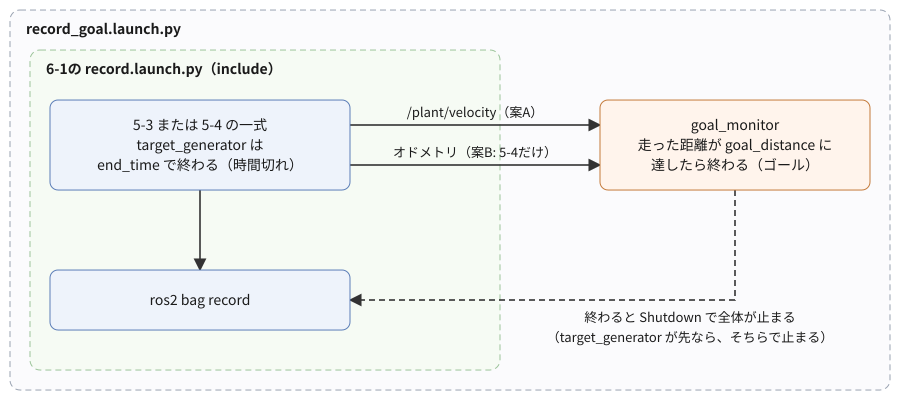
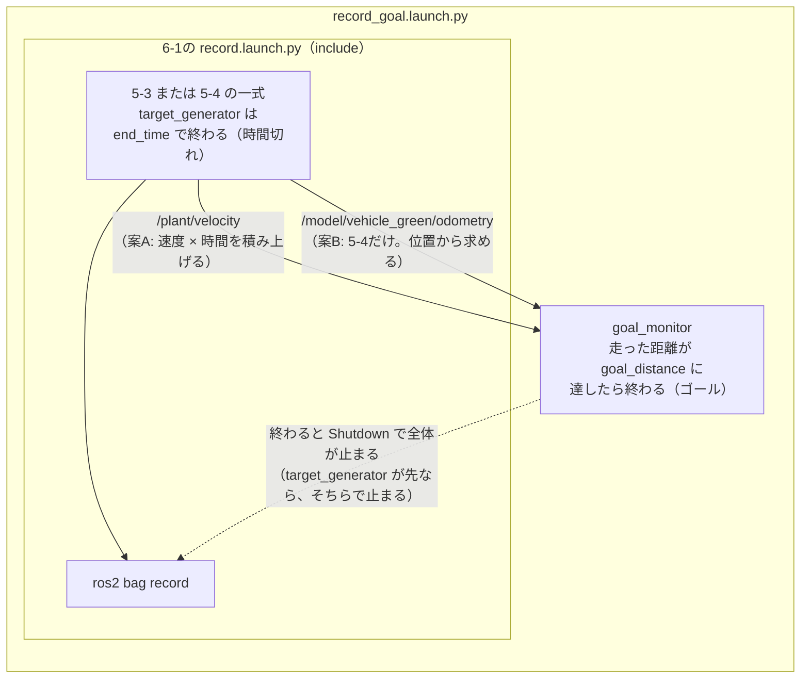

# フェーズ6-2 手順書: 条件で記録を終わらせる（ゴールの見張り）

[`docs/learning_plan.md`](learning_plan.md) フェーズ6の6-2（idea_origin.md ステップ4）に対応する。フェーズ6-1では、決めた時間がたったら記録を終わらせた。この手順書では、「車両がゴールの地点に着いた」ことをきっかけに終わらせる。ゴールに着いたかを判定する見張りのノードを書き、走った距離を求める2つの方法（速度を積み上げる案Aと、位置から求める案B）を、5-3と5-4の一式で試す。

- 想定環境: WSL2 + Ubuntu 24.04 + ROS2 Jazzy
- 前提: フェーズ6-1（[`docs/phase6_1_record.md`](phase6_1_record.md)。`record.launch.py` と記録用のYAMLがあり、`target_generator` に `end_time` を足してある）
- 所要目安: 1コマ
- 言語: Python（launchもPython形式）

> **進め方**: 2節で、走った距離を求める2つの方法を比べる。3節で見張りのノードを書き、4節で、6-1の記録用のlaunchを取り込んだlaunchを作る。5節で5-3の一式を案Aで、6節で5-4の一式を案Bで記録する。7節で、2つの方法の違いが小さかった理由と、それでも案Bを選ぶ理由を考える。サンプルは学習の手がかりとして最小限に書いたもので、公式チュートリアルの転載ではない。コードはこの手順書の作成時に、使い捨ての環境でビルドし、記録を実行して確かめた（Gazeboは画面なしで起動したので、画面の見え方は未確認）。出力が違う場合は、実機の表示を優先する。

> **実行環境が無くても読めるように**: 実行する手順の直後には「期待する結果」として、表示される内容の例とその読み方を載せている。表示の出どころは次のとおり。4-3節のビルドと `--show-args` の表示、5節と6節のlaunchのログ（6節はGazeboを画面なしで起動）、7節の末尾の課題2の `goal_monitor` のログ（作成時には、`-p` で再生を準備し、`goal_monitor` が購読したのを確かめてから、スペースキーの代わりに同じ処理を呼ぶサービス `/rosbag2_player/resume` で再生を進めた）は、使い捨ての環境で実際に実行した表示で、時刻・pid・パス・距離の細部は実行ごとに異なる（ログは抜粋）。

## 0. 学習目標と完了条件

1. 「ゴールに着いた」ことを判定する見張りのノードを書き、条件をきっかけに記録（launch全体）を終わらせられる。
2. 走った距離を、速度を時間で積み上げて求める方法（案A）と、位置から求める方法（案B）の違いと、それぞれの誤差の出どころを説明できる。
3. 時間切れ（フェーズ6-1の `end_time`）とゴールの、早いほうで終わる形を組める。

完了条件: 5-3の一式を案Aで、5-4の一式を案Bで記録し、どちらも走った距離が450 mに達したところで記録が止まること。5-4の記録で、案Aと案Bの距離がほぼ一致した理由と、それでも強化学習では案Bを本命にする理由を説明できる。

## 1. 全体像

フェーズ6-1では、記録を100秒で終わらせた。時間でそろえると、条件（ゲインや時定数）が違っても、同じ長さの記録が取れる。ただし、車両が走った距離は、条件ごとに違ってしまう。追従の遅いゲインの車両は、100秒たっても、速いゲインの車両ほど遠くへは進んでいない。

「決めた地点まで、どれだけ上手に走れたか」を比べたいときは、時間ではなく、**ゴールの地点に着いたこと**をきっかけに終わらせるほうが自然である。この考え方は、フェーズ6の後で扱う予定の強化学習（idea_origin.md ステップ6）でも使う。強化学習では、1回の試行を「エピソード」と呼び、エピソードは「ゴールに着いた」「時間切れになった」「失敗した（ぶつかった等）」のどれかが起きたところで終わる。この手順書では、ゴールと時間切れの2つを組み合わせる。

- **ゴール**: 見張りのノード `goal_monitor` が、走った距離を見張り、ゴールの距離（450 m）に達したら自分で終わる。6-1の `target_generator` と同じく、launchの `on_exit=Shutdown()` で全体が止まる。
- **時間切れ**: 6-1で `target_generator` に持たせた `end_time`（100秒・105秒）が、そのまま残る。ゴールに着く前に100秒たてば、6-1と同じく時間で終わる。

どちらのノードにも `on_exit=Shutdown()` が付いているので、**早く起きたほう**で全体が止まる。



<details>
<summary>同じ図（mermaid版）</summary>



</details>

## 2. 走った距離の求め方

距離を求める方法は2つある。

### 2-1. 案A: 速度を時間で積み上げる

`/plant/velocity` が届くたびに、「前に届いてから今回までの時間 $\Delta t$」×「今回の速度 $v$」を足していく。

$$
d \leftarrow d + v \, \Delta t
$$

$\leftarrow$ は、「右辺を計算して、左辺の $d$ に入れ直す」という意味である（フェーズ5-1の2-4節の $x_{k+1} = x_k + \dots$ と同じことを、1つの変数を上書きしていく形で書いた）。

フェーズ5-1の2-4節のオイラー法で、速度から位置を計算するのと同じ考え方である。5-3の自作のプラントは位置を持たないので、5-3では案Aしか使えない。一方、この方法には次の誤差の出どころがある。

- **時間の測り方**: $\Delta t$ は、見張りのノードにメッセージが届いた時刻の差で測る。届くまでの遅れのばらつきがそのまま $\Delta t$ に入る。記録を再生して聞かせると、再生の速さでも $\Delta t$ が変わる（この手順書の7節の末尾の課題2）。PCの時計が飛ぶ環境では（フェーズ6-1の2-2節の注記）、その分も入る。そのため、このノードでは $\Delta t$ を単調増加する時計（5-4ではシミュレーション時刻）で測る（3-2節の解説）。
- **取りこぼし**: 途中のメッセージが届かなければ、その間の $\Delta t$ は次のメッセージの速度で埋められる。
- **積み重なる**: どの誤差も、足し込むたびに積み重なり、あとから打ち消されることは無い。

### 2-2. 案B: 位置から求める

5-4のGazeboの車両は、オドメトリ（`/model/vehicle_green/odometry`）で位置を送っている。走り始めた地点の位置を覚えておき、今の位置との距離を求めれば、積み上げなくても走った距離が分かる。

5-4のオドメトリは、Gazeboの物理エンジンが計算している車両の位置そのもの（シミュレーションの中の真の値）を送っている（フェーズ5-4の2-1節のOdometryPublisher）。そのため、案Aのような時間の測り方や取りこぼしの誤差が乗らず、何度試しても同じ基準で判定できる。

> **実物のロボットの「オドメトリ」は推定値**: 実物のロボットのオドメトリは、車輪の回転を積み上げて求めた推定値で、車輪が滑ると実際の位置とずれていく（フェーズ5-0の3-4節の注記）。つまり、実物では、オドメトリも案Aと同じ種類の誤差を持つ。実物で位置の真の値に近いものを得るには、GPSやカメラなど、車輪とは別の手段で位置を測る。案Bの「誤差が乗らない」は、シミュレーションだからこそ使える利点である。

## 3. 見張りのノード（`goal_monitor_node.py`）

### 3-1. 仕様

- ノード名・実行ファイル名: `goal_monitor`（パッケージ `learn_py`）
- 受ける: `/plant/velocity`（[`std_msgs/msg/Float64`](https://github.com/ros2/common_interfaces/blob/jazzy/std_msgs/msg/Float64.msg)、実車の単位のm/s。案Aに使う）と、`use_odometry` が `true` のときだけ `/model/vehicle_green/odometry`（[`nav_msgs/msg/Odometry`](https://github.com/ros2/common_interfaces/blob/jazzy/nav_msgs/msg/Odometry.msg)、Gazeboの単位。案Bに使う）。
- パラメータ: `goal_distance`（ゴールまでの距離、実車の単位のm。既定450.0）、`use_odometry`（`true` なら案Bで判定する。既定 `false`）、`scale`（Gazeboの長さ ÷ 実車の長さ。既定0.025。フェーズ5-4の3-1節の速度の縮尺と同じ値）。起動時にだけ読む。
- 判定に使う距離が `goal_distance` に達したら、ログを1行出して終わる。
- ログ: 5秒に1回、案Aと案Bの距離を出す（案Bを使わないときは `-`）。

### 3-2. サンプルコードと解説

ファイル: `ws/src/learn_py/learn_py/goal_monitor_node.py`

<!-- file: ws/src/learn_py/learn_py/goal_monitor_node.py -->
```python
import math

import rclpy
from nav_msgs.msg import Odometry
from rclpy.clock import Clock, ClockType
from rclpy.executors import ExternalShutdownException
from rclpy.node import Node
from std_msgs.msg import Float64


# 車両が走った距離を見張り、ゴールの距離に達したらROS2を終わらせるノード。
# 案A: 速度を時間で積み上げた距離。案B: Gazeboのオドメトリの位置から求めた距離。
class GoalMonitor(Node):
    # パラメータを宣言し、経過時間を測る時計と、速度・オドメトリのSubscriptionを用意する。
    def __init__(self):
        super().__init__('goal_monitor')
        self.declare_parameter('goal_distance', 450.0)  # ゴールまでの距離 [m]（実車の単位）
        self.declare_parameter('use_odometry', False)   # True なら案B（オドメトリの位置）で判定する
        self.declare_parameter('scale', 0.025)          # Gazeboの長さ / 実車の長さ
        self.goal = self.get_parameter('goal_distance').value
        self.use_odometry = self.get_parameter('use_odometry').value
        self.scale = self.get_parameter('scale').value
        if self.goal <= 0.0 or self.scale <= 0.0:
            raise ValueError('goal_distance and scale must be > 0')

        # シミュレーション時刻で動くならノードの時計、そうでなければ単調増加する時計で測る
        if self.get_parameter('use_sim_time').value:
            self.clock = self.get_clock()
        else:
            self.clock = Clock(clock_type=ClockType.STEADY_TIME)
        self.last_time = None
        self.distance_a = 0.0   # 案A: 速度を積み上げた距離 [m]
        self.distance_b = None  # 案B: オドメトリの位置から求めた距離 [m]（届くまでは None）
        self.start_position = None  # 最初に届いたオドメトリの位置（走り始めた地点）
        self.done = False

        self.sub_velocity = self.create_subscription(
            Float64, 'plant/velocity', self.on_velocity, 10)
        if self.use_odometry:
            self.sub_odom = self.create_subscription(
                Odometry, '/model/vehicle_green/odometry', self.on_odom, 10)

    # 速度が届くたびに、前回から今回までの時間 × 今の速度を、距離に足す（案A）。
    def on_velocity(self, msg):
        now = self.clock.now()
        if self.last_time is not None:
            dt = (now - self.last_time).nanoseconds * 1e-9
            self.distance_a += msg.data * dt
        self.last_time = now
        self.get_logger().info(self.summary(), throttle_duration_sec=5.0)
        if not self.use_odometry:
            self.check(self.distance_a)

    # オドメトリが届くたびに、走り始めた地点からの距離を実車の単位に直す（案B）。
    def on_odom(self, msg):
        p = msg.pose.pose.position
        if self.start_position is None:
            self.start_position = (p.x, p.y)
        x0, y0 = self.start_position
        self.distance_b = math.hypot(p.x - x0, p.y - y0) / self.scale
        self.check(self.distance_b)

    # 2つの距離を1行の文字列にする（案Bが無いときは '-'）。
    def summary(self):
        b = '-' if self.distance_b is None else f'{self.distance_b:6.1f}'
        return f'distance A (velocity): {self.distance_a:6.1f} m, B (odometry): {b} m'

    # 判定に使う距離がゴールに達したら、1回だけログを出してROS2を終わらせる。
    def check(self, distance):
        if self.done or distance < self.goal:
            return
        self.done = True
        self.get_logger().info(f'goal reached ({self.goal:.0f} m): {self.summary()}')
        rclpy.shutdown()


# エントリポイント（setup.py の entry_points から呼ばれる）。
# ノードを作って spin で回し、Ctrl+C かゴールで終わったら後片付けする。
def main(args=None):
    rclpy.init(args=args)
    node = GoalMonitor()
    try:
        rclpy.spin(node)
    except (KeyboardInterrupt, ExternalShutdownException):
        pass
    finally:
        node.destroy_node()
        rclpy.try_shutdown()
```

**`goal_monitor_node.py` の解説**

- **時計の選び方（`__init__`）**: 案Aの $\Delta t$ を測る時計を、`use_sim_time` の値で選ぶ。
  - `use_sim_time` が `true`（5-4の一式）なら、ノードの時計（`self.get_clock()`）を使う。ノードの時計はシミュレーション時刻に従うので（フェーズ5-4の5節）、Gazeboの物理と同じ時計で積み上げられる。
  - そうでなければ（5-3の一式）、単調増加する時計を使う。ノードの時計はPCの現在時刻で、時計が飛ぶと、その分だけ距離が多く足されてしまう（10 m/sで走っているときに数秒飛べば、数十m。たとえば3秒で30 m）。
  - `use_sim_time` は、自分で宣言しなくても、すべてのノードが持っているパラメータなので（[`docs/tips.md`](tips.md) の1節）、`get_parameter` でそのまま読める。
- **`on_velocity`（案A）**: 最初の1回は、時刻を覚えるだけにする（前回が無いので $\Delta t$ を求められない）。2回目からは、2-1節の式のとおり `msg.data * dt` を足す。ログは `throttle_duration_sec=5.0` で5秒に1回に間引く（5-1の `vehicle_plant` のログと同じ仕組み）。間引く間隔は、`use_sim_time` に関係なく、PCの現在時刻で数える（rclpyのソース `rclpy/impl/rcutils_logger.py` で、間引きに使う時計の既定が、PCの現在時刻の `Clock()` になっている）。
- **`on_odom`（案B）**: 最初に届いた位置を、走り始めた地点として `start_position` に覚え、今の位置との距離（ $\sqrt{\Delta x^2 + \Delta y^2}$。`math.hypot`）を求めて、`scale` で割って実車の単位に直す。
  - 走り始めた地点を覚えるのは、OdometryPublisherの位置が、ワールドの原点を基準にした位置だからである（フェーズ5-0の5-5節で見たDiffDriveのオドメトリは、走り始めた地点が原点だった。同じ車両でも、プラグインによって位置の基準が違う）。緑の車両は y = −2 m から走り始めるので（フェーズ5-0の2節の表）、今の位置の原点からの距離をそのまま使うと、止まっているのに2 m ÷ 0.025 = 80 m走ったことになってしまう（この手順書の作成時に、最初に書いたコードで実際に起きた）。
- **`check`**: 判定に使う距離がゴールに達したら、ログを出して `rclpy.shutdown()` を呼ぶ。6-1の `target_generator` と同じく、`main` の `spin` が戻ってきて、プロセスが終わる。
  - `self.done` で1回だけに限っている。`rclpy.shutdown()` を呼んだ後も、すでに届いていたメッセージのコールバックが呼ばれることがあり、2回目の `rclpy.shutdown()` はエラーになるためである。

### 3-3. 実行ファイルとして登録し、ビルドする

`ws/src/learn_py/setup.py` の `entry_points` に1行足す（既存の行は残す。フェーズ5-4の6-3節で足した `gz_plant` の行の後に続ける）。

<!-- snippet: py_entry_points_goal -->
```python
            'goal_monitor = learn_py.goal_monitor_node:main',
```

ビルドは、4節のlaunchとYAMLを足してから、まとめて行う（4-3節）。

## 4. launchとYAML

### 4-1. ゴール用のYAML

6-1の記録用のYAMLを写して、`goal_monitor` の部分を足す。

```bash
cd ~/work/ros2MinimalPhysicalAi/ws/src/learn_bringup/config

cp vehicle_sim_record.yaml vehicle_sim_goal.yaml

cp gazebo_plant_record.yaml gazebo_plant_goal.yaml
```

写したファイルの最後に、それぞれ次の部分を足す。

`vehicle_sim_goal.yaml`（5-3の一式。案A）:

<!-- snippet: vehicle_sim_goal_yaml -->
```yaml
goal_monitor:
  ros__parameters:
    goal_distance: 450.0
```

`gazebo_plant_goal.yaml`（5-4の一式。案B）:

<!-- snippet: gazebo_plant_goal_yaml -->
```yaml
goal_monitor:
  ros__parameters:
    goal_distance: 450.0
    use_odometry: true
    scale: 0.025
    use_sim_time: true
```

- `target_generator` の `end_time`（100.0・105.0）は、写したまま残す。これが時間切れの役を担う（1節）。
- 450 mは、5-3の一式が、目標5 m/sの区間（起動から50〜80秒）の途中で達する距離である。5-2の4-2節の `closed_loop_sim.py` と同じ計算を、目標の階段だけ5-3の既定（起動から10秒で10 m/s、50秒で5 m/s、80秒で0 m/s）に変え、速度を積み上げて距離を求めると、約67秒で450 mに達する（この手順書の作成時の計算）。時間切れの100秒より前に、ゴールで終わる。
- `gazebo_plant_goal.yaml` の `use_sim_time: true` は、5-4の `gz_plant`・`pi_controller` と同じく、`goal_monitor` をシミュレーション時刻で動かすため（5-4の `gazebo_plant.launch.py` は、自分のノードにだけ `use_sim_time` を渡していて、`goal_monitor` には渡らない）。
- 5-4の一式のゴールの450 mは、Gazeboの中では450 × 0.025 = 11.25 mである。Gazeboの地面は100 m四方なので、はみ出さない。

### 4-2. ゴール用のlaunch（`launch/record_goal.launch.py`）

ファイル: `ws/src/learn_bringup/launch/record_goal.launch.py`

<!-- file: ws/src/learn_bringup/launch/record_goal.launch.py -->
```python
from launch import LaunchDescription
from launch.actions import DeclareLaunchArgument, IncludeLaunchDescription, Shutdown
from launch.launch_description_sources import PythonLaunchDescriptionSource
from launch.substitutions import LaunchConfiguration, PathJoinSubstitution
from launch_ros.actions import Node
from launch_ros.substitutions import FindPackageShare


# 6-1の record.launch.py に、ゴールの見張りのノード goal_monitor を足して起動する。
# goal_monitor がゴールに達して終わると、launch全体（記録を含む）が止まる。
def generate_launch_description():
    scenario = LaunchConfiguration('scenario')
    params_file = LaunchConfiguration('params_file')
    share = FindPackageShare('learn_bringup')
    return LaunchDescription([
        DeclareLaunchArgument(
            'scenario', default_value='vehicle_sim',
            description='記録する一式（vehicle_sim または gazebo_plant）'),
        DeclareLaunchArgument(
            'bag', description='記録を書き出すフォルダ（まだ無い名前にする）'),
        DeclareLaunchArgument(
            'params_file',
            default_value=PathJoinSubstitution([share, 'config', [scenario, '_goal.yaml']]),
            description='各ノードのパラメータを書いたYAMLファイル（既定は scenario の名前_goal.yaml）'),
        IncludeLaunchDescription(
            PythonLaunchDescriptionSource(
                PathJoinSubstitution([share, 'launch', 'record.launch.py'])),
            launch_arguments={
                'scenario': scenario,
                'bag': LaunchConfiguration('bag'),
                'params_file': params_file,
            }.items(),
        ),
        Node(
            package='learn_py', executable='goal_monitor', name='goal_monitor',
            output='screen', parameters=[params_file],
            on_exit=Shutdown(),
        ),
    ])
```

**`record_goal.launch.py` の解説**

| 部分 | 何をしているか |
|---|---|
| `IncludeLaunchDescription(... 'record.launch.py' ...)` | 6-1の記録用のlaunchを、そのまま取り込む。一式の起動と記録はそちらに任せ、このファイルには見張りのノードだけを足す。取り込んだ `record.launch.py` が、さらに5-3・5-4のlaunchを取り込むので、取り込みが2段になっている |
| `launch_arguments={'scenario': ..., 'bag': ..., 'params_file': ...}` | 自分の引数を、取り込む `record.launch.py` にそのまま渡す。`params_file` の既定値だけを、ゴール用のYAML（`scenario の名前_goal.yaml`）に変えている |
| `Node(... 'goal_monitor' ..., on_exit=Shutdown())` | 見張りのノード。6-1の `target_generator` と同じく、終わったら全体を止める |
| `parameters=[params_file]` | 一式のノードと同じYAMLを渡す。YAMLの `goal_monitor:` の部分だけが、このノードに効く（フェーズ5-3の3-2節） |

### 4-3. ビルドして、引数を確かめる

`CMakeLists.txt` は変えなくてよい（6-1の4-5節と同じ）。

```bash
cd ~/work/ros2MinimalPhysicalAi/ws

colcon build --symlink-install --packages-select learn_py learn_bringup

source install/setup.bash

ros2 launch learn_bringup record_goal.launch.py --show-args
```

**期待する結果**（`--show-args` の分。ビルドは、2つのパッケージについて `Finished` が出て `Summary: 2 packages finished` で終われば成功）:

```text
Arguments (pass arguments as '<name>:=<value>'):

    'scenario':
        記録する一式（vehicle_sim または gazebo_plant）
        (default: 'vehicle_sim')

    'bag':
        記録を書き出すフォルダ（まだ無い名前にする）

    'params_file':
        各ノードのパラメータを書いたYAMLファイル（既定は scenario の名前_goal.yaml）
        (default: PathJoinSubstitution('FindPackageShare(pkg='learn_bringup'), 'config', LaunchConfig('scenario') + '_goal.yaml''))
```

6-1の `record.launch.py` と同じ3つの引数が並び、`params_file` の既定だけが `_goal.yaml` になっていれば、書けている。

## 5. 案Aで、5-3の一式を記録する

```bash
ros2 launch learn_bringup record_goal.launch.py bag:=$HOME/work/ros2MinimalPhysicalAi/ws/bags/sim_goal
```

**期待する結果**（抜粋。`vehicle_plant`・`pi_controller` のログと、`ros2 bag record` の途中のログは省いた。時刻・pid・パスは実行ごとに変わる）:

```text
[INFO] [vehicle_plant-1]: process started with pid [1134]
[INFO] [pi_controller-2]: process started with pid [1135]
[INFO] [target_generator-3]: process started with pid [1136]
[INFO] [ros2-4]: process started with pid [1137]
[INFO] [goal_monitor-5]: process started with pid [1138]
[goal_monitor-5] [INFO] [1790467331.996756349] [goal_monitor]: distance A (velocity):    0.0 m, B (odometry): - m
[target_generator-3] [INFO] [1790467332.093590392] [target_generator]:   0.1 s: target -> 0.00 m/s
[ros2-4] [INFO] [1790467332.226852761] [rosbag2_recorder]: Starting recording to '.../ws/bags/sim_goal'
...
[target_generator-3] [INFO] [1790467341.972497870] [target_generator]:  10.0 s: target -> 10.00 m/s
...
[goal_monitor-5] [INFO] [1790467347.014464046] [goal_monitor]: distance A (velocity):   16.6 m, B (odometry): - m
[goal_monitor-5] [INFO] [1790467352.023727486] [goal_monitor]: distance A (velocity):   60.7 m, B (odometry): - m
[goal_monitor-5] [INFO] [1790467357.024069755] [goal_monitor]: distance A (velocity):   80.7 m, B (odometry): - m
[goal_monitor-5] [INFO] [1790467362.034461854] [goal_monitor]: distance A (velocity):  130.0 m, B (odometry): - m
[goal_monitor-5] [INFO] [1790467367.044479588] [goal_monitor]: distance A (velocity):  179.8 m, B (odometry): - m
[goal_monitor-5] [INFO] [1790467372.053751780] [goal_monitor]: distance A (velocity):  229.8 m, B (odometry): - m
[goal_monitor-5] [INFO] [1790467377.054384819] [goal_monitor]: distance A (velocity):  279.8 m, B (odometry): - m
[goal_monitor-5] [INFO] [1790467382.063123140] [goal_monitor]: distance A (velocity):  329.8 m, B (odometry): - m
[target_generator-3] [INFO] [1790467384.871918276] [target_generator]:  50.0 s: target -> 5.00 m/s
[goal_monitor-5] [INFO] [1790467387.064329461] [goal_monitor]: distance A (velocity):  372.1 m, B (odometry): - m
[goal_monitor-5] [INFO] [1790467392.073261944] [goal_monitor]: distance A (velocity):  382.9 m, B (odometry): - m
[goal_monitor-5] [INFO] [1790467397.074335953] [goal_monitor]: distance A (velocity):  408.4 m, B (odometry): - m
[goal_monitor-5] [INFO] [1790467402.082829210] [goal_monitor]: distance A (velocity):  433.7 m, B (odometry): - m
[goal_monitor-5] [INFO] [1790467405.344342908] [goal_monitor]: goal reached (450 m): distance A (velocity):  450.0 m, B (odometry): - m
[INFO] [goal_monitor-5]: process has finished cleanly [pid 1138]
[INFO] [launch]: process[goal_monitor-5] was required: shutting down launched system
[INFO] [ros2-4]: sending signal 'SIGINT' to process[ros2-4]
[INFO] [target_generator-3]: sending signal 'SIGINT' to process[target_generator-3]
[INFO] [pi_controller-2]: sending signal 'SIGINT' to process[pi_controller-2]
[INFO] [vehicle_plant-1]: sending signal 'SIGINT' to process[vehicle_plant-1]
[ros2-4] [INFO] [1790467405.523249240] [rosbag2_recorder]: Recording stopped
[INFO] [pi_controller-2]: process has finished cleanly [pid 1135]
[INFO] [target_generator-3]: process has finished cleanly [pid 1136]
[INFO] [launch]: process[target_generator-3] was required: shutting down launched system
[INFO] [vehicle_plant-1]: process has finished cleanly [pid 1134]
[INFO] [ros2-4]: process has finished cleanly [pid 1137]
```

- `goal_monitor` の距離は、目標10 m/sの区間で5秒に約50 m、目標5 m/sの区間で約25 mずつ増える。
- 距離が450 mに達すると、`goal reached` の行が出て、`goal_monitor` が終わる（`finished cleanly`）。launchが `was required: shutting down launched system` と出して、`target_generator` を含む残りのプロセスを止める。6-1と同じく、`Traceback` は出ない。
- `target_generator` の後にも `was required` の行が出る。`target_generator` にも `on_exit=Shutdown()` が付いているためで、全体はすでに止まり始めているので、何も変わらない。
- ゴールは、目標を5 m/sにしてから約17秒後（起動から約67秒。4-1節の計算と同じ）で、時間切れの100秒より前である。記録は、6-1の約100秒より短くなる（`ros2 bag info` の `Duration` で確かめられる）。この例のログの時刻で数えると約20秒後に見えるのは、PCの時計が飛ぶ環境で取ったためである（6-1の2-2節の注記）。
- この例では、距離の増え方がところどころ小さい行がある（60.7 m → 80.7 mなど）。PCの時計が飛ぶ環境で、ログの間引きの間隔（PCの現在時刻で数える。3-2節の解説）が実際より短くなったためで、距離そのものは影響を受けていない。時計が飛ばない環境では、どの行も同じように増える。

## 6. 案Bで、5-4の一式を記録する

```bash
ros2 launch learn_bringup record_goal.launch.py scenario:=gazebo_plant bag:=$HOME/work/ros2MinimalPhysicalAi/ws/bags/gz_goal
```

PCが重い場合は、6-1の5節と同じく、`gz_args` に `-s` を足して、画面なしで記録できる。`record_goal.launch.py` に指定した `gz_args:=...` は、2段の取り込み（`record.launch.py` → `gazebo_plant.launch.py`）を通って、そのまま渡る（この手順書の作成時の確認も、この方法で行った）。

**期待する結果**（抜粋。`goal_monitor` と `target_generator` のログと、止まる部分を載せる）:

```text
[INFO] [goal_monitor-7]: process started with pid [1525]
[target_generator-5] [INFO] [1790467559.564234053] [target_generator]:   0.1 s: target -> 0.00 m/s
[goal_monitor-7] [INFO] [1790467561.114443099] [goal_monitor]: distance A (velocity):    0.0 m, B (odometry):    0.0 m
...
[target_generator-5] [INFO] [1790467577.451218900] [target_generator]:  15.1 s: target -> 10.00 m/s
[goal_monitor-7] [INFO] [1790467581.452862216] [goal_monitor]: distance A (velocity):   12.4 m, B (odometry):   12.3 m
[goal_monitor-7] [INFO] [1790467586.464767847] [goal_monitor]: distance A (velocity):   60.5 m, B (odometry):   60.4 m
[goal_monitor-7] [INFO] [1790467591.472299413] [goal_monitor]: distance A (velocity):  110.9 m, B (odometry):  110.8 m
...
[target_generator-5] [INFO] [1790467620.351090258] [target_generator]:  55.0 s: target -> 5.00 m/s
[goal_monitor-7] [INFO] [1790467621.605934876] [goal_monitor]: distance A (velocity):  379.0 m, B (odometry):  379.0 m
[goal_monitor-7] [INFO] [1790467626.613842968] [goal_monitor]: distance A (velocity):  403.5 m, B (odometry):  403.5 m
[goal_monitor-7] [INFO] [1790467631.617976691] [goal_monitor]: distance A (velocity):  428.6 m, B (odometry):  428.6 m
[goal_monitor-7] [INFO] [1790467636.775385269] [goal_monitor]: distance A (velocity):  439.9 m, B (odometry):  439.8 m
[goal_monitor-7] [INFO] [1790467638.823929618] [goal_monitor]: goal reached (450 m): distance A (velocity):  450.0 m, B (odometry):  450.0 m
[INFO] [goal_monitor-7]: process has finished cleanly [pid 1525]
[INFO] [launch]: process[goal_monitor-7] was required: shutting down launched system
...
[ERROR] [gazebo-1]: process[gazebo-1] failed to terminate '5' seconds after receiving 'SIGINT', escalating to 'SIGTERM'
[ERROR] [gazebo-1]: process has died [pid 1518, exit code -15, cmd '...'].
```

- 最初から案Bの距離も出る（`B (odometry):    0.0 m`）。走り始めた地点を覚えたので、止まっている間は0.0 mである。
- 案Aと案Bの距離は、最後まで0.1 mの違いで並ぶ。判定には案B（`use_odometry: true`）を使っていて、450.0 mに達したところで終わる。
- 428.6 m → 439.9 mの行の増え方が小さいのは、5節の最後の項目と同じ理由である（ログの間引きは、`use_sim_time` に関係なくPCの現在時刻で数える）。
- 止まり方は6-1の5節と同じで、Gazeboには `[ERROR]` の行が出る。記録の後もGazeboが裏に残ることがあるのも同じで、6-1の8節の表の「記録の後もGazeboが残る」で確かめる。

## 7. 案Aと案Bの差が小さかった理由

6節では、案Aと案Bの距離の差が0.1 mしかなかった。2-1節で挙げた誤差の出どころが、この組み合わせでは小さかったためである。

- **時間の測り方**: 5-4の一式では、`goal_monitor` がシミュレーション時刻で $\Delta t$ を測っている。PCの時計の飛びも、Gazeboが現実より遅れること（RTF）も、 $\Delta t$ に入らない。
- **速度の出どころ**: 5-4の `/plant/velocity` は、同じオドメトリの速度を実車の単位に直したものである（フェーズ5-4の4-3節の `on_odom`）。その速度は、OdometryPublisherが位置の変化から計算したもの（直近の10回分の平均。フェーズ5-4の2-1節の表）なので、積み上げると、位置の変化にほぼ戻る。
- **取りこぼし**: 同じPCの中の通信で、周期も50 Hzと速くないので、取りこぼしは起きにくい。

それでも、強化学習の判定には案Bを本命にする。

- 強化学習では、同じ条件の試行を何千回も繰り返し、試行ごとの結果を比べる。判定の基準が試行ごとに少しずつずれると、その分だけ、「ゲインが良かったのか、判定がずれただけか」の区別がつきにくくなる。案Bは、積み上げの誤差が試行ごとにばらつくことが無い。
- 案Aの誤差は、条件によっては小さくない。PCの負荷が高くて取りこぼしが増えたとき、届く間隔が実際の時間とずれたとき（この節の末尾の課題2）や時計の選び方を誤ったとき、速度の推定に偏りがあるとき（実物の車輪の滑りなど）は、足し込むたびに誤差が積み重なる。
- 一方、案Bは、2-2節の注記のとおり、シミュレーションだからこそ真の値を使える。実物へ移すときは、真の値の代わりに、別の手段で測った位置（GPSやカメラ）を使うことになる。

> 課題1: `vehicle_sim_goal.yaml` の `goal_distance` を200.0にすると、ゴールは目標10 m/sの区間（起動から約35秒）で達し、記録はそこで終わる。記録してから `ros2 bag info` の `Duration` を確かめ、6-1の記録と比べて短いことを確かめる。

> 課題2（時間の測り方の誤差を見る）: 5節で取った記録 `sim_goal` を2倍の速さで再生し、`goal_monitor` だけに聞かせる。一式は起動しない。
>
> ```bash
> # T1
> ros2 run learn_py goal_monitor
>
> # T2
> cd ~/work/ros2MinimalPhysicalAi/ws/bags
>
> ros2 bag play sim_goal -r 2
> ```
>
> **期待する結果**（T1の分の最後の3行。時刻と距離の細部は実行ごとに変わる）:
>
> ```text
> [INFO] [1790472912.669545751] [goal_monitor]: distance A (velocity):  194.9 m, B (odometry): - m
> [INFO] [1790472918.202644830] [goal_monitor]: distance A (velocity):  208.8 m, B (odometry): - m
> [INFO] [1790472923.202966557] [goal_monitor]: distance A (velocity):  234.3 m, B (odometry): - m
> ```
>
> 最後の行の距離が、5節の450 mの約半分で止まり、`goal reached` の行は出ない。再生が終わっても `goal_monitor` は終わらないので、T1は `Ctrl+C` で止める。記録の中の速度は、5節で450 mに達したときとまったく同じ値である。それでも、2倍の速さで届くと、 $\Delta t$ が半分に測られるので、案Aの距離は約半分にしかならない。案Aは、「値が届いた間隔」を時間とみなしているので、届き方が変わると、同じ走りでも距離が変わる。案Bの位置は、届く間隔に関係なく同じ値になる。フェーズ6-3の3節で、記録から時間を数えるときにも、同じ問題を扱う。

> 課題3: `gazebo_plant_goal.yaml` の `use_odometry` を `false` にして、5-4の一式を案Aで判定させる。6節と同じくらいの時刻にゴールに着くことを確かめる（`B (odometry)` は `-` になる）。

## 8. 本フェーズのまとめ

- 見張りのノードが条件を判定して自分で終わり、launchの `on_exit=Shutdown()` で全体を止めれば、条件をきっかけに記録を終わらせられる。時間切れのノードにも同じ指定を付けておくと、早く起きたほうで終わる（強化学習のエピソードの終わり方と同じ形）。
- 走った距離は、速度を時間で積み上げる（案A）か、位置から求める（案B）かで求められる。案Aは位置を持たないプラントでも使えるが、時間の測り方・取りこぼし・速度の偏りの誤差が積み重なる。案Bは、シミュレーションでは真の値を使えるので、判定の基準がぶれない。
- 積み上げに使う時間は、シミュレーション時刻で動く一式ならノードの時計（`use_sim_time`）、そうでなければ単調増加する時計で測る。
- 5-4のワールドのOdometryPublisherの位置は、ワールドの原点を基準にしている（5-0のDiffDriveのオドメトリとは基準が違う）。走った距離は、最初の位置との差で求める。

## 9. つまずきやすい点

| 症状 | 確認すること |
|---|---|
| 止まっているのに、案Bの距離が0ではない（80 mなど） | 最初の位置を覚えて差をとっているか（3-2節の解説の `on_odom`）。OdometryPublisherの位置は、ワールドの原点を基準にしている（5-0のDiffDriveのオドメトリとは違う） |
| 案Bの距離が `-` のまま | `use_odometry: true` をYAMLに書いたか。5-3の一式にはオドメトリが無いので、案Bは5-4の一式でだけ使える |
| ゴールに着いても記録が止まらない | `record_goal.launch.py` の `goal_monitor` に `on_exit=Shutdown()` を付けたか |
| `goal reached` が出ないまま、時間切れ（100秒・105秒）で止まる | `goal_distance` が大きすぎないか。案Bなら `use_odometry: true` と `scale` の値（4-1節）。目標の階段で100秒までに走れる距離より遠いと、ゴールの前に `target_generator` の `end_time` で終わる |
| 5-4の一式で、案Aの距離が案Bよりはっきり大きい・小さい | `gazebo_plant_goal.yaml` の `goal_monitor` に `use_sim_time: true` を書いたか（書かないと、現実の時間で積み上げるので、RTFが100%を下回る環境ではずれる） |
| `goal_monitor` が `No executable found` で起動しない | `setup.py` の `entry_points` に足したか（3-3節）。ビルドし直して `source install/setup.bash` をしたか |
| 記録の後もGazeboが残る | 6-1の8節の表と同じ。`pgrep -af "gz sim"` で確かめ、残っていれば止める |

## 10. 次へ

フェーズ6-3（[`docs/phase6_3_metrics.md`](phase6_3_metrics.md)）で、6-1で取った時間で終わる記録を再生しながら、行き過ぎ量・整定時間などの指標を計算する解析のノードを書き、条件ごとに比べる（この手順書のゴールで終わる記録を比べに使わない理由は、6-3の9節）。作成の状況は、学習計画（[`docs/learning_plan.md`](learning_plan.md)）の「手順書一覧」で確かめられる。

## 11. 公式ドキュメント・参考資料

確認状況（2026-09-27）: 公式の2つは、フェーズ6-1の10節とフェーズ5-4の12節で実在を確認したもの。OdometryPublisherの位置がワールドの原点を基準にしていることは、この手順書の作成時に、使い捨ての環境で実際にオドメトリの値を見て確かめた。

### 公式

- [Using event handlers — ROS 2 Documentation: Jazzy](https://docs.ros.org/en/jazzy/Tutorials/Intermediate/Launch/Using-Event-Handlers.html)（`on_exit` や `OnProcessExit` など、launchのイベントハンドラ）
- [gz::sim::systems::OdometryPublisher — Gazebo Sim 8 APIリファレンス](https://gazebosim.org/api/sim/8/classgz_1_1sim_1_1systems_1_1OdometryPublisher.html)（位置と速度を送るプラグイン）

> 出典: 距離の求め方と誤差の説明は、数値計算と移動ロボットの一般的な内容を、自分の言葉でまとめたもの。サンプルコード・文章は独自に書いたもの。
