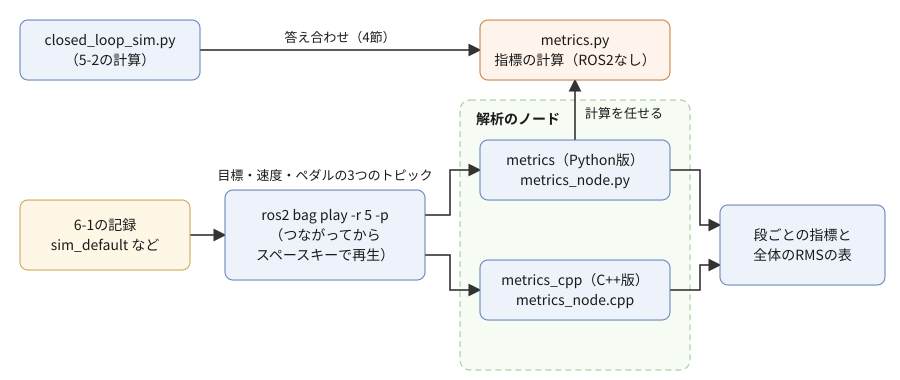
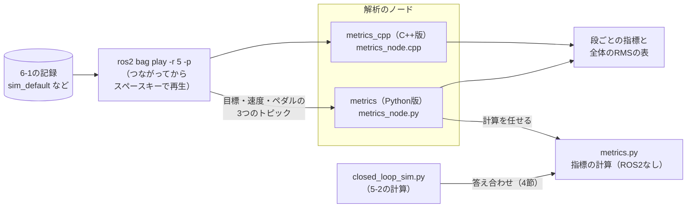

# フェーズ6-3 手順書: 記録から指標を計算して比べる

[`docs/learning_plan.md`](learning_plan.md) フェーズ6の6-3（idea_origin.md ステップ4）に対応する。フェーズ6-1で取った記録を再生しながら、解析のノードで追従の指標（行き過ぎ量・立ち上がり時間・整定時間・定常偏差・ペダルが張り付いた時間・追従誤差の二乗平均）を計算し、条件ごとに比べる。グラフで見た違いを、数で言えるようにするのが、この手順書の目的である。解析のノードはPythonで書き、同じ仕様のC++版も動かして、結果が一致することを確かめる。

- 想定環境: WSL2 + Ubuntu 24.04 + ROS2 Jazzy
- 前提: フェーズ6-1（[`docs/phase6_1_record.md`](phase6_1_record.md)。4-5節の `sim_default`、5節の `gz_default`、4-4節の末尾の課題3の `slow_brake` の3つの記録がある）。C++版を動かすには、フェーズ3-1の `ws/src/learn_cpp` が要る
- 所要目安: 1〜2コマ
- 言語: Python（C++版はサンプルを動かす程度）

> **進め方**: 2節で指標の定義を決め、3節で時間の数え方を考える。4節で、指標をROS2を使わない関数として書き、5-2の閉ループの計算に当てはめて確かめる。5節で解析のノードを書き、6節で記録を解析し、7節で3つの条件を比べる。8節でC++版を動かし、9節で強化学習とのつながりを考える。サンプルは学習の手がかりとして最小限に書いたもので、公式チュートリアルの転載ではない。コードはこの手順書の作成時に、使い捨ての環境でビルドし、6-1と同じ方法で取った記録を実際に解析して確かめた。出力が違う場合は、実機の表示を優先する。

> **実行環境が無くても読めるように**: 実行する手順の直後には「期待する結果」として、表示される内容の例とその読み方を載せている。表示の出どころは次のとおり。4節の計算の結果、6〜8節の解析のノードのログと `ros2 topic info`・`ros2 bag play` の表示は、使い捨ての環境で実際に実行した表示で、時刻は実行ごとに異なる（作成時には、再生を進めるのにスペースキーの代わりに、同じ処理を呼ぶ `ros2 bag play` のサービス `/rosbag2_player/resume` を使った）。指標の値は、同じ記録なら同じになるが、記録を取り直すと少し変わる。5-3節・8-2節のビルドの表示も、使い捨ての環境でビルドしたときの表示（成功を見分ける行だけを抜粋）である。

## 0. 学習目標と完了条件

1. 6つの指標の定義を説明し、ROS2を使わない関数で計算できる。
2. 記録を再生しながら、解析のノードで指標を計算し、条件ごとの比較表を作れる。
3. 指標の時間を、記録の時刻ではなく「受け取った速度の数 × プラントの周期」で数える理由を説明できる。
4. 同じ仕様のC++版を動かし、Python版と同じ結果になることを確かめられる。

完了条件: 3つの記録（5-3の既定、5-3の `tau_brake` 1.0、5-4の既定）の比較表を作り、制御の効き方の違い（立ち上がり・行き過ぎ・定常偏差）と、アクセルとブレーキの非対称性を、表の数で説明できる。

## 1. 全体像

フェーズ6-1の6節では、5-3と5-4の記録を重ねて、「5-4は目標10 m/sを少し行き過ぎる」「目標5 m/sに下げた直後、5-4だけが5を少し下回る」ことを目で確かめた。では、5-4の行き過ぎは何%か。5-3より速く目標に届いているのか、遅いのか。グラフを見ながら予想してから、この手順書で数を出して答え合わせをする。



<details>
<summary>同じ図（mermaid版）</summary>



</details>

- 解析のノード `metrics` は、再生された目標・速度・ペダルを受け取ってためておき、再生が終わったら（速度が届かなくなったら）指標を計算して、表をログに出して終わる。
- 指標の計算は、フェーズ5-1・5-2と同じく、ROS2を使わない関数（`metrics.py`）に分ける。こうすると、5-2の `closed_loop_sim.py` の計算結果にも同じ関数を当てはめられ、記録を解析した値と答え合わせができる。

## 2. 指標の定義

### 2-1. 「段」ごとに見る

目標速度は階段状に変わる（0 → 10 → 5 → 0 m/s）。目標が変わってから、次に変わるまでを「段」と呼び、指標は段ごとに計算する。加速の段（0 → 10）と減速の段（10 → 5、5 → 0）を分けて見ると、アクセルとブレーキの非対称性（フェーズ5-3の4-3節）が数に表れる。ただし、追従誤差の二乗平均（RMS）だけは、記録全体で1つの数にする（2-3節）。

### 2-2. 6つの指標

段の変わる前の目標を $r_0$、変わった後の目標を $r_1$、変化の大きさを $|\Delta| = |r_1 - r_0|$ とする。

| 指標 | 表の列 | 定義 |
|---|---|---|
| 行き過ぎ量 | `over[%]` | 変わった向きに、速度が $r_1$ をどれだけ超えたか。超えた量の最大値 ÷ $|\Delta|$ × 100 |
| 立ち上がり時間 | `rise[s]` | 速度が、変化の10%に届いてから90%に届くまでの時間 |
| 整定時間 | `settle[s]` | 段の始まりから、速度が $r_1 \pm 0.02|\Delta|$ の帯に入って、その後ずっと出なくなるまでの時間。段の終わりまでに収まらなければ `-` |
| 定常偏差 | `error` | $r_1$ − 段の最後の1秒の速度の平均 |
| 張り付いた時間 | `sat[s]` | ペダルが+1か−1に張り付いていた時間の合計 |
| 追従誤差の二乗平均 | `RMS error` | 最初に目標が変わってから最後までの、（目標 − 速度）の二乗の平均の平方根 |

この手順書で詳しく扱うのは、行き過ぎ量・整定時間・RMSの3つである。

- **行き過ぎ量**: 目標をどれだけ超えたか。車両では、超えた分だけ乗り心地が悪く、前の車に近づきすぎる。0%が理想だが、0%を目指すと、目標へ近づくのが遅くなりやすい。
- **整定時間**: 目標のまわりに落ち着くまでの時間。行き過ぎて戻ってくる場合も、ゆっくり近づく場合も、この時間は長くなる。「どれだけ早く、次の目標に移れる状態になったか」を1つの数で表す。
- **RMS**: 記録全体の追従の良し悪しを、1つの数で表す。大きく外れた時間が長いほど大きくなる（二乗するので、大きな外れほど強く効く）。目標が変わった直後は、どんな制御でも大きく外れるので、RMSは「目標の変わり方」にも左右される。同じ目標の階段で比べるときに使う。

残りの3つは、7節の表の読み方で補う。立ち上がり時間は「動き出してからの速さ」、定常偏差は「最後に目標とずれたまま残る量」（フェーズ5-2の2-2節のP制御だけのときの偏差）、張り付いた時間は「アクセルやブレーキを踏み切っていた長さ」（フェーズ5-2の2-5節のワインドアップ）を表す。

> **補足: 指標の基準の取り方**
>
> - **一般的な定義**: 制御工学では、行き過ぎ量や整定時間の帯を、最終値（ここでは $r_1$）に対する割合で決めることが多い。帯の幅は、±2%のほかに±5%もよく使われる。立ち上がり時間は、10%→90%のほかに、0%→100%で測ることもある。
> - **このサンプルで変化の大きさを基準にした理由**: この手順書の階段には、最終値が0の段（5 → 0）がある。最終値に対する割合で決めると、帯の幅が0になり、計算できない。そこで、どの段でも同じ式で計算できるように、変化の大きさ $|\Delta|$ を基準にした。
> - **実務の目安**: どの定義を使うかは、比べる相手（仕様書や、ほかのチームの結果）に合わせる。定義が違うと、同じ動きでも数が変わる。比較表には、どの定義で計算したかを必ず添える。

## 3. 時間の数え方

立ち上がり時間や整定時間を計算するには、各サンプルの時刻が要る。ところが、記録の時刻をそのまま使うと、次の3つの理由で、プラントの中で過ぎた時間とずれる。

- **PCの時計の飛び**: 記録の時刻はPCの現在時刻で、時計が飛ぶと、その分だけ間があく（フェーズ6-1の2-2節の注記）。
- **再生の速さ**: この手順書では、5倍の速さ（`-r 5`）で再生する。届いた時刻で測ると、時間が1/5に縮む。
- **シミュレーションの遅れ**: 5-4の一式は、Gazeboの計算が現実より遅れることがある（フェーズ6-1の5節の注記）。

そこで、解析のノードは、**受け取った速度の数 × プラントの周期**で時刻を数える。

- 5-3の `vehicle_plant` は、モデルを0.01秒ずつ進めるたびに、速度を1回送る（フェーズ5-1の5-1節の `on_timer`）。速度の $n$ 番目は、プラントの中でちょうど $n \times 0.01$ 秒の時点の値である。
- 5-4の `gz_plant` は、Gazeboのオドメトリが届くたびに速度を送る（フェーズ5-4の4-3節の `on_odom`）。オドメトリは、シミュレーション時刻で50 Hz（0.02秒ごと）に送られる（フェーズ5-4の2-2節の `odom_publish_frequency`）。

こうすると、時刻は「プラント自身が進めた時間」になり、PCの時計の飛び、再生の速さ、シミュレーションの遅れのどれにも左右されない。その代わり、**途中の速度が1つでも届かないと、それ以降の時刻がずれる**。6節で、受け取った数を記録の数と比べて確かめる。

## 4. 指標の計算をROS2なしで確かめる（`metrics.py`）

ファイル: `ws/src/learn_py/learn_py/metrics.py`

<!-- file: ws/src/learn_py/learn_py/metrics.py -->
```python
from dataclasses import dataclass


# 1つの段（目標が変わってから、次に変わるまで）の指標。時間の単位は秒、速度はm/s。
@dataclass
class StepResult:
    target_from: float            # 変わる前の目標
    target_to: float              # 変わった後の目標
    overshoot: float              # 行き過ぎ量 [%]（変化の大きさに対する割合）
    rise_time: float | None       # 立ち上がり時間（変化の10%→90%）。届かなければ None
    settling_time: float | None   # 整定時間（±2%に収まるまで）。収まらなければ None
    steady_error: float           # 定常偏差（目標 − 段の最後の1秒の速度の平均）
    saturated_time: float         # ペダルが±1に張り付いていた時間


# 時刻・目標・速度・ペダルの並び（同じ長さ）から、段ごとの指標と、全体のRMSを計算する。
# RMSは、最初に目標が変わってから最後までの、追従誤差（目標 − 速度）の二乗平均の平方根。
def evaluate(times, targets, velocities, pedals, band=0.02, final_window=1.0):
    changes = [i for i in range(1, len(targets)) if targets[i] != targets[i - 1]]
    results = []
    for k, i0 in enumerate(changes):
        i1 = changes[k + 1] if k + 1 < len(changes) else len(targets)
        results.append(evaluate_step(times[i0:i1], targets[i0 - 1], targets[i0],
                                     velocities[i0:i1], pedals[i0:i1], band, final_window))
    rms = None
    if changes:
        errors = [r - v for r, v in zip(targets[changes[0]:], velocities[changes[0]:])]
        rms = (sum(e * e for e in errors) / len(errors)) ** 0.5
    return results, rms


# 1つの段の指標を計算する。r0 は変わる前の目標、r1 は変わった後の目標。
def evaluate_step(t, r0, r1, v, p, band, final_window):
    delta = r1 - r0
    size = abs(delta)
    sign = 1.0 if delta > 0 else -1.0
    # 行き過ぎ: 変わった向きに、目標をどれだけ超えたか
    overshoot = max(0.0, max((x - r1) * sign for x in v)) / size * 100.0
    # 立ち上がり: 変化の10%と90%に初めて届いた時刻の差
    t10 = next((ti for ti, x in zip(t, v) if (x - r0) * sign >= 0.1 * size), None)
    t90 = next((ti for ti, x in zip(t, v) if (x - r0) * sign >= 0.9 * size), None)
    rise_time = t90 - t10 if t10 is not None and t90 is not None else None
    # 整定: 最後に±2%の外にいたサンプルの次から、ずっと内側にいる
    outside = [i for i, x in enumerate(v) if abs(x - r1) > band * size]
    if not outside:
        settling_time = 0.0
    elif outside[-1] == len(v) - 1:
        settling_time = None
    else:
        settling_time = t[outside[-1] + 1] - t[0]
    # 定常偏差: 段の最後の final_window 秒の速度の平均と、目標との差
    tail = [x for ti, x in zip(t, v) if ti >= t[-1] - final_window]
    steady_error = r1 - sum(tail) / len(tail)
    # 張り付き: ペダルが±1だったサンプルの、次のサンプルまでの時間の合計
    saturated_time = sum(t[i + 1] - t[i] for i in range(len(t) - 1) if abs(p[i]) >= 1.0 - 1e-9)
    return StepResult(r0, r1, overshoot, rise_time, settling_time,
                      steady_error, saturated_time)


# 指標の表を、文字列の行のリストにする（ノードのログにも、このファイルの main にも使う）。
def format_report(results, rms):
    def sec(x):
        return '     -' if x is None else f'{x:6.2f}'
    lines = ['step          over[%]  rise[s]  settle[s]  error  sat[s]']
    for r in results:
        lines.append(f'{r.target_from:4.1f} -> {r.target_to:4.1f}  {r.overshoot:7.2f}  '
                     f'{sec(r.rise_time)}   {sec(r.settling_time)}   {r.steady_error:+5.2f}  '
                     f'{r.saturated_time:6.2f}')
    lines.append('RMS error: -' if rms is None else f'RMS error: {rms:.3f} m/s')
    return lines


# 5-2の閉ループの計算の結果に、指標を当てはめて表示する（ROS2を使わない）。
def main():
    from learn_py.closed_loop_sim import simulate
    from learn_py.vehicle_model import VehicleParams
    for name, kwargs in [('PI (kp=0.5, ki=0.1)', {}),
                         ('PI, tau_brake=1.0', dict(params=VehicleParams(tau_brake=1.0)))]:
        # simulate は0秒から目標10で始まるので、その前に目標0のサンプルを1つ足して、0→10の段を作る
        rows = [(-0.01, 0.0, 0.0, 0.0)] + simulate(kp=0.5, ki=0.1, **kwargs)
        times, targets, velocities, pedals = (list(c) for c in zip(*rows))
        print(name)
        for line in format_report(*evaluate(times, targets, velocities, pedals)):
            print('  ' + line)


if __name__ == '__main__':
    main()
```

**`metrics.py` の解説**

- **`StepResult`**: 1つの段の指標をまとめるデータクラス（フェーズ5-1の `VehicleParams` と同じ `@dataclass`）。値が無いことがある2つ（立ち上がり時間・整定時間）は `None` にする。
- **`evaluate`**: 時刻・目標・速度・ペダルの4つの並び（同じ長さ）を受け取る。目標が前のサンプルと変わったところ（`changes`）で段に分け、段ごとに `evaluate_step` を呼ぶ。RMSは、最初に目標が変わったところから最後までの誤差で計算する（最初の目標0の区間は、止まっていて誤差が0なので、入れるとRMSが小さく出てしまう）。
- **`evaluate_step`**: 2-2節の表の定義を、そのままコードにしたもの。
  - `sign` は、変化の向き（上げたら+1、下げたら−1）。`(x - r1) * sign` とすると、上げたときも下げたときも、「変わった向きに超えた量」を同じ式で求められる。
  - 立ち上がりの `next(...)` は、条件に合う最初の時刻を返し、無ければ `None` を返すPythonの書き方。
  - 整定時間は、帯の外にいたサンプルの番号を集め、最後の外のサンプルの次の時刻を使う。最後のサンプルまで外にいれば、収まらなかったとして `None` にする。
- **`format_report`**: 表の行を文字列のリストにする。値が `None` の欄は `-` を表示する。5節のノードも同じ関数でログを作る。
- **`main`**: 5-2の4-2節の `simulate` の結果に、指標を当てはめる。`simulate` は0秒から目標10で始まるので、その前に目標0のサンプルを1つ足して、0 → 10の段を作っている。`closed_loop_sim.py` と同じく、ビルドして `source` した後に `python3 -m` で動かす（フェーズ5-2の4-2節の解説）。

```bash
cd ~/work/ros2MinimalPhysicalAi/ws

colcon build --symlink-install --packages-select learn_py

source install/setup.bash

python3 -m learn_py.metrics
```

**期待する結果**（`python3 -m learn_py.metrics` の分）:

```text
PI (kp=0.5, ki=0.1)
  step          over[%]  rise[s]  settle[s]  error  sat[s]
   0.0 -> 10.0     0.00    6.19    13.75   +0.00    6.08
  10.0 ->  5.0     0.00    0.95     6.69   -0.00    0.48
  RMS error: 1.972 m/s
PI, tau_brake=1.0
  step          over[%]  rise[s]  settle[s]  error  sat[s]
   0.0 -> 10.0     0.00    6.19    13.75   +0.00    6.08
  10.0 ->  5.0    22.22    1.06    12.31   -0.00    1.26
  RMS error: 2.004 m/s
```

5-2で見た数と照らし合わせる。

- 既定のゲインの0 → 10の段の整定時間13.75秒は、フェーズ5-2の2-3節の「約14秒で±2%に収まる」と合う。
- `tau_brake=1.0` の10 → 5の段の行き過ぎ量22.22%は、フェーズ5-2の4-2節の表の最低速度3.89 m/sと合う（5 − 3.89 = 1.11 m/sで、変化の大きさ5 m/sの22.2%）。
- どちらの段も、定常偏差は0.00で、PI制御の積分の項が偏差を消している（フェーズ5-2の2-2節）。
- 加速の段では、ペダルが6.08秒アクセル全開に張り付いているのに対し、減速の段でブレーキ全開に張り付くのは0.48秒だけである。アクセルとブレーキの非対称性（フェーズ5-3の4-3節）が、この列に数で表れる。

## 5. 解析のノード（`metrics_node.py`）

### 5-1. 仕様

- ノード名・実行ファイル名: `metrics`（パッケージ `learn_py`）
- 受ける: `/target_velocity`・`/plant/velocity`・`/plant/pedal`（どれも [`std_msgs/msg/Float64`](https://github.com/ros2/common_interfaces/blob/jazzy/std_msgs/msg/Float64.msg)）。
- 速度が届くたびに、そのときの最新の目標・ペダルと組にして、1サンプルとしてためる。目標が1回も届いていない間の速度は捨てる。
- 時刻は、ためたサンプルの数 × `sample_period` で数える（3節）。
- 速度が `idle_timeout` 秒届かなくなったら、再生が終わったとみなし、`metrics.py` で指標を計算して、サンプル数と表をログに出して終わる。
- パラメータ: `sample_period`（既定0.01。5-4の記録では0.02にする）、`idle_timeout`（既定2.0秒）。

### 5-2. サンプルコードと解説

ファイル: `ws/src/learn_py/learn_py/metrics_node.py`

<!-- file: ws/src/learn_py/learn_py/metrics_node.py -->
```python
import rclpy
from rclpy.clock import Clock, ClockType
from rclpy.executors import ExternalShutdownException
from rclpy.node import Node
from std_msgs.msg import Float64

from learn_py.metrics import evaluate, format_report


# 目標・速度・ペダルを受け取ってためておき、届かなくなったら指標を計算して表示するノード。
# 時刻は、受け取った速度の数 × sample_period で数える（PCの時計を使わない）。
class MetricsNode(Node):
    # パラメータを宣言し、3つのSubscriptionと、途絶えを調べるタイマー・時計を用意する。
    def __init__(self):
        super().__init__('metrics')
        self.declare_parameter('sample_period', 0.01)  # 速度が送られる周期 [s]（プラントの刻み）
        self.declare_parameter('idle_timeout', 2.0)    # この秒数だけ速度が届かなければ計算する
        self.sample_period = self.get_parameter('sample_period').value
        self.idle_timeout = self.get_parameter('idle_timeout').value
        self.target = None
        self.pedal = 0.0
        self.times, self.targets, self.velocities, self.pedals = [], [], [], []
        self.steady_clock = Clock(clock_type=ClockType.STEADY_TIME)
        self.last_received = None

        self.sub_target = self.create_subscription(
            Float64, 'target_velocity', self.on_target, 10)
        self.sub_pedal = self.create_subscription(Float64, 'plant/pedal', self.on_pedal, 10)
        self.sub_velocity = self.create_subscription(
            Float64, 'plant/velocity', self.on_velocity, 10)
        self.timer = self.create_timer(0.5, self.on_watchdog)

    # 目標とペダルは、最新の値を覚えておくだけにする。
    def on_target(self, msg):
        self.target = msg.data

    def on_pedal(self, msg):
        self.pedal = msg.data

    # 速度が届くたびに、そのときの目標・ペダルと組にして1サンプルためる。
    def on_velocity(self, msg):
        self.last_received = self.steady_clock.now()
        if self.target is None:
            return
        self.times.append(len(self.times) * self.sample_period)
        self.targets.append(self.target)
        self.velocities.append(msg.data)
        self.pedals.append(self.pedal)

    # 速度が idle_timeout 秒届かなければ、再生が終わったとみなして計算し、表示して終わる。
    def on_watchdog(self):
        if self.last_received is None:
            return
        elapsed = (self.steady_clock.now() - self.last_received).nanoseconds * 1e-9
        if elapsed < self.idle_timeout:
            return
        self.get_logger().info(f'{len(self.times)} samples ({len(self.times) * self.sample_period:.2f} s)')
        for line in format_report(*evaluate(self.times, self.targets, self.velocities, self.pedals)):
            self.get_logger().info(line)
        rclpy.shutdown()


# エントリポイント（setup.py の entry_points から呼ばれる）。
# ノードを作って spin で回し、Ctrl+C か計算の終わりで後片付けする。
def main(args=None):
    rclpy.init(args=args)
    node = MetricsNode()
    try:
        rclpy.spin(node)
    except (KeyboardInterrupt, ExternalShutdownException):
        pass
    finally:
        node.destroy_node()
        rclpy.try_shutdown()
```

**`metrics_node.py` の解説**

- **`on_target`・`on_pedal`**: 最新の値を覚えるだけにする（フェーズ5-2の `pi_controller` の `on_target` と同じ考え方）。
- **`on_velocity`**: 速度が届くたびに、時刻（`len(self.times) * self.sample_period`）・目標・速度・ペダルを1組ためる。速度を「時計の針」にしているので、速度が届いたときにだけサンプルを作る。
- **`on_watchdog`**: 0.5秒ごとに、最後に速度が届いてから何秒たったかを調べる。フェーズ5-1の `gz_display` の途絶えの見張りと同じ形で、単調増加する時計で測る。`idle_timeout` を超えたら、`evaluate` と `format_report` で表を作り、1行ずつログに出して、`rclpy.shutdown()` で終わる（フェーズ6-1の `target_generator` と同じ終わり方）。
- 指標の式はこのファイルに1行も無い。フェーズ5-1の `plant_node.py`、5-2の `pi_node.py` と同じく、ノードは「受け取る」「ためる」「計算を頼む」「表示する」だけを受け持つ。

### 5-3. 実行ファイルとして登録し、ビルドする

`ws/src/learn_py/setup.py` の `entry_points` に1行足す（既存の行は残す。フェーズ6-2の3-3節で足した `goal_monitor` の行の後に続ける）。

<!-- snippet: py_entry_points_metrics -->
```python
            'metrics = learn_py.metrics_node:main',
```

`metrics.py` は、ノードから `import` される部品なので、登録しない（フェーズ5-1の `vehicle_model.py` と同じ）。

```bash
cd ~/work/ros2MinimalPhysicalAi/ws

colcon build --symlink-install --packages-select learn_py

source install/setup.bash
```

**期待する結果**: `Finished <<< learn_py` と `Summary: 1 package finished` が出れば成功。

## 6. 記録を解析する

### 6-1. 一時停止の状態で再生し始める

解析のノードより先に再生を始めると、ノードとの通信がつながる前に送られた分は、ノードに届かない（フェーズ6-1の2-3節の再生は、流れる値を見るだけだったので、最初の数個が欠けても困らなかった）。この手順書の作成時に、5倍速で再生を始めてから解析のノードを起動したところ、目標0 → 10の段がまるごと届かなかったことがあった。3節のとおり、時刻を速度の数で数えるので、欠けると指標が狂う。

そこで、`-p`（一時停止の状態で始める）で再生を準備し、解析のノードがつながったことを確かめてから、スペースキーで再生を進める。ターミナルを3つ使う。

```bash
# T1
cd ~/work/ros2MinimalPhysicalAi/ws/bags

ros2 bag play sim_default -r 5 -p

# T2
cd ~/work/ros2MinimalPhysicalAi/ws

source install/setup.bash

ros2 run learn_py metrics

# T3
ros2 topic info /plant/velocity
```

**期待する結果**（T3の分）:

```text
Type: std_msgs/msg/Float64
Publisher count: 1
Subscription count: 1
```

`Publisher count: 1` が再生（T1）、`Subscription count: 1` が解析のノード（T2）。両方が1になっていれば、つながっている。確かめたら、**T1でスペースキーを押して**再生を進める。

**期待する結果**（T1の分の最後の行。スペースキーを押したとき）:

```text
[INFO] [1790469943.401710742] [rosbag2_player]: Resuming play.
```

`Resuming play.` が出れば、再生が進み始めている。

### 6-2. 表を読む

**期待する結果**（T2の分。再生が終わって2秒ほど後）:

```text
[INFO] [1790469970.431304052] [metrics]: 9971 samples (99.71 s)
[INFO] [1790469970.435680217] [metrics]: step          over[%]  rise[s]  settle[s]  error  sat[s]
[INFO] [1790469970.436032757] [metrics]:  0.0 -> 10.0     0.00    6.19    13.75   +0.00    6.08
[INFO] [1790469970.436347191] [metrics]: 10.0 ->  5.0     0.00    0.95     6.66   -0.00    0.48
[INFO] [1790469970.436652838] [metrics]:  5.0 ->  0.0     0.00    0.83     7.78   -0.01    0.58
[INFO] [1790469970.436995432] [metrics]: RMS error: 1.776 m/s
```

- 1行目は、ためたサンプルの数と、それが表す時間（数 × 0.01秒）。記録の中の数（フェーズ6-1の2-2節と同じく `ros2 bag info sim_default` で確かめられる `/plant/velocity` の `Count`。この手順書の作成時の記録では9984）より少しだけ少ないのは、最初の目標が届く前の速度（この例では13個）を捨てているためである（5-1節の仕様）。差がこれより大きいときは、途中の速度が届いていない（11節の表の「サンプルの数が記録より大きく少ない」）。
- 0 → 10と10 → 5の段の値は、4節の計算とほぼ同じである（10 → 5の段の整定時間だけ、6.69秒と6.66秒で少し違う。記録では、目標を切り替えた時刻と、制御の周期の区切りの関係が、計算と少し違うためと考えられる）。自作のプラントは、記録を再生しても、ROS2なしで計算しても、同じ式で動いていることが確かめられる。
- 5 → 0の段は、フェーズ5-3の5節の「目標0で止まりきらない」現象の段である。行き過ぎ量は0%（0より下には行かない）だが、速度がいったん浮くので、整定時間が7.78秒と、10 → 5の段より長い。
- 表を出した後、T2の `metrics` は自分で終わる。T1の再生も、最後まで進めば自分で終わる。

## 7. 条件ごとに比べる

### 7-1. 残りの2つの記録を解析する

この手順書の6-1節と同じ手順で、`slow_brake` と `gz_default` を解析する。T1・T2・T3は、6-1節で使ったターミナルをそのまま使う（T1は `ws/bags` に、T2は `source` 済みの `ws` にいる）。**5-4の記録（`gz_default`）では `sample_period` を0.02にする**（3節。速度が50 Hzで送られているため）。

```bash
# T1
ros2 bag play slow_brake -r 5 -p

# T2
ros2 run learn_py metrics
```

（T3で `Subscription count: 1` を確かめてから、T1でスペースキーを押す。以下も同じ。）

```bash
# T1
ros2 bag play gz_default -r 5 -p

# T2
ros2 run learn_py metrics --ros-args -p sample_period:=0.02
```

**期待する結果**（T2の分。`slow_brake`）:

```text
[INFO] [1790470003.522161937] [metrics]: 9989 samples (99.89 s)
[INFO] [1790470003.526566422] [metrics]: step          over[%]  rise[s]  settle[s]  error  sat[s]
[INFO] [1790470003.527014101] [metrics]:  0.0 -> 10.0     0.00    6.19    13.75   +0.00    6.08
[INFO] [1790470003.527427114] [metrics]: 10.0 ->  5.0    22.22    1.06    12.31   -0.00    1.26
[INFO] [1790470003.527923267] [metrics]:  5.0 ->  0.0     0.00    1.10    11.00   -0.01    1.01
[INFO] [1790470003.528556944] [metrics]: RMS error: 1.825 m/s
```

**期待する結果**（T2の分。`gz_default`）:

```text
[INFO] [1790470037.519713585] [metrics]: 5176 samples (103.52 s)
[INFO] [1790470037.522471588] [metrics]: step          over[%]  rise[s]  settle[s]  error  sat[s]
[INFO] [1790470037.522955266] [metrics]:  0.0 -> 10.0     3.10    4.10     7.28   -0.00    4.54
[INFO] [1790470037.523285704] [metrics]: 10.0 ->  5.0     9.49    0.74     3.00   -0.00    0.74
[INFO] [1790470037.523633562] [metrics]:  5.0 ->  0.0     0.38    0.74     1.10   +0.00    0.74
[INFO] [1790470037.523950968] [metrics]: RMS error: 1.623 m/s
```

`gz_default` のサンプル数5176は、`ros2 bag info gz_default` の `/plant/velocity` の `Count`（この手順書の作成時の記録では5176）と同じになる（この例では、最初の速度より先に目標が届いていたので、捨てた速度が無かった）。

### 7-2. 比較表

3つの表を、段ごとに並べる。

| 段 | 指標 | 5-3 既定 | 5-3 `tau_brake` 1.0 | 5-4 既定 |
|---|---|---|---|---|
| 0 → 10 | 行き過ぎ量 | 0.00% | 0.00% | 3.10% |
| | 立ち上がり時間 | 6.19 s | 6.19 s | 4.10 s |
| | 整定時間 | 13.75 s | 13.75 s | 7.28 s |
| | 張り付いた時間 | 6.08 s | 6.08 s | 4.54 s |
| 10 → 5 | 行き過ぎ量 | 0.00% | 22.22% | 9.49% |
| | 立ち上がり時間 | 0.95 s | 1.06 s | 0.74 s |
| | 整定時間 | 6.66 s | 12.31 s | 3.00 s |
| | 張り付いた時間 | 0.48 s | 1.26 s | 0.74 s |
| 5 → 0 | 行き過ぎ量 | 0.00% | 0.00% | 0.38% |
| | 整定時間 | 7.78 s | 11.00 s | 1.10 s |
| | 張り付いた時間 | 0.58 s | 1.01 s | 0.74 s |
| 全体 | RMS | 1.776 m/s | 1.825 m/s | 1.623 m/s |

定常偏差は、どの条件・どの段でも0.01 m/s以下なので、表から省いた。5 → 0の段の立ち上がり時間も、どの条件でも1秒前後（0.74〜1.10秒）で差が小さいので省いた（値は、この手順書の6-2節と7-1節のログにある）。読み取れることは次のとおり。

- **1節の問いの答え**: 5-4の行き過ぎは、0 → 10の段で3.10%（最高10.31 m/s）、10 → 5の段で9.49%（最低4.53 m/s）。行き過ぎる代わりに、立ち上がり時間も整定時間も5-3より短い。抵抗が無いので速く加速でき、減速でも勢いが残って行き過ぎやすい（10 → 5の段で9.49%。フェーズ5-4の7節）。
- **ブレーキの遅れの影響**: `tau_brake` を1.0にすると、加速の段（0 → 10）は1つも変わらず、減速の段だけが悪くなる（10 → 5の行き過ぎ量0% → 22%、整定時間6.66秒 → 12.31秒。ブレーキ全開に張り付く時間も、10 → 5と5 → 0の段で2倍前後に延びる）。ブレーキの遅れは、ブレーキを使う段にだけ効く。
- **アクセルとブレーキの非対称性**: 5-3の既定では、10 m/s上げる段でアクセル全開に6.08秒張り付くのに対し、5 m/s下げる段でブレーキ全開に張り付くのは0.48秒である。変化の大きさの違い（10と5）を考えても、減速のほうがずっと短い時間で済んでいる。フェーズ5-3の4-3節でグラフから読んだ非対称性を、数で言えるようになった。
- **RMSだけで比べると**: RMSは5-4がいちばん小さい。行き過ぎはあるが、目標に速く近づくので、外れている時間の合計が短いためである。1つの数にまとめると、「行き過ぎるが速い」と「行き過ぎないが遅い」の違いが見えなくなる。段ごとの指標と、全体の1つの数は、目的に応じて使い分ける（9節）。

## 8. C++版を動かす

同じ仕様（5-1節）の解析のノードを、C++で書いたものである。この手順書では、サンプルを動かして、Python版と同じ結果になることを確かめるところまでを扱う。

### 8-1. サンプルコード

ファイル: `ws/src/learn_cpp/src/metrics_node.cpp`

<!-- file: ws/src/learn_cpp/src/metrics_node.cpp -->
```cpp
#include <algorithm>
#include <chrono>
#include <cmath>
#include <cstdio>
#include <memory>
#include <optional>
#include <string>
#include <utility>
#include <vector>

#include "rclcpp/rclcpp.hpp"
#include "std_msgs/msg/float64.hpp"

using namespace std::chrono_literals;

// 1つの段（目標が変わってから、次に変わるまで）の指標。Python版の StepResult と同じ。
struct StepResult
{
  double target_from, target_to, overshoot;
  std::optional<double> rise_time, settling_time;
  double steady_error, saturated_time;
};

// 1つの段の指標を計算する。Python版の evaluate_step と同じ手順。
StepResult evaluate_step(
  const std::vector<double> & t, double r0, double r1,
  const std::vector<double> & v, const std::vector<double> & p,
  double band = 0.02, double final_window = 1.0)
{
  const double size = std::abs(r1 - r0);
  const double sign = r1 > r0 ? 1.0 : -1.0;
  StepResult r{r0, r1, 0.0, std::nullopt, std::nullopt, 0.0, 0.0};
  double worst = 0.0;
  std::optional<double> t10, t90;
  std::optional<size_t> last_outside;
  for (size_t i = 0; i < v.size(); ++i) {
    worst = std::max(worst, (v[i] - r1) * sign);
    if (!t10 && (v[i] - r0) * sign >= 0.1 * size) {t10 = t[i];}
    if (!t90 && (v[i] - r0) * sign >= 0.9 * size) {t90 = t[i];}
    if (std::abs(v[i] - r1) > band * size) {last_outside = i;}
    if (i + 1 < v.size() && std::abs(p[i]) >= 1.0 - 1e-9) {r.saturated_time += t[i + 1] - t[i];}
  }
  r.overshoot = worst / size * 100.0;
  if (t10 && t90) {r.rise_time = *t90 - *t10;}
  if (!last_outside) {
    r.settling_time = 0.0;
  } else if (*last_outside + 1 < v.size()) {
    r.settling_time = t[*last_outside + 1] - t.front();
  }
  double sum = 0.0;
  int n = 0;
  for (size_t i = 0; i < v.size(); ++i) {
    if (t[i] >= t.back() - final_window) {sum += v[i]; ++n;}
  }
  r.steady_error = r1 - sum / n;
  return r;
}

// 時刻・目標・速度・ペダルの並びから、段ごとの指標と、全体のRMSを計算する。Python版の evaluate と同じ手順。
// RMSは、最初に目標が変わってから最後までの誤差で計算する（段が無ければ値なし）。
std::pair<std::vector<StepResult>, std::optional<double>> evaluate(
  const std::vector<double> & times, const std::vector<double> & targets,
  const std::vector<double> & velocities, const std::vector<double> & pedals)
{
  std::vector<size_t> changes;
  for (size_t i = 1; i < targets.size(); ++i) {
    if (targets[i] != targets[i - 1]) {changes.push_back(i);}
  }
  std::vector<StepResult> results;
  for (size_t k = 0; k < changes.size(); ++k) {
    const size_t i0 = changes[k];
    const size_t i1 = k + 1 < changes.size() ? changes[k + 1] : targets.size();
    auto seg = [&](const std::vector<double> & x) {
        return std::vector<double>(x.begin() + i0, x.begin() + i1);
      };
    results.push_back(
      evaluate_step(seg(times), targets[i0 - 1], targets[i0], seg(velocities), seg(pedals)));
  }
  std::optional<double> rms;
  if (!changes.empty()) {
    double sum = 0.0;
    for (size_t i = changes.front(); i < targets.size(); ++i) {
      const double e = targets[i] - velocities[i];
      sum += e * e;
    }
    rms = std::sqrt(sum / (targets.size() - changes.front()));
  }
  return {results, rms};
}

// 目標・速度・ペダルを受け取ってためておき、届かなくなったら指標を計算して表示するノード（Python版と同じ仕様）。
class MetricsNode : public rclcpp::Node
{
public:
  // パラメータを宣言し、3つの Subscription と、途絶えを調べるタイマー・時計を用意する。
  // コールバックはラムダで書く（目標とペダルは最新の値を覚え、速度が届くたびに1サンプルためる）。
  MetricsNode()
  : Node("metrics"), steady_clock_(RCL_STEADY_TIME)
  {
    sample_period_ = declare_parameter("sample_period", 0.01);
    idle_timeout_ = declare_parameter("idle_timeout", 2.0);
    sub_target_ = create_subscription<std_msgs::msg::Float64>(
      "target_velocity", 10, [this](const std_msgs::msg::Float64 & msg) {target_ = msg.data;});
    sub_pedal_ = create_subscription<std_msgs::msg::Float64>(
      "plant/pedal", 10, [this](const std_msgs::msg::Float64 & msg) {pedal_ = msg.data;});
    sub_velocity_ = create_subscription<std_msgs::msg::Float64>(
      "plant/velocity", 10, [this](const std_msgs::msg::Float64 & msg) {
        last_received_ = steady_clock_.now();
        if (!target_) {return;}
        times_.push_back(times_.size() * sample_period_);
        targets_.push_back(*target_);
        velocities_.push_back(msg.data);
        pedals_.push_back(pedal_);
      });
    timer_ = create_wall_timer(500ms, [this]() {on_watchdog();});
  }

private:
  // 速度が idle_timeout 秒届かなければ、段ごとの指標とRMSを計算して表示し、終わる。
  void on_watchdog()
  {
    if (!last_received_ || (steady_clock_.now() - *last_received_).seconds() < idle_timeout_) {
      return;
    }
    RCLCPP_INFO(get_logger(), "%zu samples (%.2f s)", times_.size(), times_.size() * sample_period_);
    RCLCPP_INFO(get_logger(), "step          over[%%]  rise[s]  settle[s]  error  sat[s]");
    const auto [results, rms] = evaluate(times_, targets_, velocities_, pedals_);
    for (const StepResult & r : results) {
      RCLCPP_INFO(
        get_logger(), "%4.1f -> %4.1f  %7.2f  %s   %s   %+5.2f  %6.2f",
        r.target_from, r.target_to, r.overshoot, sec(r.rise_time).c_str(),
        sec(r.settling_time).c_str(), r.steady_error, r.saturated_time);
    }
    if (rms) {
      RCLCPP_INFO(get_logger(), "RMS error: %.3f m/s", *rms);
    } else {
      RCLCPP_INFO(get_logger(), "RMS error: -");
    }
    rclcpp::shutdown();
  }

  // 秒の値を6文字の文字列にする（値が無ければ '-'）。
  static std::string sec(const std::optional<double> & x)
  {
    char buf[16];
    if (x) {std::snprintf(buf, sizeof(buf), "%6.2f", *x);} else {std::snprintf(buf, sizeof(buf), "     -");}
    return buf;
  }

  double sample_period_, idle_timeout_, pedal_ = 0.0;
  std::optional<double> target_;
  std::vector<double> times_, targets_, velocities_, pedals_;
  rclcpp::Clock steady_clock_;
  std::optional<rclcpp::Time> last_received_;
  rclcpp::Subscription<std_msgs::msg::Float64>::SharedPtr sub_target_, sub_pedal_, sub_velocity_;
  rclcpp::TimerBase::SharedPtr timer_;
};

// ノードを作って spin で回し、Ctrl+C か計算の終わりで終わる。
int main(int argc, char ** argv)
{
  rclcpp::init(argc, argv);
  rclcpp::spin(std::make_shared<MetricsNode>());
  rclcpp::shutdown();
  return 0;
}
```

Python版との主な違いだけを挙げる。

- **値が無いことの表し方**: Python版の `None` の代わりに、C++17の `std::optional<double>`（値があるか無いかを持てる型）を使う。
- **1つのファイル**: Python版は、指標の計算（`metrics.py`）とノード（`metrics_node.py`）をファイルで分けた。C++版では、計算の関数（`evaluate_step` と `evaluate`）とノードのクラスを1つのファイルに書いた（ファイルを分ける場合は、ヘッダとライブラリをCMakeで作る必要があり、この手順書の範囲を超えるため）。計算を関数に分け、ノードの `on_watchdog` は `evaluate` を呼んで表示するだけにしている点は、Python版と同じである。`evaluate` は、段ごとの指標とRMSの組（`std::pair`）を返し、呼ぶ側はC++17の構造化束縛（`const auto [results, rms] = ...`）で2つに分けて受け取る。
- **コールバック**: 3つの Subscription のコールバックはラムダで書き、コンストラクタの中で渡している。引数を `const std_msgs::msg::Float64 & msg` で受け取るのも、フェーズ3-1のC++版の `listener` と同じ書き方である。
- **タイマー**: `create_wall_timer` は、名前のとおり現実の時間で数える（[`docs/tips.md`](tips.md) の1-5節の表）。途絶えの見張りに向いている。

### 8-2. ビルドの設定と、ビルド

`ws/src/learn_cpp/CMakeLists.txt` に追記し、`install(TARGETS ...)` に `metrics` を足す（これまでの分は残す。フェーズ3-1の4-2節と同じ形）。

<!-- snippet: cmake_cpp_metrics -->
```cmake
add_executable(metrics src/metrics_node.cpp)
ament_target_dependencies(metrics rclcpp std_msgs)
```

`package.xml` の依存（`rclcpp`・`std_msgs`）は、フェーズ3-1で足してあるので、変えなくてよい。

```bash
cd ~/work/ros2MinimalPhysicalAi/ws

colcon build --symlink-install --packages-select learn_cpp

source install/setup.bash
```

**期待する結果**: `Finished <<< learn_cpp` と `Summary: 1 package finished` が出れば成功（C++なので、Python版より時間がかかる）。

### 8-3. Python版と並べて動かす

同じ再生を、Python版とC++版の両方に同時に届ける。C++版のノード名はPython版と同じ `metrics` なので、`-r __node:=metrics_cpp` で名前を付け替える（フェーズ6-1の6節の `__node:=` と同じ）。

```bash
# T1
cd ~/work/ros2MinimalPhysicalAi/ws/bags

ros2 bag play sim_default -r 5 -p

# T2
cd ~/work/ros2MinimalPhysicalAi/ws

source install/setup.bash

ros2 run learn_py metrics

# T3
cd ~/work/ros2MinimalPhysicalAi/ws

source install/setup.bash

ros2 run learn_cpp metrics --ros-args -r __node:=metrics_cpp

# T4
ros2 topic info /plant/velocity
```

T4で `Subscription count: 2` になったら、T1でスペースキーを押す。

**期待する結果**（T3の分）:

```text
[INFO] [1790470352.482085517] [metrics_cpp]: 9971 samples (99.71 s)
[INFO] [1790470352.482532206] [metrics_cpp]: step          over[%]  rise[s]  settle[s]  error  sat[s]
[INFO] [1790470352.483470014] [metrics_cpp]:  0.0 -> 10.0     0.00    6.19    13.75   +0.00    6.08
[INFO] [1790470352.484635883] [metrics_cpp]: 10.0 ->  5.0     0.00    0.95     6.66   -0.00    0.48
[INFO] [1790470352.484999312] [metrics_cpp]:  5.0 ->  0.0     0.00    0.83     7.78   -0.01    0.58
[INFO] [1790470352.485149943] [metrics_cpp]: RMS error: 1.776 m/s
```

T2（Python版）の表と、数が同じになる。ただし、1サンプル分（0.01〜0.02秒）違う値が出ることがある。ペダルや目標と、速度は別のトピックなので、2つのノードで、届く順番が1つ入れ替わることがあるためである。この手順書の作成時に違いが出たのは、張り付いた時間（`slow_brake`・`gz_default` で1サンプル分）だけだった。

## 9. 強化学習へのつながり

フェーズ6の後で扱う予定の強化学習（idea_origin.md ステップ6）では、エージェントがゲインを変えて試し、その結果の良し悪しを1つの数（報酬）で受け取る。この手順書の指標は、報酬の材料になる。

- **全体の1つの数**: RMSは、そのまま報酬に使える（小さいほど良いので、符号を反転して「− RMS」を報酬にする）。ただし、7-2節の最後の項目のとおり、RMSだけでは「行き過ぎるが速い」と「行き過ぎないが遅い」の区別がつかない。
- **段ごとの指標を組み合わせる**: 「行き過ぎ量が5%を超えたら大きく減点する」「減速の段の整定時間を重く見る」のように、段ごとの指標に重みを付けて足し合わせると、「どんな追従を良しとするか」を報酬に込められる。重みの決め方そのものが、設計の判断になる。
- **エピソードの終わり方**: 報酬を比べるには、同じ条件で試行を繰り返す必要がある。6-1の時間で終わる記録と、6-2のゴールで終わる記録は、エピソードの終わり方の2つの形である。
  - この手順書では、6-1の時間で終わる記録だけを比べた。6-2のゴールで終わる記録は、条件によって終わる時刻が違い、5 → 0の段が入らないうえ、RMSを計算する範囲も条件ごとに変わるためである。ゴールで終わる記録で比べる場合は、「ゴールまでの時間」そのものを指標にする、RMSを同じ区間に切りそろえる、のように、終わり方に合った指標を選ぶ。

## 10. 本フェーズのまとめ

- 指標は、段ごと（行き過ぎ量・立ち上がり時間・整定時間・定常偏差・張り付いた時間）と、記録全体（RMS）で計算した。段ごとに見ると、アクセルとブレーキの非対称性や、ブレーキの遅れが減速の段にだけ効くことが、数で分かる。
- 指標の計算はROS2を使わない関数に分けたので、5-2の閉ループの計算にも、記録の解析にも、同じ関数を使えた。
- 時間は、記録の時刻ではなく「受け取った速度の数 × プラントの周期」で数えた。PCの時計の飛び、再生の速さ、シミュレーションの遅れに左右されない代わりに、途中の欠けに弱いので、受け取った数を記録の数と比べて確かめる。
- 再生は一時停止の状態で始め、解析のノードがつながってから進める。そうしないと、つながる前の分が届かない。
- 同じ仕様のC++版も、同じ結果を出した。ノードどうしはトピックでつながっているので、言語が違っても同じ記録を解析できる。

## 11. つまずきやすい点

| 症状 | 確認すること |
|---|---|
| 表に0 → 10の段が無い・立ち上がり時間が短すぎる | 再生を始める前に、解析のノードがつながっていたか。`-p` で始め、`Subscription count` を確かめてからスペースキーを押す（この手順書の6-1節） |
| サンプルの数が記録より大きく少ない | 再生を始めた後に解析のノードを起動していないか。数が合わないと、3節のとおり時刻がずれる |
| 5-4の記録の時間が2倍・半分に出る | `sample_period` を0.02にしたか（7-1節） |
| `metrics` が表を出さずに止まらない | 再生が終わってから `idle_timeout`（2秒）待つ。一時停止のままなら、T1でスペースキーを押したか |
| `python3 -m learn_py.metrics` で `No module named learn_py` | ビルドして `source install/setup.bash` したか（フェーズ5-2の9節の表と同じ） |
| C++版のビルドで `std::optional` が見つからない | `#include <optional>` があるか。Jazzyの既定のC++の版（C++17）で使える |
| 表の数が途中で切れている・段が足りない | 再生の途中でスペースキーをもう一度押して、一時停止していないか。一時停止のまま `idle_timeout`（2秒）たつと、それまでの分だけで計算して終わる。記録を再生し直して、解析もやり直す |
| 2つの `metrics` が同じ名前で動いて、警告が出る | C++版に `-r __node:=metrics_cpp` を付けたか（8-3節） |

## 12. フェーズ6のまとめ

フェーズ6-1〜6-3で、次のものを作った。

| 冊 | 作ったもの | 役割 |
|---|---|---|
| 6-1 | `end_time`（`target_generator`）、`on_exit=Shutdown()`、`record.launch.py`、`*_record.yaml` | 5-3・5-4の一式を記録し、決めた時間で終わらせる。記録を再生して重ねる |
| 6-2 | `goal_monitor`、`record_goal.launch.py`、`*_goal.yaml` | ゴールに着いたことをきっかけに記録を終わらせる |
| 6-3 | `metrics.py`、`metrics`（Python版・C++版） | 記録から指標を計算して、条件ごとに比べる |

学習計画のフェーズ6の完了条件（記録から、条件ごとの指標の比較表を作り、制御の効き方の違いを説明する）は、この手順書の7-2節で確かめた。

## 13. 次へ

これで、フェーズ6の手順書はそろった。学習計画（[`docs/learning_plan.md`](learning_plan.md)）では、この後は、強化学習によるゲインの調整（idea_origin.md ステップ6）を先に検討し、フェーズ7（OSSの拡張活用）は保留にしている。作成の状況は、学習計画の「手順書一覧」で確かめられる。

## 14. 公式ドキュメント・参考資料

確認状況（2026-09-27）: 公式のページは、フェーズ6-1の10節で実在を確認したもの。指標の定義は、制御工学の一般的な内容を自分の言葉でまとめたもので、特定の文献の転載ではない。日本語の記事は [`docs/idea_origin.md`](idea_origin.md) とフェーズ5-2の11節に掲載済みのもので、今回は再確認していない。

### 公式

- [Recording and playing back data — ROS 2 Documentation: Jazzy](https://docs.ros.org/en/jazzy/Tutorials/Beginner-CLI-Tools/Recording-And-Playing-Back-Data/Recording-And-Playing-Back-Data.html)（`ros2 bag play` の基本）
- [ros2/rosbag2 — README（GitHub、jazzyブランチ）](https://github.com/ros2/rosbag2/tree/jazzy)（`ros2 bag play` の `-p`（一時停止で始める）などのオプション）

### 日本語

- [PID制御の基本理論と設計法：幅広く使われるPID制御 - 制御工学ブログ](https://blog.control-theory.com/entry/pid-control)（伝達関数・一次遅れ系の考え方）

> 記事は個人による非公式の解説で、版によって異なる場合がある。公式ドキュメントと食い違う場合は公式を優先する。

> 出典: 指標の定義と、報酬への使い方は、制御工学と強化学習の一般的な内容を、自分の言葉でまとめたもの。サンプルコード・文章は独自に書いたもの。
