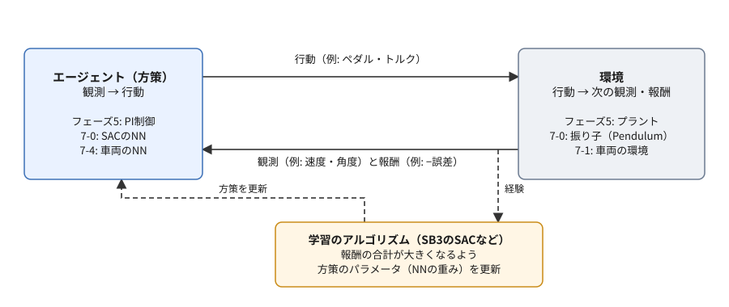
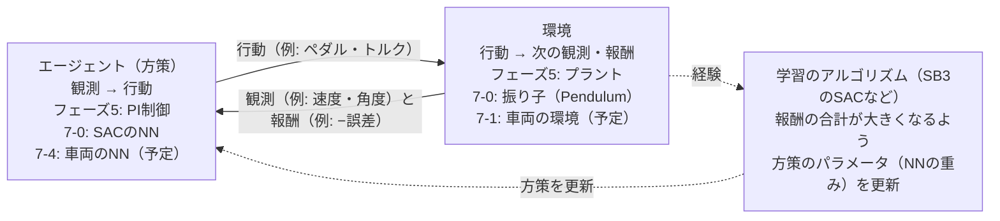

# フェーズ7-0 手順書: 強化学習の概要と最初の一歩（振り子を学習させる）

[`docs/learning_plan.md`](learning_plan.md) フェーズ7の7-0（idea_origin.md ステップ6の準備）に対応する。フェーズ7では、フェーズ5で作ったPI制御を、強化学習で調整し、最後はニューラルネットワーク（NN）に置き換えることを目指す。その前にこの手順書で、強化学習の用語と、学習ループの形をつかむ。題材は、車両ではなく、Gymnasiumに用意されている**振り子（Pendulum）**である。SB3で振り子を立たせる方策を学習させ、自分で式を書いた制御器と比べる。

- 想定環境: WSL2 + Ubuntu 24.04（ROS2は使わない）
- 前提: [強化学習のライブラリの環境構築](setup_rl_sb3.md)（仮想環境 `~/rl_venv` に、SB3・Gymnasium・PyTorchが入っている）。フェーズ5-2（[`docs/phase5_2_pi.md`](phase5_2_pi.md)）とフェーズ6-3（[`docs/phase6_3_metrics.md`](phase6_3_metrics.md)）の内容を、たとえ話に使う（読んでいなくても手順は進められる）
- 所要目安: 2コマ
- 言語: Python（ROS2のノードは書かない）

> **この手順書の位置づけ（暫定）**: フェーズ7は作成中で、構成を大きく改める可能性がある。この冊も、後の冊を書く中で書き直すことがある。

> **進め方**: 1節で全体像を見て、2節で強化学習の用語を押さえる。3節でGymnasiumの環境を、エージェント無しで（でたらめな行動で）動かす。4節でSB3のSACに振り子を学習させ、5節で学習したNNの中身を見る。6節で、自分で式を書いた制御器と比べる。3節・4節では、公式の文書の例を抜粋して読んでから、この教材の題材に合わせて書き直したスクリプトを動かす。抜粋した部分は、各節と末尾に出典を書いている。それ以外のサンプルは、学習の手がかりとして最小限に書いたものである。

> **実行環境が無くても読めるように**: 実行する手順の直後には「期待する結果」として、表示される内容の例とその読み方を載せている。**この版の期待する結果は、ライブラリの公式の文書と仕様から想定したもの**で、筆者の環境ではまだ確かめていない。3-2節と6節のトルク0・でたらめ・手書きの制御器の数は、Gymnasiumのソースにある振り子の運動方程式と乱数の使い方をnumpyで書き写して計算した値である（書き写しが正しいことは、ソースの説明に載っている初期状態の例と一致することで確かめた。でたらめの行は、行動の乱数の使い方を想定して計算したもの）。学習の結果（報酬の値・学習の時間）は、PCとライブラリの版によって変わる。

## 0. 学習目標と完了条件

1. 強化学習の用語（エージェント・環境・観測・行動・報酬・エピソード・方策・収益）を、フェーズ5の車両の部品に当てはめて説明できる。
2. Gymnasiumの環境を `reset` と `step` のループで動かし、`terminated` と `truncated` の違いを説明できる。
3. SB3のSACで振り子を学習させ、学習したNNの方策を評価できる。
4. 自分で式を書いた制御器と、学習した方策の違い（何を知っている必要があるか）を説明できる。

完了条件: 4節で学習させたSACの方策と、6節の手書きの制御器を、同じ初期状態の100エピソードで比べ、報酬の平均の違いと、それぞれの作り方の違い（人が式を決めるか、報酬から学ぶか）を説明できる。

## 1. 全体像

フェーズ5-2では、PI制御のゲインを、式から目安を立てて手で決めた。フェーズ6-3では、その結果の良し悪しを、行き過ぎ量やRMSのような数で言えるようになった。では、その数を手がかりに、コンピュータに制御の仕方そのものを探させることはできないか。これが、フェーズ7で扱う強化学習の発想である。

ただ、いきなり車両の題材で始めると、つまずいたときに、原因が強化学習の使い方にあるのか、車両の環境の作り方にあるのかを切り分けにくい。そこでこの冊では、強化学習の練習で定番の振り子を使う。振り子は、ライブラリに最初から用意されていて、学習がうまくいったときの報酬の目安も知られている。まず「用意された環境」と「用意されたアルゴリズム」で学習ループを1周してから、7-1で車両の環境を自分で作る。



<details>
<summary>同じ図（mermaid版）</summary>



</details>

フェーズ7全体の予定（暫定）は、次のとおりである。

| 冊 | 内容 |
|---|---|
| 7-0（この冊） | 強化学習の用語、Gymnasiumの環境の動かし方、SB3で振り子を学習させる |
| 7-1 | 車両のプラントとPI制御を、Gymnasiumの環境として包む |
| 7-2 | 強化学習でPIのゲインを調整する |
| 7-3 | 状況に応じてゲインを変える（ゲインスケジューリング）、PIの出力を補正する |
| 7-4 | PI制御をNNに置き換え、ROS2のノードで動かす |
| 7-5 | 二足歩行への橋渡し（発展。性能の高いPCを想定） |

## 2. 強化学習の用語

### 2-1. 試行錯誤で方策を探す

強化学習では、コンピュータに「この状況ではこう動け」という正解を教えない。代わりに、動いた結果の良し悪しを1つの数（**報酬**）で返す。コンピュータは、試しに動いては報酬を受け取ることを繰り返し、報酬の合計が大きくなる動き方を少しずつ見つけていく。子どもが自転車に乗れるようになるまで、転びながら体の傾け方を覚えていくのに似ている。

このとき、試しに動くのが**エージェント**、エージェントが働きかける相手が**環境**である。エージェントは、環境の様子（**観測**）を見て**行動**を決め、環境は行動を受けて、次の観測と報酬を返す。この1回のやり取りを**ステップ**と呼ぶ。

### 2-2. 用語と、車両・振り子との対応

| 用語 | 意味 | 車両（フェーズ5・6） | 振り子（この冊） |
|---|---|---|---|
| エージェント | 観測を見て行動を決めるもの | PI制御ノード | SACが学習するNN |
| 環境 | 行動を受けて、次の状態に進むもの | 疑似プラント（5-1）・Gazeboの物理（5-4） | Gymnasiumの `Pendulum-v1` |
| 観測 | エージェントが見る、環境の様子 | 目標速度・現在速度 | 振り子の先の位置（cos θ・sin θ）と角速度 |
| 行動 | エージェントが環境に与えるもの | ペダルの指令（−1〜1） | トルク（−2〜2 N·m） |
| 報酬 | 1ステップごとの良し悪しの数 | （フェーズ6-3の9節の案: −誤差など） | 真上からのずれ・角速度・トルクが小さいほど0に近い、負の数 |
| エピソード | 始めから終わりまでの1回の試行 | フェーズ6-1・6-2の1回の記録 | 200ステップ（10秒分） |
| 方策（ポリシー） | 観測から行動を決める規則 | PI制御の式とゲイン | NN（観測3つ → トルク1つ） |
| 収益（リターン） | 1エピソードの報酬の合計（将来の報酬ほど少し割り引いて足すこともある） | — | 200ステップの報酬の合計 |

表の「方策」の行が、フェーズ7の核心である。PI制御では、方策の形（比例と積分の和）を人が決め、中の数（ゲイン）だけを調整した。強化学習では、方策をNNのような「形を決めすぎない関数」にし、その中の数（重み）を、報酬を手がかりに調整する。人が決めるのは、観測・行動・報酬の設計である。

### 2-3. エピソードの終わり方

エピソードの終わり方には2種類ある。Gymnasiumは、`step` の戻り値でこの2つを区別する。

- **`terminated`**: 課題そのものが終わった（成功した・失敗した）。例: 倒立振子が倒れた、ゴールに着いた。
- **`truncated`**: 課題とは関係なく、時間切れなどで打ち切った。例: 決めたステップ数に達した。

フェーズ6-2で、記録の終わり方を「ゴールに着いた」と「時間切れ」に分けたのと同じ考え方である。学習のアルゴリズムは、この2つを区別して扱う。時間切れで打ち切っただけなら、その先も報酬が続いていたはずなので、「この先の報酬は0」とみなしてはいけないからである。振り子には「倒れた」という失敗が無く、エピソードは常に200ステップの時間切れ（`truncated`）で終わる。

### 2-4. この冊で使うアルゴリズム（SAC）

SB3には、PPO・SAC・TD3など、いくつものアルゴリズムがある。この冊では、SB3の公式の文書のSACの例に倣い、**SAC（Soft Actor-Critic）**を使う。SB3の公式の文書は、連続値の行動（トルクやペダルのように、とびとびでない値）で1つの環境を使って学習する場合、SAC・TD3などを勧めている。SACの特徴を、この冊に要る範囲でまとめる。

- **方策（actor）と、価値の見積もり（critic）の2種類のNNを持つ。** criticは「この観測でこの行動をとると、この先どれだけの収益が見込めるか」を見積もり、actorはcriticの見積もりが大きくなる行動を出すように学ぶ。学習の後、制御に使うのはactorだけである。
- **経験をためて使い回す（off-policy）。** 過去のステップの（観測・行動・報酬・次の観測）を**リプレイバッファ**にため、そこから取り出して学習する。同じ経験を何度も使えるので、少ないステップで学びやすい。
- **行動にばらつきを持たせたまま学ぶ。** 学習中は、あえて行動を少しばらつかせて、まだ試していない行動も探す（**探索**）。ばらつきの大きさ（エントロピー）も、学習の中で自動で調整される。評価や本番では、ばらつかせない（`deterministic=True`）。

## 3. Gymnasiumの環境を動かす

まず、練習用のフォルダを作り、仮想環境を有効にする。この冊のスクリプトは、すべてこのフォルダに置く。ROS2のワークスペース（`~/ros2_ws`）とは別の場所にする（この冊ではROS2を使わず、`colcon build` の対象にもしないため）。

```bash
mkdir -p ~/rl_practice

cd ~/rl_practice

source ~/rl_venv/bin/activate
```

**期待する結果**: 何も表示されない。プロンプトの先頭に `(rl_venv)` が付く。

### 3-1. 公式の例: でたらめな行動でCartPoleを動かす

Gymnasiumの公式の入門（Basic Usage）の「Your First RL Program」は、台車の上の棒を倒さないように保つ環境 `CartPole-v1` を、でたらめな行動で1エピソード動かす例である。以下は、その例の抜粋である（逐語。出典は末尾）。

```python
# Run `pip install "gymnasium[classic-control]"` for this example.
import gymnasium as gym

# Create our training environment - a cart with a pole that needs balancing
env = gym.make("CartPole-v1", render_mode="human")

# Reset environment to start a new episode
observation, info = env.reset()
# observation: what the agent can "see" - cart position, velocity, pole angle, etc.
# info: extra debugging information (usually not needed for basic learning)

print(f"Starting observation: {observation}")
# Example output: [ 0.01234567 -0.00987654  0.02345678  0.01456789]
# [cart_position, cart_velocity, pole_angle, pole_angular_velocity]

episode_over = False
total_reward = 0

while not episode_over:
    # Choose an action: 0 = push cart left, 1 = push cart right
    action = env.action_space.sample()  # Random action for now - real agents will be smarter!

    # Take the action and see what happens
    observation, reward, terminated, truncated, info = env.step(action)

    # reward: +1 for each step the pole stays upright
    # terminated: True if pole falls too far (agent failed)
    # truncated: True if we hit the time limit (500 steps)

    total_reward += reward
    episode_over = terminated or truncated

print(f"Episode finished! Total reward: {total_reward}")
env.close()
```

公式の文書の説明を、要点に絞ってまとめる。

- **`gym.make`** で環境を作る。`render_mode` は表示の仕方で、`"human"` はウィンドウに表示、`"rgb_array"` は画像の配列を返す、指定しない（`None`）と表示しない。表示しないのが最も速く、学習ではこれを使う。
- **`env.reset()`** で新しいエピソードを始め、最初の観測と、付加的な情報（`info`）を受け取る。乱数の種（`seed`）を渡すと、同じ初期状態から始められる。
- **`env.step(action)`** で行動を1回与え、次の観測・報酬・`terminated`・`truncated`・`info` の5つを受け取る。これが1ステップである。
- **`env.action_space.sample()`** は、行動として許される範囲から、でたらめに1つ選ぶ。ここでは、エージェントの代わりに使っている。
- `terminated` か `truncated` のどちらかが `True` になったら、エピソードは終わり。次を始めるには、また `reset` する。
- CartPoleでは、棒が立っている間、1ステップごとに報酬+1が入る。でたらめに押すと、棒はすぐに倒れる（`terminated`）。

この例を `~/rl_practice/cartpole_random.py` として保存し（ファイルの置き方は [サンプルコードを練習環境に置く方法](howto_place_code.md)）、仮想環境を有効にしたターミナルで実行する。ウィンドウを出したくない場合は、`render_mode="human"` を消してから実行する。

```bash
python cartpole_random.py
```

`render_mode="human"` のまま実行すると、ウィンドウが開き、台車がでたらめに左右へ動いて、棒がやがて倒れる（公式の文書の「What you should see」）。

**期待する結果**（`render_mode="human"` を消して実行した場合。数は実行ごとに変わる）:

```text
Starting observation: [ 0.03420517 -0.01853224  0.04107618  0.02132579]
Episode finished! Total reward: 23.0
```

1行目は、最初の観測（台車の位置・台車の速度・棒の角度・棒の角速度）である。2行目の報酬の合計は、棒が倒れるまでのステップ数に等しい。でたらめな行動では、10〜40程度で倒れることが多い。

### 3-2. 振り子の環境を調べる

この冊の題材の `Pendulum-v1` は、一端を固定した振り子に、トルクをかけて真上に立たせる環境である。Gymnasiumのソースの説明（docstring）から、要点をまとめる。

| 項目 | 内容 |
|---|---|
| 観測（3つ） | 振り子の先の位置 x = cos θ、y = sin θ（−1〜1）、角速度（−8〜8 rad/s）。θ は真上を0とした角度 |
| 行動（1つ） | 振り子にかけるトルク（−2〜2 N·m。反時計回りが正） |
| 報酬 | −（θ² ＋ 0.1 × 角速度² ＋ 0.001 × トルク²）。θ は −π〜π に直した値。真上で止まり、トルクが0のとき最大の0。最小は約 −16.3 |
| 始まりの状態 | 角度は −π〜π、角速度は −1〜1 の中から、でたらめに選ぶ |
| 終わり方 | 200ステップで打ち切り（`truncated`）。1ステップは0.05秒 |

角度をそのまま観測にせず、cos と sin にしているのは、−π と π が同じ向きなのに、数としては遠く離れてしまうからである。cos と sin にすれば、真下の近くで値が飛ばない。

トルクの上限（2 N·m）は、振り子を真下から一気に持ち上げるには足りない。真下から立たせるには、左右に振って勢いをつけ（振り上げ）、真上の近くで止める必要がある。

`~/rl_practice/random_pendulum.py` を作る。トルク0（何もしない）と、でたらめなトルクで、同じ10通りの初期状態から動かし、収益（報酬の合計）を比べる。

```python
# 振り子の環境（Pendulum-v1）を、トルク0とでたらめなトルクで動かし、収益（報酬の合計）を比べる。
import gymnasium as gym
import numpy as np


# 方策 policy（観測を受け取って行動を返す関数）で1エピソード動かし、収益を返す。
# seed で初期状態を決めるので、同じ seed なら、どの方策も同じ状態から始まる。
def run_episode(env, policy, seed):
    obs, info = env.reset(seed=seed)
    total = 0.0
    while True:
        action = policy(obs)
        obs, reward, terminated, truncated, info = env.step(action)
        total += float(reward)
        if terminated or truncated:
            return total


# 方策ごとに、seed を変えて何エピソードか動かし、収益の平均・標準偏差・最小を表示する。
def report(env, policies, seeds):
    for name, policy in policies.items():
        returns = [run_episode(env, policy, seed) for seed in seeds]
        print(f'{name:>6}: mean {np.mean(returns):8.1f}  '
              f'std {np.std(returns):6.1f}  min {np.min(returns):8.1f}')


# 空間を表示し、1ステップだけ動かして中身を見てから、2つの方策を10エピソードずつ比べる。
def main():
    env = gym.make('Pendulum-v1')
    env.action_space.seed(0)
    print('observation_space:', env.observation_space)
    print('action_space     :', env.action_space)

    obs, info = env.reset(seed=0)
    print('first observation:', obs)
    obs, reward, terminated, truncated, info = env.step(np.array([0.0], dtype=np.float32))
    print('after 1 step     :', obs, 'reward', round(float(reward), 3),
          'terminated', terminated, 'truncated', truncated)

    policies = {
        'zero': lambda obs: np.array([0.0], dtype=np.float32),
        'random': lambda obs: env.action_space.sample(),
    }
    report(env, policies, seeds=range(10))
    env.close()


if __name__ == '__main__':
    main()
```

- `run_episode` は、3-1節の公式の例のループを、方策を差し替えられる関数にしたものである。6節でも使う。
- 行動は、長さ1の配列（`np.array([トルク])`）で与える。行動の空間が `Box(-2.0, 2.0, (1,), float32)`（1つの数の配列）だからである。
- `env.action_space.seed(0)` は、でたらめな行動の乱数の種である。これを決めておくと、何度実行しても同じ行動の並びになる。

```bash
python random_pendulum.py
```

**期待する結果**（`first observation` 以降の数は、ライブラリの版によって変わることがある）:

```text
observation_space: Box([-1. -1. -8.], [1. 1. 8.], (3,), float32)
action_space     : Box(-2.0, 2.0, (1,), float32)
first observation: [ 0.6520163   0.758205   -0.46042657]
after 1 step     : [0.6479038  0.76172215 0.10822716] reward -0.762 terminated False truncated False
  zero: mean  -1162.4  std  345.2  min  -1715.2
random: mean  -1225.3  std  268.2  min  -1638.7
```

- 1・2行目は、観測と行動の空間である。3-2節の表の範囲と一致する。
- `after 1 step` の行で、1ステップで観測が変わり、負の報酬が返り、エピソードはまだ終わっていない（`terminated` も `truncated` も `False`）ことが分かる。
- 最後の2行が、10エピソードの収益の平均・標準偏差・最小である。トルク0でも、でたらめでも、平均は −1200 前後になる。振り子はほとんどの時間、真上から遠い位置にあり、1ステップあたり約 −5 の報酬が200ステップ続くからである。ばらつき（標準偏差）が大きいのは、始まりの角度が真上に近いか遠いかで、収益が大きく変わるためである。

## 4. SB3で振り子を学習させる

### 4-1. 公式の例: SACでPendulumを学習させる

SB3の公式の文書のSACのページには、`Pendulum-v1` をSACで学習させる例が載っている。以下は、その例の抜粋である（逐語。出典は末尾）。

```python
import gymnasium as gym

from stable_baselines3 import SAC

env = gym.make("Pendulum-v1", render_mode="human")

model = SAC("MlpPolicy", env, verbose=1)
model.learn(total_timesteps=10000, log_interval=4)
model.save("sac_pendulum")

del model # remove to demonstrate saving and loading

model = SAC.load("sac_pendulum")

obs, info = env.reset()
while True:
    action, _states = model.predict(obs, deterministic=True)
    obs, reward, terminated, truncated, info = env.step(action)
    if terminated or truncated:
        obs, info = env.reset()
```

公式の文書の説明と、SB3の使い方の要点をまとめる。

- **`SAC("MlpPolicy", env, verbose=1)`** で、エージェント（学習のアルゴリズムと方策）を作る。`"MlpPolicy"` は、方策とcriticに全結合のNN（多層パーセプトロン、MLP）を使う指定である。`verbose=1` で、学習の途中経過を表示する。
- **`model.learn(total_timesteps=...)`** で、決めたステップ数だけ環境とやり取りしながら学習する。`log_interval=4` は、4エピソードごとに途中経過を表示する指定である。
- **`model.save` / `SAC.load`** で、学習したモデル（NNの重みなど）をファイル（`sac_pendulum.zip`）に保存し、読み込む。
- **`model.predict(obs, deterministic=True)`** で、観測から行動を求める。`deterministic=True` は、学習中の探索のばらつきを入れない指定で、連続値の制御では評価・本番でこれを使うよう、公式の文書も勧めている。
- 公式の文書は、この例は「ライブラリの使い方を示すためのもので、学習したエージェントが課題を解けるとは限らない」と断っている。よく調整されたハイパーパラメータ（学習率・ステップ数などの設定）は、RL Zooというリポジトリにまとめられている。

この例は、`render_mode="human"` で学習中もウィンドウに描き続けるので、学習が遅くなる。また、最後のループは止まらない（`Ctrl+C` で止める）。次の4-2節では、表示せずに学習させ、決まった数のエピソードで評価する形に書き直す。

### 4-2. 表示せずに学習させ、評価する

`~/rl_practice/train_sac_pendulum.py` を作る。

```python
# SACで振り子（Pendulum-v1）を学習させてファイルに保存し、学習に使っていない環境で評価する。
import gymnasium as gym
from stable_baselines3 import SAC
from stable_baselines3.common.evaluation import evaluate_policy
from stable_baselines3.common.monitor import Monitor


# 学習（20,000ステップ = 100エピソード）→ 保存 → 10エピソードの評価、の順に行う。
def main():
    env = gym.make('Pendulum-v1')
    model = SAC('MlpPolicy', env, verbose=1, seed=0)
    model.learn(total_timesteps=20_000, log_interval=10)
    model.save('sac_pendulum')

    eval_env = Monitor(gym.make('Pendulum-v1'))
    mean, std = evaluate_policy(model, eval_env, n_eval_episodes=10, deterministic=True)
    print(f'evaluation: mean {mean:.1f}  std {std:.1f}')
    env.close()
    eval_env.close()


if __name__ == '__main__':
    main()
```

- 公式の例との違いは、表示しない（`render_mode` を指定しない）、乱数の種を固定する（`seed=0`）、ステップ数を20,000（100エピソード分）にする、10エピソードごとに途中経過を表示する、の4つである。
- 評価は、SB3の `evaluate_policy` に任せる。学習に使った環境とは別に、評価用の環境を作る。`Monitor` は、エピソードごとの収益を記録する包み（ラッパー）で、`evaluate_policy` はこれを使って収益を数える（包まずに渡すと、警告が出る）。

```bash
python train_sac_pendulum.py
```

**期待する結果**（最初の3行と、最後の途中経過の表と評価の行の抜粋。数は、PCとライブラリの版によって変わる）:

```text
Using cpu device
Wrapping the env with a `Monitor` wrapper
Wrapping the env in a DummyVecEnv.
...
---------------------------------
| rollout/           |          |
|    ep_len_mean     | 200      |
|    ep_rew_mean     | -450     |
| time/              |          |
|    episodes        | 100      |
|    fps             | 120      |
|    time_elapsed    | 166      |
|    total_timesteps | 20000    |
| train/             |          |
|    actor_loss      | 25.3     |
|    critic_loss     | 0.61     |
|    ent_coef        | 0.0412   |
|    ent_coef_loss   | -1.05    |
|    learning_rate   | 0.0003   |
|    n_updates       | 19899    |
---------------------------------
evaluation: mean -160.0  std 90.0
```

- 最初の3行は、SB3が、CPUで計算すること（`Using cpu device`）と、環境を自動で包んだこと（`Monitor` と、複数の環境をまとめて扱う形の `DummyVecEnv`）を知らせるものである。
- 途中経過の表は、10エピソードごとに出る。**`rollout/ep_rew_mean`** は、直近（最大100）のエピソードの収益の平均である。学習が進むにつれ、3節の −1200 前後から上がっていく。ただし、この学習はちょうど100エピソードなので、最後の表の値にも、学習の序盤の悪いエピソードがすべて含まれる。途中で振り子を立たせられるようになっても、この値は −300〜−500 程度にとどまることがある。学習がうまくいったかは、最後の `evaluation` の行で判断する。
- `time/fps` は1秒あたりのステップ数、`time_elapsed` は学習を始めてからの秒数である。CPUでは、20,000ステップの学習に数分かかる。
- `train/` の行は、NNの学習の状態である。`ent_coef` は探索のばらつきの重みで、学習が進むと小さくなっていく。
- 最後の行が、学習の後に、ばらつきを入れずに10エピソード動かした収益の平均と標準偏差である。3節のトルク0（−1200 前後）と比べて、大きく改善していれば、振り子を立たせる方策が学べている。

`evaluation` の平均が −300 より悪い場合は、ステップ数を増やす（例: `total_timesteps=40_000`）。学習は乱数に左右されるので、`seed` を変えると結果も変わる。

## 5. 学習したNNの中身を見る

保存したモデルを読み込み、方策（actor）のNNの形を表示する。

```bash
python -c "from stable_baselines3 import SAC; print(SAC.load('sac_pendulum').policy.actor)"
```

**期待する結果**:

```text
Actor(
  (features_extractor): FlattenExtractor(
    (flatten): Flatten(start_dim=1, end_dim=-1)
  )
  (latent_pi): Sequential(
    (0): Linear(in_features=3, out_features=256, bias=True)
    (1): ReLU()
    (2): Linear(in_features=256, out_features=256, bias=True)
    (3): ReLU()
  )
  (mu): Linear(in_features=256, out_features=1, bias=True)
  (log_std): Linear(in_features=256, out_features=1, bias=True)
)
```

- `Linear(in_features=3, ...)` の3は観測の数（cos θ・sin θ・角速度）、`mu` の `out_features=1` は行動の数（トルク）である。間に、256個の数を持つ層が2つある（SB3のSACの既定の大きさ）。
- `mu` は行動の中心の値、`log_std` は探索のばらつきの大きさである。`deterministic=True` のときは `mu` だけを使い、最後に −1〜1 に押し込んでから、トルクの範囲（−2〜2）に引き延ばす。
- つまり、学習した方策は「観測3つを受け取り、掛け算と足し算と `ReLU`（負の値を0にする関数）を重ねて、トルク1つを出す関数」である。PI制御が「誤差を受け取り、ゲインを掛けて足し、ペダルを出す関数」だったのと、役割は同じである。フェーズ7-4では、車両でこの関数をROS2のノードに持ち出す。

## 6. 自分で式を書いた制御器と比べる

### 6-1. 手書きの制御器

学習した方策と比べるために、振り子の運動方程式を知っている人が、自分で式を書いた制御器を用意する。Gymnasiumのソースによると、振り子の角加速度は「15 × sin θ ＋ 3 × トルク」（重力加速度10、質量1、長さ1のとき）である。これを使って、次の2つを切り替える。

- **真上の近く（cos θ ＞ 0.9）では、PD制御で立たせる。** トルク ＝ −（10 × θ ＋ 2 × 角速度）。フェーズ5-2のPI制御と同じく、ずれに比例する項と、変化の速さに比例する項（D。PIのIの代わり）で戻す。
- **それ以外では、エネルギーを足して振り上げる。** 振り子の「勢い」を表す量（½ × 角速度² ＋ 15 × cos θ）が、真上で止まっているときの値（15）より小さければ、回っている向きにトルクをかけて勢いを足す。

`~/rl_practice/compare_controllers.py` を作る。4通りの方策を、学習にも3節にも使っていない100通りの初期状態（`seed` 1000〜1099）で動かして比べる。

```python
# 振り子を、トルク0・でたらめ・手書きの制御器・学習したSACの4通りで、同じ100通りの初期状態から動かして比べる。
import gymnasium as gym
import numpy as np
from stable_baselines3 import SAC

from random_pendulum import report

GRAVITY_TERM = 15.0  # 角加速度 = 15 * sin(θ) + 3 * トルク（g=10, m=1, l=1 のとき）


# 手書きの制御器。真上の近くではPD制御で立たせ、それ以外ではエネルギーを足して振り上げる。
def hand_controller(obs, kp=10.0, kd=2.0, ke=1.0, switch=0.9):
    cos_th, sin_th, th_dot = obs
    theta = np.arctan2(sin_th, cos_th)  # 真上を0とした角度（−π〜π）
    if cos_th > switch:
        torque = -(kp * theta + kd * th_dot)
    else:
        energy = 0.5 * th_dot ** 2 + GRAVITY_TERM * cos_th
        torque = ke * (GRAVITY_TERM - energy) * th_dot
    return np.array([np.clip(torque, -2.0, 2.0)], dtype=np.float32)


# 4通りの方策を、同じ100通りの初期状態で比べる。
def main():
    env = gym.make('Pendulum-v1')
    env.action_space.seed(0)
    model = SAC.load('sac_pendulum')
    policies = {
        'zero': lambda obs: np.array([0.0], dtype=np.float32),
        'random': lambda obs: env.action_space.sample(),
        'hand': hand_controller,
        'sac': lambda obs: model.predict(obs, deterministic=True)[0],
    }
    report(env, policies, seeds=range(1000, 1100))
    env.close()


if __name__ == '__main__':
    main()
```

- `from random_pendulum import report` で、3-2節の関数を使い回す。同じフォルダ（`~/rl_practice`）で実行するので、そのまま読み込める。
- 手書きの制御器も、SACの方策も、「観測を受け取って行動を返す関数」として同じ形で並べている。環境から見れば、2つは区別できない。

```bash
python compare_controllers.py
```

**期待する結果**（`sac` の行は、4節の学習の結果によって変わる。この版の `sac` の行は、実測する前の仮の値）:

```text
  zero: mean  -1276.9  std  359.2  min  -1916.1
random: mean  -1275.3  std  286.2  min  -1809.5
  hand: mean   -162.5  std   99.5  min   -362.6
   sac: mean   -155.3  std   95.1  min   -380.2
```

- `hand` と `sac` は、どちらも平均で −150〜−200 程度になり、トルク0やでたらめ（−1300 前後）から大きく改善する。どちらも、ほとんどの初期状態から振り子を振り上げて、真上で止められている。
- 収益は0より上にならない。始まりの位置が真下に近いと、振り上げる間は真上から離れているので、どうしても負の報酬がたまる。平均で −150〜−200 程度は、Pendulumの学習でよく目安にされる水準である。
- `min`（最も悪いエピソード）を見ると、どちらも初期状態によっては振り上げに時間がかかることが分かる。

### 6-2. 比べて分かること

2つの方策は、報酬で見ると同じくらいの性能だが、作り方がまったく違う。

| | 手書きの制御器 | SACの方策 |
|---|---|---|
| 人が知っている必要があるもの | 振り子の運動方程式、エネルギーの考え方、切り替えの条件、ゲイン | 観測・行動・報酬の設計（振り子では、Gymnasiumが用意済み） |
| 中身 | 式が読める（なぜそう動くか説明できる） | 256個の数を持つ層が2つのNN（なぜそう動くか、読み取りにくい） |
| 作るのにかかったもの | 式を考える時間 | 20,000ステップの試行錯誤と、数分の計算 |
| 環境が変わったとき（例: 重さが変わる） | 式を見直し、ゲインを調整し直す | 新しい環境で学習し直す（変わる範囲を学習中に経験させておく方法もある） |

振り子のように運動方程式が分かっている問題では、手書きの制御器でも十分に戦える。強化学習が力を発揮するのは、式を立てにくい問題（接触や摩擦が複雑、観測が多い）や、状況に応じて振る舞いを変える必要がある問題である。フェーズ7の後半では、車両のアクセルとブレーキの遅れ（時定数）が変わる状況で、この違いを確かめていく。

### 6-3.（任意）ウィンドウで動きを見る

`~/rl_practice/watch_pendulum.py` を作ると、学習したSACと手書きの制御器が、同じ初期状態から振り子を立たせる様子を、ウィンドウで見比べられる。

```python
# 学習したSACと手書きの制御器を、ウィンドウに表示しながら、同じ初期状態から1エピソードずつ動かす。
import gymnasium as gym
from stable_baselines3 import SAC

from compare_controllers import hand_controller
from random_pendulum import run_episode


# SAC → 手書きの制御器の順に、seed 1000 の初期状態から動かし、収益を表示する。
def main():
    env = gym.make('Pendulum-v1', render_mode='human')
    model = SAC.load('sac_pendulum')
    sac = run_episode(env, lambda obs: model.predict(obs, deterministic=True)[0], seed=1000)
    print(f'sac : {sac:.1f}')
    hand = run_episode(env, hand_controller, seed=1000)
    print(f'hand: {hand:.1f}')
    env.close()


if __name__ == '__main__':
    main()
```

```bash
python watch_pendulum.py
```

**期待する結果**: ウィンドウが開き、振り子が2回動く（1回はシミュレーションの中の10秒分で、表示は毎秒30コマなので約7秒かかる）。1回目がSAC、2回目が手書きの制御器で、どちらも左右に振って勢いをつけてから、真上で止まる。止まるまでの振り方は、2つで違う。ウィンドウは2回目が終わると閉じ、ターミナルに2つの収益が表示される。ウィンドウはWSLg（WSLのGUIの表示の仕組み）で表示される。

## 7. 本フェーズのまとめ

- 強化学習では、正解の行動を教えず、報酬だけを返す。エージェントは試行錯誤で、収益（報酬の合計）が大きくなる方策を探す。フェーズ5の車両では、PI制御が方策、プラントが環境にあたる。
- Gymnasiumの環境は、`reset` で始め、`step` で1ステップずつ進める。エピソードの終わりには、課題の成功・失敗（`terminated`）と、時間切れ（`truncated`）の2種類がある。
- SB3では、`SAC("MlpPolicy", env)` → `learn` → `save` / `load` → `predict` の流れで、学習から利用までを数行で書ける。学習の進み具合は `ep_rew_mean` で見る。
- 学習した方策は、観測3つからトルク1つを出すNNで、PI制御と同じ「観測から行動を決める関数」である。
- 式を知っている人が書いた制御器と、報酬から学んだNNは、振り子では同じくらいの性能になった。違いは、人が知っている必要があるものと、中身の読みやすさにある。

## 8. つまずきやすい点

| 症状 | 確認すること |
|---|---|
| `ModuleNotFoundError: No module named 'gymnasium'`（または `stable_baselines3`） | 仮想環境を有効にしたか（プロンプトに `(rl_venv)` があるか）。新しいターミナルでは `source ~/rl_venv/bin/activate` からやり直す |
| `compare_controllers.py` で `No module named 'random_pendulum'` | `~/rl_practice` で実行しているか（`pwd`）。3-2節の `random_pendulum.py` が同じフォルダにあるか |
| `compare_controllers.py` で `sac_pendulum.zip` が見つからない | 4-2節の `train_sac_pendulum.py` を、同じフォルダで最後まで実行したか（`ls` で `sac_pendulum.zip` があるか） |
| 学習の後の評価（`evaluation`）が −300 より悪い | 途中経過の表の `ep_rew_mean` が、学習の後半に上がり続けていたか（100エピソードの平均なので、序盤の悪い分を含む）。ステップ数を増やすか、`seed` を変えて学習し直す（4-2節の末尾） |
| 公式の例（4-1節）を実行したら、学習がとても遅い | `render_mode="human"` のまま学習している。学習では表示しない（4-2節） |
| 公式の例（4-1節）が終わらない | 最後のループは止まらない作り。`Ctrl+C` で止める |
| `evaluate_policy` で `Monitor` の警告が出る | 評価用の環境を `Monitor` で包んだか（4-2節） |

## 9. 次へ

次の7-1（作成予定）では、フェーズ5-1の車両のプラント（`VehicleModel`）とPI制御を、Gymnasiumの環境として包む。Gymnasiumの公式の「Create a Custom Environment」に倣って、観測・行動・報酬を自分で設計し、SB3の `check_env` で点検する。フェーズ6-3の9節で考えた報酬の案（RMSや段ごとの指標）を、ここで実際に使う。

## 10. 公式ドキュメント・参考資料

確認状況（2026-09-29）: 下のページは、実在を確認した（HTTP 200）。3-1節・4-1節の抜粋と、3-2節の振り子の仕様は、GitHubの公式リポジトリの原稿とソース（2026-09-29に取得した、Gymnasiumのmainブランチ・SB3のmasterブランチのもの。版のタグの原稿ではない）で確かめた。

### 公式

- [Gymnasium — Basic Usage](https://gymnasium.farama.org/introduction/basic_usage/)（3-1節の元の例。環境の作り方と `reset`・`step` の説明）
- [Gymnasium — Pendulum](https://gymnasium.farama.org/environments/classic_control/pendulum/)（振り子の環境の仕様）
- [Stable-Baselines3 — SAC](https://stable-baselines3.readthedocs.io/en/master/modules/sac.html)（4-1節の元の例）
- [Stable-Baselines3 — Getting Started](https://stable-baselines3.readthedocs.io/en/master/guide/quickstart.html)（SB3の最初の例。A2CでCartPoleを学習させる）
- [Stable-Baselines3 — Reinforcement Learning Tips and Tricks](https://stable-baselines3.readthedocs.io/en/master/guide/rl_tips.html)（自作の環境の注意、連続値の行動に向くアルゴリズム、評価の仕方）

### 強化学習の入門（英語）

- [Hugging Face Deep RL Course](https://huggingface.co/learn/deep-rl-course/unit0/introduction)（無料の講座。Unit 1で、用語の解説の後にSB3でエージェントを学習させる）
- [OpenAI Spinning Up — Part 1: Key Concepts in RL](https://spinningup.openai.com/en/latest/spinningup/rl_intro.html)（2節の用語を、式を使って短くまとめたもの）
- [Sutton & Barto, Reinforcement Learning: An Introduction（第2版）](http://incompleteideas.net/book/the-book-2nd.html)（強化学習の定番の教科書。著者により無料で公開されている）

### 日本語

- [Stable Baselines 3 入門 (1) - 強化学習アルゴリズム実装セット｜npaka](https://note.com/npaka/n/nb615fd590274)
- [Stable Baselines3 を使って強化学習をカスタムSIに使ってみよう #PyTorch - Qiita](https://qiita.com/hara2dev/items/5adc655ec3867a4b862a)

> 記事は個人による非公式の解説で、版によって異なる場合がある。公式ドキュメントと食い違う場合は公式を優先する。日本語の記事は [`docs/idea_origin.md`](idea_origin.md) に掲載済みのもので、今回は再確認していない。

> 出典: 3-1節のコードは、Gymnasiumの公式の文書（Basic Usage）からの抜粋である（Copyright (c) 2016 OpenAI, Copyright (c) 2022 Farama Foundation, MIT License）。4-1節のコードは、Stable-Baselines3の公式の文書（SAC）からの抜粋である（Copyright (c) 2019 Antonin Raffin, MIT License）。MIT Licenseの全文は [`LICENSE-MIT-THIRD-PARTY`](../LICENSE-MIT-THIRD-PARTY)。3-1節・4-1節・4-2節の説明と、3-2節の振り子の仕様の表は、それぞれの公式の文書とGymnasiumのソース（`pendulum.py` の説明）を、自分の言葉で要約・再構成したもの。2節の用語の説明は、上の強化学習の入門を参考に、自分の言葉でまとめたもの。3-2節・4-2節・6節のサンプルコードと、6節の手書きの制御器は独自に書いたもの。
