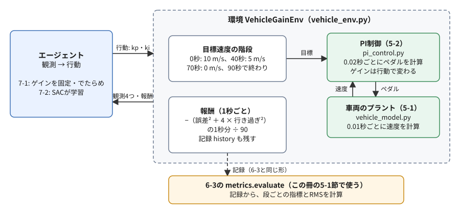
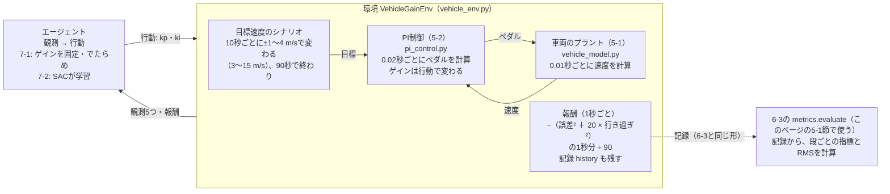

# フェーズ7-1 手順書: 車両の環境を作る（PI制御のゲインを選ぶ環境）

[`docs/learning_plan.md`](learning_plan.md) フェーズ7の7-1（[`docs/idea_origin.md`](idea_origin.md) ステップ6）に対応する。フェーズ5-1の車両のプラントと、フェーズ5-2のPI制御を、Gymnasiumの環境として包む。目標速度は、10秒ごとにランダムな幅で上がったり下がったりする。エージェントは、決めた間隔ごとにPI制御のゲイン（`kp`・`ki`）を選び、環境は追従の良し悪しを報酬として返す。このページでは、環境を作ってSB3の `check_env` で点検し、ゲインを固定した方策やでたらめな方策で動かして、報酬の性質と、プラントによって最もよいゲインが変わることを確かめるところまでを扱う。強化学習でゲインを学ばせるのは、次の7-2である。

- 想定環境: WSL2 + Ubuntu 24.04 + ROS2 Jazzy（学習はROS2を使わず、ワークスペースのコードだけを借りる）
- 前提: フェーズ7-0（[`docs/phase7_0_rl_intro.md`](phase7_0_rl_intro.md)）。フェーズ6-3（[`docs/phase6_3_metrics.md`](phase6_3_metrics.md)）までを終え、`~/ros2_ws` の `learn_py` に、5-1の `vehicle_model.py`・5-2の `pi_control.py`・6-3の `metrics.py` があり、ビルドしてあること
- 所要目安: 2コマ
- 言語: Python（ROS2のノードは書かない）

> **この手順書の位置づけ（暫定）**: フェーズ7は作成中で、構成を大きく改める可能性がある。このページの環境の設計（シナリオ・観測・行動・報酬）も、7-2以降で学習させる中で見直すことがある。

> **進め方**: 1節で全体像を見て、2節で環境の設計（何を観測し、何を選ばせ、どんな目標速度で走らせ、何を報酬にするか）を決める。3節で、ワークスペースのコードを仮想環境から読み込めるようにする。4節で環境のクラスを書き、5節で点検して動かす。サンプルは学習の手がかりとして最小限に書いたもので、公式の文書の転載ではない。Gymnasiumの環境の決まりごとは、公式の文書（Create a Custom Environment）を自分の言葉でまとめた。

> **実行環境が無くても読めるように**: 実行する手順の直後には「期待する結果」として、表示される内容の例とその読み方を載せている。**期待する結果は、筆者の環境（2026-10-03。SB3 2.9.0・Gymnasium 1.3.0。導入は [`docs/setup_rl_sb3.md`](setup_rl_sb3.md)）で、各スクリプトを実際に実行した表示**である。作成時は、ワークスペースをビルドする代わりに、5-1・5-2・6-3の手順書のコードと同じ3つのファイルを置いたフォルダを、環境変数 `PYTHONPATH` に加えて読み込んだ（3節の `source` が行うのと同じ仕組み）。目標速度のシナリオは乱数の種で決まるので、報酬と指標の値は、同じ版なら何度実行しても同じになる。このページの5-3節の学習の途中経過の表は、PCとライブラリの版によって変わることがあり、同じPCと同じ版なら `rollout/`・`train/` の値は同じになるが、`time/` の行（かかった時間）は実行ごとに変わる。

## 0. 学習目標と完了条件

1. Gymnasiumの環境のクラスが持つべきもの（観測と行動の空間、`reset`、`step`）を説明し、自分で書ける。
2. 車両の環境の観測・行動・報酬・エピソードを、フェーズ5・6の部品に当てはめて説明できる。
3. 目標速度をランダムに変えるシナリオにする理由と、乱数の種でシナリオを再現する方法を説明できる。
4. 行動を−1〜1にそろえる理由と、報酬の合計（収益）とフェーズ6-3のRMSの関係を説明できる。
5. SB3の `check_env` で環境を点検し、ゲインを固定した方策とでたらめな方策の収益を、複数のシナリオで比べられる。

完了条件: 5節で、`check_env` が通り、1つのシナリオを既定のゲイン（`kp` 0.5・`ki` 0.1）で走らせた結果を、6-3の指標で読める。そのうえで、ゲインと収益の表から、既定のプラントでは既定のゲインが最もよい組に近いのに対し、ブレーキの遅いプラントでは最もよいゲインが大きく変わることを説明できる。

## 1. 全体像

フェーズ5-2では、PI制御のゲインを、式から目安を立て、シミュレーションで確かめながら手で決めた。フェーズ5-2の6-5節では、ブレーキの時定数を変えると、同じゲインでも減速で行き過ぎることを見た。時定数が変わるたびに人がゲインを調整し直すのは手間がかかる。この調整を、強化学習のエージェントに任せられないか。これが、フェーズ7-1・7-2の題材である。

エージェントに試行錯誤させるには、まず「試す場所」が要る。フェーズ7-0の振り子では、Gymnasiumが環境を用意してくれていた。車両では、自分で環境を作る。と言っても、中身を一から書くわけではない。プラントの計算（5-1の `VehicleModel`）も、PI制御の計算（5-2の `PIController`）も、ROS2を使わないクラスとしてすでにある。このページでは、それらを「エージェントが行動を選び、環境が観測と報酬を返す」という強化学習の形に包む。

もう1つ考えるのが、どんな目標速度で走らせるかである。フェーズ6で記録した目標速度の階段（10 m/sまで加速し、5 m/s、0 m/sと下げる）は、毎回同じ1通りだった。同じ1通りの走り方だけで調整すると、その走り方にだけ合ったゲインになりかねない。実際の道では、前の車に合わせて、速度を少し上げたり下げたりすることが多い。そこでこのページでは、走るたびに、目標速度が10秒ごとにランダムな幅で上下する「シナリオ」を作る。



<details>
<summary>同じ図（mermaid版）</summary>



</details>

- エージェントが選ぶのは、ペダルではなく**ゲイン**である。ペダルは、これまでどおりPI制御が0.02秒ごとに計算する。エージェントは1秒ごとに、そのPI制御のゲインを選び直す。
- 環境の中の計算は、フェーズ5-2の4-2節の `closed_loop_sim.py` と同じ（プラントを0.01秒、制御を0.02秒ごとに進める）。違うのは、目標速度をシナリオから取ることと、1秒ごとに外からゲインを受け取ることと、報酬を計算して返すことである。
- 環境は、計算した速度の並びを、フェーズ6-3の4節の `metrics.py` と同じ形（時刻・目標・速度・ペダル）で残す。こうしておくと、6-3の指標の関数をそのまま当てはめて、段ごとの行き過ぎ量や整定時間を読める（このページの5-1節）。

## 2. 環境の設計

### 2-1. Gymnasiumの環境の決まりごと

Gymnasiumの環境は、クラス `gymnasium.Env` を受け継いだクラスとして書く。フェーズ7-0の3節で、用意された環境を `reset` と `step` で動かした。自分で環境を書くときは、その2つと、観測・行動の範囲を、自分で用意する。公式の文書（Create a Custom Environment）が示す決まりごとを、このページに要る範囲でまとめる。

| 用意するもの | 役割 |
|---|---|
| `self.observation_space` | 観測の形と範囲。連続値なら `spaces.Box(low, high, shape, dtype)` |
| `self.action_space` | 行動の形と範囲。同じく `spaces.Box` |
| `reset(seed=None, options=None)` | 新しいエピソードを始め、`(最初の観測, info)` を返す。最初に `super().reset(seed=seed)` を呼ぶ（環境の乱数 `self.np_random` の種が決まる） |
| `step(action)` | 行動を1回受け取って環境を進め、`(観測, 報酬, terminated, truncated, info)` の5つを返す（7-0の3-1節と同じ） |

`info` は、学習には使わない付加的な情報を入れる辞書である。このページでは、選んだゲインや、報酬の内訳を入れる。

環境の中で乱数を使うときは、Pythonの `random` やnumpyの共通の乱数ではなく、`self.np_random` を使う。`reset(seed=0)` のように種を渡すと `self.np_random` が作り直され、同じ種なら同じ乱数の並びになる。このページの環境は、目標速度のシナリオをこの乱数で作るので、種を決めれば同じシナリオを何度でも再現できる（2-4節）。

環境を書いたら、SB3の **`check_env`** で点検する。`check_env` は、空間の定義、`reset`・`step` の戻り値の形、観測が空間の範囲に収まっているかを確かめ、決まりごとから外れていればエラーで、SB3で学習しにくい作りなら警告で知らせる（SB3の公式の文書「Using Custom Environments」）。

### 2-2. 観測・行動・報酬・エピソード

フェーズ7-0の2-2節の用語の表に、このページの環境を当てはめる。

| 用語 | このページの環境 |
|---|---|
| エージェント | ゲインを選ぶもの（このページでは、ゲインを固定した方策とでたらめな方策。7-2でSACに学習させる） |
| 環境 | 目標速度のシナリオ・PI制御・車両のプラントを、まとめて計算するもの |
| 行動 | PI制御のゲイン `kp`（0〜2）と `ki`（0〜0.5）。環境には−1〜1の2つの数で渡す（2-3節） |
| 観測 | 目標速度・現在速度・偏差（どれも10 m/sで割る）、PI制御の積分の項、次に目標が変わるまでの時間（10秒で割る）の5つ |
| 報酬 | 1秒ごとに、誤差の二乗と行き過ぎの二乗から計算する負の数（2-5節） |
| ステップ | 1秒（ゲインを選ぶ間隔。引数 `decision_interval` で変えられる） |
| エピソード | 1つのシナリオを最後まで走る、90秒（90ステップ）。走り切ると `terminated`（課題の終わり）で終わる（2-6節） |
| 方策 | 観測からゲインを選ぶ規則（このページでは、いつも同じゲインを返す規則と、でたらめに選ぶ規則。7-2ではSACのNN） |
| 収益 | 1エピソード（90ステップ）の報酬の合計（2-5節で、RMSとの関係を示す） |

**なぜペダルではなくゲインを選ばせるのか**: エージェントにペダルを直接選ばせれば、PI制御そのものをNNに置き換えることになる。これはフェーズ7-4（[`docs/phase7_4_gz_nn_policy.md`](phase7_4_gz_nn_policy.md)）で扱う。その学習の環境は、フェーズ7-3（[`docs/phase7_3_gazebo_env.md`](phase7_3_gazebo_env.md)）で、フェーズ5-4のGazeboの車両を使って作る。ゲインを選ばせる形なら、制御の仕組み（PI制御）は人が理解できるまま残り、エージェントはその調整だけを受け持つ。フェーズ5-2で人が行った調整を、エージェントに置き換える形である。

**なぜ一定の間隔ごとに選び直すのか**: 間隔を1秒にすると、エージェントは、走っている途中の状況（目標が変わった直後か、落ち着いた後か）を見てゲインを変えられる。間隔をエピソード全体（90秒）にすれば、エピソードの始めに1組だけ選ぶ形になる（このページの5-2節と7-2で使う）。1つの環境で、両方の形を試せる。この教材では、1秒ごとに選び直す形は、環境が学習の流れにつながることを確かめる（このページの5-1節・5-3節）のに使う。

**観測に積分の項を入れる理由**: PI制御は、積分の項という「記憶」を持っている（フェーズ5-2の2-1節）。同じ目標と速度でも、積分の項が違えば、PI制御が出すペダルは違う。エージェントがゲインを選ぶときに、その記憶の状態を見られるように、観測に入れた。

**観測に、次に目標が変わるまでの時間を入れる理由**: 目標速度は10秒ごとに変わり、90秒でエピソードが終わる。時刻が観測に無いと、エージェントは、例えば12秒と18秒の状態（どちらも目標に近づいた車両）を区別できない。しかし、次の変わり目までの長さが違うので、その先に受け取る報酬も違う。Gymnasiumの公式の文書（Handling Time Limits）は、長さの決まった課題では、残りの時間を観測に入れる必要があると述べている。この環境では、次に目標が変わるか、エピソードが終わるまでの秒数を10で割って、0〜1の数として入れる。

**観測を10 m/sで割る理由**: SB3の公式の文書（Reinforcement Learning Tips and Tricks）は、範囲が分かっているなら観測を正規化（およそ−1〜1の大きさにそろえること）するよう勧めている。NNは、入力の大きさがそろっているほうが学びやすいためである。目標と速度は0〜20 m/s程度なので10で割り、積分の項は、もともとペダルと同じ−1〜1程度の大きさなので、そのまま使う。観測の空間は、余裕をみて−5〜5とした。

### 2-3. 行動を−1〜1にそろえる

ゲインの範囲は `kp` が0〜2、`ki` が0〜0.5だが、環境が受け取る行動は、どちらも−1〜1の数にする。環境の中で、次の式でゲインに引き延ばす。

$$
K_p = \frac{a_0 + 1}{2} \times 2.0, \qquad K_i = \frac{a_1 + 1}{2} \times 0.5
$$

$a_0$・ $a_1$ が行動の2つの数である。−1が下限（0）、1が上限、0がちょうど真ん中にあたる。既定のゲイン（`kp` 0.5・`ki` 0.1）は、行動では $a_0 = -0.5$ 、 $a_1 = -0.6$ になる。

SB3の公式の文書（Tips and Tricks）は、連続値の行動の範囲を、−1〜1の対称な範囲にそろえるよう勧めている。範囲がそろっていないと、学習の初めの探索がかたよったり、範囲の端に張り付いたりして、学習がうまく進まないことがあり、原因にも気づきにくいからである。範囲をそろえても、環境の中で引き延ばせば、選べるゲインは制限されない。`check_env` も、行動の範囲が−1〜1でなければ警告を出す（このページの5-1節の末尾の課題1で確かめる）。

選べる範囲を `kp` 0〜2、`ki` 0〜0.5にしたのは、既定のゲイン（0.5・0.1）を含み、フェーズ5-2の4-2節で振動した `kp` 5.0・`ki` 2.0は含まない範囲にするためである。範囲を広げすぎると、エージェントは意味の無い領域の試行に時間を使う。

### 2-4. 目標速度のシナリオ

1つのエピソードの目標速度は、次のように作る。

- 最初の目標を、5〜12 m/sの間でランダムに決める。車両は、最初からその速度で落ち着いて走っている状態から始める。
- 10秒、20秒、…、80秒の8回、目標を、1〜4 m/sのランダムな幅で、ランダムな向き（上げるか下げるか）に変える。
- 目標は3〜15 m/sの範囲に収める。変えた先が範囲から出るなら、向きを逆にする。
- 90秒で終わる。

この形にした理由は3つある。

- **毎回違う走り方にする**: 1通りのシナリオだけで調整すると、その走り方にだけ合ったゲインになりかねない。シナリオを乱数で作れば、上げる段と下げる段、小さな段と大きな段が混ざった、いろいろな走り方で良し悪しを測れる。
- **ゲインの差が表れる大きさの段にする**: 0 → 10 m/sのような大きな段では、アクセルを踏み切っている（ペダルが+1に張り付いている）時間が長い（フェーズ6-3の7-2節の比較表で、6.08秒）。張り付いている間は、ゲインを変えてもペダルは変わらないので、その間の誤差はゲインでは減らせない。段の幅を1〜4 m/sにすると、張り付く時間が短くなり、ゲインの良し悪しが追従に表れやすい（段の幅を大きくした場合は、このページの5-1節の末尾の課題2で確かめる）。
- **落ち着いた状態から始める**: 止まった車両から始めると、最初の加速の大きな段が、どのエピソードにも入る。最初の目標の速度で落ち着いた状態（速度が変わらず、ペダルが一定）から始めれば、すべての段が「走っている途中の、目標の変更」になる。

シナリオの乱数には、2-1節の `self.np_random` を使う。`reset(seed=0)` で始めれば、何度実行しても、同じ種のシナリオは同じになる。このページでは、方策の良し悪しを、種0〜19の20通りのシナリオの収益の平均で比べる。

### 2-5. 報酬

報酬は、フェーズ6-3の9節で考えた2つの案を合わせた形にした。全体の1つの数（RMSの二乗にあたる、誤差の二乗の平均）に、行き過ぎの減点を重み付きで足す。1秒（1ステップ）ごとに、その1秒の間の誤差 $e = r - v$（目標 − 速度）と、行き過ぎ $o$ を、0.01秒ごとに積み上げる。

$$
\text{報酬} = -\frac{1}{90} \sum_{\text{その1秒の間}} \left( e^2 + 20 o^2 \right) \Delta t
$$

- $\Delta t$ はプラントの刻み幅（0.01秒）、90はエピソードの長さ（秒）である。
- **行き過ぎ** $o$ は、目標が変わった向きに、速度が目標を超えた量である（超えていなければ0）。目標を上げた段では「速度 − 目標」、下げた段では「目標 − 速度」の正の部分になる。フェーズ6-3の2-2節の行き過ぎ量と同じ向きの考え方で、こちらは割合ではなく速度の差（m/s）のまま使う。最初の10秒は、目標がまだ変わっていないので、行き過ぎは数えない。
- 目標を超えた側の誤差は、 $e^2 + 20 o^2 = 21 e^2$ となり、21倍重く数えることになる。目標に届かない側の誤差は、 $o = 0$ なので $e^2$ のままである。

**収益とRMSの関係**: 1エピソードの報酬を全部足すと、90秒全体で $e^2 + 20 o^2$ を積み上げて90で割った量のマイナスになる。つまり、誤差の二乗の90秒の平均に、行き過ぎの二乗の90秒の平均の20倍を足したもののマイナスである。

$$
\text{収益} = -\left( \text{誤差の二乗の平均} + 20 \times \text{行き過ぎの二乗の平均} \right)
$$

収益が大きい（0に近い）ほど、追従がよい。報酬を90で割ったのは、収益を、エピソードの長さによらない「平均」の大きさにそろえるためである。フェーズ6-3のRMSとの対応は、このページの5-1節で、実際の値で確かめる。

> **補足: 報酬の重みの決め方**
>
> - **一般的な考え方**: 報酬に複数の項を足し合わせるとき、それぞれの重みは「何をどれだけ嫌うか」という設計者の判断である。強化学習のエージェントは、報酬を大きくすることだけを目指すので、報酬に入れなかった性質（例: 乗り心地）は気にしないし、重みの比のとおりに性質を取引する。
> - **この環境で重みを20にした理由**: フェーズ6-3の7-2節の比較表のとおり、RMSだけでは「行き過ぎるが速い」と「行き過ぎないが遅い」の区別がつかない。車両では、目標を超える（前の車に近づきすぎる）ほうが、届かないより困ることが多い。そこで、行き過ぎを大きく減点するように、筆者が目安として20を選んだ。重みを変えると、選ばれるゲインと、追従の速さと行き過ぎのバランスが変わる。これは7-2で確かめる。
> - **実務の目安**: 重みは、学習させた結果の振る舞い（行き過ぎ量・整定時間などの指標）を見て調整する。報酬の値だけを見ていると、重みを変えたことによる見かけの改善と、本当の改善を取り違えやすい。そのため、報酬とは別に、6-3の指標のような「人が読める数」で結果を確かめる。

### 2-6. エピソードの終わり方

この環境には、失敗して終わる条件（フェーズ7-0の3-1節のCartPoleで、棒が倒れる、のようなもの）が無い。エピソードは常に、シナリオを最後まで走り切った90秒で終わる。このとき、`step` は `terminated`（課題の終わり）を `True` にして返す。

フェーズ7-0の2-3節で見たとおり、Gymnasiumは終わり方を2つに分け、学習のアルゴリズムはこの2つを違うものとして扱う。振り子は、本来はいつまでも続けられる課題を、200ステップで区切っているだけなので、`truncated`（時間切れ）だった。アルゴリズムは「この先も報酬が続いていたはず」とみなし、終わりの観測からの見込み（その先の収益の見積もり）を収益に足し込んで学ぶ。一方、この環境の90秒は、走るシナリオそのものの終わりで、その先に続きは無い。そのため `terminated` にする。2-2節で、残りの時間を観測に入れたのも、この終わり方に合わせたものである。エージェントは、観測から「あと何秒で終わるか」が分かる。

## 3. ワークスペースのコードを読み込めるようにする

環境は、5-1の `vehicle_model.py`、5-2の `pi_control.py`、6-3の `metrics.py` を、`learn_py` パッケージから読み込む。この3つは `rclpy` を使わないので、ROS2のノードを起動しなくても、Pythonの普通のモジュールとして読み込める。ROS2の一式（5-3・5-4）と同じファイルを使うので、7-2以降で学んだゲインをROS2の一式で確かめるときに、計算の食い違いが起きない。

`learn_py` を読み込めるようにするのは、ワークスペースの `install/setup.bash` である。`source` すると、環境変数 `PYTHONPATH`（Pythonがモジュールを探す場所の一覧）に、ワークスペースのPythonのパッケージの場所が加わる。仮想環境を有効にしても `PYTHONPATH` は残るので、仮想環境のPythonからも `learn_py` が見える（[強化学習の環境構築の5節](setup_rl_sb3.md)）。

ビルドは、これまでどおり、仮想環境を有効に**していない**ターミナルで行う（環境構築の5節）。5-1・5-2・6-3のファイルをビルド済みなら、ビルドし直す必要はない。強化学習のスクリプトを動かすターミナルでは、次のように準備する。

```bash
source ~/ros2_ws/install/setup.bash

source ~/rl_venv/bin/activate

cd ~/rl_practice

python -c "from learn_py.vehicle_model import VehicleModel; from learn_py.pi_control import PIController; from learn_py.metrics import evaluate; print('learn_py: OK')"
```

**期待する結果**:

```text
learn_py: OK
```

プロンプトの先頭に `(rl_venv)` が付き、`learn_py: OK` と表示されれば、仮想環境のPythonから、ワークスペースの3つのモジュールを読み込めている。このページのスクリプトは、7-0と同じ練習用のフォルダ `~/rl_practice` に置く。新しいターミナルを開いたら、最初の2つの `source` からやり直す。

## 4. 環境のクラス（`vehicle_env.py`）

ファイル: `~/rl_practice/vehicle_env.py`（ファイルの置き方は [サンプルコードを練習環境に置く方法](howto_place_code.md)）

```python
# 5-1の車両のプラントと5-2のPI制御を、Gymnasiumの環境として包む（ROS2を使わない）。
# 目標速度は10秒ごとにランダムな幅で変わり、エージェントは決めた間隔ごとにPI制御のゲイン（kp・ki）を選び直す。
import gymnasium as gym
import numpy as np
from gymnasium import spaces

from learn_py.pi_control import PIController
from learn_py.vehicle_model import GRAVITY, VehicleModel, VehicleParams

PLANT_DT = 0.01        # プラントの計算の刻み幅 [s]（5-2の closed_loop_sim と同じ）
CONTROL_PERIOD = 0.02  # 制御の周期 [s]（5-2の closed_loop_sim と同じ）
KP_MAX = 2.0           # 選べる kp の上限（下限は0）
KI_MAX = 0.5           # 選べる ki の上限（下限は0）
EPISODE_LENGTH = 90.0  # エピソードの長さ [s]
CHANGE_INTERVAL = 10.0             # 目標速度を変える間隔 [s]（10秒、20秒、…、80秒の8回）
FIRST_TARGET = (5.0, 12.0)         # 最初の目標速度の範囲 [m/s]
TARGET_MIN, TARGET_MAX = 3.0, 15.0  # 目標速度の範囲 [m/s]


# 行動（-1〜1の2つの数）を、ゲイン（kp・ki）に引き延ばす。
def action_to_gains(action):
    a = np.clip(action, -1.0, 1.0)
    return (a[0] + 1.0) / 2.0 * KP_MAX, (a[1] + 1.0) / 2.0 * KI_MAX


# ゲイン（kp・ki）を、行動（-1〜1の2つの数）に直す。action_to_gains の逆。
def gains_to_action(kp, ki):
    return np.array([kp / KP_MAX * 2.0 - 1.0, ki / KI_MAX * 2.0 - 1.0], dtype=np.float32)


# 乱数 rng で、目標速度の並び（最初の目標と、10秒ごとに変わった後の目標）を作る。
def make_targets(rng, step_range):
    targets = [rng.uniform(*FIRST_TARGET)]
    for _ in range(round(EPISODE_LENGTH / CHANGE_INTERVAL) - 1):
        delta = rng.uniform(*step_range) * rng.choice([-1.0, 1.0])
        if not TARGET_MIN <= targets[-1] + delta <= TARGET_MAX:
            delta = -delta  # 範囲から出るなら、向きを逆にする
        # 逆にしても出る（幅が大きい）ときは、範囲の端にそろえる
        targets.append(float(np.clip(targets[-1] + delta, TARGET_MIN, TARGET_MAX)))
    return targets


# 車両のPI制御のゲインを選ぶ環境。観測は目標・速度・偏差・積分の項・次の変わり目までの時間の5つ、行動はゲイン2つ。
class VehicleGainEnv(gym.Env):
    # decision_interval 秒ごとにゲインを選ぶ。overshoot_weight は行き過ぎの重み、step_range は目標を変える幅 [m/s]。
    def __init__(self, decision_interval=1.0, overshoot_weight=20.0, step_range=(1.0, 4.0), params=None):
        self.decision_interval = decision_interval
        self.overshoot_weight = overshoot_weight
        self.step_range = step_range
        self.params = params if params is not None else VehicleParams()
        self.observation_space = spaces.Box(low=-5.0, high=5.0, shape=(5,), dtype=np.float32)
        self.action_space = spaces.Box(low=-1.0, high=1.0, shape=(2,), dtype=np.float32)

    # 目標速度の並びを乱数で作り、最初の目標の速度で落ち着いた車両から、新しいエピソードを始める。
    def reset(self, seed=None, options=None):
        super().reset(seed=seed)
        self.targets = make_targets(self.np_random, self.step_range)
        p = self.params
        self.plant = VehicleModel(p)
        self.plant.velocity = self.targets[0]
        # 速度が変わらない釣り合い: 駆動力 = 転がり抵抗 + 速度に比例する抵抗（5-1の2節の式）
        self.plant.drive_force = p.rolling_coeff * p.mass * GRAVITY + p.drag_coeff * self.targets[0]
        self.controller = PIController(kp=0.0, ki=0.0)
        self.controller.integral = self.plant.drive_force / p.drive_force_max  # 釣り合いのペダル
        self.step_count = 0  # プラントを進めた回数（時刻は step_count × PLANT_DT）
        self.pedal = self.controller.integral
        self.history = []    # (時刻, 目標, 速度, ペダル) の並び。6-3の metrics.evaluate に渡せる
        return self._observation(), {}

    # 時刻 t の段の番号（最初の段が0、10秒からが1、…、80秒からが8）。
    def _segment(self, t):
        return min(int((t + 1e-9) // CHANGE_INTERVAL), len(self.targets) - 1)

    # ゲインを行動のとおりに変え、decision_interval 秒分を計算して、報酬を返す。
    def step(self, action):
        kp, ki = action_to_gains(action)
        self.controller.kp = kp
        self.controller.ki = ki
        steps_per_control = round(CONTROL_PERIOD / PLANT_DT)
        squared_error = 0.0
        squared_overshoot = 0.0
        for _ in range(round(self.decision_interval / PLANT_DT)):
            t = self.step_count * PLANT_DT
            k = self._segment(t)
            target = self.targets[k]
            if self.step_count % steps_per_control == 0:
                self.pedal = self.controller.update(target - self.plant.velocity, CONTROL_PERIOD)
            self.history.append((round(t, 2), target, self.plant.velocity, self.pedal))
            error = target - self.plant.velocity
            # 目標が変わった向き（最初の段は変わっていないので0）に、速度が目標を超えた量
            direction = 0.0 if k == 0 else np.sign(target - self.targets[k - 1])
            overshoot = max(0.0, -error * direction)
            squared_error += error ** 2 * PLANT_DT
            squared_overshoot += overshoot ** 2 * PLANT_DT
            self.plant.step(self.pedal, PLANT_DT)
            self.step_count += 1
        # 報酬: 誤差の二乗と、目標を超えた分の二乗（重み付き）の、エピソードの長さあたりの量のマイナス
        reward = -(squared_error + self.overshoot_weight * squared_overshoot) / EPISODE_LENGTH
        terminated = self.step_count * PLANT_DT >= EPISODE_LENGTH - 1e-9
        info = {'kp': kp, 'ki': ki,
                'squared_error': squared_error / EPISODE_LENGTH,
                'squared_overshoot': squared_overshoot / EPISODE_LENGTH}
        return self._observation(), float(reward), terminated, False, info

    # 観測: 目標・速度・偏差（どれも10 m/sで割る）、PI制御の積分の項、次に目標が変わるかエピソードが終わるまでの時間（10秒で割る）。
    def _observation(self):
        t = self.step_count * PLANT_DT
        target = self.targets[self._segment(t)]
        v = self.plant.velocity
        remaining = (min(EPISODE_LENGTH, (self._segment(t) + 1) * CHANGE_INTERVAL) - t) / CHANGE_INTERVAL
        obs = np.array([target / 10.0, v / 10.0, (target - v) / 10.0,
                        self.controller.integral, remaining], dtype=np.float32)
        return np.clip(obs, -5.0, 5.0)
```

**`vehicle_env.py` の解説**

- **定数**: `PLANT_DT`・`CONTROL_PERIOD` は、フェーズ5-2の4-2節の `closed_loop_sim.py` と同じ値。`EPISODE_LENGTH` から `TARGET_MIN`・`TARGET_MAX` までが、2-4節のシナリオの決まりである。
- **`action_to_gains`・`gains_to_action`**: 2-3節の式と、その逆。`gains_to_action` は、「このゲインを選ぶ行動」を作るときに使う（5節で、ゲインを固定した方策を作るのに使う）。`action_to_gains` の `np.clip` は、範囲の外の行動が来ても、ゲインを範囲の端に収める。
- **`make_targets`**: 2-4節のシナリオの目標の並び（最初の目標と、8回変わった後の目標の、9つの数）を作る。`rng.uniform(a, b)` はa〜bの一様な乱数、`rng.choice([-1.0, 1.0])` は向きを決める。幅が1〜4 m/sなら、向きを逆にすれば必ず3〜15 m/sに収まる。逆にしても出るのは、幅を範囲の半分（6 m/s）より大きくした場合だけで、そのときは `np.clip` で範囲の端にそろえる（このページの5-1節の末尾の課題2）。
- **`__init__`**: 2-1節の表の2つの空間を作る。観測は5つの数で範囲は−5〜5、行動は2つの数で範囲は−1〜1。`overshoot_weight` は2-5節の重み、`step_range` は2-4節の段の幅で、引数で変えられる。`params` で、プラントのパラメータ（5-1の `VehicleParams`。時定数など）を変えられる（このページの5-2節で、ブレーキの遅いプラントを作るのに使う）。
- **`reset`**:
  - 最初に `super().reset(seed=seed)` を呼び、その後の `self.np_random` で、シナリオの目標の並びを作る（2-1節）。
  - 車両を、最初の目標の速度で落ち着いた状態にする。速度が変わらないのは、フェーズ5-1の2節の式で、駆動力が抵抗（転がり抵抗と、速度に比例する抵抗）とちょうど釣り合うときである。そこで、プラントの速度と駆動力をその値にそろえる。
  - PI制御器の積分の項も、釣り合いの駆動力を出すペダル（駆動力 ÷ 最大の駆動力）にそろえる。偏差が0なら、PI制御器のペダルは積分の項そのもの（フェーズ5-2の4-1節）なので、最初の計算からこのペダルが出て、車両は落ち着いたまま走る。ゲインは、最初の `step` で行動から決まるので、ここでは0にしておく。
- **`_segment`**: 時刻 `t` が何番目の段かを返す。10秒で割った商が段の番号で、80秒より後（と、終わりの90秒ちょうど）は最後の段（8）にする。`1e-9` は、小数の計算の誤差で、10秒ちょうどがわずかに前の段に入るのを防ぐ。
- **`step`**: 2-5節の報酬を計算する部分が、`closed_loop_sim.py` の `simulate` に加わったものである。
  - 最初に、行動からゲインを求め、PI制御器の `kp`・`ki` を書き換える。フェーズ5-2の4-1節の `PIController` は、積分の項に $K_i$ を掛けた値を持っているので、ここで `ki` を変えても、それまでに育った積分の項は変わらず、ペダルが急に跳ねない（5-2の4-1節の解説の最後の項目）。
  - `decision_interval` 秒分（既定では100回）、プラントを0.01秒ずつ進める。2回に1回（0.02秒ごと）だけ、PI制御器がペダルを計算し直す。
  - 0.01秒ごとに、誤差の二乗と行き過ぎの二乗を、刻み幅を掛けて積み上げる（2-5節の式の $\sum (\cdots) \Delta t$）。`direction` は、その段で目標が変わった向き（上げたら1、下げたら−1、最初の段は0）で、行き過ぎ `overshoot` は `-error * direction` の正の部分である。最初の段は `direction` が0なので、行き過ぎは数えない。
  - `terminated` は、時刻が90秒に達したら `True` にする（2-6節）。`truncated` は、常に `False`。
  - `info` には、選んだゲインと、報酬の内訳（誤差の二乗の分と、行き過ぎの二乗の分。どちらも90で割った値。重みは掛けていない）を入れる。
- **`_observation`**: 観測の5つの数を作る（2-2節）。5つめの `remaining` は、次の段の始まり（最後の段では、エピソードの終わりの90秒）までの秒数を10で割ったもので、段の始まりで1、終わりで0に近づく。`np.float32` で作り、`np.clip` で観測の空間（−5〜5）に収める。観測が空間の外に出ると、`check_env` が誤りとして知らせる。

## 5. 点検して動かす

### 5-1. `check_env` で点検し、方策を比べる

ファイル: `~/rl_practice/check_vehicle_env.py`

```python
# 車両の環境を check_env で点検し、ゲインを固定した方策とでたらめな方策で動かして比べる。
import numpy as np
from stable_baselines3.common.env_checker import check_env

from learn_py.metrics import evaluate, format_report
from vehicle_env import VehicleGainEnv, gains_to_action

SEEDS = range(20)  # 比べるシナリオ（乱数の種）の並び


# 方策 policy で、種 seed のシナリオを1エピソード動かし、収益を返す。
def run_episode(env, policy, seed):
    obs, info = env.reset(seed=seed)
    total = 0.0
    while True:
        obs, reward, terminated, truncated, info = env.step(policy(obs))
        total += reward
        if terminated or truncated:
            return total


# 点検 → 種0のシナリオを既定のゲインで1エピソード → 20通りのシナリオでの方策の比較、の順に行う。
def main():
    env = VehicleGainEnv()
    check_env(env)
    print('check_env: OK')
    print('observation_space:', env.observation_space)
    print('action_space     :', env.action_space)
    obs, info = env.reset(seed=0)
    print('targets          :', np.round(env.targets, 2))
    print('first observation:', obs)

    kp0, ki0 = 0.5, 0.1  # 比べる基準のゲイン（5-2の既定）
    default = gains_to_action(kp0, ki0)
    total = run_episode(env, lambda obs: default, seed=0)
    print(f'\nseed 0, kp={kp0}, ki={ki0}: return {total:.3f}')
    times, targets, velocities, pedals = (list(c) for c in zip(*env.history))
    for line in format_report(*evaluate(times, targets, velocities, pedals)):
        print('  ' + line)

    env.action_space.seed(0)
    policies = {
        f'kp={kp0}, ki={ki0}': lambda obs: default,
        'kp=0.2, ki=0.05': lambda obs: gains_to_action(0.2, 0.05),
        'kp=2.0, ki=0.5': lambda obs: gains_to_action(2.0, 0.5),
        'random': lambda obs: env.action_space.sample(),
    }
    print(f'\npolicy           return (mean, std over {len(SEEDS)} seeds)')
    for name, policy in policies.items():
        returns = [run_episode(env, policy, seed) for seed in SEEDS]
        print(f'{name:15s} {np.mean(returns):7.3f}  {np.std(returns):6.3f}')


if __name__ == '__main__':
    main()
```

- `run_episode` は、フェーズ7-0の3-2節の同じ名前の関数と同じ形で、種 `seed` のシナリオで1エピソード動かし、収益を返す。
- `main` の前半で、`check_env` で点検し、種0のシナリオの目標の並びと、最初の観測を表示する。続けて、そのシナリオを既定のゲインで1エピソード動かし、フェーズ6-3の `evaluate`・`format_report` で段ごとの指標を表示する。記録は落ち着いた状態から始まり、10秒で最初に目標が変わるので、6-3の4節の `main` のように、先頭にサンプルを足す必要はない。
- 後半で、3通りのゲインの組と、でたらめな方策（`env.action_space.sample()`。1秒ごとに、でたらめなゲインを選ぶ）の収益を、種0〜19の20通りのシナリオで測り、平均と標準偏差（ばらつきの大きさ）を表示する。`env.action_space.seed(0)` は、7-0の3-2節と同じく、でたらめな行動の並びを毎回同じにするためのものである。

```bash
python check_vehicle_env.py
```

**期待する結果**:

```text
check_env: OK
observation_space: Box(-5.0, 5.0, (5,), float32)
action_space     : Box(-1.0, 1.0, (2,), float32)
targets          : [ 9.46  7.65  6.6  10.04 12.86  9.67 13.48 10.03  6.46]
first observation: [0.9458732  0.9458732  0.         0.51498246 1.        ]

seed 0, kp=0.5, ki=0.1: return -0.853
  step          over[%]  rise[s]  settle[s]  error  sat[s]
   9.5 ->  7.6     6.79    1.27     5.57   +0.02    0.00
   7.6 ->  6.6    11.78    1.38     8.72   +0.02    0.00
   6.6 -> 10.0     0.00    2.93     8.69   +0.06    2.46
  10.0 -> 12.9     0.00    3.27     9.83   +0.06    2.82
  12.9 ->  9.7     5.13    1.02     4.80   +0.02    0.00
   9.7 -> 13.5     0.00    4.27        -   +0.10    4.04
  13.5 -> 10.0     4.63    1.01     4.55   +0.02    0.06
  10.0 ->  6.5     0.00    0.94     1.79   -0.02    0.22
  RMS error: 0.959 m/s

policy           return (mean, std over 20 seeds)
kp=0.5, ki=0.1   -0.571   0.188
kp=0.2, ki=0.05  -1.574   0.345
kp=2.0, ki=0.5   -0.731   0.212
random           -1.283   1.247
```

- **1〜3行目**: `check_env` が、警告も誤りも出さずに通った。観測と行動の空間は、4節の `__init__` で決めたとおりである。
- **`targets`**: 種0のシナリオの目標の並び。最初は9.46 m/sで、10秒ごとに7.65、6.6、10.04…と変わる。上げる段と下げる段が混ざり、幅は1〜4 m/sの間にある。
- **`first observation`**: 最初の観測は、目標0.946（9.46 m/s ÷ 10）、速度も0.946（落ち着いた状態）、偏差0、積分の項0.515（9.46 m/sで釣り合うペダル）、次の変わり目まで1.0（10秒 ÷ 10）。
- **段ごとの指標**: 最後の段（10.0 → 6.5）を除く下げる段（9.5 → 7.6など）では、既定のプラントでも、4〜12%の行き過ぎがある。既定のゲインの `ki` 0.1は、フェーズ5-2の2-3節で式から求めた目安（`kp` 0.5に対して `ki` 約0.047）の約2倍である。ペダルが張り付かない小さな段では、積分の項が速く育ちすぎて、目標を越えてしまうと考えられる。実際、`ki` を0.047に下げて同じシナリオを走らせると、小さな下げる段（9.5 → 7.6、7.6 → 6.6）の行き過ぎは2%以下になった（筆者が確かめた値）。フェーズ6-3の比較表では、既定のプラントの10 → 5の段の行き過ぎは0%だった。行き過ぎるかどうかは、段の大きさや、そのときの速度によって変わり、この種0のシナリオでも、最後の10.0 → 6.5の段は0%である。上げる段（6.6 → 10.0など）では、行き過ぎは無いが、アクセルを踏み切る時間（`sat[s]`）が2〜4秒ある。9.7 → 13.5の段は、10秒の間に落ち着かない（整定時間が `-`）。速度が高いほど抵抗が大きく、アクセルの余力が小さいので、加速に時間がかかるためである。
- **`return -0.853` とRMS**: 6-3のRMSは、最初に目標が変わった10秒からの80秒で数える（6-3の2-2節の表）。収益は、誤差が0の最初の10秒も含めて90で割る。そのため、行き過ぎが無ければ、収益は $-\frac{80}{90} \times \text{RMS}^2 = -0.889 \times 0.959^2 \approx -0.818$ になるはずである。実際の収益−0.853との差の約0.035が、下げる段の行き過ぎの減点（2-5節の重み20の項）にあたる。
- **最後の表**: 20通りのシナリオの平均で比べると、既定のゲイン（−0.571）が最もよく、`kp` 2.0・`ki` 0.5（−0.731）、でたらめな方策（−1.283）、`kp` 0.2・`ki` 0.05（−1.574）と続く。ゲインが小さすぎると、目標に近づくのが遅く、誤差が長く残る。でたらめな方策は、標準偏差（1.247）が大きく、シナリオによって結果が大きくばらつく。1秒ごとに極端なゲインを選んでしまうと、大きく行き過ぎることがあるためである。

> 課題1: `main` の `env = VehicleGainEnv()` の次の行に、`env.action_space = gym.spaces.Box(low=0.0, high=2.0, shape=(2,), dtype=np.float32)` を足し（ファイルの先頭に `import gymnasium as gym` も足す）、行動の範囲を−1〜1でなくした環境を `check_env` で点検する。`UserWarning: We recommend you to use a symmetric and normalized Box action space (range=[-1, 1])` という警告が出る（2-3節）。確かめたら、足した2行を消して元に戻す。
>
> 課題2: `main` の `env = VehicleGainEnv()` を `env = VehicleGainEnv(step_range=(3.0, 8.0))` に変え、段の幅を3〜8 m/sに大きくする。種0のシナリオの目標は `[ 9.46  5.11  8.19  3.  9.03  3.  10.68  3.6  10.88]` になり、3.0 m/sで範囲の端にそろえられた段がある（4節の `make_targets` の解説）。既定のゲインの収益は−0.853から−4.392に悪くなり、上げる段でアクセルを踏み切る時間が最大5.36秒に延びる。20通りの平均は、既定のゲイン−3.714、`kp` 2.0・`ki` 0.5が−4.022、でたらめな方策−4.316、`kp` 0.2・`ki` 0.05が−5.238になる。既定のゲインと `kp` 2.0・`ki` 0.5の差（0.31）は、幅が1〜4 m/sのときの差（0.16）より大きいが、収益の大きさ（−3.7）に比べると約8%で、1〜4 m/sのとき（約28%）より小さい。段が大きいと、ペダルを踏み切っている間の、ゲインでは減らせない誤差が収益の大部分を占め、ゲインの差が埋もれやすい（2-4節）。確かめたら、`VehicleGainEnv()` に戻す。

### 5-2. ゲインと収益の表を作る

このページの5-1節で、ゲインによって収益が変わることが分かった。ゲインの組を格子状に変えて、収益がどう変わるかを表にする。ここでは、`decision_interval` をエピソードの長さ（90秒）にして、エピソードの始めにゲインを1組だけ選ぶ形にする（2-2節）。プラントは、既定のものと、ブレーキの時定数を1.0秒に遅くしたもの（フェーズ5-2の6-5節、フェーズ6-3の比較表の `tau_brake` 1.0）の2つで比べる。

ファイル: `~/rl_practice/gain_landscape.py`

```python
# エピソード全体で1組のゲインを使う形にして、ゲインの組ごとの収益（20通りのシナリオの平均）を表にする。
import numpy as np

from learn_py.vehicle_model import VehicleParams
from vehicle_env import EPISODE_LENGTH, VehicleGainEnv, gains_to_action

KP_LIST = [0.1, 0.2, 0.3, 0.5, 0.7, 1.0, 2.0]
KI_LIST = [0.0, 0.025, 0.05, 0.1, 0.2, 0.5]
SEEDS = range(20)


# ゲイン kp・ki のまま、20通りのシナリオを1エピソードずつ動かし、収益の平均を返す。
def mean_return(env, kp, ki):
    returns = []
    for seed in SEEDS:
        env.reset(seed=seed)
        obs, reward, terminated, truncated, info = env.step(gains_to_action(kp, ki))
        returns.append(reward)
    return float(np.mean(returns))


# 既定のプラントと、ブレーキの遅いプラントで、ゲインの組ごとの収益を表にし、最もよい組を示す。
def main():
    for name, params in [('default', VehicleParams()),
                         ('tau_brake=1.0', VehicleParams(tau_brake=1.0))]:
        env = VehicleGainEnv(decision_interval=EPISODE_LENGTH, params=params)
        table = {(kp, ki): mean_return(env, kp, ki) for kp in KP_LIST for ki in KI_LIST}
        print(name)
        print('  kp \\ ki' + ''.join(f'{ki:8.3f}' for ki in KI_LIST))
        for kp in KP_LIST:
            print(f'  {kp:6.2f} ' + ''.join(f'{table[(kp, ki)]:8.3f}' for ki in KI_LIST))
        best = max(table, key=table.get)
        print(f'  best: kp={best[0]}, ki={best[1]} ({table[best]:.3f})')


if __name__ == '__main__':
    main()
```

- `mean_return` は、20通りのシナリオのそれぞれで `step` を1回だけ呼び、収益の平均を返す。`decision_interval` が90秒なので、1回の `step` で90秒分を計算し、エピソードが終わる（`terminated` が `True` になる）。1ステップしか無いので、その報酬がそのまま収益になる。
- `'  kp \\ ki'` の `\\` は、文字の `\` を1つ表示するための書き方である（表の左上に「行が `kp`、列が `ki`」と示す）。
- `max(table, key=table.get)` は、辞書 `table` の中で、値（収益）が最も大きいキー（ゲインの組）を返す。

7×6の42組を、20通りのシナリオと2つのプラントで試すので、1分半程度かかる。

```bash
python gain_landscape.py
```

**期待する結果**:

```text
default
  kp \ ki   0.000   0.025   0.050   0.100   0.200   0.500
    0.10   -3.602  -1.940  -6.092 -11.053 -11.371 -15.012
    0.20   -1.705  -0.910  -1.574  -3.369  -4.488  -7.492
    0.30   -1.126  -0.681  -0.740  -1.193  -2.090  -3.839
    0.50   -0.748  -0.564  -0.553  -0.571  -0.693  -1.223
    0.70   -0.642  -0.544  -0.531  -0.529  -0.548  -0.680
    1.00   -0.617  -0.571  -0.560  -0.555  -0.559  -0.588
    2.00   -0.754  -0.747  -0.743  -0.739  -0.734  -0.731
  best: kp=0.7, ki=0.1 (-0.529)
tau_brake=1.0
  kp \ ki   0.000   0.025   0.050   0.100   0.200   0.500
    0.10   -3.602  -1.940  -6.307 -13.736 -22.736 -40.894
    0.20   -1.709  -0.917  -1.623  -4.014  -8.760 -26.075
    0.30   -1.161  -0.731  -0.893  -1.811  -4.542 -15.017
    0.50   -1.075  -0.943  -1.009  -1.253  -2.016  -5.754
    0.70   -1.423  -1.346  -1.359  -1.439  -1.699  -2.948
    1.00   -2.201  -2.162  -2.154  -2.166  -2.239  -2.608
    2.00   -4.098  -4.091  -4.084  -4.073  -4.058  -4.067
  best: kp=0.3, ki=0.025 (-0.731)
```

行が `kp`、列が `ki` で、各欄がそのゲインでの収益（20通りのシナリオの平均）である。最後の `best` が、表の中で最もよい組である。

- **既定のプラント（上の表）**: 最もよいのは `kp` 0.7・`ki` 0.1（−0.529）で、既定のゲイン（`kp` 0.5・`ki` 0.1、−0.571）との差は約7%である。`kp` 0.5〜1.0・`ki` 0.025〜0.2の範囲は、−0.53〜−0.69の間に収まる。既定のゲインは、フェーズ5-2でこのプラントに合わせて決めたので、最もよい組に近い。
- **右上の隅**: `kp` が0.1〜0.2と小さいのに `ki` が大きい組は、とても悪い（例: `kp` 0.1・`ki` 0.5で−15.0）。比例の項が弱いまま積分の項が育ち、ゆっくり大きく行き過ぎては戻る動きになるためである。
- **左の列（`ki` 0）**: `ki` が0でも、P制御だけ（フェーズ5-2の2-2節。目標に届かない偏差が残る）とは少し違う。この環境は、積分の項を最初の目標の速度で釣り合うペダルにそろえて始める（4節の `reset`）。`ki` が0なら積分の項はその値のまま変わらないので、前もって決めた一定の踏み込みとして働く。目標が最初の速度から離れるほど、その踏み込みは合わなくなり、偏差が残る。
- **ブレーキの遅いプラント（下の表）**: 最もよいのは `kp` 0.3・`ki` 0.025（−0.731）で、既定のゲイン（−1.253）より約42%よい。逆に、既定のプラントで最もよかった `kp` 0.7・`ki` 0.1は−1.439で、このプラントの最もよい組の約2倍悪い。`kp` を上げるほど悪くなり、`kp` 2.0では−4.1前後になる。ブレーキの効きが遅れる間に、下げる段で目標を下回り（行き過ぎ）、2-5節の重み20の減点を受けるためである。
- **読み取れること**: 最もよいゲインは、プラントの時定数によって大きく変わる。あるプラントに合わせて手で決めたゲインは、時定数が変わると、最もよい組から大きく外れる。このページでは、表を作って最もよい組を見つけた。表を作らずに、試行錯誤だけで、よいゲインにたどり着けるか。これを、7-2で強化学習のエージェントに任せる。

> 課題3: ブレーキの遅いプラントで最もよかった `kp` 0.3・`ki` 0.025は、どんな追従か。5-1節の `check_vehicle_env.py` を、次の3か所で変えて実行する。ファイルの先頭の `from vehicle_env import ...` の前の行に `from learn_py.vehicle_model import VehicleParams` を足す。`env = VehicleGainEnv()` を `env = VehicleGainEnv(params=VehicleParams(tau_brake=1.0))` にする。`kp0, ki0 = 0.5, 0.1` を `kp0, ki0 = 0.3, 0.025` にする。種0のシナリオの段ごとの指標は、次のようになる。
>
> ```text
> seed 0, kp=0.3, ki=0.025: return -1.080
>   step          over[%]  rise[s]  settle[s]  error  sat[s]
>    9.5 ->  7.6     0.00    2.70     4.93   -0.02    0.00
>    7.6 ->  6.6     0.00    2.85     7.92   -0.02    0.00
>    6.6 -> 10.0     0.00    4.13        -   +0.18    1.68
>   10.0 -> 12.9     0.00    7.88        -   +0.27    1.98
>   12.9 ->  9.7     4.39    2.01     6.62   +0.03    0.00
>    9.7 -> 13.5     0.00    6.19        -   +0.30    3.14
>   13.5 -> 10.0     5.06    1.96     6.66   +0.03    0.00
>   10.0 ->  6.5     4.29    1.62        -   -0.15    0.00
>   RMS error: 1.085 m/s
> ```
>
> 下げる段の行き過ぎ量は約5%以下に抑えられているが、上げる段（6.6 → 10.0、10.0 → 12.9、9.7 → 13.5）は10秒の間に落ち着かず（整定時間が `-`）、段の最後の1秒の速度が、目標に0.18〜0.30 m/s届いていない（`error`）。最後の下げる段（10.0 → 6.5）は、目標を4.29%下回った後に戻りすぎて（段の最後の1秒の速度が目標より0.15 m/s高い）、10秒の間に落ち着かない。重み20の報酬は、行き過ぎを避ける代わりに、目標にゆっくり近づくゲインを選ばせている。追従の速さと行き過ぎのどちらを重く見るかは、重みで変わる（7-2で確かめる）。確かめたら、3か所を元に戻す。

### 5-3. SB3の学習につなぐ

最後に、この環境で、SB3のSACの学習がそのまま動くことを確かめる。学習の成果を見るのは7-2なので、ここでは10エピソード分だけ動かす。

ファイル: `~/rl_practice/smoke_sac.py`

```python
# 車両の環境で、SB3のSACを少しだけ動かし、学習の流れにつながることを確かめる（学習の成果は見ない）。
from stable_baselines3 import SAC

from vehicle_env import VehicleGainEnv


# 10エピソード分（900ステップ）だけ学習させ、途中経過の表を出す。
def main():
    model = SAC('MlpPolicy', VehicleGainEnv(), verbose=1, seed=0)
    model.learn(total_timesteps=900, log_interval=5)


if __name__ == '__main__':
    main()
```

フェーズ7-0の4-2節の `train_sac_pendulum.py` と同じ形で、環境を `gym.make('Pendulum-v1')` から `VehicleGainEnv()` に差し替え、ステップ数を900に減らし、モデルの保存と評価を省いたものである。自分で作った環境も、Gymnasiumの決まりごとに従っていれば、用意された環境と同じようにSB3に渡せる。`seed=0` を渡すと、SB3が環境の乱数の種も決めるので、エピソードごとに違うシナリオが、毎回同じ順に出てくる。

```bash
python smoke_sac.py
```

**期待する結果**（最初の3行と、最後の途中経過の表の抜粋。数は、PCとライブラリの版によって変わる。`time/` の行は実行ごとに変わる）:

```text
Using cpu device
Wrapping the env with a `Monitor` wrapper
Wrapping the env in a DummyVecEnv.
...
| rollout/           |          |
|    ep_len_mean     | 90       |
|    ep_rew_mean     | -1.65    |
| time/              |          |
|    episodes        | 10       |
|    fps             | 85       |
|    time_elapsed    | 10       |
|    total_timesteps | 900      |
| train/             |          |
|    actor_loss      | -5.91    |
|    critic_loss     | 0.0532   |
|    ent_coef        | 0.787    |
|    ent_coef_loss   | -0.804   |
|    learning_rate   | 0.0003   |
|    n_updates       | 799      |
---------------------------------
```

- 途中経過の表は、5エピソードごとに出る（`log_interval=5`）。表の読み方は、フェーズ7-0の4-2節と同じである。
- **`ep_len_mean` 90**: 1エピソードが90ステップ（1秒ごとに90回ゲインを選ぶ）で終わっている。
- **`ep_rew_mean` −1.65**: 10エピソードの収益の平均である。学習の初めは、SACがほぼでたらめに行動を選ぶので、このページの5-1節のでたらめな方策（20通りの平均で−1.283、標準偏差1.247）と同じくらいの値になる。10エピソードでは、まだ学習の成果は見えない。
- この表が出て、誤りなく終われば、環境はSB3の学習の流れにつながっている。学習させてゲインを調整するのは、7-2で行う。

## 6. 本フェーズのまとめ

- Gymnasiumの環境は、観測と行動の空間、`reset`、`step` を用意したクラスとして書く。書いたら、SB3の `check_env` で点検する。乱数は `self.np_random` を使い、種でシナリオを再現できるようにする。
- 車両の環境では、エージェントが1秒ごとにPI制御のゲインを選び、環境の中では、5-2と同じPI制御とプラントの計算が進む。目標速度は、落ち着いた状態から、10秒ごとに1〜4 m/sのランダムな幅で上下する。観測は、目標・速度・偏差・PI制御の積分の項と、次に目標が変わるまでの時間である。
- 行動は−1〜1にそろえ、環境の中でゲインに引き延ばす。観測も、大きさがおよそ−1〜1になるように割る。
- 報酬は、誤差の二乗と、重み20を付けた行き過ぎの二乗のマイナスで、行き過ぎが無ければ、収益は「6-3のRMSの二乗 × 80/90」のマイナスになる。
- ゲインと収益の表から、既定のプラントでは既定のゲインが最もよい組に近いが、ブレーキの遅いプラントでは最もよいゲインが大きく変わり、既定のゲインの収益はその約1.7倍悪いことが分かった。

## 7. つまずきやすい点

| 症状 | 確認すること |
|---|---|
| `ModuleNotFoundError: No module named 'learn_py'` | このターミナルで `source ~/ros2_ws/install/setup.bash` をしたか（3節）。5-1・5-2・6-3のファイルを置いて、`colcon build` をしたか |
| `ModuleNotFoundError: No module named 'gymnasium'`（または `stable_baselines3`） | 仮想環境を有効にしたか（プロンプトに `(rl_venv)` があるか） |
| `No module named 'vehicle_env'` | `~/rl_practice` で実行しているか（`pwd`）。`vehicle_env.py` が同じフォルダにあるか |
| `ImportError: cannot import name 'GRAVITY'` | 5-1の `vehicle_model.py` に、重力加速度の定数 `GRAVITY` があるか（5-1の手順書のコードを写したか） |
| `check_env` が、観測が空間に含まれないという誤りを出す | `_observation` で `dtype=np.float32` にしているか、`np.clip` で−5〜5に収めているか |
| `targets` や収益が、このページの5-1節の期待する結果と違う | `reset` で `super().reset(seed=seed)` を最初に呼び、シナリオを `self.np_random` で作っているか。`make_targets` の乱数の呼び方の順（最初の目標 → 幅 → 向き）を変えていないか。定数（`CHANGE_INTERVAL`・`FIRST_TARGET` など）や引数の既定値（`overshoot_weight`・`step_range`）を変えていないか |
| ROS2のノードが、ビルドし直した後に動かなくなった | 仮想環境を有効にしたまま `colcon build` しなかったか（[強化学習の環境構築の5節](setup_rl_sb3.md)） |

## 8. 次へ

次の7-2（[`docs/phase7_2_gain_tuning.md`](phase7_2_gain_tuning.md)）では、この環境でSACにゲインを選ばせて学習させる。エピソードの始めに1組を選ぶ形（`decision_interval=90.0`）で学習させ、強化学習を使わない格子の探索や、手で決めた既定のゲインと、収益とフェーズ6-3の指標で比べる。あわせて、報酬の重みを変えると、追従の速さと行き過ぎのバランスが変わることを確かめる。

## 9. 公式ドキュメント・参考資料

確認状況（2026-10-03）: 下のページは、実在を確認した（HTTP 200）。2-2節・2-3節のSB3の勧め（観測の正規化、行動を−1〜1にそろえる）は、Tips and Tricksのページの本文で、`check_env` の警告は、導入したSB3 2.9.0のソース（`stable_baselines3/common/env_checker.py`）と実行した表示で確かめた。2-2節の残りの時間を観測に入れることは、Handling Time Limitsのページの本文で確かめた。

- [Gymnasium — Create a Custom Environment](https://gymnasium.farama.org/introduction/create_custom_env/)（2-1節の環境の決まりごと）
- [Gymnasium — Env](https://gymnasium.farama.org/api/env/)（`reset`・`step` の引数と戻り値、`np_random` の詳しい説明）
- [Gymnasium — Handling Time Limits](https://gymnasium.farama.org/tutorials/gymnasium_basics/handling_time_limits/)（2-2節・2-6節の、長さの決まった課題の終わり方と、残りの時間を観測に入れること）
- [Stable-Baselines3 — Using Custom Environments](https://stable-baselines3.readthedocs.io/en/master/guide/custom_env.html)（自作の環境をSB3で使う方法と `check_env`）
- [Stable-Baselines3 — Env Checker](https://stable-baselines3.readthedocs.io/en/master/common/env_checker.html)（`check_env` の引数）
- [Stable-Baselines3 — Reinforcement Learning Tips and Tricks](https://stable-baselines3.readthedocs.io/en/master/guide/rl_tips.html)（自作の環境の注意。観測と行動の正規化、報酬の設計）

> 出典: 2-1節のGymnasiumの環境の決まりごとと、2-2節・2-6節のGymnasiumの時間の扱い、2-2節・2-3節のSB3の勧めは、それぞれの公式の文書を自分の言葉で要約・再構成したもので、逐語の転載ではない。このページの5-1節の課題1の警告の文面は、SB3（Copyright (c) 2019 Antonin Raffin, MIT License）の `check_env` の表示である（MIT Licenseの全文は [`LICENSE-MIT-THIRD-PARTY`](../LICENSE-MIT-THIRD-PARTY)）。このページのサンプルコード（`vehicle_env.py`・`check_vehicle_env.py`・`gain_landscape.py`・`smoke_sac.py`）は独自に書いたもので、フェーズ5-1・5-2・6-3のサンプルを読み込んで使う。
