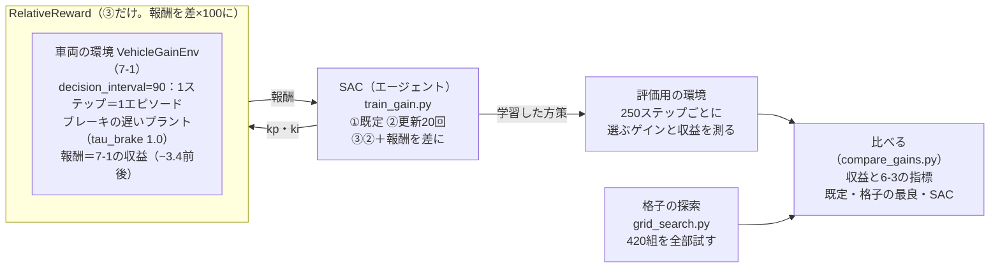

# フェーズ7-2 手順書: 強化学習でゲインを調整する

[`docs/learning_plan.md`](learning_plan.md) フェーズ7の7-2（[`docs/idea_origin.md`](idea_origin.md) ステップ6）に対応する。フェーズ7-1で作った車両の環境で、SB3のSACにPI制御のゲインを選ばせて学習させる。学習は、初めは思うように進まない。なぜ進まないのかを考え、学習の設定と報酬の形を変えながら、うまくいく形にたどり着くまでを順に体験する。最後に、学習したゲインを、強化学習を使わない探索（格子の探索）の結果や、フェーズ5-2で手で決めたゲインと、収益とフェーズ6-3の指標で比べる。

- 想定環境: WSL2 + Ubuntu 24.04 + ROS2 Jazzy（学習はROS2を使わず、ワークスペースのコードだけを借りる）
- 前提: フェーズ7-1（[`docs/phase7_1_vehicle_env.md`](phase7_1_vehicle_env.md)。`~/rl_practice` に `vehicle_env.py` があり、3節の準備で `learn_py` を読み込める）
- 所要目安: 2〜3コマ（学習を待つ時間が、合わせて15分程度ある）
- 言語: Python（ROS2のノードは書かない）

> **この手順書の位置づけ（暫定）**: フェーズ7は作成中で、構成を大きく改める可能性がある。

> **進め方**: 1節で全体像を見て、2節で学習の形と、比べる基準（格子の探索）を用意する。3節で学習のスクリプトを書き、①既定の設定、②NNの更新の回数を増やす、③報酬を既定のゲインとの差にする、の3通りで学習させる。4節で、学習したゲインを指標で比べ、5節で格子の探索と比べる。サンプルは学習の手がかりとして最小限に書いたもので、公式の文書の転載ではない。

> **実行環境が無くても読めるように**: 実行する手順の直後には「期待する結果」として、表示される内容の例とその読み方を載せている。**期待する結果は、筆者の環境（2026-10-03。SB3 2.9.0・Gymnasium 1.3.0）で、各スクリプトを実際に実行した表示**である。フェーズ7-1と同じく、`learn_py` はワークスペースをビルドする代わりに、同じファイルを置いたフォルダを `PYTHONPATH` に加えて読み込んだ。学習は乱数の種を固定しているので、同じPCと同じ版なら、ゲインと収益の値は何度実行しても同じになる（PCや版が違うと変わることがある）。`time[s]` の列（学習を始めてからの秒数）は、実行ごとに変わる。

## 0. 学習目標と完了条件

1. エピソードの始めにゲインを1組選ぶ形で、SACにゲインを学習させられる。
2. 学習が進まないときに、NNの更新の回数（`gradient_steps`）と報酬の形を見直し、その理由を説明できる。
3. Gymnasiumのラッパー（`gym.RewardWrapper`）で、環境を書き換えずに報酬を変えられる。
4. 学習したゲインを、格子の探索の結果や手で決めたゲインと、収益とフェーズ6-3の指標で比べ、強化学習が向く場面と向かない場面を説明できる。

完了条件: 3節の3通りの学習の途中経過を比べ、学習が進むようになった理由を説明できる。そのうえで、4節の比較表から、学習したゲインと格子の最良のゲインの違い（収益はほぼ同じだが、行き過ぎ量と整定時間が違う）を説明できる。

## 1. 全体像

フェーズ5-2では、ゲインを式から目安を立てて手で決めた。フェーズ7-1では、ゲインを選ぶ環境を作り、ゲインの組を格子状に変えて、収益の表を作った。その表を見れば、最もよいゲインは分かる。では、表を作らずに、試行錯誤だけで同じ答えにたどり着けるか。これが、この冊で強化学習のエージェントに任せることである。

ただし、強化学習のライブラリに環境を渡せば、すぐに学習がうまくいくとは限らない。この冊では、実際に筆者がつまずいた順に、学習の設定と報酬の形を見直していく。同じアルゴリズムでも、設定ひとつで、学習がまったく進まなかったり、うまく進んだりする。その違いを、途中経過の数で確かめる。


<details>
<summary>同じ図（mermaid版）</summary>



</details>

## 2. 学習の形と、比べる基準

### 2-1. エピソードの始めにゲインを1組選ぶ

フェーズ7-1の環境は、ゲインを選ぶ間隔を `decision_interval` で変えられる（7-1の2-2節）。この冊では、間隔をエピソードの長さ（90秒）にして、エピソードの始めにゲインを1組だけ選ぶ形にする。フェーズ5-2で人が行ったこと（ゲインを決めて、走らせて、結果を見る）と同じ形である。

この形では、1回の `step` で90秒分を計算し、エピソードが終わる。1ステップが1エピソードで、そのステップの報酬がそのまま収益になる（7-1の5-2節の `gain_landscape.py` と同じ）。エージェントは、毎回同じ観測（止まった車両と、目標10 m/s）を受け取り、行動（ゲイン）を1つ選んで、その収益を受け取る。観測が変わらないので、エージェントが学ぶのは「どのゲインを選べば収益が最も大きいか」だけである。走っている途中の状況に応じてゲインを変える形（1秒ごとに選ぶ）は、7-3で扱う予定である。

題材は、主にブレーキの遅いプラント（フェーズ5-1の `tau_brake` を1.0秒にしたもの）にする。7-1の5-2節の表のとおり、既定のプラントでは、どのゲインでも収益がほとんど変わらないからである（既定のプラントは、5節の末尾の課題1で試す）。

### 2-2. 格子の探索で、比べる基準を作る

学習の結果がよいかどうかを判断するには、基準が要る。ここでは、強化学習を使わずに、ゲインの組を細かい格子で全部試して、最もよいゲインを探す（**格子の探索**、グリッドサーチ）。7-1の5-2節の表を、刻みを細かくしたものである。

ファイル: `~/rl_practice/grid_search.py`（ファイルの置き方は [サンプルコードを練習環境に置く方法](howto_place_code.md)）

```python
# 強化学習を使わずに、ゲインを細かい格子で全部試し、プラントごとに最もよいゲインを探す。
import numpy as np
from learn_py.vehicle_model import VehicleParams
from vehicle_env import EPISODE_LENGTH, VehicleGainEnv, gains_to_action

PLANTS = {'default': VehicleParams(), 'slow_brake': VehicleParams(tau_brake=1.0)}


# ゲイン kp・ki のまま1エピソード動かし、収益を返す（ゲインを選ぶのは1回だけ）。
def episode_return(env, kp, ki):
    env.reset()
    obs, reward, terminated, truncated, info = env.step(gains_to_action(kp, ki))
    return reward


# kp を0.1刻み、ki を0.025刻みで試し、プラントごとに既定のゲインと最もよいゲインの収益を表示する。
def main():
    for name, params in PLANTS.items():
        env = VehicleGainEnv(decision_interval=EPISODE_LENGTH, params=params)
        results = [(episode_return(env, kp, ki), kp, ki)
                   for kp in np.arange(0.1, 2.0001, 0.1)
                   for ki in np.arange(0.0, 0.5001, 0.025)]
        best_return, best_kp, best_ki = max(results)
        print(f'{name:10s}  default (kp=0.50, ki=0.100): {episode_return(env, 0.5, 0.1):.4f}  '
              f'best (kp={best_kp:.2f}, ki={best_ki:.3f}): {best_return:.4f}  ({len(results)} pairs)')


if __name__ == '__main__':
    main()
```

- `PLANTS` は、2つのプラントのパラメータを名前で引けるようにした辞書である。3節の `train_gain.py` からも使う。
- `episode_return` は、7-1の5-2節の `gain_landscape.py` の同じ名前の関数と同じものである。
- `main` は、`kp` を0.1〜2.0の0.1刻み（20通り）、`ki` を0〜0.5の0.025刻み（21通り）で、420組を全部試す。`np.arange` の終わりを2.0001・0.5001にしているのは、小数の誤差で、端の2.0・0.5が抜けないようにするためである。`max(results)` は、組の最初の値（収益）が最も大きいものを返す。

仮想環境を有効にし、`learn_py` を読み込めるようにしたターミナル（7-1の3節の2つの `source`）で、`~/rl_practice` から実行する。

```bash
python grid_search.py
```

**期待する結果**（1分程度かかる）:

```text
default     default (kp=0.50, ki=0.100): -3.1510  best (kp=0.70, ki=0.425): -3.1284  (420 pairs)
slow_brake  default (kp=0.50, ki=0.100): -3.4030  best (kp=0.40, ki=0.075): -3.4007  (420 pairs)
```

- **既定のプラント（1行目）**: 最もよいゲインは `kp` 0.70・`ki` 0.425で、収益は−3.1284。既定のゲイン（−3.1510）との差は0.02ほど（約0.7%）しかない。
- **ブレーキの遅いプラント（2行目）**: 最もよいゲインは `kp` 0.40・`ki` 0.075で、収益は−3.4007。既定のゲイン（−3.4030）との差は、さらに小さい。
- つまり、フェーズ5-2で式から目安を立てて手で決めたゲインは、ブレーキの遅いプラントでも、ほぼ最もよいゲインになっていた。この冊でエージェントに求めるのは、手で決めたゲインを大きく上回ることではない。**プラントの式を知らないエージェントが、試行錯誤だけで、手で決めたゲインや格子の最良と同じ水準に届くか**である。
- 収益の差がこれほど小さいことは、3節で学習がつまずく原因にもなる。

## 3. SACでゲインを学習させる

### 3-1. 学習のスクリプト（`train_gain.py`）

3通りの条件を、コマンドの引数で切り替えられるようにした学習のスクリプトを作る。

ファイル: `~/rl_practice/train_gain.py`

```python
# 車両の環境で、エピソードの始めにゲインを1組選ぶ形のSACを学習させ、途中経過を表示して保存する。
import argparse
import time

import gymnasium as gym
from stable_baselines3 import SAC

from grid_search import PLANTS
from vehicle_env import EPISODE_LENGTH, VehicleGainEnv, action_to_gains, gains_to_action


# 報酬を「既定のゲインの収益との差 × scale」に置き換える包み（ラッパー）。
class RelativeReward(gym.RewardWrapper):
    # baseline は既定のゲインの収益、scale は差を何倍にするか。
    def __init__(self, env, baseline, scale=100.0):
        super().__init__(env)
        self.baseline = baseline
        self.scale = scale

    # 環境が返した報酬を、既定のゲインとの差に直して大きくする。
    def reward(self, reward):
        return (reward - self.baseline) * self.scale


# 行動 action のまま1エピソード動かし、7-1の報酬のままの収益を返す（評価用）。
def episode_return(env, action):
    env.reset()
    obs, reward, terminated, truncated, info = env.step(action)
    return reward


# 引数で選んだ条件で学習させ、250ステップごとに、方策が選ぶゲインとその収益を表示する。
def main():
    parser = argparse.ArgumentParser()
    parser.add_argument('--plant', choices=list(PLANTS), default='slow_brake')
    parser.add_argument('--steps', type=int, default=1000)
    parser.add_argument('--gradient-steps', type=int, default=1)
    parser.add_argument('--relative', action='store_true')
    args = parser.parse_args()

    params = PLANTS[args.plant]
    env = VehicleGainEnv(decision_interval=EPISODE_LENGTH, params=params)
    eval_env = VehicleGainEnv(decision_interval=EPISODE_LENGTH, params=params)
    if args.relative:
        env = RelativeReward(env, baseline=episode_return(eval_env, gains_to_action(0.5, 0.1)))
    model = SAC('MlpPolicy', env, verbose=0, seed=0, gradient_steps=args.gradient_steps)

    start = time.time()
    print(' steps     kp      ki    return  time[s]')
    for k in range(args.steps // 250):
        model.learn(total_timesteps=250, reset_num_timesteps=False)
        obs, info = eval_env.reset()
        action, _ = model.predict(obs, deterministic=True)
        kp, ki = action_to_gains(action)
        print(f'{(k + 1) * 250:6d}  {kp:5.2f}  {ki:6.3f}  {episode_return(eval_env, action):8.4f}'
              f'  {time.time() - start:7.0f}')
    model.save(f'gain_sac_{args.plant}')


if __name__ == '__main__':
    main()
```

**`train_gain.py` の解説**

- **引数（`argparse`）**: Python標準の `argparse` で、コマンドの引数を受け取る。`--plant` はプラント（`slow_brake` が既定、`default` も選べる）、`--steps` は学習のステップ数（既定1000）、`--gradient-steps` はNNの更新の回数（3-3節。既定1）、`--relative` を付けると報酬を既定のゲインとの差にする（3-4節）。`--relative` のように値を取らない引数は、付けると `True`、付けないと `False` になる（`action='store_true'`）。
- **`RelativeReward`**: Gymnasiumの**ラッパー**（包み）である。ラッパーは、環境を中に持ち、`reset`・`step` を中の環境に任せながら、その一部だけを書き換える仕組みである。`gym.RewardWrapper` を受け継ぎ、`reward` を書くと、`step` が返す報酬だけを書き換えられる。こうすると、7-1の `vehicle_env.py` を書き換えずに、報酬の形を試せる。中身は3-4節で説明する。
- **2つの環境**: 学習用の `env` と、評価用の `eval_env` を別々に作る。理由は2つある。
  - 学習用の環境は、SB3が中で使っていて、エピソードが終わるとすぐに次のエピソードを始めている。それを途中で評価に使うと、SB3が知らないうちに環境の状態が進み、次の学習のステップが、終わったエピソードの続き（90秒より後）を計算してしまう。
  - 学習用の環境は、`--relative` のときラッパーで報酬が変わっている。評価は、条件によらず同じ物差し（7-1の報酬のままの収益）で比べたい。SB3の公式の文書（Tips and Tricks）も、報酬を変えるラッパーを使うときは評価に注意し、学習とは別に定期的に評価するよう勧めている。
- **`SAC(..., gradient_steps=...)`**: フェーズ7-0の4-2節と同じSACに、NNの更新の回数を渡す（3-3節）。
- **学習と評価の繰り返し**: `model.learn(total_timesteps=250, reset_num_timesteps=False)` で250ステップずつ学習させ、そのたびに評価する。`reset_num_timesteps=False` は、ステップ数を0に戻さずに、続きから数えさせる指定である。評価では、`deterministic=True`（7-0の4-1節。探索のばらつきを入れない）で方策が選ぶ行動をゲインに直し、その収益を測る。
- **`model.save`**: 学習したモデルを `gain_sac_slow_brake.zip` のようなファイルに保存する（4節で読み込む）。

### 3-2. ① 既定の設定で学習させる

まず、引数を何も付けずに、SB3のSACの既定の設定で学習させる。

```bash
python train_gain.py
```

**期待する結果**（`time[s]` の列は実行ごとに変わる）:

```text
 steps     kp      ki    return  time[s]
   250   1.47   0.244   -3.5886       13
   500   1.27   0.248   -3.5601       27
   750   1.24   0.227   -3.5551       41
  1000   1.18   0.214   -3.5462       55
```

各行は、そのステップ数まで学習した方策が選ぶゲイン（`kp`・`ki`）と、そのゲインの収益（`return`）である。

- 1000ステップ（1000エピソード）学習しても、方策が選ぶゲインは `kp` 1.2前後・`ki` 0.2前後で、収益は−3.55前後にとどまる。2-2節の格子の最良（−3.4007）にも、既定のゲイン（−3.4030）にも届かない。
- `kp` 1.0・`ki` 0.25は、行動では0・0（2つの範囲のちょうど真ん中。7-1の2-3節）にあたる。学習した方策は、行動の範囲の真ん中付近から、ほとんど動いていない。

### 3-3. ② NNの更新の回数を増やす

なぜ①では学習が進まないのか。SACは、環境とやり取りした経験をリプレイバッファにため、そこから取り出してNNを更新する（フェーズ7-0の2-4節）。SB3のSACは、既定では、環境を1ステップ進めるごとに、NNを1回だけ更新する（`gradient_steps=1`）。

- フェーズ7-0の振り子では、20,000ステップ学習させたので、NNも20,000回更新された。
- ①では、1000ステップなので、NNの更新も1000回しかない。

この環境の1ステップは、90秒分のシミュレーション（プラントの計算9000回）で、時間がかかる。一方、NNの更新は、ためた経験を使い回すだけなので、環境を進めるより安く済む。そこで、環境を1ステップ進めるごとに、NNを20回更新する（`gradient_steps=20`）。ステップ数は1000のまま、NNの更新は20,000回になる。

```bash
python train_gain.py --gradient-steps 20
```

**期待する結果**（`time[s]` の列は実行ごとに変わる。4分程度かかる）:

```text
 steps     kp      ki    return  time[s]
   250   1.07   0.244   -3.5259       42
   500   0.98   0.303   -3.5123      106
   750   0.76   0.270   -3.4643      171
  1000   0.77   0.215   -3.4612      234
```

- ゲインが真ん中から動き始め、`kp` が0.77まで下がり、収益は−3.4612まで上がった。①（−3.5462）より、はっきり進んでいる。
- ただし、まだ格子の最良（−3.4007）とは差がある。時間は①の約4倍かかる（NNの更新が20倍になったため）。

学習がまだ遅いのは、収益の差が小さすぎるためと考えられる。2-2節のとおり、このプラントでは、どのゲインの収益も−3.4〜−3.8の範囲に収まり、よいゲインと悪いゲインの差は最大でも0.4ほどである。しかも、その大部分（−3.4前後）は、どのゲインでも避けられない誤差（7-1の5-2節）である。SACのcritic（7-0の2-4節。行動の良し悪しを見積もるNN）は、−3.4という大きな一定の値を覚えながら、その上に乗った小さな差を見分けなければならない。

### 3-4. ③ 報酬を既定のゲインとの差にする

そこで、報酬から、どのゲインでも避けられない部分を取り除く。3-1節の `RelativeReward` は、報酬を次のように置き換える。

$$
\text{新しい報酬} = (\text{7-1の報酬} - \text{既定のゲインの収益}) \times 100
$$

- 既定のゲイン（0.5・0.1）の収益（ブレーキの遅いプラントでは−3.4030）を引くので、既定のゲインと同じくらいなら0、よければ正、悪ければ負になる。避けられない部分（−3.4前後）が消え、差だけが残る。
- 100倍して、差を大きくする。0.4ほどだった差が、40ほどになる。
- この形では1ステップが1エピソードなので、一定の値を引いても、正の数を掛けても、どのゲインが最もよいかは変わらない。変わるのは、学習のしやすさだけである。

②の設定に `--relative` を足し、ステップ数を2000に増やして学習させる。

```bash
python train_gain.py --gradient-steps 20 --relative --steps 2000
```

**期待する結果**（`time[s]` の列は実行ごとに変わる。10分程度かかる）:

```text
 steps     kp      ki    return  time[s]
   250   0.91   0.222   -3.4936       47
   500   0.75   0.185   -3.4566      120
   750   0.56   0.076   -3.4171      193
  1000   0.59   0.117   -3.4165      265
  1250   0.55   0.087   -3.4119      338
  1500   0.54   0.094   -3.4085      410
  1750   0.52   0.082   -3.4076      482
  2000   0.53   0.138   -3.4070      554
```

- `return` の列は、3-1節の解説のとおり、7-1の報酬のままの収益で、①・②と同じ物差しで比べられる。
- **同じ1000ステップで比べる**と、③は−3.4165で、②（−3.4612）より格子の最良に近い。報酬の形を変えただけで、同じ回数の試行から、よりよいゲインにたどり着いた。
- 2000ステップでは−3.4070で、既定のゲイン（−3.4030）と格子の最良（−3.4007）に、あと0.01以内まで近づいた。プラントの式を知らないエージェントが、試行錯誤だけで、手で決めたゲインとほぼ同じ水準に届いた。
- 最後の数行で `kp` は0.52〜0.55、`ki` は0.08〜0.14の間で揺れている。この付近では収益がほとんど変わらないので、エージェントにとっては、どれを選んでも大差がない。

> **補足: 報酬の大きさの扱い**
>
> - **一般的な考え方**: 強化学習の報酬は、大きさがおよそ−1〜1から−10〜10程度になるように、ずらしたり縮めたりすることが多い。報酬の大きさが極端に小さい、または大きいと、NNの学習の速さとかみ合わず、学習が遅くなったり不安定になったりする。SB3の公式の文書（Tips and Tricks）も、目的に合った報酬を設計するには専門の知識と何回もの試行が要る、と述べている。
> - **この冊で既定のゲインとの差にした理由**: この環境の収益は−3.4前後に集まり、差が0.01〜0.4ほどしかない。そこで、一定の部分を取り除いてから大きくした。基準に既定のゲインを使ったのは、「手で決めたゲインより、よいか悪いか」がそのまま報酬の符号に表れ、読み取りやすいからである。
> - **実務の目安**: 報酬の形を変えたときは、比べる物差しを変えない。この冊の `return` の列のように、元の報酬（あるいはフェーズ6-3の指標）で評価する。報酬を変えた学習の数値（SB3の途中経過の表の `ep_rew_mean` など）を、変える前の数値と直接比べてはいけない。

## 4. 学習したゲインを指標で比べる

3-4節で保存したモデル（`gain_sac_slow_brake.zip`）が選ぶゲインを、既定のゲイン・格子の最良のゲインと、フェーズ6-3の指標で比べる。

ファイル: `~/rl_practice/compare_gains.py`

```python
# ブレーキの遅いプラントで、既定・格子の最良・学習したSACのゲインを、6-3の指標で比べる。
from stable_baselines3 import SAC

from grid_search import PLANTS
from learn_py.metrics import evaluate, format_report
from vehicle_env import EPISODE_LENGTH, VehicleGainEnv, action_to_gains, gains_to_action


# 行動 action のまま1エピソード動かし、収益と、6-3の指標の表の行を返す。
def run_and_report(env, action):
    env.reset()
    obs, reward, terminated, truncated, info = env.step(action)
    # 0秒から目標10で始まるので、その前に目標0のサンプルを1つ足して、0→10の段を作る（6-3の4節と同じ）
    rows = [(-0.01, 0.0, 0.0, 0.0)] + env.history
    times, targets, velocities, pedals = (list(c) for c in zip(*rows))
    return reward, format_report(*evaluate(times, targets, velocities, pedals))


# 3通りのゲインで1エピソードずつ動かし、ゲイン・収益・段ごとの指標を表示する。
def main():
    env = VehicleGainEnv(decision_interval=EPISODE_LENGTH, params=PLANTS['slow_brake'])
    model = SAC.load('gain_sac_slow_brake')
    obs, info = env.reset()
    learned, _ = model.predict(obs, deterministic=True)
    for name, action in [('default', gains_to_action(0.5, 0.1)),
                         ('grid best', gains_to_action(0.4, 0.075)),
                         ('SAC', learned)]:
        kp, ki = action_to_gains(action)
        total, lines = run_and_report(env, action)
        print(f'{name} (kp={kp:.2f}, ki={ki:.3f}): return {total:.4f}')
        for line in lines:
            print('  ' + line)


if __name__ == '__main__':
    main()
```

- `run_and_report` は、フェーズ7-1の5-1節の `check_vehicle_env.py` で段ごとの指標を表示した部分を、関数にまとめたものである。
- `main` は、保存したモデルを `SAC.load` で読み込み、最初の観測から選ぶゲインを求める。格子の最良のゲイン（0.4・0.075）は、2-2節の期待する結果の値である。

```bash
python compare_gains.py
```

**期待する結果**:

```text
default (kp=0.50, ki=0.100): return -3.4030
  step          over[%]  rise[s]  settle[s]  error  sat[s]
   0.0 -> 10.0     0.00    6.19    13.75   +0.00    6.08
  10.0 ->  5.0    22.22    1.06    12.31   -0.00    1.26
   5.0 ->  0.0     0.00    1.10    11.00   -0.01    1.00
  RMS error: 1.827 m/s
grid best (kp=0.40, ki=0.075): return -3.4007
  step          over[%]  rise[s]  settle[s]  error  sat[s]
   0.0 -> 10.0     0.00    6.48    14.50   +0.00    5.64
  10.0 ->  5.0    19.10    1.13    13.67   -0.00    0.62
   5.0 ->  0.0     0.00    1.14    12.04   -0.02    0.82
  RMS error: 1.830 m/s
SAC (kp=0.53, ki=0.138): return -3.4070
  step          over[%]  rise[s]  settle[s]  error  sat[s]
   0.0 -> 10.0     0.00    6.10    11.81   +0.00    6.20
  10.0 ->  5.0    23.81    1.04    10.03   -0.00    1.70
   5.0 ->  0.0     0.00    1.09     9.30   -0.00    1.04
  RMS error: 1.824 m/s
```

まず、既定のゲインの表は、フェーズ6-3の7-2節の比較表の `tau_brake` 1.0の列（10 → 5の段の行き過ぎ量22.22%・整定時間12.31秒、5 → 0の段の整定時間11.00秒）と一致する。表の主な数を並べる。

| ゲイン | 収益 | 10 → 5の行き過ぎ量 | 0 → 10の整定時間 | 10 → 5の整定時間 | 5 → 0の整定時間 |
|---|---|---|---|---|---|
| 既定（0.50・0.100） | −3.4030 | 22.22% | 13.75 s | 12.31 s | 11.00 s |
| 格子の最良（0.40・0.075） | −3.4007 | 19.10% | 14.50 s | 13.67 s | 12.04 s |
| SAC（0.53・0.138） | −3.4070 | 23.81% | 11.81 s | 10.03 s | 9.30 s |

- 収益の差は0.2%以内で、ほとんど同じである。ところが、指標を見ると、3つの振る舞いは違う。
- **格子の最良**は、行き過ぎ量が最も小さい（19.10%）代わりに、整定時間が最も長い。ゲインが小さく、ゆっくり近づく。
- **SAC**は、行き過ぎ量が少し大きい（23.81%）代わりに、整定時間がどの段でも2秒ほど短い。`kp`・`ki` とも既定より大きく、特に `ki` が大きいので、積分の項が速く育ち、目標のまわりに早く落ち着くと考えられる。
- 収益という1つの数では、この違いはほとんど見えない。この報酬（7-1の2-4節。誤差の二乗に、行き過ぎの二乗を重み4で足したもの）の上では、行き過ぎが増える分と、早く落ち着いて誤差が減る分が、ほぼ打ち消し合っている。どちらを選ぶかは、報酬の数ではなく、指標を見て人が判断する（7-1の2-4節の補足の「実務の目安」）。

## 5. 強化学習と格子の探索を比べる

この冊の問題では、格子の探索のほうが、強化学習より効率がよかった。

| | 格子の探索（2-2節） | SAC（3-4節の③） |
|---|---|---|
| 試したエピソードの数 | 420（1つのプラントあたり） | 2000 |
| かかった時間（筆者の環境） | 2つのプラントで1分程度 | 10分程度 |
| 結果の収益（ブレーキの遅いプラント） | −3.4007 | −3.4070 |
| 必要な設定 | 刻みの幅 | 更新の回数、報酬の形など |

選ぶのが2つの数（`kp`・`ki`）で、エピソードの始めに1回選ぶだけなら、全部を試しても数百回で済む。こうした問題では、格子の探索や、もっと賢い探索の方法（ベイズ最適化など。Optunaのようなライブラリがある）のほうが向いている。

強化学習が力を発揮するのは、次のような場合である。

- **選ぶ数が多い**: 選ぶ数が10個あれば、それぞれ10通り試すだけで100億通りになり、全部は試せない。NNの方策は、選ぶ数が増えても、同じ仕組みで学習できる。
- **状況に応じて選び直す**: 走っている途中で、目標が変わった直後と、落ち着いた後でゲインを変えたい場合は、「どの状況で、どのゲインか」という対応表を探すことになる。状況は連続的に変わるので、格子では表せない。これは、7-3で扱う。

> 課題1: 既定のプラントで、③の形を1000ステップ学習させる（`python train_gain.py --plant default --gradient-steps 20 --relative`。4分程度かかる）。収益は−3.13台で、既定のゲイン（−3.1510）よりわずかによくなる（筆者の環境では、1000ステップで `kp` 1.01・`ki` 0.497、収益−3.1311）。一方、選ぶゲインは、250ステップごとに `kp` が1.24 → 1.29 → 1.73 → 1.01と大きく揺れて、定まらない。7-1の5-2節の表のとおり、既定のプラントでは `kp` 0.5以上なら収益がほとんど変わらないので、エージェントにとってはどれも同じに見えるためである。学習したモデルは `gain_sac_default.zip` に保存され、4節の `gain_sac_slow_brake.zip` は上書きされない。
>
> 課題2: 3-4節の③を、`--steps 500` にして実行する。最初の2行（250・500ステップ）の `kp`・`ki`・`return` が、3-4節の期待する結果と同じ値になる。乱数の種（`seed=0`）を固定しているので、同じPCと同じ版なら、学習は同じ道筋をたどる（`time[s]` の列だけは変わる）。確かめたら、`gain_sac_slow_brake.zip` が500ステップの学習で上書きされているので、4節を試す前に、3-4節のコマンドで2000ステップの学習をやり直す。

## 6. 本フェーズのまとめ

- エピソードの始めにゲインを1組選ぶ形で、SACにゲインを学習させた。1ステップが1エピソードで、エージェントは「どのゲインの収益が最も大きいか」を学ぶ。
- 既定の設定（NNの更新が1ステップに1回）では、学習がほとんど進まなかった。1ステップに時間がかかる環境では、NNの更新の回数（`gradient_steps`）を増やすと、同じ試行の数から多くを学べる。
- 報酬から、どのゲインでも避けられない部分を取り除き、差を大きくすると、学習が速く、正確になった。報酬の形は、環境を書き換えずに、Gymnasiumのラッパーで変えられる。比べるときは、元の報酬や指標の物差しを使う。
- 学習したゲインは、手で決めたゲインや格子の最良と、収益ではほぼ同じだが、指標（行き過ぎ量と整定時間）では違う振る舞いだった。
- 選ぶのが2つの数で1回だけなら、格子の探索のほうが効率がよい。強化学習は、選ぶ数が多い場合や、状況に応じて選び直す場合に向く。

## 7. つまずきやすい点

| 症状 | 確認すること |
|---|---|
| `ModuleNotFoundError: No module named 'learn_py'` や `'vehicle_env'` | フェーズ7-1の3節の準備（2つの `source`）をしたか。`~/rl_practice` で実行しているか |
| `No module named 'grid_search'` | 2-2節の `grid_search.py` を、同じフォルダに置いたか（`train_gain.py`・`compare_gains.py` が `PLANTS` を読み込む） |
| `compare_gains.py` で `gain_sac_slow_brake.zip` が見つからない | 3-4節（または3-2節・3-3節）の `train_gain.py` を、`--plant` を付けずに最後まで実行したか |
| `compare_gains.py` の `SAC` の行が、4節の期待する結果と違う | `gain_sac_slow_brake.zip` が、最後に実行した学習のものに上書きされる。3-4節のコマンド（`--gradient-steps 20 --relative --steps 2000`）で学習し直す |
| 学習の途中経過の値が、期待する結果と違う | `vehicle_env.py`（7-1）の定数（`KP_MAX`・`KI_MAX`・`overshoot_weight` など）を変えていないか。版が違うと、乱数の流れが変わり、値が変わることがある |
| 学習に時間がかかりすぎる | `--gradient-steps` を大きくするほど時間がかかる。途中で止める場合は `Ctrl+C`（モデルは保存されない） |

## 8. 次へ

次の7-3（作成予定）では、走っている途中の状況に応じてゲインを選び直す形（7-1の環境の既定の、1秒ごとにゲインを選ぶ形）と、学習中にプラントの時定数を変える方法を扱う予定である。この冊の5節のとおり、状況に応じて選び直す問題は、格子の探索では解きにくく、強化学習が力を発揮する場面である。

## 9. 公式ドキュメント・参考資料

確認状況（2026-10-03）: 下のページは、実在を確認した（HTTP 200）。3-3節の `gradient_steps` の意味はSACのページの引数の説明で、3-1節の評価の注意と、3-4節の補足の報酬の設計についての記述は、Tips and Tricksのページの本文で確かめた。

- [Stable-Baselines3 — SAC](https://stable-baselines3.readthedocs.io/en/master/modules/sac.html)（`gradient_steps` などの引数の説明）
- [Stable-Baselines3 — Reinforcement Learning Tips and Tricks](https://stable-baselines3.readthedocs.io/en/master/guide/rl_tips.html)（評価の仕方、報酬の設計）
- [Gymnasium — Reward Wrappers](https://gymnasium.farama.org/api/wrappers/reward_wrappers/)（`RewardWrapper` の説明）

> 出典: 3-1節・3-3節・3-4節のSB3とGymnasiumの説明は、それぞれの公式の文書を自分の言葉で要約・再構成したもので、逐語の転載ではない。この冊のサンプルコード（`grid_search.py`・`train_gain.py`・`compare_gains.py`）は独自に書いたもので、フェーズ7-1の `vehicle_env.py` と、フェーズ5-1・6-3のサンプルを読み込んで使う。
