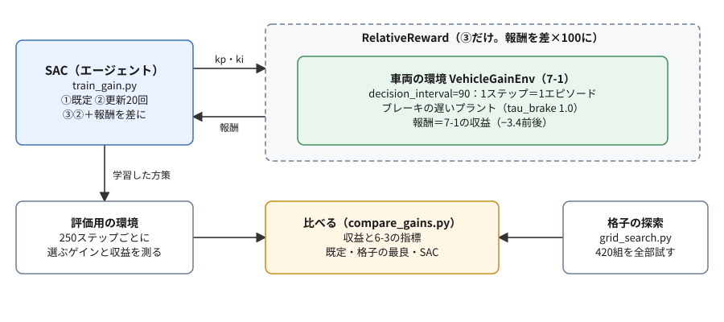
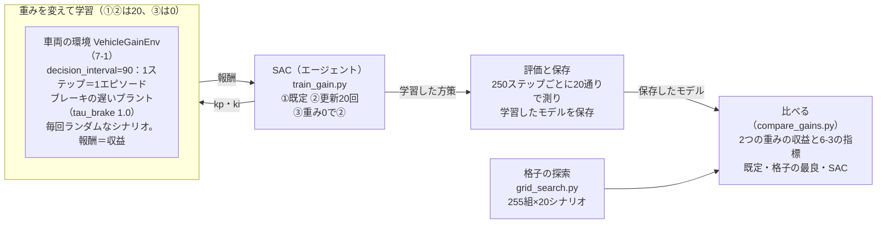

# フェーズ7-2 手順書: 強化学習でゲインを調整する

[`docs/learning_plan.md`](learning_plan.md) フェーズ7の7-2（[`docs/idea_origin.md`](idea_origin.md) ステップ6）に対応する。フェーズ7-1で作った車両の環境で、SB3のSACにPI制御のゲインを選ばせて学習させる。学習させる前に、強化学習を使わない探索（格子の探索）で、手で決めたゲインにどれだけ改善の余地があるかを確かめる。学習は、初めは思うように進まない。設定を見直して学習が進むようになるまでを体験した後、報酬の重みを変えると、追従の速さと行き過ぎのバランスがどう変わるかを、フェーズ6-3の指標で確かめる。

- 想定環境: WSL2 + Ubuntu 24.04 + ROS2 Jazzy（学習はROS2を使わず、ワークスペースのコードだけを借りる）
- 前提: フェーズ7-1（[`docs/phase7_1_vehicle_env.md`](phase7_1_vehicle_env.md)。`~/rl_practice` に `vehicle_env.py` があり、7-1の3節の準備で `learn_py` を読み込める）
- 所要目安: 2〜3コマ（計算を待つ時間が、課題を除いて15分程度ある）
- 言語: Python（ROS2のノードは書かない）

> **この手順書の位置づけ（暫定）**: フェーズ7は作成中で、構成を大きく改める可能性がある。

> **進め方**: 1節で全体像を見て、2節で学習の形と、比べる基準（格子の探索）を用意する。3節で学習のスクリプトを書き、①既定の設定、②NNの更新の回数を増やす、の順に学習させる。4節で、③行き過ぎの重みを0にして学習させ、②と、フェーズ6-3の指標で比べる。5節で、強化学習と格子の探索を、試行の数で比べる。サンプルは学習の手がかりとして最小限に書いたもので、公式の文書の転載ではない。

> **実行環境が無くても読めるように**: 実行する手順の直後には「期待する結果」として、表示される内容の例とその読み方を載せている。**期待する結果は、筆者の環境（2026-10-03。SB3 2.9.0・Gymnasium 1.3.0）で、各スクリプトを実際に実行した表示**である。フェーズ7-1と同じく、`learn_py` はワークスペースをビルドする代わりに、同じファイルを置いたフォルダを `PYTHONPATH` に加えて読み込んだ。格子の探索と比べるスクリプトの値は、同じ版なら何度実行しても同じになる。学習は乱数の種を固定しているので、同じPC・同じ版・同じ設定なら、ゲイン・収益・エントロピーの係数の値は何度実行しても同じになる。PCや版、計算に使うスレッドの数が違うと、学習の途中経過は変わることがある。`time[s]` の列（学習を始めてからの秒数）は、実行ごとに変わる。

## 0. 学習目標と完了条件

1. 学習させる前に、手で決めたゲインと格子の探索の最良を比べて、改善の余地を確かめられる。
2. エピソードの始めにゲインを1組選ぶ形で、SACにゲインを学習させられる。
3. 学習が進まないときに、NNの更新の回数（`gradient_steps`）を見直し、エントロピーの係数の変化と合わせて、その理由を説明できる。
4. 行き過ぎの重みを変えると、最もよいゲインと追従の様子が変わること（追従の速さと行き過ぎのトレードオフ。一方をよくすると他方が悪くなる関係）を、格子の探索とフェーズ6-3の指標で説明できる。あわせて、収益の地形が平らに近いと、学習がよい組を見つけにくいことを説明できる。
5. 強化学習と格子の探索を比べ、選ぶ数が2つだけの問題では格子の探索で十分なことと、強化学習が向く場面を説明できる。

完了条件: 2節で改善の余地を確かめ、3節の①と②の途中経過の違いを説明できる。そのうえで、4節の比較表から、重みを変えると、最もよいゲインと、行き過ぎ量・RMSがどう変わるかを、格子の最良どうしで説明できる。

## 1. 全体像

フェーズ5-2では、ゲインを式から目安を立てて手で決めた。フェーズ7-1では、ゲインを選ぶ環境を作り、ブレーキの遅いプラントでは、手で決めたゲインが、最もよい組から大きく外れることを見た。では、表を作らずに、試行錯誤だけで、よいゲインにたどり着けるか。これが、このページで強化学習のエージェントに任せることである。

ただし、学習させる前に、確かめておくことがある。手で決めたゲインが、すでに最もよい組とほとんど同じなら、どんなに学習がうまくいっても、得られるものは小さい。そこで、まず強化学習を使わずに、ゲインを格子状に全部試して、「手で決めたゲイン」と「最もよい組」の差を測る。そのうえで学習させ、学習したゲインを、収益とフェーズ6-3の指標で、手で決めたゲインや格子の最良と比べる。



<details>
<summary>同じ図（mermaid版）</summary>



</details>

## 2. 学習の形と、比べる基準

### 2-1. エピソードの始めにゲインを1組選ぶ

フェーズ7-1の環境は、ゲインを選ぶ間隔を `decision_interval` で変えられる（7-1の2-2節）。このページでは、間隔をエピソードの長さ（90秒）にして、エピソードの始めにゲインを1組だけ選ぶ形にする。フェーズ5-2で人が行ったこと（ゲインを決めて、走らせて、結果を見る）と同じ形である。

この形では、1回の `step` で90秒分を計算し、シナリオを走り切って、エピソードが終わる（`terminated`。7-1の2-6節）。1ステップが1エピソードで、そのステップの報酬がそのまま収益になる（7-1の5-2節の `gain_landscape.py` と同じ）。エージェントは、最初の観測（最初の目標の速度で落ち着いた車両）を見て、行動（ゲイン）を1つ選び、その収益を受け取る。シナリオは毎回ランダムに変わるので、同じゲインを選んでも、収益は毎回少し違う。エージェントが学ぶのは、「いろいろなシナリオで、平均して収益が大きくなるのは、どのゲインか」である。走っている途中の状況に応じてゲインを変える形（1秒ごとに選ぶ）は、この教材では扱わない。ゲインを選ぶ代わりに、ペダルそのものをNNに選ばせる形を、7-3で扱う。

題材は、ブレーキの遅いプラント（フェーズ5-1の `tau_brake` を1.0秒にしたもの）にする。7-1の5-2節の表のとおり、このプラントでは、手で決めたゲインが、最もよい組から大きく外れるからである（既定のプラントは、5節の末尾の課題2で試す）。

### 2-2. 格子の探索で、比べる基準を作る

学習の結果がよいかどうかを判断するには、基準が要る。ここでは、強化学習を使わずに、ゲインの組を細かい格子で全部試して、最もよいゲインを探す（**格子の探索**、グリッドサーチ）。7-1の5-2節の表を、刻みを細かくしたものである。行き過ぎの重みは、7-1の既定の20と、行き過ぎを減点しない0の2通りで、最もよい組を求める（0は4節で使う）。

ファイル: `~/rl_practice/grid_search.py`（ファイルの置き方は [サンプルコードを練習環境に置く方法](howto_place_code.md)）

```python
# 強化学習を使わずに、ゲインを細かい格子で全部試し、行き過ぎの重みごとに最もよいゲインを探す（ブレーキの遅いプラント）。
import numpy as np

from learn_py.vehicle_model import VehicleParams
from vehicle_env import EPISODE_LENGTH, VehicleGainEnv, gains_to_action

PLANTS = {'default': VehicleParams(), 'slow_brake': VehicleParams(tau_brake=1.0)}
SEEDS = range(20)          # 比べるシナリオ（7-1と同じ種0〜19）
WEIGHTS = [0.0, 20.0]      # 行き過ぎの重み
KP_GRID = np.round(np.arange(0.1, 1.5001, 0.1), 2)     # 15通り
KI_GRID = np.round(np.arange(0.0, 0.2001, 0.0125), 4)  # 17通り


# ゲイン kp・ki のまま20通りのシナリオを走らせ、収益の内訳（誤差の二乗の分・行き過ぎの二乗の分）の平均を返す。
def mean_terms(env, kp, ki):
    errors, overshoots = [], []
    for seed in SEEDS:
        env.reset(seed=seed)
        obs, reward, terminated, truncated, info = env.step(gains_to_action(kp, ki))
        errors.append(info['squared_error'])
        overshoots.append(info['squared_overshoot'])
    return float(np.mean(errors)), float(np.mean(overshoots))


# 格子の全部の組で内訳を求め、重みごとに、既定のゲインと最もよいゲインの収益を表示する。
def main():
    env = VehicleGainEnv(decision_interval=EPISODE_LENGTH, params=PLANTS['slow_brake'])
    terms = {(kp, ki): mean_terms(env, kp, ki) for kp in KP_GRID for ki in KI_GRID}
    for w in WEIGHTS:
        def mean_return(gains):
            error, overshoot = terms[gains]
            return -(error + w * overshoot)
        best = max(terms, key=mean_return)
        print(f'weight {w:4.0f}: default (kp=0.50, ki=0.1000) {mean_return((0.5, 0.1)):.4f}  '
              f'best (kp={best[0]:.2f}, ki={best[1]:.4f}) {mean_return(best):.4f}  ({len(terms)} pairs)')


if __name__ == '__main__':
    main()
```

- `PLANTS` は、2つのプラントのパラメータを名前で引けるようにした辞書、`SEEDS` は、比べる20通りのシナリオの種（7-1の5節と同じ0〜19）である。どちらも3節の `train_gain.py` からも使う。
- `KP_GRID`・`KI_GRID` は、`kp` を0.1〜1.5の0.1刻み（15通り）、`ki` を0〜0.2の0.0125刻み（17通り）にした並びである。7-1の5-2節の表で、ブレーキの遅いプラントのよい組は、この範囲にあった。`np.arange` の終わりを少し大きくし（1.5001・0.2001）、`np.round` で丸めているのは、小数の誤差で、端の値が抜けたり、0.30000000000000004 のような値になったりしないようにするためである。
- `mean_terms` は、1組のゲインで20通りのシナリオを走らせ、7-1の環境が `info` に入れる、収益の内訳（誤差の二乗の分 `squared_error` と、行き過ぎの二乗の分 `squared_overshoot`。どちらも重みを掛ける前の値。7-1の4節の解説）の平均を返す。
- `main` は、255組の内訳を辞書 `terms` に求めておき、重みごとに、収益 $-(\text{誤差の二乗の分} + w \times \text{行き過ぎの二乗の分})$ を計算し直す。内訳を覚えておけば、重みを変えるたびに走らせ直さなくてよい。`max(terms, key=mean_return)` は、収益が最も大きい組を返す。

仮想環境を有効にし、`learn_py` を読み込めるようにしたターミナル（7-1の3節の2つの `source`）で、`~/rl_practice` から実行する。255組を20通りのシナリオで走らせるので、4分半程度かかる。

```bash
python grid_search.py
```

**期待する結果**:

```text
weight    0: default (kp=0.50, ki=0.1000) -0.6265  best (kp=0.60, ki=0.0250) -0.6074  (255 pairs)
weight   20: default (kp=0.50, ki=0.1000) -1.2525  best (kp=0.30, ki=0.0250) -0.7312  (255 pairs)
```

各行は、行き過ぎの重み（`weight`）ごとの、既定のゲイン（`default`）の収益と、最もよいゲイン（`best`）とその収益である（どちらも20通りのシナリオの平均）。

- **重み20（2行目）**: 最もよいのは `kp` 0.30・`ki` 0.0250で、収益は−0.7312。既定のゲイン（−1.2525）より約42%よい。7-1の5-2節の表の最もよい組と同じである。手で決めたゲインには、大きな改善の余地がある。
- **重み0（1行目）**: 最もよいのは `kp` 0.60・`ki` 0.0250で、収益は−0.6074。既定のゲイン（−0.6265）との差は約3%しかない。行き過ぎを減点しなければ、手で決めたゲインで、ほぼ十分ということである。
- そこで、3節では、改善の余地が大きい重み20で学習させる。重み0は、4節で、重みによる違いを見るのに使う。
- 255組 × 20通りのシナリオで、合わせて5100エピソードを走らせた。この数は、5節で強化学習と比べる。
- 最もよい組は、比べる20通りのシナリオ（種0〜19）の上で選んだものである。別のシナリオでも同じようによいかは、4-2節で確かめる。

## 3. SACでゲインを学習させる

### 3-1. 学習のスクリプト（`train_gain.py`）

条件を、コマンドの引数で切り替えられるようにした学習のスクリプトを作る。

ファイル: `~/rl_practice/train_gain.py`

```python
# 車両の環境で、エピソードの始めにゲインを1組選ぶ形のSACを学習させ、途中経過を表示して保存する。
import argparse
import time

import numpy as np
from stable_baselines3 import SAC

from grid_search import PLANTS, SEEDS
from vehicle_env import EPISODE_LENGTH, VehicleGainEnv, action_to_gains


# 方策 model を、評価用の環境の20通りのシナリオで1エピソードずつ動かし、選んだゲインの平均と収益の平均を返す。
def evaluate(model, env):
    gains, returns = [], []
    for seed in SEEDS:
        obs, info = env.reset(seed=seed)
        action, _ = model.predict(obs, deterministic=True)
        obs, reward, terminated, truncated, info = env.step(action)
        gains.append(action_to_gains(action))
        returns.append(reward)
    kp, ki = np.mean(gains, axis=0)
    return kp, ki, float(np.mean(returns))


# 引数で選んだ条件で学習させ、250ステップごとに、方策が選ぶゲイン・収益・エントロピーの係数を表示する。
def main():
    parser = argparse.ArgumentParser()
    parser.add_argument('--plant', choices=list(PLANTS), default='slow_brake')
    parser.add_argument('--weight', type=float, default=20.0)
    parser.add_argument('--steps', type=int, default=1000)
    parser.add_argument('--gradient-steps', type=int, default=1)
    args = parser.parse_args()

    params = PLANTS[args.plant]
    env = VehicleGainEnv(decision_interval=EPISODE_LENGTH, overshoot_weight=args.weight, params=params)
    eval_env = VehicleGainEnv(decision_interval=EPISODE_LENGTH, overshoot_weight=args.weight, params=params)
    model = SAC('MlpPolicy', env, verbose=0, seed=0, gradient_steps=args.gradient_steps)

    start = time.time()
    print(' steps     kp      ki    return  ent_coef  time[s]')
    for k in range(args.steps // 250):
        model.learn(total_timesteps=250, reset_num_timesteps=False)
        kp, ki, mean_return = evaluate(model, eval_env)
        print(f'{(k + 1) * 250:6d}  {kp:5.2f}  {ki:6.3f}  {mean_return:8.4f}'
              f'  {model.log_ent_coef.detach().exp().item():8.3f}  {time.time() - start:7.0f}')
    model.save(f'gain_sac_{args.plant}_w{args.weight:g}')


if __name__ == '__main__':
    main()
```

**`train_gain.py` の解説**

- **引数（`argparse`）**: Python標準の `argparse` で、コマンドの引数を受け取る。`--plant` はプラント（`slow_brake` が既定、`default` も選べる）、`--weight` は行き過ぎの重み（既定20）、`--steps` は学習のステップ数（既定1000。250の倍数で指定する。端数は切り捨てられる）、`--gradient-steps` はNNの更新の回数（3-3節。既定1）である。
- **2つの環境**: 学習用の `env` と、評価用の `eval_env` を別々に作る。学習用の環境は、SB3が中で使っていて、エピソードが終わるとすぐに次のエピソードを始めている。それを途中で評価に使うと、SB3が知らないうちに環境の状態が進み、次の学習のステップが、終わったエピソードの続き（90秒より後）を計算してしまう。SB3の公式の文書（Tips and Tricks）も、学習とは別に、評価用の環境で定期的に評価するよう勧めている。
- **`evaluate`**: 評価用の環境で、2-2節と同じ20通りのシナリオを1エピソードずつ走らせ、方策が選んだゲインの平均と、収益の平均を返す。`deterministic=True`（7-0の4-1節。探索のばらつきを入れない）で行動を選ぶ。最初の観測（最初の目標の速度）はシナリオごとに違うので、方策は、シナリオごとに少し違うゲインを選ぶことがある。そこで、ゲインは平均で示す。フェーズ7-0の4-2節では、評価をSB3の `evaluate_policy` に任せたが、このページでは、決まった20通りのシナリオで、格子の探索と同じ物差しで比べたいので、自分で書いた。
- **`SAC(..., gradient_steps=...)`**: フェーズ7-0の4-2節と同じSACに、NNの更新の回数を渡す（3-3節）。
- **学習と評価の繰り返し**: `model.learn(total_timesteps=250, reset_num_timesteps=False)` で250ステップずつ学習させ、そのたびに評価する。`reset_num_timesteps=False` は、ステップ数を0に戻さずに、続きから数えさせる指定である。
- **エントロピーの係数（`ent_coef` の列）**: SACが、探索のばらつき（エントロピー。7-0の2-4節）をどれだけ重く見るかを表す数である。SB3のSACは、既定ではこの係数を1.0から始め、学習の中で自動で調整する。調整の向きは、方策のばらつきを測った数（エントロピー）が目標の値（既定では、行動の数のマイナス。この環境では−2）より大きければ係数を下げ、小さければ上げる、というものである。連続の値の行動では、ばらつきが小さいとエントロピーは負の数になるので、目標も負の数で表す。`model.log_ent_coef` は係数の対数（log）なので、`exp()` で元の数に戻す。`detach()` と `item()` は、NNの学習の計算から切り離して、ふつうの数として取り出すための書き方である。
- **`model.save`**: 学習したモデルを、`gain_sac_slow_brake_w20.zip` のように、プラントと重みの入った名前のファイルに保存する（4-2節で読み込む）。`{args.weight:g}` は、20.0を `20` のように、余分な0を付けずに書く指定である。

### 3-2. ① 既定の設定で学習させる

まず、引数を何も付けずに、SB3のSACの既定の設定で学習させる。1分程度かかる。

```bash
python train_gain.py
```

**期待する結果**（`time[s]` の列は実行ごとに変わる）:

```text
 steps     kp      ki    return  ent_coef  time[s]
   250   1.76   0.115   -3.7342     0.959       18
   500   1.30   0.145   -2.9192     0.896       36
   750   1.11   0.169   -2.5043     0.833       54
  1000   1.05   0.182   -2.3677     0.774       72
```

各行は、そのステップ数まで学習した方策が選ぶゲイン（`kp`・`ki`。20通りのシナリオの平均）と、その収益（`return`。20通りのシナリオの平均）、その時点のエントロピーの係数（`ent_coef`）である。

- 1000ステップ（1000エピソード）学習しても、収益は−2.37にとどまる。2-2節の既定のゲイン（−1.25）よりも悪く、格子の最良（−0.73）には遠く及ばない。
- 選ぶゲインは、`kp` 1.76から1.05へ、少しずつ下がっている。7-1の5-2節の表のとおり、ブレーキの遅いプラントでは `kp` が大きいほど行き過ぎて悪くなるので、学習は正しい向きに進んでいるが、遅い。
- エントロピーの係数は、0.959から0.774へ、ゆっくりとしか下がっていない。方策は、まだ大きくばらつかせながら探索している。

学習が遅い理由として、NNの更新が少ないことが考えられる。SB3のSACは、既定では、環境を1ステップ進めるごとに、NNを1回だけ更新する（`gradient_steps=1`）。しかも、最初の100ステップは経験をためるだけで更新しない（SB3のSACの既定の `learning_starts=100`）。1000ステップでは、更新は約900回しかない（フェーズ7-1の5-3節の途中経過の表の `n_updates`（900ステップで799回）と同じ数え方）。フェーズ7-0の振り子は、20,000ステップで約20,000回更新していた。

### 3-3. ② NNの更新の回数を増やす

この環境の1ステップは、90秒分のシミュレーション（プラントの計算9000回）で、時間がかかる。一方、NNの更新は、リプレイバッファ（7-0の2-4節）にためた経験を使い回すだけなので、環境を進めるより安く済む。そこで、環境を1ステップ進めるごとに、NNを20回更新する（`gradient_steps=20`）。ステップ数は1000のまま、NNの更新は約18,000回（最初の100ステップを除いた900ステップ × 20）になる。5分程度かかる。

```bash
python train_gain.py --gradient-steps 20
```

**期待する結果**（`time[s]` の列は実行ごとに変わる）:

```text
 steps     kp      ki    return  ent_coef  time[s]
   250   0.58   0.051   -1.0759     0.441       51
   500   0.43   0.023   -0.8172     0.191      125
   750   0.39   0.022   -0.7698     0.187      201
  1000   0.41   0.026   -0.8038     0.182      275
```

- 250ステップで、もう収益−1.08と、既定のゲイン（−1.25）を上回った。500ステップ以降は−0.77〜−0.82の間にあり、1000ステップで選ぶゲインは `kp` 0.41・`ki` 0.026になった。
- 1000ステップの収益（−0.8038）は、既定のゲインより約36%よく、格子の最良（−0.7312）との差は約10%である（750ステップの時点では約5%）。選ぶゲインは格子の最良（`kp` 0.30・`ki` 0.025）に近いが、`kp` が0.1ほど大きい。7-1の5-2節の表で、`kp` を0.3から0.5に上げると収益が−0.731から−0.943に悪くなるとおり、このあたりでは、`kp` の小さなずれが収益の差になる。
- エントロピーの係数は、更新の回数が増えた分だけ速く下がり、0.18前後で落ち着いた。ばらつかせる価値が小さくなり、報酬の差が効くようになったと考えられる。
- ただし、時間は①の約4倍かかる。NNの更新が20倍になったためで、環境の計算（90秒のシミュレーション）の時間は変わらないので、20倍にはならない。

> **補足: 更新の回数の増やし方**
>
> - **一般的な考え方**: 1回の経験から何回NNを更新するかは、学習の速さと安定さの取り引きである。環境を動かすのに時間がかかるときは、更新の回数を増やすと、同じ数の経験から多くを学べる。ただし、増やしすぎると、ためた経験に合わせすぎて、学習が不安定になることがある。
> - **このページで20回にした理由**: 1000ステップで更新が約18,000回になり、フェーズ7-0の振り子（約20,000回）と同じくらいの回数になるようにした。
> - **実務の目安**: 1回、数回、十数回のように変えて、途中経過の表と時間を見比べて決める。

## 4. 重みを変えて、追従の速さと行き過ぎのバランスを見る

### 4-1. ③ 行き過ぎの重みを0にして学習させる

報酬の重みは、「何をどれだけ嫌うか」という設計の判断である（7-1の2-5節の補足）。2-2節で見たとおり、重みを20から0に変えると、格子の最良は `kp` 0.30・`ki` 0.025から `kp` 0.60・`ki` 0.025に変わる。強化学習でも、重みを変えれば、選ぶゲインが変わるはずである。②と同じ設定で、行き過ぎの重みだけを0にして学習させる。5分程度かかる。

```bash
python train_gain.py --gradient-steps 20 --weight 0
```

**期待する結果**（`time[s]` の列は実行ごとに変わる。`return` は、重み0の報酬での収益）:

```text
 steps     kp      ki    return  ent_coef  time[s]
   250   1.14   0.240   -0.6720     0.408       49
   500   1.00   0.208   -0.6567     0.093      124
   750   0.77   0.179   -0.6279     0.025      199
  1000   0.93   0.167   -0.6429     0.017      272
```

- 選ぶゲインは `kp` 0.93・`ki` 0.167と、②（`kp` 0.41・`ki` 0.026）よりずっと大きい。行き過ぎを減点しないので、大きなゲインを避ける理由が無い。
- ただし、この学習はうまくいっていない。収益（−0.6429）は、重み0の既定のゲイン（−0.6265）より悪く、格子の最良（−0.6074。`kp` 0.60・`ki` 0.025で、大きなゲインではない）にも届かない。2-2節で見たとおり、重み0では、既定のゲインから最良のあたりで収益の差が約3%しかなく、収益の地形が平らに近い。こうした地形では、どのゲインがよいかを、ばらつく1回ごとの結果から見分けにくい。学習の途中で、選ぶゲインが行き来している（750ステップで `kp` 0.77、1000ステップで0.93）のも、このためと考えられる。

### 4-2. 重みによる違いを、指標で比べる

②（重み20）と③（重み0）で学習したモデルが選ぶゲインを、既定のゲイン・2つの重みの格子の最良と比べる。収益は2つの重みの両方で計算し、フェーズ6-3の指標も並べる。最後の列には、格子の探索にも学習の評価にも使っていない、別の20通りのシナリオ（種20〜39）での重み20の収益を出す。

ファイル: `~/rl_practice/compare_gains.py`

```python
# ブレーキの遅いプラントで、既定・格子の最良・学習したSACのゲインを、20通りのシナリオの収益と6-3の指標で比べる。
import numpy as np
from stable_baselines3 import SAC

from grid_search import PLANTS, SEEDS
from learn_py.metrics import evaluate
from vehicle_env import EPISODE_LENGTH, VehicleGainEnv, action_to_gains, gains_to_action

TEST_SEEDS = range(20, 40)  # 格子の探索にも学習の評価にも使っていない、確かめ用のシナリオ


# 方策 policy（観測 → 行動）で、種 seeds のシナリオを走らせ、ゲイン・2つの重みでの収益・RMS・行き過ぎ量・定常偏差の大きさの平均を返す。
def summarize(env, policy, seeds):
    rows = []
    for seed in seeds:
        obs, info = env.reset(seed=seed)
        action = policy(obs)
        obs, reward, terminated, truncated, info = env.step(action)
        steps, rms = evaluate(*(list(c) for c in zip(*env.history)))
        kp, ki = action_to_gains(action)
        rows.append([kp, ki,
                     -info['squared_error'],
                     -(info['squared_error'] + 20.0 * info['squared_overshoot']),
                     rms,
                     np.mean([s.overshoot for s in steps]),
                     np.mean([abs(s.steady_error) for s in steps])])
    return np.mean(rows, axis=0)


# 5つの方策を比べる表を表示する。最後の列は、確かめ用のシナリオでの重み20の収益。
def main():
    env = VehicleGainEnv(decision_interval=EPISODE_LENGTH, params=PLANTS['slow_brake'])
    sac_w0 = SAC.load('gain_sac_slow_brake_w0')
    sac_w20 = SAC.load('gain_sac_slow_brake_w20')
    policies = {
        'default': lambda obs: gains_to_action(0.5, 0.1),
        'grid best w=0': lambda obs: gains_to_action(0.6, 0.025),
        'grid best w=20': lambda obs: gains_to_action(0.3, 0.025),
        'SAC w=0': lambda obs: sac_w0.predict(obs, deterministic=True)[0],
        'SAC w=20': lambda obs: sac_w20.predict(obs, deterministic=True)[0],
    }
    print('policy            kp     ki   ret(w=0)  ret(w=20)  RMS[m/s]  over[%]  |error|  test(w=20)')
    for name, policy in policies.items():
        kp, ki, ret0, ret20, rms, over, error = summarize(env, policy, SEEDS)
        test20 = summarize(env, policy, TEST_SEEDS)[3]
        print(f'{name:15s} {kp:5.2f}  {ki:5.3f}  {ret0:8.4f}  {ret20:8.4f}  {rms:8.3f}  {over:7.2f}  {error:6.3f}  {test20:9.4f}')


if __name__ == '__main__':
    main()
```

- `summarize` は、方策 `policy` で、種 `seeds` のシナリオを走らせ、選んだゲイン・2つの重みでの収益・6-3の指標の平均を返す。2つの重みでの収益は、`info` の内訳から計算し直す（2-2節と同じ）。
- `evaluate(*(list(c) for c in zip(*env.history)))` は、環境の記録（時刻・目標・速度・ペダルの組の並び）を、4つの並びに分けて6-3の `evaluate` に渡す書き方で、7-1の5-1節の `check_vehicle_env.py` と同じ取り出し方である。`evaluate` は、段ごとの指標（`steps`）とRMSを返すので、段ごとの行き過ぎ量（`overshoot`）と、定常偏差の大きさ（`steady_error` の絶対値）を、段について平均する。
- `TEST_SEEDS` は、確かめ用のシナリオの種（20〜39）である。格子の最良は、比べる20通りのシナリオ（種0〜19）の上で選んだ組なので、そのシナリオに合わせた分だけ有利かもしれない。別のシナリオでも同じ順になるかを確かめるために使う。
- `main` は、②と③で保存したモデルを `SAC.load` で読み込み、5つの方策を比べる。格子の最良のゲイン（0.6・0.025と、0.3・0.025）は、2-2節の期待する結果の値である。

```bash
python compare_gains.py
```

**期待する結果**:

```text
policy            kp     ki   ret(w=0)  ret(w=20)  RMS[m/s]  over[%]  |error|  test(w=20)
default          0.50  0.100   -0.6265   -1.2525     0.828    13.87   0.044    -1.3296
grid best w=0    0.60  0.025   -0.6074   -1.1100     0.816    12.24   0.122    -1.2134
grid best w=20   0.30  0.025   -0.7012   -0.7312     0.878     1.80   0.097    -0.7820
SAC w=0          0.93  0.167   -0.6429   -1.9537     0.839    21.29   0.038    -2.2390
SAC w=20         0.41  0.026   -0.6303   -0.8038     0.832     5.65   0.121    -0.9226
```

各行は、方策が選んだゲインの平均、重み0と重み20での収益、RMS、行き過ぎ量（`over[%]`。段について平均）、定常偏差の大きさ（`|error|`。6-3の2-2節の定常偏差、つまり段の最後の1秒の速度と目標の差を、段について平均したもの）、確かめ用のシナリオでの重み20の収益（`test(w=20)`）である。最後の列のほかは、比べる20通りのシナリオの平均である。

- **格子の最良どうし（2行目と3行目）**: 重みを0から20にすると、行き過ぎ量は12.24%から1.80%に大きく減る。その代わり、目標へゆっくり近づくので、RMSは0.816から0.878に増える。行き過ぎを嫌えば、追従は遅くなる。これが、追従の速さと行き過ぎのトレードオフである。
- **定常偏差は、主に `ki` で決まる**: `ki` が0.025の組（格子の最良の2つと、②）は、重みによらず、段の最後に0.1 m/s前後届いていない（`|error|` 0.097〜0.122）。`ki` が大きい既定のゲイン（0.100）と③（0.167）は、0.04 m/s前後まで届いている。積分の項が速く育つほど、10秒の段の間に目標に届ききる（7-1の5-2節の末尾の課題3で見た、ゆっくり近づく追従は、`ki` が小さいためである）。
- **SACどうし（4行目と5行目）**: ②（重み20で学習）は、行き過ぎ量が5.65%で、重み20の格子の最良に近い追従である。③（重み0で学習）は、行き過ぎ量が21.29%と大きいうえに、重み0の物差し（`ret(w=0)`）でも−0.6429で、②の−0.6303より悪い。学習に使った報酬の上でさえ、別の重みで学習した②に負けている。4-1節で見た、平らな地形で学習がよい組を見つけられなかった例である。学習の結果は、報酬の地形によっては、よい組から外れる。学習させたら、格子の探索のような基準と比べて確かめる。
- **重みを取り違えると**: ③のゲインを重み20の物差しで測ると、収益は−1.9537で、既定のゲイン（−1.2525）よりも悪い。報酬の値は、同じ重みの物差しの上でだけ比べられる。
- **確かめ用のシナリオ（最後の列）**: どの方策も、比べる20通りのシナリオより少し悪い（こちらのシナリオが少し厳しい）。重み20の格子の最良（−0.7820）と②（−0.9226）の順は変わらず、差はむしろ広がった。格子の最良は、選ぶのに使ったシナリオにだけ合っていたわけではない。②は、確かめ用のシナリオでも、既定のゲイン（−1.3296）より約31%よい。

> **補足: 報酬の重みと、指標での確認**
>
> - **一般的な考え方**: 強化学習のエージェントは、報酬を大きくすることだけを目指す。重みは、追従の速さと行き過ぎのように、両立しない性質のどちらをどれだけ優先するかを決める。重みを変えれば、最もよい答えも変わる。
> - **このページで2つの重みを比べた理由**: 重みだけで、最もよいゲインと追従の様子が大きく変わることを、格子の最良と6-3の指標で確かめるためである。あわせて、重みによっては収益の地形が平らになり、学習がうまくいかないことも確かめた。
> - **実務の目安**: 重みは、学習させた結果を、報酬とは別の「人が読める数」（このページではフェーズ6-3の指標）で確かめながら決める。報酬の値を、重みの違う学習どうしで直接比べてはいけない（この節の「重みを取り違えると」の項目のように、物差しが違う）。

## 5. 強化学習と格子の探索を比べる

ブレーキの遅いプラント・重み20で、2通りの格子の探索と、②の学習（3-3節）を比べる。

| | 粗い格子（7-1の5-2節） | 細かい格子（2-2節） | SAC（3-3節の②） |
|---|---|---|---|
| 走らせたエピソードの数 | 840（42組 × 20通りのシナリオ） | 5100（255組 × 20通りのシナリオ） | 1000（評価に、ほかに80） |
| 結果のゲイン | `kp` 0.3・`ki` 0.025 | `kp` 0.30・`ki` 0.0250 | `kp` 0.41・`ki` 0.026 |
| 結果の収益（比べる20通りのシナリオの平均） | −0.731 | −0.7312 | −0.8038（750ステップで−0.7698） |
| 必要な設定 | 刻みの幅と範囲 | 刻みの幅と範囲 | 更新の回数など |

- **結果の収益**は、格子の探索のほうがよい。強化学習は、格子の最良との差を5〜10%まで縮めたが、同じにはならなかった。
- **エピソードの数**も、この問題では、格子の探索で足りる。細かい格子は5100エピソードかかったが、7-1の粗い格子は、840エピソードで同じ最良の組にたどり着いている。選ぶ数が `kp`・`ki` の2つだけなら、粗い格子で当たりをつけ、その付近を細かく調べれば、強化学習より少ない試行で、よりよい答えが出る。
- **かかった時間**は、細かい格子と②で、どちらも4分半程度だった。このページの環境ではシミュレーションが速く、強化学習の時間の多くがNNの更新に使われている。

ゲインのように選ぶ数が2つなら、格子の探索でも、まだ扱える。選ぶ数が増えると、格子の組の数は急に増える（10個の数をそれぞれ10通り試すだけで100億通り）。こうした場合は、格子の探索の代わりに、もっと賢い探索の方法（ベイズ最適化など。Optunaのようなライブラリがある）や、強化学習を使う。

強化学習ならではの力が生きるのは、選ぶものが多い場合や、**状況に応じて選び直す**場合である。その最も進んだ形が、PI制御の式そのものをやめ、観測からペダルを直接選ぶ方策（NN）を学ばせることである。NNの方策は、走っている途中の状況（目標との差、速度、目標が変わってからの時間など）に応じて、毎回違うペダルを出せる。「どの状況で、どのペダルか」という対応は、表や格子では表しきれない。これは、7-4（作成予定。環境は7-3で作る）で扱う。

> 課題1: 重みを4にして、②と同じ設定で学習させる（`python train_gain.py --gradient-steps 20 --weight 4`。5分程度かかる）。途中経過は次のようになる（`return` は重み4の報酬での収益）。
>
> ```text
>  steps     kp      ki    return  ent_coef  time[s]
>    250   0.99   0.194   -0.9542     0.409       50
>    500   0.54   0.053   -0.6920     0.108      124
>    750   0.50   0.055   -0.6846     0.042      199
>   1000   0.51   0.035   -0.6779     0.033      274
> ```
>
> 選ぶゲインは `kp` 0.51・`ki` 0.035で、重み0（③の0.93・0.167）と重み20（②の0.41・0.026）の間に入る。既定のゲインの重み4での収益は、2-2節の期待する結果の2つの値から計算できる。重み0の収益−0.6265が誤差の二乗の分、重み20との差（−1.2525 − (−0.6265) = −0.626）を20で割った約0.0313が行き過ぎの二乗の分なので、 $-(0.6265 + 4 \times 0.0313) \approx -0.752$ になる。学習したゲインの−0.6779は、これより約10%よい。学習したモデルは `gain_sac_slow_brake_w4.zip` に保存され、4-2節で使う2つのファイルは上書きされない。
>
> 課題2: 既定のプラントで、②と同じ設定で学習させる（`python train_gain.py --gradient-steps 20 --plant default`。5分程度かかる）。途中経過は次のようになる。
>
> ```text
>  steps     kp      ki    return  ent_coef  time[s]
>    250   1.20   0.236   -0.5859     0.405       51
>    500   1.06   0.219   -0.5657     0.093      125
>    750   0.88   0.195   -0.5470     0.024      199
>   1000   0.83   0.156   -0.5437     0.009      274
> ```
>
> 1000ステップで選ぶゲインは `kp` 0.83・`ki` 0.156、収益は−0.5437になる。7-1の5-2節の表の、既定のプラントでの既定のゲイン（−0.571）より約5%よく、表の最もよい組（`kp` 0.7・`ki` 0.1、−0.529）に近い。既定のプラントでは、もともと改善の余地が小さい（7-1の5-2節）ので、学習で得られるものも小さい。学習したモデルは `gain_sac_default_w20.zip` に保存される。

## 6. 本フェーズのまとめ

- 学習させる前に、格子の探索で、手で決めたゲインと最もよい組の差（改善の余地）を測った。ブレーキの遅いプラントでは、重み20なら約42%、重み0なら約3%の余地があった。
- エピソードの始めにゲインを1組選ぶ形で、SACにゲインを学習させた。既定の設定（NNの更新が1ステップに1回）では、学習は正しい向きに進むが遅い。1ステップに時間がかかる環境では、NNの更新の回数（`gradient_steps`）を増やすと、同じ試行の数から多くを学べる。
- 重み20で学習したゲインは、既定のゲインより約36%よく、格子の最良との差を5〜10%まで縮めた。別のシナリオでも、既定のゲインより約31%よかった。
- 行き過ぎの重みを変えると、最もよいゲインが変わる。格子の最良どうしで比べると、重みを上げるほど、行き過ぎは減る代わりに、目標へ近づくのが遅くなる。重み0のように収益の地形が平らに近いと、学習はよい組を見つけにくい。報酬の重みは設計の判断であり、結果は報酬とは別の指標と、格子の探索のような基準で確かめる。
- ゲインのように選ぶ数が2つだけで、毎回同じように1組を選ぶ問題では、粗い格子から始める格子の探索で十分である。強化学習は、選ぶものが多い場合や、状況に応じて選び直す場合（7-4のNNの方策）に力を発揮する。

## 7. つまずきやすい点

| 症状 | 確認すること |
|---|---|
| `ModuleNotFoundError: No module named 'learn_py'` や `'vehicle_env'` | フェーズ7-1の3節の準備（2つの `source`）をしたか。`~/rl_practice` で実行しているか |
| `No module named 'grid_search'` | 2-2節の `grid_search.py` を、同じフォルダに置いたか（`train_gain.py`・`compare_gains.py` が `PLANTS`・`SEEDS` を読み込む） |
| `compare_gains.py` で `gain_sac_slow_brake_w0.zip`（または `_w20`）が見つからない | 4-1節（または3-3節）の `train_gain.py` を、`--plant` を付けずに最後まで実行したか |
| `compare_gains.py` の `SAC w=20` の行が、4-2節の期待する結果と違う | `gain_sac_slow_brake_w20.zip` は、最後に実行した重み20の学習のもので上書きされる。3-2節の①（`--gradient-steps` なし）を後から実行した場合は、3-3節のコマンドで学習し直す |
| 学習の途中経過の値が、期待する結果と違う | `vehicle_env.py`（7-1）の定数（`KP_MAX`・`KI_MAX` など）や引数の既定値（`overshoot_weight`・`step_range`）を変えていないか。PCや版、計算に使うスレッドの数が違うと、値が変わることがある。特に③（重み0）は、収益の地形が平らなので、選ぶゲインが変わりやすい |
| 学習に時間がかかりすぎる | `--gradient-steps` を大きくするほど時間がかかる。途中で止める場合は `Ctrl+C`（モデルは保存されない） |

## 8. 次へ

次の7-3（[`docs/phase7_3_gazebo_env.md`](phase7_3_gazebo_env.md)）では、PI制御をNNの方策に置き換える準備として、フェーズ5-4のGazeboの車両を、強化学習の環境にする。その次の7-4（作成予定）で、その環境で、観測から直接ペダルを選ぶNNを学習させ、PI制御と6-3の指標で比べる予定である。

## 9. 公式ドキュメント・参考資料

確認状況（2026-10-03）: 下のページは、実在を確認した（HTTP 200）。3-2節・3-3節の `gradient_steps` の意味はSACのページの引数の説明で、`learning_starts` の既定値（100）と、エントロピーの係数の初期値（1.0）・調整の目標（行動の数のマイナス）・調整の向きは、導入したSB3 2.9.0のソース（`stable_baselines3/sac/sac.py`）で、3-1節の評価の注意は、Tips and Tricksのページの本文で確かめた。

- [Stable-Baselines3 — SAC](https://stable-baselines3.readthedocs.io/en/master/modules/sac.html)（`gradient_steps` などの引数の説明）
- [Stable-Baselines3 — Reinforcement Learning Tips and Tricks](https://stable-baselines3.readthedocs.io/en/master/guide/rl_tips.html)（評価の仕方、報酬の設計）

> 出典: 3-1節〜3-3節のSB3の説明は、公式の文書とソースを自分の言葉で要約・再構成したもので、逐語の転載ではない。このページのサンプルコード（`grid_search.py`・`train_gain.py`・`compare_gains.py`）は独自に書いたもので、フェーズ7-1の `vehicle_env.py` と、フェーズ5-1・6-3のサンプルを読み込んで使う。
