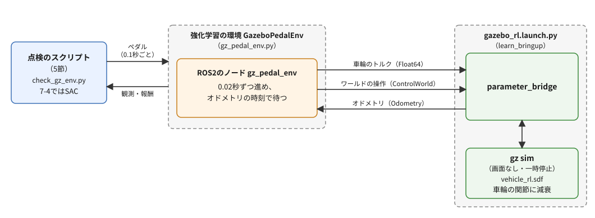
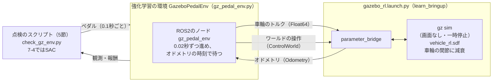

# フェーズ7-3 手順書: Gazeboで学習する環境を作る

[`docs/learning_plan.md`](learning_plan.md) フェーズ7の7-3（[`docs/idea_origin.md`](idea_origin.md) ステップ6）に対応する。フェーズ7-1・7-2では、ROS2を使わないPythonの車両の式を環境にして、ゲインを学習させた。次の7-4では、PI制御の式そのものをやめ、ペダルを直接選ぶニューラルネットワーク（NN）の方策を学習させる。その学習の舞台を、フェーズ5-4で作ったGazeboの物理にする。このページでは、その準備として、Gazeboの車両を強化学習の環境にする。Gazeboを一時停止した状態から少しずつ進め、ROS2のトピックとサービスで車両を動かし、速度を受け取る。

- 想定環境: WSL2 + Ubuntu 24.04 + ROS2 Jazzy（Gazebo Harmonic）
- 前提: フェーズ7-2（[`docs/phase7_2_gain_tuning.md`](phase7_2_gain_tuning.md)。`~/rl_practice` に7-1の `vehicle_env.py` がある）、フェーズ5-4（[`docs/phase5_4_gazebo_plant.md`](phase5_4_gazebo_plant.md)。`learn_bringup` に `worlds/vehicle_force.sdf` があり、`learn_py` に `actuator_model.py` がある）、[強化学習の環境構築の7節](setup_rl_sb3.md)（仮想環境から `rclpy` を読み込める）
- 所要目安: 2コマ（計算を待つ時間が、課題を除いて5分程度ある）
- 言語: Python（launchもPython形式）＋ワールドファイル

> **この手順書の位置づけ（暫定）**: フェーズ7は作成中で、構成を大きく改める可能性がある。

> **進め方**: 1節で、なぜGazeboで学習させるのかと、そのための仕組みの全体像を見る。2節で、学習用のワールドを作る（5-4のワールドに、速度に比例する抵抗を足す）。3節で、Gazeboを一時停止した状態から少しずつ進める仕組みを、launchとコマンドで確かめる。4節で、その仕組みを使う強化学習の環境のクラスを書き、5節で点検して、学習にかかる時間を見積もる。サンプルは学習の手がかりとして最小限に書いたもので、公式の文書の転載ではない。

> **実行環境が無くても読めるように**: 実行する手順の直後には「期待する結果」として、表示される内容の例とその読み方を載せている。期待する結果の出どころは次のとおり。2-3節の `gz sdf -k` とビルド、3-1節の `ros2 interface show` は、使い捨ての環境で実際に実行した表示。3-2節の起動のログ、3-3節、5-2節は、使い捨ての環境で画面なしのGazeboを起動し、実際に実行した表示（2026-10-06。SB3 2.9.0・Gymnasium 1.3.0）である。作成時は、フェーズ7-1・7-2と同じく、`learn_py` はワークスペースをビルドする代わりに、同じファイルを置いたフォルダを `PYTHONPATH` に加えて読み込み、`learn_bringup` だけを使い捨てのワークスペースでビルドした。行頭の時刻・プロセスの番号・ビルドの秒数と、5-2節の `time[s]`・`ms/step` の列は、実行ごとに変わる。5-2節の速度と収益は、作成時に2回続けて実行して、同じ値になることを確かめた（トルクの指令がGazeboに届く時機によって、わずかに変わる可能性はある。4節の末尾の補足）。

## 0. 学習目標と完了条件

1. 物理シミュレータを強化学習の環境にするときに要る3つのこと（エピソードの始めに元に戻す、決まった時間だけ進める、進めた後の状態を受け取る）を説明できる。
2. Gazeboのワールドを操作するサービスで、一時停止したGazeboを決まった回数だけ進め、リセットできる。
3. 5-1の速度に比例する抵抗を、縮尺を使って、Gazeboの車輪の関節の減衰に直せる。
4. Gymnasiumの環境の中にROS2のノードを持たせ、`check_env` で点検できる。
5. Gazeboの環境の速さを測り、学習にかかる時間を見積もれる。

完了条件: 5節の点検のスクリプトで、`check_env` が通り、ペダル0.5を踏み続けた速度が約10.7 m/sで頭打ちになり、PI制御で走らせた収益と、1エピソードにかかる時間を確かめる。そのうえで、7-4の学習（10万ステップ）にかかる時間を見積もれる。

## 1. 全体像

フェーズ7-1・7-2では、Pythonの車両の式（5-1の `VehicleModel`）を環境にして学習させた。式なら、1エピソード（90秒分）を一瞬で計算できる。一方、フェーズ5-4では、同じゲインのPI制御でも、自作の式とGazeboの物理とで追従が変わることを見た。式で学んだものは、式とは違う物理の上では、そのまま通用するとは限らない。実物のロボットでも、シミュレーションで学んだものを実物に移すと、同じ問題が起きる。

それなら、最初から、より現実に近い物理の上で学ばせればよい。このページと次の7-4では、NNの方策を、Gazeboの車両で直接学習させる。代わりに、学習には時間がかかる。Gazeboは、画面を出さずにできるだけ速く回しても、物理の計算だけで現実の約3倍の速さ、ROS2とやりとりしながら少しずつ進めると、約2倍の速さだった（作成時に測った値。5節で、このページの環境の速さを測る。PCによって変わる）。7-2のように、1000エピソードを何本も学習させると、半日以上かかる。そこで、Gazeboを使うのは、NNを学習させる7-4からにした。

強化学習の環境には、次の3つが要る。

- **リセット**: エピソードの始めに、車両を元の場所・止まった状態に戻す。
- **決まった時間だけ進める**: 方策がペダルを選んだら、物理を0.1秒分だけ進めて止める。方策が考えている間に、車両が勝手に走り続けてはいけない。
- **進めた後の状態を受け取る**: 0.1秒分を進め終わった時点の速度を、観測として返す。

フェーズ5-4のlaunchでは、Gazeboは現実の時間に合わせて、自分のペースで進み続けていた。このページでは、Gazeboを**一時停止した状態**で起動し、ワールドを操作するサービスで「何回分進めるか」「リセットするか」を指示する。進め終わったかどうかは、オドメトリに付いている時刻（シミュレーション時刻）で確かめる。



<details>
<summary>同じ図（mermaid版）</summary>



</details>

## 2. 学習用のワールド

### 2-1. なぜ抵抗を足すのか

フェーズ5-4の7節で見たとおり、5-4のワールドの車両は、転がってもほとんど抵抗を受けない。ペダルを踏み続けると、速度はどこまでも上がっていく。作成時に、このワールドのままNNを学習させてみると、学習の初めのでたらめなペダルで速度が大きく外れ、誤差の二乗がとても大きな値になって、2万ステップ学習させても収益がよくならなかった（このワールドでのPI制御の収益の、2000倍ほど悪いまま）。

自作の式（5-1）には、速度に比例する抵抗があり、アクセル全開でも約20 m/sで頭打ちになった。同じ性質をGazeboの車両にも持たせると、同じ量の学習で、収益がPI制御に近づいた。そこで、5-4のワールドを写し、車輪の関節に**減衰**（回る速さに比例して、回転を止める向きに働くトルク）を入れたワールドを、学習用にする。

### 2-2. 減衰の大きさを、縮尺から求める

5-1の速度に比例する抵抗は $c v$（ $c$ = 140 N/(m/s)）だった。これを、5-4の3節の縮尺でGazeboの単位に直す。速度はGazeboでは $s$ 倍（ $s$ = 0.025）、力は $f$ 倍（ $f$ = 1.9 × 10⁻⁴。5-4の3-2節の力の縮尺）になる。実車の速度 $v$ のときの抵抗 $c v$ は、Gazeboでは力 $f c v$ で、そのときのGazeboの速度は $v_{gz} = s v$ である。力をGazeboの速度で書き直すと $f c v = (f c / s) v_{gz}$ なので、Gazeboの単位での抵抗の係数は、次のとおり。

$$
c_{gz} = c \times \frac{f}{s} = 140 \times \frac{1.9 \times 10^{-4}}{0.025} \approx 1.06 \ \text{N/(m/s)}
$$

車輪の関節の減衰 $d$ は、関節の回る速さ $\omega$（rad/s）に比例するトルク $d \omega$ を生む。半径 $r$（0.3 m）の車輪が滑らずに転がるとき、 $\omega = v / r$ で、トルクを車輪の縁の力に直すと $d \omega / r = d v / r^2$ になる。左右の2つの車輪の分を足して $c_{gz} v$ に等しくすると、次のようになる。

$$
d = \frac{c_{gz} r^2}{2} = \frac{1.06 \times 0.3^2}{2} \approx 0.048 \ \text{N·m·s/rad}
$$

5-1の転がり抵抗（速さによらない一定の抵抗）は足さない。そのため、ペダル0.5を踏み続けたときに落ち着く速さは、5-1の9.14 m/sより少し速い $0.5 \times 3000 / 140 \approx 10.7$ m/sになり、アクセル全開では約21.4 m/sになる。速度の時定数（5-1の2-3節の $T = m/c$）は、5-1と同じ約10.7秒になる見込みである。力の縮尺 $f$ は、5-4の3-2節で、Gazeboの有効質量 $m_{gz}$ を使って $f = m_{gz} s / m$ と決めたので、Gazeboでの時定数 $m_{gz} / c_{gz} = m_{gz} s / (f c)$ は、 $m / c$ と等しくなるからである（5節で確かめる）。

### 2-3. ワールドファイルを写して書き換える

5-4のワールドを写す。

```bash
cp ~/ros2_ws/src/learn_bringup/worlds/vehicle_force.sdf ~/ros2_ws/src/learn_bringup/worlds/vehicle_rl.sdf
```

写した `ros2_ws/src/learn_bringup/worlds/vehicle_rl.sdf` を、エディタで次の3か所だけ書き換える。

**(1) ファイルの先頭のコメント**を、出典と変更点を書いたものにする。

<!-- snippet: rl_world_header_comment -->
```xml
<!--
  フェーズ7-3用のワールド。フェーズ5-4の vehicle_force.sdf の緑の車両の車輪に、減衰を足した。
  出典: Gazebo Sim 8 に付属する worlds/diff_drive.sdf（Apache License 2.0）。
  変更点: ワールド名を vehicle_rl にし、緑の車両の DiffDrive プラグインを、
  ApplyJointForce（左右の車輪）と OdometryPublisher に差し替え（フェーズ5-4）、
  緑の車両の左右の車輪の関節に減衰（damping 0.048）を足した（フェーズ7-3）。
-->
```

**(2) ワールドの名前**を変える（元は `<world name="vehicle_force">`）。ワールドの名前は、3節のサービスの名前（`/world/vehicle_rl/control`）の一部になる。

```xml
  <world name="vehicle_rl">
```

**(3) 緑の車両の左右の車輪の関節**（`<model name='vehicle_green'>` の中の `<joint name='left_wheel_joint' ...>` と `<joint name='right_wheel_joint' ...>`）に、減衰の行を1行ずつ足す。それぞれの関節の `<axis>` の中にある `</limit>` の次の行に、次の1行を書く（`</axis>` より前）。青の車両の関節は変えない。

<!-- snippet: rl_world_damping_line -->
```xml
          <dynamics><damping>0.048</damping></dynamics>
```

書き足した後の関節の終わりは、`</limit>`、足した行、`</axis>`、`</joint>` の順に並ぶ。

書き換えたら、ファイルの書き方に誤りがないかを確かめ、ワールドを足した `learn_bringup` をビルドし直す（仮想環境を有効にしていないターミナルで行う）。

```bash
gz sdf -k ~/ros2_ws/src/learn_bringup/worlds/vehicle_rl.sdf

cd ~/ros2_ws

colcon build --symlink-install --packages-select learn_bringup

source install/setup.bash
```

**期待する結果**（ビルドの秒数は実行ごとに変わる）:

```text
$ gz sdf -k ~/ros2_ws/src/learn_bringup/worlds/vehicle_rl.sdf
Valid.
$ colcon build --symlink-install --packages-select learn_bringup
Starting >>> learn_bringup
Finished <<< learn_bringup [3.66s]

Summary: 1 package finished [3.89s]
```

`Valid.` と出れば、SDFとして正しく読める。`Finished <<< learn_bringup` と出れば、ビルドできている。ワールドファイルは、5-4で `CMakeLists.txt` の `install(DIRECTORY ...)` に `worlds` を足してあるので、ビルドすると `install/` の中に、元のファイルを指すリンクができる（`--symlink-install` のため）。新しいファイルを足したときは、リンクを作るためにビルドし直す。すでにリンクのあるファイルを書き換えただけなら、ビルドし直さなくてよい。

## 3. Gazeboを少しずつ進める仕組み

### 3-1. ワールドを操作するサービス

Gazeboには、ワールドを一時停止したり、決まった回数だけ進めたり、リセットしたりするサービスがある。Gazeboのサービスは、5-0の4-1節で見たトピックと同じく、ブリッジ（`parameter_bridge`）でROS2のサービスとして使えるようにできる。ROS2の側の型は、`ros_gz_interfaces` パッケージの `ControlWorld` である。

```bash
ros2 interface show ros_gz_interfaces/srv/ControlWorld
```

**期待する結果**（`ros2 interface show` の分）:

```text
ros_gz_interfaces/WorldControl world_control  # Message to Control world in Gazebo Sim
	bool pause                                  #
	bool step                                   #
	uint32 multi_step 0                         #
	ros_gz_interfaces/WorldReset reset         #
		bool all false            #
		bool time_only false      #
		bool model_only false     #
	uint32 seed                                 #
	builtin_interfaces/Time run_to_sim_time     #
		int32 sec
		uint32 nanosec
---
bool success                                   # Return true if control is successful.
```

`---` の上が要求（Request）、下が応答（Response）である。サービスは、要求を1つ送ると応答が1つ返ってくる通信で、トピックのように流し続けるものではない（詳しくは任意のフェーズ3-4の1節）。要求の `world_control` の中の、次の3つを使う。

| 項目 | 意味 | このページでの使い方 |
|---|---|---|
| `pause` | `true` で一時停止する | 常に `true`（指示した分だけ進めて、また止まる） |
| `multi_step` | 物理を何回分進めるか | 20（物理の刻み幅0.001秒 × 20 = 0.02秒） |
| `reset.all` | `true` で、ワールド全体（時刻・物体の位置と速さ）を始めの状態に戻す | エピソードの始めに使う |

物理の刻み幅（1回の計算で進む時間）は、ワールドファイルの `<max_step_size>`（0.001秒）で決まっている。`multi_step` は、その何回分かを指定する。

### 3-2. launchファイル（`launch/gazebo_rl.launch.py`）

画面なし・一時停止のGazeboと、ブリッジを起動するlaunchを書く。

ファイル: `ros2_ws/src/learn_bringup/launch/gazebo_rl.launch.py`

<!-- file: ros2_ws/src/learn_bringup/launch/gazebo_rl.launch.py -->
```python
from launch import LaunchDescription
from launch.actions import IncludeLaunchDescription
from launch.launch_description_sources import PythonLaunchDescriptionSource
from launch.substitutions import PathJoinSubstitution
from launch_ros.actions import Node
from launch_ros.substitutions import FindPackageShare


# 強化学習のために、画面なし・一時停止のGazeboと、トルク・オドメトリ・ワールドの操作を中継するブリッジを起動する。
def generate_launch_description():
    world = PathJoinSubstitution(
        [FindPackageShare('learn_bringup'), 'worlds', 'vehicle_rl.sdf'])
    gz_sim = PathJoinSubstitution(
        [FindPackageShare('ros_gz_sim'), 'launch', 'gz_sim.launch.py'])
    return LaunchDescription([
        IncludeLaunchDescription(
            PythonLaunchDescriptionSource(gz_sim),
            launch_arguments={
                'gz_args': ['-s -z 1000000 ', world],
                'on_exit_shutdown': 'true',
            }.items(),
        ),
        Node(
            package='ros_gz_bridge', executable='parameter_bridge', name='ros_gz_bridge',
            output='screen',
            arguments=[
                '/model/vehicle_green/odometry@nav_msgs/msg/Odometry[gz.msgs.Odometry',
                '/model/vehicle_green/joint/left_wheel_joint/cmd_force'
                '@std_msgs/msg/Float64]gz.msgs.Double',
                '/model/vehicle_green/joint/right_wheel_joint/cmd_force'
                '@std_msgs/msg/Float64]gz.msgs.Double',
                '/world/vehicle_rl/control@ros_gz_interfaces/srv/ControlWorld',
            ],
        ),
    ])
```

**`gazebo_rl.launch.py` の解説**

5-4の `gazebo_plant.launch.py`（5-4の6-2節）から、PI制御・目標速度・`gz_plant` のノードと `/clock` の中継、引数（`gz_args`・`params_file`）の宣言を除き、ワールドを `vehicle_rl.sdf` にして、Gazeboに渡す引数とブリッジの最後の行を変えたものである。

| 部分 | 何をしているか |
|---|---|
| `'gz_args': ['-s -z 1000000 ', world]` | Gazeboに渡す引数。`-s` は画面を出さずにサーバー（物理の計算）だけを動かす。5-4と違って `-r` を付けないので、一時停止した状態で始まる。`-z 1000000` は、1秒あたりの計算の回数の上限を100万回にする指定で、現実の時間に合わせず、できるだけ速く計算させる（ワールドファイルの既定は、現実の時間に合わせる設定） |
| `'on_exit_shutdown': 'true'` | Gazeboが止まったら、launch全体（ブリッジも）を止める |
| ブリッジの最後の行 | `/world/vehicle_rl/control` のサービスを中継する。トピックと違い、`@` の後にROS2のサービスの型だけを書く（Gazeboの側の型は、ブリッジが対応する型を選ぶ） |

ブリッジが中継するトピックの型は、5-4と同じく、オドメトリが [`nav_msgs/msg/Odometry`](https://github.com/ros2/common_interfaces/blob/jazzy/nav_msgs/msg/Odometry.msg)、左右の車輪のトルクが [`std_msgs/msg/Float64`](https://github.com/ros2/common_interfaces/blob/jazzy/std_msgs/msg/Float64.msg) である。`/clock` は中継しない。このページの環境は、Gazeboの時刻を、オドメトリに付いている時刻から読むので、ノードを `use_sim_time` にする必要がない。

ビルドし直してから、起動する（launchファイルを足したので、`learn_bringup` をビルドし直す）。

```bash
# T1
cd ~/ros2_ws

colcon build --symlink-install --packages-select learn_bringup

source install/setup.bash

ros2 launch learn_bringup gazebo_rl.launch.py
```

**期待する結果**（T1の抜粋。行頭の時刻とプロセスの番号は実行ごとに変わる）:

```text
[INFO] [launch]: All log files can be found below /home/<ユーザー名>/.ros/log/<日時>-<ホスト名>-<番号>
[INFO] [launch]: Default logging verbosity is set to INFO
[INFO] [gazebo-1]: process started with pid [2725]
[INFO] [parameter_bridge-2]: process started with pid [2726]
[parameter_bridge-2] [INFO] [1791285986.456295555] [ros_gz_bridge]: Creating GZ->ROS Bridge: [/model/vehicle_green/odometry (gz.msgs.Odometry) -> /model/vehicle_green/odometry (nav_msgs/msg/Odometry)] (Lazy 0)
[parameter_bridge-2] [INFO] [1791285986.461547414] [ros_gz_bridge]: Creating ROS->GZ Bridge: [/model/vehicle_green/joint/left_wheel_joint/cmd_force (std_msgs/msg/Float64) -> /model/vehicle_green/joint/left_wheel_joint/cmd_force (gz.msgs.Double)] (Lazy 0)
[parameter_bridge-2] [INFO] [1791285986.463281329] [ros_gz_bridge]: Creating ROS->GZ Bridge: [/model/vehicle_green/joint/right_wheel_joint/cmd_force (std_msgs/msg/Float64) -> /model/vehicle_green/joint/right_wheel_joint/cmd_force (gz.msgs.Double)] (Lazy 0)
[parameter_bridge-2] [INFO] [1791285986.463909933] [ros_gz_bridge]: Creating ROS->GZ service bridge [/world/vehicle_rl/control (ros_gz_interfaces/srv/ControlWorld -> /)]
```

ブリッジの4つの `Creating ...` の行（トピック3つと、`service bridge` の行）が出れば、起動できている。`service bridge` の行の `(ros_gz_interfaces/srv/ControlWorld -> /)` は、ROS2の側の型だけを表示したもので、Gazeboの側の型は、ブリッジが対応する型を選んでいる（3-2節の解説の表の最後の行）。画面は開かない。Gazeboは一時停止しているので、この後、何も表示されないまま待つ。

### 3-3. コマンドでワールドを進める

別のターミナルから、サービスを呼んで、ワールドを1秒分（1000回分）ずつ進めてみる。`ros2 service call <サービスの名前> <型> "<要求>"` は、コマンドからサービスを1回呼び、応答を表示する。要求は、型の項目の名前と値をYAMLの形で書く（ここでは `world_control` の中の `pause` と `multi_step`）。一時停止しているGazeboは、進めている間にしかオドメトリを送らない。そこで、T2でオドメトリを1つだけ受け取る待ち受けを先に始めておき、T3でサービスを呼ぶ。これを2回繰り返す。

```bash
# T2
ros2 topic echo --once /model/vehicle_green/odometry nav_msgs/msg/Odometry --field header.stamp

# T3
ros2 service call /world/vehicle_rl/control ros_gz_interfaces/srv/ControlWorld "{world_control: {pause: true, multi_step: 1000}}"
```

T2が表示して終わったら、T2・T3の2つのコマンドを、もう一度同じ順に実行する。

**期待する結果**（1回目と2回目を続けて載せた。T3の2回目は、1回目と同じなので省いた）:

```text
# T3（1回目）
requester: making request: ros_gz_interfaces.srv.ControlWorld_Request(world_control=ros_gz_interfaces.msg.WorldControl(pause=True, step=False, multi_step=1000, reset=ros_gz_interfaces.msg.WorldReset(all=False, time_only=False, model_only=False), seed=0, run_to_sim_time=builtin_interfaces.msg.Time(sec=0, nanosec=0)))

response:
ros_gz_interfaces.srv.ControlWorld_Response(success=True)

# T2（1回目）
sec: 0
nanosec: 20000000
---
# T2（2回目）
sec: 1
nanosec: 20000000
---
```

- T3のサービスの応答は `success=True` である。
- T2は、待ち受けを始めてから最初に届いたオドメトリの時刻を表示して終わる。1回目は0.02秒（`sec: 0`・`nanosec: 20000000`）、2回目は1.02秒（`sec: 1`・`nanosec: 20000000`）である。T3でサービスを呼ぶまでは、T2には何も表示されない。Gazeboは、指示されるまで止まったままで、指示された1000回分（1秒分）を計算して、また止まる。
- オドメトリは0.02秒ごと（5-4のワールドの `odom_publish_frequency` 50）に送られるので、進め始めて最初に届くのは、進める前の時刻の0.02秒後の分である。
- `ros2 topic echo` に型（`nav_msgs/msg/Odometry`）を書いたのは、Gazeboが止まっていて、まだ1度もオドメトリが送られていないうちは、型を自動で調べられないことがあるためである。

確かめたら、T2・T3はそのままにし、T1を `Ctrl+C` で止める。

## 4. 環境のクラス（`gz_pedal_env.py`）

ファイル: `~/rl_practice/gz_pedal_env.py`（ファイルの置き方は [サンプルコードを練習環境に置く方法](howto_place_code.md)）

```python
# フェーズ5-4のGazeboの車両（7-3の学習用のワールド）のペダルを、方策が0.1秒ごとに選ぶ環境。
# Gazeboを一時停止した状態から少しずつ進め、ROS2のトピックとサービスでやりとりする。
import time

import gymnasium as gym
import numpy as np
import rclpy
from gymnasium import spaces
from nav_msgs.msg import Odometry
from rclpy.node import Node
from ros_gz_interfaces.srv import ControlWorld
from std_msgs.msg import Float64

from learn_py.actuator_model import ActuatorModel, ActuatorParams
from vehicle_env import CHANGE_INTERVAL, EPISODE_LENGTH, make_targets

CONTROL_INTERVAL = 0.1  # ペダルを選ぶ間隔 [s]（90秒で900回）
TICK = 0.02             # トルクを計算し直す間隔 [s]（オドメトリが届く間隔と同じ）
PHYSICS_DT = 0.001      # Gazeboの物理の刻み幅 [s]（ワールドファイルの max_step_size）
SCALE = 0.025           # 速度の縮尺（Gazebo / 実車。5-4の3-1節）
FORCE_SCALE = 1.9e-4    # 力の縮尺（Gazebo / 実車。5-4の3-2節）
WHEEL_RADIUS = 0.3      # Gazeboの車輪の半径 [m]
BRAKE_SPEED_BAND = 0.1  # ブレーキを弱め始める速さ [m/s]（5-4の gz_plant と同じ）
TOPIC = '/model/vehicle_green'
SERVICE = '/world/vehicle_rl/control'


# Gazeboの車両のペダルを選ぶ環境。観測は目標・速度・偏差・前回のペダル・次の変わり目までの時間の5つ、行動はペダル1つ。
class GazeboPedalEnv(gym.Env):
    # overshoot_weight は行き過ぎの重み、reward_scale は報酬に掛ける数、error_scale は偏差を割る数 [m/s]。
    def __init__(self, overshoot_weight=20.0, reward_scale=10.0, error_scale=1.0,
                 step_range=(1.0, 4.0), actuator_params=None):
        self.overshoot_weight = overshoot_weight
        self.reward_scale = reward_scale
        self.error_scale = error_scale
        self.step_range = step_range
        self.actuator_params = actuator_params or ActuatorParams(tau_brake=1.0)
        self.observation_space = spaces.Box(low=-5.0, high=5.0, shape=(5,), dtype=np.float32)
        self.action_space = spaces.Box(low=-1.0, high=1.0, shape=(1,), dtype=np.float32)
        if not rclpy.ok():
            rclpy.init()
        self.node = Node('gz_pedal_env')
        self.pub_left = self.node.create_publisher(
            Float64, f'{TOPIC}/joint/left_wheel_joint/cmd_force', 10)
        self.pub_right = self.node.create_publisher(
            Float64, f'{TOPIC}/joint/right_wheel_joint/cmd_force', 10)
        self.node.create_subscription(Odometry, f'{TOPIC}/odometry', self._on_odom, 10)
        self.client = self.node.create_client(ControlWorld, SERVICE)
        if not self.client.wait_for_service(timeout_sec=10.0):
            raise RuntimeError(f'{SERVICE} が見つからない（3-2節のlaunchを起動したか）')
        self.sim_time = 0.0    # 進めた先のシミュレーション時刻 [s]
        self.odom_time = -1.0  # 最後に受け取ったオドメトリの時刻（シミュレーション時刻） [s]
        self.velocity = 0.0    # 最後に受け取った速度（実車の単位） [m/s]

    # オドメトリが届いたら、その時刻と、実車の単位に戻した速度を覚える。
    # 進めた先の時刻より後のもの（リセットの前に送られ、遅れて届いたもの）は捨てる。
    def _on_odom(self, msg):
        t = msg.header.stamp.sec + msg.header.stamp.nanosec * 1e-9
        if t > self.sim_time + 1e-6:
            return
        self.odom_time = t
        self.velocity = msg.twist.twist.linear.x / SCALE

    # ワールドを操作するサービスを呼び、応答を待つ（一時停止のまま、steps 回分進める。reset なら始めに戻す）。
    def _control(self, steps=0, reset=False):
        request = ControlWorld.Request()
        request.world_control.pause = True
        request.world_control.multi_step = steps
        request.world_control.reset.all = reset
        future = self.client.call_async(request)
        rclpy.spin_until_future_complete(self.node, future, timeout_sec=10.0)
        if not future.done() or not future.result().success:
            raise RuntimeError(f'{SERVICE} の呼び出しに失敗した')

    # 車輪のトルクを送る。force は実車の単位の力 [N] で、縮尺して左右の車輪に半分ずつかける。
    def _send_force(self, force):
        msg = Float64()
        msg.data = force * FORCE_SCALE * WHEEL_RADIUS / 2.0
        self.pub_left.publish(msg)
        self.pub_right.publish(msg)

    # Gazeboを TICK 秒分進め、進めた後の時刻のオドメトリが届くまで、最大 timeout 秒待つ。届けば True を返す。
    def _advance(self, timeout=10.0):
        self.sim_time += TICK
        self._control(steps=round(TICK / PHYSICS_DT))
        start = time.monotonic()
        while self.odom_time < self.sim_time - 1e-6:
            rclpy.spin_once(self.node, timeout_sec=0.1)
            if time.monotonic() - start > timeout:
                return False
        return True

    # ワールドをリセットし、目標速度の並びを乱数で作って、止まった車両から新しいエピソードを始める。
    def reset(self, seed=None, options=None):
        super().reset(seed=seed)
        self.targets = make_targets(self.np_random, self.step_range)
        self._send_force(0.0)
        for _ in range(3):  # リセットと「進める」の順番が入れ替わったら、やり直す
            self.sim_time = 0.0
            self.odom_time = -1.0
            self._control(reset=True)
            time.sleep(0.1)  # リセットが済むまで、少し待つ
            if self._advance(timeout=2.0):  # 1回進めて、リセットの後のオドメトリを受け取る
                break
        else:
            raise RuntimeError('リセットの後のオドメトリが届かない（Gazeboとブリッジが動いているか）')
        self.start_time = self.sim_time
        self.actuator = ActuatorModel(self.actuator_params)
        self.pedal = 0.0
        self.history = []  # (時刻, 目標, 速度, ペダル) の並び。6-3の metrics.evaluate に渡せる
        return self._observation(), {}

    # エピソードの始めからの経過時間 [s]。
    def _elapsed(self):
        return self.sim_time - self.start_time

    # 時刻 t の段の番号（最初の段が0、10秒からが1、…、80秒からが8）。
    def _segment(self, t):
        return min(int((t + 1e-9) // CHANGE_INTERVAL), len(self.targets) - 1)

    # ペダルを行動のとおりにして、CONTROL_INTERVAL 秒分を TICK 秒ずつ進め、報酬を返す。
    def step(self, action):
        self.pedal = float(np.clip(action[0], -1.0, 1.0))
        squared_error = 0.0
        squared_overshoot = 0.0
        for _ in range(round(CONTROL_INTERVAL / TICK)):
            t = self._elapsed()
            k = self._segment(t)
            target = self.targets[k]
            v = self.velocity
            self.history.append((round(t, 2), target, v, self.pedal))
            error = target - v
            direction = 0.0 if k == 0 else np.sign(target - self.targets[k - 1])
            overshoot = max(0.0, -error * direction)
            squared_error += error ** 2 * TICK
            squared_overshoot += overshoot ** 2 * TICK
            # 5-4の gz_plant と同じ計算: ペダルを力に変え、ブレーキは動きを止める向きにかける
            drive, brake = self.actuator.step(self.pedal, TICK)
            brake_direction = min(max(v / BRAKE_SPEED_BAND, -1.0), 1.0)
            self._send_force(drive - brake * brake_direction)
            if not self._advance():
                raise RuntimeError('オドメトリが届かない（Gazeboとブリッジが動いているか）')
        reward = -(squared_error + self.overshoot_weight * squared_overshoot) / EPISODE_LENGTH
        terminated = self._elapsed() >= EPISODE_LENGTH - 1e-9
        info = {'squared_error': squared_error / EPISODE_LENGTH,
                'squared_overshoot': squared_overshoot / EPISODE_LENGTH}
        return self._observation(), float(reward * self.reward_scale), terminated, False, info

    # 観測: 目標・速度（10 m/sで割る）、偏差（error_scale で割る）、前回のペダル、次の変わり目までの時間（10秒で割る）。
    def _observation(self):
        t = self._elapsed()
        target = self.targets[self._segment(t)]
        v = self.velocity
        remaining = (min(EPISODE_LENGTH, (self._segment(t) + 1) * CHANGE_INTERVAL) - t) / CHANGE_INTERVAL
        obs = np.array([target / 10.0, v / 10.0, (target - v) / self.error_scale,
                        self.pedal, remaining], dtype=np.float32)
        return np.clip(obs, -5.0, 5.0)

    # ROS2のノードを片付ける。
    def close(self):
        self.node.destroy_node()
        rclpy.try_shutdown()
```

**`gz_pedal_env.py` の解説**

骨組みは、7-1の `VehicleGainEnv` と同じく、`reset` と `step` と、観測・行動の範囲である（7-1の2-1節）。違うのは、車両の計算を自分でせず、Gazeboに任せる点である。

主なAPI（これまでの必須の手順書で使っていないもの）:

| API | 何をするか |
|---|---|
| `node.create_client(型, 名前)` | サービスを呼ぶ側（クライアント）を作る |
| `client.wait_for_service(timeout_sec=...)` | サービスが使えるようになるまで、最大で指定の秒数だけ待つ。使えるようになれば `True` を返す |
| `client.call_async(要求)` | サービスを呼ぶ。応答を待たずに、あとで応答が入る入れ物（future）を返す |
| `rclpy.spin_until_future_complete(node, future, timeout_sec=...)` | 応答が届くまで、ノードのコールバックを回して待つ |
| `rclpy.spin_once(node, timeout_sec=...)` | 届いているメッセージのコールバックを1回分だけ処理する（無ければ、最大で指定の秒数だけ待つ）。`rclpy.spin` と違い、すぐに戻ってくるので、自分のループの中で使える |
| `rclpy.try_shutdown()` | ROS2を終える（すでに終わっていても、エラーにならない） |

5-0〜5-4のノードは、`rclpy.spin` に任せて、メッセージが届いたらコールバックが呼ばれる形だった。強化学習の環境は、反対に、SB3が `reset` と `step` を呼ぶたびに、必要な分だけROS2の処理を進める。そのため、`spin_until_future_complete` と `spin_once` で、自分で回す。サービスの詳しい仕組みは、任意のフェーズ3-4で扱っている。

- **読み込むもの**: 7-1の `vehicle_env.py` から、エピソードの長さ `EPISODE_LENGTH`（90秒）、目標を変える間隔 `CHANGE_INTERVAL`（10秒）、目標の並びを作る `make_targets` を読み込む。シナリオは7-1・7-2と同じになり、同じ種なら同じ目標の並びになる。アクセルとブレーキの遅れは、5-4の `ActuatorModel` で計算する（5-4と同じく、Gazeboには任せない）。既定は、7-2と同じブレーキの遅いプラント（`tau_brake` 1.0秒）である。
- **定数**: 縮尺・車輪の半径・ブレーキを弱め始める速さは、5-4の `gz_plant` のパラメータ（5-4の6-1節のYAMLと既定値）と同じ値である。
- **`__init__`**: ROS2を初期化し、ノードを1つ作る。左右の車輪のトルクのPublisher、オドメトリのSubscription、ワールドを操作するサービスのクライアントを持つ（フェーズ3-1・3-4と同じ部品）。3-2節のlaunchを起動していないと、サービスが見つからず、10秒で止まる。
- **`_on_odom`**: オドメトリの時刻と速度を覚える。ただし、進めた先の時刻（`self.sim_time`）より後の時刻のものは捨てる。リセットの直前に送られたオドメトリが、リセットの後に遅れて届くことがあるためである。それを受け取ると、時刻を「もう進み終わった」と取り違え、しばらくの間、待たずに古い速度を読み続けてしまう（作成時に、この取り違えで、1エピソードが本来の3分の1の時間で終わり、収益も変わった）。
- **`_advance`**: Gazeboを0.02秒分（物理の20回分）進め、その時刻のオドメトリが届くまで待つ。サービスは、Gazeboに「進めて」と伝えた時点で応答を返し、計算が終わるのを待たない。そこで、オドメトリの `header.stamp`（シミュレーション時刻）が、進めた後の時刻に追いつくまで、`rclpy.spin_once` でコールバックを回して待つ。届いたら `True`、`timeout` 秒たっても届かなければ `False` を返す（`step` では、`False` ならエラーにして止める）。オドメトリは0.02秒ごとに送られる（5-4のワールドの `odom_publish_frequency` 50）ので、進める単位も0.02秒にした。
- **`reset`**: 進めた先の時刻を0に戻し（これより後の時刻のオドメトリは `_on_odom` で捨てられる）、ワールドをリセット（時刻0、車両は元の場所で止まった状態）してから、1回だけ進めて、リセットした後のオドメトリを受け取る。作成時に確かめると、リセットの指示と「進める」の指示を間を空けずに続けて送ったとき、まれに「進める」が先に実行され、その後でリセットされて、オドメトリが届かなくなることがあった。そこで、リセットの後に0.1秒待ってから進め、それでもリセットの後の時刻（0.02秒）のオドメトリが2秒以内に届かなければ、リセットからやり直す（3回まで）。7-1の環境は、最初の目標の速度で落ち着いた状態から始めたが、Gazeboの車両には、始めから速度を与えるのが難しいので、**止まった状態から始める**。最初の10秒は、止まった状態から最初の目標へ加速する段になる。
- **`step`**: ペダルを−1〜1に収め、0.1秒分を、0.02秒ずつ5回に分けて進める。毎回、5-4の `gz_plant` と同じ計算（アクチュエータの遅れ、ブレーキは動きを止める向きにかける）でトルクを送ってから進める。ただし、計算の刻みは、5-4の `gz_plant` の0.01秒（`period`）ではなく、オドメトリの間隔に合わせた0.02秒である。アクチュエータの時定数（0.5秒・1.0秒）に比べて十分短いので、違いは小さい。誤差と行き過ぎの数え方は、7-1の `step` と同じである。
- **報酬と観測**: 報酬は7-1と同じ式で、`reward_scale`（既定10）を掛けて返す。観測の偏差は、`error_scale`（既定1 m/s）で割る。7-1と同じ大きさの報酬では、0.1秒ごとの1ステップの報酬がとても小さく（目標と1 m/sずれていても約−0.0011）、追従のよしあしの差が、NNの学習の中で埋もれやすい。偏差を10 m/sで割ると、0.1 m/sのずれはNNには0.01にしか見えない。そこで、報酬を10倍にし、偏差をm/sのまま渡す（偏差はふつう±5 m/s程度で、観測の範囲に収まる）。この組み合わせは、作成時に、Pythonの式の環境で比べて、NNの学習が進みやすかった設定である（[没案として残したページの3-3節](archive/phase7_3_pedal_policy_v1.md)）。観測の5つは、7-1の観測の「PI制御の積分の項」を「前回のペダル」に置き換えたものである。PI制御は、偏差の積分という記憶を持つが、NNの方策は、その時点の観測だけからペダルを決める。前回のペダルは、駆動力と制動力がペダルに少し遅れて追いつくことを考えると、車両がこれから加速するのか減速するのかの手がかりになる。
- **`close`**: ノードを片付け、ROS2を終える。

> **補足: トピックとサービスの順番**
>
> - **一般的なこと**: トルクのトピックと、ワールドを操作するサービスは、ブリッジの中の別々の通り道を通る。送った順番に、Gazeboに届くとは限らない。
> - **このサンプルの扱い**: トルクを送ってから、サービスで進める順にしている。まれにトルクがGazeboに届く前に計算が進んだとしても、ずれるのは1回分（0.02秒）で、学習への影響は小さいと考えて、待ち合わせは入れていない。
> - **実務の目安**: 指令が確実に効いてから進めたい場合は、指令もサービスで送る（応答を待てる）、またはGazeboのプラグインとして、指令と計算を同じ場所で扱う方法がとられる。

## 5. 環境を点検し、速さを測る

### 5-1. 点検のスクリプト（`check_gz_env.py`）

ファイル: `~/rl_practice/check_gz_env.py`

```python
# Gazeboのペダルの環境を check_env で点検し、ペダルを踏み続けたときの速度と、PI制御の収益と速さを確かめる。
import time

import numpy as np
from stable_baselines3.common.env_checker import check_env

from gz_pedal_env import CONTROL_INTERVAL, GazeboPedalEnv
from learn_py.pi_control import PIController

SEEDS = (0, 1, 2)  # PI制御で走らせるシナリオの種


# PI制御（既定のゲイン）で、種 seed のシナリオを1エピソード走らせ、収益を返す（0.1秒ごとに計算）。
def run_pi(env, seed):
    controller = PIController(kp=0.5, ki=0.1)
    obs, _ = env.reset(seed=seed)
    total, done = 0.0, False
    while not done:
        target, velocity = obs[0] * 10.0, obs[1] * 10.0
        pedal = controller.update(target - velocity, CONTROL_INTERVAL)
        obs, reward, done, _, _ = env.step(np.array([pedal], dtype=np.float32))
        total += reward
    return total


# 点検の結果、ペダル0.5を踏み続けた速度、PI制御の収益と1エピソードの時間を表示する。
def main():
    env = GazeboPedalEnv()
    check_env(env)
    print('check_env: OK')

    env.reset(seed=0)
    for k in range(1, 601):
        env.step(np.array([0.5], dtype=np.float32))
        if k % 100 == 0:
            print(f'pedal 0.5: t={k * CONTROL_INTERVAL:4.0f} s  v={env.velocity:6.2f} m/s')

    print('seed   return  time[s]  ms/step')
    for seed in SEEDS:
        start = time.monotonic()
        total = run_pi(env, seed)
        elapsed = time.monotonic() - start
        print(f'{seed:4d}  {total:7.2f}  {elapsed:7.1f}  {elapsed / 900 * 1000:7.1f}')
    env.close()


if __name__ == '__main__':
    main()
```

**`check_gz_env.py` の解説**

- **`check_env`**: SB3の環境の点検（7-1の5-1節。7-1と同じく、問題が無ければ何も表示しない）。観測・行動の範囲や、`reset`・`step` の返す値の形を確かめる。中で何回か `reset` と `step` を呼ぶので、Gazeboも少し動く。
- **ペダル0.5を踏み続ける**: 止まった状態から60秒間（600ステップ）、ペダル0.5のまま進め、10秒ごとに速度を表示する。2-2節の見込み（約10.7 m/sで頭打ち、時定数約10.7秒）を確かめる。
- **`run_pi`**: 5-2の `PIController` を、0.1秒ごとに計算する形で使う（方策を「観測からペダルを返すもの」と見て、PI制御を当てはめる）。観測の1つめと2つめは、目標と速度を10で割ったものなので、10を掛けて戻す。
- **時間を測る**: 1エピソード（900ステップ）にかかった現実の秒数と、1ステップあたりのミリ秒を表示する。経過時間は、時計の飛び（PCの時刻合わせ）の影響を受けない `time.monotonic()` で測る。

### 5-2. 動かす

T1でGazeboを起動し、T2で点検のスクリプトを動かす。T2は、強化学習の仮想環境を有効にしたターミナルである（7-1の3節の準備）。

```bash
# T1
cd ~/ros2_ws

source install/setup.bash

ros2 launch learn_bringup gazebo_rl.launch.py

# T2
source ~/ros2_ws/install/setup.bash

source ~/rl_venv/bin/activate

cd ~/rl_practice

python check_gz_env.py
```

T2は、4分程度かかる。終わったら、T1を `Ctrl+C` で止める。

**期待する結果**（T2の分。`time[s]` と `ms/step` の列は、実行ごとに変わる）:

```text
check_env: OK
pedal 0.5: t=  10 s  v=  6.29 m/s
pedal 0.5: t=  20 s  v=  8.96 m/s
pedal 0.5: t=  30 s  v= 10.01 m/s
pedal 0.5: t=  40 s  v= 10.42 m/s
pedal 0.5: t=  50 s  v= 10.58 m/s
pedal 0.5: t=  60 s  v= 10.65 m/s
seed   return  time[s]  ms/step
   0   -41.98     42.1     46.8
   1   -32.73     42.0     46.6
   2   -23.29     42.2     46.9
```

- **`check_env: OK`**: SB3の点検で、警告もエラーも出なかった。
- **ペダル0.5の速度**: 60秒で10.65 m/sと、2-2節の見込み（約10.7 m/s）で頭打ちになる。10秒で6.29 m/sは、10.7 m/sの約59%で、速度の時定数（約10.7秒）で約63%に達する一次遅れの形に近い（少し遅いのは、アクセルの力の立ち上がりにも0.5秒の遅れがあるため）。減衰が、5-1の速度に比例する抵抗と同じ働きをしている。
- **PI制御の収益**: シナリオ（種）によって、−23.29〜−41.98と違う。目標の変わり方がシナリオごとに違うためである。この収益は、報酬を10倍にし（4節の `reward_scale`）、止まった状態から始めた値なので、7-1・7-2の収益（報酬は1倍で、落ち着いた状態から始める）とは比べられない。7-4では、このPI制御の収益を、NNと比べる基準にする。
- **1エピソードの時間**: 900ステップ（シミュレーションの90秒）に約42秒、1ステップ（0.1秒）に約47ミリ秒かかった。現実の約2倍の速さである。Pythonの式の環境（7-1）なら、1エピソードは一瞬で終わる。

7-4の学習は、10万ステップ（約111エピソード）を予定している。環境を進めるだけで、 $100000 \times 0.047 \approx 4700$ 秒（約78分）かかる。これに、NNの更新の時間（作成時に、Pythonの式の環境で同じ設定のSACを動かして測ると、1ステップあたり約13ミリ秒）が加わるので、1本の学習は、 $100000 \times (0.047 + 0.013) \approx 6000$ 秒、**約1.7時間**と見積もれる。

> 課題1: 2-3節の減衰を半分（0.024）にしたワールドで、ペダル0.5を踏み続けたときに落ち着く速さと、速度の時定数を、2-2節の式で予想する。ワールドファイルを書き換えて（`--symlink-install` でビルドしてあれば、ビルドし直さなくてよい）、5-2節を実行して確かめる（どちらも約2倍になる。60秒ではまだ落ち着かない）。確かめたら、0.048に戻す。
>
> 課題2: 3-3節のコマンドで、`multi_step` を20にして呼び、オドメトリの時刻が0.02秒進むことを確かめる。4節の `_advance` は、これを1回分として、Gazeboを進める。

## 6. 本フェーズのまとめ

- 物理シミュレータを強化学習の環境にするには、リセット、決まった時間だけ進めること、進めた後の状態を受け取ることが要る。Gazeboでは、一時停止で起動し、ワールドを操作するサービス（`ControlWorld`）で、決まった回数だけ進め、リセットする。
- サービスは、計算が終わる前に応答を返す。進め終わりは、オドメトリの時刻（シミュレーション時刻）で確かめる。
- 5-1の速度に比例する抵抗を、縮尺で直して車輪の関節の減衰にした。抵抗の無い車両では、速度が際限なく上がり、学習が進みにくかった。
- Gymnasiumの環境の中にROS2のノードを持たせると、強化学習のライブラリから、ROS2のトピックとサービスで、Gazeboの車両を動かせる。
- Gazeboの環境は、Pythonの式の環境より、ずっと遅い。学習にかかる時間を見積もってから、学習の量を決める。

## 7. つまずきやすい点

| 症状 | 確認すること |
|---|---|
| `gz sdf -k` がエラーを出す | 2-3節の書き換えで、`<dynamics>` の閉じ忘れや、`</axis>` の外に書いていないか |
| `ros2 launch` で `file 'gazebo_rl.launch.py' was not found` | launchファイルを足した後に、`learn_bringup` をビルドし直したか |
| Gazeboが `vehicle_rl.sdf` を見つけられない | ワールドファイルを足した後に、`learn_bringup` をビルドし直したか（`install/` に写されているか） |
| `/world/vehicle_rl/control が見つからない` で止まる | T1のlaunchが動いているか。ワールドの名前（2-3節の(2)）が `vehicle_rl` になっているか。ブリッジの最後の行の名前と一致しているか |
| `No module named 'yaml'` | 強化学習の環境構築の7節のPyYAMLを入れたか |
| `No module named 'ros_gz_interfaces'` や `'learn_py'` | T2で、ROS2とワークスペースを読み込んだか（`source ~/ros2_ws/install/setup.bash`） |
| `オドメトリが届かない` で止まる | T1のGazeboとブリッジが動いているか。ほかのターミナルで、同じ名前のワールドや車両を動かしていないか（5-4のlaunchと同時に動かさない） |
| ペダル0.5の速度が10.7 m/sに近づかない | 減衰の行を、左右両方の車輪の関節に足したか。緑の車両の関節か（青の車両ではない） |
| `ms/step` が期待する結果より大きい | PCの性能や、ほかに動かしているものによって変わる。Gazeboの画面を開いていないか（`-s` があるか） |

## 8. 次へ

次の7-4（[`docs/phase7_4_gz_nn_policy.md`](phase7_4_gz_nn_policy.md)）では、このページの環境で、PI制御をやめてペダルを直接選ぶNNの方策を、SACに学習させる。1本の学習には、5節の見積もりのとおり時間がかかるので、作成時に学習させたNNの重みを配布し、待てない場合はそれを読み込んで、PI制御と比べられるようにしている。

## 9. 公式ドキュメント・参考資料

確認状況（2026-10-06）: 下のページは、実在を確認した（HTTP 200）。ブリッジでサービスを中継する書き方は、ros_gz_bridgeのREADMEの「Service bridge」の例で、ワールドを操作するサービスの型は `ControlWorld.srv` で確かめた。

- [ros_gz_bridge（README）](https://github.com/gazebosim/ros_gz/blob/jazzy/ros_gz_bridge/README.md)（ブリッジの引数の書き方。トピックとサービスの中継）
- [ros_gz_interfaces の ControlWorld.srv](https://github.com/gazebosim/ros_gz/blob/jazzy/ros_gz_interfaces/srv/ControlWorld.srv)（ワールドを操作するサービスの型）
- [SDFormat の joint の要素（dynamics・damping）](https://sdformat.org/spec?ver=1.11&elem=joint)（関節の減衰の書き方）

> 出典: ワールドを操作するサービスとブリッジの使い方は、Gazeboの公式のリポジトリの文書と型の定義を、自分の言葉でまとめたもので、逐語の転載ではない。2-3節のワールドファイルは、Gazebo Sim 8 に付属する `diff_drive.sdf`（Apache License 2.0）を読者が写して改造するもので、リポジトリには含めていない（フェーズ5-4と同じ扱い）。このページに載せたのは、書き足す1行だけである。3-1節の `ros2 interface show` の表示は、`ros_gz_interfaces`（Apache License 2.0）の型の定義の表示である。このページのサンプルコード（`gazebo_rl.launch.py`・`gz_pedal_env.py`・`check_gz_env.py`）は独自に書いたもので、フェーズ7-1の `vehicle_env.py` と、フェーズ5-2・5-4のサンプルを読み込んで使う。
