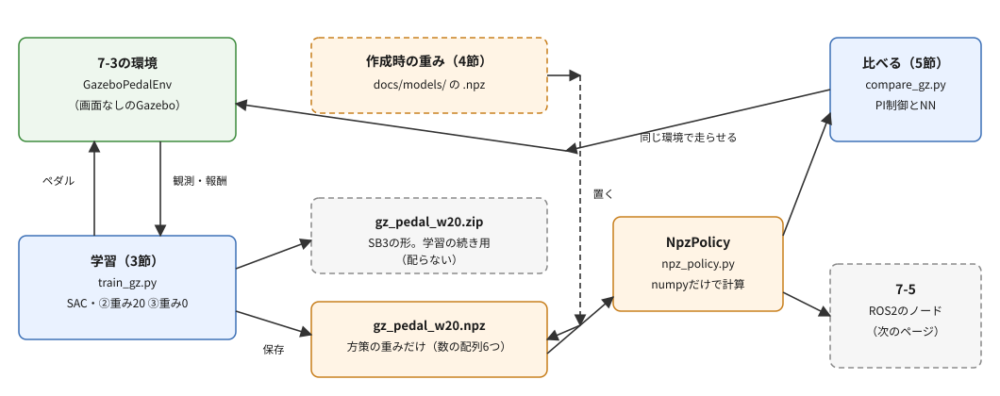
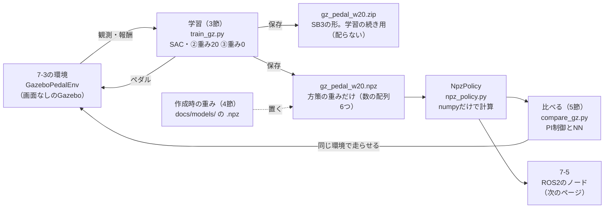

# フェーズ7-4 手順書: GazeboでNNの方策を学習させ、PI制御と比べる

[`docs/learning_plan.md`](learning_plan.md) フェーズ7の7-4（[`docs/idea_origin.md`](idea_origin.md) ステップ6）に対応する。フェーズ7-2では、PI制御の式はそのままに、ゲインを強化学習で選んだ。このページでは、PI制御の式そのものをやめ、観測から0.1秒ごとにペダルを直接選ぶニューラルネットワーク（NN）の方策を、7-3で作ったGazeboの環境で、SACに学習させる。学習したNNの重みを、数だけのファイルに書き出して、numpyだけで方策を計算し、PI制御とフェーズ6-3の指標で比べる。

- 想定環境: WSL2 + Ubuntu 24.04 + ROS2 Jazzy（Gazebo Harmonic）
- 前提: フェーズ7-3（[`docs/phase7_3_gazebo_env.md`](phase7_3_gazebo_env.md)。`~/rl_practice` に `gz_pedal_env.py` があり、`learn_bringup` に `gazebo_rl.launch.py` がある）
- 所要目安: 2コマ。自分で学習させる場合は、ほかに計算を待つ時間が、課題を除いて約3.2時間（1本約1.6時間を2本）ある。4節の配布の重みを使う場合は、計算を待つ時間は15分程度
- 言語: Python

> **この手順書の位置づけ（暫定）**: フェーズ7は作成中で、構成を大きく改める可能性がある。

> **進め方**: 1節で全体像を見る。2節で、NNの方策の形と、学習した重みを保存する2つの形を見る。3節で学習のスクリプトを書き、行き過ぎの重みを20（②）と0（③）にして、2本学習させる。学習を待てない場合は、3節はスクリプトを書くところまでにして、4節で、作成時に学習させた重みを読み込む。5節で、PI制御と比べる。サンプルは学習の手がかりとして最小限に書いたもので、公式の文書の転載ではない。

> **実行環境が無くても読めるように**: 実行する手順の直後には「期待する結果」として、表示される内容の例とその読み方を載せている。期待する結果の出どころは次のとおり。3節の学習と、5節の比較は、使い捨ての環境で画面なしのGazeboを起動し、実際に実行した表示（2026-10-07・08。SB3 2.9.0・Gymnasium 1.3.0・PyTorch 2.14.1（CPU版））である。4節の重みの中身の表示は、配布する重みのファイルで実際に実行した表示。作成時は、フェーズ7-3と同じく、`learn_py` はワークスペースをビルドする代わりに、同じファイルを置いたフォルダを `PYTHONPATH` に加えて読み込んだ。`time[s]` の列は、実行ごとに変わる。学習の途中経過は、PCや版によって大きく変わる（6節の補足）。5節の比較の値は、同じ重みを使えば、ほぼ同じになる（トルクの指令がGazeboに届く時機によって、わずかに変わる可能性はある。7-3の4節の末尾の補足）。

## 0. 学習目標と完了条件

1. PI制御の式をやめ、観測から直接ペダルを選ぶNNの方策を、Gazeboの車両でSACに学習させられる。
2. 学習したNNの方策の重みを、数の配列だけのファイル（`.npz`）に書き出し、numpyだけで方策を計算できる。pickleを含むファイルを読み込む危険と、`allow_pickle=False` の意味を説明できる。
3. 行き過ぎの重みを変えると、NNの方策でも行き過ぎ量が変わることを、6-3の指標で確かめられる。
4. 学習したNNとPI制御を、学習に使っていないシナリオで比べ、それぞれのよい点と弱い点を説明できる。

完了条件: 5節の比較表を、自分で学習させた重みか配布の重みで出し、NNとPI制御の違いを、収益と指標で説明できる。

## 1. 全体像

フェーズ7-2では、PI制御の式（偏差に比例して踏み、偏差の積み重ねに応じて踏み足す）はそのままに、2つのゲインだけを強化学習で選んだ。7-2の5節で見たとおり、選ぶ数が2つだけなら、格子の探索で十分だった。強化学習が力を発揮するのは、選ぶものが多い場合や、状況に応じて選び直す場合である。このページでは、その形として、0.1秒ごとに、観測からペダルを直接選ぶNNを学ばせる。観測は、7-3の4節の環境のとおり、目標・速度・偏差・前回のペダル・次の変わり目までの時間の5つである。PI制御の式を使わないので、「偏差に応じてどう踏むか」という構造そのものを、試行錯誤から学ぶことになる。

学習の舞台は、7-3で作ったGazeboの環境である。1本の学習（110エピソード、99,000ステップ）に、作成時は約1.6時間かかった（7-3の5節の見積もりは約1.7時間）。このページでは、行き過ぎの重みを20にした②と、0にした③の2本を学習させる（番号は、7-2の②③と同じく、行き過ぎの重みを20と0にした条件を指す）。進め方は、次の2通りから選べる。

- **自分で学習させる**: 3節の②と③を実行する。2本で約3.2時間かかる。
- **学習を待てない**: 3節は、スクリプトを読んで書くところまでにする。4節で、作成時に学習させたNNの重み（②③の2つ）を読み込む。

どちらの場合も、5節で、学習に使っていないシナリオで、PI制御と、②③のNNを比べる。



<details>
<summary>同じ図（mermaid版）</summary>



</details>

## 2. NNの方策と、重みの保存の形

### 2-1. NNの方策の形

SB3のSACの方策（actor）のNNは、フェーズ7-0の5節で振り子について見た形と同じである。違うのは、入口の数（観測の数）が5になることだけである。

- 観測5つ → 256個の数を持つ層 → 256個の数を持つ層 → 行動の中心の値（`mu`）1つ、という順に、掛け算と足し算と `ReLU`（負の値を0にする関数）を重ねる。
- 最後に `tanh`（どんな値も−1〜1に押し込む関数）を通して、ペダル（−1〜1）にする。振り子ではこの後にトルクの範囲（−2〜2）へ引き延ばしたが、ペダルの範囲は−1〜1なので、そのまま使う。
- 重みとバイアス（足す数）は、合わせて67,585個ある（ $5 \times 256 + 256$ 、 $256 \times 256 + 256$ 、 $256 + 1$ の和）。PI制御は、ゲインの2つの数で決まった。

学習中は、SACは `mu` の周りにばらつかせた行動を試す（探索。7-0の2-4節）。学習の後に方策として使うときは、ばらつかせず、`mu` に `tanh` を通した値だけを使う（`predict` の `deterministic=True`）。つまり、学習した方策は、上の掛け算と足し算を順に計算するだけの関数で、SB3が無くても計算できる。

### 2-2. 重みを保存する2つの形

このページでは、学習したものを、次の2つの形で保存する。

| 形 | 中身 | 何に使うか |
|---|---|---|
| SB3の `.zip`（`model.save`） | 方策（actor）と価値の見積もり（critic）のNN、学習に使う最適化の状態、設定。JSONで書けない値は、cloudpickleという方法で保存される | 学習の続きをする。SB3の `predict` で使う |
| `.npz`（numpyの `np.savez`） | 方策の各層の重みとバイアスの、6つの数の配列だけ | numpyだけで方策を計算する。配布する |

`.zip` は、自分で学習させたものを、自分で読み込む分には便利である。一方、**他の人から受け取った `.zip` は、読み込まない**ほうがよい。cloudpickleは、Pythonの `pickle` を広げたものである。Pythonの公式の文書は、`pickle` は安全ではなく、細工されたデータを読み込むと、読み込むときに任意のコードが実行されうるので、信頼できないデータを読み込まないように警告している。

`.npz` は、数の配列をまとめたファイルである。numpyの `np.load` に `allow_pickle=False` を渡す（numpyの既定の値もこれ）と、pickleを使った配列を読み込もうとしたときにエラーになり、数の配列だけを読む。作成時に学習させた重みを配るときは、このページでは `.npz` の形にした（4節）。

`.npz` を使う理由は、もう1つある。方策を使う側（5節の比較と、7-5のROS2のノード）が、SB3とPyTorchを読み込まずに、numpyだけで動くことである。

## 3. SACで学習させる

### 3-1. 学習のスクリプト（`train_gz.py`）

7-2の `train_gain.py` と同じく、条件をコマンドの引数で切り替えられる学習のスクリプトを作る。途中経過の表示と保存のしかたが、7-2と違う（解説の「途中経過」）。

ファイル: `~/rl_practice/train_gz.py`

```python
# Gazeboのペダルの環境で、SACを学習させ、10エピソードごとに途中経過を表示して、モデルと方策の重み（.npz）を保存する。
import argparse
import time

import numpy as np
from stable_baselines3 import SAC

from gz_pedal_env import CONTROL_INTERVAL, GazeboPedalEnv
from vehicle_env import EPISODE_LENGTH

EPISODE_STEPS = round(EPISODE_LENGTH / CONTROL_INTERVAL)  # 1エピソードのステップ数（900）
REPORT_EPISODES = 10  # 途中経過を表示し、保存する間隔 [エピソード]


# SACの方策（行動を決めるNN）の重みを、層ごとに w0, b0, w1, b1, … の名前で、数の配列だけの .npz に書き出す。
def export_policy(model, path):
    layers = [m for m in model.actor.latent_pi if hasattr(m, 'weight')] + [model.actor.mu]
    arrays = {}
    for i, layer in enumerate(layers):
        arrays[f'w{i}'] = layer.weight.detach().cpu().numpy()
        arrays[f'b{i}'] = layer.bias.detach().cpu().numpy()
    np.savez(path, **arrays)


# 引数で選んだ行き過ぎの重みで学習させ、10エピソードごとに、学習中の収益の平均・エントロピーの係数を表示して保存する。
def main():
    parser = argparse.ArgumentParser()
    parser.add_argument('--weight', type=float, default=20.0)
    parser.add_argument('--episodes', type=int, default=110)
    parser.add_argument('--seed', type=int, default=0)
    args = parser.parse_args()

    env = GazeboPedalEnv(overshoot_weight=args.weight)
    model = SAC('MlpPolicy', env, verbose=0, seed=args.seed)
    name = f'gz_pedal_w{args.weight:g}'

    start = time.monotonic()
    print('episodes   steps   return  ent_coef  time[s]')
    for k in range(1, args.episodes // REPORT_EPISODES + 1):
        model.learn(total_timesteps=REPORT_EPISODES * EPISODE_STEPS, reset_num_timesteps=False)
        returns = [info['r'] for info in list(model.ep_info_buffer)[-REPORT_EPISODES:]]
        print(f'{k * REPORT_EPISODES:8d}  {model.num_timesteps:6d}  {np.mean(returns):7.2f}'
              f'  {model.log_ent_coef.detach().exp().item():8.4f}  {time.monotonic() - start:7.0f}', flush=True)
        model.save(name)
        export_policy(model, f'{name}.npz')
    env.close()


if __name__ == '__main__':
    main()
```

**`train_gz.py` の解説**

- **引数**: `--weight` は行き過ぎの重み（既定20）、`--episodes` は学習させるエピソードの数（既定110。10の倍数で指定する）、`--seed` は学習の乱数の種（既定0）である。報酬の倍率（10倍）と、偏差をm/sのまま渡すことは、7-3の環境の既定のままにする（理由は7-3の4節の「報酬と観測」）。
- **ステップの数**: 1エピソードは900ステップ（0.1秒ごとに90秒分）なので、110エピソードは99,000ステップ（約10万）になる。7-3の5節の見積もりは約1.7時間で、作成時の実測は約1.6時間だった。
- **途中経過**: 7-2では、学習用とは別に評価用の環境を作り、決まったシナリオで評価した。Gazeboの環境は、1つのGazeboのワールドに1つしか作れない（同じ車両を2つの環境から動かすことになる）ので、評価用の環境を別に作れない。そこで、**学習中のエピソードの収益**を表示する。SB3は、学習中のエピソードが終わるたびに、その収益を `model.ep_info_buffer` に記録している（7-0の4-2節の `ep_rew_mean` と同じ記録）。10エピソード（9,000ステップ）ずつ学習させ、その10エピソードの収益の平均を表示する。学習中のエピソードは、探索のばらつきを入れた行動で、シナリオも毎回違う（乱数で作られる）ので、`deterministic=True` で決まったシナリオを走らせる7-2の評価より、値がばらつく。
- **区切りをエピソードの長さに合わせる**: `model.learn` を9,000ステップずつ呼ぶと、区切りがちょうどエピソードの終わりに来る。`reset_num_timesteps=False`（7-2の3-1節）で、続きから学習させる。
- **`return` の物差し**: 学習中のエピソードの収益は、環境が返した報酬の合計なので、報酬を10倍にした値（7-3の5-2節のPI制御の収益と同じ物差し）である。重み0で学習させた③では、行き過ぎを減点しない収益になる。
- **保存**: 10エピソードごとに、`model.save` でSB3の `.zip` を、`export_policy` で `.npz` を、同じ名前で上書きして保存する（②は `gz_pedal_w20.zip` と `gz_pedal_w20.npz`）。長い学習なので、途中で `Ctrl+C` で止めても、最後に表示した時点のものが残る。
- **`export_policy`**: 方策のNN（`model.actor`）の層のうち、重みを持つもの（`latent_pi` の2つの `Linear` と、`mu`）を順に取り出し、重み（`weight`）とバイアス（`bias`）を、`w0`・`b0`・`w1`・`b1`・`w2`・`b2` の名前で `np.savez` に渡す。`detach().cpu().numpy()` は、PyTorchの値を、学習の計算から切り離してnumpyの配列にする書き方である。`log_std`（探索のばらつき）とcriticは、方策を使うときには要らないので書き出さない。

### 3-2. ② 行き過ぎの重み20で学習させる

T1でGazeboを起動し、T2で学習させる。T2は、強化学習の仮想環境を有効にしたターミナルである（7-3の5-2節と同じ準備）。

```bash
# T1
cd ~/ros2_ws

source install/setup.bash

ros2 launch learn_bringup gazebo_rl.launch.py

# T2
source ~/ros2_ws/install/setup.bash

source ~/rl_venv/bin/activate

cd ~/rl_practice

python train_gz.py
```

約1.6時間かかる。T1は、③の学習（3-3節）まで動かしたままでよい。

**期待する結果**（T2の分。`time[s]` の列は、実行ごとに変わる）:

```text
episodes   steps   return  ent_coef  time[s]
      10    9000  -3991.59    0.1957      537
      20   18000  -398.73    0.1565     1077
      30   27000  -658.86    0.1478     1619
      40   36000   -91.17    0.1223     2164
      50   45000  -236.05    0.0791     2707
      60   54000   -87.97    0.0895     3212
      70   63000   -85.32    0.0699     3717
      80   72000   -83.58    0.0637     4224
      90   81000   -48.24    0.0613     4728
     100   90000   -47.25    0.0522     5237
     110   99000  -125.49    0.0430     5744
```

各行は、10エピソードごとの途中経過である。`return` は、直前の10エピソードの、学習中の収益の平均（報酬10倍・重み20）、`ent_coef` はエントロピーの係数（7-2の3-1節）、`time[s]` は学習を始めてからの秒数である。比べる目安は、7-3の5-2節のPI制御の収益（3つのシナリオで−23.29〜−41.98）である。

- **最初の10エピソード**は−3992と、PI制御よりずっと悪い。NNの重みは乱数で始まり、探索のばらつきも大きいので、目標から大きく外れたまま走るエピソードが多い。
- **20〜80エピソードでは、−84〜−659の間を行き来しながら**、おおむね改善する。90・100エピソードで−48・−47まで良くなる。
- **110エピソードで、−125に落ちる**。10エピソードの平均なので、いくつかのエピソードで目標から大きく外れると、平均が大きく下がる。学習中のエピソードは、探索のばらつきを入れた行動で走るので、方策が中心に選ぶペダルがよくても、ばらつきで大きく外れることがある。最後に保存された重みを、ばらつきを入れずに走らせると、PI制御よりは悪いが、目標を追いかけることはできていた（5-2節の比較の表の `NN w20` の行。確かめ用のシナリオで、PI制御の−32.79に対して−38.56）。学習中の収益が落ちても、方策そのものが悪くなったとは限らない。
- **`ent_coef`** は、10エピソードの0.20から、110エピソードの0.043まで下がっていく。学習が進むにつれ、SACは探索のばらつきを軽く見るように、自分で調整している。
- 学習中の収益は、学習が進んでいるかの大まかな目安である。方策の良し悪しは、5節のように、ばらつきを入れずに、決まったシナリオで走らせて確かめる。

### 3-3. ③ 行き過ぎの重み0で学習させる

3-2節のT1を動かしたまま、T2で、重みを0にして学習させる。約1.6時間かかる。

```bash
python train_gz.py --weight 0
```

**期待する結果**（T2の分。`time[s]` の列は、実行ごとに変わる）:

```text
episodes   steps   return  ent_coef  time[s]
      10    9000  -838.57    0.0789      564
      20   18000  -137.74    0.0458     1122
      30   27000   -39.32    0.0433     1689
      40   36000   -40.07    0.0373     2198
      50   45000   -30.08    0.0288     2710
      60   54000   -32.63    0.0239     3224
      70   63000   -31.05    0.0199     3733
      80   72000   -28.62    0.0154     4243
      90   81000   -32.76    0.0142     4755
     100   90000   -29.78    0.0117     5268
     110   99000   -37.31    0.0099     5781
```

列の意味は3-2節と同じだが、`return` は重み0の収益（行き過ぎを減点しない）なので、②の `return` とは比べられない。

- **最初の10エピソードで−839、20エピソードで−138**と、②より早く良くなる。
- **30エピソード以降は、−29〜−40の間で落ち着く**。②のように−100を超えて落ちることが無い。行き過ぎを減点しないので、「行き過ぎないように手前で止める」ことを学ぶ必要が無く、学ぶことが少ないためと考えられる。
- **`ent_coef`** は、②（0.20→0.043）より小さい値（0.079→0.0099）で動く。この係数は、方策のばらつき（エントロピー）を目標の値に保つように、SACが自動で上げ下げする（7-2の3-1節）。③の係数が②より小さくなった理由は、作成時には確かめていない。重み0の報酬は、行き過ぎの減点が無い分、②より大きさが小さいので、そのことが関係していると考えられる。

学習が終わったら、T1を `Ctrl+C` で止める。

## 4. 作成時に学習させた重みを使う

### 4-1. 重みのファイルを置く

3節の学習を待てない場合は、作成時に3節の②③と同じ手順で学習させた重みを、このリポジトリから `~/rl_practice` に置く。自分で学習させた場合は、自分の重み（`gz_pedal_w20.npz`・`gz_pedal_w0.npz`）がすでにあるので、この節の4-1は飛ばしてよい（同じ名前なので、取ってくると上書きされる）。

```bash
cd ~/rl_practice

curl -LO https://raw.githubusercontent.com/SanghunIm1991/ros2MinimalPhysicalAi/main/docs/models/gz_pedal_w20.npz

curl -LO https://raw.githubusercontent.com/SanghunIm1991/ros2MinimalPhysicalAi/main/docs/models/gz_pedal_w0.npz
```

`curl -LO` は、URLのファイルを、同じ名前で今のフォルダに保存する（`curl` は、[ROS2の環境構築](setup_wsl2_ros2.md) の4節の2で入れた）。ファイルは、GitHubの [`docs/models/`](models/) でも見られる。この重みは、学習に使ったStable-Baselines3と同じMIT Licenseで配布している（[`LICENSE`](../LICENSE) の3）。

中身を確かめる。

```bash
python -c "import numpy as np; d = np.load('gz_pedal_w20.npz', allow_pickle=False); print({k: d[k].shape for k in d.files})"
```

**期待する結果**:

```text
{'w0': (256, 5), 'b0': (256,), 'w1': (256, 256), 'b1': (256,), 'w2': (1, 256), 'b2': (1,)}
```

`w0`・`b0` が1つめの層（観測5つ → 256）、`w1`・`b1` が2つめの層（256 → 256）、`w2`・`b2` が `mu`（256 → 1）の重みとバイアスである。2-1節の形のとおり、数の配列が6つあるだけで、ほかのものは入っていない。

### 4-2. numpyだけで方策を計算する（`npz_policy.py`）

ファイル: `~/rl_practice/npz_policy.py`

```python
# 7-4で学習させたNNの方策を、数の配列だけのファイル（.npz）から読み込み、numpyだけで動かす（SB3もPyTorchも使わない）。
import numpy as np


# .npz の重みで、観測からペダルを計算する方策。中間の層はReLU、最後の層はtanhで−1〜1に収める。
class NpzPolicy:
    # 層ごとの重み w0, b0, w1, b1, … を読み込む。allow_pickle=False で、数の配列以外は読まない。
    def __init__(self, path):
        with np.load(path, allow_pickle=False) as data:
            count = len(data.files) // 2
            self.layers = [(data[f'w{i}'], data[f'b{i}']) for i in range(count)]

    # 観測 obs（5つの数）から、ペダル（1つの数の配列）を返す。
    def __call__(self, obs):
        h = np.asarray(obs, dtype=np.float32)
        for w, b in self.layers[:-1]:
            h = np.maximum(w @ h + b, 0.0)
        w, b = self.layers[-1]
        return np.tanh(w @ h + b)
```

**`npz_policy.py` の解説**

- **`__init__`**: `np.load` に `allow_pickle=False` を渡して読み込む（2-2節）。`with` で開くと、読み終わったらファイルを閉じる。配列の数（6）の半分が層の数（3）になる。
- **`__call__`**: 2-1節の計算そのものである。1つめと2つめの層は、`w @ h + b`（`@` は行列の掛け算）を計算して、`np.maximum(…, 0.0)` で負の値を0にする（`ReLU`）。最後の層は、`np.tanh` で−1〜1に押し込む。`__call__` を書いたクラスの値は、関数のように `policy(obs)` で呼べる。
- SB3の `predict(obs, deterministic=True)` と同じ値になる（作成時に、学習させたモデルで、1000通りのでたらめな観測を入れて比べると、差は最大で約4×10⁻⁶だった。小数の計算の順番の違いによる）。

## 5. PI制御と比べる

### 5-1. 比べるスクリプト（`compare_gz.py`）

7-2の4-2節と同じく、学習に使っていない確かめ用のシナリオで比べる。Gazeboの環境は1エピソードに約42秒かかるので、シナリオは5つ（種20〜24）にした。PI制御（既定のゲイン）と、②③のNNの3つで、15エピソード、約11分かかる。

ファイル: `~/rl_practice/compare_gz.py`

```python
# Gazeboの車両で、PI制御（既定のゲイン）と、学習したNNの方策（.npz）を、確かめ用のシナリオで比べる。
import numpy as np

from gz_pedal_env import CONTROL_INTERVAL, GazeboPedalEnv
from learn_py.metrics import evaluate
from learn_py.pi_control import PIController
from npz_policy import NpzPolicy

TEST_SEEDS = range(20, 25)  # 学習に使っていない、確かめ用のシナリオ（7-2の4-2節と同じ考え方）
REWARD_SCALE = 10.0         # 7-3の5-2節の収益と同じ物差しにする（gz_pedal_env の既定）


# PI制御を、観測からペダルを返す方策の形にする（0.1秒ごとに計算。7-3の5-1節の run_pi と同じ）。
class PIPolicy:
    # 既定のゲインのPI制御器を、積分の項を0にして作る。
    def __init__(self):
        self.controller = PIController(kp=0.5, ki=0.1)

    # 観測 obs から目標と速度を戻して偏差を計算し、ペダル（1つの数のリスト）を返す。
    def __call__(self, obs):
        return [self.controller.update(obs[0] * 10.0 - obs[1] * 10.0, CONTROL_INTERVAL)]


# 方策を作る関数 make_policy で、種 seed のシナリオを1エピソード走らせ、
# 2つの重みでの収益・RMS・行き過ぎ量・定常偏差の大きさ・ペダルの動いた量を返す。
def run(env, make_policy, seed):
    policy = make_policy()
    obs, _ = env.reset(seed=seed)
    error = overshoot = 0.0
    done = False
    while not done:
        obs, _, done, _, info = env.step(np.asarray(policy(obs), dtype=np.float32))
        error += info['squared_error']
        overshoot += info['squared_overshoot']
    steps, rms = evaluate(*(list(c) for c in zip(*env.history)))
    pedal = np.array([h[3] for h in env.history])
    return [-REWARD_SCALE * error, -REWARD_SCALE * (error + 20.0 * overshoot), rms,
            np.mean([s.overshoot for s in steps]),
            np.mean([abs(s.steady_error) for s in steps]),
            np.abs(np.diff(pedal)).sum()]


# 3つの方策を、確かめ用のシナリオで走らせ、平均を表にして表示する。
def main():
    policies = {
        'PI default': PIPolicy,
        'NN w20': lambda: NpzPolicy('gz_pedal_w20.npz'),
        'NN w0': lambda: NpzPolicy('gz_pedal_w0.npz'),
    }
    env = GazeboPedalEnv()
    print('policy      ret(w0)  ret(w20)    RMS  overshoot  steady  pedal_travel')
    for name, make_policy in policies.items():
        r = np.mean([run(env, make_policy, seed) for seed in TEST_SEEDS], axis=0)
        print(f'{name:10s}  {r[0]:7.2f}  {r[1]:8.2f}  {r[2]:5.3f}  {r[3]:8.2f}%  {r[4]:6.3f}  {r[5]:12.1f}',
              flush=True)
    env.close()


if __name__ == '__main__':
    main()
```

**`compare_gz.py` の解説**

- **`PIPolicy`**: 7-3の5-1節の `run_pi` と同じPI制御を、NNの方策と同じく「観測を受け取ってペダルを返すもの」の形にしたクラスである。観測の1つめと2つめ（目標と速度を10で割ったもの）に10を掛けて戻し、偏差を計算する。
- **`run`**: 方策を作る関数 `make_policy` を受け取り、エピソードの始めに方策を作り直す（PI制御の積分の項を0から始めるため）。1エピソードを走らせ、7-2の4-2節の `compare_gains.py` と同じ6つの値を返す。収益は、`info` の内訳から、重み0と重み20で計算し直し、7-3の5-2節と同じく10倍にする。RMS・行き過ぎ量・定常偏差は、フェーズ6-3の `evaluate` に環境の記録（0.02秒ごと）を渡して求める。6-3の `evaluate` は、最初に目標が変わった時点（10秒）から数えるので、止まった状態から最初の目標へ加速する最初の10秒は、指標には入らない（収益には入る）。ペダルの動いた量は、0.02秒ごとの記録の隣どうしの差の大きさを、90秒分足したものである。ペダルを細かく動かすほど、この値が大きくなる。
- **`main`**: 環境は1つだけ作り、3つの方策で順に使う（1つのGazeboのワールドに、環境は1つしか作れない。3-1節の解説）。NNの方策は、`lambda` で、エピソードごとに `.npz` を読み込み直す（読み込みは一瞬で終わる）。

### 5-2. 動かす

T1でGazeboを起動し、T2で比べる（どちらも3-2節と同じ準備）。

```bash
# T1
cd ~/ros2_ws

source install/setup.bash

ros2 launch learn_bringup gazebo_rl.launch.py

# T2
source ~/ros2_ws/install/setup.bash

source ~/rl_venv/bin/activate

cd ~/rl_practice

python compare_gz.py
```

約11分かかる。終わったら、T1を `Ctrl+C` で止める。

**期待する結果**（T2の分。配布の重みを使った場合。自分で学習させた重みでは、NNの2行が変わる）:

```text
policy      ret(w0)  ret(w20)    RMS  overshoot  steady  pedal_travel
PI default   -23.15    -32.79  0.793     17.06%   0.050          18.4
NN w20       -28.00    -38.56  0.861     20.38%   0.567          92.6
NN w0        -25.91    -47.84  0.924     30.18%   0.780          32.3
```

各列は、重み0の収益（`ret(w0)`）、重み20の収益（`ret(w20)`）、RMS [m/s]、行き過ぎ量 [%]、定常偏差の大きさ [m/s]、ペダルの動いた量で、どれも5つの確かめ用のシナリオの平均である。収益は、7-3の5-2節と同じく、報酬を10倍にした物差しである。

- **NNは、PI制御に届かない**: ②のNN（`NN w20`）の重み20の収益は−38.56で、PI制御（−32.79）より約18%悪い。③のNN（`NN w0`）の重み0の収益も−25.91で、PI制御（−23.15）より約12%悪い。RMSは0.86・0.92で、PI制御の0.79に近く、目標を追いかけること自体はできている。
- **定常偏差が残る**: NNの定常偏差の大きさは0.57・0.78 m/sで、PI制御（0.050 m/s）の10倍以上ある。段の最後になっても、目標にぴったりは合わない。PI制御は、積分の項（偏差の積み重ね）で定常偏差を0に近づける。NNの方策は、その時点の観測だけからペダルを決めるので、積み重ねを覚える仕組みが無い（7-3の4節の「報酬と観測」）。
- **②のNNは、ペダルを細かく動かし続ける**: ペダルの動いた量は、PI制御の18.4に対して、②のNNは92.6と約5倍である。目標の近くで、ペダルを細かく行き来させていて、なめらかに落ち着かない。
- **重みで、行き過ぎ量が変わる**: 行き過ぎ量は、②のNN（重み20）が20.4%、③のNN（重み0）が30.2%で、行き過ぎを重く減点すると、NNでも行き過ぎが減る。収益も、②のNNは重み20の収益で、③のNNは重み0の収益で、相手を上回る。それぞれ、学習した報酬で測ると、自分のほうがよい。
- **ただし、追従の速さとのトレードオフは、6-3の指標でははっきりしない**: 7-2の4節では、行き過ぎが減る代わりに、目標へ近づくのが遅くなった。このページでは、RMSも②のNNのほうがよい（0.861と0.924）。③のNNが上回るのは、重み0の収益（`ret(w0)`）だけで、これには、6-3の指標が数えない最初の10秒（止まった状態から最初の目標へ加速する段。5-1節の `run` の解説）が含まれる。6節のとおり、1回ずつの学習の比較なので、差の大きさまでは信用できない。

PI制御は、「偏差に比例して踏み、偏差の積み重ねに応じて踏み足す」という、追従のための構造を最初から持っている。NNは、この構造を何も知らない状態から、約110エピソードの試行錯誤だけで、観測からペダルへの対応を一から学ぶ。人がよい構造を知っている問題では、その構造を使うほうが、少ない手間でよい結果が出る。この結論は、7-2の「選ぶ数が2つだけなら、格子の探索で十分」と同じ向きである。NNの方策を改良するときに試せること（PI制御の出力にNNの補正を足す、PI制御をまねることから学び始める、記憶を持つ方策を使う等）は、[没案として残したページの6節・7節](archive/phase7_3_pedal_policy_v1.md) にまとめてある（Pythonの式の環境での試行だが、考え方は同じである）。

## 6. 補足: 学習の結果は、PCや実行ごとに変わる

自分で学習させた結果は、3節の期待する結果や、配布の重みと同じにはならないことが多い。学習の乱数の種（`--seed`）を固定していても、次のことで、学習の道筋が変わるためである。

- **計算に使うスレッドの数やPC**: 計算の順番がわずかに変わり、小数の丸めの違いが、学習の中で積み重なる。
- **Gazeboとのやりとりの時機**: トルクの指令がGazeboに届く時機によって、計算がわずかに変わることがある（7-3の4節の末尾の補足）。学習では、その小さな違いも、学習の道筋を変えるきっかけになる。

作成時にも、②を同じPC・同じ版・同じ種（0）で2回学習させると、途中経過がまったく違った（1回目の重みは、作成の途中で失ったので、配布していない）。3節の期待する結果は2回目のもので、1回目は、10エピソードで−6714、20で−148、60〜90で−66〜−76、最後の110で−519だった（2回目は、−3992、−399、90・100で−48・−47、110で−125）。1回目の最後の重みを、5節と同じ確かめ用のシナリオで走らせた重み20の収益は−35.26で、2回目（5-2節の−38.56）と違った。Pythonの式の環境なら、同じPC・同じ版・同じ種で同じ結果になる（7-2の冒頭の注記）。Gazeboの環境では、やりとりの時機の小さな違いだけで、学習の道筋が変わったと考えられる。

また、作成時に、Pythonの式の環境で同じ形の学習を試した（[没案として残したページの4節](archive/phase7_3_pedal_policy_v1.md)）ときは、同じ設定でも、種やスレッドの数を変えるだけで、10万ステップの収益が数倍違った。設定の良し悪しを数で比べるには、条件をそろえ、種を変えて何回か学習させて、ばらつきの大きさと比べる必要がある。Gazeboの環境では1本に約1.6時間かかるので、このページでは、②と③を1回ずつ学習させるだけにした。5節の②と③の違いのうち、小さな差は、偶然の可能性がある。

## 7. 本フェーズのまとめ

- PI制御の式をやめ、0.1秒ごとに観測からペダルを直接選ぶNNの方策を、Gazeboの車両でSACに学習させた。1本の学習（110エピソード）は、作成時に約1.6時間かかった。
- Gazeboの環境は1つしか作れないので、途中経過は学習中のエピソードの収益で見た。学習中の収益は探索のばらつきを含むので、方策の良し悪しは、ばらつきを入れずに、決まったシナリオで走らせて確かめる。
- 学習した方策は、掛け算と足し算と `ReLU`・`tanh` を重ねるだけの関数なので、重みを数だけの `.npz` に書き出せば、numpyだけで計算できる。pickleを含むファイル（SB3の `.zip`）は、信頼できない相手から受け取ったものを読み込まない。`.npz` は `allow_pickle=False` で読む。
- 学習したNNは、目標を追いかけることはできるが、PI制御には届かない。定常偏差が残り、ペダルを細かく動かし続ける。行き過ぎの重みを上げると、NNでも行き過ぎが減る。ただし、ゲインを選んだ7-2のような、追従の速さとのトレードオフは、6-3の指標でははっきり見えなかった。
- Gazeboの環境の学習は、同じ種でも実行ごとに途中経過が変わる。設定の良し悪しを数で比べるには、何回か学習させて、ばらつきの大きさと比べる必要がある。

## 8. つまずきやすい点

| 症状 | 確認すること |
|---|---|
| `/world/vehicle_rl/control が見つからない` で止まる | T1のlaunch（7-3の3-2節）が動いているか |
| `No module named 'gz_pedal_env'` や `'npz_policy'` | `~/rl_practice` で実行しているか。7-3の `gz_pedal_env.py`、4-2節の `npz_policy.py` を、同じフォルダに置いたか |
| `compare_gz.py` で `gz_pedal_w20.npz`（または `_w0`）が見つからない | 3節の学習を最後まで（または途中まで）実行したか。4-1節で取ってきたか |
| `curl` で取ってきたファイルを読み込むと、`ValueError: This file contains pickled (object) data.` になる | URLを打ち間違えると、GitHubのエラーの文字（`404: Not Found`）がそのまま保存される。numpyは、数の配列のファイルの形でないものをpickleとして読もうとし、`allow_pickle=False` なので止める。`head -c 100 gz_pedal_w20.npz` で、中身が文字になっていないか確かめ、URLを確かめて取り直す（`allow_pickle=True` にして読み込まない） |
| 学習の途中経過の値が、期待する結果と大きく違う | 学習は、PCや版、実行ごとに大きく変わる（6節）。値が違っても、収益がおおむね改善していれば、学習は進んでいる |
| 学習を途中で止めたい | `Ctrl+C` で止める。最後に途中経過を表示した時点の `.zip` と `.npz` が残る（3-1節の「保存」） |
| 比べる表のPI制御の行が、期待する結果と違う | 7-3の `gz_pedal_env.py` と、ワールドの減衰（7-3の2-3節）を確かめる。PI制御の行は、学習とは関係なく、ほぼ同じ値になるはずである |

## 9. 次へ

次の7-5（作成予定）では、このページの `.npz` の重みを読み込むROS2のノードを作り、フェーズ5-4のPI制御のノードの代わりに、現実の時間で動くGazeboの車両につなぐ。記録をフェーズ6-3の指標で、PI制御と比べる予定である。

## 10. 公式ドキュメント・参考資料

確認状況（2026-10-06）: 下のページは、実在を確認した（HTTP 200）。2-2節の `pickle` の警告は、Pythonの公式の文書の `pickle` のページの冒頭で、`allow_pickle` の既定の値と意味は、numpyの `numpy.load` のページで、SB3の `.zip` の中身とcloudpickleを使うことは、SB3の保存の形式のページで確かめた。

- [Python — pickle（Pythonオブジェクトの直列化）](https://docs.python.org/ja/3/library/pickle.html)（冒頭の警告）
- [NumPy — numpy.load](https://numpy.org/doc/stable/reference/generated/numpy.load.html)（`allow_pickle`）
- [Stable-Baselines3 — On saving and loading](https://stable-baselines3.readthedocs.io/en/master/guide/save_format.html)（`.zip` の中身）
- [Stable-Baselines3 — SAC](https://stable-baselines3.readthedocs.io/en/master/modules/sac.html)（SACの引数と方策の形）

> 出典: 2-2節のpickle・numpy・SB3の保存の形式の説明は、各公式の文書を自分の言葉で要約したもので、逐語の転載ではない。このページのサンプルコード（`train_gz.py`・`npz_policy.py`・`compare_gz.py`）は独自に書いたもので、フェーズ7-3の `gz_pedal_env.py` と、フェーズ5-2・6-3のサンプルを読み込んで使う。配布する重み（`docs/models/` の `.npz`）は、作成時に、このページの3節の手順で学習させたもので、MIT License（[`LICENSE`](../LICENSE) の3、全文は [`LICENSE-MIT`](../LICENSE-MIT)）で配布している。
