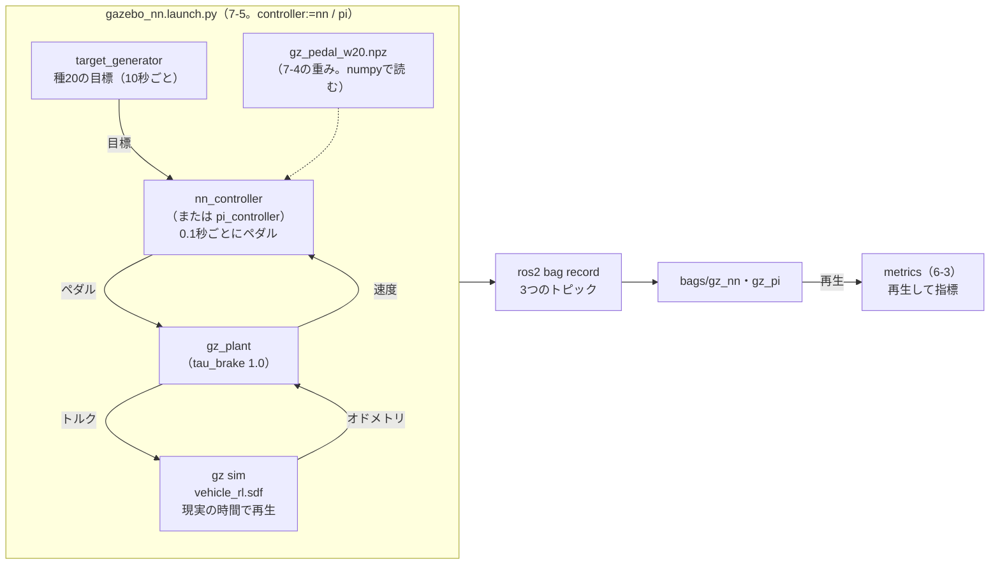

# フェーズ7-5 手順書: 学習したNNをROS2のノードにする

[`docs/learning_plan.md`](learning_plan.md) フェーズ7の7-5（[`docs/idea_origin.md`](idea_origin.md) ステップ6）に対応する。フェーズ7-4では、Gazeboの車両で、ペダルを直接選ぶNNの方策を学習させ、重みを数だけのファイル（`.npz`）に書き出した。ただし、7-4の比較は、強化学習の環境（Gazeboを少しずつ進める仕組み）の中で行ったもので、ROS2のノードどうしがトピックでつながる、ふだんの形ではなかった。このページでは、その重みを読み込むROS2のノードを作り、フェーズ5-2の `pi_controller` の代わりに置いて、現実の時間で動くGazeboの車両とループを閉じる。フェーズ6の記録と指標で、PI制御と比べる。

- 想定環境: WSL2 + Ubuntu 24.04 + ROS2 Jazzy（Gazebo Harmonic）
- 前提: フェーズ7-4（[`docs/phase7_4_gz_nn_policy.md`](phase7_4_gz_nn_policy.md)。`~/rl_practice` に `gz_pedal_w20.npz`（自分で学習させたものか、4節の配布の重み）と `npz_policy.py` がある）、フェーズ6-3（[`docs/phase6_3_metrics.md`](phase6_3_metrics.md)。`learn_py` に `metrics` があり、`learn_bringup` に6-1の `record.launch.py` がある）
- 所要目安: 2コマ
- 言語: Python（launchもPython形式）

> **この手順書の位置づけ（暫定）**: フェーズ7は作成中で、構成を大きく改める可能性がある。

> **進め方**: 1節で全体像を見る。2節で、NNの重みでペダルを計算するノードを作る。3節で、PI制御とNNを引数で切り替えられるlaunchとYAMLを作る。4節で、PI制御とNNで記録を取り、5節で、フェーズ6-3の指標で比べる。サンプルは学習の手がかりとして最小限に書いたもので、公式の文書の転載ではない。

> **実行環境が無くても読めるように**: 実行する手順の直後には「期待する結果」として、表示される内容の例とその読み方を載せている。期待する結果の出どころは次のとおり。3-4節のビルドと `--show-args` の表示は、使い捨ての環境で実際に実行した表示。4節の起動のログと、5節の `metrics` の表示は、使い捨ての環境で、Gazeboを画面なし（4-1節の末尾の `gz_args` の上書き）で起動し、実際に実行した表示（2026-10-08）である。行頭の時刻・プロセスの番号・パス・ビルドの秒数は、実行ごとに変わる。作成時は、`~/ros2_ws` の代わりに、このページで使うパッケージだけを手順書から写した使い捨てのワークスペースで確かめ、重みは7-4の配布の重み（`gz_pedal_w20.npz`）を使った。5節の指標は、Gazeboを現実の時間で動かすので、記録を取り直すと少し変わる。

## 0. 学習目標と完了条件

1. 強化学習で学習させた方策を、numpyだけで計算するROS2のノードにできる。
2. 学習のときと同じ観測を、ROS2のトピックの値から作れる。学習した範囲の外では、NNを使わないようにできる。
3. launchの引数と条件で、起動する制御器を切り替えられる。
4. PI制御とNNを、同じ一式・同じ目標の並びで記録し、フェーズ6-3の指標で比べられる。

完了条件: 4節でPI制御とNNの記録を取り、5節の比較表から、7-4と同じ傾向（NNはPI制御に届かず、定常偏差が残る）が、ROS2のノードの形でも見えることを説明できる。

## 1. 全体像

フェーズ5-4では、`target_generator` が目標速度を送り、`pi_controller` がペダルを決め、`gz_plant` がGazeboの車両を動かして速度を返す、という形でループを閉じた。`pi_controller` は、`/target_velocity` と `/plant/velocity` を受けて `/plant/pedal` を送るだけなので、同じトピックを受けて送るノードなら、何でも代わりに置ける。このページでは、そこに、7-4で学習させたNNの方策を置く。

NNの方策は、7-4の2-1節のとおり、掛け算と足し算と `ReLU`・`tanh` を重ねるだけの関数である。重みは `.npz` にあるので、ノードはnumpyだけで計算できる。PyTorchもSB3も要らないので、ノードは、強化学習の仮想環境ではなく、ふだんのROS2のPythonで動く。学習の道具と、学習したものを使う側を分けられることも、`.npz` に書き出した理由の1つである。

ただし、学習のときと条件をそろえる必要がある。NNは、7-3の学習用のワールド（車輪の関節に減衰を入れたもの）と、ブレーキの遅いプラント（`tau_brake` 1.0秒）で学習した。また、観測は、目標・速度・偏差・前回のペダル・次の変わり目までの時間の5つだった。このページでは、5-4の一式を写して、ワールドとプラントのパラメータを学習のときに合わせ、観測をトピックの値から作る。走らせる目標の並びは、7-4の確かめ用のシナリオの1つ（種20）にして、7-4の結果と見比べられるようにする。


<details>
<summary>同じ図（mermaid版）</summary>



</details>

## 2. NNの重みでペダルを計算するノード

### 2-1. 仕様

- ノード名・実行ファイル名: `nn_controller`（パッケージ `learn_py`）
- 受ける: `/target_velocity` と `/plant/velocity`（どちらも [`std_msgs/msg/Float64`](https://github.com/ros2/common_interfaces/blob/jazzy/std_msgs/msg/Float64.msg)）。
- 送る: `/plant/pedal`（`std_msgs/msg/Float64`、−1〜1）を、`period` 秒ごとに。名前・型は `pi_controller` と同じにする。
- 観測は、7-3の4節の環境の `_observation` と同じ5つ（目標と速度は10で割り、偏差は `error_scale` で割り、前回のペダル、次の変わり目までの時間を `change_interval` で割ったもの。±5に収める）。次の変わり目までの時間は、目標が変わった時刻を覚え、学習と同じく `change_interval` 秒ごとに変わる前提で数える。
- 目標が0以下の間（`target_generator` の最初の切り替えまで）は、NNを使わず、ペダル0を送る。学習では、目標は3〜15 m/sの範囲だけだったので、0はNNにとって学習した範囲の外である。
- パラメータ: `weights`（重みのファイルのパス）、`period`（既定0.1秒。学習と同じ）、`change_interval`（既定10秒）、`error_scale`（既定1。7-3の環境の既定と同じ）。どれも起動するときに決め、実行中の変更は受け付けない。
- ログ: 1秒に1回、目標・速度・ペダルを出す。

### 2-2. 方策のクラスを `learn_py` に写す

7-4の4-2節の `npz_policy.py`（`NpzPolicy`）は、ROS2を使わないクラスなので、そのまま `learn_py` に写して、ノードから `import` する（フェーズ5-1の `vehicle_model.py` を、`plant_node.py` から使ったのと同じ形）。

```bash
cp ~/rl_practice/npz_policy.py ~/ros2_ws/src/learn_py/learn_py/
```

**期待する結果**: 何も表示されない（`cp` は、成功しても何も表示しない）。

### 2-3. ノード（`nn_controller_node.py`）

ファイル: `ros2_ws/src/learn_py/learn_py/nn_controller_node.py`

```python
import os

import numpy as np
import rclpy
from rclpy.executors import ExternalShutdownException
from rclpy.node import Node
from std_msgs.msg import Float64

from learn_py.npz_policy import NpzPolicy


# 7-4で学習させたNNの方策（.npz）で、目標速度と現在速度からペダルの指令を計算して plant/pedal へ送るノード。
# 観測の作り方は、7-3の環境（gz_pedal_env.py）の _observation と同じにする。
class NNControllerNode(Node):
    # 重みのファイル・周期・目標が変わる間隔を宣言し、方策・通信の口・タイマーを用意する。
    def __init__(self):
        super().__init__('nn_controller')
        self.declare_parameter('weights', '')
        self.declare_parameter('period', 0.1)
        self.declare_parameter('change_interval', 10.0)
        self.declare_parameter('error_scale', 1.0)
        weights = os.path.expanduser(self.get_parameter('weights').value)
        self.policy = NpzPolicy(weights)
        self.period = self.get_parameter('period').value
        self.change_interval = self.get_parameter('change_interval').value
        self.error_scale = self.get_parameter('error_scale').value
        self.target = 0.0
        self.velocity = None     # 最初の速度が届くまでは None
        self.pedal = 0.0         # 前回のペダル（観測の1つ）
        self.change_time = None  # 目標が最後に変わった時刻

        self.sub_target = self.create_subscription(
            Float64, 'target_velocity', self.on_target, 10)
        self.sub_velocity = self.create_subscription(
            Float64, 'plant/velocity', self.on_velocity, 10)
        self.pub = self.create_publisher(Float64, 'plant/pedal', 10)
        self.timer = self.create_timer(self.period, self.on_timer)
        self.get_logger().info(f'loaded {weights}')

    # 目標速度を覚え、変わったらその時刻を覚える。
    def on_target(self, msg):
        if msg.data != self.target:
            self.change_time = self.get_clock().now()
        self.target = msg.data

    # 現在速度を覚えておく。
    def on_velocity(self, msg):
        self.velocity = msg.data

    # 周期ごとに観測を作り、方策でペダルを計算して送る。目標が0の間（学習した範囲の外）はペダル0にする。
    def on_timer(self):
        if self.velocity is None:
            return
        if self.target <= 0.0 or self.change_time is None:
            self.pedal = 0.0
        else:
            elapsed = (self.get_clock().now() - self.change_time).nanoseconds * 1e-9
            remaining = max(0.0, self.change_interval - elapsed) / self.change_interval
            obs = np.clip(np.array([self.target / 10.0, self.velocity / 10.0,
                                    (self.target - self.velocity) / self.error_scale,
                                    self.pedal, remaining], dtype=np.float32), -5.0, 5.0)
            self.pedal = float(self.policy(obs)[0])
        msg = Float64()
        msg.data = self.pedal
        self.pub.publish(msg)
        self.get_logger().info(
            f'target: {self.target:5.2f}, velocity: {self.velocity:5.2f} m/s, pedal: {self.pedal:+.2f}',
            throttle_duration_sec=1.0)


# エントリポイント（setup.py の entry_points から呼ばれる）。
# ノードを作って spin で回し、Ctrl+C で後片付けして終わる。
def main(args=None):
    rclpy.init(args=args)
    node = NNControllerNode()
    try:
        rclpy.spin(node)
    except (KeyboardInterrupt, ExternalShutdownException):
        pass
    finally:
        node.destroy_node()
        rclpy.try_shutdown()
```

**`nn_controller_node.py` の解説**

骨組みは、フェーズ5-2の `pi_node.py` と同じである（受けた値を覚え、タイマーでまとめて計算して送る）。違うのは、計算に `PIController` の代わりに `NpzPolicy` を使うことと、観測を作る部分である。

- **`__init__`**: パラメータを宣言し、`weights` のファイルから `NpzPolicy` を作る。`os.path.expanduser` は、パスの先頭の `~` をホームのフォルダに直す（YAMLや引数に `~/rl_practice/...` と書いても読めるようにするため）。ファイルが無いと、ここで `FileNotFoundError` になって止まる。読み込めたら、そのパスをログに出す。
- **`on_target`**: 目標が前と違えば、その時刻を `change_time` に覚える。時刻は、ノードの時計（`get_clock().now()`）で測る。launchで `use_sim_time` を真にするので、シミュレーション時刻になる（フェーズ5-4の5節）。
- **`on_timer`**: 7-3の環境の `_observation` と同じ並びで観測を作り、方策でペダルを計算して送る。次の変わり目までの時間は、「`change_interval` から、目標が変わってからの経過時間を引いたもの」を `change_interval` で割った値（0より小さくはしない）である。学習では、目標はちょうど10秒ごとに変わったので、この前提が成り立つ。目標が0以下の間は、ペダル0を送り、前回のペダルも0にしておく。
- **前回のペダル**: 観測の1つなので、送ったペダルを `self.pedal` に覚えておき、次の計算に使う。
- 実行中の変更（`ros2 param set`）を受け付ける `on_params` は、書いていない。重みや観測の作り方を途中で変えると、学習のときと条件がずれるためである。変える場合は、ノードを起動し直す。

> **補足: 学習した範囲の外では、NNを使わない**
>
> - **一般的なこと**: NNの方策は、学習で経験した範囲の観測では、それなりの行動を出す。範囲の外の観測（このページなら、目標0や、学習に無かった速さ）では、どんな行動を出すかの保証が無い。実際のロボットでNNを使うときは、入力が学習の範囲にあるかを確かめ、外れたら、決まった安全な動作（止める、人に知らせる、別の制御器に切り替える等）に移す仕組みを、NNの外に置くことが多い。
> - **このサンプルの扱い**: 目標が0以下の間はペダル0にする、という最も簡単な形だけにした。速度が学習の範囲を外れた場合の扱いは、書いていない。
> - **実務の目安**: NNの出力をそのまま使わず、範囲の確認や、出力の変化の速さの制限を、NNの外で行う。

### 2-4. 依存と登録、ビルド

`ros2_ws/src/learn_py/package.xml` の `<exec_depend>` の並びに、numpyへの実行時の依存を1行足す。numpyは、ROS2を入れたときにすでに入っている（ROS2の `ros2topic` などが使っている、aptの `python3-numpy`）ので、新しく入れる必要は無い。

```xml
<exec_depend>python3-numpy</exec_depend>
```

`ros2_ws/src/learn_py/setup.py` の `entry_points` に1行足す（既存の行は残す。フェーズ6-3の5-3節で足した `metrics` の行の後に続ける）。

```python
            'nn_controller = learn_py.nn_controller_node:main',
```

`npz_policy.py` は、ノードから `import` される部品なので、登録しない。ビルドは、3節のファイルを足してから、まとめて行う（3-4節）。

## 3. PI制御とNNを切り替えるlaunch

### 3-1. パラメータのYAML（`config/gazebo_nn.yaml`）

ファイル: `ros2_ws/src/learn_bringup/config/gazebo_nn.yaml`

```yaml
# フェーズ7-5の、学習用のワールドでPI制御とNNを比べる構成の、ノードごとのパラメータ
gz_plant:
  ros__parameters:
    tau_accel: 0.5
    tau_brake: 1.0
    scale: 0.025
    force_scale: 0.00019

pi_controller:
  ros__parameters:
    kp: 0.5
    ki: 0.1
    period: 0.1

nn_controller:
  ros__parameters:
    period: 0.1
    change_interval: 10.0

target_generator:
  ros__parameters:
    step_times: [10.0, 20.0, 30.0, 40.0, 50.0, 60.0, 70.0, 80.0, 90.0]
    step_values: [6.96, 9.34, 6.78, 4.55, 3.25, 7.21, 9.56, 6.64, 4.73]
```

- **`gz_plant`**: `tau_brake` を1.0にして、7-3の環境の既定（ブレーキの遅いプラント）に合わせる。ほかは、フェーズ5-4の `gazebo_plant.yaml` と同じである。
- **`pi_controller`**: ゲインは5-4と同じ既定。`period` を0.1秒にして、7-4で比べたPI制御（0.1秒ごとに計算）とそろえる。5-4では0.02秒（`pi_node.py` の既定）だった。
- **`nn_controller`**: `period` と `change_interval` は、学習のときと同じ値（既定と同じ）を明示しておく。`weights` は、3-3節のlaunchの引数で渡す。
- **`target_generator`**: 7-4の確かめ用のシナリオの種20の目標（7-1の `make_targets` で作った9つの値を、小数第2位で丸めたもの）を、10秒ごとに並べた。最初の10秒は目標0で、その間にGazeboが起動する。Gazeboの画面が開くのに10秒より長くかかるPCでは、最初の段が始まる前に車両の準備が整わないことがある（`target_generator` は現実の時間で目標を切り替える）。その場合は、4-1節の末尾のとおり画面なしで起動するか、`step_times` をすべて同じだけ遅らせる（5-4の6-1節では、最初の切り替えを15秒にした）。

記録用に、終わる時刻を足したYAMLも作る（フェーズ6-1の4-3節と同じ）。

```bash
cd ~/ros2_ws/src/learn_bringup/config

cp gazebo_nn.yaml gazebo_nn_record.yaml
```

写した `gazebo_nn_record.yaml` の `target_generator` の部分に、1行足す。最後の目標（90秒から）の10秒後に終わる。

```yaml
target_generator:
  ros__parameters:
    step_times: [10.0, 20.0, 30.0, 40.0, 50.0, 60.0, 70.0, 80.0, 90.0]
    step_values: [6.96, 9.34, 6.78, 4.55, 3.25, 7.21, 9.56, 6.64, 4.73]
    end_time: 100.0
```

### 3-2. ワールド

7-3の2-3節の学習用のワールド（`learn_bringup/worlds/vehicle_rl.sdf`）を、そのまま使う。7-3では、画面なし・一時停止で起動し、サービスで少しずつ進めた。このページでは、5-4と同じく、`-r`（再生した状態で始める）を付けて、現実の時間で動かす。

### 3-3. launchファイル（`launch/gazebo_nn.launch.py`）

フェーズ5-4の6-2節の `gazebo_plant.launch.py` を元に、ワールド・YAMLを替え、制御器を引数で切り替えられるようにする。6-1の4-2節で足した、`target_generator` が終わったら全体を止める `on_exit=Shutdown()` も入れておく。

ファイル: `ros2_ws/src/learn_bringup/launch/gazebo_nn.launch.py`

```python
from launch import LaunchDescription
from launch.actions import DeclareLaunchArgument, IncludeLaunchDescription, Shutdown
from launch.conditions import IfCondition
from launch.launch_description_sources import PythonLaunchDescriptionSource
from launch.substitutions import (EnvironmentVariable, EqualsSubstitution, LaunchConfiguration,
                                  PathJoinSubstitution)
from launch_ros.actions import Node
from launch_ros.substitutions import FindPackageShare


# 7-3の学習用のワールド（減衰入り）を現実の時間で動かし、PI制御か学習したNNでループを閉じる。
# Gazeboとブリッジ、gz_plant、制御器（引数 controller で pi か nn を選ぶ）、target_generator を起動する。
def generate_launch_description():
    controller = LaunchConfiguration('controller')
    params_file = LaunchConfiguration('params_file')
    world = PathJoinSubstitution(
        [FindPackageShare('learn_bringup'), 'worlds', 'vehicle_rl.sdf'])
    gz_sim = PathJoinSubstitution(
        [FindPackageShare('ros_gz_sim'), 'launch', 'gz_sim.launch.py'])
    default_params = PathJoinSubstitution(
        [FindPackageShare('learn_bringup'), 'config', 'gazebo_nn.yaml'])
    sim_time = {'use_sim_time': True}
    return LaunchDescription([
        DeclareLaunchArgument(
            'controller', default_value='nn',
            description='制御器（pi または nn）'),
        DeclareLaunchArgument(
            'weights', default_value=[EnvironmentVariable('HOME'), '/rl_practice/gz_pedal_w20.npz'],
            description='nn のときに読み込む重みのファイル（7-4の .npz）'),
        DeclareLaunchArgument(
            'gz_args', default_value=['-r ', world],
            description='Gazeboに渡す引数（既定はワールドを再生した状態で開く）'),
        DeclareLaunchArgument(
            'params_file', default_value=default_params,
            description='各ノードのパラメータを書いたYAMLファイル'),
        IncludeLaunchDescription(
            PythonLaunchDescriptionSource(gz_sim),
            launch_arguments={
                'gz_args': LaunchConfiguration('gz_args'),
                'on_exit_shutdown': 'true',
            }.items(),
        ),
        Node(
            package='ros_gz_bridge', executable='parameter_bridge', name='ros_gz_bridge',
            output='screen',
            arguments=[
                '/clock@rosgraph_msgs/msg/Clock[gz.msgs.Clock',
                '/model/vehicle_green/odometry@nav_msgs/msg/Odometry[gz.msgs.Odometry',
                '/model/vehicle_green/joint/left_wheel_joint/cmd_force'
                '@std_msgs/msg/Float64]gz.msgs.Double',
                '/model/vehicle_green/joint/right_wheel_joint/cmd_force'
                '@std_msgs/msg/Float64]gz.msgs.Double',
            ],
        ),
        Node(
            package='learn_py', executable='gz_plant', name='gz_plant',
            output='screen', parameters=[params_file, sim_time],
        ),
        Node(
            package='learn_py', executable='pi_controller', name='pi_controller',
            output='screen', parameters=[params_file, sim_time],
            condition=IfCondition(EqualsSubstitution(controller, 'pi')),
        ),
        Node(
            package='learn_py', executable='nn_controller', name='nn_controller',
            output='screen',
            parameters=[params_file, sim_time, {'weights': LaunchConfiguration('weights')}],
            condition=IfCondition(EqualsSubstitution(controller, 'nn')),
        ),
        Node(
            package='learn_py', executable='target_generator', name='target_generator',
            output='screen', parameters=[params_file],
            on_exit=Shutdown(),
        ),
    ])
```

**`gazebo_nn.launch.py` の解説**

5-4の `gazebo_plant.launch.py` と同じ部分（Gazebo・ブリッジ・`gz_plant`・`target_generator`）の説明は、5-4の6-2節を見る。違う部分は次のとおり。

| 部分 | 何をしているか |
|---|---|
| `DeclareLaunchArgument('controller', default_value='nn')` | 起動する制御器を選ぶ引数。`controller:=pi` でPI制御、`controller:=nn`（既定）でNNになる |
| `condition=IfCondition(EqualsSubstitution(controller, 'pi'))` | `Node` に条件を付ける。`EqualsSubstitution(a, b)` は、`a` と `b` が等しければ `true`、違えば `false` という文字列になる置換である。`IfCondition` は、それが `true` のときだけ、その `Node` を起動する（5-3の3-3節で、引数 `gazebo` の値で表示用のGazeboを起動するかを切り替えた `condition=IfCondition(gazebo)` と同じ仕組み）。`pi_controller` と `nn_controller` に逆の条件を付けて、どちらか一方だけが起動するようにする |
| `DeclareLaunchArgument('weights', default_value=[EnvironmentVariable('HOME'), '/rl_practice/gz_pedal_w20.npz'])` | 重みのファイルの引数。`EnvironmentVariable('HOME')` は、環境変数 `HOME`（ホームのフォルダのパス）に置き換わる置換で、後ろの文字列とつながって1つのパスになる。別の重み（③の `gz_pedal_w0.npz` 等）を使うときは、`weights:=...` で差し替える |
| `parameters=[params_file, sim_time, {'weights': LaunchConfiguration('weights')}]` | YAMLの値に加えて、引数の `weights` を、`nn_controller` のパラメータとして渡す。リストの後ろのものが勝つ（フェーズ4の4-4節） |
| `'vehicle_rl.sdf'` と `'gazebo_nn.yaml'` | ワールドとYAMLを、このページのものにする |

`LaunchConfigurationEquals` という、同じことをする条件のクラスもあるが、Jazzyでは古い書き方（非推奨）とされ、`EqualsSubstitution` を使うよう案内されている（`launch` パッケージのソースのコメント）。

### 3-4. ビルドして、引数を確かめる

```bash
cd ~/ros2_ws

colcon build --symlink-install --packages-select learn_py learn_bringup

source install/setup.bash

ros2 launch learn_bringup gazebo_nn.launch.py --show-args
```

**期待する結果**（抜粋。ビルドの秒数は実行ごとに変わる。`--show-args` の後半の、取り込んだ `gz_sim.launch.py` の引数は省いた）:

```text
$ colcon build --symlink-install --packages-select learn_py learn_bringup
Starting >>> learn_bringup
Starting >>> learn_py
Finished <<< learn_bringup [6.56s]
Finished <<< learn_py [7.91s]

Summary: 2 packages finished [8.71s]
$ ros2 launch learn_bringup gazebo_nn.launch.py --show-args
Arguments (pass arguments as '<name>:=<value>'):

    'controller':
        制御器（pi または nn）
        (default: 'nn')

    'weights':
        nn のときに読み込む重みのファイル（7-4の .npz）
        (default: EnvVar('HOME') + '/rl_practice/gz_pedal_w20.npz')

    'gz_args':
        Gazeboに渡す引数（既定はワールドを再生した状態で開く）
        (default: '-r ' + PathJoinSubstitution('FindPackageShare(pkg='learn_bringup'), 'worlds', 'vehicle_rl.sdf''))

    'params_file':
        各ノードのパラメータを書いたYAMLファイル
        (default: PathJoinSubstitution('FindPackageShare(pkg='learn_bringup'), 'config', 'gazebo_nn.yaml''))
```

`Finished <<< learn_py` と `Finished <<< learn_bringup` が出れば、ビルドできている。`--show-args` に `controller` と `weights` が並べば、launchファイルが読めている。

## 4. PI制御とNNで記録する

フェーズ6-1の `record.launch.py` を、`scenario:=gazebo_nn` で使う。`gazebo_nn.launch.py` と `gazebo_nn_record.yaml` の名前は、6-1の4-4節の決まり（`<scenario>.launch.py` と `<scenario>_record.yaml`）に合わせてある。`controller:=...` のように、`record.launch.py` に無い引数を付けても、取り込んだ `gazebo_nn.launch.py` にそのまま届く（6-1の5節の `gz_args` と同じ）。

### 4-1. PI制御で記録する

```bash
ros2 launch learn_bringup record.launch.py scenario:=gazebo_nn controller:=pi bag:=$HOME/ros2_ws/bags/gz_pi
```

**期待する結果**: 6-1の5節と同じ流れで、100秒たつと `target_generator` が `end_time reached, shutting down` を出し、全体が止まる。Gazeboのウィンドウが開き、緑の車両が10秒後に走り出す。`pi_controller` のログは、5-4と同じ形で1秒に1回出る（ログは、4-2節のNNのものだけを載せる）。

止まったら、フェーズ6-1の5節の末尾の手順（`pgrep -af "gz sim"` で確かめ、残っていれば `pkill -INT -f "gz sim"`）で、Gazeboの本体が残っていないかを確かめる。

PCが重い場合は、6-1の5節と同じく、`gz_args` に `-s`（画面なし）を足して記録できる（例: `gz_args:="-s -r $(ros2 pkg prefix --share learn_bringup)/worlds/vehicle_rl.sdf"` をコマンドの末尾に足す）。この手順書の作成時の確認は、この方法で行った。

> **Gazeboが残ったまま次の記録を取らない**: 作成時に、PI制御の記録の後にGazeboの本体が残ったまま、4-2節のNNの記録を取ると、2つのワールドが同時に動き、同じ名前のオドメトリが2つ届いた。速度のサンプルが約2倍になり、記録は使えなかった。続けて記録を取るときは、毎回、Gazeboが残っていないことを確かめる。

### 4-2. NNで記録する

```bash
ros2 launch learn_bringup record.launch.py scenario:=gazebo_nn controller:=nn bag:=$HOME/ros2_ws/bags/gz_nn
```

**期待する結果**（抜粋。時刻・プロセスの番号は実行ごとに変わる。`loaded` の行のパスは、作成時は使い捨ての環境の場所だったので、手順書どおりに置いた場合の形に直して載せた）:

```text
[INFO] [nn_controller-4]: process started with pid [2167]
[nn_controller-4] [INFO] [1791466267.037416667] [nn_controller]: loaded /home/<ユーザー名>/rl_practice/gz_pedal_w20.npz
[nn_controller-4] [INFO] [1791466275.968165194] [nn_controller]: target:  0.00, velocity:  0.00 m/s, pedal: +0.00
[nn_controller-4] [INFO] [1791466276.968263266] [nn_controller]: target:  0.00, velocity:  0.00 m/s, pedal: +0.00
[target_generator-5] [INFO] [1791466277.004735662] [target_generator]:  10.0 s: target -> 6.96 m/s
[nn_controller-4] [INFO] [1791466277.968417478] [nn_controller]: target:  6.96, velocity:  0.84 m/s, pedal: +0.93
[nn_controller-4] [INFO] [1791466279.068330528] [nn_controller]: target:  6.96, velocity:  2.52 m/s, pedal: +0.74
(略)
[target_generator-5] [INFO] [1791466375.604271398] [target_generator]: 100.0 s: end_time reached, shutting down
[INFO] [launch]: process[target_generator-5] was required: shutting down launched system
(略)
[INFO] [nn_controller-4]: process has finished cleanly [pid 2167]
```

- **`loaded ...`**: 重みのファイルを読み込めた。ファイルが無いと、ここで `FileNotFoundError` が出て、`nn_controller` が止まる（7節の表の1行目。重みのファイルの置き場所を確かめる）。
- **目標0の間**: `pedal: +0.00` のまま、車両は止まっている（2-1節の、学習した範囲の外ではNNを使わない決まり）。
- **目標が6.96 m/sになった後**: NNがペダルを踏み始める。最後の `tanh` の出力は、入力がよほど大きくない限り−1〜1の端に届かないので、`+0.93` のように1に近くても、ちょうど1にはなりにくい（5節の表でも、NNのペダルが±1に張り付いた時間 `sat[s]` は、すべて0になる）。
- 100秒で全体が止まる。止まったら、4-1節と同じく、Gazeboが残っていないかを確かめる。

## 5. 指標で比べる

### 5-1. 2つの記録を解析する

フェーズ6-3の7-1節と同じ手順で、`gz_pi` と `gz_nn` を解析する。速度は50 Hzで送られているので、`sample_period` を0.02にする（6-3の3節）。T3で `Subscription count: 1` を確かめてから、T1でスペースキーを押す（6-3の6-1節）。

```bash
# T1
cd ~/ros2_ws/bags

ros2 bag play gz_pi -r 5 -p

# T2
ros2 run learn_py metrics --ros-args -p sample_period:=0.02

# T3
ros2 topic info /plant/velocity
```

`gz_pi` が終わったら、T1を `ros2 bag play gz_nn -r 5 -p` に、T2を同じコマンドに替えて、もう一度行う。

**期待する結果**（T2の分。`gz_pi`）:

```text
[INFO] [1791466196.009912864] [metrics]: 4771 samples (95.42 s)
[INFO] [1791466196.014100496] [metrics]: step          over[%]  rise[s]  settle[s]  error  sat[s]
[INFO] [1791466196.014622795] [metrics]:  0.0 ->  7.0     0.00    3.62        -   +0.16    3.40
[INFO] [1791466196.015384615] [metrics]:  7.0 ->  9.3     0.00    2.02     9.34   +0.05    1.30
[INFO] [1791466196.015901142] [metrics]:  9.3 ->  6.8    42.96    0.82        -   -0.07    0.00
[INFO] [1791466196.016228651] [metrics]:  6.8 ->  4.5    44.03    0.76        -   -0.09    0.00
[INFO] [1791466196.016681656] [metrics]:  4.5 ->  3.2    39.57    0.76        -   -0.05    0.00
[INFO] [1791466196.017301565] [metrics]:  3.2 ->  7.2     0.47    2.44     7.54   +0.04    2.00
[INFO] [1791466196.018063784] [metrics]:  7.2 ->  9.6     0.66    1.96     7.82   +0.03    1.30
[INFO] [1791466196.018758437] [metrics]:  9.6 ->  6.6    39.45    0.82        -   -0.10    0.20
[INFO] [1791466196.019350239] [metrics]:  6.6 ->  4.7    40.29    0.78        -   -0.07    0.00
[INFO] [1791466196.019850842] [metrics]: RMS error: 1.249 m/s
```

**期待する結果**（T2の分。`gz_nn`）:

```text
[INFO] [1791466419.965825707] [metrics]: 4924 samples (98.48 s)
[INFO] [1791466419.968857849] [metrics]: step          over[%]  rise[s]  settle[s]  error  sat[s]
[INFO] [1791466419.969277943] [metrics]:  0.0 ->  7.0    17.54    3.86        -   -1.04    0.00
[INFO] [1791466419.969611885] [metrics]:  7.0 ->  9.3    10.83    3.20        -   +0.09    0.00
[INFO] [1791466419.970048194] [metrics]:  9.3 ->  6.8    15.20    0.84        -   -0.61    0.00
[INFO] [1791466419.970378970] [metrics]:  6.8 ->  4.5     2.85    0.96        -   -1.48    0.00
[INFO] [1791466419.970667659] [metrics]:  4.5 ->  3.2     0.00       -        -   -1.31    0.00
[INFO] [1791466419.970953962] [metrics]:  3.2 ->  7.2    30.00    2.20        -   -0.77    0.00
[INFO] [1791466419.971238781] [metrics]:  7.2 ->  9.6    21.61    1.32     9.76   +0.12    0.00
[INFO] [1791466419.971549853] [metrics]:  9.6 ->  6.6    16.63    0.88        -   -0.60    0.00
[INFO] [1791466419.971845709] [metrics]:  6.6 ->  4.7     0.00    0.94        -   -1.65    0.00
[INFO] [1791466419.972134094] [metrics]: RMS error: 1.377 m/s
```

表の読み方は、フェーズ6-3の2-2節と同じである（`rise[s]` は立ち上がり時間で、変化の90%に届かなければ `-`。`settle[s]` は整定時間で、段の終わりまでに±2%の帯に収まらなければ `-`。`error` は定常偏差（目標−段の最後の1秒の速度の平均）、`sat[s]` はペダルが±1に張り付いた時間）。サンプル数は、どちらも約5000（50 Hzで約100秒分）になる。

### 5-2. 比べる

段を、加速の段（目標が上がる）と減速の段（目標が下がる）に分けて、2つの表を並べる。

| 段 | 向き | 行き過ぎ量 PI | 行き過ぎ量 NN | 定常偏差 PI | 定常偏差 NN |
|---|---|---|---|---|---|
| 0.0 → 7.0 | 加速 | 0.00% | 17.54% | +0.16 | −1.04 |
| 7.0 → 9.3 | 加速 | 0.00% | 10.83% | +0.05 | +0.09 |
| 9.3 → 6.8 | 減速 | 42.96% | 15.20% | −0.07 | −0.61 |
| 6.8 → 4.5 | 減速 | 44.03% | 2.85% | −0.09 | −1.48 |
| 4.5 → 3.2 | 減速 | 39.57% | 0.00% | −0.05 | −1.31 |
| 3.2 → 7.2 | 加速 | 0.47% | 30.00% | +0.04 | −0.77 |
| 7.2 → 9.6 | 加速 | 0.66% | 21.61% | +0.03 | +0.12 |
| 9.6 → 6.6 | 減速 | 39.45% | 16.63% | −0.10 | −0.60 |
| 6.6 → 4.7 | 減速 | 40.29% | 0.00% | −0.07 | −1.65 |
| 全体のRMS | | 1.249 m/s | 1.377 m/s | | |

- **減速の段で、PI制御は大きく行き過ぎる**: ブレーキの遅いプラント（`tau_brake` 1.0秒）なので、PI制御は減速の段で約40%行き過ぎる（目標より下まで落ちる）。その後は、積分の項で目標に戻り、段の最後の偏差は0.1 m/s以内に収まる。
- **NNは、減速の段の行き過ぎが小さい代わりに、目標まで落としきらない**: NNの減速の段の行き過ぎ量は0〜17%と小さい。一方、定常偏差は−0.6〜−1.65 m/sで、段の最後になっても、目標より速いままである（定常偏差は「目標−速度」なので、負は速度が目標より大きいことを表す）。行き過ぎを重く減点されて学んだ（重み20）ので、減速ではブレーキを控えめにしている、という読み方もできるが、作成時には確かめていない推測である。次の項目のとおり、行き過ぎの減点は加速の段にもかかるのに、NNは加速の段では行き過ぎているので、重みだけでは説明しきれない。
- **加速の段では、NNが行き過ぎる**: PI制御は、加速の段ではほとんど行き過ぎない（アクセル全開に張り付いて上げ、手前で緩める）。NNは、加速の段で11〜30%行き過ぎ、3.2 → 7.2の段では、段の最後まで目標より速いまま残る。最初の段（0.0 → 7.0）は、学習では、止まった状態から始める最初の10秒にあたり、行き過ぎを数えない段だった（7-1の4節の `vehicle_env.py` の解説の `direction`。最初の段には「上げる・下げる」の向きが無いので0になる。7-3の環境も同じ数え方）。学習で減点されなかった振る舞いが、そのまま出ている可能性がある。
- **RMSは、PI制御が少しよい**: 1.249 m/sと1.377 m/s。どちらも、最初の段（目標0 → 7.0）の加速を含むので、7-4の5-2節のRMS（最初の10秒を含まない）より大きい。また、7-4の値は5つのシナリオ（種20〜24）の平均で、このページは種20の1回だけなので、そのまま比べる値ではない。
- **7-4と同じ傾向が、ROS2のノードの形でも見える**: NNはPI制御に届かず、定常偏差が残る（7-4の5-2節）。強化学習の環境の中で比べた結果と、ROS2のトピックでつないだ一式で比べた結果が、同じ向きになった。学習した方策を、学習の道具の外に持ち出しても、同じように働くことを確かめられた。

> **補足: 強化学習の環境と、ROS2の一式の違い**
>
> 7-4の環境と、このページの一式は、同じワールド・同じプラント・同じ観測を使うが、次の点が違う。そのため、同じ種20のシナリオでも、指標の値はぴったりは一致しない。
>
> - **時間の進め方**: 7-4の環境は、Gazeboを一時停止して0.02秒ずつ進め、計算が終わるのを待った。このページは、Gazeboが現実の時間で動き続け、ノードは0.1秒ごとのタイマーで計算する。計算の遅れや、トピックが届く時機の分、ペダルが変わる時機がわずかにずれる。
> - **アクチュエータの計算の刻み**: 7-3の環境は0.02秒ごと、`gz_plant` は0.01秒ごと（`period` の既定）に計算する。
> - **目標の値**: YAMLには、小数第2位で丸めた値を書いた。
> - **目標の切り替えの時計**: `target_generator` は、現実の時間で目標を切り替える（フェーズ6-1の5節の注記）。PCが重く、Gazeboが現実より遅れると、段の長さがシミュレーションの時間で見て10秒より短くなる。

## 6. 本フェーズのまとめ

- 学習した方策を、`.npz` の重みとnumpyだけで計算するROS2のノード（`nn_controller`）にした。PyTorchやSB3を、ふだんのROS2のPythonに入れずに済む。
- 観測は、学習のときと同じ並び・同じ割り算で、トピックの値から作った。次の変わり目までの時間は、目標が変わった時刻から数えた。学習した範囲の外（目標0）では、NNを使わず、ペダル0にした。
- launchの引数と `IfCondition`・`EqualsSubstitution` で、PI制御とNNを切り替えた。トピックの名前と型をそろえておけば、制御器を入れ替えるだけで、同じ一式・同じ記録と解析の手順で比べられる。
- ROS2の一式でも、7-4と同じく、NNはPI制御に届かず、定常偏差が残った。NNは、減速の段の行き過ぎは小さいが、目標まで落としきらない。

## 7. つまずきやすい点

| 症状 | 確認すること |
|---|---|
| `nn_controller` が `FileNotFoundError` で止まる | `~/rl_practice/gz_pedal_w20.npz` があるか（7-4の3節で学習させたか、4節で取ってきたか）。別の場所に置いたなら、`weights:=...` で渡す |
| `ModuleNotFoundError: No module named 'learn_py.npz_policy'` | 2-2節で、`npz_policy.py` を `learn_py/learn_py/` に写したか。写した後にビルドし直したか |
| `executable 'nn_controller' not found` | 2-4節の `entry_points` の行を足して、ビルドし直したか |
| `file 'gazebo_nn.launch.py' was not found` や、YAMLが見つからない | launchとYAMLを足した後に、`learn_bringup` をビルドし直したか。`record.launch.py` の `scenario` の名前と、ファイル名（`gazebo_nn.launch.py`・`gazebo_nn_record.yaml`）がそろっているか |
| 車両が10秒たっても走り出さない | `controller:=` の値が `pi` か `nn` になっているか（どちらでもないと、制御器が1つも起動しない） |
| 速度のサンプル数が、期待する結果の約2倍になる | 前の記録のGazeboが残っていた（4-1節の注意）。Gazeboをすべて止めてから、記録を取り直す |
| NNの表が、期待する結果と大きく違う | 自分で学習させた重みを使った場合は、学習した結果が違うので、表も変わる。配布の重みで違う場合は、`gazebo_nn.yaml` の `tau_brake`（1.0）とワールド（`vehicle_rl.sdf`）を確かめる |

## 8. 次へ

フェーズ7の7-0〜7-5で、強化学習の基本から、PI制御のゲインの学習、NNの方策の学習、学習したものをROS2のノードとして使うところまでを一通り行った。次の7-6（作成予定）では、二足歩行のように、人が式で制御器を書きにくい問題で、強化学習がどう使われているかを扱う予定である。

## 9. 公式ドキュメント・参考資料

確認状況（2026-10-08）: `EqualsSubstitution` と `IfCondition` の使い方、`LaunchConfigurationEquals` が非推奨であることは、Jazzyの `launch` パッケージ（`/opt/ros/jazzy/lib/python3.12/site-packages/launch/`）のソースで確かめた。

- [ROS 2 Documentation (Jazzy) — Using substitutions](https://docs.ros.org/en/jazzy/Tutorials/Intermediate/Launch/Using-Substitutions.html)（launchの置換）

> 出典: launchの条件と置換の説明は、公式ドキュメントと `launch` パッケージのソースを、自分の言葉でまとめたもので、逐語の転載ではない（ROS 2 Documentation は CC BY 4.0）。このページのサンプルコード（`nn_controller_node.py`・`gazebo_nn.launch.py`・`gazebo_nn.yaml`）は独自に書いたもので、フェーズ5-2・5-4・6-1・6-3と7-4のサンプルを元にしている。
