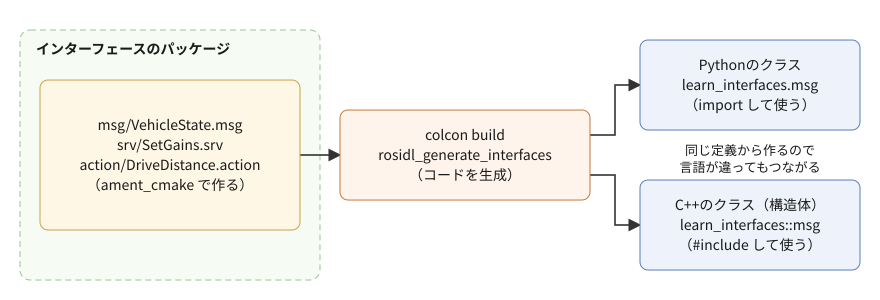
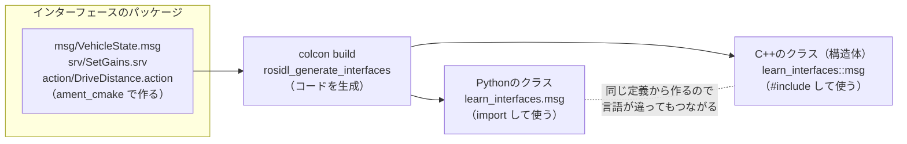

# 参考資料: ROS2の標準のデータ型とインターフェース（自作する方法も）

この教材では、トピックに [`std_msgs/msg/Float64`](https://github.com/ros2/common_interfaces/blob/jazzy/std_msgs/msg/Float64.msg) や [`geometry_msgs/msg/Twist`](https://github.com/ros2/common_interfaces/blob/jazzy/geometry_msgs/msg/Twist.msg)、サービスに [`std_srvs/srv/Trigger`](https://github.com/ros2/common_interfaces/blob/jazzy/std_srvs/srv/Trigger.srv)、アクションに [`example_interfaces/action/Fibonacci`](https://github.com/ros2/example_interfaces/blob/jazzy/action/Fibonacci.action) などを使う。これらはどれも、ROS2が標準で用意している「インターフェース」（ノードどうしがやり取りするデータの型）である。この資料では、インターフェースの定義の読み方、よく使う標準の型、型を調べるコマンドをまとめ、最後に、インターフェースを自分で定義する方法を扱う。

- 対象: ROS2 Jazzy（この資料の作成時に `/opt/ros/jazzy` に入っていたもの）
- 前提: フェーズ3-1（トピック）を読み終えていること。サービス（フェーズ3-4）とアクション（フェーズ3-5）の節は、読んでいなくても型の説明は読める
- 所要目安: 読むだけなら0.5〜1コマ。6節の自作を手元で試すなら、さらに0.5〜1コマ

> **この資料の位置づけ**: 手順書（フェーズ）の流れからは独立した参考資料で、必要になったときに読めばよい。1〜5節は読み物で、手を動かす作業は無い。6節は、自分でインターフェースを定義してみたくなったときの手順で、試すかどうかは任意である（手順書のどのフェーズも、6節で作るパッケージを前提にしていない）。

> **出どころ**: 型の定義・文法・生成されるPythonとC++の型は、`/opt/ros/jazzy` にある定義ファイルと生成済みのコード、定義ファイルを読み込む部品（`rosidl_adapter`）で確かめた。文法の細部は公式ドキュメントの「Interfaces」（8節）とも照らし合わせた。文章は自分の言葉で書いており、公式ドキュメントの転載ではない。図（SVG）は生成スクリプトで作り、文字と線の重なりは計算で点検したが、画像にして目で確かめてはいない。表示が崩れている場合は、図の下にある同じ内容のmermaid版（折りたたみ）を参照する。

> **実行環境が無くても読めるように**: コマンドの直後には「期待する結果」として、表示される内容の例とその読み方を載せている。表示はすべて、この資料の作成時に使い捨ての環境で実際に実行したものである（`ros2 interface`・`ros2 pkg create`・`colcon build`・`python3 -c` だけで、ノードは起動していない）。ビルドの秒数は環境によって変わる。`ros2 pkg create` の表示の作成先のパスは、練習環境の場所（`~/work/ros2MinimalPhysicalAi/ws/src`）に直して載せた。

## 0. この資料で分かること

1. インターフェースの3つの種類（メッセージ・サービス・アクション）と、`std_msgs/msg/Float64` のような名前の読み方。
2. 定義ファイル（`.msg`・`.srv`・`.action`）の書き方と、それがPythonとC++でどんな型になるか。
3. よく使う標準のパッケージと型、型を調べるコマンド。
4. 標準の型で足りないときに、自分でインターフェースを定義して使う方法。

## 1. 全体像

### 1-1. 3つの種類

インターフェースには、通信の方法に合わせて3つの種類がある。

| 種類 | 定義ファイル | 使う通信 | 中身 | 例 |
|---|---|---|---|---|
| メッセージ（msg） | `.msg` | トピック | データの並び | [`std_msgs/msg/Float64`](https://github.com/ros2/common_interfaces/blob/jazzy/std_msgs/msg/Float64.msg) |
| サービス（srv） | `.srv` | サービス | 要求 `---` 応答 | [`std_srvs/srv/Trigger`](https://github.com/ros2/common_interfaces/blob/jazzy/std_srvs/srv/Trigger.srv) |
| アクション（action） | `.action` | アクション | ゴール `---` 結果 `---` 途中経過 | [`example_interfaces/action/Fibonacci`](https://github.com/ros2/example_interfaces/blob/jazzy/action/Fibonacci.action) |

サービスとアクションの定義は、`---` で区切ったメッセージの組である。フェーズ3-4の1節で扱う [`AddTwoInts`](https://github.com/ros2/example_interfaces/blob/jazzy/srv/AddTwoInts.srv) の定義は、`---` の上が要求、下が応答だった。アクションは区切りが2つで、上から順にゴール・結果・途中経過になる。

### 1-2. 名前の読み方

`std_msgs/msg/Float64` は、「`std_msgs` パッケージの、メッセージ（`msg`）の、`Float64` という型」と読む。同じ型を、PythonとC++では次のように書く。

| 書く場所 | 書き方 |
|---|---|
| コマンド（`ros2 topic pub` など） | `std_msgs/msg/Float64` |
| Pythonの `import` | `from std_msgs.msg import Float64` |
| C++の `#include` | `#include "std_msgs/msg/float64.hpp"`（型名を小文字とアンダースコアに直したファイル名） |
| C++の型名 | `std_msgs::msg::Float64` |

サービスとアクションも同じ形で、`std_srvs/srv/Trigger` は `from std_srvs.srv import Trigger`、`#include "std_srvs/srv/trigger.hpp"`、`std_srvs::srv::Trigger` になる。

### 1-3. 定義ファイルから、各言語のコードが作られる

インターフェースの本体は、`.msg`・`.srv`・`.action` という文字だけの定義ファイルである。パッケージをビルドすると、ROS2のコード生成の仕組み（rosidl）が、定義ファイルからPythonのクラスとC++のクラス（構造体）を作る。ノードは、それを `import` や `#include` して使う。



<details>
<summary>同じ図（mermaid版）</summary>



</details>

PythonのノードとC++のノードが同じトピックで話せる（フェーズ3-1の6節）のは、両方が同じ定義ファイルから作られたコードを使い、同じ形でデータを送るからである。標準の型も、`std_msgs` などのパッケージの中で同じように作られ、ROS2と一緒にインストールされている。図の定義ファイルの名前は、6節で自作する例のものである。

## 2. 定義ファイルの書き方

### 2-1. 1行が1つの項目

定義ファイルは、1行に1つの項目（フィールド）を「型 名前」の形で書く。`#` から後ろはコメントである。

```text
float64 x
float64 y
float64 z
```

これは [`geometry_msgs/msg/Point`](https://github.com/ros2/common_interfaces/blob/jazzy/geometry_msgs/msg/Point.msg)（3次元の点）の中身と同じ形である。

### 2-2. 基本の型

項目に使える基本の型と、生成されるPython・C++の型は次のとおり。

| 定義ファイルの型 | 中身 | Python | C++ |
|---|---|---|---|
| `bool` | 真偽値 | `bool` | `bool` |
| `byte` | 1バイトのデータ | `bytes`（長さ1） | `unsigned char` |
| `char` | 1バイトの文字 | `int` | `uint8_t` |
| `int8`・`int16`・`int32`・`int64` | 符号付き整数（数字はビット数） | `int` | `int8_t`〜`int64_t` |
| `uint8`・`uint16`・`uint32`・`uint64` | 符号なし整数 | `int` | `uint8_t`〜`uint64_t` |
| `float32`・`float64` | 浮動小数点数 | `float` | `float`・`double` |
| `string` | 文字列 | `str` | `std::string` |
| `wstring` | UTF-16で表した文字列（ASCII以外の文字を扱う版） | `str` | `std::u16string` |

- 教材で速度やペダルに使う `float64` は、C++の `double`、Pythonの `float` である。
- Pythonの `int` には範囲が無いが、定義ファイルの `int32` は32ビットに収まる値しか送れない。**Jazzyの既定では、Pythonで範囲外の値や違う型の値を代入しても、その場ではエラーにならない**（生成されたクラスは、環境変数 `ROS_PYTHON_CHECK_FIELDS` が `1` のときだけ代入を検査する）。値の範囲は、送る側で気をつける。

### 2-3. 配列

型の後ろに `[]` を付けると配列になる。

| 書き方 | 意味 | Python | C++ |
|---|---|---|---|
| `float64[3]` | 長さがちょうど3の配列 | 数値なら `numpy.ndarray` | `std::array<double, 3>` |
| `float64[]` | 長さが自由の配列 | 数値なら `array.array`、文字列やメッセージなら `list` | `std::vector<double>` |
| `float64[<=10]` | 長さが10以下の配列 | 上と同じ | `rosidl_runtime_cpp::BoundedVector`（長さの上限付きの `vector`） |
| `string<=16` | 16文字以下の文字列 | `str` | `std::string` |

長さが決まっている配列の例は、[`nav_msgs/msg/Odometry`](https://github.com/ros2/common_interfaces/blob/jazzy/nav_msgs/msg/Odometry.msg) の中の `float64[36] covariance`（6×6の誤差の大きさの表。2-4節）である。長さが自由の配列の例は、[`std_msgs/msg/Float64MultiArray`](https://github.com/ros2/common_interfaces/blob/jazzy/std_msgs/msg/Float64MultiArray.msg) の `float64[] data` で、Pythonでは次のようになる。

```bash
python3 -c "from std_msgs.msg import Float64MultiArray; print(Float64MultiArray(data=[1.0, 2.0]).data)"
```

**期待する結果**:

```text
array('d', [1.0, 2.0])
```

Pythonの `list` を渡しても、中では `array.array`（同じ型の数値だけを並べる、Python標準の配列）にそろえて持つ。`'d'` は、`double`（`float64`）の並びという意味である。

### 2-4. 別のメッセージを項目にする（入れ子）

項目の型には、基本の型のほかに、別のメッセージの型も書ける。フェーズ5-0・5-4で使うオドメトリ（`nav_msgs/msg/Odometry`）は、入れ子の深い例である。`ros2 interface show` は、入れ子の型の中身も字下げで表示する。ここでは `--no-comments` を付けて、コメントを省いた。

```bash
ros2 interface show nav_msgs/msg/Odometry --no-comments
```

**期待する結果**:

```text
std_msgs/Header header
	builtin_interfaces/Time stamp
		int32 sec
		uint32 nanosec
	string frame_id
string child_frame_id
geometry_msgs/PoseWithCovariance pose
	Pose pose
		Point position
			float64 x
			float64 y
			float64 z
		Quaternion orientation
			float64 x 0
			float64 y 0
			float64 z 0
			float64 w 1
	float64[36] covariance
geometry_msgs/TwistWithCovariance twist
	Twist twist
		Vector3  linear
			float64 x
			float64 y
			float64 z
		Vector3  angular
			float64 x
			float64 y
			float64 z
	float64[36] covariance
```

- 字下げが1段深い行は、その上の行の型の中身である。たとえば `pose` の中に `pose`（[`Pose`](https://github.com/ros2/common_interfaces/blob/jazzy/geometry_msgs/msg/Pose.msg)）があり、その中に `position`（`Point`）と `orientation`（[`Quaternion`](https://github.com/ros2/common_interfaces/blob/jazzy/geometry_msgs/msg/Quaternion.msg)）がある。Pythonでは、この段を `msg.pose.pose.position.x` のように `.` でたどる（フェーズ6-2で書く見張りのノード `goal_monitor` も、この書き方でオドメトリの位置を読む）。
- 別のパッケージの型は [`std_msgs/Header`](https://github.com/ros2/common_interfaces/blob/jazzy/std_msgs/msg/Header.msg) のように「パッケージ名/型名」で書き、同じパッケージの型は `Pose` のように型名だけで書ける（[`PoseWithCovariance`](https://github.com/ros2/common_interfaces/blob/jazzy/geometry_msgs/msg/PoseWithCovariance.msg) は `geometry_msgs` の型なので、中の `Pose` は `geometry_msgs` の `Pose` になる）。定義ファイルの中では、間の `msg` を書かない。
- `Quaternion` の `float64 w 1` の最後の `1` は既定値である（2-5節）。
- `covariance` は、値がどれくらい不確かかを表す表（共分散行列）で、この資料では立ち入らない。

### 2-5. 既定値と定数

項目の後ろに値を書くと、既定値になる。メッセージを作ったときに、その値が最初から入る。

```text
int32 count 5
string name "car"
```

既定値は、基本の型の項目と、その配列にだけ付けられる（入れ子のメッセージの項目には付けられない）。何も書かなければ、数値は0、文字列は空、真偽値は `false` になる。

`=` でつなぐと定数になる。定数は項目ではなく、型に付いた決まった値で、送るデータには入らない。名前は大文字で書く。[`rcl_interfaces/msg/Log`](https://github.com/ros2/rcl_interfaces/blob/jazzy/rcl_interfaces/msg/Log.msg)（ノードのログを運ぶ型）は、ログの重要度を定数で持っている。

```bash
ros2 interface show rcl_interfaces/msg/Log --no-comments
```

**期待する結果**（先頭の抜粋）:

```text
uint8 DEBUG=10
uint8 INFO=20
uint8 WARN=30
uint8 ERROR=40
uint8 FATAL=50
builtin_interfaces/Time stamp
	int32 sec
	uint32 nanosec
uint8 level
string name
string msg
```

`level` には、`Log.INFO`（Python）・`rcl_interfaces::msg::Log::INFO`（C++）のように定数の名前で値を入れられる。数字の20をコードに直接書くより、意味が読み取りやすい。

### 2-6. 名前の決まり

| 名前 | 決まり | 例 |
|---|---|---|
| 型名（ファイル名） | 大文字で始め、英字と数字だけ（単語の区切りは大文字） | `VehicleState`（ファイルは `VehicleState.msg`） |
| 項目の名前 | 小文字で始め、小文字・数字・アンダースコアだけ（アンダースコアの連続や、末尾のアンダースコアは不可） | `target_velocity` |
| 定数の名前 | 大文字 | `PEDAL_MAX` |

決まりを破ると、定義ファイルを読み込む時点（ビルド）でエラーになる（6-6節の表に、実際のエラーの文面を載せた）。

## 3. よく使う標準のパッケージと型

### 3-1. 一覧

| パッケージ | 中身 | 代表的な型 |
|---|---|---|
| `std_msgs` | 基本の型を1つだけ包んだ型と、時刻付きの見出し | `Float64`・[`String`](https://github.com/ros2/common_interfaces/blob/jazzy/std_msgs/msg/String.msg)・[`Int32`](https://github.com/ros2/common_interfaces/blob/jazzy/std_msgs/msg/Int32.msg)・[`Bool`](https://github.com/ros2/common_interfaces/blob/jazzy/std_msgs/msg/Bool.msg)・[`Header`](https://github.com/ros2/common_interfaces/blob/jazzy/std_msgs/msg/Header.msg)・`Float64MultiArray` |
| `builtin_interfaces` | 時刻と時間の長さ | [`Time`](https://github.com/ros2/rcl_interfaces/blob/jazzy/builtin_interfaces/msg/Time.msg)・[`Duration`](https://github.com/ros2/rcl_interfaces/blob/jazzy/builtin_interfaces/msg/Duration.msg) |
| `geometry_msgs` | 位置・向き・速度・力などの幾何 | `Point`・[`Vector3`](https://github.com/ros2/common_interfaces/blob/jazzy/geometry_msgs/msg/Vector3.msg)・[`Quaternion`](https://github.com/ros2/common_interfaces/blob/jazzy/geometry_msgs/msg/Quaternion.msg)・[`Pose`](https://github.com/ros2/common_interfaces/blob/jazzy/geometry_msgs/msg/Pose.msg)・[`Twist`](https://github.com/ros2/common_interfaces/blob/jazzy/geometry_msgs/msg/Twist.msg)・[`TwistStamped`](https://github.com/ros2/common_interfaces/blob/jazzy/geometry_msgs/msg/TwistStamped.msg) |
| `nav_msgs` | 移動ロボットの位置と地図 | `Odometry`・[`Path`](https://github.com/ros2/common_interfaces/blob/jazzy/nav_msgs/msg/Path.msg)・[`OccupancyGrid`](https://github.com/ros2/common_interfaces/blob/jazzy/nav_msgs/msg/OccupancyGrid.msg) |
| `sensor_msgs` | センサの値 | [`Imu`](https://github.com/ros2/common_interfaces/blob/jazzy/sensor_msgs/msg/Imu.msg)・[`LaserScan`](https://github.com/ros2/common_interfaces/blob/jazzy/sensor_msgs/msg/LaserScan.msg)・[`JointState`](https://github.com/ros2/common_interfaces/blob/jazzy/sensor_msgs/msg/JointState.msg)・[`Image`](https://github.com/ros2/common_interfaces/blob/jazzy/sensor_msgs/msg/Image.msg) |
| `std_srvs` | 中身の少ない汎用のサービス | [`Empty`](https://github.com/ros2/common_interfaces/blob/jazzy/std_srvs/srv/Empty.srv)・`Trigger`・[`SetBool`](https://github.com/ros2/common_interfaces/blob/jazzy/std_srvs/srv/SetBool.srv) |
| `example_interfaces` | チュートリアル用の例 | [`AddTwoInts`](https://github.com/ros2/example_interfaces/blob/jazzy/srv/AddTwoInts.srv)・`Fibonacci` |
| `rcl_interfaces`・`rosgraph_msgs` | ROS2自身が使う型（ログ・パラメータ・時計） | `Log`・[`ParameterEvent`](https://github.com/ros2/rcl_interfaces/blob/jazzy/rcl_interfaces/msg/ParameterEvent.msg)・[`Clock`](https://github.com/ros2/rcl_interfaces/blob/jazzy/rosgraph_msgs/msg/Clock.msg) |

`ros2 interface packages` で、今のPCに入っているインターフェースのパッケージを一覧できる（4節）。ROS2のDesktop Installだけでも数十個あり、フェーズ5-0で入れたGazeboの連携のような追加のパッケージを入れると増える。

### 3-2. 見出し（`Header`）と `Stamped` の付く型

[`std_msgs/msg/Header`](https://github.com/ros2/common_interfaces/blob/jazzy/std_msgs/msg/Header.msg) は、「いつの値か」（`stamp`）と「どの座標系で測った値か」（`frame_id`）を持つ、小さなメッセージである。`TwistStamped` のように名前に `Stamped` が付く型は、元の型（`Twist`）に `Header` を足したものである。

時刻を持つ型と持たない型では、受け取る側の扱いが変わる。たとえば `rqt_plot` は、時刻の欄を持たない `Float64` の値を、届いた時刻で横軸に並べる（フェーズ6-1の3-1節）。時刻を持つ型なら、送った側が付けた時刻で扱える。

ただし、付ける時刻がPCの時計（現在時刻）なら、PCの時計が時刻合わせで飛んだとき（フェーズ6-1の2-2節の注記）、付ける時刻も同じだけ飛ぶ。時刻を付けておけば時計の飛びを後から直せる、というわけではない。直せるのは、シミュレーション時刻（フェーズ5-4の5節）のように、PCの時計とは別に進む時刻を付けた場合である。

### 3-3. 単位と向きの決まり

ROS2の標準の型は、単位を国際単位系（長さはm、時間はs、角度はrad、速度はm/s）にそろえる約束になっている（REP 103。8節）。定義ファイルに単位の欄は無いので、自作の型では、コメントに単位を書いておく（6-2節の例）。

## 4. 型を調べるコマンド

| コマンド | 分かること |
|---|---|
| `ros2 interface packages` | インターフェースを持つパッケージの一覧 |
| `ros2 interface package パッケージ` | そのパッケージの型の一覧 |
| `ros2 interface list` | すべての型の一覧（メッセージ・サービス・アクションに分けて表示） |
| `ros2 interface show 型` | 型の定義。`--no-comments` でコメントを省き、`--all-comments` で入れ子の型のコメントも出す |
| `ros2 interface proto 型` | その型の値を、すべての項目を既定値にしたYAMLで表示する（`ros2 topic pub` に渡す値の雛形） |

```bash
ros2 interface package std_srvs

ros2 interface proto geometry_msgs/msg/Twist
```

**期待する結果**（型の並ぶ順は、環境によって変わることがある）:

```text
$ ros2 interface package std_srvs
std_srvs/srv/Trigger
std_srvs/srv/Empty
std_srvs/srv/SetBool

$ ros2 interface proto geometry_msgs/msg/Twist
"linear:
  x: 0.0
  y: 0.0
  z: 0.0
angular:
  x: 0.0
  y: 0.0
  z: 0.0
"
```

`proto` の表示は、前後の `"` まで含めて、そのまま `ros2 topic pub /cmd_vel geometry_msgs/msg/Twist` の後ろに貼り付けられる形である。値を書き換えてから送ればよい。

動いているトピックの型を調べるときは、`ros2 topic type /トピック名` で型の名前を出し、`ros2 interface show` に渡す。`ros2 interface show -` と書くと、型の名前を前のコマンドから受け取る（`ros2 topic type /chatter | ros2 interface show -`）。

## 5. 標準の型を使うか、自作するか

> **補足: 型の選び方**
>
> - **一般的な考え方**: 意味の合う標準の型があれば、それを使う。標準の型なら、`rqt_plot`・`ros2 bag`・RVizなどのツールや、ほかの人のパッケージが、そのまま扱える。意味の合う型が無いときに自作する。`std_msgs` の `Float64` や `String` のような「値を1つ包んだだけの型」は、どの項目も `data` という名前で、中身の意味（何の値か、単位は何か）を伝えない。`std_msgs` の説明（8節の `common_interfaces` のリポジトリ）でも、試作には便利だが、長く使う型としては勧めない、とされている。
> - **この教材が `Float64` を使った理由**: 教材では、トピックとノードの仕組みを学ぶことを優先し、型は最も簡単なものにした。目標速度・速度・ペダルを別々の `Float64` のトピックにしたので、`rqt_plot` で1本ずつ描けて、`ros2 topic pub` でも手で送りやすい。その代わり、値に時刻が無く（3-2節）、単位はトピック名と手順書の説明に頼っている。
> - **実務の目安**: 決まった組でしか意味を持たない値（ある時刻の目標速度・速度・ペダルなど）は、1つの自作の型にまとめ、`Header` で時刻を付け、コメントに単位を書く。ほかの人やツールと共有する値は、標準の型（位置なら `geometry_msgs`、センサの値なら `sensor_msgs`）を優先する。

## 6. 自作する

ここでは、フェーズ5の車両の値を題材に、メッセージ・サービス・アクションを1つずつ定義する。作るのは次の3つである（どれも手順書のノードでは使わない、練習用の型）。

| 種類 | 型 | 中身 |
|---|---|---|
| メッセージ | `VehicleState` | 時刻・目標速度・速度・ペダルの組 |
| サービス | `SetGains` | PI制御のゲインを変える要求と、その結果 |
| アクション | `DriveDistance` | 決めた距離を走るゴール、かかった時間の結果、走った距離の途中経過 |

### 6-1. インターフェース専用のパッケージを作る

インターフェースは、**`ament_cmake` のパッケージ**で定義する。コードを生成する仕組みがCMakeで動くためで、Pythonだけで書くノードの型でも、`ament_python` のパッケージ（`learn_py`）には置けない。ノードのパッケージとは分けて、インターフェースだけのパッケージを作るのが一般的である（名前は `〜_interfaces` か `〜_msgs` にすることが多い）。

```bash
cd ~/work/ros2MinimalPhysicalAi/ws/src

ros2 pkg create --build-type ament_cmake \
  --license Apache-2.0 \
  --maintainer-name learner --maintainer-email noreply@example.com \
  learn_interfaces

mkdir -p learn_interfaces/msg learn_interfaces/srv learn_interfaces/action
```

**期待する結果**（`ros2 pkg create` の分。パスは環境によって変わる）:

```text
going to create a new package
package name: learn_interfaces
destination directory: /home/<ユーザー名>/work/ros2MinimalPhysicalAi/ws/src
package format: 3
version: 0.0.0
description: TODO: Package description
maintainer: ['learner <noreply@example.com>']
licenses: ['Apache-2.0']
build type: ament_cmake
dependencies: []
creating folder ./learn_interfaces
creating ./learn_interfaces/package.xml
creating source and include folder
creating folder ./learn_interfaces/src
creating folder ./learn_interfaces/include/learn_interfaces
creating ./learn_interfaces/CMakeLists.txt
```

フェーズ4の3-1節の `learn_bringup` と同じ作り方である。`mkdir` は成功しても何も表示しない。`src/` と `include/learn_interfaces/` は雛形が作る空のフォルダで、このパッケージでは使わない。

### 6-2. 定義ファイルを書く

ファイル: `ws/src/learn_interfaces/msg/VehicleState.msg`

<!-- file: ws/src/learn_interfaces/msg/VehicleState.msg -->
```text
# 車両の状態。フェーズ5の一式の目標速度・速度・ペダルを、時刻付きの1つのメッセージにまとめたもの。

# 定数（ペダルの範囲）
float64 PEDAL_MAX=1.0
float64 PEDAL_MIN=-1.0

std_msgs/Header header    # 時刻と座標系の名前
float64 target_velocity   # 目標速度 [m/s]
float64 velocity          # 速度 [m/s]
float64 pedal             # ペダル（PEDAL_MIN〜PEDAL_MAX。正がアクセル、負がブレーキ）
```

ファイル: `ws/src/learn_interfaces/srv/SetGains.srv`

<!-- file: ws/src/learn_interfaces/srv/SetGains.srv -->
```text
# PI制御のゲインを変える。要求にゲインを入れ、応答で受け付けたかを返す。
float64 kp
float64 ki
---
bool success
string message
```

ファイル: `ws/src/learn_interfaces/action/DriveDistance.action`

<!-- file: ws/src/learn_interfaces/action/DriveDistance.action -->
```text
# 決めた距離を走る。ゴールに距離を、結果にかかった時間を、途中経過に走った距離を入れる。
float64 distance        # 走る距離 [m]
---
float64 elapsed_time    # かかった時間 [s]
---
float64 traveled        # ここまでに走った距離 [m]
```

- ファイル名は型名と同じにする（2-6節の決まり）。置くフォルダは、種類ごとに `msg/`・`srv/`・`action/` にする。
- `VehicleState` は、`std_msgs/Header` で時刻を持たせ（3-2節）、単位をコメントに書いた（3-3節）。ペダルの範囲は定数にしたので、使う側は `1.0` と書く代わりに `PEDAL_MAX` と書ける。
- `SetGains` の応答は、`std_srvs/srv/Trigger` と同じ `success`・`message` の組にした。受け付けなかった理由（負のゲインなど）を `message` で返せる。
- `DriveDistance` は、フェーズ6-2で扱う「決めた距離まで走ったら終わる」を、アクションの形にしたものである。途中経過で走った距離を返せば、呼んだ側は、6-2の見張りのノード `goal_monitor` のログのように、進み具合を見られる。

### 6-3. `CMakeLists.txt` と `package.xml` に書き足す

`ws/src/learn_interfaces/CMakeLists.txt` の `find_package(ament_cmake REQUIRED)` の後ろ（`ament_package()` より前）に、次を足す。

<!-- snippet: cmake_interfaces -->
```cmake
find_package(rosidl_default_generators REQUIRED)
find_package(std_msgs REQUIRED)

rosidl_generate_interfaces(${PROJECT_NAME}
  "msg/VehicleState.msg"
  "srv/SetGains.srv"
  "action/DriveDistance.action"
  DEPENDENCIES std_msgs
)
ament_export_dependencies(rosidl_default_runtime)
```

`ws/src/learn_interfaces/package.xml` の `<buildtool_depend>ament_cmake</buildtool_depend>` の次に、次を足す。

<!-- snippet: package_xml_interfaces -->
```xml
  <buildtool_depend>rosidl_default_generators</buildtool_depend>

  <depend>std_msgs</depend>

  <exec_depend>rosidl_default_runtime</exec_depend>

  <member_of_group>rosidl_interface_packages</member_of_group>
```

| 書いたもの | 何をしているか |
|---|---|
| `find_package(rosidl_default_generators REQUIRED)` | コードを生成する部品（rosidl）を探す |
| `rosidl_generate_interfaces(${PROJECT_NAME} ...)` | 並べた定義ファイルから、このパッケージ名（`learn_interfaces`）でPythonとC++のコードを作る。**定義ファイルを足したら、ここにも足す** |
| `DEPENDENCIES std_msgs` | 定義ファイルの中で使っている、別のパッケージの型（`std_msgs/Header`）。`find_package` と `package.xml` の `<depend>` にも同じものを書く |
| `ament_export_dependencies(rosidl_default_runtime)` | このパッケージを使う側にも、実行に要る部品を伝える |
| `<buildtool_depend>rosidl_default_generators</buildtool_depend>` | ビルドするときに、コードを生成する部品が要る |
| `<exec_depend>rosidl_default_runtime</exec_depend>` | 実行するときに、生成したコードを動かす部品が要る |
| `<member_of_group>rosidl_interface_packages</member_of_group>` | このパッケージがインターフェースのパッケージであることを、ビルドの仕組みに知らせる |

アクションを定義しても、この資料の作成時の環境では、アクション用の依存（`action_msgs`）を自分で足さなくてもビルドできた（`rosidl_default_generators` が面倒を見る）。

### 6-4. ビルドして確かめる

```bash
cd ~/work/ros2MinimalPhysicalAi/ws

colcon build --symlink-install --packages-select learn_interfaces

source install/setup.bash

ros2 interface package learn_interfaces

ros2 interface show learn_interfaces/msg/VehicleState
```

**期待する結果**:

```text
$ colcon build --symlink-install --packages-select learn_interfaces
Starting >>> learn_interfaces
Finished <<< learn_interfaces [15.4s]

Summary: 1 package finished [15.6s]

$ ros2 interface package learn_interfaces
learn_interfaces/msg/VehicleState
learn_interfaces/action/DriveDistance
learn_interfaces/srv/SetGains

$ ros2 interface show learn_interfaces/msg/VehicleState
# 車両の状態。フェーズ5の一式の目標速度・速度・ペダルを、時刻付きの1つのメッセージにまとめたもの。

# 定数（ペダルの範囲）
float64 PEDAL_MAX=1.0
float64 PEDAL_MIN=-1.0

std_msgs/Header header    # 時刻と座標系の名前
	builtin_interfaces/Time stamp
		int32 sec
		uint32 nanosec
	string frame_id
float64 target_velocity   # 目標速度 [m/s]
float64 velocity          # 速度 [m/s]
float64 pedal             # ペダル（PEDAL_MIN〜PEDAL_MAX。正がアクセル、負がブレーキ）
```

- 定義ファイルは短いが、PythonとC++の両方のコードを生成するので、ビルドにはC++のパッケージと同じくらいの時間がかかる。
- `ros2 interface package` に3つの型が並べば、生成できている（並ぶ順は環境によって変わることがある）。
- `ros2 interface show` は、書いた定義ファイルをコメントごと表示し、入れ子の `Header` の中身も字下げで出す（2-4節）。

### 6-5. 別のパッケージから使う

自作の型を使う側のパッケージ（`learn_py`・`learn_cpp` など）の `package.xml` に、依存を1行足す。

```xml
<depend>learn_interfaces</depend>
```

`colcon build` は、この依存を見て、`learn_interfaces` を先にビルドする。

**Python**: 標準の型と同じく `import` する。`setup.py` は変えなくてよい。まずは、ノードを書く前に、生成されたクラスを `python3` から直接試せる。

```bash
python3 -c "from learn_interfaces.msg import VehicleState; print(VehicleState(velocity=9.5, pedal=0.54)); print(VehicleState.PEDAL_MAX)"
```

**期待する結果**:

```text
learn_interfaces.msg.VehicleState(header=std_msgs.msg.Header(stamp=builtin_interfaces.msg.Time(sec=0, nanosec=0), frame_id=''), target_velocity=0.0, velocity=9.5, pedal=0.54)
1.0
```

指定しなかった項目（`header`・`target_velocity`）は、既定の0や空の値で作られている（2-5節）。定数 `PEDAL_MAX` は、作ったメッセージではなく、型（クラス）から読める。サービスとアクションは、`from learn_interfaces.srv import SetGains`・`from learn_interfaces.action import DriveDistance` で読み込み、`SetGains.Request(kp=0.5, ki=0.1)`・`DriveDistance.Goal(distance=450.0)` のように要求やゴールを作る（フェーズ3-4・3-5の `AddTwoInts.Request()`・`Fibonacci.Goal()` と同じ形）。

**C++**: `CMakeLists.txt` で `find_package(learn_interfaces REQUIRED)` とし、`ament_target_dependencies` に `learn_interfaces` を足す（フェーズ3-4の5-5節の `example_interfaces` と同じ形）。コードでは、ヘッダを `#include` して、型名で使う。

```cpp
#include "learn_interfaces/msg/vehicle_state.hpp"

learn_interfaces::msg::VehicleState msg;
msg.velocity = 9.5;
msg.pedal = learn_interfaces::msg::VehicleState::PEDAL_MAX;
```

ヘッダのファイル名は、型名を小文字とアンダースコアに直したもの（`VehicleState` → `vehicle_state.hpp`）である（1-2節）。この書き方は、この資料の作成時に、使い捨ての環境でビルドして確かめた。

> 課題（任意）: フェーズ5-3の一式を動かしながら、`/target_velocity`・`/plant/velocity`・`/plant/pedal` の最新の値を覚えておき、10 Hzで `VehicleState` にまとめて `/vehicle_state` へ送るノードを書く。`header.stamp` には `self.get_clock().now().to_msg()` で今の時刻を入れる。`ros2 topic echo /vehicle_state` で、4つの値が1つのメッセージで届くことを確かめる。

### 6-6. つまずきやすい点

| 症状 | 確認すること |
|---|---|
| ビルドで `'Velocity' is an invalid field name.  It should have the pattern '^(?!.*__)(?!.*_$)[a-z][a-z0-9_]*$'` | 項目の名前が小文字で始まっているか（2-6節） |
| ビルドで `'vehicle_state' is an invalid message name.  It should have the pattern '^[A-Z][A-Za-z0-9]*$'` | 定義ファイルの名前が、大文字で始まる型名になっているか（`VehicleState.msg`） |
| ビルドで、定義の中の別のパッケージの型が見つからない | `find_package`・`DEPENDENCIES`・`package.xml` の `<depend>` の3か所に、そのパッケージ（`std_msgs` など）を書いたか |
| 定義ファイルを足したのに、`ros2 interface package` に出ない | `rosidl_generate_interfaces` の並びに足したか。ビルドし直して `source install/setup.bash` をしたか |
| Pythonで `No module named 'learn_interfaces'` | 使う前に `learn_interfaces` をビルドして、`source install/setup.bash` をしたか |
| 定義を変えた後、ノードどうしがつながらない | 使う側のパッケージもビルドし直したか。古い定義のままのノードと、新しい定義のノードは、同じ名前の型でも中身が違うので、正しくやり取りできない |
| `ament_python` のパッケージに `msg/` を作ったが、型が生成されない | インターフェースは `ament_cmake` のパッケージでしか定義できない（6-1節） |

## 7. 教材のどこで何を使ったか

| 型 | 種類 | 使った手順書 |
|---|---|---|
| `std_msgs/msg/String` | メッセージ | 3-1（`talker`・`listener`） |
| `std_msgs/msg/Float64` | メッセージ | 3-1（`sine_pub`）、5-1〜5-4・6-1〜6-3（目標速度・速度・ペダル） |
| `std_msgs/msg/Int32` | メッセージ | 3-4（`counter_node`） |
| `geometry_msgs/msg/Twist` | メッセージ | 1（`turtlesim`）、3-2a、5-0（車両への速度の指令） |
| `nav_msgs/msg/Odometry` | メッセージ | 5-0・5-4（Gazeboの車両の位置と速度）、6-2（案B） |
| `rosgraph_msgs/msg/Clock` | メッセージ | 5-4（シミュレーション時刻） |
| `example_interfaces/srv/AddTwoInts` | サービス | 3-4 |
| `std_srvs/srv/Trigger` | サービス | 3-4（`counter_node`） |
| `std_srvs/srv/Empty` | サービス | 1（`turtlesim` の `/clear` など） |
| `example_interfaces/action/Fibonacci` | アクション | 3-5 |
| `turtlesim` の型（`Pose`・`Spawn`・`RotateAbsolute` など） | 3種類とも | 1・3-2a |

教材で使ったメッセージの多くは、値を1つ包んだだけの `std_msgs` の型だった。その理由と、実務での選び方は5節にまとめた。

## 8. 公式ドキュメント・参考資料

確認状況（2026-09-27）: 公式のページは、GitHubにある原稿（`ros2/ros2_documentation` のjazzyブランチ）が実在することを確かめた（docs.ros.orgのページは、ボット対策で本文を取得できない）。型の定義へのリンクは、`raw.githubusercontent.com` の同じパスが存在することを確かめた。REP 103は、原稿（`ros-infrastructure/rep`）が実在することを確かめた。

### 公式

- [Interfaces — ROS 2 Documentation: Jazzy](https://docs.ros.org/en/jazzy/Concepts/Basic/About-Interfaces.html)（定義ファイルの文法、基本の型、配列、既定値、定数）
- [Creating custom msg and srv files — ROS 2 Documentation: Jazzy](https://docs.ros.org/en/jazzy/Tutorials/Beginner-Client-Libraries/Custom-ROS2-Interfaces.html)（インターフェース専用のパッケージを作って使う）
- [Implementing custom interfaces — ROS 2 Documentation: Jazzy](https://docs.ros.org/en/jazzy/Tutorials/Beginner-Client-Libraries/Single-Package-Define-And-Use-Interface.html)（同じパッケージの中で定義して使う方法）
- [Creating an action — ROS 2 Documentation: Jazzy](https://docs.ros.org/en/jazzy/Tutorials/Intermediate/Creating-an-Action.html)（アクションの定義ファイル）
- [ros2/common_interfaces（GitHub、jazzyブランチ）](https://github.com/ros2/common_interfaces/tree/jazzy)（`std_msgs`・`geometry_msgs`・`nav_msgs`・`sensor_msgs`・`std_srvs` などの定義と、各パッケージの説明）
- [REP 103: Standard Units of Measure and Coordinate Conventions](https://www.ros.org/reps/rep-0103.html)（単位と座標の向きの約束）

> 出典: 文法と型の対応は、公式ドキュメント（CC BY 4.0）と、ローカルの定義ファイル・生成済みのコード・`rosidl_adapter` から確かめ、自分の言葉でまとめたもの。「期待する結果」に載せた標準の型の定義は、`ros2 interface show` の表示（定義の元は `common_interfaces`・`rcl_interfaces`、Apache License 2.0）である。自作の型の定義ファイル・サンプル・文章は、独自に書いたもの。
