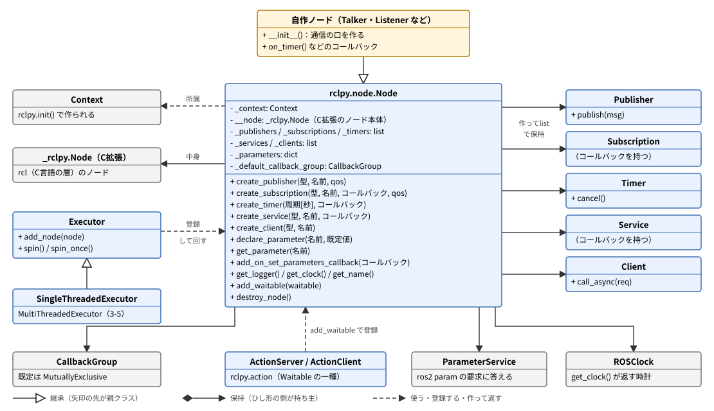
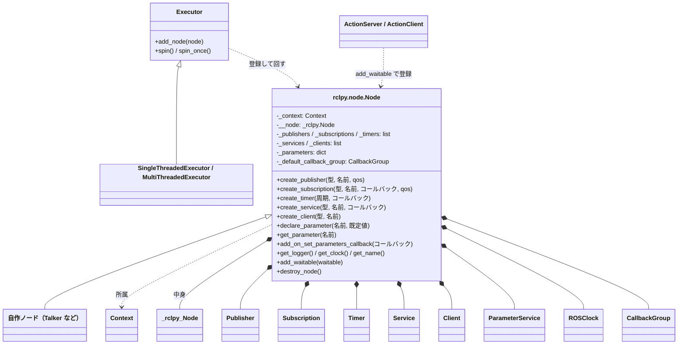
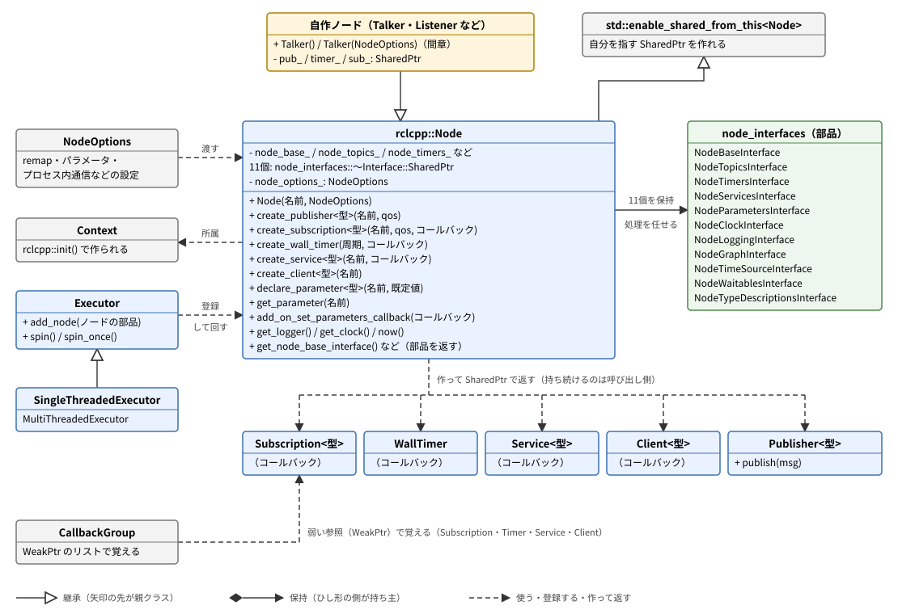
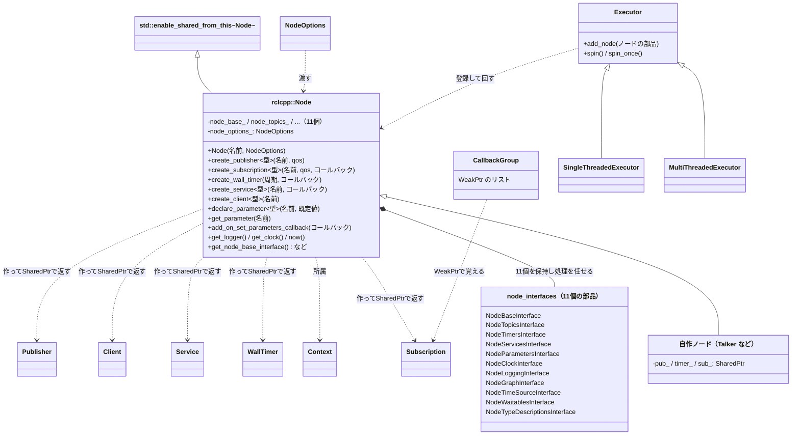

# 参考資料: Nodeクラスの構造（Python版とC++版のクラス図）

フェーズ3以降、ノードを書くたびに `Node` クラスを継承し、`create_publisher` や `declare_parameter` を呼んできた。この資料では、その `Node` クラスの中身をクラス図にして、Python版（`rclpy.node.Node`）とC++版（`rclcpp::Node`）の作りの違いを読み解く。

- 対象: ROS2 Jazzy の `rclpy`（7.1.12）と `rclcpp`（28.1.22）。版は、この資料の作成時に `/opt/ros/jazzy` に入っていたもの
- 前提: フェーズ3-1（トピック）を読み終えていること。フェーズ3-3〜3-5と間章の内容にも触れるが、読んでいなくても図と表は読める
- 所要目安: 0.5〜1コマ（読み物）

> **この資料の位置づけ**: 手順書（フェーズ）の流れからは独立した参考資料で、必要になったときに読めばよい。手を動かす作業は無い。「`Node` を継承すると何が手に入るのか」「なぜC++では `pub_` などをメンバに保持しないといけないのか」といった疑問に、ソースコードの構造から答えることが目的である。

> **出どころ**: クラスの構造・変数名・メソッド名は、`/opt/ros/jazzy` にあるソース（`rclpy/node.py`、`rclcpp/node.hpp` ほか）を読んで確かめた。文章は自分の言葉で書いており、ソースの転載ではない。図は、主要な部分だけを抜き出して描いたもので、すべてのメソッドを載せてはいない。図（SVG）は生成スクリプトで作り、文字と線の重なりは計算で点検したが、画像にして目で確かめてはいない。表示が崩れている場合は、図の下にある同じ内容のmermaid版（折りたたみ）を参照する。

## 0. この資料で分かること

1. Python版とC++版の `Node` が、それぞれどんな変数を持ち、どんな周辺のクラスとつながっているか。
2. 教材で使ったメソッドが、`Node` の機能全体の中でどこに当たるか。
3. Python版は「1つのクラスに機能を集める」作り、C++版は「機能ごとの部品を組み合わせる」作りであること。そして、その違いが、書き方の違い（例: C++では作ったものを保持し続ける必要がある）として表に出ていること。

## 1. 全体像: どちらにも共通する形

Python版とC++版のどちらでも、ノードの形は次の4つの関係でできている。

1. **自作ノードは `Node` を継承する**。`Talker` や `Listener` は `Node` の子クラスで、`Node` が持つメソッドをそのまま使える。
2. **`Node` は「通信の口」を作る**。`create_publisher`・`create_subscription`・`create_timer`・`create_service`・`create_client` を呼ぶと、それぞれ Publisher・Subscription・Timer・Service・Client のオブジェクトが作られて返ってくる。
3. **`Node` は `Context` に属する**。`rclpy.init()` / `rclcpp::init()` で作られる `Context` は、そのプロセスでのROS2の通信の土台で、ノードは必ずどれか1つの `Context` に属する。
4. **`Executor` がノードを回す**。`spin` の中身は `Executor` で、登録されたノードのタイマーの満了やメッセージの到着を待ち、対応するコールバックを呼ぶ（フェーズ3-1の1節の図）。

違いは、`Node` の**中身の作り方**にある。以下、Python版（2節）、C++版（3節）の順に見て、4節で比べる。

## 2. Python版: `rclpy.node.Node`

同じ図（mermaid版）

### 2-1. 変数の読み方

`__init__` の中で作られる主な変数を、図の上の段に載せた（名前の先頭の `_` は「クラスの内部用」、`__` は「さらに外から触りにくくした内部用」というPythonの慣習）。

| 変数 | 中身 | 意味 |
|---|---|---|
| `_context` | `Context` | このノードが属する通信の土台。引数で渡さなければ、`rclpy.init()` が作った既定の `Context` が入る |
| `__node` | `_rclpy.Node` | **ノードの本体**。C言語で書かれた拡張モジュール（`_rclpy`）のオブジェクトで、その先はROS2の共通のC言語の層（rcl）につながる。Pythonの `Node` は、この本体を包む「使いやすい外側」である |
| `_publishers` などのリスト | `Publisher` などのリスト | `create_*` で作ったものを、ノード自身が覚えておくリスト |
| `_parameters` | 辞書 | 宣言したパラメータの名前と値 |
| `_default_callback_group` | `MutuallyExclusiveCallbackGroup` | コールバックグループを指定しなかったときに使われるグループ。「同じグループのコールバックは同時に動かさない」種類で、フェーズ3-4の `counter_node` が安全に動く理由（コールバックが1つずつ順に処理される）の一部 |

このほか `__init__` では、`ParameterService`（`ros2 param` の要求に答えるサービス群）、`ROSClock`（`get_clock()` が返す時計）、`TimeSource`（`use_sim_time` を扱う）なども作られる。フェーズ3-3で、自分で作っていないのに `ros2 param list` に `use_sim_time` や `start_type_description_service` が出ていたのは、`Node` の `__init__` がこれらを自動で用意しているからである。

### 2-2. メソッドの分類

公開されているメソッドは70余りある（プロパティを含む）。分類すると次のようになる。

| 分類 | 代表的なメソッド | 教材で使ったもの |
|---|---|---|
| 通信の口を作る | `create_publisher`・`create_subscription`・`create_timer`・`create_service`・`create_client`・`create_rate`・`create_guard_condition` | 最初の5つ（3-1〜3-4） |
| 通信の口を壊す | `destroy_publisher`・`destroy_subscription`・`destroy_timer` など、`destroy_node` | `destroy_node`（全フェーズの `main` の `finally`） |
| パラメータ | `declare_parameter(s)`・`get_parameter(s)`・`set_parameters`・`has_parameter`・`describe_parameter`・`add_on_set_parameters_callback`・`add_pre_set_parameters_callback`・`add_post_set_parameters_callback` など | `declare_parameter`・`get_parameter`・`add_on_set_parameters_callback`（3-2b・3-3） |
| ノードの情報・道具 | `get_name`・`get_namespace`・`get_logger`・`get_clock`・`get_fully_qualified_name` | `get_logger`（3-1〜）、`get_clock`（3-1の `sine_pub`） |
| グラフ（ネットワーク全体）の問い合わせ | `get_node_names`・`get_topic_names_and_types`・`count_publishers`・`count_subscribers`・`wait_for_node` など | 使っていない（`ros2 node list` や `ros2 topic list` のCLIが、同じ情報を別の経路で調べている） |
| 実行の仕組みとの接続 | `executor`（プロパティ）・`add_waitable`・`default_callback_group` | 間接的に使った（`rclpy.spin(node)` の中で、executorがノードを登録する。アクションは `add_waitable` を使う） |

### 2-3. 周辺のクラスとの関係

- **Publisher・Subscription・Timer・Service・Client（図の右）**: `create_*` が作って返すと同時に、ノード自身のリスト（`_publishers` など）にも入れる。図のひし形は「ノードが持ち主として保持している」ことを表す。
- **Executor（図の左）**: `rclpy.spin(node)` は、内部で `Executor`（指定しなければ既定のもの）に `add_node(node)` でノードを登録し、`spin` を回す。フェーズ3-5で使った `MultiThreadedExecutor` は、`Executor` の子クラスの1つ。
- **ActionServer・ActionClient（図の下）**: `Node` には `create_action_server` のようなメソッドは無い。アクションは `rclpy.action` という別のモジュールのクラスで、作られるときに `node.add_waitable(self)` でノードに自分を登録する（`Waitable` は「executorが待つことのできるもの」を表す基底クラス）。フェーズ3-5で `ActionServer(self, Fibonacci, 'fibonacci', ...)` と、ノード自身を最初の引数に渡していたのはこのためである。
- **CallbackGroup（図の左下）**: 既定のグループを1つ持つ。フェーズ3-5の `ReentrantCallbackGroup` は、既定の代わりに指定した別のグループ。

### 2-4. 作りの特徴

Python版の `Node` は、**機能を1つのクラスに集めた**作りである。ファイル `rclpy/node.py` は2,300行ほどあり、パラメータの検証から、グラフの問い合わせまでが1つのクラスに並んでいる。重い処理（実際の通信、名前の解決など）は、C拡張の `__node` に任せている。

学習する側にとっての大事な帰結は、**`create_*` で作ったものを、ノードが自分のリストで持ち続ける**ことである。フェーズ3-1の `talker.py` の解説で「`self.pub` / `self.timer` に代入して保持しているのは、後から使うため……（Pythonではノードが内部でも保持するので、保持しなくても動くことが多い）」と書いたのは、この `_publishers`・`_timers` などのリストがあるからである。C++版では、ここが違う（3-3節）。

## 3. C++版: `rclcpp::Node`

同じ図（mermaid版）

### 3-1. 11個の部品（node_interfaces）

C++版の `Node` が持つ変数（`private:` の部分）は、ほとんどが「部品へのポインタ」である。`rclcpp::Node` は、ノードの機能を11個の部品（`node_interfaces` という名前空間のクラス）に分けて持ち、`create_publisher` などを呼ばれると、担当の部品に処理を任せる。

| 部品 | 担当すること | 対応する `Node` のメソッドの例 |
|---|---|---|
| `NodeBaseInterface` | ノードの名前・名前空間・所属する `Context`・コールバックグループ | `get_name`。`Executor` の `add_node` は、この部品を受け取る |
| `NodeTopicsInterface` | Publisher・Subscription の登録 | `create_publisher`・`create_subscription` |
| `NodeTimersInterface` | タイマーの登録 | `create_wall_timer`・`create_timer` |
| `NodeServicesInterface` | サービス・クライアントの登録 | `create_service`・`create_client` |
| `NodeParametersInterface` | パラメータの宣言・取得・変更の検証 | `declare_parameter`・`get_parameter`・`add_on_set_parameters_callback` |
| `NodeClockInterface` | 時計 | `get_clock`・`now` |
| `NodeLoggingInterface` | ロガー | `get_logger` |
| `NodeGraphInterface` | 他のノードやトピックの一覧（グラフの問い合わせ） | `get_topic_names_and_types`・`count_publishers` |
| `NodeTimeSourceInterface` | `use_sim_time` のときの時刻の元 | （直接は呼ばない） |
| `NodeWaitablesInterface` | `Waitable`（アクションなど）の登録 | （`rclcpp_action::create_server` が使う） |
| `NodeTypeDescriptionsInterface` | メッセージ型の説明を返すサービス（Jazzyで入った機能） | （直接は呼ばない。`ros2 param list` の `start_type_description_service` がこの機能の有効・無効） |

`get_node_base_interface()` のように、部品そのものを取り出すメソッドも公開されている。自作のコードで使うことはまれだが、ROS2の側では多用される。例えば、フェーズ3-5の `rclcpp_action::create_server(this, ...)` は、中でノードから `get_node_base_interface()`・`get_node_clock_interface()`・`get_node_logging_interface()`・`get_node_waitables_interface()` の4つを取り出して、アクションのサーバを組み立てている。Python版で `add_waitable` を呼んでいたことに当たる処理が、C++では「必要な部品だけを取り出して渡す」形になっている。

### 3-2. テンプレートのメソッド

`create_publisher<std_msgs::msg::String>("chatter", 10)`（[型の定義](https://github.com/ros2/common_interfaces/blob/jazzy/std_msgs/msg/String.msg)） のように、メッセージの型を `< >` で渡すメソッドは、C++のテンプレートである。Python版では型を普通の引数として渡していた（`create_publisher(String, 'chatter', 10)`）。テンプレートにすることで、コンパイルの時点で型が決まり、`publish` に違う型のメッセージを渡すとコンパイルエラーになる（フェーズ3-1の7節の「実行時エラーの出方」）。`declare_parameter<std::string>(...)` も同じで、宣言と同時に型の決まった値を返す。

### 3-3. SharedPtr で返し、呼び出し側が持ち続ける

C++版の `create_*` は、作ったものを `SharedPtr`（参照の数を数えるポインタ。最後の1つが消えると中身も消える）で返す。ここがPython版と大きく違う。

- `Node` は、作った Subscription・Timer などを**自分では持ち続けない**。登録先のコールバックグループ（`CallbackGroup`）は、それらを `WeakPtr`（弱い参照。数に数えないので、中身を生かしておく力が無い）のリストで覚えるだけである。
- そのため、呼び出し側が戻り値の `SharedPtr` を捨てると、参照の数が0になって Subscription やタイマーは消え、コールバックは二度と呼ばれない。エラーも出ない。

フェーズ3-1のC++版で、`pub_`・`timer_`・`sub_` を必ずメンバ変数に保持していたのは、このためである。フェーズ3-3の `add_on_set_parameters_callback` の戻り値（`OnSetParametersCallbackHandle::SharedPtr`）を保持しないと、コールバックの登録が外れる（フェーズ3-3の7節の比較表・8節のつまずき表）のも、同じ仕組みによる。

### 3-4. NodeOptions と enable_shared_from_this

- **`NodeOptions`**: コンストラクタの2つ目の引数で、remap・パラメータの上書き・プロセス内通信を使うかなど、ノードを作るときの設定をまとめたもの。フェーズ3では省略していた（既定値が使われる）。間章のコンポーネントでは、コンテナが `NodeOptions` に設定を詰めて渡してくるので、それを `Node` へ渡すコンストラクタにした。
- **`std::enable_shared_from_this<Node>`**: `Node` の親クラスの1つで、ノードが「自分自身を指す `SharedPtr`」を作れるようにするC++の標準の仕組み。C++のノードを `std::make_shared<Talker>()` で作ってから `rclcpp::spin` に渡していたのは、ノードが `SharedPtr` で管理されることを前提にした作りだからである。

## 4. 比較

| 観点 | Python（`rclpy.node.Node`） | C++（`rclcpp::Node`） |
|---|---|---|
| クラスの作り | 1つのクラスに機能を集める。重い処理はC拡張の `__node` に任せる | 11個の部品（`node_interfaces`）を組み合わせ、処理を任せる |
| 親クラス | なし（Pythonの `object` だけ） | `std::enable_shared_from_this<Node>` |
| 作った通信の口の保持 | ノードが自分のリストで持ち続ける（保持しなくても動く） | 呼び出し側が `SharedPtr` で持ち続ける必要がある（持たないと消える） |
| メッセージの型の渡し方 | 普通の引数（`create_publisher(String, ...)`） | テンプレートの引数（`create_publisher<String>(...)`） |
| アクションとのつながり | `ActionServer` が `node.add_waitable` で自分を登録する | `create_server` がノードから部品を取り出して組み立てる |
| 作るときの設定 | キーワード引数（`namespace=`・`parameter_overrides=` など） | `NodeOptions` にまとめて渡す |
| 公開メソッドの数（名前の数） | 70余り | 60余り（ほかに部品のメソッドがある） |

どちらも、ROS2の共通のC言語の層（rcl）の上に作られた「外側」である点は同じで、だからこそ、PythonのノードとC++のノードが同じトピックで話せる（フェーズ3-1の6節）。違うのは、その外側を、それぞれの言語で扱いやすい形に整える方法である。Pythonは「1つのクラスで何でもできる」手軽さを、C++は「部品に分けて、必要な部品だけを他の仕組み（executor・アクション・コンポーネントのコンテナ）に渡せる」柔軟さと、型の安全さを選んでいる。

## 5. 教材のどこで何を使ったか

| 使ったもの | Python | C++ | 手順書 |
|---|---|---|---|
| `Node` の継承 | `class Talker(Node)` | `class Talker : public rclcpp::Node` | 3-1〜 |
| Publisher・Subscription | `create_publisher`・`create_subscription` | 同じ名前（テンプレート） | 3-1・3-2a・3-2b |
| タイマー | `create_timer` | `create_wall_timer` | 3-1〜 |
| 時計 | `get_clock().now()` | `now()` | 3-1（`sine_pub`） |
| ログ | `get_logger().info(...)` | `RCLCPP_INFO(get_logger(), ...)` | 3-1〜 |
| パラメータ | `declare_parameter`・`get_parameter` | `declare_parameter<型>` | 3-2b・3-3 |
| パラメータ変更の検証 | `add_on_set_parameters_callback` | 同じ名前（戻り値を保持） | 3-3 |
| サービス | `create_service`・`create_client` | 同じ名前（テンプレート） | 3-4 |
| アクション | `ActionServer(self, ...)`・`ActionClient(self, ...)` | `rclcpp_action::create_server(this, ...)` など | 3-5 |
| 実行の仕組み | `rclpy.spin`・`MultiThreadedExecutor`・`ReentrantCallbackGroup` | `rclcpp::spin` | 3-1・3-5 |
| 作るときの設定 | （使っていない） | `NodeOptions` | 間章 |
| 後片付け | `destroy_node()` | （`SharedPtr` が消えるときに自動） | 3-1〜 |

教材で使ったのは、`Node` の機能のうち「通信の口を作る」「パラメータ」「ログと時計」の3つの分類がほとんどである。グラフの問い合わせ（2-2節の表）や、個別の `destroy_*`、`create_rate` などは使っていない。必要になったら、6節の公式のAPIリファレンスで、2-2節の表の分類を手がかりに探すとよい。

## 6. 公式ドキュメント・参考資料

確認状況（2026-09-24）: 以下のURLは、Web検索の結果で実在を確認した。docs.ros.orgは本文の取得がボット対策で拒否されるため、内容の照合はできていない。ページに表示される版の番号（`rclpy 3.2.1` など）は、この資料で読んだローカルのパッケージの版（`rclpy` 7.1.12、`rclcpp` 28.1.22）と一致しない。構造はローカルのソースを正とした。

- [Node — rclpy (Jazzy)](https://docs.ros.org/en/jazzy/p/rclpy/api/node.html)（Python版の `Node` のAPIリファレンス）
- [Execution and Callbacks — rclpy (Jazzy)](https://docs.ros.org/en/jazzy/p/rclpy/api/execution_and_callbacks.html)（Executorとコールバックグループ）
- [Class Node — rclcpp (Jazzy)](https://docs.ros.org/en/jazzy/p/rclcpp/generated/classrclcpp_1_1Node.html)（C++版の `Node` のAPIリファレンス）
- [File node.hpp — rclcpp (Jazzy)](https://docs.ros.org/en/jazzy/p/rclcpp/generated/file_include_rclcpp_node.hpp.html)（C++版の `Node` の宣言があるヘッダ）
